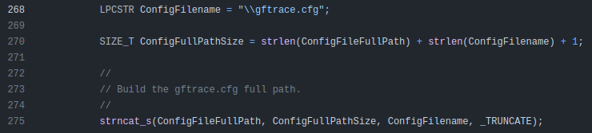

# Go Binary Analysis with gftrace

[htb-napper](/tags#htb-napper ) [go](/tags#go ) [gftrace](/tags#gftrace )
[elastic](/tags#elastic ) [reverse-engineering](/tags#reverse-engineering )
[hook](/tags#hook ) [source-code](/tags#source-code )  
  
May 7, 2024

  * [HTB: Napper](/2024/05/04/htb-napper.html)
  * gftrace

gftrace is a command line Windows tool that will run a Go binary and log all
the Windows API calls made as it runs. Having just finished solving Napper
from HackTheBox a few days before learning of this tool, it seems obvious to
try to apply it to the Go binary from that box. I’ll also give a brief
overview of how it works, walking through the source code from GitHub.
Overall, the tool is a bit raw, but a useful on to keep in my toolbox and
something to keep an eye on.

## Background

### Napper

In the Napper box from HackTheBox, the target has decided to build their own
custom LAPS solution to rotate an administrative password. It works by running
a Go binary, `a.exe`, every 5 minutes. This binary will use a seed value to
seed the Go random number generator and generate an encryption key. It then
encrypts a long random string, storing the seed and the encrypted value in an
ElasticSearch instance. Finally, it updates the backup user’s password to be
the long random string.

### gftrace

gftrace is available at [this GitHub
repo](https://github.com/leandrofroes/gftrace). There’s a lot of good detail
in the `README.md`. Golang uses a single function `asmstdcall` to interact
with the Window API. `gftrace` runs the program while watching all calls and
returns from this function, and logs them to the terminal.

This raises the most important point for using `gftrace` \- IT IS RUNNING THE
BINARY. For cases like Napper, this turns out to be very useful. But if
working with real malware, be very careful to run in a contained environment
with snapshots and a controlled network.

## gftrace + Napper

### Getting Full Run

#### Missing .env

I’ll download the latest `gftrace` release, and run it pointing to `a.exe`:

    
    
    PS > C:\tools\gftrace64\gftrace.exe a.exe
    
    - CreateFileW(".env", 0x80000000, 0x3, 0x0, 0x3, 0x2000001, 0x0, 0x0, 0x0) = 0xffffffff (-1)
    - GetTimeZoneInformation(0xc0000cb774, 0x0, 0x0) = 0x2 (2)
    2024/05/07 07:04:12 Error loading .env file
    
    
    [+] Trace finished! Press "Enter" to close...
    

Right away it is showing `CreateFileW` called on `.env`, and the return value
is -1, which means it failed. It also calls `GetTimeZoneInformation`.

#### Missing Tunnel

I’ll copy the `.env` file from Napper into the same directory as `a.exe`:

    
    
    ELASTICUSER=user
    ELASTICPASS=DumpPassword$Here
    ELASTICURI=https://127.0.0.1:9200
    

On running again, it gets further:

    
    
    PS > C:\tools\gftrace64\gftrace.exe a.exe
    
    - CreateFileW(".env", 0x80000000, 0x3, 0x0, 0x3, 0x2000001, 0x0, 0x0, 0x0) = 0x180 (384)
    - ReadFile(0x180, 0xc00020a000, 0x200, 0xc0001436ac, 0x0, 0x0) = 0x1 (1)
    - ReadFile(0x180, 0xc000168452, 0x3ae, 0xc0001436ac, 0x0, 0x0) = 0x1 (1)
    - WSASocketW(0x2, 0x1, 0x0, 0x0, 0x0, 0x81) = 0x188 (392)
    - socket(0x2, 0x1, 0x6) = 0x190 (400)
    - WSAIoctl(0x190, 0xc8000006, 0x106ab00, 0x10, 0x10bba90, 0x8, 0xc00011ad9c, 0x0, 0x0) = 0x0 (0)
    - WSASocketW(0x2, 0x1, 0x0, 0x0, 0x0, 0x81) = 0x188 (392)
    - WSASocketW(0x2, 0x1, 0x0, 0x0, 0x0, 0x81) = 0x1a0 (416)
    - WSASocketW(0x2, 0x1, 0x0, 0x0, 0x0, 0x81) = 0x1a4 (420)
    - GetTimeZoneInformation(0xc00014376c, 0x0, 0x0) = 0x2 (2)
    2024/05/07 07:10:29 Error getting response: dial tcp 127.0.0.1:9200: connectex: No connection could be made because the target machine actively refused it.
    
    [+] Trace finished! Press "Enter" to close...
    

The return value from `CreateFileW` is the handle to the file (rather than
-1). It reads the `.env` file, and is starting to make network connections.
Putting in the constants for `WSASocketW` as defined
[here](https://learn.microsoft.com/en-us/windows/win32/api/winsock2/nf-
winsock2-wsasocketw) gives `WSASocketW(AF_INET, SOCK_STREAM, 0, 0, 0,
WSA_FLAG_OVERLAPPED|WSA_FLAG_NO_HANDLE_INHERIT)`.

It’s a bit lacking in that I don’t see it actually trying to make the
connection.

#### Full Run

In this scenario, I’ll need to use
[Chisel](https://github.com/jpillora/chisel) to create a tunnel to the Elastic
instance listening on `localhost:9200` on Napper (see the [blog post on
Napper](/2024/05/04/htb-napper.html) for details).

Once I have that in place, it will run the full binary:

    
    
    PS Z:\hackthebox\napper-10.10.11.240 > C:\tools\gftrace64\gftrace.exe a.exe
    
    - CreateFileW(".env", 0x80000000, 0x3, 0x0, 0x3, 0x2000001, 0x0, 0x0, 0x0) = 0x178 (376)
    - ReadFile(0x178, 0xc000112000, 0x200, 0xc0000cb6ac, 0x0, 0x0) = 0x1 (1)
    - ReadFile(0x178, 0xc000070452, 0x3ae, 0xc0000cb6ac, 0x0, 0x0) = 0x1 (1)
    - WSASocketW(0x2, 0x1, 0x0, 0x0, 0x0, 0x81) = 0x180 (384)
    - socket(0x2, 0x1, 0x6) = 0x188 (392)
    - WSAIoctl(0x188, 0xc8000006, 0x140ab00, 0x10, 0x145ba90, 0x8, 0xc00009ed9c, 0x0, 0x0) = 0x0 (0)
    - setsockopt(0x180, 0xffff, 0x7010, 0xc00005d410, 0x8, 0x0) = 0x0 (0)
    - setsockopt(0x180, 0x6, 0x1, 0xc00009f22c, 0x4, 0x0) = 0x0 (0)
    - setsockopt(0x180, 0xffff, 0x8, 0xc00009f22c, 0x4, 0x0) = 0x0 (0)
    - WSAIoctl(0x180, 0x98000004, 0xc00009f284, 0xc, 0x0, 0x0, 0xc00009f274, 0x0, 0x0) = 0x0 (0)
    - WSASend(0x180, 0xc00005d528, 0x1, 0xc00005d518, 0x0, 0xc00005d4e8, 0x0, 0x0, 0x0) = 0x0 (0)
    - WSARecv(0x180, 0xc00005d458, 0x1, 0xc00005d448, 0xc00005d4c8, 0xc00005d418, 0x0, 0x0, 0x0) = 0xffffffff (-1)
    - WSARecv(0x180, 0xc00005d458, 0x1, 0xc00005d448, 0xc00005d4c8, 0xc00005d418, 0x0, 0x0, 0x0) = 0x0 (0)
    - WSASend(0x180, 0xc00005d528, 0x1, 0xc00005d518, 0x0, 0xc00005d4e8, 0x0, 0x0, 0x0) = 0x0 (0)
    - WSARecv(0x180, 0xc00005d458, 0x1, 0xc00005d448, 0xc00005d4c8, 0xc00005d418, 0x0, 0x0, 0x0) = 0xffffffff (-1)
    - WSASend(0x180, 0xc00005d528, 0x1, 0xc00005d518, 0x0, 0xc00005d4e8, 0x0, 0x0, 0x0) = 0x0 (0)
    - WSARecv(0x180, 0xc00005d458, 0x1, 0xc00005d448, 0xc00005d4c8, 0xc00005d418, 0x0, 0x0, 0x0) = 0xffffffff (-1)
    - WSASend(0x180, 0xc00005d528, 0x1, 0xc00005d518, 0x0, 0xc00005d4e8, 0x0, 0x0, 0x0) = 0x0 (0)
    - GetTimeZoneInformation(0xc0000cb48c, 0x0, 0x0) = 0x2 (2)
    - WSASocketW(0x2, 0x1, 0x0, 0x0, 0x0, 0x81) = 0x1b0 (432)
    - setsockopt(0x1b0, 0xffff, 0x7010, 0xc0000ce790, 0x8, 0x0) = 0x0 (0)
    - setsockopt(0x1b0, 0x6, 0x1, 0xc00009f22c, 0x4, 0x0) = 0x0 (0)
    - setsockopt(0x1b0, 0xffff, 0x8, 0xc00009f22c, 0x4, 0x0) = 0x0 (0)
    - WSAIoctl(0x1b0, 0x98000004, 0xc00009f284, 0xc, 0x0, 0x0, 0xc00009f274, 0x0, 0x0) = 0x0 (0)
    - WSASend(0x1b0, 0xc0000ce8a8, 0x1, 0xc0000ce898, 0x0, 0xc0000ce868, 0x0, 0x0, 0x0) = 0x0 (0)
    - WSARecv(0x1b0, 0xc0000ce7d8, 0x1, 0xc0000ce7c8, 0xc0000ce848, 0xc0000ce798, 0x0, 0x0, 0x0) = 0xffffffff (-1)
    - WSARecv(0x1b0, 0xc0000ce7d8, 0x1, 0xc0000ce7c8, 0xc0000ce848, 0xc0000ce798, 0x0, 0x0, 0x0) = 0x0 (0)
    - WSASend(0x1b0, 0xc0000ce8a8, 0x1, 0xc0000ce898, 0x0, 0xc0000ce868, 0x0, 0x0, 0x0) = 0x0 (0)
    - WSARecv(0x1b0, 0xc0000ce7d8, 0x1, 0xc0000ce7c8, 0xc0000ce848, 0xc0000ce798, 0x0, 0x0, 0x0) = 0xffffffff (-1)
    - WSASend(0x1b0, 0xc0000ce8a8, 0x1, 0xc0000ce898, 0x0, 0xc0000ce868, 0x0, 0x0, 0x0) = 0x0 (0)
    - CreateFileW("NUL", 0x80000000, 0x3, 0x0, 0x3, 0x2000001, 0x0, 0x0, 0x0) = 0x1b4 (436)
    - CreateProcessW("C:\Windows\System32\cmd.exe", "C:\Windows\System32\cmd.exe /c net user backup FIOGIcvUoslXiDffknKDzwTtoLRVmxvDRDFCBteG", 0x0, 0x0, 0x1, 0x80400, "=::=::\", 0x0, 0xc0000cb818, 0xc0000cb6f8, 0x0, 0x0) = 0x1 (1)
    - ReadFile(0x1bc, 0xc00019c400, 0x200, 0xc0001bbcfc, 0x0, 0x0) = 0x1 (1)
    - ReadFile(0x1bc, 0xc000266023, 0x3dd, 0xc0001bbcfc, 0x0, 0x0) = 0x1 (1)
    - ReadFile(0x1bc, 0xc00026605b, 0x3a5, 0xc0001bbcfc, 0x0, 0x0) = 0x0 (0)
    2024/05/07 07:17:19 exit status 2
    
    [+] Trace finished! Press "Enter" to close...
    

This is very cool. While the networking stuff isn’t great, the
`CreateProcessW` call details are awesome!

    
    
    - CreateProcessW("C:\Windows\System32\cmd.exe", "C:\Windows\System32\cmd.exe /c net user backup                                      FIOGIcvUoslXiDffknKDzwTtoLRVmxvDRDFCBteG", 0x0, 0x0, 0x1, 0x80400, "=::=::\", 0x0, 0xc0000cb818, 0xc0000cb6f8, 0x0, 0x0) = 0x1 (1)
    

It shows the call to `cmd.exe` with the full command line. In fact, this would
be enough to solve Napper without and other reverse engineering or coding, as
I can see the password being set.

### Configuration File

#### Default

`gftrace` comes with a `gftrace.cfg` file that must be in the same directory
as `gftrace.exe` that specifies what system calls to log. It’s important to
know this, because other calls will not show up:

    
    
    CreateFileW,ReadFile,WriteFile,MoveFileW,DeleteFileW,SetFilePointerEx,CopyFileW,FindFirstFileW,SetFileAttributesW,GetCurrentDirectoryW,GetUserProfileDirectoryW,SetCurrentDirectoryW,GetTempPathW,GetModuleFileNameW,RemoveDirectoryW,GetSystemDirectoryW,GetFullPathNameW,WSASocketW,socket,setsockopt,gethostbyname,WSARecvFrom,WSASendTo,DnsQuery_W,WSAIoctl,WSASend,WSASendTo,WSARecv,GetAddrInfoW,WinHttpAddRequestHeaders,WinHttpOpen,WinHttpConnect,WinHttpOpenRequest,WinHttpSendRequest,WinHttpReceiveResponse,WinHttpReadData,WinHttpSetOption,WinHttpSetTimeouts,WinHttpGetIEProxyConfigForCurrentUser,WinHttpGetProxyForUrl,WinHttpGetDefaultProxyConfiguration,OpenProcess,CreateProcessW,CreateProcessAsUserW,TerminateProcess,GetCurrentProcessId,ReadProcessMemory,WriteProcessMemory,ConvertSidToStringSidW,CreateMutexW,CreateToolhelp32Snapshot,QueryFullProcessImageNameW,OpenProcessToken,GetTokenInformation,CheckTokenMembership,AdjustTokenPrivileges,LookupAccountSidW,CreateNamedPipeW,ShellExecuteW,WTSGetActiveConsoleSessionId,WTSQuerySessionInformationW,GetLogicalDrives,GetDriveTypeW,GetLogicalDriveStringsW,GetVolumeInformationW,RegCreateKeyExW,RegOpenKeyExW,RegQueryValueExW,RegSetValueExW,RegDeleteKeyW,GetComputerNameExW,LookupAccountNameW,NetUserGetInfo,GetAdaptersAddresses,GetTimeZoneInformation,GetMonitorInfoW,EnumDisplaySettingsW,GetSystemMetrics,GetDC,CreateCompatibleDC,CreateCompatibleBitmap,BitBlt,GetDIBits,SelectObject,GetSystemTimes,RegisterServiceCtrlHandlerExW
    

I don’t love this, as I would prefer to have the option to pass parameters
into the command line rather than changing the full config for different runs.

I thought perhaps that the config was why I wasn’t seeing any kind of
connection in the results, but I tried adding all the calls I could think of
that might have been missed, and none of them came out on running. I wish this
config were a bit more configurable. Not sure if a show all or show all except
this list would be possible given how the tool works, but that would be
awesome.

#### Limited

Still, I can tailor what I want to see for this binary. For example, here the
network stuff isn’t very useful, so I can update the config to just show the
file and process related calls:

    
    
    CreateFileW,CreateProcessW
    

Now when I run, it just shows these lines:

    
    
    PS > C:\tools\gftrace64\gftrace.exe a.exe test.cfg
    
    - CreateFileW(".env", 0x80000000, 0x3, 0x0, 0x3, 0x2000001, 0x0, 0x0, 0x0) = 0x180 (384)
    - CreateFileW("NUL", 0x80000000, 0x3, 0x0, 0x3, 0x2000001, 0x0, 0x0, 0x0) = 0x1ac (428)
    - CreateProcessW("C:\Windows\System32\cmd.exe", "C:\Windows\System32\cmd.exe /c net user backup oXzLKiYHpyiRmkjAPfzLXSMzoOqMzHoVcinVwISa", 0x0, 0x0, 0x1, 0x80400, "=::=::\", 0x0, 0xc000187818, 0xc0001876f8, 0x0, 0x0) = 0x1 (1)
    2024/05/07 07:43:41 exit status 2
    
    [+] Trace finished! Press "Enter" to close...
    

## Under The Hood

### Overview

`gftrace` is broken into two projects, `injector` and `tracer`:

Each has an [MSBuild project file](https://learn.microsoft.com/en-
us/cpp/build/reference/vcxproj-file-structure?view=msvc-170) (`.vcxproj`)
file.

### injector

`injector` has only three files:

`injector.c` is the interesting one. It has a single `main` function that
handles the arguments. It makes sure there’s at least two arguments (the
binary name itself plus the binary to run), and then gets the full command
line string, and throws away up to the first space:

Next it uses the new `CmdLine` string (which is basically all the arguments
except the first, which would be `gftrace.exe`) to create a new process in a
suspended state:

Then it does a bunch of checks and eventually gets the file `gftrace.dll` and
the address of `LoadLibraryA` from `kerneldll.32`:

It makes space for the new DLL in the process and writes the DLL in:

It then starts a thread in the process loading the new DLL, waits for it,
resumes the process, and runs:

Effectively this has started the process as passed in (including any
arguments), injected `gftrace.dll` into that process and loaded it in a
thread.

### tracer

#### Overview

`tracer` is a bit more complicated, with multiple `.c` and `.h` files for
different parts of the functionality:

#### utils.c

`utils.c` includes a function `InitTargetFuncList`
([source](https://github.com/leandrofroes/gftrace/blob/master/tracer/utils.c#L232-L395)),
responsible for reading in the config and parsing it into a data structure of
function names. It does this by getting the full path to the DLL:

And building a string with the same folder but with `gftrace.cfg`:

It loops over the text looking for “,” to break on and count items:

And later filling out the structure:

#### hooks.c

`hooks.c` manages hooking functions necessary to log:

Eventually a looked call will make it to here:

[« HTB: Napper](/2024/05/04/htb-napper.html)

