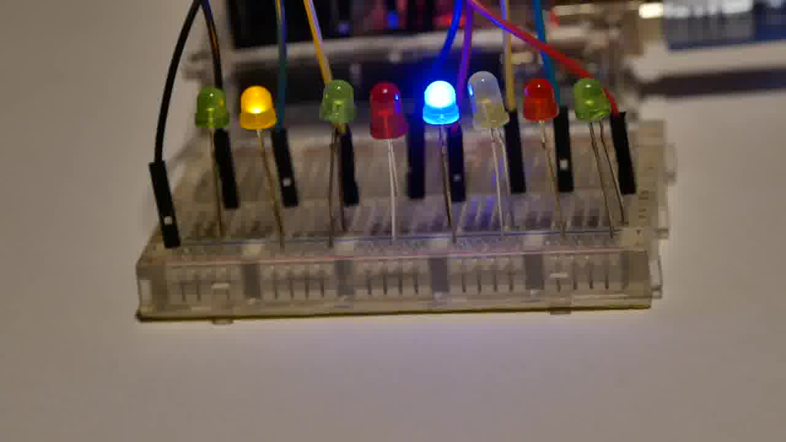
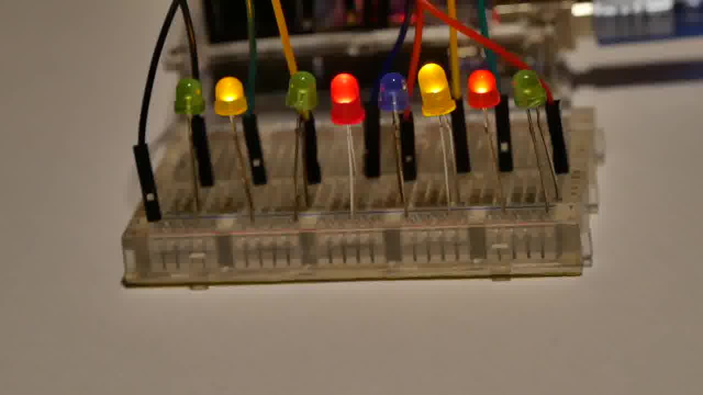

# Hackvent 2019 - Easy

[ctf](/tags#ctf ) [hackvent](/tags#hackvent ) [forensics](/tags#forensics )
[stereolithography](/tags#stereolithography ) [stl](/tags#stl ) [clara-
io](/tags#clara-io ) [aztec-code](/tags#aztec-code ) [hodor](/tags#hodor )
[ahk](/tags#ahk ) [autohotkey](/tags#autohotkey )
[steganography](/tags#steganography ) [python](/tags#python ) [python-
pil](/tags#python-pil ) [bacon](/tags#bacon ) [crypto](/tags#crypto )
[stegsnow](/tags#stegsnow ) [base58](/tags#base58 )  
  
Dec 31, 2019

  * Hackvent 2019  
easy

  * [medium](/hackvent2019/medium)
  * [hard](/hackvent2019/hard)
  * [leet](/hackvent2019/leet)

Hackvent is a fun CTF, offering challenges that start off quite easy and build
to much harder over the course of 24 days, with bonus points for submitting
the flag within the first 24 hours for each challenge. This was the first year
I made it past day 12, and I was excited to finish all the challenges with all
time bonuses! I’ll break the solutions into four parts. The first is the easy
challenges, days 1-7, which provided some basic image forensics, some
interesting file types, an esoteric programming language, and two hidden
flags.

## Day 1

### Challenge

 | HV19.01 censored  
---|---  
Categories: |  FUN   
Level: | easy  
Author: |  M.   
  
> I got this little image, but it looks like the best part got censored on the
> way. Even the tiny preview icon looks clearer than this! Maybe they missed
> something that would let you restore the original content?

### Solution

I spent some time poking at this image, but wasn’t finding much. Eventually, I
ran `strings` on it, and right at the top was a reference to how the blurring
was done:

    
    
    $ strings day1.jpg
     Exif
    Censored by Santa!
    GIMP 2.10.12
    2019:12:24 00:00:00
    Censored by Santa!
    JFIF
    E[Lj
    6squ
    F$;3
    NH}z
    ...[snip]...
    

I figured I’d open it in Gimp and see if there were any tools to reverse the
blurring. When I went to open it, the dialog showed the unblurred QRcode:

The major hint in the original question was “Even the tiny preview icon looks
clearer than this!”. I took a screenshot of it, and pasted it into
KolourPaint, and zoomed in. At 1000%, the QRcode was very clear:

I snapped a picture with my reader on my phone, and got back the flag:

**Flag:`HV19{just-4-PREview!}`**

I can also extract the preview/thumbnail using `exiftool`:

    
    
    $ exiftool -b -ThumbnailImage day1.jpg > day1_thumb.jpg
    

## Day 2

### Challenge

 | HV19.02 Triangulation  
---|---  
Categories: |  FUN   
Level: | easy  
Author: |  drschottky   
  
> Today we give away decorations for your Christmas tree. But be careful and
> do not break it.

It comes with a file, `HV19.02-Triangulation.zip`. Inside the zip, there’s a
single file:

    
    
    $ unzip -l Triangulation.zip 
    Archive:  Triangulation.zip
      Length      Date    Time    Name
    ---------  ---------- -----   ----
       414084  2019-09-29 21:47   Triangulation.stl
    ---------                     -------
       414084                     1 file
    

[Triangulation.zip](/files/hv19-Triangulation.zip)

### Solution

#### .stl

I was not familiar with `.stl` files, but I learned that it is short for
[stereolithography](https://en.wikipedia.org/wiki/STL_\(file_format\)), and is
native to CAD software for drawing 3D systems. They can come in an ascii or a
binary format. When I run `file` on this file, it reports `data`, indicating
this is the binary format:

    
    
    $ file Triangulation.stl 
    Triangulation.stl: data
    

It wasn’t necessary for this challenge, but I did find
[convertSTL](https://github.com/cmpolis/convertSTL), which will translate
between the two formats. When I converted to the ascii representation, I can
see it is defining surfaces:

    
    
    $ head Triangulation-ascii.stl 
    solid 
      facet normal 3.043928E-01 -8.969041E-01 -3.207929E-01
        outer loop
          vertex 1.150800E+01 2.341580E+00 3.689600E+01
          vertex 1.144000E+01 2.300619E+00 3.694600E+01
          vertex 9.219000E+00 1.794000E+00 3.625500E+01
        endloop
      endfacet
      facet normal 9.450072E-01 6.206107E-02 3.211071E-01
        outer loop
    

#### Loading the File

The wikipedia page for stl includes a list of [software that can handle STL
data](https://en.wikipedia.org/wiki/STL_\(file_format\)#Software_that_can_handle_STL_data).
I was immediately drawn to [Clara.io](https://clara.io), as it was free and
online. After creating an account, I’m taken to “Your Documents”, which is
empty. I’ll hit the Upload button, and give it my stl file:

When I hit create, I see the 3D object:

#### Edit

Given the hint not to break it, I suspect the flag is inside the ball. I’ll
hit the “Edit Online” button to go to the editor:

Interestingly, right away I can see something going on inside the ball in the
wireframe version:

I’ll hit “Select All” in the Tools tab, and then hit the box that is the Face
tool. Then I can start selecting areas and deleting them until I get only
what’s left in the middle:

What I’m left with is a thing that looks kind of like a QRcode. It is more
clear in the “Realistic” view, as opposed to the Wireframe:

#### Aztec Code

This looks like a QRcode, but it doesn’t have the squares in the three
corners. I googled “qr code with box in middle” and looked at image results,
and about 5 rows down, I saw this:

An [Aztec Code](https://en.wikipedia.org/wiki/Aztec_Code) is a 2D barcode
format, and [zxing.org](https://zxing.org/w/decode)(a really good QRcode
reader online) also handles it. I took a screenshot of the image like about
and submitted it, but it didn’t work.

Then I realized that the lighter grey in my picture should be the black, and
the darker blue should be the white. I opened the image in Kolour Paint, and
used the paint bucket to fill in the light areas with black:

I started to do the blue areas as white, but they didn’t fill easily. I tried
submitting this as is to [zxing.org](https://zxing.org/w/decode.jspx), and it
decoded, returning the flag:

**Flag:`HV19{Cr4ck_Th3_B411!}`**

## Day 3

### Challenge

 | HV19.03 Hodor, Hodor, Hodor  
---|---  
Categories: |  FUN  
PROGRAMMING  
Level: | easy  
Author: |  otauk  
trolli101  

>
>     $HODOR: hhodor. Hodor. Hodor!?  = `hodor?!? HODOR!? hodor? Hodor oHodor.
> hodor? , HODOR!?! ohodor!?  dhodor? hodor odhodor? d HodorHodor  Hodor!?
> HODOR HODOR? hodor! hodor!? HODOR hodor! hodor? !
>  
>     hodor?!? Hodor  Hodor Hodor? Hodor  HODOR  rhodor? HODOR Hodor!?
> h4Hodor?!? Hodor?!? 0r hhodor?  Hodor!? oHodor?! hodor? Hodor  Hodor! HODOR
> Hodor hodor? 64 HODOR Hodor  HODOR!? hodor? Hodor!? Hodor!? .
>  
>     HODOR?!? hodor- hodorHoOodoOor Hodor?!? OHoOodoOorHooodorrHODOR hodor.
> oHODOR... Dhodor- hodor?! HooodorrHODOR HoOodoOorHooodorrHODOR RoHODOR...
> HODOR!?! 1hodor?! HODOR... DHODOR- HODOR!?! HooodorrHODOR Hodor-
> HODORHoOodoOor HODOR!?! HODOR... DHODORHoOodoOor hodor. Hodor!
> HoOodoOorHodor HODORHoOodoOor 0Hooodorrhodor HoOodoOorHooodorrHODOR 0=`;
>     hodor.hod(hhodor. Hodor. Hodor!? );
>  

### Solution

A bit of Googling leads to [hodor lang](http://www.hodor-lang.org/). Another
silly language. It is basically JavaScript with certain keywords and letters
replaced with variations on Hodor according to this
[legend](https://github.com/hummingbirdtech/hodor/blob/master/legend.js).

For this challenge, it’s as simple as installing the `node` package:

    
    
    # npm install -g hodor-lang
    npm WARN npm npm does not support Node.js v10.17.0
    npm WARN npm You should probably upgrade to a newer version of node as we
    npm WARN npm can't make any promises that npm will work with this version.
    npm WARN npm Supported releases of Node.js are the latest release of 4, 6, 7, 8, 9.
    npm WARN npm You can find the latest version at https://nodejs.org/
    /usr/local/bin/hodor -> /usr/local/lib/node_modules/hodor-lang/bin/hodor
    /usr/local/bin/js2hd -> /usr/local/lib/node_modules/hodor-lang/bin/js2hd
    + hodor-lang@1.0.2
    added 54 packages from 41 contributors in 2.636s
    

Now I can just run the interpreter on the code:

    
    
    # hodor hodor.hd 
    HODOR: \-> hodor.hd
    Awesome, you decoded Hodors language! 
    
    As sis a real h4xx0r he loves base64 as well.
    
    SFYxOXtoMDFkLXRoMy1kMDByLTQyMDQtbGQ0WX0=
    

I’ll decode the base64 to get the flag:

    
    
    $ echo SFYxOXtoMDFkLXRoMy1kMDByLTQyMDQtbGQ0WX0= | base64 -d
    HV19{h01d-th3-d00r-4204-ld4Y}
    

**Flag:`HV19{h01d-th3-d00r-4204-ld4Y}`**

## Day 4

### Challenge

 | HV19.04 password policy circumvention  
---|---  
Categories: |  FUN   
Level: | easy  
Author: |  DanMcFly   
  
> Santa released a new password policy (more than 40 characters, upper, lower,
> digit, special).
>
> The elves can’t remember such long passwords, so they found a way to
> continue to use their old (bad) password:
>  
>  
>     merry christmas geeks
>  

There’s also a zip file. It contains an `.ahk` file:

    
    
    $ unzip -l HV19-PPC.zip 
    Archive:  HV19-PPC.zip
      Length      Date    Time    Name
    ---------  ---------- -----   ----
          630  2019-12-03 22:34   HV19-PPC.ahk
    ---------                     -------
          630                     1 file
    

[HV19-PPC.ahk](/files/HV19-PPC.ahk)

### Solution

#### Background

The `.ahk` file is unicode text, with Windows line endings:

    
    
    $ file HV19-PPC.ahk 
    HV19-PPC.ahk: UTF-8 Unicode (with BOM) text, with CRLF line terminators
    

[AutoHotKey](https://www.autohotkey.com/) is a scripting language that allows
to you map various key strokes into complex operations and substitutions.
Here’s this script:

    
    
    ::merry::
    FormatTime , x,, MM MMMM yyyy
    SendInput, %x%{left 4}{del 2}+{right 2}^c{end}{home}^v{home}V{right 2}{ASC 00123}
    return
    
    ::christmas::
    SendInput HV19-pass-w0rd
    return
    
    :*?:is::
    Send - {del}{right}4h
    
    :*?:as::
    Send {left 8}rmmbr{end}{ASC 00125}{home}{right 10}
    return
    
    :*?:ee::
    Send {left}{left}{del}{del}{left},{right}e{right}3{right 2}e{right}{del 5}{home}H{right 4}
    return
    
    :*?:ks::
    Send {del}R3{right}e{right 2}3{right 2} {right 8} {right} the{right 3}t{right} 0f{right 3}{del}c{end}{left 5}{del 4}
    return
    
    ::xmas::
    SendInput, -Hack-Vent-Xmas
    return
    
    ::geeks::
    Send -1337-hack
    return
    

#### Manual Solution

That’s eight different macros that will run when text that matches them is
entered.

I’m given the text the elves want to use: `merry christmas geeks`.

The key here is to start typing, and watch for a match.

I’ll enter `merry `, and I have the first match. It saves the current
date/time in the format `12 December 2019` as `x`. Then it sends that,
followed by left 4 times, and two deletes, leaving (with the cursor before the
`1` in `19`):

    
    
    12 December 19
    

Next `+{right 2}` will select the next two characters (`19`), the `^c` will
sent ctrl-c or copy, `{end}` will move to the end of the line, but then
`{home}` will move to the front of the line, where `^v` or ctrl-v will paste:

    
    
    1912 December 19
    

Finally `{home}` moves to the start of the line, then there’s a `V`, then
right two spaces, and `{ASC 00123}`, which is the `{`:

    
    
    V19{12 December 19
    

So after entering `merry `(with a space on the end), I’ve got the above with
the cursor after the `{`. I’ll continue entering `christmas`. When I get to
`chri`, the input looks like:

    
    
    V19{chri12 December 19
    

Next when I hit `s`, the pattern for `is` matches, so the `is` goes away, and
it’s replaced by `- {del}{right}4h`. That becomes (cursor after the `h`):

    
    
    V19{chr- 24h December 19
    

But I’ll notice the `is` rule doesn’t have a `return`…so it keeps going into
the next rule for `as`: `Send {left 8}rmmbr{end}{ASC 00125}{home}{right 10}`.
That gives (with the cursor between the `ch`):

    
    
    V19{rmmbrchr- 24h December 19}
    

I’ll enter `tm`:

    
    
    V19{rmmbrctmhr- 24h December 19}
    

Now I enter `as`, triggering the same rule as above from the cursor between
the `mh`:

    
    
    V19{rmmbrrmmbrctmhr- 24h December 19}}
    

The cursor is now ten characters in, between `rr` and `mm`. I start with space
then `g`:

    
    
    V19{rmmbrr gmmbrctmhr- 24h December 19}}
    

Next comes `ee`, which triggers a rule, `Send
{left}{left}{del}{del}{left},{right}e{right}3{right 2}e{right}{del
5}{home}H{right 4}`, leaving the cursor just inside the `{`:

    
    
    HV19{rmmbr,rem3mebr- 24h December 19}}
    

Finally, I enter `ks`, which triggers `{del}R3{right}e{right 2}3{right 2}
{right 8} {right} the{right 3}t{right} 0f{right 3}{del}c{end}{left 5}{del 4}`:

    
    
    HV19{R3memb3r, rem3mber - the 24th 0f December}
    

**Flag:`HV19{R3memb3r, rem3mber - the 24th 0f December}`**

#### Shortcut

Alternatively to understanding how each of the macros work, I could just
install AHK on a VM and run this script. After downloading and running the
installer, I’ll create a new file called `HV19-4.ahk`, and paste in the
script. Now I’ll double click on the script to run it, and then go into
Notepad and start typing:

It is important not to go too fast, or I could be typing while AHK is and mess
up the cursor position.

## Day 5

### Challenge

 | HV19.05   
---|---  
Categories: |  FUN   
Level: | easy  
Author: |  inik   
  
> To handle the huge load of parcels Santa introduced this year a parcel
> tracking system. He didn’t like the black and white barcode, so he invented
> a more solemn barcode. Unfortunately the common barcode readers can’t read
> it anymore, it only works with the pimped models santa owns. Can you read
> the barcode

### Solution

A standard barcode is coded using if a stripe if white or black, so the size
and spacing of the stripes holds the data. If I upload this code to
[zxing.org](https://zxing.org/w/decode.jspx), it will read it as a
[CODE_128](https://en.wikipedia.org/wiki/Code_128) format barcode, with the
information “Not the solution”:

That tells me that the information is not stored in the widths of the bars,
since a different message is encoded there. The only other place it could be
stored then is the colors themselves (something not typically involved in
standard barcodes).

I wrote a small Python program to take a look at the pixels:

    
    
    #!/usr/bin/env python3
    
    import sys
    from PIL import Image
    
    
    im = Image.open('157de28f-2190-4c6d-a1dc-02ce9e385b5c.png')
    
    width, _ = im.size
    
    for i in range(width):
        pix = im.getpixel((i, 5))
        print([chr(x) if x < 128 else x for x in pix])
    

For each pixel, I’ll print the three RGB values, showing it as a character if
it’s less than 128, or the int value otherwise. When I run this, the output
looks like:

    
    
    [255, 255, 255]
    [255, 255, 255]
    [255, 255, 255]
    [255, 255, 255]
    [255, 255, 255]
    [255, 255, 255]
    [255, 255, 255]
    [255, 255, 255]
    [255, 255, 255]
    [255, 255, 255]
    [255, 255, 255]
    [255, 255, 255]
    [255, 255, 255]
    [255, 255, 255]
    [255, 255, 255]
    [255, 255, 255]
    [255, 255, 255]
    [255, 255, 255]
    [255, 255, 255]
    [255, 255, 255]
    [255, 255, 255]
    [255, 255, 255]
    [255, 255, 255]
    [255, 255, 255]
    [255, 255, 255]
    [255, 255, 255]
    [255, 255, 255]
    [255, 255, 255]
    [255, 255, 255]
    [255, 255, 255]
    ['s', 'P', 'X']
    ['s', 'P', 'X']
    ['s', 'P', 'X']
    ['s', 'P', 'X']
    ['s', 'P', 'X']
    ['s', 'P', 'X']
    [255, 255, 255]
    [255, 255, 255]
    [255, 255, 255]
    ['t', 'Y', '8']
    ['t', 'Y', '8']
    ['t', 'Y', '8']
    [255, 255, 255]
    [255, 255, 255]
    [255, 255, 255]
    [255, 255, 255]
    [255, 255, 255]
    [255, 255, 255]
    ['l', 'P', 'Y']
    ['l', 'P', 'Y']
    ['l', 'P', 'Y']
    ['l', 'P', 'Y']
    ['l', 'P', 'Y']
    ['l', 'P', 'Y']
    ['l', 'P', 'Y']
    ['l', 'P', 'Y']
    ['l', 'P', 'Y']
    [255, 255, 255]
    

Since I already decided that the width of a given stripe doesn’t matter, I’m
going to update to ignore repeated lines by saving the previous line and not
printing if it matches the current:

    
    
    #!/usr/bin/env python3
    
    import sys
    from PIL import Image
    
    
    im = Image.open('157de28f-2190-4c6d-a1dc-02ce9e385b5c.png')
    
    width, _ = im.size
    
    prev = ''
    for i in range(width):
        pix = im.getpixel((i, 5))
        if not pix == prev:
            print([chr(x) if x < 128 else x for x in pix])
        prev = pix
    

Now I get:

    
    
    [255, 255, 255]
    ['s', 'P', 'X']
    [255, 255, 255]
    ['t', 'Y', '8']
    [255, 255, 255]
    ['l', 'P', 'Y']
    [255, 255, 255]
    ['m', 'E', 'I']
    [255, 255, 255]
    ['r', '1', 'O']
    [255, 255, 255]
    ['y', '3', 'F']
    [255, 255, 255]
    ['s', 'P', '0']
    [255, 255, 255]
    ['e', 'Q', 'Z']
    [255, 255, 255]
    ['g', '8', 'P']
    [255, 255, 255]
    ['z', '9', '4']
    [255, 255, 255]
    ['u', 'L', 'S']
    [255, 255, 255]
    ['h', 'T', '8']
    [255, 255, 255]
    ['e', 'G', 'H']
    [255, 255, 255]
    ['z', '0', 'V']
    [255, 255, 255]
    ['a', 'X', '1']
    [255, 255, 255]
    ...[snip]...
    

It seems like the rows of 255s (white) are likely just spacing. I’ll remove
those. Everything else is coming out ASCII, which is nice. I’ll try just
grouping all those characters into a stream and seeing if it means anything.
I’ll change the output for characters greater than 128 to an empty string, and
joing the results into a string, appending it to `output`, and print it at the
end:

    
    
    #!/usr/bin/env python3
    
    import sys
    from PIL import Image
    
    
    im = Image.open('157de28f-2190-4c6d-a1dc-02ce9e385b5c.png')
    
    width, _ = im.size
    
    prev = ''
    output = ''
    for i in range(width):
        pix = im.getpixel((i, 5))
        if not pix == prev:
            output += ''.join(([chr(x) if x < 128 else '' for x in pix]))
        prev = pix
    
    print(output)
    

When I run this, I get a nice ASCII string:

    
    
    $ python3 solve_5.py 
    sPXtY8lPYmEIr1Oy3FsP0eQZg8Pz94uLShT8eGHz0VaX1g09lO{tODlJ1gJfxIfzIigUcjSuiHliQtv6_v0tsMosI_aQgiI3e4twS_b9atE_uGSh4Pa8TlN_qVRcV3lPaf6dq5erGrcO}wXSfL1q00vV9eW0nJOgWMx2Ze3Ek20o3EaS3lRNtUFy8PvB6eBE
    

This isn’t the flag, but I see both `{` and `}` in there. I decided to look at
each of the RBG separately. I’ll set `output` to a list of three strings, and
for each pixel, append each character to a different string:

    
    
    #!/usr/bin/env python3
    
    import sys
    from PIL import Image
    
    
    im = Image.open("157de28f-2190-4c6d-a1dc-02ce9e385b5c.png")
    
    width, _ = im.size
    
    prev = ""
    output = ["", "", ""]
    for i in range(width):
        pix = im.getpixel((i, 5))
        if not pix == prev:
            output = [o + chr(p) if p < 128 else o for p, o in zip(pix, output)]
        prev = pix
    
    print("\n".join(output))
    

When I run this, I see the flag in the output:

    
    
    $ python3 solve_5.py 
    stlmrysegzuhezagltlgxzgjiivvssaiewbtuhalqclfqrcwfqvengxekoaltyve
    PYPE13PQ89LTG0X0OOJJIIUSHQ60MIQI4S9EG48NVVP65GOXL0VWJW2323SRU8BB
    X8YIOF0ZP4S8HV19{D1fficult_to_g3t_a_SPT_R3ader}S1090OMZE0E3NFP6E
    

It’s not clear to me what the strings before or after it are, but I can
definitely extract a flag there.

**Flag:`HV19{D1fficult_to_g3t_a_SPT_R3ader}`**

## Day 6

### Challenge

 | HV19.06   
---|---  
Categories: |  CRYPTO  
FUN  
Level: | easy  
Author: |  T.B.   
  
I’m given a text, with weird individual characters in italics:

### Solution

There’s a couple hints in there. The first is that the piece is talking about
Francie Bacon, and that it’s a crypto challenge. If I Google Francis Bacon
cryptography, the first hit is interesting:

The Bacon Cipher is typically a series of `a` and `b` in groups of five that
make letters. But there’s not reason it can’t be anything else with two
options. This leads to the first thing I noticed in the challenge. The weird
italics in certain spots.

Because I have to log in to hackvent, and I didn’t want to bother with that in
my script, I saved the page as `page.html`. Then I used `re` to find the block
of text I was interested in. The italics stuff stops towards the end, but I
grabbed that entire section. At first I tried to apply the Bacon cipher to all
characters, and it didn’t work. Then I tried just doing it to A-Z, and it
worked!

    
    
    #!/usr/bin/env python3
    
    import re
    import string
    
    
    with open("page.html", "r") as f:
        page = f.read().replace("\n", " ")
    
    in_text = re.findall(r'
(<em>F.*.)
<pre class="jss1269">', page)[0]
    
    bacon_in = ""
    ital = False
    
    while in_text:
        if in_text.startswith("<em>"):
            in_text = in_text[4:]
            ital = True
        elif in_text.startswith("</em>"):
            in_text = in_text[5:]
            ital = False
        elif in_text[0] not in string.ascii_letters:
            in_text = in_text[1:]
        elif not ital:
            bacon_in += "a"
            in_text = in_text[1:]
        else:
            bacon_in += "b"
            in_text = in_text[1:]
    
    lookup = {
        "aaaaa": "A",
        "aaaab": "B",
        "aaaba": "C",
        "aaabb": "D",
        "aabaa": "E",
        "aabab": "F",
        "aabba": "G",
        "aabbb": "H",
        "abaaa": "I",
        "abaab": "J",
        "ababa": "K",
        "ababb": "L",
        "abbaa": "M",
        "abbab": "N",
        "abbba": "O",
        "abbbb": "P",
        "baaaa": "Q",
        "baaab": "R",
        "baaba": "S",
        "baabb": "T",
        "babaa": "U",
        "babab": "V",
        "babba": "W",
        "babbb": "X",
        "bbaaa": "Y",
        "bbaab": "Z",
    }
    
    bacon_in = bacon_in[: (len(bacon_in) // 5) * 5]
    
    result = ""
    for i in range(0, len(bacon_in), 5):
        result += lookup[bacon_in[i : i + 5]]
    
    print(result)
    

When I run this, I get a message:

    
    
    $ ./solve_day6.py 
    SANTALIKESHISBACONBUTALSOTHISBACONTHEPASSWORDISHVXBACONCIPHERISSIMPLEBUTCOOLXREPLACEXWITHBRACKETSANDUSEUPPERCASEFORALLCHARACTERAAAAAAAAAAAAAAAAAAAAAAAAAAAAAAAAAAAAAAAAAAAAAAAAAAAAAAAAAAAAAAAAAAAAAAAAAAAAAAAAAAAAAAAAAAAAAAAAAAAAAAAAAAAAAAAAAAAAAAAAAAAAAAAAAAAAA
    

I’ll add spaces:

> SANTA LIKES HIS BACON BUT ALSO THIS BACON THE PASSWORD IS
> HVXBACONCIPHERISSIMPLEBUTCOOLX REPLACE X WITH BRACKETS AND USE UPPERCASE FOR
> ALL CHARACTER

This tells me to take the flag and change the Xs to {}, giving:

**Flag:`HV19{BACONCIPHERISSIMPLEBUTCOOL}`**

## Hidden 1

### Challenge

 | HV19.H1 Hidden One  
---|---  
Categories: |  FUN   
Level: | novice  
Author: |  hidden   
  
> Sometimes, there are hidden flags. Got your first?

### Solution

This challenge showed up on the list at the same time as Day 6, so it seems
related. The data at the bottom of the page is particularly interesting:

If I click on the little clipboard at the top right:

When I paste that, I can see there’s extra whitespace on the end of each line:

    
    
    $ xxd textarea.txt 
    00000000: 426f 726e 3a20 4a61 6e75 6172 7920 3232  Born: January 22
    00000010: 0920 2020 2020 0920 0920 2020 0920 2020  .     . .   .   
    00000020: 0920 0920 2020 2020 2020 0920 2020 2020  . .       .     
    00000030: 0920 2009 2020 0a44 6965 643a 2041 7072  .  .  .Died: Apr
    00000040: 696c 2039 2020 2009 2020 0920 0920 2020  il 9   .  . .   
    00000050: 2009 2020 0920 2020 2020 2009 2020 2009   .  .      .   .
    00000060: 0920 2009 2020 0a4d 6f74 6865 723a 204c  .  .  .Mother: L
    00000070: 6164 7920 416e 6e65 2020 2009 0920 0920  ady Anne   .. . 
    00000080: 2020 0920 2020 0920 2020 2020 2009 2020    .   .      .  
    00000090: 0920 2020 2020 2009 2020 0a46 6174 6865  .      .  .Fathe
    000000a0: 723a 2053 6972 204e 6963 686f 6c61 7309  r: Sir Nicholas.
    000000b0: 2009 2020 2020 2020 0909 2020 2020 0920   .      ..    . 
    000000c0: 2020 2009 2020 0920 2009 2020 2020 2020     .  .  .      
    000000d0: 0920 2020 2020 200a 5365 6372 6574 733a  .      .Secrets:
    000000e0: 2075 6e6b 6e6f 776e 2020 2020 2020 0920   unknown      . 
    000000f0: 0920 2009 2009 2020 2020 0920 2020 2009  .  . .    .    .
    00000100: 2020 2009 2020 2020 2020 2009 2020 0a       .       .  .
    

At first my mind went to the [wopr challenge from Flare-On 2019](/flare-
on-2019/wopr.html#eye). There, tabs and spaces were used as 1s and 0s to make
binary. But that didn’t work here. I also looked at the [Whitespace esoteric
language](https://en.wikipedia.org/wiki/Whitespace_\(programming_language\)),
pasting the text into interpreters like
[this](https://vii5ard.github.io/whitespace/) and
[this](https://naokikp.github.io/wsi/whitespace.html). But it didn’t work.
Eventually, I found
[stegsnow](https://delightlylinux.wordpress.com/2016/12/14/hide-text-in-text-
files-using-stegsnow/). I installed it (`apt install stegsnow`) and gave it a
run:

    
    
    $ stegsnow textarea.txt 
    Warning: residual of 5 bits not output
    iYB     a6i%&P
    

That didn’t work. But then I tried with the `-C` options for compression. If
something is hidden with `-C`, it must be decoded with `-C` as well. This
returned the flag:

    
    
    $ stegsnow -C textarea.txt 
    HV19{1stHiddenFound}
    

**Flag:`HV19{1stHiddenFound}`**

## Day 7

### Challenge

 | HV19.07 Santa Rider  
---|---  
Categories: |  FUN   
Level: | easy  
Author: |  inik   
  
> Santa is prototyping a new gadget for his sledge. Unfortunately it still has
> some glitches, but look for yourself.

I’m given a zip file, which includes the video,
`3DULK2N7DcpXFg8qGo9Z9qEQqvaEDpUCBB1v.mp4`.

[3DULK2N7DcpXFg8qGo9Z9qEQqvaEDpUCBB1v.mp4](/files/hv19-3DULK2N7DcpXFg8qGo9Z9qEQqvaEDpUCBB1v.mp4)

### Solution

I downloaded the embedded `.mp4` and got the one in the archive - they are the
same:

    
    
    $ md5sum *.mp4
    db154b453cc4ee3f8cb375a3d0b8017c  13e4f1a0-bb71-44ec-be54-3f5f23991033.mp4
    db154b453cc4ee3f8cb375a3d0b8017c  3DULK2N7DcpXFg8qGo9Z9qEQqvaEDpUCBB1v.mp4
    

I started to look at the lights. They start going back and forth 6 times, and
then there’s a random seeming pattern in the middle. I used `ffmpeg` to pull
out the frames:

    
    
    $ ffmpeg -i 3DULK2N7DcpXFg8qGo9Z9qEQqvaEDpUCBB1v.mp4 3DULK2N7DcpXFg8qGo9Z9qEQqvaEDpUCBB1v%04d.jpg -hide_banner
    Input #0, mov,mp4,m4a,3gp,3g2,mj2, from '3DULK2N7DcpXFg8qGo9Z9qEQqvaEDpUCBB1v.mp4':
      Metadata:
        major_brand     : isom
        minor_version   : 512
        compatible_brands: isomiso2avc1mp41
        encoder         : Lavf58.20.100
      Duration: 00:00:22.59, start: 0.000000, bitrate: 925 kb/s
        Stream #0:0(und): Video: h264 (High) (avc1 / 0x31637661), yuv420p(tv, bt709/unknown/bt709), 1280x720 [SAR 1:1 DAR 16:9], 914 kb/s, 30 fps, 30 tbr, 15360 tbn, 60 tbc (default)
        Metadata:
          handler_name    : VideoHandler
        Stream #0:1(und): Audio: aac (LC) (mp4a / 0x6134706D), 48000 Hz, stereo, fltp, 2 kb/s (default)
        Metadata:
          handler_name    : SoundHandler
    Stream mapping:
      Stream #0:0 -> #0:0 (h264 (native) -> mjpeg (native))
    Press [q] to stop, [?] for help
    [swscaler @ 0x55e7c0050200] deprecated pixel format used, make sure you did set range correctly
    Output #0, image2, to '3DULK2N7DcpXFg8qGo9Z9qEQqvaEDpUCBB1v%04d.jpg':
      Metadata:
        major_brand     : isom
        minor_version   : 512
        compatible_brands: isomiso2avc1mp41
        encoder         : Lavf58.29.100
        Stream #0:0(und): Video: mjpeg, yuvj420p(pc), 1280x720 [SAR 1:1 DAR 16:9], q=2-31, 200 kb/s, 30 fps, 30 tbn, 30 tbc (default)
        Metadata:
          handler_name    : VideoHandler
          encoder         : Lavc58.54.100 mjpeg
        Side data:
          cpb: bitrate max/min/avg: 0/0/200000 buffer size: 0 vbv_delay: -1
    frame=  677 fps=148 q=24.8 Lsize=N/A time=00:00:22.56 bitrate=N/A speed=4.93x    
    video:13280kB audio:0kB subtitle:0kB other streams:0kB global headers:0kB muxing overhead: unknown
    

I’m left with 677 images. I’ll scan through them to find where the random
pattern starts.

At 273, I come across this:

Since there are eight lights, my first thought it bits. I could look at
different bit orders, but if I assume the lowest bits to the right, this is
0x48. Looking at the ASCII table, that’s `H`. Moving ahead until the lights
change, there’s a few that show the next pattern:

That’s 0x56, or `V`.

Here’s the rest of the frames:

Frame| Image| Hex| ASCII  
---|---|---|---  
273| | 0x48| H  
276| | 0x56| V  
279| | 0x31| 1  
282| | 0x39| 9  
285| | 0x7B| {  
288| | 0x31| 1  
292| | 0x6D| m  
295| | 0x5F| _  
298| | 0x61| a  
302| | 0x6C| l  
305| | 0x73| s  
308| | 0x30| 0  
311| | 0x5F| _  
314| | 0x77| w  
317| | 0x30| 0  
320| | 0x72| r  
323| | 0x6B| k  
326| | 0x31| 1  
329| | 0x6E| n  
332| | 0x67| g  
335| | 0x5F| _  
338| | 0x30| 0  
341| | 0x6E| n  
344| | 0x5F| _  
347| | 0x61| a  
350| | 0x5F| _  
353| | 0x72| r  
356| | 0x33| 3  
359| | 0x6D| m  
362| | 0x30| 0  
365| | 0x74| t  
368| | 0x33| 3  
371| | 0x5F| _  
374| | 0x63| c  
377| | 0x30| 0  
380| | 0x6E| n  
383| | 0x74| t  
386| | 0x72| r  
389| | 0x30| 0  
392| | 0x6C| l  
395| | 0x7D| }  
  
Putting that all together, I get the flag:

**Flag: HV19{1m_als0_w0rk1ng_0n_a_r3m0t3_c0ntr0l}**

## Hidden 2

### Challenge

 | HV19.H2 Hidden Two  
---|---  
Categories: |  FUN   
Level: | novice  
Author: |  inik   
  
> Again a hidden flag.

### Solution

This popped up along side day 7. I noticed when working on day 7 that I could
both download the `mp4` from the page and as a resource. When I unzipped the
downloaded file, I got a `mp4` that was identical to the one I got from the
page.

I’ll also notice that every time I download an object from this framework, it
comes named as a GUID (ie, `13e4f1a0-bb71-44ec-be54-3f5f23991033.mp4`). In
previous challenges, I either got the file directly named as a GUID and I had
to rename it to what it should have been, or it was in a zip with an
expressive name.

So what’s the meaning of `3DULK2N7DcpXFg8qGo9Z9qEQqvaEDpUCBB1v.mp4`. Turns out
that name is base58 encoded. If I drop it in
[here](https://www.browserling.com/tools/base58-decode), I get a flag:

**Flag:`HV19{Dont_confuse_0_and_O}`**

