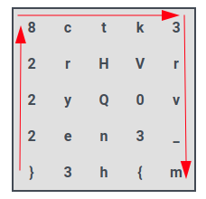

# Hackvent 2023 - Easy

[ctf](/tags#ctf ) [hackvent](/tags#hackvent ) [qrcode](/tags#qrcode )
[python](/tags#python ) [flask](/tags#flask ) [geek-code](/tags#geek-code )
[grille-cipher](/tags#grille-cipher ) [ghidra](/tags#ghidra ) [reverse-
engineering](/tags#reverse-engineering ) [kdenlive](/tags#kdenlive )
[deepskystacker](/tags#deepskystacker ) [video-noise](/tags#video-noise )
[volatility](/tags#volatility ) [stegnaography](/tags#stegnaography )
[stegsolve](/tags#stegsolve ) [transfer-encoding](/tags#transfer-encoding )  
  
Jan 2, 2024

  * easy
  * [medium](/hackvent2023/medium)
  * [hard](/hackvent2023/hard)
  * [leet](/hackvent2023/leet)

Hackvent 2023 was a ton of fun, and this year I made it through 22 of the 24
challenges (25 of 27 counting hidden challenge), only running out of time on
two of the final three. The first seven plus a hidden challenge had QRcodes,
Geek Codes, a Grille Cipher, a very simple RE challenge, image editing, memory
analysis, steg, and a flag hidden in HTTP chunk metadata.

## HV23.01

### Challenge

 | HV23.01 A letter from Santa  
---|---  
Categories: |  FUN   
Level: | easy  
Author: |  coderion   
  
> Finally, after 11 months of resting, Santa can finally send out his presents
> and challenges again. He was writing a letter to his youngest baby elf,
> who’s just learning his **ABC/A-Z** ’s. Can you help the elf read the
> message?
>
> * * *
>
> Hint #1: `■■■■■■ ■ ■■■■■■■ ■■■■■■■`
>
> * * *
>
> The challenge scope includes only the main website on port 443, which you
> get linked to in the `Resources`. Do not attack other ports.
>
> Start the website from the `Resources` and get the flag.
>
> Flag format: `HV23{}`

There’s a download named “Source” and a container resource I can spawn. The
hint was added about 18 hours after the initial release.

### Enumeration

#### Site

The site is a simple form:

The dropdown offers each lowercase ASCII letter:

I can enter any text in the “Your text here…” field.

If I enter “0xdf” and submit, the result looks like this:

The source is much longer than expected, with a ton of empty spans, with only
a few having “0xdf” in them:

[_Click for full
size image_](../img/image-20231201131425032.png)

#### Source Code

The source is for a simple Python Flask application:

    
    
    from flask import Flask, render_template, request
    import string
    
    app = Flask(__name__)
    
    @app.route('/', methods=['GET', 'POST'])
    def index():
        if request.method == 'POST':
            alphabet = {char: "" for char in string.ascii_lowercase}
            alphabet[request.form['alphabet_select']] = request.form['user_input']
    
            return render_template('santa.j2', **alphabet)
        else:
            return render_template('index.html', alphabet=string.ascii_lowercase)
    
    if __name__ == '__main__':
        app.run(host="0.0.0.0")
    

For GET requests, it sends `index.html`. For POST requests, it starts with a
dictionary for each lowercase letter as the key, and an empty string as the
value. Then it sets the selected character’s value to the `user_input` string.
It renders the `santa.j2` template, using `**` as a dictionary unpack. This
means that the dictionary of `{"a": 1, "b": 2}` when passed as `func(**dict)`
is the same as calling `func(a=1, b=2)`.

The `santa.j2` template has all the spans noticed above, but they each have a
template variable in them:

[_Click for full
size image_](../img/image-20231201132047400.png)

So when all but one of the values are the empty string, that explains the
empty spans.

### Analysis

#### Failings / Strategy

I went down a ton of rabbit holes. All the “a” and “b” made me think of Bacon
encoding. Getting the variable in order and looking for various encodings.
Trying to get the first characters to be “HV23{“. None of these led anywhere.

I did a lot of grepping to look for patterns, and there were two things that
helped get me to the answer.

#### Frequency

I’ll use `bash` foo to look at the various spans. There are 625 spans matching
the pattern, and that’s all the spans:

    
    
    oxdf@hacky$ cat templates/santa.j2 | grep -oP "class='.'>{{.}}" | wc -l
    625
    oxdf@hacky$ cat templates/santa.j2 | grep -oP "<span" | wc -l
    625
    

340 are class `a`, and 285 are `b`:

    
    
    oxdf@hacky$ cat templates/santa.j2 | grep -oP "class='.'>{{.}}" | cut -d"'" -f2 | sort | uniq -c 
        340 a
        285 b
    

I can look at the variable letters one by one:

    
    
    oxdf@hacky$ cat templates/santa.j2 | grep -oP "class='.'>{{a}}" | cut -d"'" -f2 | sort | uniq -c 
         22 a
          3 b
    oxdf@hacky$ cat templates/santa.j2 | grep -oP "class='.'>{{b}}" | cut -d"'" -f2 | sort | uniq -c 
          8 a
         17 b
    oxdf@hacky$ cat templates/santa.j2 | grep -oP "class='.'>{{c}}" | cut -d"'" -f2 | sort | uniq -c 
         17 a
          8 b
    oxdf@hacky$ cat templates/santa.j2 | grep -oP "class='.'>{{d}}" | cut -d"'" -f2 | sort | uniq -c 
         16 a
          9 b
    

No real pattern here, except that each one is 25 spans total. I can show 25
letters have 25 spans, with one having none (that’s “z”):

    
    
    oxdf@hacky$ for char in {a..z}; do cat templates/santa.j2 | grep -oP "class='.'>{{${char}}}" | wc -l; done | sort | 
    uniq -c
          1 0
         25 25
    

I’ve got 25 letters and each has 25 results. That’s a square.

#### Web

On submitting “a” and a `_` character, the result is this:

With “b” and `_`, it’s:

“c” gives:

I’m starting to notice a pattern, especially in the top right and left
corners! It’s a QRcode!

### Solving

#### Initial Solve

In real time, my first solve was to use `bash` to get each row of a and b:

    
    
    oxdf@hacky$ for char in {a..z}; do cat templates/santa.j2 | grep -oP "class='.'>{{${char}}}" | cut -d"'" -f 2 | tr -d '\n'; echo; done
    aaaaaaababaaaaaaabaaaaaaa
    abbbbbabbaaababbbbabbbbba
    abaaababaaaaaabbababaaaba
    abaaababaabaaababbabaaaba
    abaaababaaaababbbbabaaaba
    abbbbbabaaaaaababbabbbbba
    aaaaaaababababababaaaaaaa
    bbbbbbbbbbbababbabbbbbbbb
    bbaaaaaabbaabbaaaabaaaaba
    abababbbbbaabbabbaabaabba
    baaabaabbbababaaaaaaaabaa
    abaabbbabbbbabbbbbaaabbbb
    bbabaaabaaaababaababbabaa
    abbbaababbbbbaaabbbbbaaab
    aaabbaababbabaababbabaaba
    babbbabaababababbbabababb
    ababaaaaaababaaaaaaaaabab
    bbbbbbbbbabbabababbbaabaa
    aaaaaaababaaabaaababaabaa
    abbbbbabababbaaaabbbaaabb
    abaaabababababaaaaaaabbab
    abaaababaaaababbbabbbabbb
    abaaababababababaaababbba
    abbbbbabbabbaaabbbabbabba
    aaaaaaabbbabaaaabaabaaaaa
    

Now just replace these with better space fillers:

    
    
    oxdf@hacky$ for char in {a..z}; do cat templates/santa.j2 | grep -oP "class='.'>{{${char}}}" | cut -d"'" -f 2 | tr -d '\n' | tr 'ab' '# '; echo; done
    ####### # ####### #######
    #     #  ### #    #     #
    # ### # ######  # # ### #
    # ### # ## ### #  # ### #
    # ### # #### #    # ### #
    #     # ###### #  #     #
    ####### # # # # # #######
               # #  #        
      ######  ##  #### #### #
    # # #     ##  #  ## ##  #
     ### ##   # # ######## ##
    # ##   #    #     ###    
      # ### #### # ## #  # ##
    #   ## #     ###     ### 
    ###  ## #  # ## #  # ## #
     #   # ## # # #   # # #  
    # # ###### # ######### # 
             #  # # #   ## ##
    ####### # ### ### # ## ##
    #     # # #  ####   ###  
    # ### # # # # #######  # 
    # ### # #### #   #   #   
    # ### # # # # # ### #   #
    #     #  #  ###   #  #  #
    #######   # #### ## #####
    

I took a screencap of that and put it in Kolour Paint, making the background
white and drawing black boxes over the `#`:

It scans!

**Flag:`HV23{qr_c0des_fun}`**

#### Modify Flask

An alternative way to make this QR code is to just modify the flask source so
that it generates all 25 lines in one request:

    
    
    from flask import Flask, render_template
    import string
    
    app = Flask(__name__)
    
    @app.route('/')
    def index():
        result = ""
        for c in string.ascii_lowercase:
            alphabet = {char: "" for char in string.ascii_lowercase}
            alphabet[c] = "_"
            result += render_template('santa.j2', **alphabet)
            result += " \n"
        return result
    
    if __name__ == '__main__':
        app.run(host="0.0.0.0")
    

Rather than returning the single render, it loops over and does all the
renders, appending each with a ` ` between then to give a new line. Now
visiting that page gives the flag:

## HV23.02

### Challenge

 | HV23.02 Who am I?  
---|---  
Categories: |  FUN   
Level: | easy  
Author: |  ***explo1t***   
  
> Have you ever wished for an efficient dating profile for _geeks_? Here’s a
> great example:
>  
>  
>     G d--? s+: a+++ C+++$ UL++++$ P--->$ L++++$ !E--- W+++$ N* !o K--? w O+
> M-- V PS PE Y PGP++++ t+ 5 X R tv-- b DI- D++ G+++ e+++ h r+++ y+++
>  
>
> * * *
>
> Flag format: `HV23{<Firstname Lastname>}`

### Solution

The main challenge here is recognizing the format of this string. If I ask
ChatGPT, it gives the answer:

Wikipedia has a nice page on [Geek
Code](https://en.wikipedia.org/wiki/Geek_Code). It’s used to show other geeks
what and how geeky you are. Unfortunately, there’s no name in ChatGPT’s
output.

Searching for this string shows another site, the [Geek Code
Decoder](https://mj.ucw.cz/geek/?):

On this site, it breaks down the code as well, similar to ChatGPT, but there’s
a place where I notice a name:

[Philip Zimmerman](https://en.wikipedia.org/wiki/Phil_Zimmermann) is the
creator of PGP. It’s also the flag.

**Flag:`HV23{Philip Zimmerman}`**

## HV23.03

### Challenge

 | HV23.03 Santa's grille  
---|---  
Categories: |  CRYPTO  
FUN  
Level: | easy  
Author: |  brp64   
  
> While contemplating the grille and turning some burgers, Santa decided to
> send all the hackers worldwide some season’s greetings.

### Solution

#### Grille Cipher

The is a cipher called the [Grille
Cipher](https://en.wikipedia.org/wiki/Grille_\(cryptography\)). It involves
putting the message into a grid (like the one shown above), and then making an
overlay sheet of paper with holes over certain squares. The decode the
ciphertext, the reader simply records the values that show through, and then
rotates the grid 90 degrees, showing a new set of characters.

#### Solver

[dcode.fr](https://en.wikipedia.org/wiki/Grille_\(cryptography\)) has a
decoder for Grille, but it doesn’t work with symbols, and seems a bit buggy to
me. [This one](https://merri.cx/enigmator/cipher/grille.html) is really nice
(with one issue). I’ll enter the grid and it shows it to me:

To set the Grille, I know the first letter must be “H”. So there can’t be any
before that:

The next letter must be “V”, so that turns on the next block:

The next character has to be “2”, so it must be one of the two in green, and
then one of the “3” in red:

For now I’ll just pick one of each, and also turn on the “{“:

It’s possible that this is the solution, but clicking “Decrypt” does not give
a valid flag: “HV23{t02e3crvenrVryh”. I’ll try each of the four combinations
of “2” and “3”, but none work. The issue is that the last character has to be
“}”. That means after three rotations, it must be under a hole, and the last
hole.

After three clockwise rotations, it will be in the bottom right corner:

That means I should turn that bottom corner on:

The resulting flag doesn’t look right: “HV23{mt02e3}8crven3rVryh”, for two
reasons:

  1. It’s kinda jibberish.
  2. It seems to be rotating counter-clockwise (hence the “}” showing up at the end of the second group of six characters, not the last.)

I can fix the first issue by messing with which “2” and “3” I select. This
configuration gives the necessary pieces:

The resulting flag is “HV23{mt2023}8ckven3rry_h”.

That is really six characters from each rotation:

  1. “HV23{m”
  2. “t2023}”
  3. “8ckven”
  4. “3rry_h”

If I had rotated the other way, it would reorder 1, 4, 3, 2, which gives the
flag.

**Flag:`HV23{m3rry_h8ckvent2023}`**

## HV23.04

### Challenge

 | HV23.04 Bowser  
---|---  
Categories: |  REVERSE_ENGINEERING   
Level: | easy  
Author: |  veganjay   
  
> Santa has heard that some kids appreciate a video game as a christmas gift.
> He would rather have the kids solve some CTF challenges, so he took some
> inspiration and turned it into a challenge. Can you save the princess?

The download is `bowser.elf`, a 64-bit Linux executable:

    
    
    oxdf@hacky$ file bowser.elf 
    bowser.elf: ELF 64-bit LSB pie executable, x86-64, version 1 (SYSV), dynamically linked, interpreter /lib64/ld-linux-x86-64.so.2, BuildID[sha1]=bbd1c57f7e67e5dee6ce5838d7a271fc48812960, for GNU/Linux 3.2.0, with debug_info, not stripped
    

The initial binary had a flag format of `HV2023{}` rather than `HV23{}`, so
there was an updated binary to fix that. I initially solved with the original
binary, but I’ll show the updated on here.

### Run Binary

Running the binary prints some ASCII art and then says I need to give it a
password as an arg:

    
    
    oxdf@hacky$ ./bowser.elf 
    ⠀⠀⠀⠀⠀⠀⠀⠀⠀⠀⠀⠀⠀⠀⠀⠀⠀⠀⠀⠀⠀⠀⠀⠀⠀⠀⠀⠀⡇⠀⠀⠀⠀⠀⠀⠀⠀⠀⠀⠀⠀⠀⠀⠀⠀⠀⠀⠀⠀⠀⠀⠀⠀⠀⠀⠀⠀⠀⠀⠀⠀⠀⠀⠀
    ⠀⠀⠀⠀⠀⠀⠀⠀⠀⠀⠀⠀⠀⠀⠈⠲⣄⢀⡀⠀⠀⠀⠀⠀⠀⢀⠄⠀⣸⠀⠀⠀⠀⠀⠀⠀⠀⠀⠀⠀⠀⠀⠀⠀⠀⠀⠀⠀⠀⠀⠀⠀⠀⠀⠀⠀⠀⠀⠀⠀⠀⠀⠀⠀
    ⠀⠀⠀⠀⠀⠀⠀⠀⠀⠀⠀⠀⠀⠀⠀⡄⠈⠳⣕⢄⠀⠀⠀⠀⢠⣏⠀⠀⣹⡆⠀⠀⠀⠀⠀⠀⣀⡀⣀⠀⠀⠀⣄⠀⠀⠀⠀⠀⠀⠀⠀⠀⠀⠀⠀⠀⠀⠀⠀⠀⠀⠀⠀⠀
    ⠀⠀⠀⠀⠀⠀⠀⠀⠀⠀⠀⠀⠀⠀⠀⡇⠀⠀⢸⡿⡷⣄⣤⣾⣿⣯⣿⣿⣿⣧⡀⠀⠀⢀⠀⠀⠈⣻⣿⣻⢿⣶⢿⣷⣄⠀⠀⠀⠀⠀⠀⠀⠀⠀⠀⠀⠀⠀⠀⠀⠀⠀⠀⠀
    ⠀⠀⠀⠀⠀⠀⠀⠀⠀⠀⠀⠀⠀⠀⠀⣽⠀⡖⣯⢳⣿⣿⣿⡟⠛⡞⣿⣽⣿⣿⣧⣼⠃⢸⣧⣷⣿⡟⣷⣯⡟⣾⢻⡞⣿⡆⠀⠀⠀⠀⢠⠀⠀⠀⠀⠀⠀⠀⠀⠀⠀⠀⠀⠀
    ⠀⠀⠀⠀⠀⠠⠤⣀⡀⠀⠀⠀⠀⣀⣼⣧⠽⠒⠋⠉⠉⠉⠉⠉⠙⠓⠿⠿⠛⠋⠉⣄⠀⢻⣿⣿⡿⣽⣳⢯⡿⣽⢯⡿⣽⣷⠀⠀⠀⠀⢸⡄⠀⠀⠀⠀⠀⠀⠀⠀⠀⠀⠀⠀
    ⠀⠀⠀⠀⠀⠱⡀⠀⠈⠉⢓⢾⣿⡿⠋⠀⠀⠀⠀⠀⠀⠀⠀⠀⠀⠀⠀⠀⠀⠀⣀⣿⡄⠀⠐⢹⣿⡷⣯⢿⡽⣯⢿⡽⣷⣿⠀⢀⣤⣷⣼⠁⠀⠀⠀⠀⠀⠀⠀⠀⠀⠀⠀⠀
    ⠀⠀⠀⠀⠀⠀⠘⢦⠀⣠⢯⡿⠋⠀⠀⠀⠀⢀⣀⠀⠀⢀⣠⣆⣴⡄⣀⠀⢄⠂⠄⡷⠻⣦⣤⣾⣿⣽⣯⡿⣽⢿⣾⡉⢏⡿⣿⣿⣻⣿⠋⠀⠀⠀⠀⠀⠀⠀⠀⠀⠀⠀⠀⠀
    ⠀⠀⠀⠀⠀⠀⠀⠀⢿⣵⠟⠀⢀⡠⠔⠚⠉⣡⡈⠉⠉⠛⠻⣿⣿⣿⣷⣮⣦⣴⣾⣷⣿⠿⠿⠾⣌⣛⡟⠉⣻⣯⣿⣧⠨⣽⣿⣞⣿⠟⠀⠀⠀⠀⠀⠀⠀⠀⠀⠀⠀⠀⠀⠀
    ⠀⠀⠀⠀⠀⠀⠀⠀⣼⠏⠀⡔⠁⠀⠀⠀⣀⢴⣹⠶⢳⣀⠀⢻⣿⣛⡹⠿⠿⣿⣭⠝⠀⠀⠀⠀⠈⠹⣷⣤⣿⣈⣽⣻⠵⠿⠿⣭⣿⣤⡀⠀⠀⠀⠀⠀⠀⠀⠀⠀⠀⠀⠀⠀
    ⠀⠀⠀⠀⠀⠀⣠⣼⡟⠀⣸⠀⠀⠀⠀⣦⣾⣿⣿⣿⣿⡿⠟⠚⠋⢄⡀⠀⢰⠋⢳⠀⠀⠀⠀⠀⠀⠀⠀⠀⠀⠀⢀⠀⠈⠀⠀⠐⠋⣟⣿⠀⠀⠀⠀⠀⠀⠀⠀⠀⠀⠀⠀⠀
    ⢄⡀⠀⠀⠀⠈⡷⡿⠀⠀⡇⠀⠀⢠⣮⣁⣽⣿⣿⠟⠋⠁⠀⠀⢀⠞⠻⣦⢾⣦⡾⠁⠀⢠⢶⣷⡀⠀⠀⠀⠀⠀⠈⣇⠀⠀⠀⣠⡾⣼⡟⡆⠀⠀⠀⠀⠀⠀⠀⠀⠀⠀⠀⠀
    ⠀⠉⠲⢤⣠⡴⣹⠃⠀⠀⣧⠀⢠⣾⣿⣿⣿⠏⠀⠀⠀⠱⣽⠞⢻⠦⡤⢿⣌⢿⣿⣤⠀⠈⣿⠿⣷⡄⣀⠀⠀⠀⣠⠹⣄⣠⠾⢋⡴⢇⢣⠇⠀⠀⠀⠀⠀⠀⠀⠀⠀⠀⠀⠀
    ⠀⠀⠀⠀⠘⢷⡟⠀⠀⠀⣿⢤⠘⣿⣿⣿⡏⠀⢠⡀⠀⠀⣸⣷⢪⠝⣰⢃⡞⢮⣿⣿⡄⠀⢹⣶⣿⣿⣶⡴⢶⣿⣲⣯⣿⣿⡏⡙⣬⠼⠋⠀⠀⠀⠀⠀⠀⣠⡄⠀⠀⠀⠀⠀
    ⠀⠀⠀⠀⠀⢸⠁⠀⠀⣸⠇⢸⣿⠏⣿⣿⡁⠀⠀⢿⣆⡾⠀⣿⣇⠹⣆⢏⡸⢆⡈⣹⣷⡀⢸⠏⢸⣿⣿⣷⣿⣿⣿⣿⣿⣾⣇⣾⢀⣶⣆⣀⣀⣀⣰⠶⡿⢱⠎⣀⠀⠀⠀⠀
    ⠀⠀⠀⠀⠀⠸⠀⠀⢀⡏⢀⣿⣽⠲⢾⣿⡇⠀⠠⢜⢢⠟⣦⡼⢧⢋⡖⢎⡱⠮⢵⡏⡹⡇⠀⠑⣿⡿⠛⣿⣿⣿⣿⡿⣭⣟⣹⣿⣿⣾⣿⡟⢏⡱⢌⢣⡱⢣⣫⢖⢧⣋⠖⠄
    ⠀⠀⠀⠀⢠⠀⠀⠀⡘⠁⣼⡿⠁⠀⠀⠉⠛⠦⣵⣎⣦⠕⢊⣀⣊⣜⠸⣏⡛⡛⠞⡹⠳⣷⠀⠀⠀⠁⠀⠋⠉⠉⠉⠀⠻⣧⣿⣿⣿⣿⢣⡙⣌⠲⣩⢲⡱⣣⠏⣎⣓⡬⠆⠀
    ⠀⠀⠀⠀⠎⠀⠀⠠⠁⢠⡿⠁⠀⠀⠀⠀⠀⠀⠀⠀⠀⡴⢢⡔⡿⠀⠑⠨⠙⠶⣥⣆⣑⠌⢣⡀⠀⠀⠀⢀⠀⣀⠂⣄⡾⢩⣿⣹⣻⣿⠋⠛⠛⠶⣇⢇⡚⡥⢞⡭⣚⠼⣱⡀
    ⠀⠀⠀⠀⣽⠀⠀⠄⢐⡾⠁⠀⠀⠀⠀⠀⠀⠀⠀⠀⠑⣌⠳⣼⡅⠈⡲⢦⣉⠒⡰⢈⠉⡉⢉⣽⡷⣶⣟⡛⠻⢤⡃⠊⡤⣞⣿⣿⣿⣿⣆⠀⠀⣠⠞⢾⡴⡙⡮⠆⠉⢚⠀⠃
    ⠀⠀⠀⠀⣯⠽⠖⠖⢻⡁⠀⠀⠀⠀⠀⠀⠀⠀⠀⠀⠠⢌⠻⣜⢛⢦⡁⢆⡉⡙⠁⠂⠀⣴⡞⢯⡜⢧⡹⣛⣦⡀⠉⠓⠛⠶⠾⣿⣿⣿⣿⣷⣦⣽⣦⣤⠷⠋⠁⠀⠀⠀⠀⠀
    ⢀⣠⠴⠚⠁⢠⠠⡀⠼⡆⠀⠀⠀⠀⠀⠀⠀⠀⠀⠀⠐⢌⢣⡝⡌⠦⡉⢆⡐⠄⠁⣴⣞⠳⣜⢣⠞⣥⠳⣍⠞⣵⡀⠀⠀⠀⠀⠀⠉⠙⠛⠋⠁⠀⠀⠀⠀⠀⠀⠀⠀⠀⠀⠀
    ⠘⠻⢦⣱⣌⢢⡑⣌⠲⡿⠁⠀⠀⠀⠀⠀⠀⠀⠀⠀⠌⡜⡲⠜⢨⠓⠈⢄⣠⣴⢛⢧⠪⡝⣌⢧⣋⠶⡹⢌⡻⢼⠁⠀⠀⠀⠀⠀⠀⠀⠀⠀⠀⠀⠀⠀⠀⠀⠀⠀⠀⠀⠀⠀
    ⠀⠀⠀⠀⠈⠉⠉⠉⢉⡇⠀⠀⠀⠀⠀⠀⠀⠀⡀⢢⠑⡬⢱⢩⠟⠙⠛⠛⠒⣳⢏⠶⣙⠼⣘⠦⣍⢮⡱⣍⣾⠃⠀⠀⠀⠀⠀⠀⠀⠀⠀⠀⠀⠀⠀⠀⠀⠀⠀⠀⠀⠀⠀⠀
    ⠀⠀⠀⠀⠀⠀⠀⠀⡎⠀⠀⠀⠀⠀⠀⠀⠄⢢⢅⢣⠚⡔⢣⠏⠀⠀⠀⠀⠀⣟⢎⡳⣉⠮⢥⢫⠴⣢⢓⢾⣁⠀⠀⠀⠀⠀⠀⠀⠀⠀⠀⠀⠀⠀⠀⠀⠀⠀⠀⠀⠀⠀⠀⠀
    ⠀⠀⠀⠀⠀⠀⠀⡸⠀⠀⠀⠀⠀⠀⢀⠇⡸⢃⠼⡘⠟⣸⠟⠀⠀⠀⠀⠀⢸⣛⡜⢣⡛⡼⣃⢟⡼⣣⢟⡻⢼⢧⡀⠀⠀⠀⠀⠀⠀⠀⠀⠀⠀⠀⠀⠀⠀⠀⠀⠀⠀⠀⠀⠀
    ⠀⠀⠀⠀⠀⠀⢰⠃⠀⠀⠀⠀⠠⠨⣐⢪⢑⡋⣎⣱⠽⠃⠀⠀⠀⠀⠀⠀⣿⢄⡏⢧⡙⢶⠩⡞⢴⢣⠎⣽⡷⣿⣻⡄⠀⠀⠀⠀⠀⠀⠀⠀⠀⠀⠀⠀⠀⠀⠀⠀⠀⠀⠀⠀
    ⠀⠀⠀⠀⠀⠀⣾⠀⠀⠀⠀⠀⠀⠀⠀⠈⠈⣏⠉⣻⣆⠀⠀⠀⠀⠀⠀⠀⠈⠚⠾⠧⠾⠥⠿⠼⠾⠾⠽⠾⠓⠓⠀⠀⠀⠀⠀⠀⠀⠀⠀⠀⠀⠀⠀⠀⠀⠀⠀⠀⠀⠀⠀⠀
    ⠀⠀⠀⠀⠀⠀⠘⠦⣀⠀⢀⡤⠒⢦⣠⠖⠚⣟⡎⠙⡏⠀⠀⠀⠀⠀⠀⠀⠀⠀⠀⠀⠀⠀⠀⠀⠀⠀⠀⠀⠀⠀⠀⠀⠀⠀⠀⠀⠀⠀⠀⠀⠀⠀⠀⠀⠀⠀⠀⠀⠀⠀⠀⠀
    ⠀⠀⠀⠀⠀⠀⠀⠀⠀⠉⠑⠒⠤⠞⠻⠦⢄⡟⠋⠒⠃⠀⠀⠀⠀⠀⠀⠀⠀⠀⠀⠀⠀⠀⠀⠀⠀⠀⠀⠀⠀⠀⠀⠀⠀⠀⠀⠀⠀⠀⠀⠀⠀⠀⠀⠀⠀⠀⠀⠀⠀⠀
    Usage: ./bowser.elf password
    

If I give it a password that’s wrong, it tells me:

    
    
    oxdf@hacky$ ./bowser.elf 0xdf
    ...[snip]...
    Sorry, that is not the correct password.
    

### Reverse

I’ll open the binary in Ghidra. Everything of interest takes place `main`:

    
    
    int main(int argc,char **argv)
    
    {
      int res;
      long in_FS_OFFSET;
      char **argv-local;
      int argc-local;
      uint8_t *c;
      uint8_t flag [75];
      long canary;
      
      canary = *(long *)(in_FS_OFFSET + 0x28);
      flag[0] = 0xac;
      flag[1] = 0x90;
      flag[2] = 0x8d;
      flag[3] = 0x8d;
      flag[4] = 0x86;
      flag[5] = 0xd3;
      flag[6] = 0xdf;
      flag[7] = 0x86;
      flag[8] = 0x90;
    ...[snip]...
      flag[68] = 0x91;
      flag[69] = 0x9c;
      flag[70] = 0x9a;
      flag[71] = 0x8c;
      flag[72] = 0x8c;
      flag[73] = 0x82;
      flag[74] = '\0';
      bowser();
      if (argc == 2) {
        res = strcmp(argv[1],"mario");
        if (res == 0) {
          for (c = flag; *c != '\0'; c = c + 1) {
            *c = ~*c;
          }
          puts((char *)flag);
          res = 0;
        }
        else {
          puts("Sorry, that is not the correct password.");
          res = 1;
        }
      }
      else {
        printf("Usage: %s password\n",*argv);
        res = 1;
      }
      if (canary != *(long *)(in_FS_OFFSET + 0x28)) {
                        /* WARNING: Subroutine does not return */
        __stack_chk_fail();
      }
      return res;
    }
    

73 bytes are set on the stack in the “flag” variable (named from the binary,
not changed by me). Then it seems to check for the argument “mario”, and if
so, it loops over each byte until it reaches a null (at 74 bytes), inverting
it (binary not), and then passes the string to `puts`.

If I run with “mario”, it doesn’t give a flag:

    
    
    oxdf@hacky$ ./bowser.elf mario
    ⠀⠀⠀⠀⠀⠀⠀⠀⠀⠀⠀⠀⠀⠀⠀⠀⠀⠀⠀⠀⠀⠀⠀⠀⠀⠀⠀⠀⡇⠀⠀⠀⠀⠀⠀⠀⠀⠀⠀⠀⠀⠀⠀⠀⠀⠀⠀⠀⠀⠀⠀⠀⠀⠀⠀⠀⠀⠀⠀⠀⠀⠀⠀⠀
    ⠀⠀⠀⠀⠀⠀⠀⠀⠀⠀⠀⠀⠀⠀⠈⠲⣄⢀⡀⠀⠀⠀⠀⠀⠀⢀⠄⠀⣸⠀⠀⠀⠀⠀⠀⠀⠀⠀⠀⠀⠀⠀⠀⠀⠀⠀⠀⠀⠀⠀⠀⠀⠀⠀⠀⠀⠀⠀⠀⠀⠀⠀⠀⠀
    ⠀⠀⠀⠀⠀⠀⠀⠀⠀⠀⠀⠀⠀⠀⠀⡄⠈⠳⣕⢄⠀⠀⠀⠀⢠⣏⠀⠀⣹⡆⠀⠀⠀⠀⠀⠀⣀⡀⣀⠀⠀⠀⣄⠀⠀⠀⠀⠀⠀⠀⠀⠀⠀⠀⠀⠀⠀⠀⠀⠀⠀⠀⠀⠀
    ⠀⠀⠀⠀⠀⠀⠀⠀⠀⠀⠀⠀⠀⠀⠀⡇⠀⠀⢸⡿⡷⣄⣤⣾⣿⣯⣿⣿⣿⣧⡀⠀⠀⢀⠀⠀⠈⣻⣿⣻⢿⣶⢿⣷⣄⠀⠀⠀⠀⠀⠀⠀⠀⠀⠀⠀⠀⠀⠀⠀⠀⠀⠀⠀
    ⠀⠀⠀⠀⠀⠀⠀⠀⠀⠀⠀⠀⠀⠀⠀⣽⠀⡖⣯⢳⣿⣿⣿⡟⠛⡞⣿⣽⣿⣿⣧⣼⠃⢸⣧⣷⣿⡟⣷⣯⡟⣾⢻⡞⣿⡆⠀⠀⠀⠀⢠⠀⠀⠀⠀⠀⠀⠀⠀⠀⠀⠀⠀⠀
    ⠀⠀⠀⠀⠀⠠⠤⣀⡀⠀⠀⠀⠀⣀⣼⣧⠽⠒⠋⠉⠉⠉⠉⠉⠙⠓⠿⠿⠛⠋⠉⣄⠀⢻⣿⣿⡿⣽⣳⢯⡿⣽⢯⡿⣽⣷⠀⠀⠀⠀⢸⡄⠀⠀⠀⠀⠀⠀⠀⠀⠀⠀⠀⠀
    ⠀⠀⠀⠀⠀⠱⡀⠀⠈⠉⢓⢾⣿⡿⠋⠀⠀⠀⠀⠀⠀⠀⠀⠀⠀⠀⠀⠀⠀⠀⣀⣿⡄⠀⠐⢹⣿⡷⣯⢿⡽⣯⢿⡽⣷⣿⠀⢀⣤⣷⣼⠁⠀⠀⠀⠀⠀⠀⠀⠀⠀⠀⠀⠀
    ⠀⠀⠀⠀⠀⠀⠘⢦⠀⣠⢯⡿⠋⠀⠀⠀⠀⢀⣀⠀⠀⢀⣠⣆⣴⡄⣀⠀⢄⠂⠄⡷⠻⣦⣤⣾⣿⣽⣯⡿⣽⢿⣾⡉⢏⡿⣿⣿⣻⣿⠋⠀⠀⠀⠀⠀⠀⠀⠀⠀⠀⠀⠀⠀
    ⠀⠀⠀⠀⠀⠀⠀⠀⢿⣵⠟⠀⢀⡠⠔⠚⠉⣡⡈⠉⠉⠛⠻⣿⣿⣿⣷⣮⣦⣴⣾⣷⣿⠿⠿⠾⣌⣛⡟⠉⣻⣯⣿⣧⠨⣽⣿⣞⣿⠟⠀⠀⠀⠀⠀⠀⠀⠀⠀⠀⠀⠀⠀⠀
    ⠀⠀⠀⠀⠀⠀⠀⠀⣼⠏⠀⡔⠁⠀⠀⠀⣀⢴⣹⠶⢳⣀⠀⢻⣿⣛⡹⠿⠿⣿⣭⠝⠀⠀⠀⠀⠈⠹⣷⣤⣿⣈⣽⣻⠵⠿⠿⣭⣿⣤⡀⠀⠀⠀⠀⠀⠀⠀⠀⠀⠀⠀⠀⠀
    ⠀⠀⠀⠀⠀⠀⣠⣼⡟⠀⣸⠀⠀⠀⠀⣦⣾⣿⣿⣿⣿⡿⠟⠚⠋⢄⡀⠀⢰⠋⢳⠀⠀⠀⠀⠀⠀⠀⠀⠀⠀⠀⢀⠀⠈⠀⠀⠐⠋⣟⣿⠀⠀⠀⠀⠀⠀⠀⠀⠀⠀⠀⠀⠀
    ⢄⡀⠀⠀⠀⠈⡷⡿⠀⠀⡇⠀⠀⢠⣮⣁⣽⣿⣿⠟⠋⠁⠀⠀⢀⠞⠻⣦⢾⣦⡾⠁⠀⢠⢶⣷⡀⠀⠀⠀⠀⠀⠈⣇⠀⠀⠀⣠⡾⣼⡟⡆⠀⠀⠀⠀⠀⠀⠀⠀⠀⠀⠀⠀
    ⠀⠉⠲⢤⣠⡴⣹⠃⠀⠀⣧⠀⢠⣾⣿⣿⣿⠏⠀⠀⠀⠱⣽⠞⢻⠦⡤⢿⣌⢿⣿⣤⠀⠈⣿⠿⣷⡄⣀⠀⠀⠀⣠⠹⣄⣠⠾⢋⡴⢇⢣⠇⠀⠀⠀⠀⠀⠀⠀⠀⠀⠀⠀⠀
    ⠀⠀⠀⠀⠘⢷⡟⠀⠀⠀⣿⢤⠘⣿⣿⣿⡏⠀⢠⡀⠀⠀⣸⣷⢪⠝⣰⢃⡞⢮⣿⣿⡄⠀⢹⣶⣿⣿⣶⡴⢶⣿⣲⣯⣿⣿⡏⡙⣬⠼⠋⠀⠀⠀⠀⠀⠀⣠⡄⠀⠀⠀⠀⠀
    ⠀⠀⠀⠀⠀⢸⠁⠀⠀⣸⠇⢸⣿⠏⣿⣿⡁⠀⠀⢿⣆⡾⠀⣿⣇⠹⣆⢏⡸⢆⡈⣹⣷⡀⢸⠏⢸⣿⣿⣷⣿⣿⣿⣿⣿⣾⣇⣾⢀⣶⣆⣀⣀⣀⣰⠶⡿⢱⠎⣀⠀⠀⠀⠀
    ⠀⠀⠀⠀⠀⠸⠀⠀⢀⡏⢀⣿⣽⠲⢾⣿⡇⠀⠠⢜⢢⠟⣦⡼⢧⢋⡖⢎⡱⠮⢵⡏⡹⡇⠀⠑⣿⡿⠛⣿⣿⣿⣿⡿⣭⣟⣹⣿⣿⣾⣿⡟⢏⡱⢌⢣⡱⢣⣫⢖⢧⣋⠖⠄
    ⠀⠀⠀⠀⢠⠀⠀⠀⡘⠁⣼⡿⠁⠀⠀⠉⠛⠦⣵⣎⣦⠕⢊⣀⣊⣜⠸⣏⡛⡛⠞⡹⠳⣷⠀⠀⠀⠁⠀⠋⠉⠉⠉⠀⠻⣧⣿⣿⣿⣿⢣⡙⣌⠲⣩⢲⡱⣣⠏⣎⣓⡬⠆⠀
    ⠀⠀⠀⠀⠎⠀⠀⠠⠁⢠⡿⠁⠀⠀⠀⠀⠀⠀⠀⠀⠀⡴⢢⡔⡿⠀⠑⠨⠙⠶⣥⣆⣑⠌⢣⡀⠀⠀⠀⢀⠀⣀⠂⣄⡾⢩⣿⣹⣻⣿⠋⠛⠛⠶⣇⢇⡚⡥⢞⡭⣚⠼⣱⡀
    ⠀⠀⠀⠀⣽⠀⠀⠄⢐⡾⠁⠀⠀⠀⠀⠀⠀⠀⠀⠀⠑⣌⠳⣼⡅⠈⡲⢦⣉⠒⡰⢈⠉⡉⢉⣽⡷⣶⣟⡛⠻⢤⡃⠊⡤⣞⣿⣿⣿⣿⣆⠀⠀⣠⠞⢾⡴⡙⡮⠆⠉⢚⠀⠃
    ⠀⠀⠀⠀⣯⠽⠖⠖⢻⡁⠀⠀⠀⠀⠀⠀⠀⠀⠀⠀⠠⢌⠻⣜⢛⢦⡁⢆⡉⡙⠁⠂⠀⣴⡞⢯⡜⢧⡹⣛⣦⡀⠉⠓⠛⠶⠾⣿⣿⣿⣿⣷⣦⣽⣦⣤⠷⠋⠁⠀⠀⠀⠀⠀
    ⢀⣠⠴⠚⠁⢠⠠⡀⠼⡆⠀⠀⠀⠀⠀⠀⠀⠀⠀⠀⠐⢌⢣⡝⡌⠦⡉⢆⡐⠄⠁⣴⣞⠳⣜⢣⠞⣥⠳⣍⠞⣵⡀⠀⠀⠀⠀⠀⠉⠙⠛⠋⠁⠀⠀⠀⠀⠀⠀⠀⠀⠀⠀⠀
    ⠘⠻⢦⣱⣌⢢⡑⣌⠲⡿⠁⠀⠀⠀⠀⠀⠀⠀⠀⠀⠌⡜⡲⠜⢨⠓⠈⢄⣠⣴⢛⢧⠪⡝⣌⢧⣋⠶⡹⢌⡻⢼⠁⠀⠀⠀⠀⠀⠀⠀⠀⠀⠀⠀⠀⠀⠀⠀⠀⠀⠀⠀⠀⠀
    ⠀⠀⠀⠀⠈⠉⠉⠉⢉⡇⠀⠀⠀⠀⠀⠀⠀⠀⡀⢢⠑⡬⢱⢩⠟⠙⠛⠛⠒⣳⢏⠶⣙⠼⣘⠦⣍⢮⡱⣍⣾⠃⠀⠀⠀⠀⠀⠀⠀⠀⠀⠀⠀⠀⠀⠀⠀⠀⠀⠀⠀⠀⠀⠀
    ⠀⠀⠀⠀⠀⠀⠀⠀⡎⠀⠀⠀⠀⠀⠀⠀⠄⢢⢅⢣⠚⡔⢣⠏⠀⠀⠀⠀⠀⣟⢎⡳⣉⠮⢥⢫⠴⣢⢓⢾⣁⠀⠀⠀⠀⠀⠀⠀⠀⠀⠀⠀⠀⠀⠀⠀⠀⠀⠀⠀⠀⠀⠀⠀
    ⠀⠀⠀⠀⠀⠀⠀⡸⠀⠀⠀⠀⠀⠀⢀⠇⡸⢃⠼⡘⠟⣸⠟⠀⠀⠀⠀⠀⢸⣛⡜⢣⡛⡼⣃⢟⡼⣣⢟⡻⢼⢧⡀⠀⠀⠀⠀⠀⠀⠀⠀⠀⠀⠀⠀⠀⠀⠀⠀⠀⠀⠀⠀⠀
    ⠀⠀⠀⠀⠀⠀⢰⠃⠀⠀⠀⠀⠠⠨⣐⢪⢑⡋⣎⣱⠽⠃⠀⠀⠀⠀⠀⠀⣿⢄⡏⢧⡙⢶⠩⡞⢴⢣⠎⣽⡷⣿⣻⡄⠀⠀⠀⠀⠀⠀⠀⠀⠀⠀⠀⠀⠀⠀⠀⠀⠀⠀⠀⠀
    ⠀⠀⠀⠀⠀⠀⣾⠀⠀⠀⠀⠀⠀⠀⠀⠈⠈⣏⠉⣻⣆⠀⠀⠀⠀⠀⠀⠀⠈⠚⠾⠧⠾⠥⠿⠼⠾⠾⠽⠾⠓⠓⠀⠀⠀⠀⠀⠀⠀⠀⠀⠀⠀⠀⠀⠀⠀⠀⠀⠀⠀⠀⠀⠀
    ⠀⠀⠀⠀⠀⠀⠘⠦⣀⠀⢀⡤⠒⢦⣠⠖⠚⣟⡎⠙⡏⠀⠀⠀⠀⠀⠀⠀⠀⠀⠀⠀⠀⠀⠀⠀⠀⠀⠀⠀⠀⠀⠀⠀⠀⠀⠀⠀⠀⠀⠀⠀⠀⠀⠀⠀⠀⠀⠀⠀⠀⠀⠀⠀
    ⠀⠀⠀⠀⠀⠀⠀⠀⠀⠉⠑⠒⠤⠞⠻⠦⢄⡟⠋⠒⠃⠀⠀⠀⠀⠀⠀⠀⠀⠀⠀⠀⠀⠀⠀⠀⠀⠀⠀⠀⠀⠀⠀⠀⠀⠀⠀⠀⠀⠀⠀⠀⠀⠀⠀⠀⠀⠀⠀⠀⠀⠀⠀⠀
    Sorry, your flag is in another castle.
    

The first thing I noticed is that “Sorry, your flag is in another castle.” is
way less than 73 bytes. It’s 38:

    
    
    oxdf@hacky$ echo -n "Sorry, your flag is in another castle." | wc -c
    38
    

In fact, if I look at byte 38 in the flag, it’s 0xff:

When that is inverted, it will become null, which then ends the `puts`.

### Recover

I want to see what comes after that. To initially solve, I’ll copy the bytes
into a text file:

    
    
      flag[39] = 0xb7;
      flag[40] = 0xa9;
      flag[41] = 0xcd;
      flag[42] = 0xcf;
      flag[43] = 0xcd;
      flag[44] = 0xcc;
      flag[45] = 0x84;
      flag[46] = 0xa6;
      flag[47] = 0x90;
      flag[48] = 0x8a;
      flag[49] = 0xa0;
      flag[50] = 0xb7;
      flag[51] = 0x9e;
      flag[52] = 0x89;
      flag[53] = 0x9a;
      flag[54] = 0xa0;
      flag[55] = 0xac;
      flag[56] = 0x9e;
      flag[57] = 0x89;
      flag[58] = 0x9a;
      flag[59] = 0x9b;
      flag[60] = 0xa0;
      flag[61] = 0x8b;
      flag[62] = 0x97;
      flag[63] = 0x9a;
      flag[64] = 0xa0;
      flag[65] = 0xaf;
      flag[66] = 0x8d;
      flag[67] = 0x96;
      flag[68] = 0x91;
      flag[69] = 0x9c;
      flag[70] = 0x9a;
      flag[71] = 0x8c;
      flag[72] = 0x8c;
      flag[73] = 0x82;
    

I’ll use `vim` to quickly remove the extra stuff, leaving just 0xXX for each
line.

    
    
    0xb7
    0xa9
    0xcd
    0xcf
    0xcd
    0xcc
    0x84
    0xa6
    0x90
    0x8a
    0xa0
    0xb7
    0x9e
    0x89
    0x9a
    0xa0
    0xac
    0x9e
    0x89
    0x9a
    0x9b
    0xa0
    0x8b
    0x97
    0x9a
    0xa0
    0xaf
    0x8d
    0x96
    0x91
    0x9c
    0x9a
    0x8c
    0x8c
    0x82
    

Now, this simple Python will read the lines and print the flag:

    
    
    oxdf@hacky$ cat bowser.py 
    with open('bowser.txt') as f:
        lines = f.readlines()
    
    for line in lines:
        print(chr(~int(line,16) + 256), end='')
    

It works:

    
    
    oxdf@hacky$ python bowser.py 
    HV2023{You_Have_Saved_the_Princess}
    

**Flag:`HV2023{You_Have_Saved_the_Princess}`**

### Alternative - Edit Binary

A much cleaner way to get the flag is just to make a copy of the binary and
edit that 0xff byte. The instruction that sets it on the stack is at 10136a:

I’ll open the binary in a hex editor and find that similar offset. The 100000
is added by Ghidra, so I find it at 136a:

I’ll change that to0xf5, (which will invert into a newline) and save. Now when
I run, it prints the flag on a new line:

    
    
    oxdf@hacky$ ./bowser-mod.elf mario
    ...[snip]...
    Sorry, your flag is in another castle.
    HV23{You_Have_Saved_the_Princess}
    

## HV23.05

### Challenge

 | HV23.05 Aurora  
---|---  
Categories: |  FUN   
Level: | easy  
Author: |  monkey9508   
  
> The Northern Lights appeared at exceptionally low latitudes this year due to
> the high level of solar activity. But from Santa’s grotto at the North Pole,
> it’s not unusual at all to see them stretching across the sky. Snowball the
> elf tried to capture a video of the aurora for his Instagram feed, but his
> phone doesn’t work well in poor light, and the results were rather grainy
> and disappointing. Is there anything you can do to obtain a clearer image?

The attachment is a video, and it’s very grainy:

I can see the outlines of a flag in there across the top, but it’s not clean
enough to make out at any point.

### Solution - Dirty

My initial solution was to throw this into
[KDenLive](https://kdenlive.org/en/) and look for filters. With the “Denoiser”
filter applied, and both “Spatial” and “Temporal” all the way up, I was able
to get this image:

With enough staring at it, I was able to get the flag.

**Flag:`HV23{M4gn3t0sph3r1c_d1sturb4nc3}`**

### Solution - FFMPEG

The noise is completely random, but the picture behind the noise is relatively
static. If that’s the case, I can use `ffmpeg` to generate a bunch of images
from the video, and then average them with
[ImageMagick](https://imagemagick.org/index.php).

I’ll use `ffmpeg` to create images from the video:

    
    
    oxdf@corum:~/hackvent2023/day5$ ffmpeg -i aurora.mp4 -vf fps=30 images/image-%03d.jpg
    ...[snip]...
    

Going with 30 frames per second is kind of arbitrary. The more images, the
better the average.

Now I’ll generate an average from the results:

    
    
    oxdf@corum:~/hackvent2023/day5$ convert images/* -average flag.jpg
    

There are other variations on this that work. `convert` can actually handle
the video directly with `convert aurora.mp4 -evaluate-sequence mean
aurora.png`.

Alternatively, I can use `ffmpeg` to break out the images and pass them to
[DeepSkyStacker](http://deepskystacker.free.fr/english/index.html).

## HV23.06

### Challenge

 | HV23.06 Santa should use a password manager  
---|---  
Categories: |  FORENSIC  
FUN  
Level: | easy  
Author: |  wangibangi   
  
> Santa is getting old and has troubles remembering his password. He said
> password Managers are too complicated for him and he found a better way. So
> he screenshotted his password and decided to store it somewhere handy, where
> he can always find it and where its easy to access.
>
> Santa recommends the volatility profile `Win10x64_18362`

### Solution

I’ll use [Volatility3](https://github.com/volatilityfoundation/volatility3) to
analyze the file. I can use the `windows.info` plugin to get information about
the file:

    
    
    oxdf@hacky$ python /opt/volatility3/vol.py -f memory.raw windows.info
    Volatility 3 Framework 2.5.2
    Progress:  100.00               PDB scanning finished
    Variable        Value
    
    Kernel Base     0xf8060c4b4000
    DTB     0x1ad000
    Symbols file:///opt/volatility3/volatility3/symbols/windows/ntkrnlmp.pdb/35A038B1F6E2E8CAF642111E6EC66F57-1.json.xz
    Is64Bit True
    IsPAE   False
    layer_name      0 WindowsIntel32e
    memory_layer    1 FileLayer
    KdVersionBlock  0xf8060c8d93c8
    Major/Minor     15.18362
    MachineType     34404
    KeNumberProcessors      1
    SystemTime      2023-11-18 13:35:07
    NtSystemRoot    C:\Windows
    NtProductType   NtProductWinNt
    NtMajorVersion  10
    NtMinorVersion  0
    PE MajorOperatingSystemVersion  10
    PE MinorOperatingSystemVersion  0
    PE Machine      34404
    PE TimeDateStamp        Sun Aug 27 03:21:15 2090
    

I know I’m looking for an image file. I’ll use the `windows.filescan.FileScan`
plugin to get a list of files from memory, saving it to a file to make it
easily searchable:

    
    
    oxdf@hacky$ python /opt/volatility3/vol.py -f memory.raw windows.filescan.FileScan > memory.filescan
    

I’ll use `grep` to look for image files:

    
    
    oxdf@hacky$ grep -i png memory.filescan
    0x918b7602a230  \Program Files\WindowsApps\Microsoft.Windows.Photos_2023.10070.17002.0_x64__8wekyb3d8bbwe\Assets\Blank_PhotosSplashWideTile.png 216
    0x918b760e8750  \Users\santa\Pictures\wallpaper.png     216
    0x918b760e88e0  \Users\santa\AppData\Local\Packages\Microsoft.Windows.Photos_8wekyb3d8bbwe\LocalState\PhotosAppBackground\wallpaper.png 216
    0x918b760ed250  \Users\santa\Pictures\wallpaper.png     216
    0x918b760ed3e0  \Users\santa\AppData\Local\Packages\Microsoft.Windows.Photos_8wekyb3d8bbwe\LocalState\PhotosAppBackground\wallpaper.png 216
    0x918b76974b60  \Program Files\WindowsApps\Microsoft.MicrosoftStickyNotes_6.0.1.0_x64__8wekyb3d8bbwe\Assets\Devices-light.png   216
    0x918b76c517f0  \Users\santa\Pictures\wallpaper.png     216
    0x918b76c54860  \Users\santa\AppData\Local\Packages\Microsoft.Windows.Photos_8wekyb3d8bbwe\LocalState\PhotosAppLockscreen\wallpaper.png 216
    0x918b76c56160  \Users\santa\AppData\Local\Packages\Microsoft.Windows.Photos_8wekyb3d8bbwe\LocalState\PhotosAppLockscreen\wallpaper.png 216
    0x918b771069c0  \Users\santa\Pictures\wallpaper.png     216
    0x918b771082c0  \Program Files\WindowsApps\Microsoft.MicrosoftStickyNotes_6.0.1.0_x64__8wekyb3d8bbwe\Assets\NewNotePlaceholder-light.png        216
    0x918b7710a840  \Program Files\WindowsApps\Microsoft.MicrosoftStickyNotes_6.0.1.0_x64__8wekyb3d8bbwe\Assets\SearchPlaceholder-light.png 216
    0x918b7710d270  \Program Files\WindowsApps\Microsoft.MicrosoftStickyNotes_6.0.1.0_x64__8wekyb3d8bbwe\Assets\SignInUpsellCloud.png       216
    oxdf@hacky$ grep -i jpg memory.filescan
    0x918b760f8150  \Users\santa\AppData\Roaming\Microsoft\Windows\Themes\CachedFiles\CachedImage_1024_785_POS4.jpg 216
    0x918b76c468f0  \Users\santa\AppData\Roaming\Microsoft\Windows\Themes\CachedFiles\CachedImage_1680_1050_POS4.jpg        216
    0x918b76c64a30  \Users\santa\Pictures\cool-santa-claus.jpg      216
    0x918b7711c7c0  \Users\santa\Pictures\cool-santa-claus.jpg      216
    0x918b77131490  \Users\santa\AppData\Roaming\Microsoft\Windows\Themes\CachedFiles\CachedImage_1680_1050_POS4.jpg        216
    

The flag is one of the `wallpaper.png` files. I’ll use the `windows.dumpfiles`
plugin to pull a file from a given memory address:

    
    
    oxdf@hacky$ python /opt/volatility3/vol.py -f memory.raw -o . windows.dumpfiles --virtaddr 0x918b760e8750
    Volatility 3 Framework 2.5.2
    Progress:  100.00               PDB scanning finished                        
    Cache   FileObject      FileName        Result
    
    DataSectionObject       0x918b760e8750  wallpaper.png   file.0x918b760e8750.0x918b70a67190.DataSectionObject.wallpaper.png.dat
    SharedCacheMap  0x918b760e8750  wallpaper.png   file.0x918b760e8750.0x918b76b2ada0.SharedCacheMap.wallpaper.png.vacb
    

Either of the resulting two files opens as an image:

**Flag:`HV23{FANCY-W4LLP4p3r}`**

## HV23.H1

### Challenge

 | HV23.H1 Kringle's Secret  
---|---  
Categories: |  FUN   
Level: | easy  
Author: |  wangibangi   
  
> Can you feel it? I feel like there’s a… hidden flag in one of the easy
> challenges!

### Solution

The image from day 6 has a message hidden in it with stegonography. If I take
the low bit of each color byte and use it to make a bit stream, it has the
ASCII flag. [StegSolve.jar](https://github.com/zardus/ctf-
tools/blob/master/stegsolve/install) does this nicely (as does a lot of online
solvers):

**Flag:`HV23{no_ctf_without_stego}`**

## HV23.07

### Challenge

 | HV23.07 The golden book of Santa  
---|---  
Categories: |  FORENSIC  
WEB_SECURITY  
Level: | easy  
Author: |  darkstar   
  
> An employee found out that someone is selling secret information from
> Santa’s golden book. For security reasons, the service for accessing the
> book was immediately stopped and there is now only a note about the
> maintenance work. However, it still seems possible that someone is leaking
> secret data.

### Solution

No matter what I send to the server, it just returns the same image. In fact,
I don’t have to send valid HTTP verbs or even anything more than one
character:

The weird thing about this response is that instead of a content length
header, it’s using `Transfer-Encoding: chunked`. This works by sending chunks
with each chunk starting with a hex length of that chunk (0x948 in the image
above), and then that data, and then the next chunk. So 0x948 bytes later,
there’s another chunk:

This next chunk is 0x956.

I’ve been playing Hackvent long enough to recognize a pattern that starts 0x48
then 0x56! That’s HV. The next chunk is 0x932:

And then 0x933:

That’s HV23!

I’ll use a simple Bash pipeline to get the flag:

`nc` to get the raw request (it doesn’t matter what I send, but a simple HTTP
header looks nice), then `grep` to get lines starting with `9`, then cut to
get rid of the “9” character, then `xxd` to convert from hex to ASCII:

    
    
    oxdf@hacky$ echo -e "GET / HTTP/1.1\r\n\r\n" | nc 152.96.15.4 80 | grep -a -P '^9' | cut -c2- | xxd -r -p
    HV23{here_is_your_gift_in_small_pieces}
    

**Flag:`HV23{here_is_your_gift_in_small_pieces}`**

[medium »](/hackvent2023/medium)

