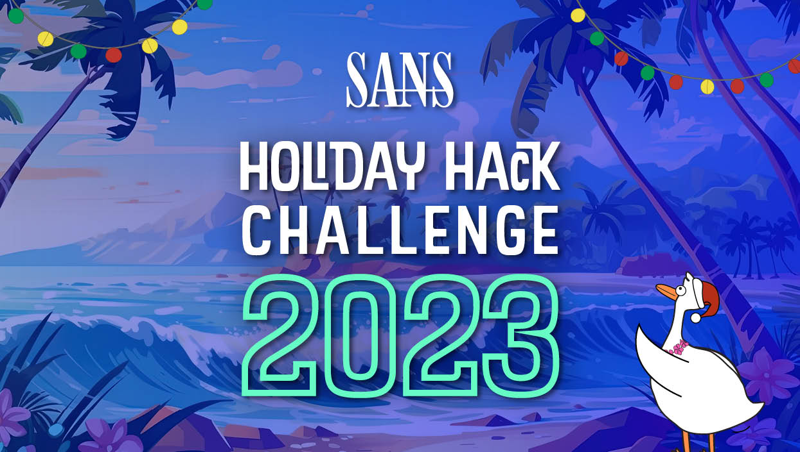

# 2023 SANS Holiday Hack Challenge: A Holiday Odyssey | Featuring 6: Geese A-Lei'ing!

[ctf](/tags#ctf ) [sans-holiday-hack](/tags#sans-holiday-hack )  
  
Jan 6, 2024

The 2023 challenge, _A Holiday Odyssey, Featuring 6: Geese A-Lei’ing!_ , takes
place in the Geese Islands, where Santa has moved his operation on the advice
of his new AI, ChatNPT. I’ll work through a series of technical (and physical)
challenges to find that it’s Jack Frost behind the AI, working from space,
trying to destroy Christmas. In the end, I’ll hack into his space system and
redirect his missile away from Earth into the sun. The SANS Holiday Hack is
something I look forward to each year, and 2023 did not disappoint.

## Table of Contents

The 2023 event takes place in the Geese Islands, where each island has a Goose
that hangs out there with various ports where I can dock my ship and explore:

The challenge presents 22 objectives (with 2 more bonus objectives) which I
can get details about at the following locations:

Each of these objectives is explained in detail at the following links:

  * [Orientation](/holidayhack2023/orientation)
  * [Frosty's Beach](/holidayhack2023/frostys)
  * [Rudolph's Rest](/holidayhack2023/rudolphs)
  * [Rainraster Cliffs](/holidayhack2023/rainraster)
  * [Brass Bouy Port](/holidayhack2023/brassbouy)
  * [Coggoggle Marina](/holidayhack2023/coggoggle)
  * [Squarewheel Yard](/holidayhack2023/squarewheel)
  * [Scaredy Kite Heights](/holidayhack2023/scaredykite)
  * [Gameboy Hunt and Hack](/holidayhack2023/gameboy)
  * [The Blacklight District](/holidayhack2023/blacklight)
  * [Chiaroscuro City](/holidayhack2023/chiaroscuro)
  * [Space Island](/holidayhack2023/space)

[Orientation »](/holidayhack2023/orientation)

