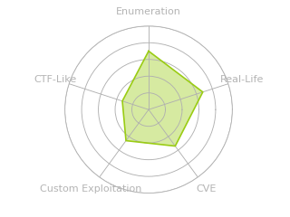
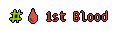

# HTB: Scrambled

[htb-scrambled](/tags#htb-scrambled ) [ctf](/tags#ctf )
[hackthebox](/tags#hackthebox ) [kerberos](/tags#kerberos )
[deserialization](/tags#deserialization ) [windows](/tags#windows ) [silver-
ticket](/tags#silver-ticket ) [reverse-engineering](/tags#reverse-engineering
) [mssql](/tags#mssql ) [oscp-like](/tags#oscp-like )  
  
Oct 1, 2022

  * Intro
  * [From Windows](/2022/10/01/htb-scrambled-win.html)
  * [From Linux](/2022/10/01/htb-scrambled-linux.html)
  * [Alternative Roots](/2022/10/01/htb-scrambled-beyond-root.html)

Scrambled presented a purely Windows-based path. There are some hints on a
webpage, and from there the exploitation is all Windows. NTLM authentication
is disabled for the box, so a lot of the tools I’m used to using won’t work,
or at least work differently. I’ll find user creds with hints from the page,
and get some more hints from a file share. I’ll kerberoast and get a
challenge/response for a service account, and use that to generate a silver
ticket, getting access to the MSSQL instance. From there, I’ll get some more
creds, and use those to get access to a share with some custom dot net
executables. I’ll reverse those to find a deserialization vulnerability, and
exploit that to get a shell as SYSTEM. Because the tooling for this box is so
different I’ll show it from both Linux and Windows attack systems. In Beyond
Root, two other ways to abuse the MSSQL access, via file read and
JuicyPotatoNG.

## Box Info

Name | [Scrambled](https://hacktheboxltd.sjv.io/g1jVD9?u=https%3A%2F%2Fapp.hackthebox.com%2Fmachines%2Fscrambled)   
[Play on
HackTheBox](https://hacktheboxltd.sjv.io/g1jVD9?u=https%3A%2F%2Fapp.hackthebox.com%2Fmachines%2Fscrambled)  
---|---  
Release Date | [11 Jun 2022](https://twitter.com/hackthebox_eu/status/1534565945590554626)  
Retire Date | 01 Oct 2022  
OS | Windows   
Base Points | Medium [30]  
Rated Difficulty |   
Radar Graph |   
 | 01:06:15[ Wh04m1](https://app.hackthebox.com/users/4483)  
  
 | 01:05:01[ Wh04m1](https://app.hackthebox.com/users/4483)  
  
Creator | [ VbScrub](https://app.hackthebox.com/users/158833)  
  
  
## Fork

Scrambled was all about core Windows concepts. There are many tools in Linux
to interact with these, but they almost all differ from the native tools in
Windows used for the same purpose. For this machine, almost every step was
different on Linux and Windows, so I’m going to show both! Select either one
here, or navigate via the menu on the left side.

 |    
---|---  
### [From Windows](/2022/10/01/htb-scrambled-win.html) |  ### [From Linux](/2022/10/01/htb-scrambled-linux.html)  
  

